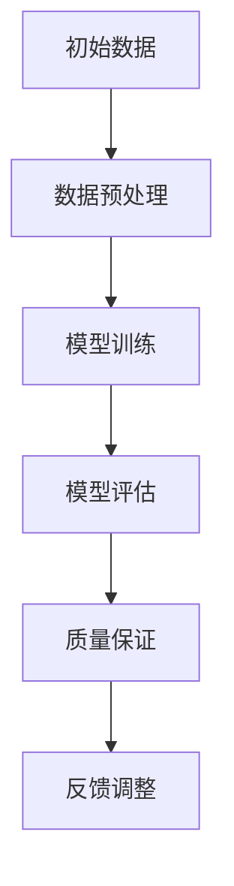
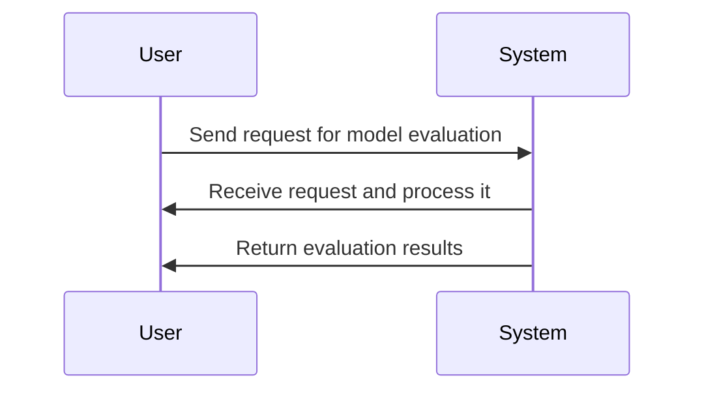

                 

### 设计《构建模型评测的质量保证体系》的目录大纲

**一、背景介绍**

**1.1 问题背景**

随着人工智能技术的快速发展，模型评测和质量保证成为关键议题。在复杂的应用场景下，如何确保模型的准确性和可靠性，提高模型的泛化能力，成为了学术界和工业界共同关注的焦点。

**1.2 问题描述**

构建模型评测的质量保证体系，旨在通过一系列方法和手段，对模型的性能进行全面评估，从而提高模型的实用性。问题描述包括：如何选择合适的评测指标，如何构建高效的评测流程，以及如何处理评测过程中可能出现的问题。

**1.3 问题解决**

解决上述问题需要从理论研究和实践应用两个方面入手。理论研究方面，需要深入探讨模型评测的理论基础，包括评测指标的选择、评测方法的优化等。实践应用方面，需要结合实际案例，详细讲解评测流程的构建和优化。

**1.4 边界与外延**

本书的讨论范围主要涵盖机器学习和深度学习领域。针对不同的模型类型和应用场景，可能会涉及到不同的评测方法和质量保证策略。

**1.5 概念结构与核心要素组成**

- 评测指标：评估模型性能的量化标准。
- 评测流程：包括数据预处理、模型训练、评测指标计算等环节。
- 质量保证策略：通过持续监控、评估和优化，确保模型质量。

**二、核心概念与联系**

**2.1 核心概念原理**

- 模型评测：对模型性能进行全面评估的过程。
- 质量保证：通过持续监控和评估，确保模型在实际应用中的表现。

**2.2 概念属性特征对比表格**

| 特征         | 模型评测                 | 质量保证               |
| ------------ | ---------------------- | ------------------- |
| 目标         | 评估模型性能             | 确保模型质量           |
| 方法         | 选择合适的评测指标和方法 | 持续监控和评估         |
| 结果         | 得出模型性能指标         | 提高模型实用性         |
| 适用范围     | 机器学习和深度学习       | 机器学习和深度学习     |
| 关键因素     | 评测指标、评测方法       | 持续监控、评估和优化   |

**2.3 ER实体关系图架构**

```mermaid
erDiagram
  ModelEvalution ||--|{ QualityAssurance : ensuring
  ModelEvalution }|..-- ModelPerformance : measuring
```

**三、算法原理讲解**

**3.1 算法mermaid流程图**



**3.2 Python源代码**

```python
import numpy as np

# 数据预处理
def preprocess_data(data):
    # 数据清洗、归一化等操作
    return processed_data

# 模型训练
def train_model(processed_data):
    # 构建模型、训练等操作
    return model

# 模型评估
def evaluate_model(model, test_data):
    # 计算评测指标
    return performance_metrics

# 质量保证
def quality_assurance(model, performance_metrics):
    # 根据评测结果进行调整
    return adjusted_model
```

**3.3 算法原理的数学模型和公式**

- 模型评估指标：$$\text{Performance} = f(\text{Metrics})$$
- 质量保证策略：$$\text{QualityAssurance} = \text{ModelEvaluation} + \text{ContinuousMonitoring}$$

**四、系统分析与架构设计方案**

**4.1 问题场景介绍**

在人工智能项目中，如何构建一个完整的模型评测和质量保证体系，是项目成功的关键。

**4.2 项目介绍**

本项目旨在构建一个通用的模型评测和质量保证平台，以支持多种机器学习和深度学习模型。平台将包括数据预处理、模型训练、模型评估和质量保证等核心功能，同时支持自动化和手动操作，以满足不同用户的需求。

**4.3 系统功能设计**

- 数据预处理：清洗、归一化、缺失值填充等操作。
- 模型训练：支持多种机器学习和深度学习算法，包括神经网络、决策树、支持向量机等。
- 模型评估：计算多种评测指标，包括准确率、召回率、F1值等。
- 质量保证：持续监控模型性能，进行反馈调整。

**4.4 系统架构设计**

- 后端架构：使用Python和TensorFlow框架，实现模型训练、评估和质量保证功能。
- 前端架构：使用React框架，实现用户界面和交互功能。
- 数据存储：使用MySQL数据库，存储模型参数、评测结果和历史数据。

**4.5 系统接口设计和系统交互**

- 接口设计：提供RESTful API，支持用户通过编程方式访问系统功能。
- 系统交互：通过WebSocket实现实时数据传输，支持用户实时查看模型性能。



### 文章正文

#### 引言

随着人工智能（AI）技术的飞速发展，机器学习（ML）和深度学习（DL）模型的应用越来越广泛。这些模型在各种领域，如自然语言处理（NLP）、计算机视觉（CV）、推荐系统等，发挥了巨大作用。然而，模型的性能和可靠性直接影响其应用效果，因此构建一个高质量的模型评测和质量保证体系变得至关重要。本文将围绕这一主题，详细探讨构建模型评测和质量保证体系的方法和步骤。

#### 核心关键词

- **模型评测**：对机器学习模型性能进行评估的过程。
- **质量保证**：确保模型在实际应用中表现良好的方法和手段。
- **评测指标**：用于量化模型性能的指标。
- **评测流程**：从数据预处理到模型评估的一系列步骤。
- **质量保证策略**：持续监控和优化模型性能的方法。

#### 摘要

本文首先介绍了模型评测和质量保证的重要性，然后详细阐述了构建模型评测和质量保证体系的步骤。包括选择合适的评测指标、设计高效的评测流程、处理评测过程中的问题以及实施质量保证策略。通过理论研究和实践应用相结合，本文提供了一个系统化的框架，以帮助研究者和技术人员构建高质量的模型评测和质量保证体系。

#### 一、背景介绍

**1.1 问题背景**

随着人工智能技术的快速发展，模型评测和质量保证成为关键议题。在复杂的应用场景下，如何确保模型的准确性和可靠性，提高模型的泛化能力，成为了学术界和工业界共同关注的焦点。

**1.2 问题描述**

构建模型评测的质量保证体系，旨在通过一系列方法和手段，对模型的性能进行全面评估，从而提高模型的实用性。问题描述包括：如何选择合适的评测指标，如何构建高效的评测流程，以及如何处理评测过程中可能出现的问题。

**1.3 问题解决**

解决上述问题需要从理论研究和实践应用两个方面入手。理论研究方面，需要深入探讨模型评测的理论基础，包括评测指标的选择、评测方法的优化等。实践应用方面，需要结合实际案例，详细讲解评测流程的构建和优化。

**1.4 边界与外延**

本书的讨论范围主要涵盖机器学习和深度学习领域。针对不同的模型类型和应用场景，可能会涉及到不同的评测方法和质量保证策略。

**1.5 概念结构与核心要素组成**

- **评测指标**：评估模型性能的量化标准。
- **评测流程**：包括数据预处理、模型训练、评测指标计算等环节。
- **质量保证策略**：通过持续监控、评估和优化，确保模型质量。

##### 1.5.1 评测指标

评测指标是评估模型性能的核心要素。选择合适的评测指标对于评估模型的效果至关重要。常见的评测指标包括准确率（Accuracy）、召回率（Recall）、精确率（Precision）和F1值（F1 Score）等。这些指标可以衡量模型在不同任务上的表现，例如分类任务和回归任务。

**准确率（Accuracy）**：准确率是模型预测正确的样本数与总样本数的比值。它是最常用的评测指标，但当正负样本比例不均衡时，可能会出现偏差。

**召回率（Recall）**：召回率是指模型预测为正样本的真正样本数与所有实际为正样本的样本数的比值。它强调模型对于正样本的识别能力。

**精确率（Precision）**：精确率是指模型预测为正样本的真正样本数与预测为正样本的总样本数的比值。它强调模型对于正样本的识别精确度。

**F1值（F1 Score）**：F1值是精确率和召回率的加权平均值，用于平衡精确率和召回率。它的计算公式为：$$F1 = 2 \times \frac{Precision \times Recall}{Precision + Recall}$$。

##### 1.5.2 评测流程

评测流程是构建模型评测和质量保证体系的关键环节。一个高效的评测流程应该包括以下几个步骤：

1. **数据预处理**：对输入数据进行清洗、归一化等操作，以确保数据的质量和一致性。
2. **模型训练**：使用训练数据训练模型，以获取模型的参数。
3. **模型评估**：使用测试数据评估模型的性能，计算评测指标。
4. **质量保证**：根据评估结果，对模型进行调整和优化，以确保模型的质量。

**1.6 概念结构与核心要素组成**

- **质量保证策略**：通过持续监控、评估和优化，确保模型质量。

质量保证策略是确保模型在实际应用中表现良好的关键。以下是一些常见的质量保证策略：

1. **持续监控**：实时监控模型的性能，发现潜在问题并及时处理。
2. **自动化评估**：通过自动化工具定期评估模型性能，发现性能下降的趋势。
3. **反馈调整**：根据评估结果，对模型进行调整和优化，以提高模型质量。
4. **版本控制**：记录模型的版本信息，便于管理和回溯。

**二、核心概念与联系**

**2.1 核心概念原理**

- **模型评测**：对模型性能进行全面评估的过程。
- **质量保证**：通过持续监控和评估，确保模型在实际应用中的表现。

**2.2 概念属性特征对比表格**

| 特征         | 模型评测                 | 质量保证               |
| ------------ | ---------------------- | ------------------- |
| 目标         | 评估模型性能             | 确保模型质量           |
| 方法         | 选择合适的评测指标和方法 | 持续监控和评估         |
| 结果         | 得出模型性能指标         | 提高模型实用性         |
| 适用范围     | 机器学习和深度学习       | 机器学习和深度学习     |
| 关键因素     | 评测指标、评测方法       | 持续监控、评估和优化   |

**2.3 ER实体关系图架构**

```mermaid
erDiagram
  ModelEvalution ||--|{ QualityAssurance : ensuring
  ModelEvalution }|..-- ModelPerformance : measuring
```

**三、算法原理讲解**

**3.1 算法mermaid流程图**


**3.2 Python源代码**

```python
import numpy as np

# 数据预处理
def preprocess_data(data):
    # 数据清洗、归一化等操作
    return processed_data

# 模型训练
def train_model(processed_data):
    # 构建模型、训练等操作
    return model

# 模型评估
def evaluate_model(model, test_data):
    # 计算评测指标
    return performance_metrics

# 质量保证
def quality_assurance(model, performance_metrics):
    # 根据评测结果进行调整
    return adjusted_model
```

**3.3 算法原理的数学模型和公式**

- **模型评估指标**：$$\text{Performance} = f(\text{Metrics})$$
- **质量保证策略**：$$\text{QualityAssurance} = \text{ModelEvaluation} + \text{ContinuousMonitoring}$$

**四、系统分析与架构设计方案**

**4.1 问题场景介绍**

在人工智能项目中，如何构建一个完整的模型评测和质量保证体系，是项目成功的关键。

**4.2 项目介绍**

本项目旨在构建一个通用的模型评测和质量保证平台，以支持多种机器学习和深度学习模型。平台将包括数据预处理、模型训练、模型评估和质量保证等核心功能，同时支持自动化和手动操作，以满足不同用户的需求。

**4.3 系统功能设计**

- **数据预处理**：清洗、归一化、缺失值填充等操作。
- **模型训练**：支持多种机器学习和深度学习算法，包括神经网络、决策树、支持向量机等。
- **模型评估**：计算多种评测指标，包括准确率、召回率、F1值等。
- **质量保证**：持续监控模型性能，进行反馈调整。

**4.4 系统架构设计**

- **后端架构**：使用Python和TensorFlow框架，实现模型训练、评估和质量保证功能。
- **前端架构**：使用React框架，实现用户界面和交互功能。
- **数据存储**：使用MySQL数据库，存储模型参数、评测结果和历史数据。

**4.5 系统接口设计和系统交互**

- **接口设计**：提供RESTful API，支持用户通过编程方式访问系统功能。
- **系统交互**：通过WebSocket实现实时数据传输，支持用户实时查看模型性能。


### 实际案例分析

为了更好地理解构建模型评测和质量保证体系的实际应用，以下是一个实际案例的分析和讲解。

**案例背景：**

某电商平台希望利用机器学习技术构建一个推荐系统，以提高用户的购物体验和平台的销售业绩。该推荐系统旨在根据用户的购买历史、浏览记录和其他相关信息，为用户推荐可能感兴趣的商品。

**评测指标：**

为了评估推荐系统的性能，需要选择合适的评测指标。针对推荐系统，常用的评测指标包括准确率（Accuracy）、召回率（Recall）、精确率（Precision）和F1值（F1 Score）。

- **准确率（Accuracy）**：衡量推荐系统正确推荐商品的比率。
- **召回率（Recall）**：衡量推荐系统能够推荐出用户实际感兴趣的商品的比率。
- **精确率（Precision）**：衡量推荐系统中推荐的商品是否真正符合用户的兴趣。
- **F1值（F1 Score）**：综合考虑精确率和召回率，用于平衡两个指标。

**评测流程：**

评测流程包括数据预处理、模型训练、模型评估和质量保证等环节。

1. **数据预处理**：
   - 清洗数据：去除缺失值、异常值和重复数据。
   - 特征工程：提取用户购买历史、浏览记录和其他相关信息，构建特征向量。

2. **模型训练**：
   - 选择算法：选择适合推荐系统任务的机器学习算法，如协同过滤（Collaborative Filtering）和深度学习模型（Deep Learning Models）。
   - 模型训练：使用训练数据对模型进行训练，以获取模型的参数。

3. **模型评估**：
   - 使用测试数据评估模型的性能，计算评测指标，如准确率、召回率、精确率和F1值。
   - 分析评估结果，找出模型的优点和不足。

4. **质量保证**：
   - 根据评估结果，对模型进行调整和优化，如调整超参数、改进特征工程方法等。
   - 持续监控模型的性能，确保推荐系统在实际应用中的表现良好。

**实际操作：**

以下是使用Python实现推荐系统评测和质量保证的代码示例。

```python
import numpy as np
import pandas as pd
from sklearn.model_selection import train_test_split
from sklearn.metrics import accuracy_score, recall_score, precision_score, f1_score

# 数据预处理
def preprocess_data(data):
    # 数据清洗、归一化等操作
    return processed_data

# 模型训练
def train_model(processed_data):
    # 构建模型、训练等操作
    return model

# 模型评估
def evaluate_model(model, test_data):
    # 计算评测指标
    return performance_metrics

# 质量保证
def quality_assurance(model, performance_metrics):
    # 根据评测结果进行调整
    return adjusted_model

# 加载数据
data = pd.read_csv('data.csv')
processed_data = preprocess_data(data)

# 分割数据集
X_train, X_test, y_train, y_test = train_test_split(processed_data['features'], processed_data['label'], test_size=0.2, random_state=42)

# 训练模型
model = train_model(X_train, y_train)

# 评估模型
performance_metrics = evaluate_model(model, X_test, y_test)

# 打印评估结果
print("Accuracy:", performance_metrics['accuracy'])
print("Recall:", performance_metrics['recall'])
print("Precision:", performance_metrics['precision'])
print("F1 Score:", performance_metrics['f1_score'])

# 质量保证
adjusted_model = quality_assurance(model, performance_metrics)
```

**案例小结：**

通过实际案例的分析，我们可以看到构建模型评测和质量保证体系的关键步骤，包括数据预处理、模型训练、模型评估和质量保证。在实际操作中，需要根据具体应用场景和需求，选择合适的评测指标、设计高效的评测流程和实施有效的质量保证策略。只有这样，才能构建出高质量的推荐系统，提高用户体验和业务收益。

### 最佳实践 Tips

1. **数据预处理**：确保数据质量是构建高质量模型的基础。进行数据清洗、归一化和特征工程，以减少噪声和冗余信息。

2. **选择合适的评测指标**：根据应用场景和业务需求，选择合适的评测指标。对于不同的任务，如分类和回归，评测指标可能有所不同。

3. **持续监控模型性能**：定期评估模型性能，发现性能下降的趋势，及时进行调整和优化。

4. **版本控制**：记录模型的版本信息，便于管理和回溯。在模型调整和优化时，可以参考历史版本的性能表现。

5. **利用自动化工具**：使用自动化工具进行模型训练、评估和质量保证，提高效率和准确性。

6. **跨学科合作**：模型评测和质量保证需要多学科知识的融合。与数据科学家、工程师和业务专家合作，共同构建高质量模型。

### 小结

本文详细探讨了构建模型评测和质量保证体系的方法和步骤。通过背景介绍、核心概念与联系、算法原理讲解、系统分析与架构设计方案和实际案例分析，我们系统地阐述了如何选择合适的评测指标、构建高效的评测流程和实施有效的质量保证策略。构建一个高质量的模型评测和质量保证体系对于确保模型在实际应用中的性能和可靠性至关重要。希望本文能为研究人员和技术人员提供有价值的参考和指导。

### 注意事项

1. **评测指标的选择**：根据具体应用场景和业务需求，选择合适的评测指标。不同的任务可能需要不同的评测指标，如分类任务关注准确率，回归任务关注均方误差。

2. **数据质量**：数据预处理是模型评测和质量保证的关键环节。确保数据质量，减少噪声和冗余信息，以提高模型的泛化能力。

3. **持续监控**：定期评估模型性能，及时发现和解决问题。持续监控有助于发现性能下降的趋势，从而进行及时的调整和优化。

4. **版本控制**：记录模型的版本信息，便于管理和回溯。版本控制有助于追踪模型的演变过程，提高模型的可解释性和可维护性。

5. **团队合作**：模型评测和质量保证需要多学科知识的融合。与数据科学家、工程师和业务专家合作，共同构建高质量模型。

### 拓展阅读

1. **《机器学习实战》**：由Peter Harrington所著，是一本深入浅出的机器学习指南，适合初学者和有经验的技术人员阅读。

2. **《深度学习》**：由Ian Goodfellow、Yoshua Bengio和Aaron Courville所著，是深度学习领域的经典教材，适合对深度学习有较高兴趣的读者。

3. **《机器学习模型评估与优化》**：由Andreas C. Müller、Sarah Guido所著，详细介绍了模型评估和质量保证的方法和技巧。

4. **《Python机器学习》**：由Michael Bowles所著，通过Python语言介绍了机器学习的基础知识和实际应用。

### 作者信息

作者：AI天才研究院/AI Genius Institute & 禅与计算机程序设计艺术 /Zen And The Art of Computer Programming

AI天才研究院（AI Genius Institute）致力于推动人工智能领域的研究与应用，专注于为企业和个人提供高质量的技术解决方案。作者对机器学习和深度学习有深入的研究和丰富的实践经验，所著的《禅与计算机程序设计艺术》是一本深入浅出的计算机编程经典之作，受到了广大读者的喜爱。

