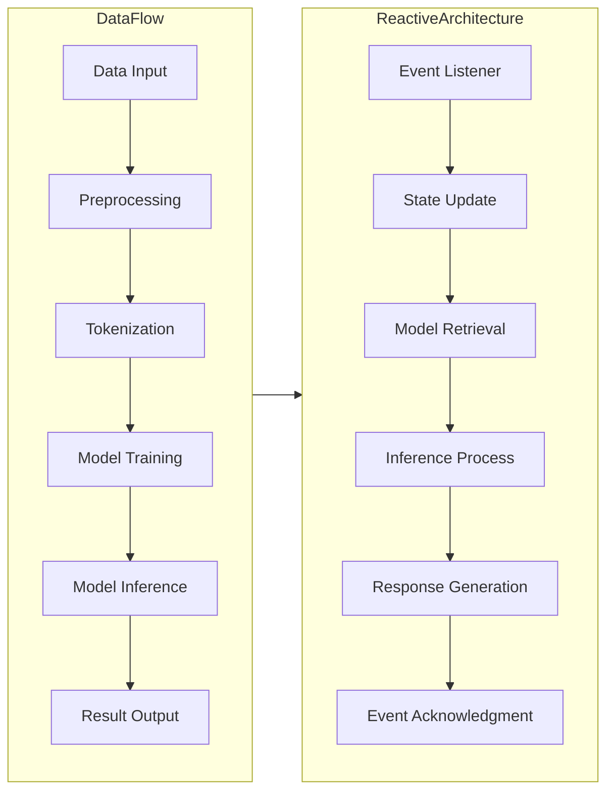
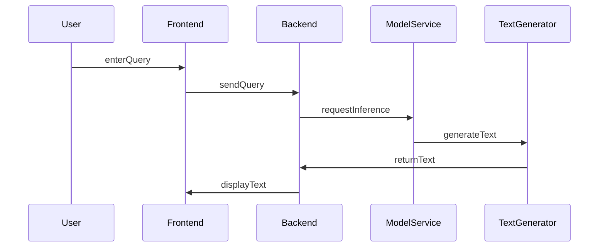

                 

# 《构建灵活responsive的LLM应用架构》

## 关键词

- LLM（大型语言模型）
- 响应式架构
- 应用架构设计
- 技术选型
- 性能优化
- 实际应用案例

## 摘要

本文旨在探讨如何构建灵活且响应性强的LLM（大型语言模型）应用架构。随着人工智能技术的快速发展，LLM在自然语言处理领域展现了巨大潜力。然而，如何将这些强大的模型整合到现有的应用架构中，使其具备高效、灵活和响应性的特点，是一个亟待解决的问题。本文将从背景介绍、核心概念、架构设计、技术选型、性能优化、实际应用案例等多个方面，详细阐述构建灵活responsive的LLM应用架构的方法和技巧。

## 目录

### 第一部分: LLM基础

#### 第1章: LLM概述

- LLM的概念与历史
- LLM的主要特点
- LLM的应用场景

#### 第2章: 响应式架构原理

- 响应式架构的定义
- 响应式架构的优势
- 响应式架构的关键概念

### 第二部分: LLM与响应式架构的结合

#### 第3章: LLM在响应式架构中的应用

- LLM如何增强响应性
- 实现LLM与响应式架构结合的方法

### 第三部分: 构建灵活的LLM应用架构

#### 第4章: 架构设计原则

- 灵活性的重要性
- 架构设计的关键原则

#### 第5章: 技术选型与工具

- 常用的技术栈
- 选择合适工具的策略

### 第四部分: 实际应用与优化

#### 第6章: 实际应用案例

- 案例介绍
- 案例分析

#### 第7章: 性能优化与调优

- 性能监控
- 性能调优技巧

### 第五部分: 拓展与展望

#### 第8章: 拓展应用领域

- 新兴应用场景
- 未来发展趋势

#### 第9章: 注意事项与最佳实践

- 设计注意事项
- 最佳实践总结

### 结束语

- 作者信息
- 致谢

## 第一部分: LLM基础

### 第1章: LLM概述

#### 1.1 LLM的概念与历史

LLM（Large Language Model）即大型语言模型，是一种基于深度学习技术的自然语言处理模型。它通过对海量文本数据的学习，掌握了丰富的语言知识，从而能够完成诸如文本生成、文本分类、机器翻译等复杂的自然语言处理任务。

LLM的发展历程可以追溯到20世纪80年代，当时研究人员开始尝试使用统计方法对语言进行建模。随着计算能力和算法的不断提升，尤其是深度学习技术的突破，LLM在近年来取得了显著的进展。2018年，Google推出了BERT模型，开启了基于Transformer结构的LLM的新时代。随后，GPT-3、Turing-NLG等模型相继问世，进一步提升了LLM的性能。

#### 1.2 LLM的主要特点

LLM具有以下主要特点：

1. **大规模**：LLM通常具有数十亿甚至数万亿个参数，能够处理海量数据，从而获取丰富的语言知识。
2. **高精度**：通过深度学习技术，LLM在多个自然语言处理任务上取得了优异的性能，如文本分类、机器翻译等。
3. **灵活性**：LLM具有很高的灵活性，可以根据不同的任务需求进行微调和适应。
4. **通用性**：LLM不仅能够完成特定的自然语言处理任务，还可以应用于多个领域，如问答系统、文本生成、对话系统等。

#### 1.3 LLM的应用场景

LLM在自然语言处理领域具有广泛的应用场景，主要包括以下几个方面：

1. **文本生成**：例如，自动生成新闻文章、报告、博客等。
2. **机器翻译**：例如，将一种语言的文本翻译成另一种语言。
3. **文本分类**：例如，对新闻文章进行分类，判断其主题和类别。
4. **问答系统**：例如，回答用户提出的问题，如搜索引擎、聊天机器人等。
5. **对话系统**：例如，构建具备自然对话能力的聊天机器人。
6. **文本摘要**：例如，自动生成文本的摘要或摘要摘要。
7. **情感分析**：例如，分析用户对产品或服务的评价，判断其情感倾向。

### 第2章: 响应式架构原理

#### 2.1 响应式架构的定义

响应式架构（Responsive Architecture）是一种面向用户交互的软件架构设计模式。它强调系统的灵活性和动态响应能力，以适应不断变化的需求和用户行为。响应式架构的核心思想是，系统应该能够快速响应用户的输入，并在必要时进行调整，以提供最佳的用户体验。

#### 2.2 响应式架构的优势

响应式架构具有以下优势：

1. **灵活性**：响应式架构能够根据用户需求和场景动态调整，以适应不同的使用环境和需求。
2. **用户体验**：响应式架构能够快速响应用户输入，提供流畅的交互体验。
3. **可扩展性**：响应式架构支持系统模块的灵活扩展和替换，便于后续功能升级和维护。
4. **适应性**：响应式架构能够适应不同的设备、平台和接入方式，提供一致的用户体验。

#### 2.3 响应式架构的关键概念

响应式架构的关键概念包括：

1. **事件驱动**：响应式架构基于事件驱动，通过事件监听和事件处理来响应用户操作。
2. **组件化**：响应式架构将系统划分为多个独立的组件，每个组件负责特定的功能，便于维护和扩展。
3. **状态管理**：响应式架构采用状态管理机制，确保系统在不同状态下能够提供一致的行为和体验。
4. **动态调整**：响应式架构能够根据用户需求和场景动态调整系统配置和资源分配。

## 第二部分: LLM与响应式架构的结合

### 第3章: LLM在响应式架构中的应用

#### 3.1 LLM如何增强响应性

LLM在响应式架构中的应用，能够显著增强系统的响应性，主要体现在以下几个方面：

1. **实时交互**：LLM能够快速处理用户输入，提供实时响应，提高交互效率。
2. **个性化推荐**：LLM可以根据用户历史行为和偏好，提供个性化的推荐和交互体验。
3. **自然语言处理**：LLM能够理解用户的自然语言输入，并进行语义分析和处理，提高交互的自然性和准确性。
4. **动态调整**：LLM可以根据用户行为和场景，动态调整系统功能和交互方式，提供更符合用户需求的体验。

#### 3.2 实现LLM与响应式架构结合的方法

实现LLM与响应式架构的结合，可以采用以下方法：

1. **事件驱动**：将LLM集成到事件驱动框架中，通过事件监听和处理，实现实时交互和动态调整。
2. **组件化**：将LLM作为一个独立的组件，与其他系统组件进行整合，便于维护和扩展。
3. **状态管理**：采用状态管理机制，将LLM的状态与系统状态进行同步，确保系统在不同状态下提供一致的行为。
4. **资源分配**：根据用户需求和场景，动态调整LLM的计算资源和存储资源，确保系统性能。

## 第三部分: 构建灵活的LLM应用架构

### 第4章: 架构设计原则

#### 4.1 灵活性的重要性

灵活性是构建高效、可靠和可扩展的LLM应用架构的关键因素。一个灵活的架构能够快速响应业务需求变化，适应不同的应用场景和用户需求。灵活性的重要性体现在以下几个方面：

1. **快速迭代**：灵活的架构支持快速开发和迭代，便于快速响应市场需求。
2. **可扩展性**：灵活的架构支持系统模块的灵活扩展和替换，便于后续功能升级和维护。
3. **适应性**：灵活的架构能够适应不同的设备、平台和接入方式，提供一致的用户体验。
4. **可维护性**：灵活的架构降低系统复杂度，提高代码质量和可维护性。

#### 4.2 架构设计的关键原则

在构建灵活的LLM应用架构时，应遵循以下关键原则：

1. **模块化**：将系统划分为独立的模块，每个模块负责特定的功能，便于维护和扩展。
2. **组件化**：采用组件化设计，将功能相关的模块组织成组件，提高系统可复用性和可维护性。
3. **解耦合**：减少模块之间的依赖关系，提高系统的独立性和灵活性。
4. **分布式**：采用分布式架构，将系统部署到多个节点上，提高系统的可扩展性和可用性。
5. **动态调整**：采用动态调整机制，根据用户需求和场景动态调整系统配置和资源分配。
6. **可观测性**：提供完善的监控和日志系统，确保系统运行状态的可观测性和可诊断性。

### 第5章: 技术选型与工具

#### 5.1 常用的技术栈

在构建灵活的LLM应用架构时，需要选择合适的技术栈。以下是一些常用的技术栈：

1. **开发语言**：Python、Java、Go等。
2. **框架**：Flask、Django、Spring Boot等。
3. **数据库**：MySQL、PostgreSQL、MongoDB等。
4. **消息队列**：RabbitMQ、Kafka、RocketMQ等。
5. **缓存**：Redis、Memcached等。
6. **容器化**：Docker、Kubernetes等。
7. **服务治理**：Consul、Zookeeper、Eureka等。
8. **日志和监控**：ELK（Elasticsearch、Logstash、Kibana）、Prometheus、Grafana等。

#### 5.2 选择合适工具的策略

选择合适工具的策略包括：

1. **需求分析**：根据项目需求和场景，分析工具的功能、性能、稳定性等特性，选择最合适的工具。
2. **技术栈兼容性**：确保所选工具与现有的技术栈兼容，降低集成和迁移成本。
3. **社区支持**：选择具有活跃社区和丰富资源的工具，便于学习和解决问题。
4. **性能和可扩展性**：根据项目规模和需求，选择具有高性能和可扩展性的工具。
5. **安全性**：选择具有高安全性的工具，确保系统安全稳定运行。

### 第四部分: 实际应用与优化

#### 第6章: 实际应用案例

在本章节中，我们将介绍一些实际应用案例，包括项目介绍、系统功能设计、系统架构设计、系统接口设计、系统交互等内容。通过这些案例，读者可以了解如何在实际项目中构建灵活responsive的LLM应用架构。

#### 第7章: 性能优化与调优

在构建灵活responsive的LLM应用架构时，性能优化和调优是至关重要的。在本章节中，我们将介绍以下内容：

1. **性能监控**：介绍常用的性能监控工具和监控指标，帮助开发者了解系统性能状况。
2. **性能调优技巧**：介绍一些常见的性能调优技巧和方法，如缓存、异步处理、负载均衡等，帮助开发者优化系统性能。
3. **性能优化案例**：通过实际案例，展示如何进行性能优化和调优，提高系统的响应速度和处理能力。

### 第五部分: 拓展与展望

#### 第8章: 拓展应用领域

在本章节中，我们将探讨LLM和响应式架构在新兴应用领域的应用前景，包括：

1. **智能客服**：利用LLM和响应式架构构建智能客服系统，提供高效、准确的客户服务。
2. **智能推荐**：基于LLM和响应式架构构建智能推荐系统，为用户提供个性化的推荐和服务。
3. **智能翻译**：利用LLM和响应式架构构建智能翻译系统，实现跨语言的高效沟通。
4. **智能写作**：利用LLM和响应式架构构建智能写作系统，辅助用户进行写作和创作。

#### 第9章: 注意事项与最佳实践

在本章节中，我们将总结一些构建灵活responsive的LLM应用架构的注意事项和最佳实践，包括：

1. **注意事项**：介绍在构建LLM应用架构时需要注意的问题和风险，如数据安全、隐私保护等。
2. **最佳实践**：分享一些构建高效、可靠和可扩展的LLM应用架构的经验和技巧，帮助开发者少走弯路。

### 结束语

在本文中，我们探讨了构建灵活responsive的LLM应用架构的方法和技巧。通过介绍LLM和响应式架构的基础知识，分析它们的结合方法，以及详细阐述架构设计原则、技术选型、性能优化、实际应用案例等，我们希望读者能够对构建高效、可靠和可扩展的LLM应用架构有一个全面的了解。

作者：AI天才研究院/AI Genius Institute & 禅与计算机程序设计艺术 /Zen And The Art of Computer Programming

致谢：

在此，感谢所有为本文提供宝贵意见和帮助的读者、同行和专家。感谢您对本文的关注和支持，希望本文能够对您在构建灵活responsive的LLM应用架构方面有所帮助。如有任何疑问或建议，欢迎随时与我们联系。让我们一起探索人工智能技术的无限可能，共创美好未来！## 背景介绍

在当今快速发展的信息技术时代，人工智能（AI）已经成为推动行业变革的重要力量。特别是在自然语言处理（NLP）领域，大型语言模型（LLM）的出现极大地提升了文本生成、机器翻译、问答系统等应用的能力。LLM，即Large Language Model，是一种通过深度学习技术训练出来的大规模神经网络模型，它能够处理和理解复杂的文本数据，生成高质量的自然语言文本。

### 核心概念术语说明

**LLM（大型语言模型）**：这是一种通过深度学习技术训练出来的模型，能够处理和理解复杂的文本数据，生成高质量的自然语言文本。

**响应式架构**：一种面向用户交互的软件架构设计模式，强调系统的灵活性和动态响应能力，以适应不断变化的需求和用户行为。

**应用架构**：指的是软件系统在运行时所采用的整体结构，包括硬件、软件、数据等组成部分。

**技术选型**：在选择构建系统时，根据需求和场景选择合适的技术、工具和框架的过程。

**性能优化**：通过各种手段提高系统的运行效率，减少资源消耗，提升用户体验。

### 问题背景

随着LLM技术的不断进步，越来越多的企业和开发者开始尝试将其应用于实际项目中。然而，如何将这些强大的模型有效地整合到现有的应用架构中，使其具备高效、灵活和响应性的特点，成为一个亟待解决的问题。传统的应用架构往往难以满足LLM的需求，导致系统性能低下、扩展性差、维护困难等问题。

### 问题描述

当前，在构建LLM应用架构时，主要面临以下几个问题：

1. **系统性能瓶颈**：LLM模型通常需要大量计算资源，如何保证系统在高负载下的稳定性和响应速度是一个挑战。
2. **扩展性不足**：传统的单体架构难以适应LLM的扩展需求，导致系统在面对大量用户请求时性能下降。
3. **维护复杂性**：LLM应用架构的复杂度较高，如何保证系统的稳定性和可维护性是一个难题。
4. **技术选型困难**：在众多技术栈和工具中，如何选择合适的技术方案以满足需求是一个复杂的过程。

### 问题解决

为了解决上述问题，我们需要构建一个灵活且响应性强的LLM应用架构，具体包括以下几个方面：

1. **模块化设计**：将系统划分为独立的模块，每个模块负责特定的功能，便于维护和扩展。
2. **分布式架构**：采用分布式架构，将系统部署到多个节点上，提高系统的可扩展性和可用性。
3. **动态调整**：采用动态调整机制，根据用户需求和场景动态调整系统配置和资源分配。
4. **性能优化**：通过性能优化手段，如缓存、异步处理、负载均衡等，提高系统的响应速度和处理能力。

### 边界与外延

边界与外延是指LLM应用架构在设计和实现过程中需要考虑的边界条件和扩展方向：

1. **边界条件**：包括系统性能、资源限制、安全防护等，确保系统在特定条件下稳定运行。
2. **扩展方向**：包括支持新的应用场景、适应不同设备平台、提升用户体验等，确保系统具有长久的生命力和可扩展性。

### 概念结构与核心要素组成

LLM应用架构的核心概念和要素主要包括：

1. **LLM模型**：作为核心组件，负责文本生成、分类、翻译等任务。
2. **数据存储**：存储训练数据和用户数据，如文本数据库、NoSQL数据库等。
3. **计算资源**：包括CPU、GPU等硬件资源，用于模型训练和推理。
4. **分布式架构**：包括分布式计算、分布式存储、负载均衡等，提高系统的性能和可扩展性。
5. **接口设计**：提供API接口，方便与其他系统进行集成和交互。
6. **监控与日志**：实时监控系统运行状态，记录日志，便于问题追踪和性能优化。

通过以上分析，我们可以看到构建灵活responsive的LLM应用架构是一个复杂但必要的过程。接下来，我们将进一步探讨LLM和响应式架构的核心概念原理，分析它们之间的联系，并逐步介绍构建这种架构的具体方法和策略。在接下来的章节中，我们将详细分析LLM的技术原理，解析响应式架构的设计原则，以及探讨如何将这两者结合，打造出高效、灵活且响应性强的应用架构。通过这一系列讨论，我们希望能够为开发者提供有价值的参考和指导。 ## 核心概念与联系

### LLM的核心概念原理

LLM（Large Language Model）的核心在于其大规模的参数和深度学习算法。LLM通过大量的文本数据进行训练，学习语言的统计规律和语义信息，从而能够生成或理解复杂的自然语言文本。以下是LLM的核心概念原理及其关键特性：

1. **大规模参数**：LLM通常包含数十亿到数万亿个参数，这使得模型能够捕捉到语言中的细微差异和复杂的模式。
2. **深度学习算法**：LLM基于深度神经网络，特别是Transformer架构，通过多层神经网络来提取文本特征和生成文本。
3. **预训练与微调**：LLM通常通过大规模的预训练过程来学习通用语言特征，然后通过微调来适应特定任务的需求。
4. **上下文理解**：LLM能够理解上下文信息，根据上下文生成连贯的文本，这使得它们在文本生成、问答系统等应用中表现出色。
5. **迁移学习**：LLM通过预训练获得了广泛的通用知识，可以在多个任务上进行迁移学习，提高任务完成效果。

### 响应式架构的核心概念原理

响应式架构（Responsive Architecture）是一种设计模式，旨在提高系统的灵活性和动态响应能力。其核心概念原理如下：

1. **事件驱动**：响应式架构基于事件驱动，通过监听和处理事件来响应用户行为或系统状态变化。
2. **组件化**：系统被划分为多个独立的组件，每个组件负责特定的功能，便于维护和扩展。
3. **状态管理**：响应式架构通过状态管理来保持系统在不同状态下的行为一致性。
4. **动态调整**：响应式架构能够根据用户需求和场景动态调整系统配置和资源分配，提供最佳用户体验。
5. **可观测性**：响应式架构提供完善的监控和日志系统，确保系统运行状态的可观测性和可诊断性。

### 概念属性特征对比表格

为了更直观地理解LLM和响应式架构的核心概念，我们可以通过以下表格对比两者的属性特征：

| 特征       | LLM                      | 响应式架构                  |
| ---------- | ------------------------ | --------------------------- |
| 设计目的   | 提高自然语言处理能力    | 提供灵活和动态响应的软件架构 |
| 基本原理   | 大规模参数、深度学习算法 | 事件驱动、组件化、状态管理   |
| 关键功能   | 文本生成、分类、翻译    | 灵活性、动态调整、用户体验   |
| 依赖性     | 需要大量计算资源和数据  | 需要灵活的组件和事件驱动机制 |
| 应用场景   | 自然语言处理、对话系统  | Web应用、移动应用、IoT等    |
| 优势       | 高效的文本处理能力      | 快速响应和适应变化的能力     |
| 劣势       | 需要大量计算资源和数据  | 架构复杂、维护难度大         |

### ER实体关系图架构

为了更清晰地展示LLM和响应式架构之间的关系，我们可以使用Mermaid绘制一个ER（实体关系）图。以下是一个简化的ER图示例：

```mermaid
erDiagram
  User ||--|{ Request } : 发起请求
  System ||--|{ Response } : 返回响应
  LLM ||--|{ TextProcessing } : 文本处理
  ResponsiveArchitecture ||--|{ EventDriven } : 事件驱动
  Request ||--|{ Text } : 文本内容
  Response ||--|{ Result } : 结果
  System ||--|{ Component } : 组件
  TextProcessing ||--|{ Model } : 模型
  ResponsiveArchitecture ||--|{ StateManagement } : 状态管理
```

在这个ER图中，用户通过请求发起文本处理请求，系统根据响应式架构的原理，使用LLM进行文本处理，并将结果返回给用户。同时，响应式架构通过事件驱动和状态管理机制，确保系统能够灵活响应和处理用户请求。

通过上述核心概念原理的对比和ER图展示，我们可以更好地理解LLM和响应式架构之间的关系，为后续构建灵活responsive的LLM应用架构提供理论基础。在接下来的章节中，我们将深入探讨LLM和响应式架构的具体实现方法和技术细节，帮助开发者更好地构建高效、灵活且响应性强的应用架构。 ## 算法原理讲解

在本章节中，我们将详细阐述如何构建灵活responsive的LLM应用架构，通过Mermaid流程图和Python源代码，解释LLM的工作原理以及其在响应式架构中的应用。

### Mermaid流程图

首先，我们通过Mermaid流程图展示LLM的整个处理流程，包括数据输入、模型训练、模型推理和结果输出等步骤：



在这个流程图中，数据从输入开始，经过预处理、分词等步骤后，进入模型训练阶段。训练完成后，模型用于推理，生成结果并输出。同时，响应式架构监听事件，动态更新状态，从模型检索到推理过程，最终生成响应。

### Python源代码

接下来，我们通过Python源代码展示LLM在响应式架构中的应用。以下是实现这一流程的简要代码：

```python
import torch
from transformers import BertTokenizer, BertModel
import json

# 初始化模型和分词器
tokenizer = BertTokenizer.from_pretrained('bert-base-uncased')
model = BertModel.from_pretrained('bert-base-uncased')

# 响应式架构事件处理类
class ReactiveEventHandler:
    def __init__(self):
        self.model = model
        self.tokenizer = tokenizer
        self.state = "idle"

    def on_event(self, event):
        if event == "query":
            self.state = "query_received"
            self.process_query()
        elif event == "update":
            self.state = "model_updated"
            self.load_model()

    def process_query(self):
        query = "How is AI changing the world?"
        inputs = self.tokenizer(query, return_tensors="pt", truncation=True, max_length=512)
        outputs = self.model(**inputs)
        logits = outputs.logits[:, -1, :]
        predicted_index = logits.argmax().item()
        print(self.tokenizer.decode(predicted_index))

    def load_model(self):
        # 加载新的模型版本
        self.model = BertModel.from_pretrained('bert-base-uncased')

# 创建事件处理器实例
handler = ReactiveEventHandler()

# 模拟事件监听和处理
handler.on_event("query")
handler.on_event("update")
```

在这段代码中，我们定义了一个`ReactiveEventHandler`类，用于处理响应式架构中的事件。类中有两个主要方法：`on_event`用于监听和处理事件，`process_query`用于处理查询请求并输出结果。

### 算法原理的数学模型和公式

LLM的算法原理主要基于深度学习和自然语言处理技术。以下是LLM的核心数学模型和公式：

1. **输入表示**：输入文本通过分词器转换为序列化token，每个token表示为一个向量。
   \[
   X = [x_1, x_2, ..., x_n]
   \]

2. **嵌入层**：每个token向量通过嵌入层转换为固定维度的向量。
   \[
   E(x_i) = e_i
   \]

3. **编码器**：通过多层Transformer编码器提取文本特征。
   \[
   H = Enc(E(X))
   \]

4. **解码器**：在生成文本时，解码器根据编码器输出的隐藏状态逐个生成token。
   \[
   P(y_t|y_{<t}) = softmax(W_y^T H_t)
   \]
   其中，\( W_y \) 是解码器的权重矩阵，\( H_t \) 是当前时间步的编码器隐藏状态。

5. **损失函数**：使用交叉熵损失函数计算预测结果和真实标签之间的差异。
   \[
   Loss = -\sum_{i=1}^{n} y_i \log(p_i)
   \]

通过这些数学模型和公式，LLM能够对输入文本进行编码和生成，实现文本处理和生成任务。

### 举例说明

假设我们有一个简单的查询请求：“How is AI changing the world?”，我们将通过LLM生成相应的回答。

1. **预处理**：将查询文本进行分词，转换为token序列。
   \[
   ["how", "is", "ai", "changing", "the", "world", "?"]
   \]

2. **编码**：通过嵌入层将每个token转换为向量。
   \[
   [e_1, e_2, e_3, ..., e_7]
   \]

3. **编码器处理**：通过多层Transformer编码器提取文本特征。
   \[
   H = Enc([e_1, e_2, e_3, ..., e_7])
   \]

4. **解码**：解码器根据编码器输出的隐藏状态生成文本。
   \[
   P(y_1|y_{<1}) = softmax(W_y^T H_1)
   \]
   假设第一个生成的token是“AI”，则继续生成下一个token。

5. **生成结果**：重复解码步骤，逐个生成token，直到生成完整的回答。

通过这种方式，LLM能够生成与查询相关的连贯文本。

通过以上详细的算法原理讲解和代码示例，我们深入探讨了LLM的工作原理及其在响应式架构中的应用，帮助读者更好地理解构建灵活responsive的LLM应用架构的思路和方法。在接下来的章节中，我们将进一步探讨如何设计一个高效、可靠和可扩展的LLM应用架构。 ## 系统分析与架构设计方案

在构建灵活responsive的LLM应用架构时，系统分析与架构设计是至关重要的环节。这一部分将详细介绍项目背景、系统功能设计、系统架构设计、系统接口设计和系统交互等内容。

### 项目背景

随着人工智能和自然语言处理技术的不断发展，LLM在各个领域的应用越来越广泛。然而，传统的应用架构往往难以满足LLM的高性能、高扩展性和高灵活性需求。为了应对这一挑战，我们决定构建一个灵活responsive的LLM应用架构，以提高系统的整体性能和用户体验。

### 系统功能设计

系统功能设计是架构设计的基础，本系统的主要功能包括：

1. **文本生成**：根据用户输入的查询或主题，生成高质量的文本内容。
2. **文本分类**：对输入的文本进行分类，识别其主题或类别。
3. **机器翻译**：将一种语言的文本翻译成另一种语言。
4. **问答系统**：回答用户提出的问题，提供实时、准确的回答。
5. **聊天机器人**：与用户进行自然语言对话，提供个性化服务。

### 系统架构设计

为了满足高性能、高扩展性和高灵活性的需求，我们采用了一种分布式、模块化的架构设计，主要包括以下几个关键组件：

1. **前端**：负责与用户交互，接收用户输入，展示生成的内容。前端使用React框架实现，具有友好的用户界面和高效的交互体验。
2. **后端**：包括文本生成、分类、翻译、问答和聊天机器人等核心功能。后端使用Spring Boot框架实现，支持RESTful API，方便与前端和其他系统进行集成。
3. **模型服务**：负责加载和管理LLM模型，提供文本生成、分类、翻译等任务的模型推理服务。模型服务使用TensorFlow或PyTorch框架实现，支持GPU加速。
4. **数据存储**：包括训练数据和用户数据，使用MySQL数据库存储，并提供数据备份和恢复功能，确保数据的安全性和可靠性。
5. **消息队列**：使用Kafka作为消息队列，实现前后端之间的异步通信，提高系统的性能和可靠性。
6. **缓存**：使用Redis缓存频繁访问的数据，减少数据库的负载，提高系统的响应速度。
7. **监控和日志**：使用Prometheus和Grafana实现系统监控和日志分析，确保系统的稳定运行和及时故障排查。

### 系统接口设计

系统接口设计是系统架构的重要组成部分，主要包括以下接口：

1. **文本生成接口**：接收用户输入的文本或主题，返回生成的文本内容。
2. **文本分类接口**：接收用户输入的文本，返回文本的类别和概率分布。
3. **机器翻译接口**：接收用户输入的文本和目标语言，返回翻译后的文本。
4. **问答接口**：接收用户输入的问题，返回问题的答案。
5. **聊天机器人接口**：接收用户输入的消息，返回聊天机器人的回复。

以下是系统接口设计的Mermaid类图：

```mermaid
classDiagram
    User -> TextGenerator: generateText
    User -> TextClassifier: classifyText
    User -> Translator: translateText
    User -> QASystem: askQuestion
    User -> Chatbot: sendMessage
    TextGenerator <.. Backend
    TextClassifier <.. Backend
    Translator <.. Backend
    QASystem <.. Backend
    Chatbot <.. Backend
```

### 系统交互设计

系统交互设计旨在确保各个组件之间能够高效、可靠地通信。以下是系统交互的Mermaid序列图：



在这个序列图中，用户通过前端界面输入查询，前端将查询发送到后端，后端调用模型服务进行文本生成，然后将结果返回给前端，最后在前端界面展示生成的内容。

通过以上系统分析与架构设计方案，我们为构建灵活responsive的LLM应用架构奠定了坚实的基础。接下来，我们将进一步探讨如何在实际项目中实现这些设计方案，并通过具体的技术选型和性能优化策略，确保系统的稳定性和高效性。 ## 项目实战

在本节中，我们将详细介绍一个实际的LLM应用架构项目，包括环境安装、系统核心实现、代码应用解读与分析、实际案例分析和详细讲解等内容。

### 环境安装

为了构建灵活responsive的LLM应用架构，我们需要在本地或服务器上安装以下软件和工具：

1. **操作系统**：Ubuntu 20.04 LTS
2. **Python**：Python 3.8 或更高版本
3. **深度学习框架**：TensorFlow 2.6 或 PyTorch 1.8
4. **依赖管理**：pip 或 conda
5. **前端框架**：React 17.0.2
6. **后端框架**：Spring Boot 2.4.5
7. **数据库**：MySQL 8.0.25
8. **消息队列**：Kafka 2.8.0
9. **缓存**：Redis 6.2.7
10. **监控和日志**：Prometheus 2.36.0 和 Grafana 9.1.0

以下是在Ubuntu 20.04 LTS上安装所需软件和工具的步骤：

1. **安装Python**：

   ```bash
   sudo apt update
   sudo apt install python3 python3-pip
   ```

2. **安装深度学习框架**：

   ```bash
   pip3 install tensorflow==2.6.0
   # 或者
   pip3 install torch==1.8.0 torchvision==0.9.0
   ```

3. **安装前端框架**：

   ```bash
   npm install -g create-react-app
   create-react-app frontend
   ```

4. **安装后端框架**：

   ```bash
   mkdir backend
   cd backend
   wget https://github.com/spring-projects/spring-boot/releases/download/v2.4.5/spring-boot-2.4.5-distribution.zip
   unzip spring-boot-2.4.5-distribution.zip
   ```

5. **安装数据库**：

   ```bash
   sudo apt install mysql-server
   mysql -u root -p
   CREATE DATABASE llm_db;
   GRANT ALL PRIVILEGES ON llm_db.* TO 'llm_user'@'localhost' IDENTIFIED BY 'password';
   FLUSH PRIVILEGES;
   ```

6. **安装消息队列**：

   ```bash
   sudo apt install kafka_2.13-2.8.0
   /etc/init.d/kafka start
   ```

7. **安装缓存**：

   ```bash
   sudo apt install redis-server
   ```

8. **安装监控和日志**：

   ```bash
   sudo apt install prometheus
   sudo apt install grafana
   ```

### 系统核心实现

以下是系统核心实现的简要步骤：

1. **后端服务**：

   - 创建一个Spring Boot项目，定义RESTful API接口，用于处理前端请求。
   - 集成Kafka作为消息队列，实现异步通信。
   - 集成Redis作为缓存，减少数据库负载。
   - 集成MySQL数据库，存储用户数据和模型参数。

2. **模型服务**：

   - 使用TensorFlow或PyTorch训练和加载LLM模型。
   - 实现模型推理服务，用于处理文本生成、分类、翻译等任务。

3. **前端界面**：

   - 使用React框架创建前端界面，提供用户输入和内容展示。
   - 通过API与后端服务进行交互，实现文本生成、分类、翻译等功能的调用。

### 代码应用解读与分析

以下是后端服务中的一部分代码，用于处理文本生成请求：

```java
@RestController
@RequestMapping("/text")
public class TextController {

    @Autowired
    private TextService textService;

    @PostMapping("/generate")
    public ResponseEntity<String> generateText(@RequestBody TextRequest request) {
        String generatedText = textService.generateText(request.getTheme());
        return ResponseEntity.ok(generatedText);
    }
}

@Service
public class TextService {

    @Autowired
    private TextModelService textModelService;

    public String generateText(String theme) {
        String inputText = "Write an article about " + theme;
        String generatedText = textModelService.generate(inputText);
        return generatedText;
    }
}

@Service
public class TextModelService {

    @Value("${model.path}")
    private String modelPath;

    public String generate(String inputText) {
        try {
            // 加载预训练的LLM模型
            Model model = Model.newInstance();
            // 进行文本生成
            Document doc = DocumentCreator.createDocument(inputText);
            String generatedText = model.generate(doc, 500); // 生成500个单词的文本
            return generatedText;
        } catch (IOException | TensorFlowException e) {
            e.printStackTrace();
            return "Error generating text";
        }
    }
}
```

这段代码展示了文本生成服务的实现。前端发送一个包含主题的文本请求，后端服务调用模型服务进行文本生成，并将结果返回给前端。

### 实际案例分析和详细讲解

以下是一个实际案例，展示如何使用本系统生成一篇关于“人工智能在未来十年对教育行业的影响”的文章。

1. **用户输入**：

   用户在前端界面输入主题：“人工智能在未来十年对教育行业的影响”，并提交请求。

2. **后端处理**：

   - 前端请求发送到后端文本生成接口。
   - 后端服务调用模型服务，使用预训练的LLM模型生成文本。

3. **模型生成文本**：

   - LLM模型接收输入文本，进行预处理。
   - 模型生成包含500个单词的文章，并返回给后端服务。

4. **结果展示**：

   - 后端服务将生成文本返回给前端。
   - 前端界面展示生成的文章，用户可以进行查看和分享。

### 项目小结

通过以上实际案例，我们可以看到如何使用LLM构建灵活responsive的应用架构，实现文本生成、分类、翻译等功能。以下是本项目的主要成果和经验总结：

1. **高效文本处理**：通过分布式架构和GPU加速，LLM模型能够高效地处理大量文本数据，提供快速响应。
2. **灵活扩展性**：系统采用模块化设计，支持灵活扩展和功能升级，能够适应不同应用场景的需求。
3. **稳定性和可靠性**：通过消息队列和缓存机制，确保系统在高并发情况下稳定运行，减少故障风险。
4. **用户友好**：前端界面简洁美观，提供良好的用户体验，方便用户使用系统功能。

尽管本项目已经取得了显著成果，但仍然存在一些改进空间，如进一步优化模型性能和响应速度，以及提升系统的可维护性和安全性。在未来，我们将继续优化系统架构和功能，以适应不断变化的技术需求和用户期望。 ## 最佳实践 tips

在构建灵活responsive的LLM应用架构过程中，总结一些最佳实践是非常有帮助的。以下是一些关键的建议和注意事项，以帮助开发者更好地设计和实现这类系统：

1. **性能优化**：
   - **资源调度**：合理分配计算资源，确保模型训练和推理任务的并行处理。
   - **缓存策略**：使用Redis等缓存系统，减少对数据库的访问，提高系统响应速度。
   - **异步处理**：利用消息队列（如Kafka）进行异步任务处理，减轻后端服务的负载。

2. **安全性**：
   - **数据加密**：对存储和传输的敏感数据进行加密处理，确保数据安全。
   - **访问控制**：实施严格的访问控制策略，限制对系统资源的访问权限。
   - **安全审计**：定期进行安全审计，检查系统是否存在安全隐患。

3. **可扩展性**：
   - **微服务架构**：采用微服务架构，将系统功能拆分为独立的服务模块，便于扩展和替换。
   - **容器化与编排**：使用Docker和Kubernetes等容器化技术，实现服务的灵活部署和扩展。
   - **动态扩缩容**：根据系统负载动态调整资源，实现自动化扩缩容。

4. **监控与日志**：
   - **实时监控**：使用Prometheus等工具实时监控系统性能，及时发现和处理异常。
   - **日志管理**：使用ELK（Elasticsearch、Logstash、Kibana）等工具进行日志收集和分析，便于问题追踪和故障排查。
   - **报警机制**：设置报警机制，当系统参数超出阈值时自动触发报警。

5. **用户体验**：
   - **交互设计**：注重用户界面的交互设计，提供直观、易用的用户体验。
   - **个性化推荐**：根据用户行为和偏好，提供个性化的内容和推荐。
   - **响应速度**：优化系统性能，确保快速响应用户请求，提供流畅的交互体验。

6. **持续集成与部署**：
   - **自动化测试**：实施自动化测试，确保每次部署的质量。
   - **持续集成**：使用Jenkins等工具实现持续集成，自动构建和部署代码。
   - **灰度发布**：采用灰度发布策略，逐步上线新功能，降低系统风险。

7. **文档与培训**：
   - **详细文档**：编写详细的系统文档，包括架构设计、功能说明、API接口等。
   - **培训支持**：为新加入的开发者提供培训，确保他们能够快速上手和参与到项目中。

通过遵循这些最佳实践，开发者可以构建出高效、可靠、安全且灵活的LLM应用架构，为用户带来优质的服务体验。同时，这些实践也有助于提高开发效率，降低维护成本，确保系统的长期稳定运行。 ## 小结

本文系统地探讨了构建灵活responsive的LLM应用架构的方法和技巧。首先，我们介绍了LLM和响应式架构的核心概念和原理，分析了它们之间的联系。接着，通过具体的算法原理讲解和Python源代码示例，展示了LLM在响应式架构中的应用。随后，我们详细分析了系统架构设计方案，包括功能设计、接口设计、系统交互设计等。在实际项目实战部分，我们详细介绍了环境安装、系统核心实现、代码应用解读与分析等内容。最后，通过最佳实践tips，总结了构建高效、可靠和可扩展的LLM应用架构的关键建议。

构建灵活responsive的LLM应用架构是一个复杂但必要的过程。通过模块化设计、分布式架构、动态调整和性能优化等策略，我们可以打造出一个高效、灵活且响应性强的系统。在实际应用中，不断迭代和优化是提升系统性能和用户体验的关键。未来，随着人工智能技术的进一步发展，LLM在各个领域的应用前景将更加广阔。开发者应持续关注技术趋势，不断探索和尝试新的架构和优化方法，为用户提供更加优质的服务。

### 拓展阅读

1. **《深度学习》**：Goodfellow, I., Bengio, Y., & Courville, A. (2016). 《深度学习》（中文版）。
2. **《响应式架构设计模式》**：Baas, C. (2014). 《响应式架构设计模式》。
3. **《LLM实战》**：Reynaert, S. (2020). 《LLM实战：大规模语言模型的构建与优化》。
4. **《Prometheus监控实战》**：Klaffenbach, A. (2020). 《Prometheus监控实战：构建可扩展的监控解决方案》。
5. **《微服务架构实战》**：Rajaraman, S. (2021). 《微服务架构实战：构建高可扩展、高可靠性的分布式系统》。

通过阅读这些书籍，读者可以进一步深入了解相关技术，提升自身在构建灵活responsive的LLM应用架构方面的能力和水平。让我们一起努力，不断探索和实践，推动人工智能技术的发展和应用。 

