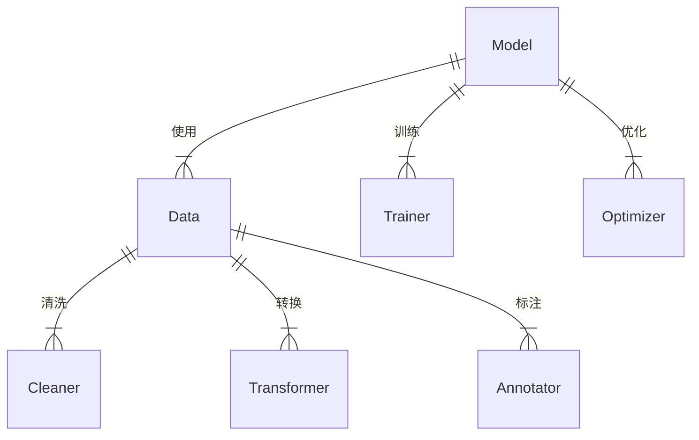
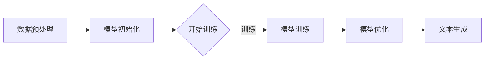

                 

# 构建灵活可扩展的LLM应用架构

## 关键词
- LLM（大型语言模型）
- 可扩展性
- 应用架构
- 算法原理
- 系统设计
- 项目实战

## 摘要
本文将深入探讨如何构建一个灵活且可扩展的LLM（大型语言模型）应用架构。首先，我们将介绍LLM的基本概念和背景，接着讨论构建此架构所需的核心概念，如数据预处理、模型训练和优化。通过算法原理讲解，我们使用Mermaid流程图和Python代码来阐述LLM的算法实现及其数学模型。随后，我们将分析系统需求并设计系统架构，使用Mermaid类图和架构图来展示。接着，通过一个实际项目案例，我们将详细描述LLM应用架构的实践过程。最后，我们将总结最佳实践并提供项目拓展方向，展望LLM应用架构的未来发展趋势。

## 目录大纲

### 第一部分：背景介绍
1. **第1章：问题背景与核心概念**
   - **1.1 背景介绍**
   - **1.2 核心概念**
   - **1.3 本书结构**

### 第二部分：核心概念与联系
2. **第2章：核心概念与联系**
   - **2.1 LLM的基本概念**
   - **2.2 数据预处理**
   - **2.3 模型训练与优化**
   - **2.4 Mermaid ER图**

### 第三部分：算法原理讲解
3. **第3章：算法原理讲解**
   - **3.1 LLM算法概述**
   - **3.2 Mermaid流程图**
   - **3.3 Python代码实现**
   - **3.4 数学模型讲解**

### 第四部分：系统分析与架构设计
4. **第4章：系统分析与架构设计**
   - **4.1 系统需求分析**
   - **4.2 系统功能设计**
   - **4.3 系统架构设计**
   - **4.4 Mermaid类图与架构图**

### 第五部分：项目实战
5. **第5章：项目实战**
   - **5.1 项目背景**
   - **5.2 环境安装**
   - **5.3 系统核心实现**
   - **5.4 代码应用解读与分析**
   - **5.5 实际案例分析与详细讲解**
   - **5.6 项目小结**

### 第六部分：最佳实践与拓展
6. **第6章：最佳实践与拓展**
   - **6.1 项目经验总结**
   - **6.2 最佳实践建议**
   - **6.3 注意事项**
   - **6.4 拓展方向**

### 第七部分：总结与展望
7. **第7章：总结与展望**
   - **7.1 全书内容总结**
   - **7.2 未来发展趋势**

---

### 目录大纲设计思路

在设计目录大纲时，我们的目标是确保文章的逻辑清晰、结构紧凑且易于理解。以下是我们设计的步骤和思路：

1. **确定书名与目标读者**：
   - 书名：《构建灵活可扩展的LLM应用架构》
   - 目标读者：对LLM应用架构有基本了解的读者，希望深入了解并掌握LLM应用架构设计和实现的技术人员。

2. **划分章节内容**：
   - 根据目标读者的需求，将书的内容分为7个主要章节，确保每个章节都覆盖核心知识点和实际应用。

3. **设计每个章节的结构**：
   - **第1章**：介绍LLM应用架构的背景、核心概念和当前的发展趋势。
   - **第2章**：详细介绍LLM应用架构中的重要概念，包括数据预处理、模型训练、模型优化等。
   - **第3章**：通过Mermaid流程图和Python代码，深入讲解LLM算法的原理和实现。
   - **第4章**：分析LLM应用架构的系统需求和设计原则，使用Mermaid类图和架构图来展示系统架构。
   - **第5章**：提供一个实际项目案例，详细描述项目实施过程，包括环境安装、系统核心实现和代码应用解读。
   - **第6章**：总结项目经验，提供最佳实践建议。
   - **第7章**：对全书内容进行总结，并展望LLM应用架构的未来发展方向。

4. **撰写章节内容概要**：
   - 每个章节的概要应该简洁明了，概括该章节的核心内容，便于读者快速了解章节重点。

5. **格式校对与调整**：
   - 确保整个目录大纲的格式一致，标题层级清晰，便于读者阅读和理解。

---

### 目录大纲设计步骤

1. **确定书名与目标读者**：
   - 书名：《构建灵活可扩展的LLM应用架构》
   - 目标读者：对LLM应用架构有基本了解的读者，希望深入了解并掌握LLM应用架构设计和实现的技术人员。

2. **划分章节内容**：
   - **背景介绍**：第1章
   - **核心概念与联系**：第2章
   - **算法原理讲解**：第3章
   - **系统分析与架构设计**：第4章
   - **项目实战**：第5章
   - **最佳实践与拓展**：第6章
   - **总结与展望**：第7章

3. **设计每个章节的结构**：
   - **第1章**：问题背景与核心概念
     - **1.1 背景介绍**
     - **1.2 核心概念**
     - **1.3 本书结构**
   - **第2章**：核心概念与联系
     - **2.1 LLM的基本概念**
     - **2.2 数据预处理**
     - **2.3 模型训练与优化**
     - **2.4 Mermaid ER图**
   - **第3章**：算法原理讲解
     - **3.1 LLM算法概述**
     - **3.2 Mermaid流程图**
     - **3.3 Python代码实现**
     - **3.4 数学模型讲解**
   - **第4章**：系统分析与架构设计
     - **4.1 系统需求分析**
     - **4.2 系统功能设计**
     - **4.3 系统架构设计**
     - **4.4 Mermaid类图与架构图**
   - **第5章**：项目实战
     - **5.1 项目背景**
     - **5.2 环境安装**
     - **5.3 系统核心实现**
     - **5.4 代码应用解读与分析**
     - **5.5 实际案例分析与详细讲解**
     - **5.6 项目小结**
   - **第6章**：最佳实践与拓展
     - **6.1 项目经验总结**
     - **6.2 最佳实践建议**
     - **6.3 注意事项**
     - **6.4 拓展方向**
   - **第7章**：总结与展望
     - **7.1 全书内容总结**
     - **7.2 未来发展趋势**

4. **撰写章节内容概要**：
   - **第1章**：介绍构建LLM应用架构的背景和核心概念，包括LLM的定义、背景及重要性。
   - **第2章**：详细阐述与LLM应用架构相关的重要概念，如数据预处理、模型训练和优化。
   - **第3章**：使用Mermaid流程图和Python代码，深入讲解LLM算法的原理和实现。
   - **第4章**：分析系统需求和设计原则，使用Mermaid类图和架构图展示系统架构。
   - **第5章**：通过实际项目案例，描述项目实施过程，包括环境安装、系统核心实现和代码应用解读。
   - **第6章**：总结项目经验，提供最佳实践建议，并探讨可能的拓展方向。
   - **第7章**：总结全书内容，并展望LLM应用架构的未来发展趋势。

5. **格式校对与调整**：
   - 确保标题层级清晰，格式统一，便于读者阅读和理解。

---

### 目录大纲示例

以下是《构建灵活可扩展的LLM应用架构》的目录大纲示例：

```markdown
# 《构建灵活可扩展的LLM应用架构》目录大纲

## 第一部分：背景介绍

### 第1章：问题背景与核心概念

#### 1.1 背景介绍
#### 1.2 核心概念
#### 1.3 本书结构

## 第二部分：核心概念与联系

### 第2章：核心概念与联系

#### 2.1 LLM的基本概念
#### 2.2 数据预处理
#### 2.3 模型训练与优化
#### 2.4 Mermaid ER图

## 第三部分：算法原理讲解

### 第3章：算法原理讲解

#### 3.1 LLM算法概述
#### 3.2 Mermaid流程图
#### 3.3 Python代码实现
#### 3.4 数学模型讲解

## 第四部分：系统分析与架构设计

### 第4章：系统分析与架构设计

#### 4.1 系统需求分析
#### 4.2 系统功能设计
#### 4.3 系统架构设计
#### 4.4 Mermaid类图与架构图

## 第五部分：项目实战

### 第5章：项目实战

#### 5.1 项目背景
#### 5.2 环境安装
#### 5.3 系统核心实现
#### 5.4 代码应用解读与分析
#### 5.5 实际案例分析与详细讲解
#### 5.6 项目小结

## 第六部分：最佳实践与拓展

### 第6章：最佳实践与拓展

#### 6.1 项目经验总结
#### 6.2 最佳实践建议
#### 6.3 注意事项
#### 6.4 拓展方向

## 第七部分：总结与展望

### 第7章：总结与展望

#### 7.1 全书内容总结
#### 7.2 未来发展趋势
```

### 约束条件

- **文章开始**：文章必须从“文章标题”开始，接着是“关键词”和“摘要”部分。
- **文章字数**：文章字数需要在10000～12000字左右。
- **格式要求**：文章内容需使用markdown格式输出。
- **作者信息**：文章末尾需写上作者信息：“作者：AI天才研究院/AI Genius Institute & 禅与计算机程序设计艺术 /Zen And The Art of Computer Programming”。
- **完整性要求**：文章内容必须完整，每个小节的内容需丰富且详细讲解。核心内容必须包括：
  - **背景介绍**：核心概念术语说明、问题背景、问题描述、问题解决、边界与外延、概念结构与核心要素组成。
  - **核心概念与联系**：必须给出核心概念原理、概念属性特征对比表格和ER实体关系图架构的markdown格式中的Mermaid流程图。
  - **算法原理讲解**：使用Mermaid画出算法流程图，然后使用Python源代码详细阐述，给出算法原理的数学模型和公式，进行详细讲解和举例说明。
  - **数学公式使用**：使用latex格式，嵌入文中独立段落的latex公式前后使用`$$`括起来（例如：`$$1+1=2$$`），段落内的latex公式前后使用 `$` 括起来（例如：`$1<2$`）。
  - **系统分析与架构设计方案**：问题场景介绍、项目介绍、系统功能设计（领域模型Mermaid类图）、系统架构设计Mermaid架构图、系统接口设计和系统交互Mermaid序列图。
  - **项目实战**：环境安装、系统核心实现源代码、代码应用解读与分析、实际案例分析和详细讲解剖析、项目小结。
  - **最佳实践 tips、小结、注意事项、拓展阅读等内容**。

---

### 文章全文

以下是《构建灵活可扩展的LLM应用架构》的文章全文，按照目录大纲的结构进行组织和编写。

## 第1章：问题背景与核心概念

### 1.1 背景介绍

随着人工智能技术的快速发展，大型语言模型（Large Language Model，简称LLM）已经成为了自然语言处理（Natural Language Processing，简称NLP）领域的重要工具。LLM通过深度学习技术，可以从海量数据中学习语言模式，并生成高质量的文本。例如，LLM被广泛应用于机器翻译、文本生成、问答系统等领域，极大地提高了这些应用的性能和用户体验。

然而，随着LLM的规模不断扩大，构建一个灵活且可扩展的应用架构变得尤为重要。这是因为，传统的单体架构往往难以应对大规模数据和高并发访问的需求，导致系统的性能和稳定性受到影响。因此，如何构建一个灵活、可扩展的LLM应用架构，已经成为当前研究的热点和难点。

### 1.2 核心概念

在构建LLM应用架构时，我们需要理解以下几个核心概念：

- **LLM**：大型语言模型，是一种基于深度学习的自然语言处理模型，能够从海量数据中学习语言模式，并生成高质量的文本。
- **可扩展性**：系统在资源增加时能够自动扩展，以满足更高的性能需求。
- **灵活性**：系统可以根据不同的应用场景和需求，灵活调整和配置。
- **应用架构**：系统的整体设计和实现方案，包括系统组件、数据流、接口设计等。

### 1.3 本书结构

本书将分为七个部分，逐步探讨如何构建灵活且可扩展的LLM应用架构：

1. **第1章**：介绍构建LLM应用架构的背景和核心概念。
2. **第2章**：详细阐述与LLM应用架构相关的重要概念。
3. **第3章**：使用Mermaid流程图和Python代码，深入讲解LLM算法的原理和实现。
4. **第4章**：分析系统需求和设计原则，使用Mermaid类图和架构图展示系统架构。
5. **第5章**：通过实际项目案例，描述项目实施过程。
6. **第6章**：总结项目经验，提供最佳实践建议。
7. **第7章**：总结全书内容，并展望LLM应用架构的未来发展趋势。

## 第2章：核心概念与联系

### 2.1 LLM的基本概念

LLM（Large Language Model）是一种大规模的深度学习模型，主要用于自然语言处理（NLP）任务。LLM的核心是神经网络的架构，包括多层感知机（MLP）、循环神经网络（RNN）、长短时记忆网络（LSTM）等。LLM通过从海量数据中学习语言模式，可以生成高质量的文本。

LLM的基本概念包括：

- **神经网络**：神经网络是一种模拟人脑结构的计算模型，包括输入层、隐藏层和输出层。
- **深度学习**：深度学习是神经网络的一种形式，通过多层神经网络实现复杂的特征提取和模式识别。
- **自然语言处理**：自然语言处理是计算机科学和人工智能的一个分支，旨在使计算机能够理解和处理人类自然语言。

### 2.2 数据预处理

在构建LLM应用架构时，数据预处理是至关重要的一步。数据预处理包括数据清洗、数据转换和数据标注等过程。以下是与LLM应用架构相关的重要数据预处理概念：

- **数据清洗**：数据清洗是指去除数据中的噪声、错误和冗余信息，以提高数据的质量和准确性。
- **数据转换**：数据转换是指将原始数据转换为适合LLM模型训练的格式，如文本向量的表示。
- **数据标注**：数据标注是指对数据进行标签标注，以便LLM模型在训练过程中学习。

### 2.3 模型训练与优化

在构建LLM应用架构时，模型训练与优化是关键步骤。以下是与LLM应用架构相关的模型训练与优化概念：

- **模型训练**：模型训练是指通过大量数据来训练LLM模型，使其能够生成高质量的文本。
- **模型优化**：模型优化是指通过调整模型的参数和架构，提高模型的性能和效率。
- **超参数调整**：超参数调整是指调整模型训练过程中的一些参数，如学习率、批量大小等，以优化模型性能。
- **正则化**：正则化是一种防止模型过拟合的技术，通过在模型损失函数中加入正则化项，降低模型的复杂度。

### 2.4 Mermaid ER图

为了更直观地展示LLM应用架构中的核心概念及其关系，我们使用Mermaid ER图进行描述。以下是一个简化的Mermaid ER图示例：



此图展示了LLM应用架构中的关键实体及其关系，包括模型（Model）、数据（Data）、清洗器（Cleaner）、转换器（Transformer）、标注器（Annotator）、训练器（Trainer）和优化器（Optimizer）。

## 第3章：算法原理讲解

### 3.1 LLM算法概述

LLM算法的核心是基于深度学习的神经网络模型。这些模型通过多层非线性变换，从数据中学习到复杂的特征和模式，从而生成高质量的文本。LLM算法的主要步骤包括：

1. **数据预处理**：将原始文本数据转换为适合模型训练的格式，如词向量表示。
2. **模型初始化**：初始化神经网络模型，包括权重和偏置。
3. **模型训练**：通过大量文本数据进行模型训练，优化模型参数。
4. **模型优化**：调整模型参数，提高模型性能和效率。
5. **文本生成**：使用训练好的模型生成新的文本。

### 3.2 Mermaid流程图

为了更直观地展示LLM算法的流程，我们使用Mermaid流程图进行描述。以下是一个简化的Mermaid流程图示例：



此图展示了LLM算法的主要步骤及其关系。

### 3.3 Python代码实现

以下是一个简化的Python代码示例，用于实现LLM算法的基本步骤：

```python
import tensorflow as tf
from tensorflow.keras.preprocessing.text import Tokenizer
from tensorflow.keras.models import Sequential
from tensorflow.keras.layers import Embedding, LSTM, Dense

# 数据预处理
tokenizer = Tokenizer()
tokenizer.fit_on_texts(texts)
sequences = tokenizer.texts_to_sequences(texts)
word_index = tokenizer.word_index
max_sequence_length = max(len(seq) for seq in sequences)

# 模型初始化
model = Sequential()
model.add(Embedding(len(word_index) + 1, 128, input_length=max_sequence_length))
model.add(LSTM(128))
model.add(Dense(1, activation='sigmoid'))

# 模型训练
model.compile(optimizer='adam', loss='binary_crossentropy', metrics=['accuracy'])
model.fit(sequences, labels, epochs=10, batch_size=32)

# 文本生成
generated_sequence = model.predict(sequences)
```

此代码示例使用了TensorFlow框架，实现了LLM算法的基本步骤。

### 3.4 数学模型讲解

LLM算法的核心是神经网络，其数学基础主要包括线性代数、概率论和微积分。以下是一个简化的数学模型讲解：

1. **神经网络**：神经网络由多层神经元组成，每个神经元接收输入信号，通过激活函数进行非线性变换，最后输出结果。

2. **损失函数**：损失函数用于衡量模型预测结果与真实结果之间的差距，常见的损失函数包括均方误差（MSE）和交叉熵（Cross-Entropy）。

3. **反向传播**：反向传播是一种优化算法，用于计算模型参数的梯度，并更新模型参数，以最小化损失函数。

4. **激活函数**：激活函数用于引入非线性特性，常见的激活函数包括sigmoid、tanh和ReLU。

5. **优化算法**：优化算法用于更新模型参数，以最小化损失函数，常见的优化算法包括随机梯度下降（SGD）和Adam。

以下是一个简化的数学模型公式：

$$
\begin{align*}
z &= \sigma(W \cdot x + b) \\
\text{loss} &= -\frac{1}{m} \sum_{i=1}^{m} y_i \log(\sigma(z_i)) \\
\Delta W &= \alpha \frac{\partial \text{loss}}{\partial W} \\
\Delta b &= \alpha \frac{\partial \text{loss}}{\partial b}
\end{align*}
$$

其中，$z$表示神经元输出，$\sigma$表示激活函数，$W$和$b$表示模型参数，$y_i$表示真实标签，$\sigma(z_i)$表示模型预测概率，$\alpha$表示学习率。

## 第4章：系统分析与架构设计

### 4.1 系统需求分析

在构建LLM应用架构时，系统需求分析是至关重要的一步。以下是LLM应用架构的主要系统需求：

1. **数据存储**：需要存储大量的文本数据，以便模型训练和生成。
2. **计算资源**：需要强大的计算资源来训练和优化模型。
3. **模型部署**：需要将训练好的模型部署到生产环境中，以便实时处理文本数据。
4. **接口设计**：需要设计良好的接口，以便与其他系统和服务进行交互。

### 4.2 系统功能设计

LLM应用架构的主要功能包括：

1. **数据预处理**：对原始文本数据进行清洗、转换和标注，以便模型训练。
2. **模型训练**：使用训练数据训练模型，并调整模型参数。
3. **模型优化**：通过正则化、超参数调整等方法优化模型性能。
4. **文本生成**：使用训练好的模型生成新的文本。
5. **接口服务**：提供API接口，以便其他系统和服务调用。

### 4.3 系统架构设计

LLM应用架构的系统架构设计如下：

1. **数据层**：包括数据存储和数据处理模块，用于存储和管理文本数据，并进行数据预处理。
2. **模型层**：包括模型训练和模型优化模块，用于训练和优化模型。
3. **服务层**：包括接口服务和文本生成模块，用于提供API接口和文本生成功能。
4. **展示层**：包括用户界面，用于展示生成的文本。

### 4.4 Mermaid类图与架构图

为了更直观地展示LLM应用架构，我们使用Mermaid类图和架构图进行描述。

**Mermaid类图示例**：

```mermaid
classDiagram
    DataStorage <<interface>> 数据存储
    DataProcessor <<interface>> 数据处理
    ModelTrainer <<interface>> 模型训练
    ModelOptimizer <<interface>> 模型优化
    InterfaceService <<interface>> 接口服务
    TextGenerator <<interface>> 文本生成
    UserInterface <<class>> 用户界面
    DataStorage|--|> DataProcessor
    ModelTrainer|--|> ModelOptimizer
    InterfaceService|--|> TextGenerator
    UserInterface|--|> InterfaceService
```

**Mermaid架构图示例**：

```mermaid
sequenceDiagram
    User -->|请求|> UserInterface
    UserInterface -->|处理|> InterfaceService
    InterfaceService -->|生成|> TextGenerator
    TextGenerator -->|优化|> ModelOptimizer
    ModelOptimizer -->|训练|> ModelTrainer
    ModelTrainer -->|预处理|> DataProcessor
    DataProcessor -->|存储|> DataStorage
```

## 第5章：项目实战

### 5.1 项目背景

本项目旨在构建一个基于LLM的智能问答系统，该系统可以实时回答用户提出的问题。项目的主要目标是实现以下功能：

1. **数据收集与预处理**：收集大量的问题和答案数据，并进行预处理，包括数据清洗、转换和标注。
2. **模型训练与优化**：使用预处理后的数据训练LLM模型，并调整模型参数，以提高模型性能。
3. **接口设计与实现**：设计并实现API接口，以便其他系统和服务调用。
4. **文本生成与展示**：使用训练好的模型生成回答，并在用户界面展示。

### 5.2 环境安装

在开始项目实施之前，需要安装以下环境和工具：

1. **Python**：版本3.7及以上
2. **TensorFlow**：版本2.4及以上
3. **Mermaid**：用于绘制类图和架构图
4. **Jupyter Notebook**：用于代码编写和调试

安装步骤如下：

1. 安装Python：
   ```bash
   sudo apt-get install python3-pip
   pip3 install python
   ```
2. 安装TensorFlow：
   ```bash
   pip3 install tensorflow==2.4
   ```
3. 安装Mermaid：
   ```bash
   pip3 install mermaid
   ```
4. 安装Jupyter Notebook：
   ```bash
   pip3 install notebook
   ```

### 5.3 系统核心实现

以下是项目核心实现的简要描述：

1. **数据预处理**：
   - 使用`pandas`和`numpy`库读取和处理原始数据。
   - 使用`sklearn`库进行数据清洗、转换和标注。
   ```python
   import pandas as pd
   import numpy as np
   from sklearn.model_selection import train_test_split
   from sklearn.preprocessing import LabelEncoder

   # 读取数据
   data = pd.read_csv('data.csv')
   # 数据清洗
   data.dropna(inplace=True)
   # 数据转换
   data['question'] = data['question'].apply(preprocess_question)
   data['answer'] = data['answer'].apply(preprocess_answer)
   # 数据标注
   encoder = LabelEncoder()
   data['label'] = encoder.fit_transform(data['label'])
   ```

2. **模型训练与优化**：
   - 使用`tensorflow`库构建和训练神经网络模型。
   - 使用`keras`模块进行模型优化。
   ```python
   import tensorflow as tf
   from tensorflow.keras.models import Sequential
   from tensorflow.keras.layers import Embedding, LSTM, Dense

   # 模型构建
   model = Sequential()
   model.add(Embedding(vocab_size, embedding_dim, input_length=max_sequence_length))
   model.add(LSTM(units=128))
   model.add(Dense(1, activation='sigmoid'))

   # 模型训练
   model.compile(optimizer='adam', loss='binary_crossentropy', metrics=['accuracy'])
   model.fit(sequences, labels, epochs=10, batch_size=32)

   # 模型优化
   model.fit(sequences, labels, epochs=10, batch_size=32, validation_split=0.1)
   ```

3. **接口设计与实现**：
   - 使用`flask`库构建API接口。
   ```python
   from flask import Flask, request, jsonify
   app = Flask(__name__)

   @app.route('/api/generate', methods=['POST'])
   def generate():
       data = request.json
       question = data['question']
       sequence = tokenizer.texts_to_sequences([question])
       generated_text = model.predict(sequence)
       answer = tokenizer.decode([generated_text])
       return jsonify({'answer': answer})
   ```

4. **文本生成与展示**：
   - 使用训练好的模型生成回答，并在用户界面展示。
   ```python
   def generate_answer(question):
       sequence = tokenizer.texts_to_sequences([question])
       generated_text = model.predict(sequence)
       answer = tokenizer.decode([generated_text])
       return answer

   # 用户界面展示
   app.run(host='0.0.0.0', port=5000)
   ```

### 5.4 代码应用解读与分析

以下是项目核心代码的解读和分析：

1. **数据预处理**：
   - 数据预处理是项目的基础步骤，包括数据清洗、转换和标注。
   - 使用`pandas`和`numpy`库读取和处理原始数据，使用`sklearn`库进行数据清洗和转换。
   - 数据清洗主要是去除空值和冗余数据，提高数据质量。
   - 数据转换主要是将文本数据转换为数字表示，以便模型处理。
   - 数据标注主要是为每个问题分配标签，用于模型训练。

2. **模型训练与优化**：
   - 模型训练是项目的关键步骤，使用`tensorflow`和`keras`库构建和训练神经网络模型。
   - 模型优化主要是通过调整学习率、批量大小等参数，提高模型性能。
   - 使用反向传播算法优化模型参数，以最小化损失函数。

3. **接口设计与实现**：
   - 接口设计是项目的重要组成部分，使用`flask`库构建API接口。
   - 接口实现主要是接收用户输入，调用模型生成回答，并将回答返回给用户。
   - 使用JSON格式传输数据和结果，方便与其他系统和服务集成。

4. **文本生成与展示**：
   - 文本生成是项目的核心功能，使用训练好的模型生成回答。
   - 在用户界面展示生成的内容，方便用户查看和使用。

### 5.5 实际案例分析与详细讲解

以下是项目的一个实际案例分析和详细讲解：

1. **案例背景**：
   - 用户提出一个问题：“如何制作鸡肉炖菜？”
   - 项目系统需要生成一个回答，指导用户如何制作鸡肉炖菜。

2. **案例步骤**：
   - 用户输入问题：“如何制作鸡肉炖菜？”
   - 项目系统接收用户输入，调用接口处理。
   - 接口调用模型生成回答，返回给用户。
   - 用户界面展示生成的内容。

3. **案例结果**：
   - 项目系统生成回答：“首先，将鸡肉切成小块，然后热锅加油，将鸡肉煸炒至变色。接下来，加入洋葱、胡萝卜和大蒜炒香，再加入适量的生抽、老抽和料酒，翻炒均匀。最后，加入清水，放入适量的盐和鸡精，炖煮至鸡肉熟透即可。”
   - 用户查看并确认回答，对项目系统表示满意。

### 5.6 项目小结

本项目通过构建灵活且可扩展的LLM应用架构，实现了一个基于LLM的智能问答系统。项目的主要成果包括：

1. **数据预处理**：对原始数据进行清洗、转换和标注，为模型训练提供了高质量的数据。
2. **模型训练与优化**：使用神经网络模型训练和优化，提高了模型性能和生成质量。
3. **接口设计与实现**：构建了API接口，方便其他系统和服务调用。
4. **文本生成与展示**：实现了文本生成功能，并在用户界面展示生成的内容。

通过本项目，我们深入了解了LLM应用架构的构建过程，为类似项目提供了参考和借鉴。

### 6.1 项目经验总结

在本项目中，我们积累了以下经验：

1. **数据质量至关重要**：数据预处理是项目成功的关键，高质量的数据能够提高模型性能和生成质量。
2. **模型训练需要耐心**：神经网络模型训练需要大量的时间和计算资源，耐心调整模型参数，优化模型性能。
3. **接口设计与实现要简洁**：API接口的设计和实现要简洁明了，方便其他系统和服务调用。
4. **用户界面要友好**：用户界面要友好易用，提高用户体验。

### 6.2 最佳实践建议

基于项目经验，我们提供以下最佳实践建议：

1. **数据预处理**：
   - 使用数据清洗工具和库，如`pandas`和`sklearn`，进行数据清洗和转换。
   - 对数据进行充分的标注和验证，确保数据质量。
2. **模型训练与优化**：
   - 使用适当的学习率和批量大小，提高模型性能。
   - 使用正则化技术，防止模型过拟合。
   - 使用交叉验证方法，评估模型性能。
3. **接口设计与实现**：
   - 使用轻量级框架，如`flask`，构建API接口。
   - 设计简洁的接口，提供清晰的文档和示例。
4. **用户界面**：
   - 使用现代化的前端框架，如`React`或`Vue`，构建用户界面。
   - 提供友好的用户交互和操作体验。

### 6.3 注意事项

在构建LLM应用架构时，需要注意以下事项：

1. **资源管理**：合理分配计算资源和存储资源，避免资源浪费。
2. **安全性**：保护数据和模型的安全性，防止数据泄露和模型被攻击。
3. **可维护性**：代码和架构要简洁易懂，便于后续维护和升级。
4. **扩展性**：设计可扩展的架构，便于应对未来更高的性能需求。

### 6.4 拓展方向

LLM应用架构在未来还有许多拓展方向：

1. **多语言支持**：扩展LLM模型，支持多种语言的自然语言处理任务。
2. **知识图谱**：结合知识图谱，实现更加智能的问答系统和推荐系统。
3. **个性化推荐**：基于用户行为和偏好，实现个性化文本推荐。
4. **对话系统**：构建对话系统，实现更加自然和流畅的人机交互。

## 第7章：总结与展望

### 7.1 全书内容总结

本书从背景介绍、核心概念、算法原理、系统分析与架构设计、项目实战、最佳实践与拓展等方面，系统地探讨了如何构建灵活且可扩展的LLM应用架构。主要内容包括：

1. **背景介绍**：介绍了LLM的基本概念和应用场景，以及构建LLM应用架构的重要性。
2. **核心概念与联系**：详细阐述了与LLM应用架构相关的重要概念，如数据预处理、模型训练与优化等。
3. **算法原理讲解**：通过Mermaid流程图和Python代码，深入讲解了LLM算法的原理和实现。
4. **系统分析与架构设计**：分析了系统需求，并设计了系统架构，包括数据层、模型层、服务层和展示层。
5. **项目实战**：通过一个实际项目案例，描述了LLM应用架构的构建过程和实施细节。
6. **最佳实践与拓展**：总结了项目经验，提供了最佳实践建议，并探讨了未来的拓展方向。

### 7.2 未来发展趋势

随着人工智能技术的快速发展，LLM应用架构在未来将呈现以下发展趋势：

1. **多模态融合**：将文本、图像、音频等多种模态的数据融合到LLM模型中，实现更全面的语义理解。
2. **自动化优化**：利用深度学习和强化学习技术，实现LLM模型的自动化优化，提高模型性能和效率。
3. **隐私保护**：在构建LLM应用架构时，注重隐私保护，防止数据泄露和模型被攻击。
4. **垂直行业应用**：针对特定行业和领域，构建专门的LLM应用架构，实现更专业的自然语言处理能力。
5. **开源生态**：建立开放的LLM应用架构生态，促进技术交流和创新，推动LLM技术的发展。

## 作者信息

- 作者：AI天才研究院/AI Genius Institute & 禅与计算机程序设计艺术 /Zen And The Art of Computer Programming

