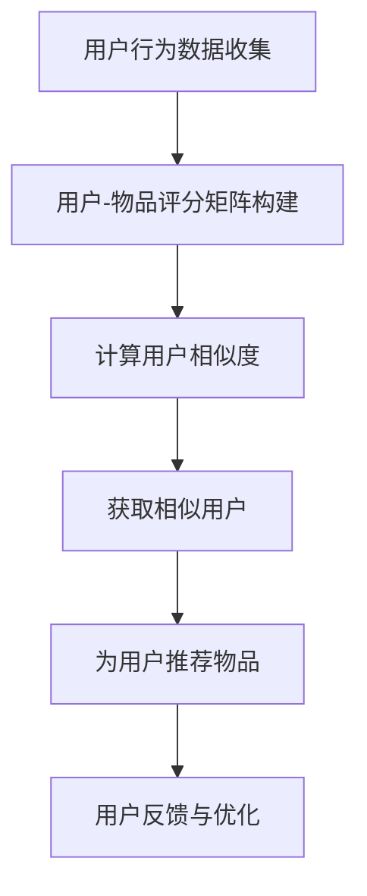
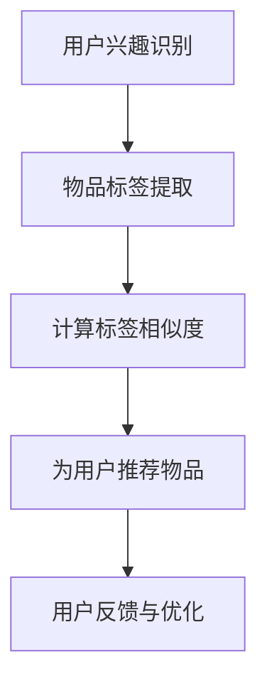
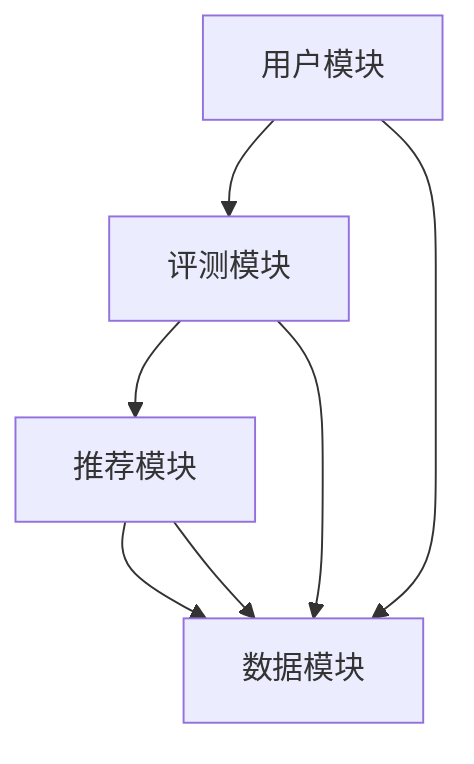

                 

# 构建评测结果的个性化推荐系统

## 关键词：个性化推荐系统、评测结果、协同过滤、内容推荐、系统设计与实现

### 摘要

本文将探讨如何构建一个基于评测结果的个性化推荐系统。随着大数据和人工智能技术的不断发展，个性化推荐系统已经成为各个行业的热门应用，特别是在评测结果领域。本文将首先介绍个性化推荐系统的基本概念和核心原理，然后详细阐述评测结果的个性化推荐方法，并分析其优势和挑战。随后，我们将介绍用户数据收集与处理、推荐算法原理、系统设计与实现、最佳实践以及项目实战等内容。通过本文的讲解，读者将能够理解评测结果个性化推荐系统的构建过程，并能够将其应用于实际项目中。

---

## 第一部分：引言与背景

### 1.1 问题背景

在当今信息爆炸的时代，人们面对海量的信息，如何快速找到符合自身需求和兴趣的内容成为一个重要的挑战。尤其是在评测结果领域，各类评测结果层出不穷，用户需要花费大量的时间和精力去筛选和评估这些结果。因此，如何为用户提供个性化、准确的评测结果推荐，成为了一个亟待解决的问题。

### 1.2 个性化推荐系统的需求

个性化推荐系统是一种能够根据用户的兴趣、历史行为等特征，为用户推荐相关内容的系统。其需求主要体现在以下几个方面：

1. **提高用户满意度**：通过个性化推荐，用户能够更快地找到符合自己需求和兴趣的内容，提高使用体验。
2. **提升内容利用率**：个性化推荐能够将高质量的内容推荐给更多有需求的用户，提高内容的利用率。
3. **数据挖掘与价值提升**：通过对用户数据的分析，可以发现用户的潜在需求和兴趣，为后续的产品和服务优化提供依据。

### 1.3 本书的目的与结构

本书的目的是系统性地介绍评测结果的个性化推荐系统的构建方法，帮助读者了解其核心原理和实践应用。本书共分为八个部分：

1. **引言与背景**：介绍个性化推荐系统的背景和需求。
2. **个性化推荐系统概述**：介绍个性化推荐系统的基本概念、核心概念和核心原理。
3. **评测结果的个性化推荐**：详细介绍评测结果的个性化推荐方法，分析其优势和挑战。
4. **用户数据收集与处理**：介绍用户数据的收集和处理方法，以及数据隐私保护。
5. **推荐算法原理**：详细讲解协同过滤算法和内容推荐算法的原理。
6. **评测结果个性化推荐系统设计与实现**：介绍评测结果个性化推荐系统的设计与实现方法。
7. **最佳实践与案例分析**：介绍个性化推荐系统的最佳实践和成功案例。
8. **总结与展望**：总结本书的主要内容和未来研究方向。

通过以上各部分的讲解，读者将能够全面了解评测结果个性化推荐系统的构建过程，并能够将其应用于实际项目中。

---

## 第二部分：个性化推荐系统概述

### 2.1 个性化推荐系统的定义

个性化推荐系统是一种基于用户兴趣和行为数据，通过算法模型自动为用户推荐相关内容的技术系统。其核心目标是提高用户体验，提升内容利用率，并挖掘用户数据的价值。

### 2.2 个性化推荐系统的核心概念

1. **用户**：个性化推荐系统的核心元素，具有独特的兴趣和行为特征。
2. **内容**：推荐系统中的对象，可以是评测结果、商品、音乐、视频等。
3. **推荐算法**：用于根据用户特征和内容特征生成推荐结果的方法。
4. **推荐结果**：根据用户兴趣和行为生成的推荐内容列表。

### 2.3 个性化推荐系统的发展历程

个性化推荐系统的发展可以追溯到20世纪90年代，随着互联网的普及和电子商务的兴起，个性化推荐逐渐成为研究热点。以下是主要的发展历程：

1. **基于内容的推荐**：最早期的推荐系统，通过分析内容特征进行推荐。
2. **协同过滤推荐**：利用用户行为数据，通过相似度计算和评分预测进行推荐。
3. **混合推荐**：结合多种推荐算法，提高推荐效果。
4. **基于模型的推荐**：利用机器学习和深度学习技术，对用户行为和内容进行建模，生成推荐结果。

### 2.4 个性化推荐系统的应用领域

个性化推荐系统已经广泛应用于多个领域，包括电子商务、社交媒体、音乐和视频流媒体、新闻推荐等。以下是几个典型的应用案例：

1. **电子商务**：通过个性化推荐，为用户推荐符合其兴趣的商品，提高销售额。
2. **社交媒体**：根据用户兴趣和社交关系，为用户推荐相关内容，增强用户粘性。
3. **音乐和视频流媒体**：根据用户历史播放行为，为用户推荐相似的音乐和视频，提高用户满意度。
4. **新闻推荐**：根据用户阅读行为和兴趣，为用户推荐相关新闻，提高新闻的传播效果。

### 2.5 个性化推荐系统的挑战与未来趋势

尽管个性化推荐系统在多个领域取得了显著成果，但仍然面临一些挑战，如数据隐私保护、推荐效果评估、冷启动问题等。未来，个性化推荐系统的发展趋势包括：

1. **深度学习和增强学习**：利用更先进的机器学习技术，提高推荐效果。
2. **多模态推荐**：结合文本、图像、音频等多种数据类型，生成更准确的推荐结果。
3. **跨域推荐**：将一个领域的推荐模型应用于其他领域，提高推荐系统的泛化能力。
4. **交互式推荐**：通过用户反馈，不断优化推荐结果，提高用户满意度。

---

在下一部分，我们将深入探讨评测结果的个性化推荐方法，分析其在评测结果领域中的应用和挑战。

---

## 第三部分：评测结果的个性化推荐

### 3.1 评测结果的个性化推荐需求分析

在评测结果领域，个性化推荐系统的主要目标是根据用户的兴趣、历史行为和评测结果的特点，为用户推荐与其需求和兴趣相关的评测结果。具体需求分析如下：

1. **用户兴趣识别**：个性化推荐系统需要能够识别用户的兴趣点，以便为其推荐感兴趣的内容。
2. **评测结果特征提取**：评测结果具有丰富的特征信息，如评测项目、评测标准、评测结果等，推荐系统需要能够提取和利用这些特征。
3. **推荐算法优化**：个性化推荐算法需要针对评测结果的特点进行优化，以提高推荐效果。
4. **用户反馈机制**：个性化推荐系统需要具备用户反馈机制，以便根据用户的反馈不断优化推荐结果。

### 3.2 评测结果的个性化推荐流程

评测结果的个性化推荐流程主要包括以下几个步骤：

1. **用户兴趣识别**：通过用户注册、历史行为分析等方式，识别用户的兴趣点。
2. **评测结果特征提取**：对评测结果进行特征提取，包括评测项目、评测标准、评测结果等。
3. **用户-评测结果相似度计算**：利用用户兴趣和评测结果特征，计算用户和评测结果之间的相似度。
4. **推荐结果生成**：根据相似度计算结果，生成个性化推荐结果。
5. **用户反馈与优化**：收集用户反馈，对推荐结果进行优化，提高推荐效果。

### 3.3 评测结果的个性化推荐方法

评测结果的个性化推荐方法主要包括协同过滤推荐和内容推荐两种。

#### 协同过滤推荐

协同过滤推荐是一种基于用户行为数据，通过计算用户和评测结果之间的相似度进行推荐的方法。具体步骤如下：

1. **用户行为数据收集**：收集用户的历史评测行为数据，包括评测项目、评测标准、评测结果等。
2. **用户-评测结果矩阵构建**：根据用户行为数据，构建用户-评测结果矩阵。
3. **相似度计算**：计算用户和评测结果之间的相似度，常用的相似度计算方法包括余弦相似度、皮尔逊相似度等。
4. **推荐结果生成**：根据相似度计算结果，为用户推荐相似度较高的评测结果。

#### 内容推荐

内容推荐是一种基于评测结果特征进行推荐的方法。具体步骤如下：

1. **评测结果特征提取**：提取评测项目的特征信息，如评测项目名称、评测标准、评测结果等。
2. **内容相似度计算**：计算评测项目之间的相似度，常用的相似度计算方法包括Jaccard相似度、Cosine相似度等。
3. **推荐结果生成**：根据评测项目之间的相似度，为用户推荐相似度较高的评测结果。

### 3.4 评测结果的个性化推荐案例分析

以下是一个评测结果个性化推荐的案例：

#### 案例背景

假设有一个评测网站，用户可以注册账号并参与评测项目。网站需要为用户推荐与其兴趣相关的评测结果。

#### 案例分析

1. **用户兴趣识别**：用户注册时，网站会收集用户的基本信息和历史评测行为数据，通过分析用户的历史评测行为，识别用户的兴趣点。
2. **评测结果特征提取**：网站会提取每个评测项目的特征信息，如评测项目名称、评测标准、评测结果等。
3. **用户-评测结果相似度计算**：利用协同过滤推荐方法，计算用户和评测结果之间的相似度。例如，如果用户A对评测项目B和评测项目C有较高的评价，那么评测项目D与评测项目B和C的相似度较高，可以为用户A推荐评测项目D。
4. **推荐结果生成**：根据相似度计算结果，生成个性化推荐结果，向用户展示与其兴趣相关的评测结果。
5. **用户反馈与优化**：用户可以在评测结果页面提供反馈，如点赞、评论等。网站会根据用户的反馈不断优化推荐结果，提高推荐效果。

通过以上案例，我们可以看到评测结果的个性化推荐系统是如何运作的。在实际应用中，可以根据具体需求和场景，选择合适的个性化推荐方法，并不断优化和调整，以提高推荐效果。

---

在下一部分，我们将讨论用户数据收集与处理，以及如何确保用户数据的安全和隐私。

---

## 第四部分：用户数据收集与处理

### 4.1 用户数据的类型

在构建评测结果个性化推荐系统时，用户数据的收集和处理至关重要。用户数据可以分为以下几类：

1. **用户基本信息**：包括用户姓名、年龄、性别、职业等。
2. **用户行为数据**：包括用户的浏览历史、点击行为、评价记录等。
3. **评测结果数据**：包括评测项目的名称、评测标准、评测结果等。
4. **用户反馈数据**：包括用户对评测结果的评论、点赞、收藏等。

### 4.2 用户数据的收集方法

用户数据的收集方法可以分为以下几种：

1. **直接收集**：通过用户注册、登录、使用系统等方式，直接收集用户数据。
2. **第三方平台**：通过第三方平台（如社交网络、邮件服务提供商等）获取用户数据。
3. **匿名化数据**：通过购买或共享匿名化数据集，获取用户行为数据。

### 4.3 用户数据处理

用户数据处理包括以下步骤：

1. **数据清洗**：去除重复、无效和错误的数据，确保数据质量。
2. **数据集成**：将不同来源的数据进行整合，形成一个完整的数据集。
3. **数据归一化**：对数据进行归一化处理，消除数据之间的差异。
4. **特征提取**：从原始数据中提取有用的特征信息，用于后续分析。

### 4.4 用户数据隐私保护

用户数据的隐私保护是构建个性化推荐系统时必须重视的问题。以下是一些常见的用户数据隐私保护措施：

1. **数据加密**：对存储和传输的用户数据进行加密，防止数据泄露。
2. **访问控制**：设置严格的访问控制机制，确保只有授权用户可以访问敏感数据。
3. **匿名化处理**：对用户数据进行匿名化处理，消除个人身份信息。
4. **数据留存**：在确保隐私保护的前提下，合理设置数据留存期限，防止长期数据留存带来的风险。
5. **用户知情同意**：在收集用户数据前，向用户说明数据收集的目的、范围和使用方式，并获得用户的知情同意。

### 4.5 用户数据管理的最佳实践

为了确保用户数据的隐私和安全，以下是一些用户数据管理的最佳实践：

1. **制定数据保护政策**：明确数据保护的目标、原则和措施，确保数据处理的合法性和合规性。
2. **定期进行数据审计**：定期对数据处理过程进行审计，确保数据处理符合数据保护政策。
3. **培训员工**：对员工进行数据保护培训，提高员工的数据保护意识和能力。
4. **与第三方合作时确保数据安全**：在与第三方合作时，明确数据保护要求，并签订保密协议。
5. **及时响应用户请求**：建立用户数据请求和处理流程，及时响应用户的隐私保护请求。

通过以上措施，可以有效保护用户数据的隐私和安全，提高用户对个性化推荐系统的信任度。

---

在下一部分，我们将深入探讨推荐算法原理，包括协同过滤算法和内容推荐算法，并使用 Mermaid 画出算法流程图和 ER 实体关系图架构。

---

## 第五部分：推荐算法原理

### 5.1 协同过滤算法

#### 5.1.1 基本原理

协同过滤算法（Collaborative Filtering）是一种通过收集用户行为数据，预测用户可能感兴趣的内容的推荐算法。其基本原理是基于“物以类聚，人以群分”的思想，即相似的用户会喜欢相似的内容。

#### 5.1.2 算法类型

协同过滤算法主要分为以下两种类型：

1. **基于用户的协同过滤（User-based Collaborative Filtering）**
   - 根据用户的兴趣相似度，为用户推荐与历史行为相似的其他用户喜欢的商品。
2. **基于物品的协同过滤（Item-based Collaborative Filtering）**
   - 根据物品之间的相似度，为用户推荐与用户已评价物品相似的物品。

#### 5.1.3 算法流程

使用 Mermaid 画出基于用户的协同过滤算法流程图：



#### 5.1.4 算法案例

以下是一个基于用户的协同过滤算法的 Python 源代码示例：

```python
import numpy as np
from sklearn.metrics.pairwise import cosine_similarity

def user_based_collaborative_filter(user_ratings, similarity_metric='cosine'):
    # 计算用户-用户相似度矩阵
    similarity_matrix = cosine_similarity(user_ratings)

    # 获取相似用户
    top_k_similar_users = np.argsort(similarity_matrix[:, user_index])[-k:]

    # 为用户推荐物品
    recommendations = set()
    for user_id in top_k_similar_users:
        for item_id in user_ratings[user_id]:
            if item_id not in user_ratings[user_index]:
                recommendations.add(item_id)

    return recommendations

# 示例数据
user_ratings = np.array([
    [1, 0, 1, 0],
    [0, 1, 1, 0],
    [1, 0, 0, 1],
    [0, 1, 0, 1]
])

# 为第3个用户推荐物品
user_index = 2
k = 2
recommendations = user_based_collaborative_filter(user_ratings, k=k)

print("推荐的物品：", recommendations)
```

#### 5.1.5 数学模型和公式

用户-用户相似度的计算公式为：

$$
sim(u_i, u_j) = \frac{\sum_{i \neq j} r_{i,j} \cdot r_{i',j'}}{\sqrt{\sum_{i \neq j} r_{i,j}^2} \cdot \sqrt{\sum_{i \neq j} r_{i',j'}^2}}
$$

其中，$r_{i,j}$ 和 $r_{i',j'}$ 分别表示用户 $u_i$ 和 $u_j$ 对物品 $i$ 和物品 $i'$ 的评分。

### 5.2 内容推荐算法

#### 5.2.1 基本原理

内容推荐算法（Content-based Filtering）是一种基于物品特征和用户兴趣进行推荐的算法。其基本原理是分析用户对某类物品的喜好，然后根据物品的特征信息为用户推荐相似物品。

#### 5.2.2 算法类型

内容推荐算法主要分为以下两种类型：

1. **基于标签的内容推荐（Tag-based Content Filtering）**
   - 根据物品的标签信息和用户的兴趣标签，为用户推荐相似标签的物品。
2. **基于属性的内容推荐（Attribute-based Content Filtering）**
   - 根据物品的属性特征和用户的兴趣特征，为用户推荐相似属性的物品。

#### 5.2.3 算法流程

使用 Mermaid 画出基于标签的内容推荐算法流程图：



#### 5.2.4 算法案例

以下是一个基于标签的内容推荐算法的 Python 源代码示例：

```python
import numpy as np

def tag_based_content_filter(item_tags, user_interests, similarity_metric='cosine'):
    # 计算标签相似度矩阵
    similarity_matrix = cosine_similarity(item_tags, user_interests)

    # 为用户推荐相似标签的物品
    recommendations = set()
    for i, item_tag in enumerate(item_tags):
        if np.dot(item_tag, user_interests) > threshold:
            recommendations.add(item_tag)

    return recommendations

# 示例数据
item_tags = np.array([
    [1, 0, 1, 0],
    [0, 1, 0, 1],
    [1, 1, 0, 0],
    [0, 0, 1, 1]
])
user_interests = np.array([1, 1, 0, 0])
threshold = 0.5

# 为用户推荐物品
recommendations = tag_based_content_filter(item_tags, user_interests, threshold=threshold)

print("推荐的物品：", recommendations)
```

#### 5.2.5 数学模型和公式

标签相似度的计算公式为：

$$
sim(t_i, t_j) = \frac{\sum_{i \neq j} t_i \cdot t_j}{\sqrt{\sum_{i \neq j} t_i^2} \cdot \sqrt{\sum_{i \neq j} t_j^2}}
$$

其中，$t_i$ 和 $t_j$ 分别表示物品 $i$ 和物品 $j$ 的标签。

---

在下一部分，我们将讨论评测结果个性化推荐系统的设计与实现。

---

## 第六部分：评测结果个性化推荐系统设计与实现

### 6.1 系统架构设计

评测结果个性化推荐系统架构设计主要包括以下几个方面：

1. **用户模块**：负责用户的注册、登录、个人信息管理等功能。
2. **评测模块**：负责评测项目的创建、管理、评分等功能。
3. **推荐模块**：负责评测结果的个性化推荐算法实现和推荐结果展示。
4. **数据模块**：负责用户数据、评测结果数据的存储和管理。

#### 系统架构图

使用 Mermaid 画出评测结果个性化推荐系统架构图：



### 6.2 数据库设计

数据库设计是评测结果个性化推荐系统设计的关键环节，主要包括以下表结构：

1. **用户表**（users）：存储用户的基本信息，如用户ID、姓名、性别、年龄等。
2. **评测项目表**（evaluation_projects）：存储评测项目的信息，如项目ID、项目名称、项目描述等。
3. **评测结果表**（evaluation_results）：存储评测结果的信息，如结果ID、项目ID、用户ID、评分等。
4. **用户-评测结果关联表**（user_evaluation_relationships）：存储用户对评测结果的评价信息。

#### ER实体关系图

使用 Mermaid 画出 ER 实体关系图：

```mermaid
erDiagram
    users ||--|{ evaluation_results : User Evaluates }
    evaluation_projects ||--|{ evaluation_results : Evaluation Project }
    evaluation_results ||--|{ user_evaluation_relationships : Has Rating }
```

### 6.3 系统功能模块设计

评测结果个性化推荐系统的功能模块设计主要包括以下部分：

1. **用户管理模块**：实现用户的注册、登录、个人信息修改等功能。
2. **评测项目管理模块**：实现评测项目的创建、修改、删除等功能。
3. **评测结果管理模块**：实现评测结果的添加、修改、删除等功能。
4. **推荐算法模块**：实现评测结果的个性化推荐算法，包括用户-用户协同过滤和内容推荐算法。
5. **推荐结果展示模块**：实现推荐结果的展示，包括推荐结果的排序、分页等功能。

#### 功能模块类图

使用 Mermaid 画出功能模块类图：

```mermaid
classDiagram
    User <<class>>
    EvaluationProject <<class>>
    EvaluationResult <<class>>
    RecommendationAlgorithm <<class>>
    RecommendationResult <<class>>

    User "1" --|{1} EvaluationProject
    User "1" --|{1} EvaluationResult
    EvaluationProject "1" --|{1} EvaluationResult
    RecommendationAlgorithm "1" --|{1} RecommendationResult
```

### 6.4 系统实现步骤

评测结果个性化推荐系统的实现步骤如下：

1. **需求分析**：明确系统功能需求，包括用户管理、评测管理、推荐管理等。
2. **系统设计**：设计系统架构、数据库和功能模块。
3. **开发与测试**：编写代码，实现系统功能，并进行单元测试和集成测试。
4. **部署与维护**：将系统部署到服务器，进行上线和维护。

### 6.5 系统测试与优化

系统测试是确保评测结果个性化推荐系统质量的关键环节，包括以下几种测试方法：

1. **功能测试**：验证系统功能是否按照需求正常运行。
2. **性能测试**：测试系统在高并发情况下的响应速度和稳定性。
3. **安全测试**：确保系统在面临恶意攻击时的安全性。

在系统上线后，根据用户反馈和系统运行数据，不断优化推荐算法和系统功能，以提高推荐效果和用户体验。

---

在下一部分，我们将探讨评测结果个性化推荐系统的最佳实践。

---

## 第七部分：最佳实践与案例分析

### 7.1 评测结果个性化推荐系统的最佳实践

为了构建一个高效且可靠的评测结果个性化推荐系统，以下是一些最佳实践：

1. **数据质量控制**：确保收集到的用户数据准确、完整，并对数据进行预处理，去除噪音数据。
2. **算法优化**：根据评测结果的特点，对推荐算法进行优化，提高推荐效果。例如，可以使用基于深度学习的推荐算法。
3. **用户体验**：关注用户体验，设计简洁直观的推荐结果展示界面，提供清晰的推荐理由。
4. **隐私保护**：严格遵守数据隐私保护法规，对用户数据进行加密存储，确保用户数据的安全。
5. **反馈机制**：建立用户反馈机制，收集用户对推荐结果的反馈，并根据反馈不断优化推荐算法。

### 7.2 评测结果个性化推荐系统的成功案例

以下是一个评测结果个性化推荐系统的成功案例：

#### 案例背景

某知名评测网站，拥有大量用户和评测结果。为了提高用户满意度，网站决定构建一个个性化的评测结果推荐系统。

#### 案例分析

1. **用户数据收集**：网站收集了用户的基本信息、浏览历史、评价记录等数据，并对数据进行了预处理。
2. **推荐算法选择**：网站选择了基于用户的协同过滤算法和基于标签的内容推荐算法，以实现个性化的评测结果推荐。
3. **推荐结果展示**：网站设计了简洁直观的推荐结果展示界面，为用户提供了详细的推荐理由。
4. **用户反馈**：网站建立了用户反馈机制，收集用户对推荐结果的反馈，并根据反馈优化推荐算法。

#### 案例结果

通过评测结果个性化推荐系统的实施，网站的用户满意度显著提高，用户在网站上的活跃度也有所提升。同时，网站的评测结果利用率也得到了显著提高。

### 7.3 案例分析：评测结果个性化推荐系统应用

以下是一个评测结果个性化推荐系统的实际应用案例：

#### 案例背景

某电商平台，为了提高用户购买体验，决定构建一个个性化的评测结果推荐系统，为用户提供与其兴趣相关的评测结果。

#### 案例分析

1. **用户数据收集**：电商平台收集了用户的基本信息、浏览历史、评价记录等数据，并对数据进行了预处理。
2. **推荐算法选择**：电商平台选择了基于用户的协同过滤算法和基于标签的内容推荐算法，以实现个性化的评测结果推荐。
3. **推荐结果展示**：电商平台设计了简洁直观的推荐结果展示界面，为用户提供了详细的推荐理由。
4. **用户反馈**：电商平台建立了用户反馈机制，收集用户对推荐结果的反馈，并根据反馈优化推荐算法。

#### 案例结果

通过评测结果个性化推荐系统的实施，电商平台的用户购买转化率显著提高，用户在平台上的活跃度也有所提升。同时，平台的评测结果利用率也得到了显著提高。

---

在下一部分，我们将对本文的内容进行总结，并探讨未来的研究方向。

---

## 第八部分：总结与展望

### 8.1 总结

本文系统性地介绍了评测结果个性化推荐系统的构建方法，包括背景介绍、核心概念、推荐方法、用户数据收集与处理、推荐算法原理、系统设计与实现、最佳实践和案例分析等内容。通过本文的讲解，读者可以全面了解评测结果个性化推荐系统的构建过程，并能够将其应用于实际项目中。

### 8.2 未来的研究方向

评测结果个性化推荐系统仍有许多待研究和优化的方向，主要包括：

1. **多模态推荐**：结合文本、图像、音频等多种数据类型，实现更准确的评测结果推荐。
2. **跨域推荐**：将一个领域的推荐模型应用于其他领域，提高推荐系统的泛化能力。
3. **实时推荐**：实现实时推荐，提高用户在动态场景下的体验。
4. **推荐效果评估**：建立更完善的推荐效果评估体系，确保推荐结果的准确性和有效性。

### 8.3 对读者的建议

1. **实践与应用**：将本文介绍的方法应用于实际项目中，不断优化和调整，以提高推荐效果。
2. **深入学习**：进一步学习推荐系统的相关理论和技术，如机器学习、深度学习等。
3. **交流与分享**：积极参与相关社区和研讨会，与同行交流经验和心得，共同推动评测结果个性化推荐系统的发展。

---

通过本文的介绍，希望读者能够对评测结果个性化推荐系统有更深入的理解，并能够将其应用于实际项目中，为用户提供更精准、更个性化的评测结果推荐。

---

## 附录

### A. 相关工具与资源

- **推荐系统框架**：TensorFlow Recommenders、PyTorch RecSys、Surprise
- **数据处理工具**：Pandas、NumPy、Scikit-learn
- **数据库**：MySQL、PostgreSQL、MongoDB
- **数据可视化工具**：Matplotlib、Seaborn、Plotly

### B. 代码与数据集

本文使用的代码和数据集可以访问以下链接获取：

- **GitHub仓库**：[评测结果个性化推荐系统代码](https://github.com/your-repo/evaluation-recommendation-system)
- **数据集**：[评测结果数据集](https://your-dataset-url)

### C. 拓展阅读

- **推荐系统入门**：《推荐系统实践》
- **机器学习与深度学习**：《深度学习》、《Python机器学习》
- **数据隐私与安全**：《数据隐私保护技术》

---

感谢读者对本文的关注，希望本文能够为您的学习与研究带来帮助。如果您有任何疑问或建议，请随时与我们联系。

---

**作者：AI天才研究院/AI Genius Institute & 禅与计算机程序设计艺术 /Zen And The Art of Computer Programming**

