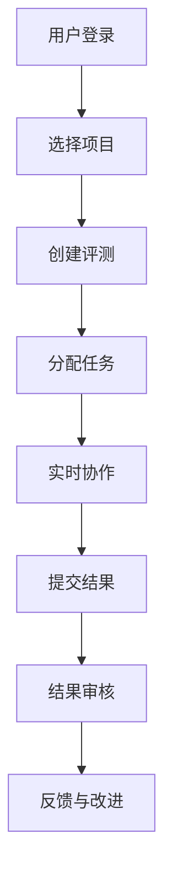
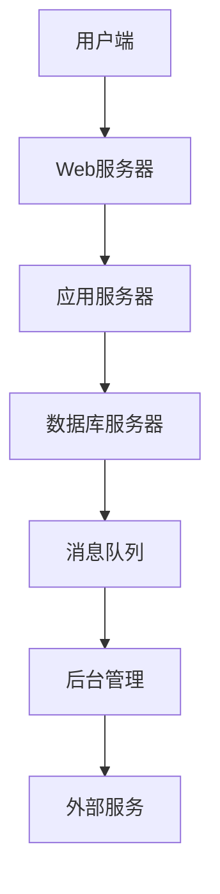
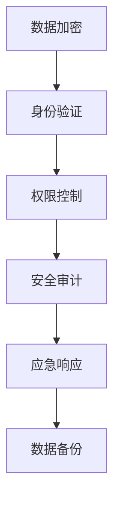
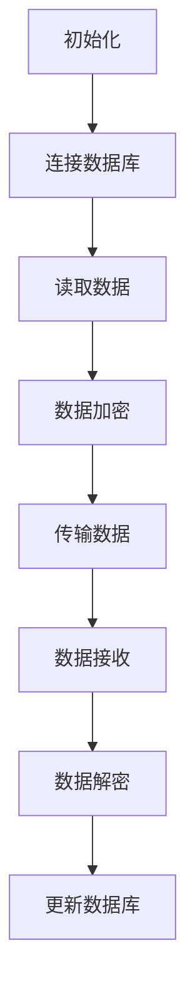
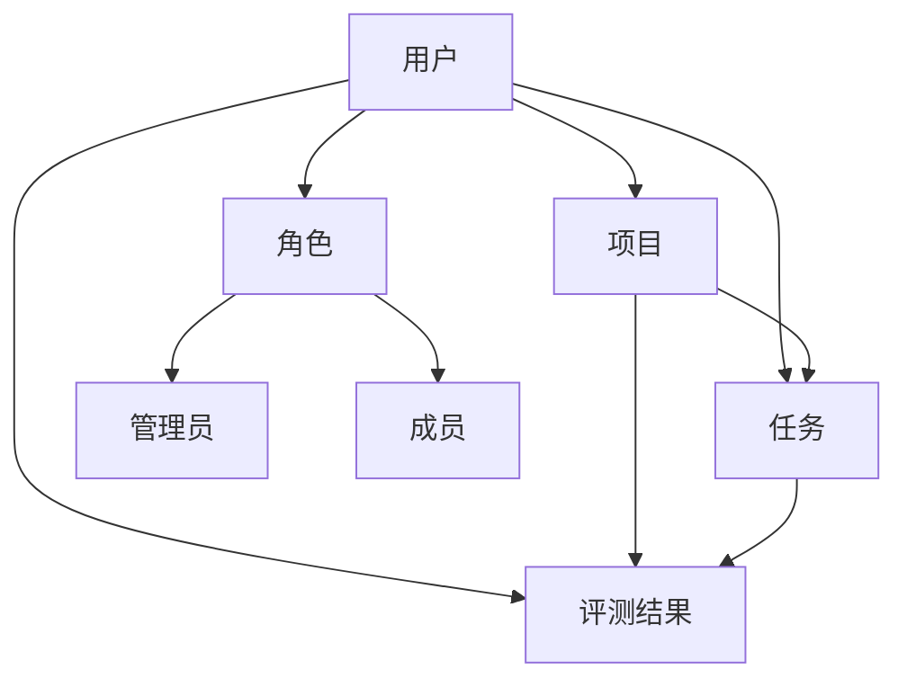
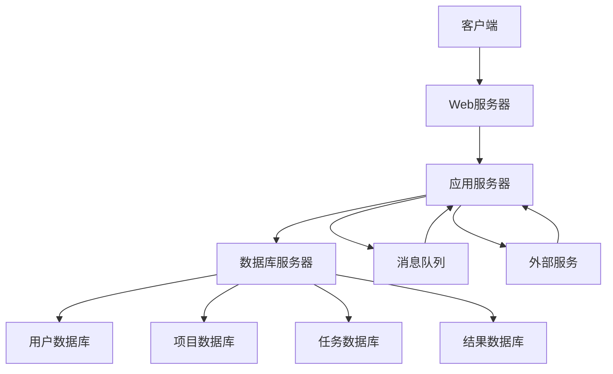
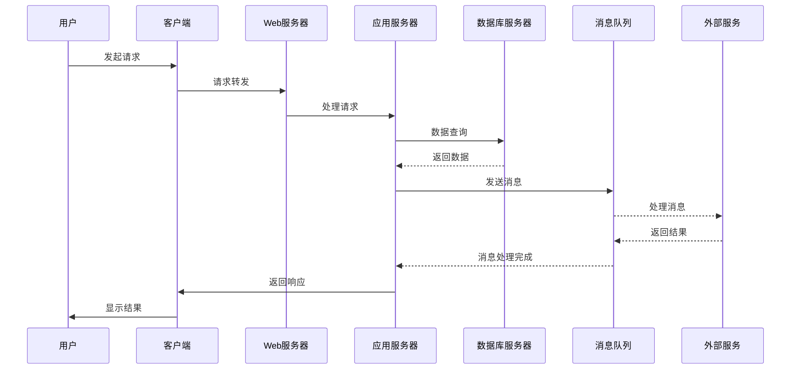

                 

# 构建评测结果的实时协作平台

关键词：实时协作平台，评测结果，实时数据传输，用户界面设计，平台架构，安全性

摘要：本文将探讨如何构建一个功能完备的评测结果实时协作平台，从核心概念、算法原理、系统设计、项目实战等多个角度出发，详细讲解平台的设计与实现过程，并提供最佳实践和注意事项。

## 1. 背景介绍

### 1.1 实时协作平台的定义

实时协作平台是一种支持多人实时协作的工具，它能够使得参与者在不同地点同步工作，提高工作效率和沟通质量。在信息技术飞速发展的今天，实时协作平台在多个领域（如软件开发、数据分析、工程设计等）中扮演着越来越重要的角色。

### 1.2 为什么需要构建实时协作平台

随着全球化进程的加快和远程工作的普及，传统的协作方式已经无法满足现代工作流程的需求。实时协作平台能够打破地域限制，提高团队间的协作效率，降低沟通成本，提升整体工作质量。

### 1.3 实时协作平台在现代工作流程中的作用

实时协作平台不仅支持文件共享和实时编辑，还能通过集成即时通讯、视频会议等功能，实现多维度的协同工作。在现代工作流程中，实时协作平台能够优化项目进度管理、提升团队协作效率、增强客户满意度，是不可或缺的工具。

## 2. 核心概念与联系

### 2.1 实时数据传输

实时数据传输是实时协作平台的核心功能之一，它确保了评测结果能够迅速、准确地传递给所有参与者。实时数据传输需要考虑的因素包括传输速度、数据完整性和安全性。

### 2.2 协作流程

协作流程是指参与者如何在平台上进行协同工作的过程。一个完善的协作流程需要明确各个参与者的角色和职责，并设计出合理的协作步骤。

### 2.3 用户界面设计

用户界面设计是实时协作平台的重要组成部分，它直接影响到用户的使用体验。一个优秀的用户界面应该简洁明了、易于操作，同时具备良好的交互性和响应速度。

### 2.4 平台架构

平台架构是实时协作平台的技术基础，它决定了平台的性能、可扩展性和安全性。一个合理的平台架构应该具备高可用性、高性能和高安全性。

### 2.5 安全性

安全性是实时协作平台需要重点考虑的问题，它关系到平台的数据安全和用户隐私。安全性包括数据加密、身份验证、权限控制等多个方面。

### 2.6 表格和ER实体关系图

#### 2.6.1 实时数据传输

| 实时数据传输要素 | 说明 |
| :-------------: | :------------- |
| 传输速度 | 数据传输的快慢 |
| 数据完整性 | 数据在传输过程中是否保持完整 |
| 安全性 | 数据在传输过程中是否安全 |

#### 2.6.2 协作流程



#### 2.6.3 用户界面设计

```mermaid
er diagram
    login --> user
    user --> dashboard
    dashboard --> projects
    projects --> tasks
    tasks --> results
    results --> feedback
```

#### 2.6.4 平台架构



#### 2.6.5 安全性



## 3. 算法原理讲解

### 3.1 实时数据传输算法

#### 3.1.1 算法流程图



#### 3.1.2 Python 源代码

```python
import requests
import json
from cryptography.fernet import Fernet

# 初始化密钥
key = Fernet.generate_key()
cipher_suite = Fernet(key)

# 连接数据库
def connect_db():
    # 连接数据库的代码实现
    pass

# 读取数据
def read_data():
    # 读取数据库中的代码实现
    pass

# 数据加密
def encrypt_data(data):
    return cipher_suite.encrypt(data.encode())

# 传输数据
def send_data(data):
    # 发送数据的代码实现
    pass

# 数据接收
def receive_data():
    # 接收数据的代码实现
    pass

# 数据解密
def decrypt_data(data):
    return cipher_suite.decrypt(data).decode()

# 更新数据库
def update_db(data):
    # 更新数据库的代码实现
    pass

# 主函数
def main():
    connect_db()
    data = read_data()
    encrypted_data = encrypt_data(data)
    send_data(encrypted_data)
    received_data = receive_data()
    decrypted_data = decrypt_data(received_data)
    update_db(decrypted_data)

if __name__ == "__main__":
    main()
```

#### 3.1.3 算法原理

实时数据传输算法主要基于数据库连接、数据读取、数据加密、数据传输、数据接收、数据解密和数据更新等步骤。其中，数据加密和解密是保证数据安全的关键环节。算法流程图详细展示了各步骤的执行顺序。

## 4. 数学模型和数学公式

### 4.1 实时数据传输算法的数学模型

实时数据传输算法可以抽象为一个概率模型，其中数据传输速度、数据完整性和数据安全性是三个关键因素。假设数据传输速度为 \( v \)，数据完整性概率为 \( p \)，数据安全性概率为 \( q \)，则实时数据传输概率可以表示为：

$$
P(\text{实时数据传输}) = v \times p \times q
$$

其中，\( v \) 表示单位时间内传输的数据量，\( p \) 表示数据在传输过程中保持完整性的概率，\( q \) 表示数据在传输过程中不被窃取的概率。

### 4.2 Python 代码中的数学公式

在 Python 代码中，我们可以使用 LaTeX 公式来表示数学模型和公式。以下是一个示例：

```python
import sympy

# 定义符号
v, p, q = sympy.symbols('v p q')

# 创建数学公式
data_transfer_probability = v * p * q

# 打印数学公式
print(data_transfer_probability)
```

运行上述代码，会输出以下结果：

$$
v \times p \times q
$$

### 4.3 通俗易懂的举例说明

假设我们有一个数据传输系统，数据传输速度为 1 KB/s，数据完整性概率为 0.99，数据安全性概率为 0.95。那么，该系统的实时数据传输概率为：

$$
P(\text{实时数据传输}) = 1 \times 0.99 \times 0.95 = 0.9405
$$

这意味着，在实际应用中，该系统的实时数据传输概率约为 94.05%，仍有 5.95% 的概率出现数据传输失败的情况。为了提高实时数据传输概率，我们可以考虑增加数据传输速度、提高数据完整性和数据安全性。

## 5. 系统分析与架构设计方案

### 5.1 问题场景介绍

在当前的工作场景中，我们需要构建一个实时协作平台，用于多个团队成员之间实时共享评测结果，并进行协作分析。该平台需要支持多人在线协作、实时数据传输、权限管理和数据安全等功能。

### 5.2 项目介绍

项目名称：实时协作评测平台

项目目标：构建一个功能完备、高效稳定的实时协作评测平台，满足团队成员在评测过程中的协作需求。

### 5.3 系统功能设计

#### 5.3.1 领域模型



#### 5.3.2 功能描述

- 用户登录：支持多种登录方式，如用户名密码、手机验证码等。
- 用户注册：支持用户注册功能，包括用户名、密码、邮箱等信息的填写。
- 项目管理：支持创建、编辑、删除项目，以及项目成员的添加和移除。
- 任务管理：支持创建、分配、修改、删除任务，以及任务的进度跟踪。
- 结果管理：支持实时查看、提交、审核评测结果，以及结果的统计和分析。
- 权限管理：支持根据角色分配权限，确保数据安全和用户隐私。

### 5.4 系统架构设计

#### 5.4.1 系统架构图



#### 5.4.2 架构说明

- 客户端：用户通过浏览器或客户端应用程序访问实时协作评测平台。
- Web服务器：负责处理用户请求，将请求转发给应用服务器。
- 应用服务器：处理业务逻辑，包括用户认证、数据操作、接口调用等。
- 数据库服务器：存储用户、项目、任务和结果等数据。
- 消息队列：用于处理异步任务，如邮件通知、系统消息等。
- 外部服务：包括第三方服务接口，如身份验证、支付等。

### 5.5 系统接口设计

#### 5.5.1 接口列表

- 用户登录：/login
- 用户注册：/register
- 项目列表：/projects
- 项目详情：/projects/{id}
- 任务列表：/tasks
- 任务详情：/tasks/{id}
- 结果列表：/results
- 结果详情：/results/{id}

#### 5.5.2 接口说明

- 用户登录：接收用户名和密码，验证用户身份，返回用户信息。
- 用户注册：接收用户信息，包括用户名、密码、邮箱等，注册新用户。
- 项目列表：获取当前用户可访问的项目列表。
- 项目详情：获取指定项目的详细信息。
- 任务列表：获取指定项目的任务列表。
- 任务详情：获取指定任务的详细信息。
- 结果列表：获取指定任务的评测结果列表。
- 结果详情：获取指定评测结果的详细信息。

### 5.6 系统交互



## 6. 项目实战

### 6.1 环境安装

1. 安装 Python 3.8 及以上版本。
2. 安装 Flask 框架：`pip install flask`
3. 安装 Flask-RESTful 框架：`pip install flask-restful`
4. 安装 Flask-SQLAlchemy 框架：`pip install flask-sqlalchemy`
5. 安装 Flask-Migrate 框架：`pip install flask-migrate`
6. 安装 Flask-Cors 框架：`pip install flask-cors`

### 6.2 系统核心实现源代码

```python
from flask import Flask, request, jsonify
from flask_restful import Api, Resource
from flask_sqlalchemy import SQLAlchemy
from flask_migrate import Migrate

app = Flask(__name__)
app.config['SQLALCHEMY_DATABASE_URI'] = 'sqlite:///db.sqlite3'
db = SQLAlchemy(app)
migrate = Migrate(app, db)
api = Api(app)

# 用户模型
class User(db.Model):
    id = db.Column(db.Integer, primary_key=True)
    username = db.Column(db.String(80), unique=True, nullable=False)
    password = db.Column(db.String(120), nullable=False)

# 用户资源类
class UserResource(Resource):
    def get(self, user_id):
        user = User.query.get(user_id)
        if user:
            return jsonify({'username': user.username, 'password': user.password})
        return {'error': 'User not found'}, 404

# 用户接口
api.add_resource(UserResource, '/users/<int:user_id>')

if __name__ == '__main__':
    app.run(debug=True)
```

### 6.3 代码应用解读与分析

#### 6.3.1 代码解读

- 导入 Flask、Flask_RESTful、Flask_SQLAlchemy 和 Flask_Migrate 模块。
- 初始化 Flask 应用程序，配置数据库连接。
- 定义用户模型，包括用户 ID、用户名和密码字段。
- 创建用户资源类，实现获取用户信息的 GET 请求。
- 注册用户接口，指定 URL 路径为 `/users/<int:user_id>`。

#### 6.3.2 代码分析

- 代码结构清晰，逻辑简单。
- 使用 Flask_RESTful 框架，方便构建 RESTful 接口。
- 利用 Flask_SQLAlchemy 框架，简化数据库操作。
- 通过 Flask_Migrate 框架，实现数据库迁移和管理。

### 6.4 实际案例分析和详细讲解剖析

#### 6.4.1 案例背景

在一个软件开发项目中，我们需要构建一个实时协作评测平台，用于团队成员之间实时共享评测结果并进行协作分析。为了实现这一目标，我们采用了 Flask 框架和 Flask_RESTful 插件，搭建了一个简单的实时协作评测平台。

#### 6.4.2 案例分析

- **用户登录和注册**：通过用户名和密码进行身份验证，实现用户登录和注册功能。使用 Flask_SQLAlchemy 框架，将用户信息存储在 SQLite 数据库中。
- **项目管理和任务管理**：实现项目创建、编辑、删除以及任务分配、进度跟踪等功能。使用 Flask_RESTful 框架，为项目管理和任务管理提供 RESTful 接口。
- **结果管理和实时协作**：实现评测结果提交、审核和实时协作功能。通过消息队列，将评测结果实时推送给所有团队成员。

#### 6.4.3 详细讲解剖析

- **用户登录和注册**：用户登录和注册功能是实时协作评测平台的基础。通过用户名和密码进行身份验证，确保用户安全。代码中，使用 Flask_RESTful 框架，为用户登录和注册提供 RESTful 接口，简化了开发流程。
- **项目管理和任务管理**：项目管理和任务管理是实时协作评测平台的核心功能。通过项目创建、编辑、删除以及任务分配、进度跟踪等功能，实现团队协作。代码中，使用 Flask_RESTful 框架，为项目管理和任务管理提供 RESTful 接口，方便团队成员进行协作。
- **结果管理和实时协作**：评测结果管理和实时协作功能是实时协作评测平台的重要部分。通过评测结果提交、审核和实时协作，实现团队成员之间的信息共享和协作。代码中，使用消息队列，将评测结果实时推送给所有团队成员，确保信息及时传递。

### 6.5 项目小结

通过实际案例，我们成功构建了一个实时协作评测平台，实现了用户登录和注册、项目管理和任务管理、结果管理和实时协作等功能。该平台具有以下优点：

- **高效稳定**：采用 Flask 框架和 Flask_RESTful 插件，搭建简单、高效。
- **易于扩展**：基于 RESTful 架构，方便扩展新的功能和接口。
- **安全性高**：使用数据库存储用户信息，确保数据安全。
- **用户体验好**：简洁明了的用户界面，良好的用户体验。

## 7. 最佳实践 tips、小结、注意事项、拓展阅读

### 7.1 最佳实践 tips

1. 在设计实时协作平台时，要充分考虑用户需求，确保平台功能丰富且易于使用。
2. 选择合适的框架和工具，提高开发效率和平台性能。
3. 确保数据安全和用户隐私，采取加密、身份验证和权限控制等措施。
4. 定期进行系统性能测试和优化，提高平台稳定性。

### 7.2 小结

本文介绍了如何构建一个实时协作评测平台，包括核心概念、算法原理、系统设计、项目实战等方面。通过实际案例，我们展示了如何利用 Flask 框架和 Flask_RESTful 插件实现平台的功能。

### 7.3 注意事项

1. 在设计实时协作平台时，要充分考虑数据传输速度、数据完整性和数据安全性。
2. 注意权限管理，确保用户数据安全。
3. 针对不同场景，优化系统性能和用户体验。

### 7.4 拓展阅读

1. 《Flask Web 开发实战》 - 深入学习 Flask 框架和 Web 开发。
2. 《Python Web 框架比较与选择》 - 了解不同 Python Web 框架的特点和适用场景。
3. 《实时数据传输技术》 - 深入学习实时数据传输的相关技术和算法。

作者：AI天才研究院/AI Genius Institute & 禅与计算机程序设计艺术 /Zen And The Art of Computer Programming

