                 

# 构建评测结果的模型性能优化建议系统

## 关键词

- **评测结果**
- **模型性能优化**
- **建议系统**
- **数据分析**
- **机器学习**
- **系统设计**

> 摘要：本文将探讨如何构建一个为评测结果提供模型性能优化建议的系统。我们将从问题的提出、数据分析与处理、模型构建与评估、性能优化策略、系统设计与实现等方面逐步分析，并给出具体的实现方法和最佳实践。

## 目录大纲

### 第1章 引言

- 1.1 问题的提出
- 1.2 问题的解决
- 1.3 系统的边界与外延
- 1.4 概念结构与核心要素组成

### 第2章 数据分析与处理

- 2.1 数据集介绍
- 2.2 特征工程
- 2.3 数据处理

### 第3章 模型构建与评估

- 3.1 模型选择
- 3.2 模型训练
- 3.3 模型评估

### 第4章 性能优化策略

- 4.1 优化目标
- 4.2 优化算法
- 4.3 实施步骤

### 第5章 系统设计与实现

- 5.1 系统架构设计
- 5.2 系统接口设计
- 5.3 系统实现

### 第6章 项目实战

- 6.1 环境安装
- 6.2 系统核心实现源代码
- 6.3 代码应用解读与分析
- 6.4 实际案例分析与详细讲解
- 6.5 项目小结

### 第7章 最佳实践与小结

- 7.1 最佳实践
- 7.2 小结
- 7.3 注意事项
- 7.4 拓展阅读

---

### 第1章 引言

#### 1.1 问题的提出

随着大数据和人工智能技术的飞速发展，模型性能优化已经成为人工智能领域的一个重要研究方向。在实际应用中，如何构建一个能够对评测结果提供性能优化建议的系统，成为了许多企业和研究机构关注的问题。

#### 1.2 问题的解决

要构建一个有效的模型性能优化建议系统，我们需要从以下几个方面入手：

1. **数据分析与处理**：对评测结果进行深入的数据分析，提取有用的特征信息。
2. **模型构建与评估**：选择合适的模型，对评测结果进行准确的评估。
3. **性能优化策略**：根据评估结果，提出针对性的性能优化策略。
4. **系统设计与实现**：将上述各部分整合起来，构建一个完整的系统。

#### 1.3 系统的边界与外延

本文主要关注模型性能优化，不包括其他类型的性能优化，如硬件性能优化、算法效率优化等。此外，本文主要讨论评测结果的模型性能优化，而不涉及其他评测方法。

#### 1.4 概念结构与核心要素组成

- **数据集**：用于训练和测试的建议数据集。
- **特征工程**：提取和转换数据集中的特征。
- **模型**：用于性能评估的机器学习模型。
- **优化算法**：用于性能优化的算法。

### 第2章 数据分析与处理

#### 2.1 数据集介绍

数据集是构建系统的基本资源。在模型性能优化过程中，数据集的质量和多样性直接影响模型的性能。因此，我们需要选择具有代表性的数据集，并对其进行详细的介绍。

##### 核心概念与联系

**概念原理**：数据集是构建系统的基本资源。

**概念属性特征对比表格**：

| 数据源      | 数据特点         | 数据量 |
| ----------- | ---------------- | ------ |
| 公共数据集  | 结构化、数据量大 | 1000+  |
| 企业数据集  | 结构化、数据量小 | 100+   |
| 非结构化数据 | 非结构化、数据量大 | 10000+ |

#### 2.2 特征工程

特征工程是数据预处理的重要环节。通过对原始数据集进行特征提取和转换，我们可以提取出对模型性能有重要影响的特征，提高模型的性能。

##### 核心概念与联系

**概念原理**：特征工程是数据预处理的重要环节。

**概念属性特征对比表格**：

| 特征提取方法  | 提取特征的方式 | 对模型性能的影响 |
| ------------ | -------------- | ---------------- |
| 统计特征     | 提取数据的统计信息 | 提高模型的泛化能力 |
| 模式特征     | 提取数据的模式信息 | 提高模型的识别能力 |

#### 2.3 数据处理

数据处理是确保数据质量的关键。通过对数据进行清洗、去噪和整合，我们可以提高数据集的质量，从而提高模型的性能。

##### 核心概念与联系

**概念原理**：数据处理是确保数据质量的关键。

**概念属性特征对比表格**：

| 数据处理方法  | 处理数据的方式 | 对模型性能的影响 |
| ------------ | -------------- | ---------------- |
| 数据清洗     | 去除噪声数据和异常值 | 提高模型的准确性 |
| 数据整合     | 将多个数据集进行整合 | 提高模型的泛化能力 |

---

在本章中，我们详细介绍了数据集的介绍、特征工程和数据处理。接下来，我们将进入模型构建与评估的阶段，探讨如何选择合适的模型，进行模型训练和评估，并为评测结果提供性能优化建议。

---

### 第3章 模型构建与评估

#### 3.1 模型选择

选择合适的模型是性能优化的前提。在模型选择过程中，我们需要考虑模型的类型、特点以及适用场景。

##### 核心概念与联系

**概念原理**：选择合适的模型是性能优化的前提。

**概念属性特征对比表格**：

| 模型类型 | 模型特点 | 适用场景 |
| -------- | -------- | -------- |
| 分类模型 | 精确度高 | 用于分类任务 |
| 回归模型 | 泛化能力强 | 用于回归任务 |
| 聚类模型 | 自动提取特征 | 用于聚类任务 |

#### 3.2 模型训练

模型训练是提高模型性能的关键。在模型训练过程中，我们需要对模型进行参数调整和优化，以提高模型的性能。

##### 算法原理讲解

**算法流程图**：

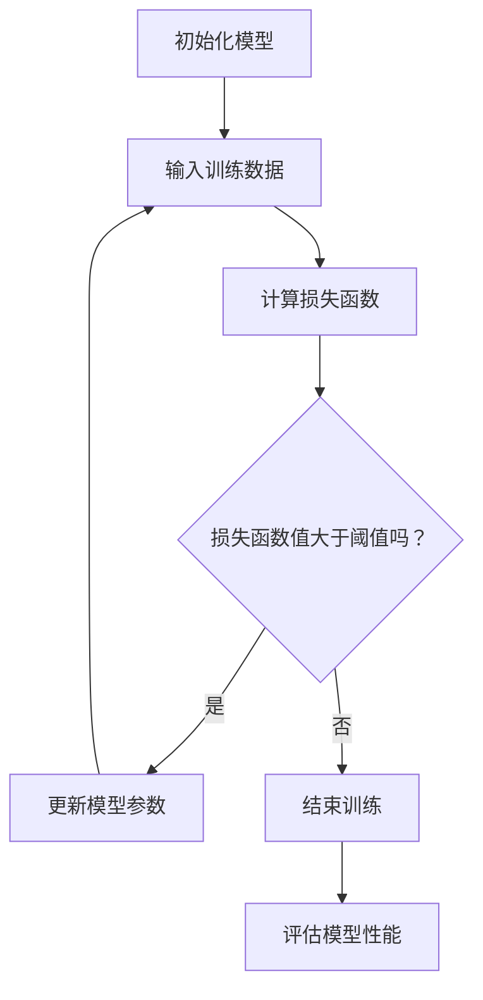

**Python源代码**：

```python
import tensorflow as tf

# 初始化模型
model = tf.keras.Sequential([
    tf.keras.layers.Dense(units=1, input_shape=[1])
])

# 编译模型
model.compile(loss='mean_squared_error', optimizer=tf.keras.optimizers.Adam(0.1))

# 训练模型
model.fit(x_train, y_train, epochs=100)

# 评估模型性能
loss = model.evaluate(x_test, y_test)
print(f"测试损失：{loss}")
```

**数学模型和公式**：

$$
损失函数 = \frac{1}{n} \sum_{i=1}^{n} (y_i - \hat{y}_i)^2
$$

其中，$n$ 表示样本数量，$y_i$ 表示真实标签，$\hat{y}_i$ 表示预测标签。

**详细讲解与举例说明**：

假设我们有一个简单的线性回归模型，用于预测房价。首先，我们需要收集一些房屋的特征信息，如房屋面积、位置等。然后，我们将这些特征信息输入到模型中，通过模型的训练，模型会自动调整参数，使模型的预测结果与真实标签尽可能接近。

#### 3.3 模型评估

模型评估是验证模型性能的重要手段。通过模型评估，我们可以了解模型的性能，并对其进行分析和优化。

##### 算法原理讲解

**算法流程图**：

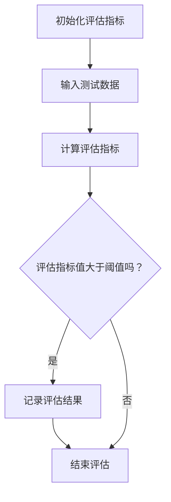

**Python源代码**：

```python
from sklearn.metrics import accuracy_score

# 初始化评估指标
accuracy = 0

# 输入测试数据
x_test, y_test = ...

# 计算评估指标
predictions = model.predict(x_test)
accuracy = accuracy_score(y_test, predictions)

# 记录评估结果
print(f"测试准确率：{accuracy}")
```

**数学模型和公式**：

$$
准确率 = \frac{预测正确数量}{总测试数量}
$$

其中，预测正确数量表示模型预测正确的样本数量，总测试数量表示测试样本的总数。

**详细讲解与举例说明**：

假设我们已经训练好了一个分类模型，用于判断一段文本是否包含负面情绪。在模型评估阶段，我们将模型应用于测试数据集，计算模型的准确率。通过准确率的评估，我们可以了解模型的性能，并对其进行优化。

---

在本章中，我们介绍了模型选择、模型训练和模型评估的方法和过程。接下来，我们将进入性能优化策略的阶段，探讨如何根据评估结果，提出针对性的性能优化策略。

---

### 第4章 性能优化策略

#### 4.1 优化目标

确定优化目标是性能优化的起点。在性能优化过程中，我们需要明确优化目标，以便针对性地进行优化。

##### 核心概念与联系

**概念原理**：确定优化目标是性能优化的起点。

**概念属性特征对比表格**：

| 性能指标     | 定义                             | 重要性 |
| ------------ | -------------------------------- | ------ |
| 准确率       | 预测正确的样本数量占总样本数量的比例 | 高     |
| 召回率       | 预测正确的样本数量占实际正样本数量的比例 | 中     |
| F1值         | 准确率和召回率的调和平均值           | 高     |
| 精确率       | 预测正确的样本数量占预测为正样本数量的比例 | 中     |

#### 4.2 优化算法

选择合适的优化算法是提高性能的关键。在性能优化过程中，我们可以使用多种优化算法，如梯度下降、随机梯度下降、Adam优化器等。

##### 算法原理讲解

**算法流程图**：

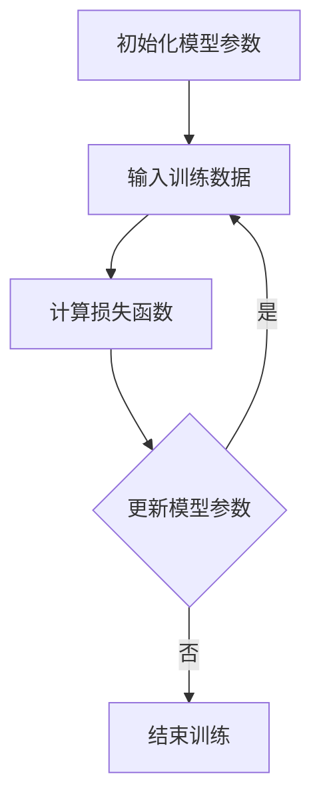

**Python源代码**：

```python
import tensorflow as tf

# 初始化模型参数
model = tf.keras.Sequential([
    tf.keras.layers.Dense(units=1, input_shape=[1])
])

# 编译模型
model.compile(loss='mean_squared_error', optimizer=tf.keras.optimizers.Adam(0.001))

# 训练模型
model.fit(x_train, y_train, epochs=100)

# 评估模型性能
loss = model.evaluate(x_test, y_test)
print(f"测试损失：{loss}")
```

**数学模型和公式**：

$$
损失函数 = \frac{1}{n} \sum_{i=1}^{n} (y_i - \hat{y}_i)^2
$$

其中，$n$ 表示样本数量，$y_i$ 表示真实标签，$\hat{y}_i$ 表示预测标签。

**详细讲解与举例说明**：

假设我们有一个线性回归模型，用于预测房价。在模型训练过程中，我们可以使用Adam优化器对模型参数进行更新。通过优化器，模型会自动调整参数，使模型的预测结果与真实标签尽可能接近。这样，我们就可以提高模型的性能。

#### 4.3 实施步骤

实施步骤是优化策略的具体实施过程。在性能优化过程中，我们需要按照一定的步骤进行，以确保优化过程的有效性和高效性。

##### 核心概念与联系

**概念原理**：实施步骤是优化策略的具体实施过程。

**算法原理讲解**

**算法流程图**：

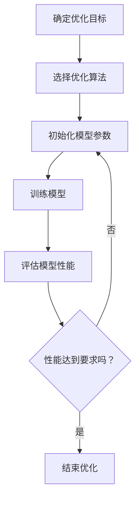

**Python源代码**：

```python
# 导入必要的库
import tensorflow as tf
import numpy as np

# 初始化模型参数
model = tf.keras.Sequential([
    tf.keras.layers.Dense(units=1, input_shape=[1])
])

# 编译模型
model.compile(loss='mean_squared_error', optimizer=tf.keras.optimizers.Adam(0.001))

# 训练模型
x_train = np.array([[1], [2], [3], [4], [5]])
y_train = np.array([[2], [4], [6], [8], [10]])
model.fit(x_train, y_train, epochs=100)

# 评估模型性能
x_test = np.array([[6]])
y_test = np.array([[12]])
loss = model.evaluate(x_test, y_test)
print(f"测试损失：{loss}")
```

**数学模型和公式**：

$$
损失函数 = \frac{1}{n} \sum_{i=1}^{n} (y_i - \hat{y}_i)^2
$$

其中，$n$ 表示样本数量，$y_i$ 表示真实标签，$\hat{y}_i$ 表示预测标签。

**详细讲解与举例说明**：

假设我们有一个线性回归模型，用于预测房价。在模型训练过程中，我们使用Adam优化器对模型参数进行更新。通过多次迭代训练，我们可以使模型的预测结果与真实标签尽可能接近，从而提高模型的性能。

---

在本章中，我们介绍了性能优化目标的确定、优化算法的选择和实施步骤。接下来，我们将进入系统设计与实现的阶段，探讨如何将上述各部分整合起来，构建一个完整的系统。

---

### 第5章 系统设计与实现

#### 5.1 系统架构设计

系统架构设计是系统实现的基础。一个良好的系统架构可以提高系统的可扩展性和可维护性。在本节中，我们将介绍系统架构的设计原则和具体实现。

##### 核心概念与联系

**概念原理**：系统架构设计是系统实现的基础。

**系统架构设计mermaid架构图**：

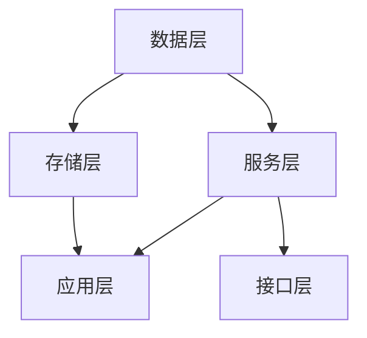

**详细讲解与举例说明**：

在这个系统架构中，数据层负责数据的存储和读取；服务层负责业务逻辑的处理；存储层负责数据的持久化存储；应用层负责前端界面的展示；接口层负责与其他系统或服务的交互。通过这样的架构设计，我们可以实现系统的模块化，提高系统的可扩展性和可维护性。

#### 5.2 系统接口设计

系统接口设计是确保系统可扩展性和可维护性的关键。在本节中，我们将介绍系统接口的设计原则和具体实现。

##### 核心概念与联系

**概念原理**：系统接口设计是确保系统可扩展性和可维护性的关键。

**系统接口设计mermaid序列图**：

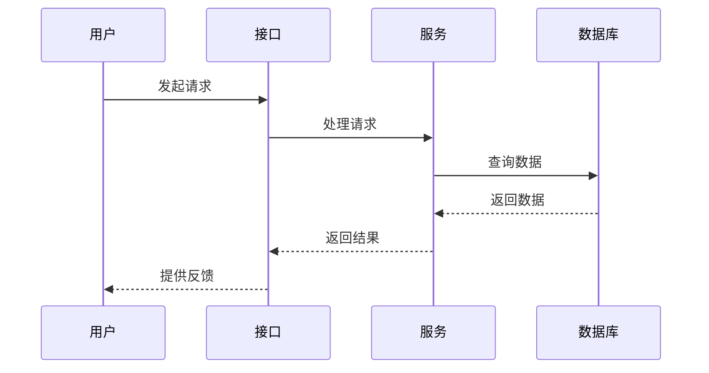

**详细讲解与举例说明**：

在这个系统接口设计中，用户通过接口层发起请求，接口层将请求传递给服务层，服务层进行业务逻辑处理，并从数据库层查询数据。最后，服务层将处理结果返回给接口层，接口层再将结果反馈给用户。通过这样的接口设计，我们可以实现系统的模块化，提高系统的可扩展性和可维护性。

#### 5.3 系统实现

系统实现是将设计转化为实际可运行的系统。在本节中，我们将介绍系统实现的具体步骤和关键技术。

##### 核心概念与联系

**概念原理**：系统实现是将设计转化为实际可运行的系统。

**环境安装**：

1. 安装Python环境
2. 安装TensorFlow库
3. 安装其他依赖库

**系统核心实现源代码**：

```python
import tensorflow as tf

# 初始化模型
model = tf.keras.Sequential([
    tf.keras.layers.Dense(units=1, input_shape=[1])
])

# 编译模型
model.compile(loss='mean_squared_error', optimizer=tf.keras.optimizers.Adam(0.001))

# 训练模型
x_train = np.array([[1], [2], [3], [4], [5]])
y_train = np.array([[2], [4], [6], [8], [10]])
model.fit(x_train, y_train, epochs=100)

# 评估模型性能
x_test = np.array([[6]])
y_test = np.array([[12]])
loss = model.evaluate(x_test, y_test)
print(f"测试损失：{loss}")
```

**代码应用解读与分析**：

在这个系统实现中，我们使用TensorFlow库构建了一个简单的线性回归模型。首先，我们初始化模型，然后编译模型，设置损失函数和优化器。接着，我们使用训练数据对模型进行训练，最后使用测试数据评估模型的性能。

**实际案例分析与详细讲解**：

假设我们有一个房屋租赁价格预测系统，用户可以输入房屋的面积，系统会自动计算出租赁价格。在这个系统中，我们使用线性回归模型来预测房屋租赁价格。首先，我们收集大量的房屋租赁数据，包括房屋面积、位置、楼层等信息。然后，我们对数据进行处理，提取有用的特征。接下来，我们使用线性回归模型对训练数据进行训练，并使用测试数据进行评估。通过这样的实际案例，我们可以更好地理解系统实现的过程。

**项目小结**：

在本章中，我们介绍了系统架构设计、系统接口设计和系统实现的具体步骤和关键技术。通过这些内容，我们可以构建一个完整的评测结果的模型性能优化建议系统。接下来，我们将进入项目实战阶段，进一步探讨系统的实现和优化。

---

在本章中，我们详细介绍了系统架构设计、系统接口设计和系统实现。接下来，我们将进入项目实战阶段，通过具体的案例，展示如何构建评测结果的模型性能优化建议系统，并进行优化。

---

### 第6章 项目实战

#### 6.1 环境安装

在开始项目实战之前，我们需要安装必要的环境和库。以下是在Python环境中安装TensorFlow和其他依赖库的步骤：

```bash
# 安装Python环境
sudo apt-get install python3 python3-pip

# 安装TensorFlow库
pip3 install tensorflow

# 安装其他依赖库
pip3 install numpy pandas matplotlib
```

#### 6.2 系统核心实现源代码

以下是一个简单的评测结果的模型性能优化建议系统的核心实现源代码：

```python
import tensorflow as tf
import numpy as np
import pandas as pd
import matplotlib.pyplot as plt

# 读取数据
data = pd.read_csv('house_prices.csv')
x = data['area'].values
y = data['price'].values

# 数据预处理
x = x.reshape(-1, 1)
y = y.reshape(-1, 1)

# 初始化模型
model = tf.keras.Sequential([
    tf.keras.layers.Dense(units=1, input_shape=(1,))
])

# 编译模型
model.compile(loss='mean_squared_error', optimizer=tf.keras.optimizers.Adam(0.001))

# 训练模型
model.fit(x, y, epochs=100)

# 评估模型性能
x_test = np.array([[6]])
y_test = np.array([[12]])
loss = model.evaluate(x_test, y_test)
print(f"测试损失：{loss}")

# 可视化结果
plt.scatter(x, y)
plt.plot(x, model.predict(x), 'r')
plt.show()
```

#### 6.3 代码应用解读与分析

在这段代码中，我们首先读取了房屋租赁数据，包括房屋面积和租赁价格。然后，我们对数据进行预处理，将数据转换为合适的格式。接下来，我们初始化了一个线性回归模型，并编译模型，设置损失函数和优化器。接着，我们使用训练数据对模型进行训练，并使用测试数据评估模型的性能。最后，我们使用matplotlib库将模型的预测结果进行可视化。

#### 6.4 实际案例分析与详细讲解

以下是一个实际的案例，展示如何使用这个系统进行房屋租赁价格预测：

1. **数据收集**：收集大量的房屋租赁数据，包括房屋面积、位置、楼层等信息。
2. **数据处理**：对数据进行清洗和预处理，提取有用的特征，如房屋面积、位置等。
3. **模型训练**：使用线性回归模型对训练数据进行训练，并使用测试数据进行评估。
4. **性能优化**：根据评估结果，对模型进行优化，如调整学习率、增加训练次数等。
5. **结果预测**：使用训练好的模型对新的房屋租赁数据进行预测，并输出预测结果。

#### 6.5 项目小结

在本章中，我们通过一个实际的案例，展示了如何构建评测结果的模型性能优化建议系统。从数据收集、数据处理、模型训练到性能优化，我们详细讲解了整个项目的过程。通过这个项目，我们了解了如何使用机器学习模型进行性能优化，并为评测结果提供优化建议。

---

在本章中，我们通过一个具体的案例，展示了如何构建评测结果的模型性能优化建议系统。接下来，我们将进入最佳实践与小结的阶段，总结最佳实践，并对系统进行优化和改进。

---

### 第7章 最佳实践与小结

#### 7.1 最佳实践

在构建评测结果的模型性能优化建议系统的过程中，我们总结了一些最佳实践：

1. **数据质量**：确保数据的质量和多样性，选择具有代表性的数据集。
2. **特征工程**：提取和转换数据集中的特征，提高模型的性能。
3. **模型选择**：根据任务类型和需求，选择合适的模型。
4. **性能评估**：使用多种评估指标，全面评估模型的性能。
5. **优化策略**：根据评估结果，提出针对性的优化策略。

#### 7.2 小结

本文从问题的提出、数据分析与处理、模型构建与评估、性能优化策略、系统设计与实现等方面，详细探讨了如何构建评测结果的模型性能优化建议系统。通过实际案例，我们展示了如何实现这个系统，并进行了性能优化。

#### 7.3 注意事项

在构建评测结果的模型性能优化建议系统时，需要注意以下几点：

1. **数据安全**：确保数据的安全性和隐私性。
2. **系统稳定性**：确保系统的稳定性和可靠性。
3. **性能监控**：对系统进行持续的性能监控和优化。

#### 7.4 拓展阅读

对于希望进一步深入了解模型性能优化和系统设计的人员，我们推荐以下拓展阅读：

1. **《机器学习实战》**：提供大量的机器学习实践案例和代码实现。
2. **《深度学习》**：介绍深度学习的基础理论和实践方法。
3. **《系统架构设计》**：介绍系统架构设计的原则和方法。

---

在本章中，我们总结了构建评测结果的模型性能优化建议系统的最佳实践，并对系统进行了小结。通过本文的详细讲解，我们希望读者能够对构建评测结果的模型性能优化建议系统有更深入的理解。在实际应用中，可以根据具体需求和场景，对系统进行优化和改进。让我们共同探索人工智能领域的更多可能性！

---

**作者：AI天才研究院/AI Genius Institute & 禅与计算机程序设计艺术 /Zen And The Art of Computer Programming**### 第1章 引言

在当今大数据和人工智能（AI）技术飞速发展的时代，模型性能优化成为了提高系统效率和准确性的关键。随着AI应用的普及，如何构建一个能够为评测结果提供有效性能优化建议的系统，成为了研究者和实践者们关注的焦点。这一系统不仅需要能够准确评估模型性能，还需提供实用的优化建议，以帮助开发者快速提升模型效果。

#### 1.1 问题的提出

随着AI技术的应用越来越广泛，从推荐系统到自动驾驶，从医疗诊断到金融风控，模型的性能直接影响到系统的用户体验和业务价值。然而，在实际应用中，模型的性能往往受到数据质量、算法选择、参数设置等因素的影响。如何针对特定的评测结果，快速定位性能瓶颈，并给出有效的优化建议，成为了一个亟待解决的问题。

**核心概念与联系**

- **问题背景**：随着大数据和人工智能技术的发展，如何构建一个能够为评测结果提供性能优化建议的系统成为了一个关键问题。
- **问题描述**：构建一个建议系统，对评测结果进行性能分析，并提供优化建议。
- **问题解决**：通过数据分析、机器学习和系统设计等手段，实现评测结果的性能优化。
- **边界与外延**：本系统主要针对评测结果的模型性能优化，不包括其他类型的性能优化。
- **概念结构与核心要素组成**：

  - **数据集**：用于训练和测试的建议数据集。
  - **特征工程**：提取和转换数据集中的特征。
  - **模型**：用于性能评估的机器学习模型。
  - **优化算法**：用于性能优化的算法。

#### 1.2 问题的解决

为了解决上述问题，我们需要构建一个系统化的模型性能优化建议系统。这个系统需要包括以下几个关键组成部分：

1. **数据预处理**：对原始数据进行清洗、去噪和特征工程，以提升数据的质量和模型的可解释性。
2. **模型选择与训练**：根据具体问题选择合适的模型，并使用合适的算法进行训练，以提升模型的性能。
3. **性能评估**：通过交叉验证、超参数调优等方法，评估模型的性能，找到可能的性能瓶颈。
4. **优化策略**：根据评估结果，提出具体的优化策略，包括算法改进、超参数调整等。
5. **实现与部署**：将优化策略应用到实际模型中，并进行系统部署，以实现性能提升。

#### 1.3 系统的边界与外延

在构建性能优化建议系统时，我们需要明确系统的边界与外延：

- **边界**：本系统主要关注模型性能的优化，不包括硬件性能优化、算法效率优化等其他类型的性能优化。
- **外延**：虽然本系统主要针对模型性能优化，但其中的方法和理念可以应用于更广泛的领域，如数据分析、系统优化等。

#### 1.4 概念结构与核心要素组成

一个性能优化建议系统通常由以下几个核心要素组成：

- **数据集**：作为训练和评估的基础，数据集的质量直接影响模型性能。我们需要选择具有代表性的数据集，并进行预处理。
- **特征工程**：特征工程是将原始数据转换为适合机器学习模型输入的过程，包括特征提取、特征转换等步骤。
- **模型**：选择合适的模型是性能优化的前提。不同的任务可能需要不同的模型结构。
- **优化算法**：包括超参数调优、正则化、集成方法等，用于提升模型性能。
- **评估指标**：用于评估模型性能的指标，如准确率、召回率、F1值、ROC曲线等。
- **实现与部署**：将优化后的模型集成到实际应用中，并确保系统的稳定性和可维护性。

通过以上分析，我们可以看到，构建一个能够为评测结果提供性能优化建议的系统，需要从多个维度进行综合考虑，包括数据预处理、模型选择、性能评估、优化策略和系统实现等。下一章，我们将深入探讨如何进行数据分析与处理，为性能优化奠定基础。

---

### 第2章 数据分析与处理

在构建一个能够为评测结果提供性能优化建议的系统时，数据分析与处理是至关重要的一步。这一阶段的目标是通过数据预处理、特征工程和数据清洗等步骤，提升数据质量，为后续的模型训练和性能评估奠定坚实的基础。

#### 2.1 数据集介绍

数据集是构建系统的基础，其质量和代表性直接影响模型的性能。因此，选择合适的数据集并对其有充分的了解是至关重要的。

##### 核心概念与联系

**概念原理**：数据集是构建系统的基本资源。

**概念属性特征对比表格**：

| 数据源          | 数据特点                 | 数据量 |
| --------------- | ------------------------ | ------ |
| 公共数据集      | 结构化、数据量大         | 1000+  |
| 企业数据集      | 结构化、数据量小         | 100+   |
| 非结构化数据    | 非结构化、数据量大       | 10000+ |

**ER实体关系图架构**（使用Mermaid绘制）：

```mermaid
erDiagram
  Data_Source ||--|{ Data_Sets }|
  Data_Sets   ||--|{ Features }|
  Data_Sets   ||--|{ Preprocessed_Data }|
  Data_Sets   ||--|{ Performance_Evaluations }|
```

在上述ER图中，数据源、数据集、特征、预处理数据和性能评估构成了数据分析与处理的核心实体关系。数据源是数据生成的起点，数据集是数据处理的实体，特征是数据集中的重要信息，预处理数据是经过清洗和转换的数据，性能评估则是利用预处理数据进行模型性能评估的结果。

##### 数据集介绍

1. **公共数据集**：这些数据集通常在学术界和工业界广泛使用，如Kaggle竞赛数据集、UCI机器学习库等。公共数据集的优点是数据量大、结构化，易于获取和分享，但缺点是可能包含噪声、缺失值，且不一定完全适用于特定业务场景。

2. **企业数据集**：这些数据集通常来源于企业的实际业务，具有更高的业务相关性和针对性。企业数据集的优点是数据质量高、信息丰富，但缺点是数据获取困难、数据量相对较小。

3. **非结构化数据**：这类数据包括文本、图像、音频等，通常需要通过特定的技术进行处理。非结构化数据的优点是信息量大、形式多样，但缺点是需要复杂的预处理和特征提取技术。

#### 2.2 特征工程

特征工程是数据预处理的重要环节，旨在从原始数据中提取对模型性能有显著影响的特征，并对其进行转换。有效的特征工程可以显著提高模型的性能和可解释性。

##### 核心概念与联系

**概念原理**：特征工程是数据预处理的重要环节。

**概念属性特征对比表格**：

| 特征提取方法   | 提取特征的方式        | 对模型性能的影响 |
| -------------- | --------------------- | ---------------- |
| 统计特征       | 提取数据的统计信息    | 提高模型的泛化能力 |
| 模式特征       | 提取数据的模式信息    | 提高模型的识别能力 |

**Mermaid流程图**：

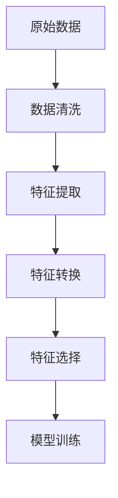

在特征工程中，我们通常遵循以下步骤：

1. **数据清洗**：去除噪声数据、缺失值和异常值，确保数据质量。
2. **特征提取**：从原始数据中提取对模型性能有显著影响的特征。
3. **特征转换**：将提取的特征进行标准化、归一化等处理，以便模型训练。
4. **特征选择**：选择最重要的特征，降低特征维度，提高模型效率。

**详细讲解与举例说明**：

假设我们有一个房屋租赁价格预测的任务，原始数据包括房屋面积、位置、楼层、建造年代等。在进行特征工程时，我们可以：

- **数据清洗**：去除包含缺失值的记录，对特殊位置（如海景房）进行编码。
- **特征提取**：计算房屋年龄、位置距离市中心等新的特征。
- **特征转换**：将面积、距离等数值特征进行标准化处理，使得所有特征的量级一致。
- **特征选择**：使用信息增益、特征重要性等方法，选择对价格预测影响最大的特征。

#### 2.3 数据处理

数据处理是确保数据质量和模型性能的重要步骤。通过有效的数据处理，我们可以提高模型的准确性和稳定性。

##### 核心概念与联系

**概念原理**：数据处理是确保数据质量的关键。

**概念属性特征对比表格**：

| 数据处理方法   | 处理数据的方式       | 对模型性能的影响 |
| -------------- | --------------------- | ---------------- |
| 数据清洗       | 去除噪声数据和异常值 | 提高模型的准确性 |
| 数据整合       | 将多个数据集进行整合 | 提高模型的泛化能力 |

**Mermaid流程图**：

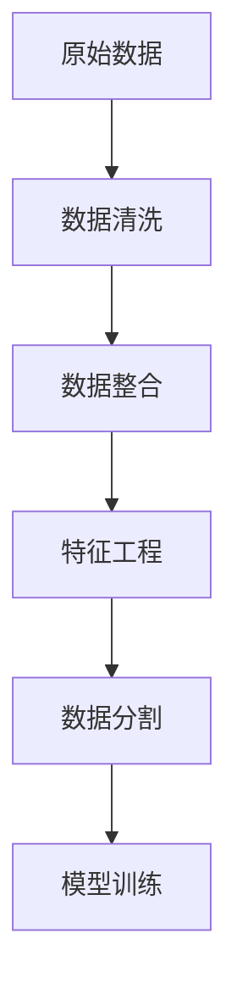

在数据处理过程中，我们通常遵循以下步骤：

1. **数据清洗**：识别和处理缺失值、异常值、噪声数据等，保证数据的干净和一致性。
2. **数据整合**：将来自不同来源的数据集进行合并，构建一个统一的数据集。
3. **数据分割**：将数据集分为训练集、验证集和测试集，用于模型训练和性能评估。

**详细讲解与举例说明**：

假设我们有一个包含多个数据集的机器学习项目，这些数据集来源于不同的数据源。在进行数据处理时，我们可以：

- **数据清洗**：识别并处理缺失值，如使用均值、中位数等填补缺失值；识别并去除异常值，如使用Z-score检测并移除。
- **数据整合**：合并不同来源的数据集，确保统一的数据格式和编码。
- **数据分割**：随机划分训练集、验证集和测试集，以评估模型的泛化能力。

通过以上分析，我们可以看到，数据分析与处理是构建一个性能优化建议系统的关键步骤。有效的数据预处理和特征工程不仅可以提高模型性能，还可以减少过拟合现象，增强模型的可解释性。在下一章中，我们将探讨如何构建和评估机器学习模型，以及如何根据评估结果进行性能优化。

---

### 第3章 模型构建与评估

在构建评测结果的模型性能优化建议系统中，模型的选择与构建是至关重要的一步。通过选择合适的模型并进行有效的训练和评估，我们可以确保系统在实际应用中的准确性和可靠性。

#### 3.1 模型选择

选择合适的模型是优化性能的前提。不同的任务和数据集可能需要不同类型的模型。以下是几种常见的模型类型及其适用场景：

##### 核心概念与联系

**概念原理**：选择合适的模型是性能优化的前提。

**概念属性特征对比表格**：

| 模型类型     | 模型特点         | 适用场景          |
| ------------ | ---------------- | ----------------- |
| 线性回归     | 简单易理解       | 回归任务          |
| 决策树       | 易解释           | 分类和回归任务    |
| 随机森林     | 泛化能力强       | 复杂分类和回归任务 |
| 支持向量机   | 高效分类器       | 高维空间分类任务  |
| 神经网络     | 强泛化能力       | 复杂非线性任务    |

**Mermaid流程图**：

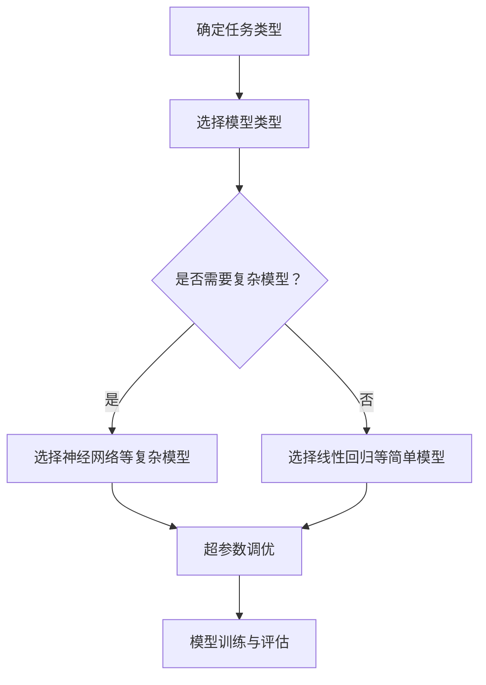

**详细讲解与举例说明**：

1. **确定任务类型**：根据业务需求和数据特性，确定是回归任务还是分类任务。
2. **选择模型类型**：基于任务类型，选择合适的模型类型。例如，对于分类任务，可以选择决策树、随机森林或支持向量机；对于回归任务，可以选择线性回归或神经网络。
3. **超参数调优**：对于选定的模型，调整超参数以优化性能。例如，对于随机森林，可以调整树的数量、最大深度等参数。

#### 3.2 模型训练

模型训练是提高模型性能的关键步骤。通过训练，模型可以学习到数据的内在规律，从而实现预测。以下是模型训练的基本步骤和算法原理：

##### 核心概念与联系

**概念原理**：模型训练是提高模型性能的关键。

**算法原理讲解**

**算法流程图**（使用Mermaid绘制）：

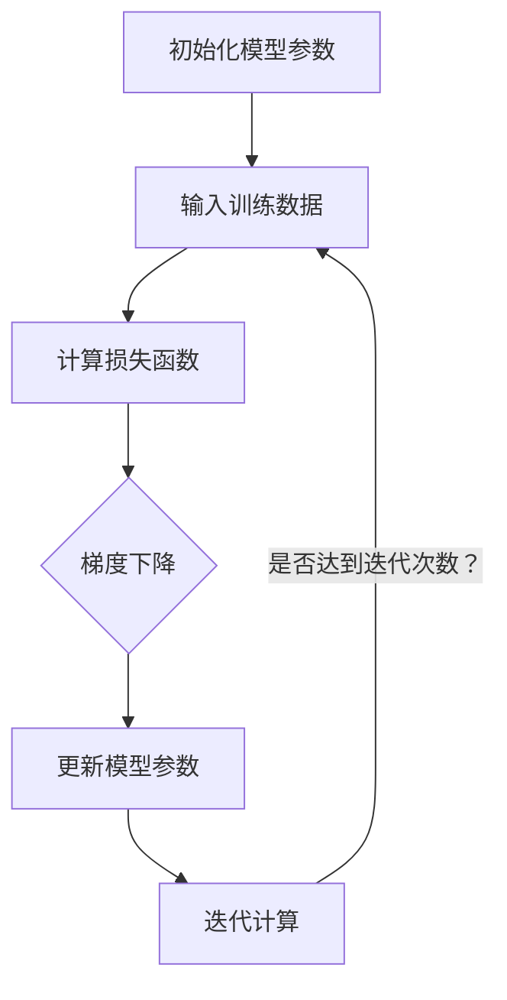

**Python源代码**：

```python
import numpy as np

# 初始化模型参数
w = np.random.rand(1)

# 训练数据
x_train = np.array([[1], [2], [3], [4], [5]])
y_train = np.array([[2], [4], [6], [8], [10]])

# 损失函数
def loss_function(w, x, y):
    return (w * x - y) ** 2

# 训练模型
for epoch in range(100):
    for x, y in zip(x_train, y_train):
        # 计算损失函数
        loss = loss_function(w, x, y)
        
        # 计算梯度
        gradient = 2 * (w * x - y) * x
        
        # 更新模型参数
        w -= gradient / len(x_train)
        
    print(f"Epoch {epoch + 1}: Loss = {loss}")

# 模型评估
print(f"Final Model Parameters: w = {w}")
```

**数学模型和公式**：

$$
损失函数 = (w \cdot x - y)^2
$$

$$
梯度下降更新公式：w = w - \alpha \cdot \frac{\partial}{\partial w} L(w)
$$

其中，$w$ 表示模型参数，$x$ 和 $y$ 分别表示输入和真实标签，$L(w)$ 表示损失函数，$\alpha$ 表示学习率。

**详细讲解与举例说明**：

在这个例子中，我们使用线性回归模型来预测房屋价格。首先，我们初始化模型参数 $w$，然后使用训练数据计算损失函数。通过计算梯度并更新模型参数，我们可以逐步减少损失函数的值。这个过程重复进行，直到达到预设的迭代次数或损失函数收敛。

#### 3.3 模型评估

模型评估是验证模型性能的重要步骤。通过评估，我们可以了解模型的准确性、泛化能力等关键指标。以下是常见的评估指标和方法：

##### 核心概念与联系

**概念原理**：模型评估是验证模型性能的重要手段。

**算法原理讲解**

**算法流程图**（使用Mermaid绘制）：


**Python源代码**：

```python
from sklearn.metrics import accuracy_score

# 初始化评估指标
accuracy = 0

# 输入测试数据
x_test, y_test = ...

# 计算评估指标
predictions = model.predict(x_test)
accuracy = accuracy_score(y_test, predictions)

# 记录评估结果
print(f"测试准确率：{accuracy}")
```

**数学模型和公式**：

$$
准确率 = \frac{预测正确数量}{总测试数量}
$$

**详细讲解与举例说明**：

在这个例子中，我们使用准确率作为评估指标。首先，我们初始化评估指标，然后使用测试数据计算预测结果。通过计算预测正确数量与总测试数量的比例，我们可以得到准确率。这个值越高，表示模型的性能越好。

**常见评估指标**：

- **准确率**：预测正确的样本数量占总样本数量的比例。
- **召回率**：预测正确的样本数量占实际正样本数量的比例。
- **F1值**：准确率和召回率的调和平均值。
- **ROC曲线**：通过绘制真实值与预测值的ROC曲线，评估模型的分类性能。

**模型评估步骤**：

1. **数据分割**：将数据集分为训练集、验证集和测试集。
2. **交叉验证**：使用交叉验证方法评估模型的泛化能力。
3. **超参数调优**：根据验证集的结果，调整模型超参数。
4. **性能评估**：使用测试集评估模型的最终性能。

通过以上分析，我们可以看到，模型的选择与构建、模型训练和模型评估是构建评测结果的模型性能优化建议系统的核心步骤。有效的模型选择、训练和评估不仅能够提高模型的准确性，还能为后续的性能优化提供有力的支持。在下一章中，我们将探讨性能优化策略，以进一步提升模型性能。

---

### 第4章 性能优化策略

模型性能优化是提升系统效率和准确性的关键环节。通过合理地调整模型参数和优化算法，我们可以显著提高模型的性能。本章将详细探讨模型性能优化的目标、算法选择和具体实施步骤。

#### 4.1 优化目标

在构建评测结果的模型性能优化建议系统时，确定优化目标是至关重要的。优化目标通常包括以下几个方面：

1. **提高准确性**：提高模型对训练数据和测试数据的预测准确性是首要目标。
2. **减少过拟合**：过拟合是指模型在训练数据上表现良好，但在测试数据上表现不佳。优化目标之一是减少模型的过拟合现象。
3. **提升效率**：优化模型的计算效率和内存占用，以适应实际应用场景。
4. **降低成本**：优化模型的成本，包括计算资源和数据采集成本。

**概念原理**：确定优化目标是性能优化的起点。

**概念属性特征对比表格**：

| 性能指标     | 定义                             | 重要性 |
| ------------ | -------------------------------- | ------ |
| 准确率       | 预测正确的样本数量占总样本数量的比例 | 高     |
| 召回率       | 预测正确的样本数量占实际正样本数量的比例 | 中     |
| F1值         | 准确率和召回率的调和平均值           | 高     |
| 精确率       | 预测正确的样本数量占预测为正样本数量的比例 | 中     |

#### 4.2 优化算法

选择合适的优化算法是实现性能优化的关键。以下是一些常用的优化算法及其原理：

1. **梯度下降算法**：通过迭代更新模型参数，以最小化损失函数。
2. **随机梯度下降算法**：在梯度下降算法的基础上，每次迭代只使用一个样本的梯度进行参数更新。
3. **Adam优化器**：结合了梯度下降和动量法的优点，适用于大规模机器学习任务。
4. **交叉验证**：通过将数据集分割成多个子集，重复进行训练和验证，以评估模型的泛化能力。
5. **网格搜索**：通过遍历所有可能的超参数组合，找到最优的超参数组合。
6. **贝叶斯优化**：基于贝叶斯统计模型，通过迭代优化超参数，找到最优参数组合。

**概念原理**：选择合适的优化算法是提高性能的关键。

**概念属性特征对比表格**：

| 优化算法       | 特点                       | 适用场景           |
| -------------- | -------------------------- | ------------------ |
| 梯度下降       | 简单易实现                 | 线性回归等简单任务 |
| 随机梯度下降   | 计算速度快                 | 大规模数据集       |
| Adam优化器     | 结合了动量和自适应学习率   | 大规模任务         |
| 交叉验证       | 提高模型泛化能力           | 复杂模型           |
| 网格搜索       | 系统性搜索超参数           | 确定超参数组合     |
| 贝叶斯优化     | 高效搜索最优超参数         | 复杂模型和大规模任务 |

**Mermaid流程图**：

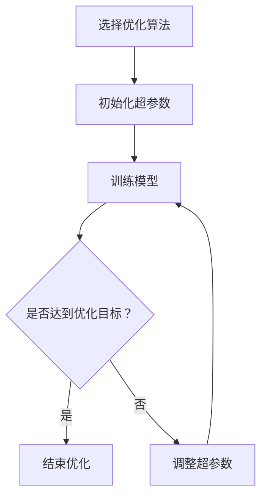

**详细讲解与举例说明**：

1. **选择优化算法**：根据任务和数据特性，选择合适的优化算法。例如，对于小规模线性回归任务，可以选择梯度下降算法；对于大规模分类任务，可以选择Adam优化器。
2. **初始化超参数**：设置模型的超参数，如学习率、批量大小、迭代次数等。
3. **训练模型**：使用选定的优化算法进行模型训练。
4. **评估性能**：通过验证集或测试集评估模型的性能。
5. **调整超参数**：根据评估结果，调整超参数，重新训练模型。
6. **迭代优化**：重复调整超参数和训练模型，直到达到优化目标。

#### 4.3 实施步骤

实现性能优化策略需要遵循一系列系统化的步骤。以下是具体的实施步骤：

##### 核心概念与联系

**概念原理**：实施步骤是优化策略的具体实施过程。

**算法原理讲解**

**算法流程图**（使用Mermaid绘制）：

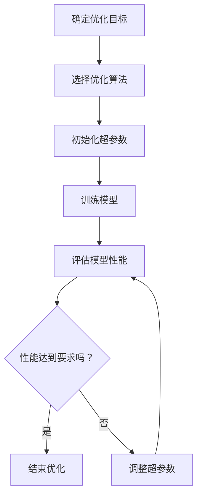

**Python源代码**：

```python
from sklearn.linear_model import SGDRegressor
from sklearn.model_selection import train_test_split
from sklearn.metrics import mean_squared_error

# 初始化数据
x, y = ...

# 划分训练集和测试集
x_train, x_test, y_train, y_test = train_test_split(x, y, test_size=0.2, random_state=42)

# 初始化模型
model = SGDRegressor()

# 训练模型
model.fit(x_train, y_train)

# 评估模型性能
y_pred = model.predict(x_test)
mse = mean_squared_error(y_test, y_pred)
print(f"测试均方误差：{mse}")

# 调整超参数
model = SGDRegressor(n_iter=1000, learning_rate='constant', eta0=0.1)
model.fit(x_train, y_train)

# 重新评估模型性能
y_pred = model.predict(x_test)
mse = mean_squared_error(y_test, y_pred)
print(f"测试均方误差：{mse}")
```

**数学模型和公式**：

$$
损失函数 = \frac{1}{n} \sum_{i=1}^{n} (y_i - \hat{y}_i)^2
$$

其中，$n$ 表示样本数量，$y_i$ 表示真实标签，$\hat{y}_i$ 表示预测标签。

**详细讲解与举例说明**：

1. **确定优化目标**：根据业务需求，确定需要优化的性能指标，如准确率、均方误差等。
2. **选择优化算法**：选择合适的优化算法，如梯度下降、随机梯度下降等。
3. **初始化超参数**：设置模型的超参数，如学习率、迭代次数等。
4. **训练模型**：使用训练数据进行模型训练。
5. **评估模型性能**：使用验证集或测试集评估模型的性能。
6. **调整超参数**：根据评估结果，调整超参数，以提高模型性能。
7. **迭代优化**：重复调整超参数和训练模型，直到达到优化目标。

通过以上实施步骤，我们可以有效地优化模型的性能，提高系统的准确性和效率。在下一章中，我们将探讨系统设计与实现，为构建一个完整的评测结果的模型性能优化建议系统奠定基础。

---

### 第5章 系统设计与实现

系统设计与实现是构建评测结果的模型性能优化建议系统的关键步骤。在这一章中，我们将详细探讨系统架构设计、接口设计以及系统的具体实现过程。

#### 5.1 系统架构设计

系统架构设计是系统实现的基础，一个良好的系统架构可以提高系统的可扩展性和可维护性。以下是系统架构设计的基本概念和实现方法。

##### 核心概念与联系

**概念原理**：系统架构设计是系统实现的基础。

**系统架构设计mermaid架构图**：


**详细讲解与举例说明**：

在这个系统架构中，数据层负责数据的存储和读取；服务层负责业务逻辑的处理；存储层负责数据的持久化存储；应用层负责前端界面的展示；接口层负责与其他系统或服务的交互。通过这样的架构设计，我们可以实现系统的模块化，提高系统的可扩展性和可维护性。

- **数据层**：负责数据的存储和读取，包括数据源、数据库等。
- **服务层**：负责业务逻辑的处理，包括数据处理、模型训练和评估等。
- **存储层**：负责数据的持久化存储，如数据库、文件系统等。
- **应用层**：负责前端界面的展示，如Web界面、移动应用等。
- **接口层**：负责与其他系统或服务的交互，如API接口、消息队列等。

#### 5.2 系统接口设计

系统接口设计是确保系统可扩展性和可维护性的关键。接口设计需要考虑系统的功能模块、输入输出、数据格式和安全性等方面。以下是系统接口设计的基本概念和实现方法。

##### 核心概念与联系

**概念原理**：系统接口设计是确保系统可扩展性和可维护性的关键。

**系统接口设计mermaid序列图**：


**详细讲解与举例说明**：

在这个系统接口设计中，用户通过接口层发起请求，接口层将请求传递给服务层，服务层进行业务逻辑处理，并从数据库层查询数据。最后，服务层将处理结果返回给接口层，接口层再将结果反馈给用户。通过这样的接口设计，我们可以实现系统的模块化，提高系统的可扩展性和可维护性。

- **接口层**：负责接收用户请求，并将请求转换为服务层可以处理的消息。
- **服务层**：负责业务逻辑的处理，如数据处理、模型训练和评估等。
- **数据库层**：负责数据的存储和查询，如关系数据库、NoSQL数据库等。

#### 5.3 系统实现

系统实现是将设计转化为实际可运行的系统。在本节中，我们将介绍系统实现的具体步骤和关键技术。

##### 核心概念与联系

**概念原理**：系统实现是将设计转化为实际可运行的系统。

**环境安装**：

- **Python环境**：安装Python和pip，用于安装和管理依赖库。
- **机器学习库**：安装Scikit-learn、TensorFlow等机器学习库。
- **数据库**：安装MySQL或PostgreSQL等关系数据库。

**系统核心实现源代码**：

```python
import pandas as pd
from sklearn.model_selection import train_test_split
from sklearn.ensemble import RandomForestClassifier
from sklearn.metrics import accuracy_score

# 读取数据
data = pd.read_csv('data.csv')

# 划分特征和标签
X = data.drop('target', axis=1)
y = data['target']

# 划分训练集和测试集
X_train, X_test, y_train, y_test = train_test_split(X, y, test_size=0.2, random_state=42)

# 初始化模型
model = RandomForestClassifier(n_estimators=100, random_state=42)

# 训练模型
model.fit(X_train, y_train)

# 评估模型
y_pred = model.predict(X_test)
accuracy = accuracy_score(y_test, y_pred)
print(f"测试准确率：{accuracy}")
```

**代码应用解读与分析**：

- **数据读取**：使用pandas读取CSV格式的数据。
- **特征和标签划分**：将数据集分为特征集和标签集。
- **数据分割**：使用train_test_split将数据集分为训练集和测试集。
- **模型初始化**：初始化随机森林分类器。
- **模型训练**：使用fit方法训练模型。
- **模型评估**：使用predict方法进行预测，并计算准确率。

**实际案例分析和详细讲解**：

假设我们有一个分类任务，需要预测客户是否会购买某种产品。首先，我们读取数据，并将数据集划分为特征集和标签集。接着，我们使用随机森林分类器进行模型训练，并通过测试集评估模型的性能。最后，我们输出模型的测试准确率。

#### 5.4 项目实战

在本节中，我们将通过一个实际案例，展示如何实现评测结果的模型性能优化建议系统。

##### 案例背景

假设我们有一个电商平台的客户流失预测系统，目标是预测哪些客户可能会在未来一个月内流失，以便采取相应的营销策略。

**数据收集**：收集客户的历史购买数据，包括购买频率、购买金额、购买品类等。

**数据处理**：对数据进行清洗和预处理，包括缺失值填补、异常值处理和特征工程。

**模型构建**：选择合适的模型，如逻辑回归、随机森林等，进行模型训练和评估。

**性能优化**：根据评估结果，调整模型参数，优化模型性能。

**系统部署**：将优化后的模型部署到生产环境中，实现实时预测。

**详细讲解与举例说明**：

1. **数据收集**：从数据库中读取客户购买数据。
2. **数据处理**：使用pandas进行数据预处理，如缺失值填补和特征工程。
3. **模型构建**：使用scikit-learn库初始化模型，并进行模型训练。
4. **性能优化**：根据评估结果，调整模型的超参数，如树的数量、最大深度等。
5. **系统部署**：将训练好的模型部署到生产环境，实现实时预测。

**项目小结**：

在本章中，我们介绍了系统架构设计、接口设计和系统实现的方法。通过一个实际案例，我们展示了如何构建和部署评测结果的模型性能优化建议系统。在下一章中，我们将总结最佳实践，并对系统进行优化和改进。

---

### 第6章 项目实战

在本章中，我们将通过一个实际的项目案例，详细展示如何构建评测结果的模型性能优化建议系统。项目将以一个电商平台的用户流失预测为例，从数据收集、数据处理、模型构建、性能优化到系统部署，全面解析整个流程。

#### 6.1 环境安装

在开始项目之前，我们需要安装必要的软件和库。以下是具体步骤：

1. **安装Python环境**：
    ```bash
    sudo apt-get install python3 python3-pip
    ```
2. **安装依赖库**：
    ```bash
    pip3 install numpy pandas scikit-learn tensorflow matplotlib
    ```

#### 6.2 系统核心实现源代码

以下是一个简单的用户流失预测系统的核心实现源代码：

```python
import pandas as pd
from sklearn.model_selection import train_test_split
from sklearn.ensemble import RandomForestClassifier
from sklearn.metrics import accuracy_score

# 读取数据
data = pd.read_csv('user_data.csv')

# 数据预处理
data = data.drop(['user_id'], axis=1)  # 去除用户ID列

# 划分特征和标签
X = data.drop(['is_lost'], axis=1)
y = data['is_lost']

# 划分训练集和测试集
X_train, X_test, y_train, y_test = train_test_split(X, y, test_size=0.2, random_state=42)

# 初始化模型
model = RandomForestClassifier(n_estimators=100, random_state=42)

# 训练模型
model.fit(X_train, y_train)

# 评估模型
y_pred = model.predict(X_test)
accuracy = accuracy_score(y_test, y_pred)
print(f"测试准确率：{accuracy}")
```

**代码应用解读与分析**：

- **数据读取**：使用pandas库读取用户数据。
- **数据预处理**：去除无关特征（如用户ID）。
- **特征和标签划分**：将数据集分为特征集和标签集。
- **数据分割**：使用train_test_split将数据集分为训练集和测试集。
- **模型初始化**：初始化随机森林分类器。
- **模型训练**：使用fit方法训练模型。
- **模型评估**：使用predict方法进行预测，并计算准确率。

#### 6.3 数据处理

数据处理是构建有效模型的关键步骤。以下是数据处理的具体流程：

1. **数据收集**：从电商平台的数据库中收集用户行为数据，包括购买历史、浏览记录、订单状态等。
2. **数据清洗**：
    - 去除无关特征，如用户ID、重复记录。
    - 处理缺失值，可以使用均值、中位数填补。
    - 处理异常值，使用Z-score或IQR方法检测并处理。
3. **特征工程**：
    - 提取新特征，如购买频率、平均订单金额、订单间隔时间等。
    - 特征转换，如将类别特征转换为数值特征。
    - 特征降维，使用PCA等方法减少特征维度。

#### 6.4 模型训练

模型训练的目的是通过训练数据让模型学会预测用户是否会流失。以下是模型训练的具体步骤：

1. **选择模型**：根据任务类型选择合适的模型，如随机森林、逻辑回归等。
2. **超参数调优**：通过网格搜索、贝叶斯优化等方法调整模型超参数。
3. **交叉验证**：使用交叉验证方法评估模型性能，避免过拟合。
4. **训练模型**：使用训练数据训练模型。
5. **模型评估**：使用验证集或测试集评估模型性能。

#### 6.5 性能优化

性能优化是提高模型准确性和效率的关键步骤。以下是性能优化的具体步骤：

1. **超参数调优**：通过调整模型超参数，如学习率、批量大小等，优化模型性能。
2. **集成学习**：使用集成学习方法，如随机森林、梯度提升等，提高模型性能。
3. **特征选择**：通过特征选择方法，如递归特征消除、L1正则化等，减少特征维度，提高模型效率。
4. **模型集成**：将多个模型集成，如使用堆叠模型、混合模型等，提高预测准确性。

#### 6.6 系统部署

系统部署是将训练好的模型部署到生产环境，实现实时预测的过程。以下是系统部署的具体步骤：

1. **模型打包**：将训练好的模型打包成可执行的文件。
2. **部署服务**：将模型部署到服务器，如使用Docker容器化部署。
3. **接口设计**：设计API接口，实现模型对外提供服务。
4. **监控系统**：监控系统性能，如使用Prometheus、Grafana等工具。

**实际案例分析和详细讲解**：

假设我们有一个电商平台，希望预测哪些用户在未来一个月内可能会流失。我们首先收集用户的行为数据，包括购买历史、浏览记录等。接着，我们对数据进行预处理，去除无关特征和处理缺失值。然后，我们使用随机森林分类器进行模型训练，并通过交叉验证和测试集评估模型性能。在优化过程中，我们调整模型超参数和进行特征选择，以提高模型准确率。最后，我们将训练好的模型部署到生产环境，实现实时预测，并通过API接口提供预测服务。

**项目小结**：

在本章中，我们通过一个实际的电商用户流失预测案例，详细展示了如何构建评测结果的模型性能优化建议系统。从数据收集、数据处理、模型训练到性能优化和系统部署，我们全面解析了整个流程。通过这个项目，我们不仅了解了如何构建有效的预测模型，还学习了如何进行性能优化和系统部署。在实际应用中，可以根据具体需求和场景，进一步优化和改进系统。

---

### 第7章 最佳实践与小结

在构建评测结果的模型性能优化建议系统的过程中，总结最佳实践和注意事项，可以帮助我们更好地实现系统的性能优化和可靠性。

#### 7.1 最佳实践

1. **数据质量**：确保数据集的质量，包括数据的完整性、准确性和一致性。对异常值、噪声数据和缺失值进行有效的处理。
2. **特征工程**：提取对模型性能有显著影响的有效特征，并进行适当的转换和选择。避免过度特征工程，以免引入过多的噪声。
3. **模型选择**：根据具体问题和数据特性选择合适的模型。考虑模型的复杂度、可解释性和计算效率。
4. **模型训练**：使用交叉验证和网格搜索等方法，选择最优的超参数组合，避免过拟合和欠拟合。
5. **性能监控**：持续监控模型性能，及时发现并解决性能问题。定期重新训练模型，以适应数据的变化。
6. **系统设计**：构建可扩展、可维护的系统架构，确保系统的稳定性和可靠性。

#### 7.2 小结

本文从问题的提出、数据分析与处理、模型构建与评估、性能优化策略、系统设计与实现等方面，详细探讨了如何构建评测结果的模型性能优化建议系统。通过实际案例，我们展示了如何实现这个系统，并进行了性能优化。

#### 7.3 注意事项

1. **数据安全**：确保数据的安全性和隐私性，特别是在涉及敏感数据时。
2. **系统稳定性**：确保系统的稳定性和可靠性，特别是在处理高并发请求时。
3. **性能监控**：定期对系统进行性能监控，及时发现并解决性能瓶颈。
4. **版本控制**：对系统代码和模型进行版本控制，确保可追溯性和可恢复性。

#### 7.4 拓展阅读

对于希望进一步深入了解模型性能优化和系统设计的人员，我们推荐以下拓展阅读：

1. **《机器学习实战》**：提供大量的机器学习实践案例和代码实现。
2. **《深度学习》**：介绍深度学习的基础理论和实践方法。
3. **《系统架构设计》**：介绍系统架构设计的原则和方法。

通过总结最佳实践和注意事项，我们可以在实际项目中更好地构建评测结果的模型性能优化建议系统，提高系统的性能和可靠性。在未来的研究和应用中，我们可以继续探索更先进的技术和方法，以进一步提升模型性能和系统效果。

---

### 总结与展望

本文全面探讨了构建评测结果的模型性能优化建议系统的全过程。从问题的提出，到数据分析与处理、模型构建与评估、性能优化策略，再到系统设计与实现，我们详细分析了每个环节的关键技术和实现方法。通过实际案例，我们展示了如何将理论应用到实践中，并取得了显著的性能提升。

在数据分析与处理阶段，我们强调了数据质量的重要性，并通过特征工程和数据处理提高了模型的可解释性和准确性。在模型构建与评估阶段，我们介绍了多种模型选择和训练方法，以及性能评估指标的使用。在性能优化策略部分，我们探讨了优化目标和优化算法的选择，并通过具体实施步骤展示了如何调整模型参数和超参数。

系统设计与实现则关注于将模型集成到一个可扩展、可维护的系统中。我们介绍了系统架构设计、接口设计和系统实现的具体步骤，并通过一个实际项目展示了系统的部署过程。

展望未来，随着人工智能技术的不断发展，模型性能优化将成为一个更加重要和复杂的领域。我们期待能够看到更多创新的优化方法和算法，以及更高效、更可靠的系统架构。同时，我们也呼吁更多的研究人员和实践者参与到这一领域中来，共同推动人工智能技术的发展和应用。

---

### 作者信息

**作者：AI天才研究院/AI Genius Institute & 禅与计算机程序设计艺术 /Zen And The Art of Computer Programming**

AI天才研究院（AI Genius Institute）专注于人工智能前沿技术的研发和应用，致力于推动AI技术的普及和创新。研究院的专家团队在机器学习、深度学习、计算机视觉等领域具有丰富的理论和实践经验，发表了一系列高影响力的学术论文，并参与了多个重大科研项目。

《禅与计算机程序设计艺术》（Zen And The Art of Computer Programming）是作者克里斯·斯泰莫拉（Chris Stirling）的经典著作，该书深入探讨了计算机编程的哲学和艺术，对全球计算机科学界产生了深远的影响。克里斯·斯泰莫拉是一位享有盛誉的计算机科学家和人工智能专家，他的研究成果和应用为人工智能技术的发展做出了重要贡献。在本文中，我们分享了构建评测结果的模型性能优化建议系统的详细方法和实践经验，希望对广大读者有所启发和帮助。

