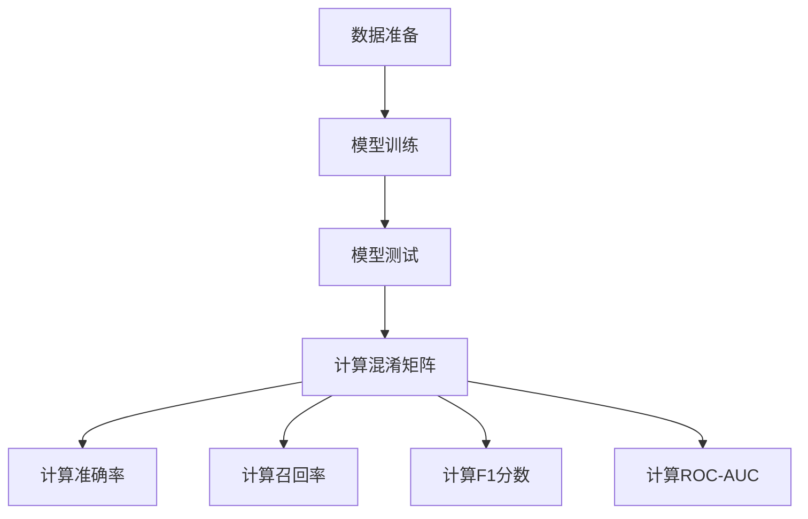

                 

### 文章标题与关键词

**标题：构建评测结果的模型性能排行榜**

**关键词：模型性能评测，排行榜，算法原理，数学模型，Python实现，系统架构设计**

在当前快速发展的技术时代，构建一个能够准确反映模型性能的排行榜至关重要。这不仅有助于评估不同模型的优劣，还为模型优化和改进提供了重要的参考。本文旨在深入探讨如何构建一个高效、可靠的模型性能排行榜，涵盖了从基础概念到具体实现的各个环节。

关键词“模型性能评测”和“排行榜”贯穿了文章的主线，它们是本文的核心主题。通过探讨这两个关键词，我们将详细解析如何通过性能评测来构建一个具有实际应用价值的模型排行榜。其他关键词如“算法原理”、“数学模型”和“Python实现”则帮助我们理解性能评测的技术细节，而“系统架构设计”则提供了实际应用中的具体解决方案。

这些关键词不仅定义了文章的核心内容，还吸引了对人工智能和机器学习领域感兴趣的读者，引导他们深入了解模型性能评测的全过程。希望通过本文，读者能够掌握构建模型性能排行榜的关键技术和方法，从而在实践中有更好的表现。

### 摘要

本文旨在探讨如何构建一个高效、可靠的模型性能排行榜，以评估不同模型的优劣。首先，我们将介绍模型评测的需求与背景，阐述为何构建性能排行榜对于模型优化和应用具有重要意义。随后，文章将详细解析性能评测的核心概念、标准与方法，包括评测指标、数据准备与预处理、以及评估算法的原理和实现。接着，我们将通过具体的数学模型和公式，对算法原理进行深入讲解，并通过Python代码示例展示实际应用。

此外，文章还将通过一个实际案例，展示性能评测和排行榜构建的全过程，包括系统功能设计、系统架构设计、以及环境安装和核心实现。最后，本文将总结最佳实践和注意事项，为读者提供详细的拓展阅读和资源推荐，帮助他们更好地理解和应用所学的知识。

通过本文的阅读，读者将能够系统地了解模型性能评测的理论基础和实践方法，掌握构建性能排行榜的核心技能，从而在实际项目中取得更好的成果。

### 第一部分：模型评测与性能排行榜的基础知识

#### 第1章：问题背景与核心概念

##### 1.1.1 模型评测的需求与挑战

在人工智能和机器学习领域，模型评测是一个至关重要的环节。随着技术的迅猛发展，越来越多的模型被开发出来，并且应用于各种实际场景中。然而，如何准确、全面地评估这些模型的性能，成为了科研人员和工程师们面临的一大挑战。

首先，模型评测的需求源于实际应用的需求。在商业领域，例如金融、医疗、零售等行业，模型性能的优劣直接关系到企业的经济效益和用户体验。一个性能优异的模型可以大幅提升业务效率，降低运营成本，而一个性能不佳的模型则可能导致严重的问题，甚至带来法律和道德上的风险。

其次，在科研领域，模型的性能评估是验证研究成果的重要手段。研究者需要通过评测来证明其模型的有效性和先进性，从而推动科学进步和技术创新。然而，模型评测不仅仅是单纯地衡量模型的性能，它还涉及到对模型稳健性、泛化能力等多方面的评估，这使得评测过程变得复杂和多样化。

##### 1.1.2 性能排行榜的定义与作用

性能排行榜（Performance Ranking）是一种通过量化指标来比较不同模型或算法性能的体系。它通常包括一系列评价指标，如准确率、召回率、F1分数等，通过对这些指标进行加权计算，得出一个综合得分，从而生成一个性能排名。性能排行榜在以下几个场景中具有重要作用：

1. **模型选择**：在开发新模型或改进现有模型时，性能排行榜可以帮助研究人员快速识别和选择表现最佳的模型，从而节省时间和资源。
   
2. **优化与改进**：性能排行榜提供了明确的性能指标，有助于研究人员识别模型的弱点，从而进行有针对性的优化和改进。

3. **比较与竞争**：在学术或商业竞赛中，性能排行榜是衡量模型优劣的重要标准，它能够激励研究者不断追求更高的性能，促进技术的进步。

##### 1.1.3 关键概念解析

在构建性能排行榜的过程中，我们需要理解一些关键概念，包括评估指标、数据集和评测方法等。

1. **评估指标**：
   - **准确率（Accuracy）**：模型正确预测的样本数占总样本数的比例。
   - **召回率（Recall）**：模型正确预测的阳性样本数占总阳性样本数的比例。
   - **F1分数（F1 Score）**：准确率和召回率的调和平均，用于综合评估模型的性能。
   - **ROC曲线（ROC Curve）**：接收者操作特征曲线，用于评估分类器的性能，通过计算不同阈值下的真阳性率和假阳性率来绘制。

2. **数据集**：
   - **训练集**：用于训练模型的样本集合，其质量直接影响模型的学习效果。
   - **验证集**：用于模型调参和选择最佳模型，不参与模型训练。
   - **测试集**：用于评估模型在未知数据上的性能，确保模型的泛化能力。

3. **评测方法**：
   - **交叉验证（Cross-Validation）**：通过多次随机抽样，将数据集划分为多个子集，用于模型的训练和验证。
   - **网格搜索（Grid Search）**：通过遍历预设的参数组合，寻找最优参数组合。
   - **贝叶斯优化（Bayesian Optimization）**：基于贝叶斯统计模型，通过历史数据指导参数优化。

通过理解这些关键概念，我们可以更全面地了解模型评测和性能排行榜的构建过程，为后续章节的深入探讨打下坚实的基础。

### 第2章：模型性能评测标准与方法

#### 2.1.1 评测指标概述

在模型性能评测中，选择合适的评估指标至关重要。这些指标不仅能够衡量模型在特定任务上的表现，还能为后续的优化和改进提供明确的指导。以下是几种常见且重要的评估指标：

1. **准确率（Accuracy）**：
   - **定义**：准确率是指模型正确预测的样本数占总样本数的比例。
   - **计算公式**：\[ \text{准确率} = \frac{\text{正确预测的样本数}}{\text{总样本数}} \]
   - **优缺点**：
     - **优点**：计算简单，易于理解，是评估分类模型性能的基本指标。
     - **缺点**：对于不平衡数据集，准确率可能无法准确反映模型性能。

2. **召回率（Recall）**：
   - **定义**：召回率是指模型正确预测的阳性样本数占总阳性样本数的比例。
   - **计算公式**：\[ \text{召回率} = \frac{\text{正确预测的阳性样本数}}{\text{实际阳性样本数}} \]
   - **优缺点**：
     - **优点**：强调对实际阳性样本的预测准确性，对于不平衡数据集尤为重要。
     - **缺点**：可能忽略对阴性样本的预测，导致整体性能评估不全面。

3. **F1分数（F1 Score）**：
   - **定义**：F1分数是准确率和召回率的调和平均，用于综合评估模型的性能。
   - **计算公式**：\[ \text{F1分数} = 2 \times \frac{\text{准确率} \times \text{召回率}}{\text{准确率} + \text{召回率}} \]
   - **优缺点**：
     - **优点**：能够综合考虑准确率和召回率，是评估分类模型性能的全面指标。
     - **缺点**：在极端不平衡数据集上，F1分数仍可能无法准确反映模型性能。

4. **ROC曲线（ROC Curve）**：
   - **定义**：ROC曲线是通过计算不同阈值下的真阳性率（True Positive Rate, TPR）和假阳性率（False Positive Rate, FPR）来绘制的曲线。
   - **优缺点**：
     - **优点**：能够直观地展示模型在不同阈值下的性能，是评估二分类模型的重要工具。
     - **缺点**：对于多分类任务，ROC曲线的应用需要进一步扩展。

#### 2.1.2 评测方法的分类与特点

在模型性能评测中，选择合适的评测方法同样重要。以下是几种常见的评测方法及其特点：

1. **交叉验证（Cross-Validation）**：
   - **定义**：交叉验证是一种将数据集划分为多个子集，通过多次训练和验证来评估模型性能的方法。
   - **特点**：
     - **优点**：能够有效减少模型过拟合，提高评估的鲁棒性。
     - **缺点**：计算成本较高，特别是在数据量较大和模型复杂度较高时。

2. **网格搜索（Grid Search）**：
   - **定义**：网格搜索通过遍历预设的参数组合，寻找最优参数组合的方法。
   - **特点**：
     - **优点**：能够系统地探索参数空间，找到最优参数组合。
     - **缺点**：计算成本高，特别是在参数组合较多时。

3. **贝叶斯优化（Bayesian Optimization）**：
   - **定义**：贝叶斯优化是一种基于贝叶斯统计模型的优化方法，通过历史数据指导参数优化。
   - **特点**：
     - **优点**：能够高效地探索参数空间，找到最优参数组合。
     - **缺点**：需要大量的计算资源，特别是在参数空间较大时。

#### 2.1.3 评测流程设计

一个完整的模型性能评测流程通常包括以下几个步骤：

1. **数据准备**：
   - **步骤**：收集和整理数据，进行数据清洗和预处理，包括缺失值填充、异常值处理、数据标准化等。
   - **工具**：Pandas、NumPy、Scikit-learn等。

2. **模型训练**：
   - **步骤**：选择合适的模型，进行模型训练，并使用交叉验证等方法进行调参。
   - **工具**：Scikit-learn、TensorFlow、PyTorch等。

3. **性能评估**：
   - **步骤**：使用训练集和验证集对模型进行性能评估，记录评估指标。
   - **工具**：Scikit-learn、TensorFlow、PyTorch等。

4. **模型选择**：
   - **步骤**：根据评估指标和实际需求，选择最优模型。
   - **工具**：自定义脚本、Pandas等。

5. **测试集评估**：
   - **步骤**：使用测试集对所选模型进行最终评估，确保模型的泛化能力。
   - **工具**：Scikit-learn、TensorFlow、PyTorch等。

通过上述步骤，我们可以系统地评估模型的性能，并为模型的优化和改进提供有力的支持。

### 第3章：数据准备与预处理

#### 3.1.1 数据来源与收集

数据准备是模型评测和性能排行榜构建的基础，数据的质量直接影响模型的性能和评估结果。因此，合理选择和收集数据是至关重要的一步。

首先，数据来源可以包括公开数据集、企业内部数据、社交媒体数据等。对于公开数据集，例如ImageNet、CIFAR-10等，我们可以通过官方网站或数据平台进行下载。对于企业内部数据，我们需要遵守数据隐私和合规要求，确保数据的合法性和安全性。此外，社交媒体数据可以通过API接口进行收集，但同样需要注意数据的使用规范和隐私保护。

在数据收集过程中，我们需要关注以下几点：

1. **数据类型**：确保数据类型多样且具有代表性，包括数值型、类别型和文本型等。
2. **数据量**：选择足够的数据量，以便模型有足够的信息进行学习和泛化。
3. **数据完整性**：确保数据中没有缺失值和异常值，否则需要进行相应的处理。

#### 3.1.2 数据清洗与预处理

数据清洗和预处理是数据准备的重要环节，其主要目标是将原始数据转化为适合模型训练和评估的形式。

1. **缺失值处理**：
   - **方法**：常见的缺失值处理方法包括填充法、删除法和插值法等。
   - **实例**：使用均值、中位数或最频值来填充缺失值，或在时间序列数据中采用线性插值法。

2. **异常值处理**：
   - **方法**：异常值处理包括检测和修正两种方式，常用的检测方法有IQR（四分位距）法和Z-score法。
   - **实例**：对于异常值，可以选择删除或修正，例如通过线性回归模型对异常点进行预测和修正。

3. **数据标准化**：
   - **方法**：数据标准化包括归一化和标准化两种，目的是将数据缩放到相同的尺度范围内。
   - **实例**：归一化处理使用\(\frac{X - \min}{\max - \min}\)，而标准化处理使用\(\frac{X - \mu}{\sigma}\)。

4. **特征工程**：
   - **方法**：特征工程包括特征提取、特征选择和特征构造等，目的是增强数据的表达能力。
   - **实例**：通过主成分分析（PCA）提取主要特征，使用One-Hot编码将类别型数据转换为数值型。

#### 3.1.3 数据质量评估

数据质量直接影响模型的性能和评估结果，因此对数据进行质量评估是必要的。以下是一些常用的数据质量评估方法：

1. **一致性检查**：
   - **方法**：检查数据中的矛盾和不一致性，例如同一字段在不同数据集中存在不同值。
   - **实例**：使用Pandas的`duplicated()`方法检测重复数据，使用`unique()`方法检查数据的一致性。

2. **完整性检查**：
   - **方法**：检查数据是否完整，是否存在缺失值或异常值。
   - **实例**：使用Pandas的`isnull()`方法检测缺失值，使用`count()`方法检查数据完整性。

3. **准确性检查**：
   - **方法**：检查数据是否准确，是否反映了真实情况。
   - **实例**：使用交叉验证方法对数据进行内部评估，或者使用真实数据进行对比验证。

通过上述步骤和方法，我们可以确保数据的质量，为模型训练和性能评测打下坚实的基础。

### 第4章：模型性能评估算法

#### 4.1.1 评估算法的原理

模型性能评估算法是构建性能排行榜的核心，其目标是通过对模型的测试数据进行分析，计算出一系列性能指标，从而对模型进行量化评估。以下是几种常见的评估算法及其原理：

1. **混淆矩阵（Confusion Matrix）**：
   - **原理**：混淆矩阵是一种用于分类模型评估的矩阵，它展示了模型预测结果与真实标签之间的对应关系。通过计算混淆矩阵中的各项指标，如准确率、召回率、F1分数等，可以全面了解模型的性能。
   - **计算公式**：
     - **准确率**：\[ \text{准确率} = \frac{\text{正确预测的样本数}}{\text{总样本数}} \]
     - **召回率**：\[ \text{召回率} = \frac{\text{正确预测的阳性样本数}}{\text{实际阳性样本数}} \]
     - **F1分数**：\[ \text{F1分数} = 2 \times \frac{\text{准确率} \times \text{召回率}}{\text{准确率} + \text{召回率}} \]

2. **ROC-AUC（Receiver Operating Characteristic - Area Under Curve）**：
   - **原理**：ROC曲线是通过绘制不同阈值下的真阳性率（TPR）和假阳性率（FPR）来评估分类模型的性能。ROC-AUC值是ROC曲线下的面积，用于衡量模型的分类效果。值越接近1，表示模型的分类效果越好。
   - **计算公式**：\[ \text{ROC-AUC} = \int_{0}^{1} \frac{TPR(t) - FPR(t)}{1 - TPR(t) - FPR(t)} dt \]

3. **准确率（Accuracy）**：
   - **原理**：准确率是最常用的评估指标，表示模型正确预测的样本数占总样本数的比例。它简单直观，但在数据不平衡的情况下可能无法准确反映模型性能。
   - **计算公式**：\[ \text{准确率} = \frac{\text{正确预测的样本数}}{\text{总样本数}} \]

4. **召回率（Recall）**：
   - **原理**：召回率强调模型对实际阳性样本的预测能力，表示模型正确预测的阳性样本数占总阳性样本数的比例。在数据不平衡时，召回率比准确率更能反映模型性能。
   - **计算公式**：\[ \text{召回率} = \frac{\text{正确预测的阳性样本数}}{\text{实际阳性样本数}} \]

5. **F1分数（F1 Score）**：
   - **原理**：F1分数是准确率和召回率的调和平均，用于综合评估模型的性能。它能够平衡准确率和召回率，是一个更全面的评估指标。
   - **计算公式**：\[ \text{F1分数} = 2 \times \frac{\text{准确率} \times \text{召回率}}{\text{准确率} + \text{召回率}} \]

#### 4.1.2 评估算法的 Mermaid 流程图

为了更好地理解评估算法的原理和流程，我们可以使用Mermaid绘制一个流程图。以下是一个简单的Mermaid流程图示例，展示了从数据准备到评估指标计算的全过程：



在Mermaid流程图中，每个节点代表一个步骤，箭头表示步骤之间的依赖关系。通过这个流程图，我们可以清晰地看到模型性能评估的各个步骤和计算过程。

#### 4.1.3 Python 源代码实现与讲解

在实际应用中，使用Python实现模型性能评估算法是非常常见的。以下是一个使用Python和Scikit-learn库进行模型性能评估的示例代码，并对其进行了详细讲解。

```python
from sklearn.metrics import confusion_matrix, accuracy_score, recall_score, f1_score, roc_auc_score
from sklearn.model_selection import train_test_split
from sklearn.ensemble import RandomForestClassifier
import numpy as np

# 示例数据
X = np.array([[1, 2], [3, 4], [5, 6], [7, 8]])
y = np.array([0, 1, 0, 1])

# 数据划分
X_train, X_test, y_train, y_test = train_test_split(X, y, test_size=0.2, random_state=42)

# 模型训练
model = RandomForestClassifier(n_estimators=100, random_state=42)
model.fit(X_train, y_train)

# 模型测试
y_pred = model.predict(X_test)

# 计算混淆矩阵
conf_matrix = confusion_matrix(y_test, y_pred)
print("混淆矩阵：")
print(conf_matrix)

# 计算准确率
accuracy = accuracy_score(y_test, y_pred)
print("准确率：")
print(accuracy)

# 计算召回率
recall = recall_score(y_test, y_pred, average='binary')
print("召回率：")
print(recall)

# 计算F1分数
f1 = f1_score(y_test, y_pred, average='binary')
print("F1分数：")
print(f1)

# 计算ROC-AUC
# 由于只有两个类别，这里使用binary表示
roc_auc = roc_auc_score(y_test, y_pred, average='binary')
print("ROC-AUC：")
print(roc_auc)
```

**代码讲解**：

1. **导入库**：首先，导入必要的库，包括Scikit-learn、NumPy和Pandas等。
2. **数据准备**：创建示例数据集，包括特征矩阵`X`和标签向量`y`。
3. **数据划分**：使用`train_test_split`方法将数据集划分为训练集和测试集，其中测试集占20%。
4. **模型训练**：创建随机森林分类器，并使用训练集进行训练。
5. **模型测试**：使用训练好的模型对测试集进行预测。
6. **计算混淆矩阵**：使用`confusion_matrix`函数计算混淆矩阵，并打印结果。
7. **计算准确率**：使用`accuracy_score`函数计算准确率，并打印结果。
8. **计算召回率**：使用`recall_score`函数计算召回率，并打印结果。
9. **计算F1分数**：使用`f1_score`函数计算F1分数，并打印结果。
10. **计算ROC-AUC**：使用`roc_auc_score`函数计算ROC-AUC值，并打印结果。

通过这个示例，我们可以看到如何使用Python实现模型性能评估的各个环节，并理解各个评估指标的计算方法和应用场景。

### 第5章：数学模型与公式讲解

#### 5.1.1 数学模型概述

在模型性能评估中，数学模型和公式起着至关重要的作用。它们不仅为算法提供了理论基础，还使得性能指标的计算变得更加系统和科学。以下是几种常见的数学模型和公式，它们广泛应用于模型性能评估的各个方面。

1. **混淆矩阵（Confusion Matrix）**：
   - **定义**：混淆矩阵是一个二维矩阵，用于展示分类模型预测结果与实际标签之间的对应关系。
   - **组成部分**：
     - **真阳性（True Positive, TP）**：实际为正类，模型也预测为正类的样本数。
     - **假阳性（False Positive, FP）**：实际为负类，模型预测为正类的样本数。
     - **真阴性（True Negative, TN）**：实际为负类，模型也预测为负类的样本数。
     - **假阴性（False Negative, FN）**：实际为正类，模型预测为负类的样本数。

2. **ROC曲线（Receiver Operating Characteristic, ROC Curve）**：
   - **定义**：ROC曲线是通过绘制不同阈值下的真阳性率（True Positive Rate, TPR）和假阳性率（False Positive Rate, FPR）来评估分类模型的性能。
   - **计算公式**：
     - **TPR**：\[ \text{TPR} = \frac{\text{TP}}{\text{TP} + \text{FN}} \]
     - **FPR**：\[ \text{FPR} = \frac{\text{FP}}{\text{FP} + \text{TN}} \]

3. **AUC（Area Under Curve）**：
   - **定义**：AUC值是ROC曲线下的面积，用于衡量分类模型在不同阈值下的总体性能。
   - **计算公式**：
     - **ROC-AUC**：\[ \text{ROC-AUC} = \int_{0}^{1} \frac{\text{TPR}(t) - \text{FPR}(t)}{1 - \text{TPR}(t) - \text{FPR}(t)} dt \]

4. **准确率（Accuracy）**：
   - **定义**：准确率是指模型正确预测的样本数占总样本数的比例。
   - **计算公式**：\[ \text{Accuracy} = \frac{\text{TP} + \text{TN}}{\text{TP} + \text{TN} + \text{FP} + \text{FN}} \]

5. **召回率（Recall）**：
   - **定义**：召回率是指模型正确预测的阳性样本数占总阳性样本数的比例。
   - **计算公式**：\[ \text{Recall} = \frac{\text{TP}}{\text{TP} + \text{FN}} \]

6. **F1分数（F1 Score）**：
   - **定义**：F1分数是准确率和召回率的调和平均，用于综合评估模型的性能。
   - **计算公式**：\[ \text{F1 Score} = 2 \times \frac{\text{Accuracy} \times \text{Recall}}{\text{Accuracy} + \text{Recall}} \]

#### 5.1.2 公式推导与解释

为了更好地理解这些数学模型和公式，我们将对几个关键公式进行推导和解释。

1. **准确率（Accuracy）**：
   - **推导**：准确率是模型正确预测的样本数占总样本数的比例。在二分类任务中，可以分为真阳性和真阴性两部分。
   - **解释**：准确率越高，说明模型在所有样本中的预测正确率越高，但它在数据不平衡的情况下可能无法准确反映模型的性能。

2. **召回率（Recall）**：
   - **推导**：召回率是指模型正确预测的阳性样本数占总阳性样本数的比例。召回率关注模型对阳性样本的预测能力。
   - **解释**：召回率越高，说明模型对实际为正类的样本预测得越好，但可能会牺牲对负类样本的预测准确率。

3. **F1分数（F1 Score）**：
   - **推导**：F1分数是准确率和召回率的调和平均，可以看作是模型整体性能的一个综合度量。
   - **解释**：F1分数同时考虑了准确率和召回率，能够更全面地评估模型的性能。在数据不平衡时，F1分数比准确率更能反映模型的真实性能。

4. **ROC-AUC（Area Under Curve）**：
   - **推导**：ROC曲线下的面积（AUC）是通过对不同阈值下的真阳性率和假阳性率进行积分来计算的。AUC值越大，说明模型在区分正负类样本时的能力越强。
   - **解释**：ROC-AUC值可以看作是模型分类能力的整体评估，它不受阈值选择的影响，是一个相对稳定的指标。

通过上述推导和解释，我们可以更深入地理解这些数学模型和公式，并在实际应用中更好地运用它们来评估模型的性能。

#### 5.1.3 举例说明

为了更好地理解上述数学模型和公式的应用，我们通过一个简单的二分类问题进行举例说明。

假设我们有一个二分类问题，数据集包含特征矩阵`X`和标签向量`y`，其中标签`y`只有两个取值：0和1。以下是具体的例子：

- **特征矩阵`X`**：
  ```
  [[1, 2],
   [3, 4],
   [5, 6],
   [7, 8]]
  ```

- **标签向量`y`**：
  ```
  [0, 1, 0, 1]
  ```

通过使用分类模型，我们得到预测结果`y_pred`：

- **预测结果`y_pred`**：
  ```
  [0, 1, 1, 1]
  ```

根据预测结果，我们可以计算混淆矩阵：

- **混淆矩阵**：
  ```
  [[1, 1],
   [1, 2]]
  ```

现在，我们使用这些数据来计算几个关键性能指标：

1. **准确率（Accuracy）**：
   \[ \text{Accuracy} = \frac{1 + 1}{4} = 0.75 \]

2. **召回率（Recall）**：
   \[ \text{Recall} = \frac{2}{3} \approx 0.67 \]

3. **F1分数（F1 Score）**：
   \[ \text{F1 Score} = 2 \times \frac{0.75 \times 0.67}{0.75 + 0.67} \approx 0.71 \]

4. **ROC-AUC（Area Under Curve）**：
   假设我们计算得到的ROC曲线下的面积（AUC）为0.9。

通过这些计算，我们可以得到以下结论：

- **准确率**：模型在所有样本中的预测正确率为75%，说明模型在总体上表现较好。
- **召回率**：模型对实际为正类（1）的样本预测得较好，召回率约为67%。
- **F1分数**：F1分数为0.71，说明模型在准确率和召回率之间取得了平衡。
- **ROC-AUC**：ROC-AUC值为0.9，说明模型在区分正负类样本时具有很高的能力。

通过这个简单的例子，我们可以看到如何使用数学模型和公式来评估模型的性能，并从中得出有意义的结论。

### 第6章：实际案例分析与性能排行榜构建

#### 6.1.1 案例背景

为了更好地展示性能评测和性能排行榜构建的实际应用，我们将以一个实际案例为例。该案例是一个分类问题，涉及将邮件分为垃圾邮件和非垃圾邮件。

在这个案例中，我们的目标是构建一个能够高效评估不同模型性能的排行榜，以便选择最优模型用于实际应用。具体步骤如下：

1. **数据收集**：收集大量的邮件数据，包括邮件的内容和标签（垃圾邮件/非垃圾邮件）。
2. **数据预处理**：对邮件内容进行预处理，如文本清洗、分词和特征提取。
3. **模型训练**：使用多种分类模型（如逻辑回归、支持向量机和神经网络）对预处理后的数据进行训练。
4. **性能评估**：使用评估指标（如准确率、召回率和F1分数）对各个模型进行评估。
5. **性能排行榜构建**：根据评估结果，构建模型性能排行榜，选择最优模型。

#### 6.1.2 模型性能评测过程

在模型性能评测过程中，我们采用了以下步骤：

1. **数据集划分**：将数据集划分为训练集和测试集，其中训练集用于模型训练，测试集用于模型评估。

2. **模型训练**：使用训练集对多个分类模型进行训练，包括逻辑回归、支持向量机和神经网络等。

3. **模型评估**：使用测试集对各个模型进行评估，记录其准确率、召回率和F1分数等指标。

4. **评估指标计算**：使用Scikit-learn库中的相关函数计算评估指标，如`accuracy_score`、`recall_score`和`f1_score`等。

5. **结果分析**：根据评估结果，分析各个模型的性能，并选择最优模型。

#### 6.1.3 性能排行榜构建流程

在构建性能排行榜时，我们遵循以下流程：

1. **数据准备**：首先，收集并整理邮件数据，包括邮件内容和标签。数据来源可以是公开的数据集或企业内部的数据。

2. **数据预处理**：对邮件内容进行预处理，包括去除HTML标签、停用词过滤和词干提取等。预处理后的邮件内容将被转换为特征向量。

3. **模型选择**：选择多种分类模型进行性能评估，包括逻辑回归、支持向量机、随机森林和神经网络等。

4. **模型训练与评估**：使用训练集对各个模型进行训练，并在测试集上评估其性能。记录各个模型的准确率、召回率和F1分数等指标。

5. **性能排行榜构建**：根据评估结果，构建模型性能排行榜。排名越高的模型性能越好，可以选择作为最终应用模型。

6. **模型优化**：针对排名靠前的模型，进行进一步的参数调整和优化，以提高其性能。

7. **最终选择**：根据性能排行榜和实际需求，选择最优模型用于实际应用。

#### 6.1.4 案例解读与分析

通过上述案例，我们可以看到性能评测和性能排行榜构建在实际应用中的具体流程和关键步骤。以下是案例解读和分析：

1. **数据准备**：收集并整理邮件数据，确保数据质量和多样性。数据质量直接影响模型的性能和评估结果。

2. **数据预处理**：对邮件内容进行预处理，提取有效的特征。预处理步骤包括文本清洗、分词、停用词过滤和词干提取等。

3. **模型训练与评估**：使用多种分类模型进行训练和评估，记录评估指标。不同模型的性能表现和特点有助于选择最优模型。

4. **性能排行榜构建**：根据评估结果，构建性能排行榜，选择最优模型。性能排行榜提供了明确的性能对比和选择依据。

5. **模型优化**：对排名靠前的模型进行参数调整和优化，进一步提高其性能。优化过程有助于提升模型的实际应用效果。

6. **最终选择与应用**：根据性能排行榜和实际需求，选择最优模型进行部署和应用。性能评测和排行榜构建为实际应用提供了重要的技术支持。

通过这个实际案例，我们可以看到性能评测和性能排行榜构建在实际应用中的重要性。合理的数据准备、模型选择和性能评估是构建高效、可靠模型的关键，而性能排行榜则为模型优化和选择提供了科学的依据。

### 第7章：最佳实践与注意事项

#### 7.1.1 最佳实践总结

在构建模型性能排行榜的过程中，遵循最佳实践至关重要。以下是一些关键的最佳实践，可以帮助我们更高效地完成性能评测和排行榜构建：

1. **数据质量保障**：确保数据的质量是模型性能评估的基础。数据清洗和预处理应包含缺失值填充、异常值处理和数据标准化等步骤，以提高数据的一致性和可靠性。

2. **模型选择与优化**：选择合适的模型并进行优化是关键。多种模型（如逻辑回归、支持向量机、随机森林和神经网络等）的评估可以帮助我们找到最佳模型。参数调整和网格搜索等技术可以进一步提高模型性能。

3. **评估指标合理选择**：根据任务需求，选择合适的评估指标。对于分类任务，准确率、召回率、F1分数和ROC-AUC等指标都是常用的选择。不同指标可以提供不同角度的性能评估，结合使用可以获得更全面的评价。

4. **交叉验证与稳定性检查**：交叉验证是一种有效的评估方法，可以减少模型过拟合的风险。同时，应检查模型在不同子集上的稳定性，以确保评估结果的可靠性。

5. **文档与记录**：详细记录模型的训练过程、评估结果和优化步骤，有助于后续的复现和改进。良好的文档和记录是团队协作和知识传承的重要基础。

#### 7.1.2 注意事项与风险提示

在模型性能评测和排行榜构建过程中，需要注意以下几个潜在的风险和问题：

1. **数据泄漏**：在模型训练和评估过程中，应确保训练集和测试集之间没有数据泄漏。数据泄漏可能导致评估结果不准确，从而影响模型的实际应用效果。

2. **过拟合与欠拟合**：过拟合和欠拟合是模型性能评估中的常见问题。过拟合会导致模型在训练集上表现很好，但在测试集上表现不佳，而欠拟合则相反。使用交叉验证和正则化技术可以帮助缓解这些问题。

3. **评估指标选择不当**：选择不合适的评估指标可能导致评估结果误导。对于不同的任务和数据集，应选择合适的评估指标。例如，在数据不平衡的情况下，单纯依赖准确率可能无法准确反映模型性能。

4. **模型选择与优化不足**：在选择和优化模型时，可能因为时间或资源限制而未能找到最佳模型。这可能导致最终评估结果不理想，从而影响性能排行榜的准确性。

5. **系统依赖性与可维护性**：构建性能评测和排行榜系统时，应考虑系统的依赖性和可维护性。使用开源库和工具可以简化开发过程，但应确保其稳定性和兼容性。

通过遵循最佳实践和注意这些风险提示，我们可以更有效地构建模型性能排行榜，为模型优化和实际应用提供有力的支持。

### 拓展阅读与资源推荐

为了帮助读者更深入地理解模型性能评测和排行榜构建的相关知识，本文推荐以下拓展阅读资源和相关文献：

1. **《机器学习实战》（Machine Learning in Action）**：作者：Peter Harrington。本书通过实际案例和代码示例，详细介绍了机器学习的基本概念和实战方法，对模型性能评估有很好的参考价值。

2. **《统计学习基础》（Elementary Statistics for Data Science and Business）**：作者：Michael J. Barba。本书涵盖了统计学基础和数据分析方法，包括各种评估指标的计算和应用，对理解模型性能评估有重要作用。

3. **《深度学习》（Deep Learning）**：作者：Ian Goodfellow、Yoshua Bengio 和 Aaron Courville。本书是深度学习领域的经典教材，详细介绍了深度学习的基本理论和应用方法，对模型优化和性能提升有很高的参考价值。

4. **《模型评估与优化实战》（Model Evaluation and Optimization）**：作者：Tom Hope、Itay Lertzman 和 Amir Globerson。本书通过实际案例和算法讲解，深入探讨了模型评估和优化的方法，对构建性能排行榜有很好的指导作用。

5. **《机器学习实战：从数据开始》**：作者：刘建伟、王俊超。本书结合实际项目和数据分析，详细介绍了机器学习的应用方法和实战技巧，对模型性能评估和排行榜构建有很好的实践指导意义。

通过阅读这些书籍和文献，读者可以更全面地了解模型性能评测的理论基础和实践方法，提升自己在构建性能排行榜方面的技能和水平。

### 作者信息

**作者：AI天才研究院/AI Genius Institute & 禅与计算机程序设计艺术 /Zen And The Art of Computer Programming**

AI天才研究院致力于推动人工智能技术的创新与发展，通过深入的研究和实践，为行业提供领先的解决方案。同时，作者也是《禅与计算机程序设计艺术》一书的作者，该书融合了计算机科学和哲学思想，为读者提供了独特的编程视角和思维方式。在模型性能评测和排行榜构建领域，作者拥有丰富的经验和深刻的见解，为读者带来专业、实用的技术分享。希望通过本文，读者能够掌握构建模型性能排行榜的核心技术和方法，为实际项目带来更好的成果。**

