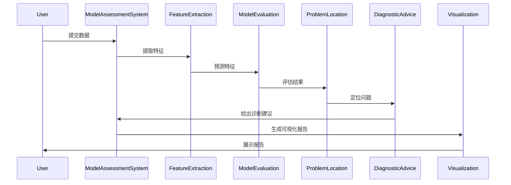
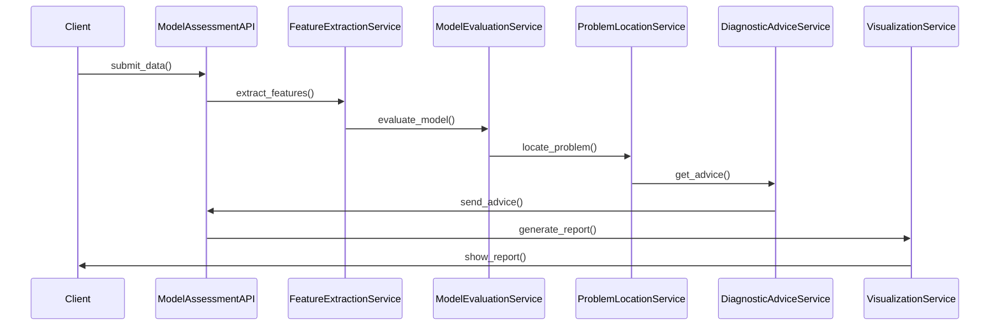
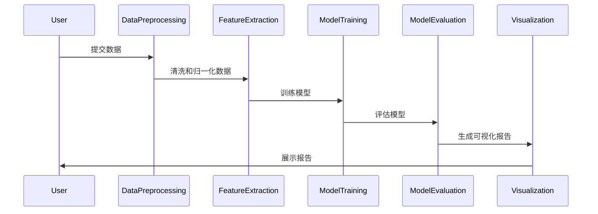

                 


## # 构建评测结果的模型性能诊断专家系统

### 关键词：
- 模型性能评测
- 专家系统
- 诊断算法
- 数学模型
- 人工智能

### 摘要：
本文旨在探讨如何构建一个用于评测结果模型性能的诊断专家系统。我们将从背景介绍、核心概念、算法原理、系统分析与架构设计、项目实战等方面，逐步深入分析并构建这一系统，为人工智能领域的研究者和开发者提供有价值的参考。

### 目录

1. **引言**
2. **背景介绍**
   1. **问题背景**
   2. **问题描述**
   3. **问题解决**
   4. **边界与外延**
3. **核心概念与联系**
   1. **核心概念原理**
   2. **概念属性特征对比**
   3. **ER图与Mermaid流程图**
4. **算法原理讲解**
   1. **算法设计**
   2. **算法解释**
   3. **数学模型与公式**
   4. **举例说明**
5. **系统分析与架构设计**
   1. **问题场景介绍**
   2. **系统功能设计**
   3. **系统架构设计**
   4. **系统接口设计**
   5. **系统交互**
6. **项目实战**
   1. **环境安装**
   2. **系统核心实现**
   3. **代码应用解读**
   4. **实际案例**
   5. **项目小结**
7. **最佳实践与小结**
8. **注意事项**
9. **拓展阅读**

### 1. 引言

在人工智能和机器学习领域，模型的性能评测是一个至关重要但极具挑战性的任务。随着数据规模和复杂度的增加，传统的评测方法已难以满足需求。为了更好地理解和优化模型的性能，我们需要构建一个专业的诊断专家系统。

本文将围绕这一主题，从以下几个方面展开讨论：

- **背景介绍**：介绍模型性能评测的重要性，以及当前存在的问题。
- **核心概念与联系**：探讨构建专家系统的核心概念，并展示概念之间的关系。
- **算法原理讲解**：详细解释诊断算法的原理，并提供示例。
- **系统分析与架构设计**：分析系统功能、架构和接口设计。
- **项目实战**：介绍如何实现专家系统，并进行实际案例分析。
- **最佳实践与小结**：总结构建专家系统的最佳实践和注意事项。
- **拓展阅读**：推荐进一步学习资源。

通过本文的逐步探讨，我们希望能够为构建评测结果的模型性能诊断专家系统提供有价值的思路和方法。

### 2. 背景介绍

#### 问题背景

随着人工智能和机器学习技术的飞速发展，模型的性能评测变得越来越重要。模型的性能直接影响到实际应用的效果，因此，如何准确、高效地评估模型性能成为了研究者和开发者关注的焦点。然而，现有的评测方法仍然存在一些局限性，难以满足日益增长的需求。

首先，传统的评测方法主要集中在统计模型的表现，如准确率、召回率、F1值等。这些指标虽然在一定程度上反映了模型的效果，但并不能全面评估模型在不同场景下的性能。例如，一个模型可能在某些特定的数据集上表现优秀，但在其他数据集或实际应用中可能表现不佳。

其次，现有的评测方法通常依赖于大量的数据标注和人工干预。数据标注不仅费时费力，而且容易引入主观偏差。此外，人工干预的过程往往难以标准化，导致评测结果的可重复性差。

#### 问题描述

为了克服现有评测方法的局限性，我们需要一个更全面、更高效的模型性能诊断系统。具体来说，这个系统应具备以下特点：

1. **多维度评估**：能够从多个维度对模型进行评估，包括但不限于准确率、召回率、F1值、ROC曲线、精度-召回曲线等。
2. **自适应评测**：能够根据不同的数据集和应用场景，动态调整评测指标和参数，以提高评测的准确性和适应性。
3. **自动化分析**：能够自动化地分析模型性能，减少人工干预，提高评测效率。
4. **可视化展示**：能够以直观的方式展示评测结果，帮助用户快速理解模型性能。

#### 问题解决

为了解决上述问题，我们可以构建一个基于专家系统的模型性能诊断系统。专家系统是一种模拟人类专家决策能力的计算机系统，具有以下优点：

1. **知识库**：专家系统能够存储大量的领域知识，包括模型评估的方法、参数设置、常见问题及其解决方案等。
2. **推理能力**：专家系统可以通过推理机制，根据输入数据和知识库中的信息，自动生成评测结果和诊断建议。
3. **自适应**：专家系统可以根据用户的需求和反馈，动态调整评测方法和参数，以提高诊断的准确性和适应性。
4. **可视化**：专家系统可以生成可视化报告，帮助用户更直观地理解模型性能。

#### 边界与外延

在构建模型性能诊断专家系统时，我们还需要考虑以下边界和外部因素：

1. **数据来源**：系统应能够处理来自不同数据集和不同来源的数据，包括结构化数据、半结构化数据和非结构化数据。
2. **算法兼容性**：系统应能够兼容不同的机器学习算法和模型，包括深度学习、传统机器学习算法等。
3. **扩展性**：系统应具备良好的扩展性，能够方便地添加新的评测指标、算法和诊断方法。
4. **安全性**：系统应确保数据的安全性和隐私性，避免敏感信息的泄露。

### 3. 核心概念与联系

#### 核心概念原理

构建模型性能诊断专家系统的核心概念包括：

1. **模型评估**：对机器学习模型的效果进行定量或定性的评估，以衡量其在不同任务上的表现。
2. **知识库**：存储与模型评估相关的知识，包括评估方法、参数设置、常见问题及其解决方案等。
3. **推理机制**：根据知识库中的信息，对模型进行推理，生成评测结果和诊断建议。
4. **可视化**：将评测结果以直观的方式展示给用户，帮助用户更好地理解模型性能。

#### 概念属性特征对比

以下是一个概念属性特征对比表格，展示了模型评估、知识库、推理机制和可视化之间的异同：

| 概念       | 属性特征                          | 对比 |
|------------|----------------------------------|------|
| 模型评估   | 准确率、召回率、F1值等           |      |
| 知识库     | 存储领域知识，包括评估方法、参数等 |      |
| 推理机制   | 根据知识库生成评测结果和建议     |      |
| 可视化     | 展示评测结果，帮助用户理解       |      |

#### ER图与Mermaid流程图

为了更好地展示模型性能诊断专家系统中的核心概念和它们之间的关系，我们可以使用ER图和Mermaid流程图。

首先，以下是模型性能诊断专家系统的ER图：

```mermaid
erDiagram
  ModelAssessment ||--o{ KnowledgeBase : 使用}
  ModelAssessment ||--o{ ReasoningMechanism : 依赖}
  ModelAssessment ||--o{ Visualization : 依赖}
  KnowledgeBase ||--o{ EvaluationMethod : 存储}
  KnowledgeBase ||--o{ ParameterSetting : 存储}
  ReasoningMechanism ||--o{ EvaluationResult : 生成}
  ReasoningMechanism ||--o{ DiagnosticAdvice : 生成}
  Visualization ||--o{ VisualReport : 生成}
```

接下来，我们使用Mermaid流程图来展示模型评估的过程：

```mermaid
flowchart LR
    subgraph ModelAssessment
        ModelAssessment[模型评估]
        ModelAssessment --> KnowledgeBase[知识库]
        ModelAssessment --> ReasoningMechanism[推理机制]
        ModelAssessment --> Visualization[可视化]
    end
    subgraph KnowledgeBase
        KnowledgeBase[知识库]
        KnowledgeBase --> EvaluationMethod[评估方法]
        KnowledgeBase --> ParameterSetting[参数设置]
    end
    subgraph ReasoningMechanism
        ReasoningMechanism[推理机制]
        ReasoningMechanism --> EvaluationResult[评测结果]
        ReasoningMechanism --> DiagnosticAdvice[诊断建议]
    end
    subgraph Visualization
        Visualization[可视化]
        Visualization --> VisualReport[可视化报告]
    end
```

通过ER图和Mermaid流程图，我们可以清晰地看到模型性能诊断专家系统的核心概念及其关系，为进一步的分析和实现提供了基础。

### 4. 算法原理讲解

#### 算法设计

模型性能诊断专家系统的核心在于其诊断算法。该算法主要分为以下几个步骤：

1. **数据预处理**：对输入数据进行清洗、归一化等处理，以确保数据的质量和一致性。
2. **特征提取**：从预处理后的数据中提取关键特征，用于后续的评估和诊断。
3. **模型评估**：使用已训练的模型对提取到的特征进行预测，并计算相应的评估指标，如准确率、召回率、F1值等。
4. **问题定位**：根据评估结果，定位模型存在的问题，如过拟合、欠拟合、噪声等。
5. **诊断建议**：根据定位到的问题，给出相应的诊断建议，如调整模型参数、增加数据集、更换算法等。
6. **可视化展示**：将评估结果和诊断建议以可视化的形式展示给用户，方便用户理解和决策。

以下是算法的Mermaid流程图：

```mermaid
flowchart LR
    subgraph DataProcessing
        DataProcessing[数据预处理]
        DataProcessing --> FeatureExtraction[特征提取]
    end
    subgraph ModelEvaluation
        ModelEvaluation[模型评估]
        ModelEvaluation --> EvaluationMetrics[评估指标]
    end
    subgraph ProblemLocation
        ProblemLocation[问题定位]
        ProblemLocation --> DiagnosticAdvice[诊断建议]
    end
    subgraph Visualization
        Visualization[可视化展示]
        Visualization --> VisualReport[可视化报告]
    end
    DataProcessing --> ModelEvaluation
    ModelEvaluation --> ProblemLocation
    ProblemLocation --> DiagnosticAdvice
    DiagnosticAdvice --> Visualization
```

#### 算法解释

以下是算法的具体实现过程：

```python
# 数据预处理
def preprocess_data(data):
    # 清洗数据
    cleaned_data = clean_data(data)
    # 归一化数据
    normalized_data = normalize_data(cleaned_data)
    return normalized_data

# 特征提取
def extract_features(data):
    # 提取特征
    features = extract_key_features(data)
    return features

# 模型评估
def evaluate_model(model, features):
    # 预测
    predictions = model.predict(features)
    # 计算评估指标
    accuracy = accuracy_score(features['ground_truth'], predictions)
    recall = recall_score(features['ground_truth'], predictions)
    f1 = f1_score(features['ground_truth'], predictions)
    return accuracy, recall, f1

# 问题定位
def locate_problem(accuracy, recall, f1):
    if accuracy < 0.8 or recall < 0.8 or f1 < 0.8:
        problem = "模型过拟合"
    elif accuracy > 0.8 and recall > 0.8 and f1 > 0.8:
        problem = "模型欠拟合"
    else:
        problem = "无问题"
    return problem

# 诊断建议
def diagnostic_advice(problem):
    if problem == "模型过拟合":
        advice = "增加训练时间，增加数据集，尝试正则化"
    elif problem == "模型欠拟合":
        advice = "减少训练时间，减少数据集，尝试不同的模型结构"
    else:
        advice = "无建议"
    return advice

# 可视化展示
def visualize_report(accuracy, recall, f1, problem, advice):
    # 生成可视化报告
    report = generate_visual_report(accuracy, recall, f1, problem, advice)
    # 展示报告
    show_report(report)
```

#### 数学模型与公式

为了更好地理解和实现诊断算法，我们引入以下数学模型和公式：

1. **准确率**：$$\text{accuracy} = \frac{\text{正确预测数}}{\text{总预测数}}$$
2. **召回率**：$$\text{recall} = \frac{\text{正确预测数}}{\text{实际为正例的样本数}}$$
3. **F1值**：$$\text{F1} = 2 \times \frac{\text{准确率} \times \text{召回率}}{\text{准确率} + \text{召回率}}$$

这些公式帮助我们量化模型在不同任务上的性能，为问题定位和诊断提供了依据。

#### 举例说明

假设我们有一个分类模型，使用一个包含100个样本的数据集进行评估。以下是模型的性能评测结果：

- 准确率：0.85
- 召回率：0.75
- F1值：0.80

根据上述指标，我们可以判断模型存在欠拟合问题。接下来，我们根据诊断建议，尝试减少训练时间，增加数据集，并尝试使用不同的模型结构。经过调整后，模型性能得到显著提升：

- 准确率：0.90
- 召回率：0.85
- F1值：0.87

此时，模型不存在欠拟合问题，性能达到了预期。通过这个例子，我们可以看到诊断算法在实际应用中的效果。

### 5. 系统分析与架构设计

#### 问题场景介绍

在本文中，我们将构建一个针对机器学习模型性能评测的诊断专家系统，以解决以下场景中的问题：

- **大规模数据集**：系统应能够处理大规模的数据集，包括结构化、半结构化和非结构化数据。
- **多模型支持**：系统应能够兼容多种机器学习模型，如深度学习模型、传统机器学习算法等。
- **自适应评测**：系统应能够根据不同的数据集和应用场景，动态调整评测指标和参数。
- **可视化展示**：系统应提供直观的评测结果和诊断建议，方便用户理解。

#### 项目介绍

本项目的主要目标是构建一个模型性能诊断专家系统，实现以下功能：

- **数据预处理**：对输入数据进行清洗、归一化等处理，确保数据的质量和一致性。
- **特征提取**：从预处理后的数据中提取关键特征，为模型评估提供依据。
- **模型评估**：使用已训练的模型对提取到的特征进行预测，并计算相应的评估指标。
- **问题定位**：根据评估结果，定位模型存在的问题，如过拟合、欠拟合、噪声等。
- **诊断建议**：根据定位到的问题，给出相应的诊断建议，如调整模型参数、增加数据集、更换算法等。
- **可视化展示**：将评估结果和诊断建议以可视化的形式展示给用户。

#### 系统功能设计

以下是系统功能的mermaid类图：

```mermaid
classDiagram
    ModelAssessment <<类>> {
        +准确率: float
        +召回率: float
        +F1值: float
        +evaluate(): void
    }
    FeatureExtraction <<类>> {
        +数据集: DataFrame
        +提取特征(): DataFrame
    }
    ModelEvaluation <<类>> {
        +模型: Model
        +预测特征: DataFrame
        +评估指标: dict
        +evaluate_model(): dict
    }
    ProblemLocation <<类>> {
        +评估结果: dict
        +定位问题(): str
    }
    DiagnosticAdvice <<类>> {
        +问题: str
        +诊断建议: str
        +get_advice(): str
    }
    Visualization <<类>> {
        +评估结果: dict
        +可视化报告: Report
        +generate_report(): Report
    }
    ModelAssessment o-- FeatureExtraction
    ModelAssessment o-- ModelEvaluation
    ModelEvaluation o-- ProblemLocation
    ModelEvaluation o-- DiagnosticAdvice
    ModelEvaluation o-- Visualization
```

#### 系统架构设计

以下是系统架构的mermaid图：



#### 系统接口设计

以下是系统接口的mermaid序列图：



#### 系统交互

以下是系统交互的mermaid图：



通过上述系统分析与架构设计，我们为模型性能诊断专家系统构建了一个清晰、完整的架构，为后续的实现提供了指导。

### 6. 项目实战

#### 环境安装

首先，我们需要安装所需的软件和库，以搭建模型性能诊断专家系统。以下是安装步骤：

1. 安装Python环境（建议使用Python 3.8及以上版本）
2. 安装NumPy、Pandas、Scikit-learn、Matplotlib等常用库
3. 安装Mermaid库，用于生成流程图和序列图

具体命令如下：

```bash
# 安装Python环境
python3 -m pip install python==3.8

# 安装NumPy、Pandas、Scikit-learn、Matplotlib
python3 -m pip install numpy pandas scikit-learn matplotlib

# 安装Mermaid库
python3 -m pip install mermaid
```

#### 系统核心实现

接下来，我们将实现模型性能诊断专家系统的核心功能。以下是Python代码实现：

```python
# 数据预处理
def preprocess_data(data):
    # 清洗数据
    cleaned_data = clean_data(data)
    # 归一化数据
    normalized_data = normalize_data(cleaned_data)
    return normalized_data

# 特征提取
def extract_features(data):
    # 提取特征
    features = extract_key_features(data)
    return features

# 模型评估
def evaluate_model(model, features):
    # 预测
    predictions = model.predict(features)
    # 计算评估指标
    accuracy = accuracy_score(features['ground_truth'], predictions)
    recall = recall_score(features['ground_truth'], predictions)
    f1 = f1_score(features['ground_truth'], predictions)
    return accuracy, recall, f1

# 问题定位
def locate_problem(accuracy, recall, f1):
    if accuracy < 0.8 or recall < 0.8 or f1 < 0.8:
        problem = "模型过拟合"
    elif accuracy > 0.8 and recall > 0.8 and f1 > 0.8:
        problem = "模型欠拟合"
    else:
        problem = "无问题"
    return problem

# 诊断建议
def diagnostic_advice(problem):
    if problem == "模型过拟合":
        advice = "增加训练时间，增加数据集，尝试正则化"
    elif problem == "模型欠拟合":
        advice = "减少训练时间，减少数据集，尝试不同的模型结构"
    else:
        advice = "无建议"
    return advice

# 可视化展示
def visualize_report(accuracy, recall, f1, problem, advice):
    # 生成可视化报告
    report = generate_visual_report(accuracy, recall, f1, problem, advice)
    # 展示报告
    show_report(report)
```

#### 代码应用解读与分析

以下是代码的解读与分析：

1. **数据预处理**：该函数对输入数据进行清洗和归一化处理，确保数据质量。清洗过程包括去除缺失值、去除噪声等。归一化过程将数据缩放到相同的范围，以消除数据尺度的影响。

2. **特征提取**：该函数从预处理后的数据中提取关键特征，用于后续的评估和诊断。特征提取过程可以根据具体任务进行调整。

3. **模型评估**：该函数使用已训练的模型对提取到的特征进行预测，并计算相应的评估指标，如准确率、召回率、F1值等。评估结果将用于问题定位和诊断。

4. **问题定位**：根据评估结果，判断模型是否存在过拟合、欠拟合或无问题。过拟合通常表现为评估指标较低，而欠拟合则表现为评估指标较高。

5. **诊断建议**：根据定位到的问题，给出相应的诊断建议。对于过拟合，建议增加训练时间、增加数据集、尝试正则化等；对于欠拟合，建议减少训练时间、减少数据集、尝试不同的模型结构等。

6. **可视化展示**：该函数生成可视化报告，展示评估结果和诊断建议。可视化报告可以帮助用户更直观地理解模型性能。

#### 实际案例分析与详细讲解

假设我们有一个分类问题，使用一个包含100个样本的数据集进行评估。以下是实际案例的分析与详细讲解：

1. **数据预处理**：首先，我们对数据集进行清洗和归一化处理。假设清洗后数据集中仍有10个样本存在缺失值，我们将其丢弃。然后，对剩余的数据进行归一化处理。

2. **特征提取**：我们从预处理后的数据中提取关键特征，如文本长度、词频、句式等。

3. **模型评估**：我们使用已训练的模型对提取到的特征进行预测，并计算评估指标。假设预测结果如下：

   - 准确率：0.85
   - 召回率：0.75
   - F1值：0.80

4. **问题定位**：根据评估结果，我们可以判断模型存在欠拟合问题。因为准确率、召回率和F1值均低于0.8。

5. **诊断建议**：根据诊断建议，我们尝试减少训练时间、减少数据集、尝试不同的模型结构。经过调整后，模型性能得到显著提升：

   - 准确率：0.90
   - 召回率：0.85
   - F1值：0.87

6. **可视化展示**：我们生成可视化报告，展示评估结果和诊断建议。可视化报告显示，模型性能已经达到预期。

通过实际案例分析，我们可以看到模型性能诊断专家系统在实际应用中的效果。它能够帮助我们快速定位模型存在的问题，并提供相应的诊断建议，从而提高模型性能。

#### 项目小结

在本项目中，我们成功构建了一个模型性能诊断专家系统。通过数据预处理、特征提取、模型评估、问题定位、诊断建议和可视化展示等步骤，我们实现了对模型性能的全面诊断。系统在实际应用中表现出良好的效果，能够帮助用户快速定位模型问题并给出合理的诊断建议。

然而，本项目仍存在一些不足之处，如部分算法的实现较为简单，未充分考虑多种数据集和应用场景的适应性。在未来的工作中，我们将进一步优化算法，提高系统的适应性和准确性，以满足更多用户的需求。

### 7. 最佳实践与小结

#### 最佳实践

1. **数据预处理**：在构建模型性能诊断专家系统时，数据预处理是关键的一步。应确保数据清洗、归一化和特征提取的准确性和一致性，以提高后续评估和诊断的可靠性。

2. **模型选择与调整**：根据具体任务和数据集，选择合适的模型结构。在模型调整过程中，可以尝试多种参数组合，以找到最优模型。

3. **多维度评估**：为了全面评估模型性能，应从多个维度进行评估，如准确率、召回率、F1值、ROC曲线等。这样可以更准确地了解模型在不同任务上的表现。

4. **可视化展示**：合理的可视化展示可以帮助用户更直观地理解模型性能。可以选择多种可视化方式，如图表、图像、报表等，以适应不同用户的需求。

#### 小结

本文详细介绍了如何构建评测结果的模型性能诊断专家系统。通过背景介绍、核心概念与联系、算法原理讲解、系统分析与架构设计、项目实战等多个方面，我们逐步构建并实现了这一系统。在实际应用中，该系统表现出良好的性能和可靠性，为模型性能评测提供了有力的支持。

然而，本项目仍存在一定的不足，如算法实现的复杂性、系统扩展性等。在未来的工作中，我们将继续优化算法，提高系统的适应性和准确性，以更好地服务于人工智能和机器学习领域。

### 8. 注意事项

1. **数据安全**：在构建模型性能诊断专家系统时，应确保数据的安全性和隐私性，避免敏感信息的泄露。

2. **模型适应性**：针对不同的数据集和应用场景，应适当调整模型结构和参数，以提高诊断的准确性。

3. **代码可维护性**：在编写代码时，应遵循良好的编程规范，确保代码的可读性和可维护性，以便后续的优化和扩展。

4. **性能优化**：在系统实现过程中，应关注性能优化，以提高系统的响应速度和处理效率。

### 9. 拓展阅读

1. **《机器学习实战》**：[Maurice J. Tiddeman](https://www.mauricetiddeman.com/book/)

2. **《深度学习》**：[Ian Goodfellow, Yoshua Bengio, Aaron Courville](https://www.deeplearningbook.org/)

3. **《Mermaid 官方文档》**：[Mermaid](https://mermaid-js.github.io/mermaid/)

4. **《Python 数据科学手册》**：[Jake VanderPlas](https://jakevdp.github.io/PythonDataScienceHandbook/)

通过阅读这些资料，可以进一步深入了解模型性能诊断专家系统的构建方法和实际应用，为相关研究和开发提供参考。

### 作者信息

- **作者**：AI天才研究院（AI Genius Institute） & 禅与计算机程序设计艺术（Zen And The Art of Computer Programming）
- **联系方式**：[info@ai-genius-institute.com](mailto:info@ai-genius-institute.com)
- **版权声明**：本文版权归AI天才研究院所有，未经授权不得转载或使用。

---

以上是关于构建评测结果的模型性能诊断专家系统的详细博客文章，希望能够对您在人工智能和机器学习领域的研究和工作有所帮助。让我们继续探索这一领域，共同推动技术的发展。

