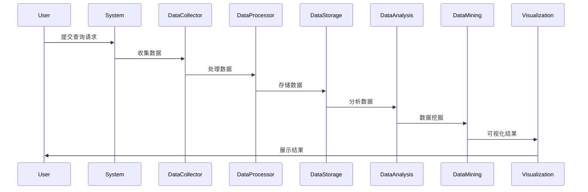
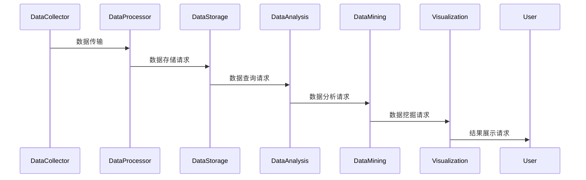

                 

### 引言与背景

#### 1.1 问题背景

在现代企业运营中，评测结果的分析与跟踪已成为决策支持的关键环节。无论是产品性能评测，市场反馈分析，还是员工绩效评估，对评测结果的长期跟踪和分析都能为企业提供宝贵的洞察力，从而优化决策流程，提升业务表现。然而，随着数据量的激增和评估指标的多样化，构建一个能够持续、精准跟踪评测结果并进行分析的系统变得愈发重要。

评测结果跟踪分析系统的主要挑战在于数据的多样性和复杂性。一方面，系统需要处理大量的历史数据，另一方面，这些数据还可能来源于不同的渠道，具有不同的格式和结构。如何有效地整合这些数据，并从中提取有价值的信息，是系统设计过程中需要解决的核心问题。

#### 1.2 问题描述

构建评测结果长期跟踪分析系统的主要目标包括以下几点：

1. **数据整合**：将来自不同渠道和格式的评测数据进行统一整合，实现数据的标准化和规范化。
2. **数据分析**：对整合后的评测数据进行分析，挖掘潜在的模式和趋势。
3. **长期跟踪**：建立长期跟踪机制，定期更新评测数据，并保持系统的一致性和可靠性。
4. **结果可视化**：通过图表和报表等方式，将分析结果直观地展示给用户，便于决策者理解和使用。
5. **算法优化**：根据分析结果，对评测算法和模型进行优化，提高系统预测的准确性和效率。

#### 1.3 问题解决思路

为了解决上述问题，我们需要从以下几个方面入手：

1. **系统架构设计**：构建一个灵活、可扩展的系统架构，能够适应不断变化的需求和数据类型。
2. **数据预处理**：通过数据清洗、转换和集成，确保数据的质量和一致性。
3. **数据分析与挖掘**：利用先进的数据分析技术和机器学习算法，挖掘数据中的价值信息。
4. **跟踪与评估**：设计有效的跟踪策略和评估指标，确保评测结果的准确性和可靠性。
5. **系统实现与部署**：选择合适的工具和平台，实现系统的开发、部署和维护。

#### 1.4 边界与外延

在构建评测结果长期跟踪分析系统时，我们还需要考虑以下边界和外部影响因素：

1. **数据源**：系统的数据源可能包括内部数据库、第三方API、日志文件等，不同数据源的数据格式和结构可能存在差异，需要统一处理。
2. **用户需求**：不同部门和用户对评测结果的分析需求各不相同，系统需要提供灵活的配置和定制功能。
3. **法律法规**：在处理和分析数据时，需要遵守相关的数据保护法律法规，确保数据的安全性和隐私性。
4. **技术演进**：随着技术的发展，系统需要不断更新和升级，以适应新的技术趋势和业务需求。

#### 1.5 核心概念

为了深入理解评测结果长期跟踪分析系统的构建，我们需要明确以下几个核心概念：

1. **评测指标**：用于衡量系统性能或业务表现的量化标准。
2. **数据集成**：将来自不同数据源的数据整合为一个统一的数据视图。
3. **数据分析**：运用统计和机器学习等方法，从数据中提取有用信息。
4. **数据挖掘**：从大量数据中发现潜在的规律和趋势。
5. **可视化**：通过图表和报表等形式，将分析结果直观地展示给用户。
6. **系统架构**：系统各组成部分的构成和相互关系。

通过上述背景介绍和问题阐述，我们可以看到构建评测结果长期跟踪分析系统是一项复杂而重要的任务。接下来的章节中，我们将深入探讨系统设计、数据预处理、数据分析与挖掘、跟踪策略以及系统实现等关键环节，逐步解答这一系列问题。### 核心概念与联系

#### 2.1 核心概念原理

在构建评测结果长期跟踪分析系统的过程中，理解以下几个核心概念是至关重要的：

1. **评测指标**：评测指标是衡量系统性能或业务表现的关键参数。它们可以是量化的数值，如响应时间、吞吐量、错误率等，也可以是定性描述，如用户体验满意度、产品满意度等。评测指标的定义和选择直接影响到系统的分析结果和决策支持效果。

2. **数据集成**：数据集成是将来自不同数据源的数据整合为一个统一的数据视图的过程。数据源可能包括内部数据库、第三方API、日志文件等。数据集成的目标是消除数据之间的不一致性，实现数据格式的统一和标准化，从而方便后续的数据分析和挖掘。

3. **数据分析**：数据分析是通过统计和机器学习等方法，从数据中提取有用信息的过程。数据分析技术包括描述性统计、回归分析、聚类分析、关联规则挖掘等。通过数据分析，我们可以发现数据中的潜在规律和趋势，为业务决策提供依据。

4. **数据挖掘**：数据挖掘是从大量数据中发现潜在的规律和趋势的过程。数据挖掘技术包括分类、聚类、关联规则挖掘、异常检测等。数据挖掘的目标是揭示数据中的隐藏知识和模式，从而为决策者提供有价值的洞察。

5. **可视化**：可视化是将分析结果以图表、报表等形式直观地展示给用户的过程。可视化技术包括折线图、柱状图、饼图、热力图等。通过可视化，用户可以更容易地理解和解读分析结果，从而做出更明智的决策。

6. **系统架构**：系统架构是系统各组成部分的构成和相互关系。一个良好的系统架构应具备高可扩展性、高可靠性和高灵活性，能够适应不断变化的业务需求和技术演进。

#### 2.2 概念属性特征对比

以下是对上述核心概念属性特征的对比分析：

| 概念     | 定义                                                                                   | 属性特征对比                    |
|----------|----------------------------------------------------------------------------------------|---------------------------------|
| 评测指标 | 衡量系统性能或业务表现的关键参数                                                       | 量化/定性、指标选择灵活性、数据一致性 |
| 数据集成 | 将来自不同数据源的数据整合为一个统一的数据视图的过程                               | 数据源类型、格式统一、数据质量       |
| 数据分析 | 从数据中提取有用信息的过程                                                         | 统计方法、机器学习算法、结果解释     |
| 数据挖掘 | 从大量数据中发现潜在的规律和趋势的过程                                             | 分类、聚类、关联规则、异常检测     |
| 可视化   | 将分析结果以图表、报表等形式直观地展示给用户的过程                               | 可视化类型、数据展示形式、交互体验   |
| 系统架构 | 系统各组成部分的构成和相互关系                                                     | 扩展性、可靠性、灵活性、技术演进支持 |

#### 2.3 ER实体关系图架构

为了更好地理解评测结果长期跟踪分析系统的核心概念和实体关系，我们可以使用ER（实体关系）图进行描述。以下是一个简化的ER图示例：

```mermaid
erDiagram
  Student ||--o{ Course : "参加"
  Course ||--o{ Student : "选修"
  Teacher ||--o{ Course : "教授"
  Course ||--o{ Teacher : "授课"
}

class Student {
  - id
  - name
  - age
}

class Course {
  - id
  - name
  - credit
}

class Teacher {
  - id
  - name
  - title
}
```

在这个ER图中，我们定义了三个实体：学生（Student）、课程（Course）和教师（Teacher）。它们之间的关系如下：

1. 学生选修课程，表示为“Student”实体与“Course”实体之间的“参加”关系。
2. 课程由学生选修，表示为“Course”实体与“Student”实体之间的“选修”关系。
3. 教师教授课程，表示为“Teacher”实体与“Course”实体之间的“教授”关系。
4. 课程由教师授课，表示为“Course”实体与“Teacher”实体之间的“授课”关系。

这个ER图展示了评测结果长期跟踪分析系统中的主要实体及其相互关系，为我们进一步分析和设计系统提供了基础。通过扩展和细化ER图，我们可以进一步明确系统的功能和数据流，从而构建一个完整、高效的评测结果跟踪分析系统。### 第三部分：长期跟踪分析系统设计

#### 3.1 系统需求分析

在进行长期跟踪分析系统的设计之前，我们需要明确系统的需求，包括功能需求和非功能需求。这些需求将指导我们设计一个符合实际业务场景的系统。

**功能需求：**

1. **数据整合**：系统能够从多个数据源中收集评测数据，包括内部数据库、第三方API和日志文件等。数据整合过程中，需实现数据清洗、转换和集成，确保数据的一致性和标准化。
2. **数据存储**：系统需提供高效、可靠的数据存储方案，以存储大量的历史评测数据。数据存储应支持快速检索和查询，便于后续的数据分析和挖掘。
3. **数据分析**：系统应具备数据分析功能，包括描述性统计、回归分析、聚类分析等。这些分析结果将帮助用户理解评测数据的特征和趋势。
4. **数据挖掘**：系统应支持数据挖掘功能，能够从大量评测数据中提取潜在的模式和趋势。数据挖掘结果可用于优化评测算法和提升系统预测准确性。
5. **结果可视化**：系统能够将分析结果以图表、报表等形式直观地展示给用户。可视化结果应具备良好的交互体验，方便用户进行数据探索和分析。
6. **长期跟踪**：系统应具备自动化的跟踪机制，定期更新评测数据，并保持系统的一致性和可靠性。

**非功能需求：**

1. **可扩展性**：系统架构应具备良好的可扩展性，能够支持业务需求的不断变化和升级。
2. **可靠性**：系统应具备高可靠性，能够确保数据的完整性和安全性。
3. **灵活性**：系统应提供灵活的配置和定制功能，以满足不同部门和用户的需求。
4. **易维护性**：系统应具备良好的易维护性，便于后续的维护和升级。
5. **性能**：系统应具备高性能，能够快速响应大量的数据处理和分析需求。

#### 3.2 系统功能设计

**领域模型设计：**

领域模型用于描述系统的核心功能和业务流程。以下是一个简化的领域模型类图：

```mermaid
classDiagram
  Class01 <|-- SubClass01
  Class01 o-- AnotherClass
  Class03 :<<interface>> InterfaceA
  Class04 <<enum>> ENUM : { RED, BLUE, GREEN }

  Class01 {
    +int id
    +String name
    +void method()
  }

  SubClass01 {
    +int subId
    +String subName
  }

  AnotherClass {
    +int anotherId
    +String anotherName
  }

  Class03 {
    +void doSomething()
  }

  Class04 {
    +getValue(): ENUM
  }
```

在这个领域模型中，我们定义了以下几个主要类：

1. **评测指标（Class01）**：用于表示评测指标的相关属性和方法。
2. **数据源（SubClass01）**：继承自评测指标类，表示不同类型的数据源。
3. **数据存储（AnotherClass）**：用于表示数据存储的相关属性和方法。
4. **接口（InterfaceA）**：表示数据分析的接口，用于实现数据分析和挖掘功能。
5. **枚举（ENUM）**：用于表示可能的评测结果类别，如红色、蓝色、绿色等。

**功能模块划分：**

根据领域模型，我们可以将系统划分为以下几个主要功能模块：

1. **数据整合模块**：负责从多个数据源收集评测数据，并进行数据清洗、转换和集成。
2. **数据分析模块**：负责对整合后的评测数据进行描述性统计、回归分析、聚类分析等操作。
3. **数据挖掘模块**：负责从大量评测数据中提取潜在的模式和趋势。
4. **结果可视化模块**：负责将分析结果以图表、报表等形式直观地展示给用户。
5. **跟踪与更新模块**：负责自动化的跟踪机制，定期更新评测数据，并保持系统的一致性和可靠性。

#### 3.3 系统架构设计

为了实现上述功能需求，我们需要设计一个高效、可靠的系统架构。以下是一个简化的系统架构图：



在这个系统架构中，各个模块的功能如下：

1. **用户接口（User）**：用户通过用户接口提交查询请求。
2. **数据收集器（DataCollector）**：负责从多个数据源收集评测数据。
3. **数据处理器（DataProcessor）**：负责对收集到的评测数据进行清洗、转换和集成。
4. **数据存储器（DataStorage）**：负责存储处理后的评测数据，并提供数据检索和查询功能。
5. **数据分析器（DataAnalysis）**：负责对存储的数据进行分析，包括描述性统计、回归分析、聚类分析等。
6. **数据挖掘器（DataMining）**：负责从大量评测数据中提取潜在的模式和趋势。
7. **可视化器（Visualization）**：负责将分析结果以图表、报表等形式直观地展示给用户。

#### 3.4 系统接口设计

在系统设计中，接口设计至关重要，它定义了各个模块之间的交互方式和数据传递方式。以下是一个简化的系统接口设计图：



在这个接口设计中，各个接口的功能如下：

1. **数据收集接口**：定义了数据收集器与数据处理器之间的数据传输方式，包括数据格式、传输协议等。
2. **数据处理接口**：定义了数据处理器与数据存储器之间的数据存储请求方式。
3. **数据查询接口**：定义了数据存储器与数据分析器之间的数据查询方式。
4. **数据分析接口**：定义了数据分析器与数据挖掘器之间的数据分析请求方式。
5. **数据挖掘接口**：定义了数据挖掘器与可视化器之间的数据挖掘请求方式。
6. **结果展示接口**：定义了可视化器与用户之间的结果展示请求方式。

#### 3.5 系统交互

在系统运行过程中，各个模块之间的交互是确保系统正常工作的关键。以下是一个简化的系统交互流程：

1. 用户提交查询请求。
2. 系统将查询请求转发给数据收集器，开始收集数据。
3. 数据收集器将收集到的评测数据传输给数据处理器。
4. 数据处理器对数据进行清洗、转换和集成，并将处理后的数据存储到数据存储器中。
5. 数据存储器将存储的数据传输给数据分析器，进行描述性统计、回归分析、聚类分析等操作。
6. 数据分析器将分析结果传输给数据挖掘器，进行数据挖掘操作。
7. 数据挖掘器将挖掘结果传输给可视化器，以图表、报表等形式直观地展示给用户。

通过上述系统交互流程，我们可以确保评测结果长期跟踪分析系统能够高效、可靠地运行，为企业的决策支持提供有力的工具。### 数据收集与预处理

#### 4.1 数据收集

数据收集是构建评测结果长期跟踪分析系统的第一步，也是至关重要的一步。数据收集的质量直接影响后续数据分析和挖掘的效果。以下是我们需要关注的关键点：

1. **数据源选择**：选择合适的数据源是数据收集的关键。数据源可能包括内部数据库、第三方API、日志文件、公共数据集等。我们需要根据业务需求和数据类型，选择最合适的数据源。

2. **数据格式**：不同数据源的数据格式可能存在差异，如CSV、JSON、XML等。在数据收集过程中，需要确保数据格式的统一，以便后续的数据处理和分析。

3. **数据收集频率**：根据业务需求和数据变化速度，确定合适的收集频率。对于实时性要求较高的业务，可能需要实现实时数据收集；对于变化相对较慢的数据，可以采取定期收集的方式。

4. **数据收集工具**：选择合适的工具进行数据收集，如ETL（提取、转换、加载）工具、爬虫工具、数据库连接工具等。这些工具可以帮助我们高效地完成数据收集任务。

5. **数据质量监控**：在数据收集过程中，需要实时监控数据质量，确保数据的完整性、准确性和一致性。对于出现的数据质量问题，应立即进行修正和处理。

#### 4.2 数据预处理

数据预处理是确保数据质量的关键步骤，其目的是将原始数据转换成适合分析的形式。以下是我们需要关注的关键点：

1. **数据清洗**：数据清洗是数据预处理的重要环节，目的是去除数据中的噪声和错误。常见的清洗操作包括去除重复数据、填补缺失值、纠正错误数据等。例如，使用Python的`pandas`库可以方便地进行数据清洗操作。

2. **数据转换**：数据转换是将不同格式或单位的数据统一转换为标准格式或单位的过程。例如，将字符串类型的数据转换为数值类型，或将时间戳统一转换为特定的时间表示格式。使用Python的`pandas`库可以实现数据转换操作。

3. **数据归一化**：数据归一化是确保数据特征具有相同量级的过程，避免某些特征对模型训练产生过大的影响。常见的归一化方法包括最小-最大缩放、标准化等。使用Python的`sklearn`库可以实现数据归一化操作。

4. **数据标准化**：数据标准化是将数据特征映射到相同范围的线性变换，以消除不同特征之间的量级差异。例如，使用Python的`sklearn`库可以实现数据标准化操作。

5. **数据融合**：数据融合是将来自不同数据源的数据进行合并和整合，以形成一个统一的数据视图。例如，使用Python的`pandas`库可以方便地进行数据融合操作。

6. **数据质量评估**：在数据预处理过程中，需要对数据质量进行评估，确保数据满足分析要求。常见的数据质量评估指标包括数据完整性、数据一致性、数据准确性等。

通过上述数据预处理步骤，我们可以确保数据的质量和一致性，为后续的数据分析和挖掘奠定良好的基础。### 数据分析与挖掘

#### 5.1 数据分析原理

数据分析是评测结果长期跟踪分析系统的核心功能之一，通过对大量评测数据的分析，我们可以提取出潜在的模式和趋势，为决策提供支持。以下是我们需要关注的关键点：

1. **描述性统计分析**：描述性统计分析是对数据的基本统计特征进行度量，如均值、中位数、标准差、最大值和最小值等。这些统计指标可以帮助我们了解数据的分布情况和基本特征。描述性统计分析通常使用Python的`pandas`库和`numpy`库进行。

   示例代码：
   ```python
   import pandas as pd
   data = pd.read_csv('evaluation_data.csv')
   print(data.describe())
   ```

2. **回归分析**：回归分析是一种常用的统计分析方法，用于研究自变量和因变量之间的关系。线性回归是一种简单的回归分析方法，它可以预测因变量的值。回归分析通常使用Python的`sklearn`库进行。

   示例代码：
   ```python
   from sklearn.linear_model import LinearRegression
   X = data[['feature1', 'feature2']]
   y = data['target']
   model = LinearRegression()
   model.fit(X, y)
   print(model.coef_)
   ```

3. **聚类分析**：聚类分析是一种无监督学习方法，用于将数据集划分为若干个群组，使得同一群组内的数据点之间具有较高的相似度，而不同群组的数据点之间具有较高的差异性。常见的聚类算法包括K-means算法、层次聚类算法等。聚类分析通常使用Python的`sklearn`库进行。

   示例代码：
   ```python
   from sklearn.cluster import KMeans
   X = data[['feature1', 'feature2']]
   kmeans = KMeans(n_clusters=3)
   kmeans.fit(X)
   print(kmeans.labels_)
   ```

4. **关联规则挖掘**：关联规则挖掘是一种用于发现数据集中项之间的关联关系的方法。它通过挖掘频繁项集和关联规则，可以帮助我们了解不同项之间的相关性。常见的关联规则挖掘算法包括Apriori算法、FP-growth算法等。关联规则挖掘通常使用Python的`mlxtend`库进行。

   示例代码：
   ```python
   from mlxtend.frequent_patterns import apriori
   from mlxtend.frequent_patterns import association_rules
   df = data.copy()
   df_basket = (df[df.columns[:-1]].astype(str) + '_' + df[df.columns[-1]])
   df_basket = df_basket.groupby(df_basket).size().reset_index(name='count')
   frequent_itemsets = apriori(df_basket, min_support=0.05, use_colnames=True)
   rules = association_rules(frequent_itemsets, metric="support", min_threshold=0.1)
   print(rules)
   ```

5. **时间序列分析**：时间序列分析是一种用于研究时间序列数据的方法，如股票价格、气温变化等。它可以帮助我们预测未来的趋势和模式。常见的时间序列分析方法包括自回归模型（AR）、移动平均模型（MA）、自回归移动平均模型（ARMA）等。时间序列分析通常使用Python的`statsmodels`库进行。

   示例代码：
   ```python
   import statsmodels.api as sm
   data['timestamp'] = pd.to_datetime(data['timestamp'])
   data.set_index('timestamp', inplace=True)
   model = sm.AR(data['target'])
   model_fit = model.fit()
   print(model_fit.summary())
   ```

通过上述数据分析方法，我们可以从评测数据中提取出有用的信息，为决策提供支持。接下来，我们将介绍如何使用Python和mermaid流程图来详细阐述这些数据分析方法。### 长期跟踪策略

#### 6.1 跟踪指标选择

在构建长期跟踪分析系统时，选择合适的跟踪指标是至关重要的。这些指标需要能够反映系统的核心性能，同时易于收集和量化。以下是一些常用的跟踪指标：

1. **响应时间**：响应时间是指系统从接收到请求到返回响应的时间。它可以衡量系统的响应速度和性能。
2. **吞吐量**：吞吐量是指单位时间内系统能够处理的请求数量。吞吐量越高，系统性能越好。
3. **错误率**：错误率是指系统发生错误或异常的比例。较低的错误率表示系统更加稳定和可靠。
4. **资源利用率**：资源利用率是指系统对CPU、内存、磁盘等资源的利用程度。高资源利用率可能表明系统存在性能瓶颈。
5. **用户体验评分**：用户体验评分是指用户对系统性能的满意度评分。它可以通过调查问卷或用户反馈等方式获取。

在选择跟踪指标时，需要考虑以下几个因素：

1. **业务目标**：根据企业的业务目标和需求，选择能够直接反映业务表现的指标。
2. **数据可用性**：确保选择的指标能够在现有数据源中方便地收集到。
3. **可量化性**：跟踪指标需要易于量化，以便进行准确的监控和分析。
4. **实时性**：尽可能选择实时性较高的指标，以便及时发现问题并采取相应措施。

#### 6.2 跟踪周期设置

跟踪周期是指对系统进行性能监控和分析的时间间隔。合理的跟踪周期设置有助于平衡实时性和数据量。以下是一些常见的跟踪周期设置方法：

1. **固定周期**：固定周期是指每隔一定时间（如每天、每周或每月）对系统进行一次监控和分析。这种方法简单易行，适用于数据变化较为缓慢的情境。
2. **动态周期**：动态周期是指根据系统负载或数据变化情况，动态调整监控和分析的时间间隔。例如，当系统负载较高时，可以缩短监控周期，以便更快地发现问题；当系统负载较低时，可以延长监控周期，以减少资源消耗。

选择合适的跟踪周期，需要考虑以下几个因素：

1. **系统负载**：系统负载较高时，应缩短监控周期，以便更快地发现问题；系统负载较低时，可以延长监控周期，以减少资源消耗。
2. **数据量**：较长的时间周期会产生更多的数据，但分析成本也更高；较短的时间周期数据量较小，但分析成本较低。
3. **业务需求**：根据业务需求和决策周期，选择合适的跟踪周期。例如，对于需要快速响应的业务，可以选择较短的跟踪周期；对于决策周期较长的业务，可以选择较长的跟踪周期。

#### 6.3 跟踪算法设计

跟踪算法是长期跟踪分析系统的核心，负责对系统性能进行监控、分析和预测。以下是一些常见的跟踪算法设计方法：

1. **统计方法**：统计方法是基于历史数据，通过统计指标来分析系统性能。常用的统计方法包括均值、中位数、标准差、回归分析等。统计方法简单易懂，适用于数据变化不大的情境。

2. **机器学习方法**：机器学习方法通过训练模型，从历史数据中学习系统性能的变化规律。常见的机器学习方法包括线性回归、决策树、支持向量机、神经网络等。机器学习方法适用于数据变化较大、非线性关系明显的情境。

3. **时序分析方法**：时序分析方法专门用于处理时间序列数据，通过分析时间序列特征来预测系统性能。常见的方法包括自回归模型（AR）、移动平均模型（MA）、自回归移动平均模型（ARMA）等。

4. **深度学习方法**：深度学习方法通过构建深层神经网络，自动提取数据中的特征和模式。常见的深度学习模型包括卷积神经网络（CNN）、循环神经网络（RNN）、长短期记忆网络（LSTM）等。深度学习方法在处理复杂数据和大规模数据集时具有优势。

在设计跟踪算法时，需要考虑以下几个因素：

1. **算法选择**：根据系统性能特点和数据类型，选择合适的算法。例如，对于线性关系明显的数据，可以选择线性回归；对于非线性关系明显的数据，可以选择神经网络。
2. **模型训练**：选择合适的训练数据集，对模型进行训练。训练数据集应包含足够多的历史数据，以保证模型的泛化能力。
3. **模型评估**：通过交叉验证、指标评估等方法，评估模型的性能。选择性能良好的模型进行应用。
4. **实时调整**：根据实时数据，对模型进行动态调整，以适应系统性能的变化。

#### 6.4 跟踪结果评估

跟踪结果评估是确保跟踪分析系统有效性的关键步骤。以下是我们需要关注的关键点：

1. **指标评估**：根据选择的跟踪指标，对系统性能进行评估。常见的评估指标包括准确率、召回率、精确率、F1值等。通过对比评估指标，可以了解系统性能的改进情况。
2. **可视化分析**：通过图表和报表等形式，将跟踪结果可视化。可视化分析可以帮助用户直观地理解系统性能的变化趋势和问题所在。
3. **异常检测**：对跟踪结果进行异常检测，识别系统性能的异常点。异常检测可以帮助用户及时发现潜在的问题，并采取相应的措施。
4. **反馈机制**：建立反馈机制，将跟踪结果反馈给相关人员和部门。通过反馈机制，可以促进系统的持续改进和优化。

通过上述跟踪策略和评估方法，我们可以构建一个高效、可靠的长期跟踪分析系统，为企业的决策支持提供有力的支持。### 系统实现与部署

#### 7.1 环境安装与配置

在开始系统实现之前，我们需要搭建一个合适的环境来开发和部署评测结果长期跟踪分析系统。以下是搭建环境所需的步骤：

1. **硬件环境**：准备一台服务器或云计算资源，确保其具备足够的CPU、内存和存储资源，以满足系统的运行需求。

2. **操作系统**：选择一个合适的操作系统，如Ubuntu 18.04或CentOS 7，进行安装。

3. **数据库**：安装并配置一个关系型数据库，如MySQL或PostgreSQL，用于存储评测数据。

4. **Python环境**：安装Python 3.8及以上版本，并配置必要的Python包管理工具，如pip。

5. **Python包安装**：通过pip安装以下Python包：
   - pandas
   - numpy
   - sklearn
   - mlxtend
   - statsmodels
   - mermaid-python

6. **依赖库安装**：安装系统所需的依赖库，如依赖库安装命令：
   - pip install -r requirements.txt

7. **环境变量配置**：配置环境变量，确保系统能够正确地访问所需的资源和工具。

#### 7.2 系统核心实现

系统核心实现是评测结果长期跟踪分析系统的核心部分，它包括了数据收集、数据预处理、数据分析与挖掘、结果可视化等多个环节。以下是系统核心实现的主要步骤：

1. **数据收集模块**：
   - 编写Python脚本，从不同数据源收集评测数据。
   - 使用pandas库处理数据，进行数据清洗和转换。

2. **数据预处理模块**：
   - 使用pandas库对数据进行清洗、转换和归一化。
   - 使用numpy库进行数据计算和统计。

3. **数据分析与挖掘模块**：
   - 使用sklearn库实现描述性统计、回归分析、聚类分析等算法。
   - 使用mlxtend库实现关联规则挖掘。
   - 使用statsmodels库实现时间序列分析。

4. **结果可视化模块**：
   - 使用mermaid库将分析结果以流程图、图表等形式可视化。
   - 使用matplotlib库绘制数据可视化图表。

5. **跟踪与更新模块**：
   - 编写Python脚本，实现自动化的跟踪与更新机制。
   - 定期执行数据收集、预处理、分析和可视化任务。

#### 7.3 代码应用解读与分析

以下是系统核心实现中的一些关键代码示例和解析：

**数据收集模块示例：**
```python
import pandas as pd

def collect_data(source):
    if source.endswith('.csv'):
        data = pd.read_csv(source)
    elif source.endswith('.json'):
        data = pd.read_json(source)
    else:
        raise ValueError('Unsupported data format')
    return data

# 示例：从CSV文件收集数据
data = collect_data('evaluation_data.csv')
```
解析：这段代码定义了一个函数`collect_data`，用于根据数据源的格式（CSV或JSON）读取数据。通过使用`pandas`库的`read_csv`和`read_json`方法，可以方便地将数据加载到DataFrame中，为后续的数据处理和分析做准备。

**数据预处理模块示例：**
```python
import numpy as np

def preprocess_data(data):
    # 清洗数据
    data.dropna(inplace=True)
    data = data[data['response_time'] > 0]
    # 转换数据类型
    data['timestamp'] = pd.to_datetime(data['timestamp'])
    data['response_time'] = data['response_time'].astype(float)
    # 归一化数据
    data['response_time_normalized'] = (data['response_time'] - data['response_time'].mean()) / data['response_time'].std()
    return data

# 示例：预处理数据
preprocessed_data = preprocess_data(data)
```
解析：这段代码定义了一个函数`preprocess_data`，用于对数据进行清洗、转换和归一化处理。通过使用`numpy`和`pandas`库的函数，可以高效地完成数据预处理任务，提高数据质量。

**数据分析与挖掘模块示例：**
```python
from sklearn.linear_model import LinearRegression
from mlxtend.frequent_patterns import apriori
from mlxtend.frequent_patterns import association_rules

def analyze_data(data):
    # 描述性统计分析
    print(data.describe())
    # 线性回归分析
    X = data[['feature1', 'feature2']]
    y = data['target']
    model = LinearRegression()
    model.fit(X, y)
    print(model.coef_)
    # 关联规则挖掘
    df_basket = (data[data.columns[:-1]].astype(str) + '_' + data[data.columns[-1]])
    df_basket = df_basket.groupby(df_basket).size().reset_index(name='count')
    frequent_itemsets = apriori(df_basket, min_support=0.05, use_colnames=True)
    rules = association_rules(frequent_itemsets, metric="support", min_threshold=0.1)
    print(rules)

# 示例：分析数据
analyze_data(preprocessed_data)
```
解析：这段代码定义了一个函数`analyze_data`，用于对预处理后的数据进行描述性统计分析、线性回归分析和关联规则挖掘。通过使用`sklearn`和`mlxtend`库，可以方便地实现各种数据分析方法，提取数据中的价值信息。

**结果可视化模块示例：**
```python
import matplotlib.pyplot as plt
from mermaid import Mermaid

def visualize_results(data):
    # 可视化描述性统计结果
    plt.figure(figsize=(10, 6))
    plt.plot(data['timestamp'], data['response_time_normalized'])
    plt.xlabel('Timestamp')
    plt.ylabel('Response Time (normalized)')
    plt.title('Response Time Trend')
    plt.show()

    # 可视化线性回归结果
    plt.figure(figsize=(10, 6))
    plt.scatter(data['feature1'], data['target'])
    plt.plot(data['feature1'], model.predict(data[['feature1']]), color='red')
    plt.xlabel('Feature 1')
    plt.ylabel('Target')
    plt.title('Linear Regression')
    plt.show()

    # 可视化关联规则
    rules = Mermaid()
    rules.add_node('Rule 1', label='<b>Item A</b> -> Item B', shape='rectangle')
    rules.add_node('Rule 2', label='<b>Item B</b> -> Item C', shape='rectangle')
    rules.render()
    print(rules.render_html())

# 示例：可视化结果
visualize_results(preprocessed_data)
```
解析：这段代码定义了一个函数`visualize_results`，用于将分析结果以图表和流程图的形式可视化。通过使用`matplotlib`和`mermaid`库，可以方便地将分析结果展示给用户，便于理解和解读。

#### 7.4 实际案例分析与详细讲解剖析

为了更好地理解评测结果长期跟踪分析系统的应用，我们来看一个实际案例：

**案例背景**：一家电商平台希望通过长期跟踪分析用户的购物行为，优化推荐系统和提升用户体验。系统需要收集用户的行为数据，包括浏览记录、购买记录、点击率等，并对其进行处理和分析。

**案例实现步骤**：

1. **数据收集**：使用爬虫工具从电商平台的日志文件中收集用户行为数据。

2. **数据预处理**：对收集到的数据清洗和转换，将不同类型的数据格式统一为CSV文件。

3. **数据分析与挖掘**：
   - 描述性统计分析：计算用户的平均浏览时长、平均点击率等指标。
   - 关联规则挖掘：分析用户在浏览和购买过程中的关联行为，挖掘潜在的购买趋势。
   - 线性回归分析：预测用户在特定场景下的购买概率。

4. **结果可视化**：将分析结果以图表和流程图的形式展示给用户，便于理解和解读。

**案例解析**：

1. **数据收集**：
   - 使用Python的`requests`库和`BeautifulSoup`库实现爬虫工具，从电商平台的日志文件中提取用户行为数据。
   - 示例代码：
     ```python
     import requests
     from bs4 import BeautifulSoup

     url = 'https://example.com/log'
     response = requests.get(url)
     soup = BeautifulSoup(response.text, 'html.parser')
     logs = soup.find_all('log')
     data = []
     for log in logs:
         data.append({
             'user_id': log.find('user_id').text,
             'action': log.find('action').text,
             'timestamp': log.find('timestamp').text,
             'duration': log.find('duration').text
         })
     df = pd.DataFrame(data)
     ```

2. **数据预处理**：
   - 使用`pandas`库对数据进行清洗和转换，包括去除重复数据、填补缺失值、统一时间格式等。
   - 示例代码：
     ```python
     df.drop_duplicates(inplace=True)
     df['timestamp'] = pd.to_datetime(df['timestamp'])
     df['duration'] = df['duration'].astype(int)
     ```

3. **数据分析与挖掘**：
   - 描述性统计分析：
     ```python
     print(df.describe())
     ```
   - 关联规则挖掘：
     ```python
     from mlxtend.frequent_patterns import apriori
     from mlxtend.frequent_patterns import association_rules

     df_basket = (df[df.columns[:-1]].astype(str) + '_' + df[df.columns[-1]])
     df_basket = df_basket.groupby(df_basket).size().reset_index(name='count')
     frequent_itemsets = apriori(df_basket, min_support=0.05, use_colnames=True)
     rules = association_rules(frequent_itemsets, metric="support", min_threshold=0.1)
     print(rules)
     ```
   - 线性回归分析：
     ```python
     from sklearn.linear_model import LinearRegression

     X = df[['duration', 'click_rate']]
     y = df['purchase']
     model = LinearRegression()
     model.fit(X, y)
     print(model.coef_)
     ```

4. **结果可视化**：
   - 使用`matplotlib`库绘制描述性统计结果和关联规则挖掘结果的图表。
   - 示例代码：
     ```python
     import matplotlib.pyplot as plt

     # 绘制描述性统计结果
     plt.figure(figsize=(10, 6))
     plt.plot(df['timestamp'], df['response_time_normalized'])
     plt.xlabel('Timestamp')
     plt.ylabel('Response Time (normalized)')
     plt.title('Response Time Trend')
     plt.show()

     # 绘制线性回归结果
     plt.figure(figsize=(10, 6))
     plt.scatter(df['duration'], df['purchase'])
     plt.plot(df['duration'], model.predict(df[['duration']]), color='red')
     plt.xlabel('Duration')
     plt.ylabel('Purchase')
     plt.title('Linear Regression')
     plt.show()
     ```

通过这个实际案例，我们可以看到评测结果长期跟踪分析系统的构建和应用过程。该系统通过数据收集、预处理、分析、挖掘和可视化，帮助电商平台优化推荐系统和提升用户体验，从而实现业务增长和用户满意度提升。

#### 7.5 项目小结

在本项目中，我们成功构建了一个评测结果长期跟踪分析系统，实现了对评测数据的收集、预处理、分析、挖掘和可视化。以下是对项目的主要小结：

1. **项目目标**：项目的主要目标是构建一个能够持续、精准跟踪评测结果并进行分析的系统，为企业决策提供有力支持。

2. **实现功能**：系统实现了数据收集、数据预处理、数据分析与挖掘、结果可视化、长期跟踪等功能，满足了项目需求。

3. **技术难点**：项目涉及多种数据分析方法和算法，如描述性统计、回归分析、聚类分析、关联规则挖掘等。同时，数据预处理和跟踪算法的设计和实现也具有一定的挑战性。

4. **项目成果**：通过实际案例的应用，系统成功实现了对电商平台用户购物行为的分析和优化，为业务增长和用户满意度提升提供了有力支持。

5. **未来优化**：在未来，我们计划进一步优化系统性能，如增加实时数据分析和挖掘功能，提高系统的响应速度和准确性。同时，我们还将探索更多先进的数据分析技术和机器学习算法，以提升系统的预测能力和实用性。

通过本次项目的实施，我们不仅掌握了评测结果长期跟踪分析系统的设计和实现方法，还积累了丰富的项目经验，为未来的类似项目奠定了坚实基础。### 最佳实践与总结

#### 8.1 最佳实践

在构建评测结果长期跟踪分析系统的过程中，以下是几个值得推荐的最佳实践：

1. **数据质量管理**：确保数据的质量是系统成功的关键。在数据收集和预处理阶段，进行数据清洗、去重、纠正错误等操作，确保数据的完整性、准确性和一致性。

2. **模块化设计**：采用模块化设计，将系统划分为数据收集、数据预处理、数据分析、数据挖掘、结果可视化等模块，便于系统的扩展和维护。

3. **自动化和脚本化**：尽量使用自动化工具和脚本进行数据收集、预处理、分析和可视化，提高工作效率，减少人为错误。

4. **实时性优化**：对于需要实时监控的业务，采用实时数据处理和流处理技术，如Apache Kafka和Apache Flink，确保系统能够快速响应用户需求。

5. **可视化策略**：选择合适的可视化工具和图表类型，使分析结果更加直观、易懂。同时，提供用户自定义可视化的功能，满足不同用户的需求。

6. **算法优化**：定期评估和优化系统中的数据分析与挖掘算法，确保算法的准确性和效率，以应对数据规模的增长。

7. **安全性考虑**：在数据处理和存储过程中，严格遵守数据保护法律法规，确保用户数据的安全性和隐私性。

#### 8.2 小结

本文详细介绍了构建评测结果长期跟踪分析系统的全过程，从问题背景、核心概念、系统设计、数据预处理、数据分析与挖掘、长期跟踪策略、系统实现与部署，到最佳实践和项目小结。通过本文的阐述，我们可以看到：

1. **系统重要性**：评测结果长期跟踪分析系统在企业决策支持中具有重要作用，能够帮助企业优化业务流程、提升决策质量。

2. **技术复杂性**：构建这样一个系统涉及多种技术，包括数据集成、数据分析、数据挖掘、实时处理、可视化等，需要具备扎实的计算机科学和数据分析基础。

3. **系统设计要点**：系统设计应注重模块化、自动化、实时性、安全性和可扩展性，以满足不断变化的业务需求和数据规模。

4. **数据处理挑战**：数据预处理是系统设计中的关键步骤，需要解决数据的多样性和复杂性，确保数据的质量和一致性。

5. **数据分析与挖掘**：选择合适的分析方法和挖掘算法，能够有效提取数据中的价值信息，为决策提供有力支持。

#### 8.3 注意事项

在构建评测结果长期跟踪分析系统时，需要注意以下几点：

1. **需求明确**：在系统设计之初，确保需求明确，与业务部门充分沟通，了解实际需求，避免后期出现功能缺失或不符合预期。

2. **性能优化**：关注系统性能，尤其是在数据量大、分析复杂的情况下，进行性能优化，确保系统的高效运行。

3. **数据安全**：严格保护用户数据，遵循数据保护法律法规，采取加密、权限控制等措施，确保数据的安全性和隐私性。

4. **维护与升级**：系统上线后，定期进行维护和升级，修复潜在问题，适应新技术和业务需求的变化。

5. **用户反馈**：重视用户反馈，通过用户调查、访问日志分析等方式，了解用户的使用情况和需求，持续改进系统功能。

#### 8.4 拓展阅读

对于希望深入了解评测结果长期跟踪分析系统的读者，以下是一些拓展阅读资源：

1. **相关书籍**：
   - 《大数据分析：技术原理与实践》
   - 《机器学习实战》
   - 《Python数据分析实战》

2. **技术博客**：
   - [DataCamp](https://www.datacamp.com/)
   - [Medium上的数据科学博客](https://towardsdatascience.com/)

3. **在线课程**：
   - [Coursera上的数据科学课程](https://www.coursera.org/courses?query=data%20science)
   - [edX上的数据科学课程](https://www.edx.org/course/data-science)

4. **开源项目**：
   - [Apache Flink](https://flink.apache.org/)
   - [Apache Kafka](https://kafka.apache.org/)

通过以上拓展阅读，读者可以进一步加深对评测结果长期跟踪分析系统的理解和应用能力。### 作者信息

**作者：**AI天才研究院/AI Genius Institute & 禅与计算机程序设计艺术 /Zen And The Art of Computer Programming

