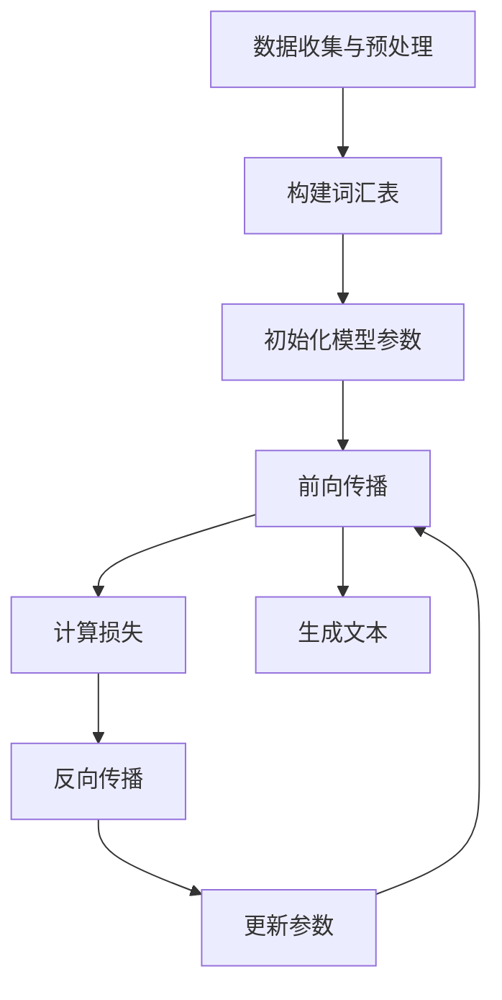
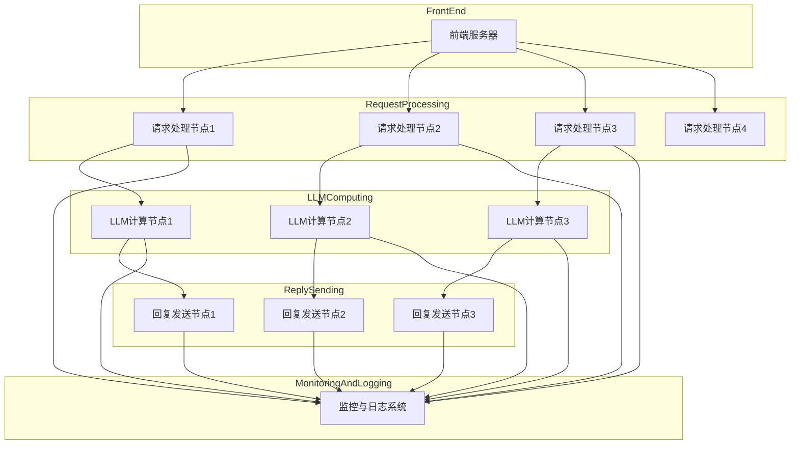
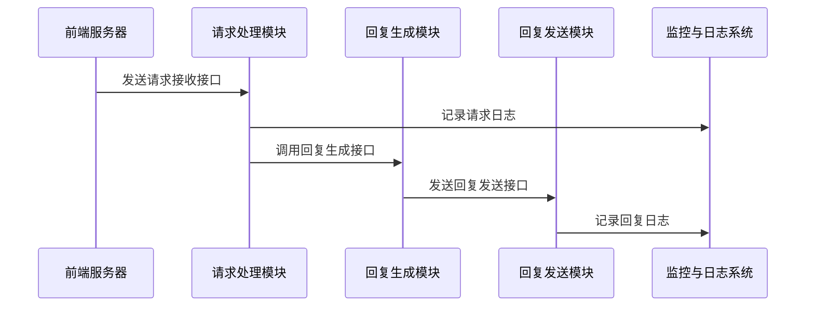
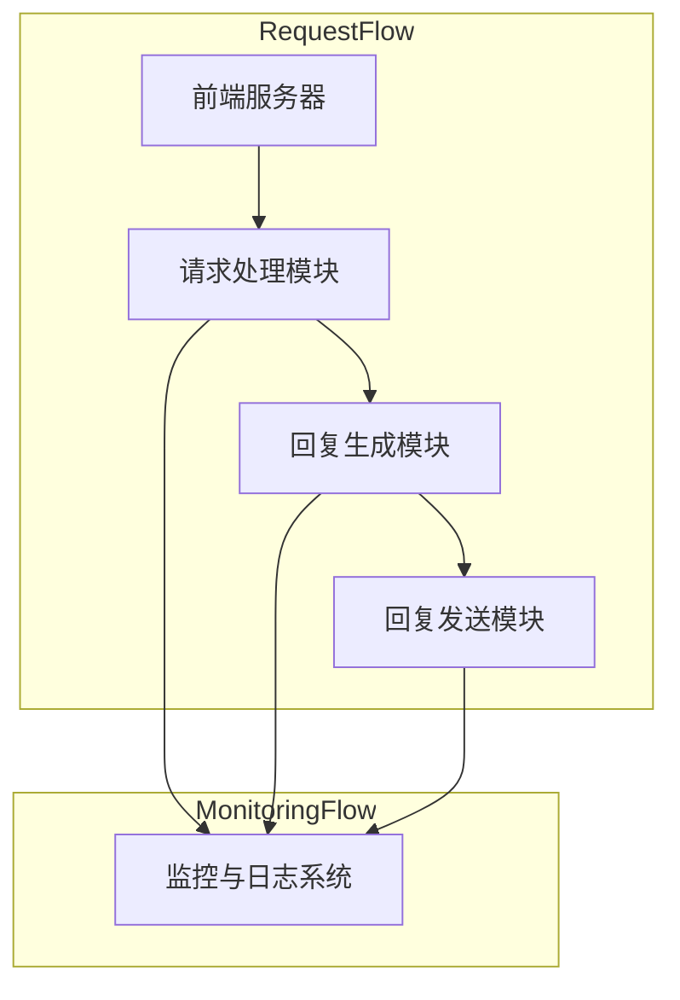

                 

### 《构建跨团队协作的LLM应用开发文化》

关键词：跨团队协作、LLM应用开发、文化构建、技术博客

摘要：本文旨在探讨如何在现代企业中构建一种跨团队协作的LLM（大型语言模型）应用开发文化。通过分析跨团队协作的挑战、LLM应用开发的原理及其在跨团队协作中的重要性，本文将提供一系列最佳实践和具体实施步骤，帮助企业和开发团队优化协作流程，提升项目效率。

## 引言

在当今快速发展的科技时代，人工智能（AI）技术正以前所未有的速度变革着各行各业。其中，LLM（大型语言模型）作为AI技术的核心组件，正逐渐成为企业构建智能应用的重要工具。然而，随着项目复杂度的增加，跨团队协作的挑战也日益凸显。如何在这种背景下构建一种有效的LLM应用开发文化，成为企业亟需解决的问题。

本文将从以下几个方面展开讨论：

1. **背景介绍**：介绍跨团队协作的挑战和LLM应用开发的背景。
2. **核心概念与联系**：阐述跨团队协作和LLM应用开发的核心概念及其相互关系。
3. **算法原理讲解**：详细讲解LLM算法原理，并提供实际案例。
4. **系统分析与架构设计方案**：介绍系统架构设计的关键步骤和工具。
5. **项目实战**：通过具体项目实例，展示如何在实际中构建LLM应用开发文化。
6. **最佳实践 tips**：总结最佳实践，提供改进建议和注意事项。

希望通过本文的讨论，能够为企业和开发团队在构建跨团队协作的LLM应用开发文化方面提供有价值的参考。

### 核心概念术语说明

在深入探讨构建跨团队协作的LLM应用开发文化之前，我们首先需要明确一些核心概念和术语，以便更好地理解后续内容。

1. **跨团队协作**：指在复杂项目中，由不同职能、不同背景的团队成员共同协作，实现项目目标的过程。跨团队协作要求团队成员之间具备良好的沟通、信任和协作能力。
   
2. **LLM（大型语言模型）**：是一种基于深度学习的自然语言处理模型，能够理解和生成自然语言文本。LLM具有庞大的参数量和强大的学习能力，能够处理复杂、多样的语言任务。

3. **文化构建**：是指在企业或团队中培养和塑造一种共同的价值观、行为准则和工作方式，以增强团队的凝聚力、协作效率和创新能力。

4. **技术博客**：是一种以技术为主题的博客文章，通常包含对某一技术领域的深入分析和探讨，旨在帮助读者理解复杂的技术概念和应用场景。

了解这些核心概念和术语，有助于我们更好地理解跨团队协作和LLM应用开发文化的重要性，以及如何在实际项目中应用这些概念和术语。

### 问题背景

在现代企业中，项目复杂度和规模日益增加，导致跨团队协作的需求愈发迫切。然而，跨团队协作并非一帆风顺，往往面临诸多挑战。

首先，团队成员之间的沟通障碍是一个重要问题。由于团队成员可能分布在不同的地理位置、具有不同的职能背景和技术水平，沟通效率和质量难以保障。这可能导致信息传递不准确、项目进度延误，甚至出现团队冲突。

其次，不同团队之间的利益冲突也是跨团队协作的一大难题。在项目过程中，不同团队可能具有不同的目标、优先级和资源需求，这种利益冲突可能导致资源分配不均、任务分工不合理，进而影响项目整体进展。

此外，项目管理难度也不断增加。在跨团队协作中，项目管理者需要协调多个团队的进度、资源和风险，确保项目按时交付。然而，复杂的项目环境往往使得项目管理变得困难重重。

为应对这些挑战，企业需要构建一种有效的跨团队协作机制，确保信息畅通、利益均衡、资源高效利用。这种机制不仅需要技术支持，更需要文化和价值观的引导。通过构建跨团队协作的LLM应用开发文化，企业可以提升团队协作效率、优化项目管理，从而实现项目成功。

### 问题解决

面对跨团队协作的挑战，构建一种有效的LLM应用开发文化是解决问题的关键。以下是一些具体措施和最佳实践：

1. **建立清晰的沟通机制**：为了确保团队成员之间的信息畅通，企业需要建立一套清晰的沟通机制。这包括定期的团队会议、项目进度汇报、即时通讯工具的使用等。通过这些沟通方式，团队成员可以及时了解项目进展、分享经验和资源，减少信息传递误差。

2. **制定统一的协作准则**：为了消除不同团队之间的利益冲突，企业可以制定一套统一的协作准则，明确各团队的目标、优先级和资源分配原则。这些准则应充分考虑各团队的需求和利益，确保资源分配合理、任务分工明确。

3. **强化团队建设**：通过定期的团队建设活动，如团队拓展训练、团队合作游戏等，增强团队成员之间的信任和凝聚力。这有助于提高团队的协作效率和创新能力。

4. **引入敏捷开发方法**：敏捷开发方法强调快速迭代、持续反馈和灵活调整，能够有效应对项目复杂度和变化。通过引入敏捷开发方法，企业可以更好地适应项目需求的变化，提高团队协作效率。

5. **使用协作工具**：借助现代协作工具，如Jira、Trello、Slack等，企业可以实现项目进度的实时跟踪、任务分配和协作沟通。这些工具可以帮助团队更好地管理项目，提高协作效率。

6. **培养跨学科技能**：为了提高团队的协作能力，企业可以鼓励团队成员学习跨学科知识，如项目管理、产品设计、市场营销等。这有助于团队成员更好地理解其他团队的工作，提高整体协作效率。

7. **建立反馈机制**：通过定期的项目评估和反馈机制，企业可以及时发现和解决问题，优化协作流程。这有助于团队不断改进，提高协作效率。

通过实施上述措施和最佳实践，企业可以构建一种有效的跨团队协作的LLM应用开发文化，提高项目成功率和团队协作效率。

### 边界与外延

在构建跨团队协作的LLM应用开发文化时，明确讨论范围和边界至关重要。本文主要关注以下场景：

1. **团队类型**：本文主要探讨由不同职能背景（如开发、设计、测试、产品管理等）的团队成员组成的跨职能团队。这些团队在LLM应用开发项目中共同工作，实现项目目标。

2. **项目类型**：本文适用于复杂度较高、涉及多个子模块的LLM应用开发项目。这些项目通常需要多个团队协同工作，共同完成。

3. **技术范围**：本文涉及的LLM应用开发技术主要包括大型语言模型（如BERT、GPT等）的实现和应用。这些技术是当前自然语言处理领域的热点，广泛应用于各种智能应用。

4. **环境限制**：本文不涉及特定操作系统、编程语言或开发工具的选择。但建议企业在构建协作文化时，选择统一的技术栈，以提高团队协作效率。

5. **组织层级**：本文主要关注企业内部团队之间的协作。对于跨企业的合作，如合作伙伴、客户和供应商之间的协作，本文提供的基本原则和最佳实践同样适用。

通过明确讨论范围和边界，有助于确保本文内容的实用性和针对性，为实际项目提供有价值的参考。

### 概念结构与核心要素组成

在深入探讨构建跨团队协作的LLM应用开发文化之前，有必要明确几个核心概念和要素，以便理解其内在联系和作用。

1. **跨团队协作**：跨团队协作是指由不同职能背景、不同技术领域的团队成员共同参与，以实现项目目标的过程。其核心要素包括团队沟通、资源共享、目标一致和责任分担。

2. **LLM应用开发**：LLM（大型语言模型）应用开发是指基于深度学习和自然语言处理技术，构建具有强大语言理解与生成能力的模型，并将其应用于实际业务场景。其核心要素包括数据准备、模型训练、模型优化和部署。

3. **文化构建**：文化构建是指在企业或团队中培养和塑造一种共同的价值观、行为准则和工作方式，以增强团队的凝聚力、协作效率和创新能力。其核心要素包括团队意识、信任建立、共识形成和持续改进。

4. **技术博客**：技术博客是一种以技术为主题的写作形式，通过深入分析和探讨技术概念、应用场景和解决方案，帮助读者理解和掌握相关技术。其核心要素包括逻辑清晰、内容丰富、通俗易懂和实用性强。

这些核心概念和要素相互作用，共同构建了跨团队协作的LLM应用开发文化。具体而言：

- **团队沟通**：是跨团队协作的基础，通过有效的沟通，团队成员可以明确项目目标、任务分工和进度安排，确保协作顺利进行。
- **资源共享**：有助于提高团队协作效率，通过共享技术、工具和资源，各团队可以充分利用已有优势，减少重复工作，提高项目质量。
- **目标一致**：是团队协作的核心，通过共同的目标，团队成员可以凝聚力量，协同努力，实现项目成功。
- **责任分担**：有助于明确团队成员的职责和角色，确保项目任务得到有效执行和监督。

- **团队意识**：是文化构建的关键，通过培养团队意识，团队成员可以更好地认同团队目标，增强团队凝聚力和归属感。
- **信任建立**：是文化构建的基础，通过建立信任，团队成员可以更放心地分享知识、经验和资源，提高协作效率。
- **共识形成**：有助于团队在面临挑战和决策时达成一致，确保团队行动的一致性和有效性。
- **持续改进**：是文化构建的保障，通过不断反思和改进，团队可以持续提升协作效率和项目质量。

通过这些核心概念和要素的相互作用，企业可以构建一种有效的跨团队协作的LLM应用开发文化，提升项目成功率和团队协作效率。在后续章节中，我们将进一步探讨这些概念和要素的具体实现和应用。

## 第2章：核心概念与联系

在构建跨团队协作的LLM应用开发文化过程中，理解核心概念及其相互联系至关重要。本章将详细阐述跨团队协作和LLM应用开发的核心概念，并分析它们之间的联系。

### 跨团队协作

**定义与特点**

跨团队协作是指在复杂项目中，由不同职能、不同背景的团队成员共同工作，以实现项目目标的过程。其核心特点包括：

1. **多样性**：团队成员来自不同的职能领域，如开发、设计、测试、产品管理等，这种多样性有助于团队成员从不同角度思考问题，提高项目创新性和全面性。
2. **复杂性**：跨团队协作往往涉及多个子项目、多个任务和多个利益相关者，这使得项目管理和协调变得复杂。
3. **动态性**：项目需求和环境变化较快，跨团队协作需要具备灵活性和适应性，以应对变化。

**优势与挑战**

跨团队协作的优势包括：

1. **资源整合**：通过跨团队协作，企业可以充分利用各个团队的资源和专业知识，提高项目效率和质量。
2. **创新性**：多样性思维有助于激发创新，不同团队成员的协作可以产生新的想法和解决方案。
3. **质量保障**：跨团队协作可以确保项目在不同阶段都有专业人员进行审查和反馈，提高项目质量。

然而，跨团队协作也面临一些挑战：

1. **沟通障碍**：不同团队成员可能存在沟通障碍，如语言、文化、习惯等方面的差异，导致信息传递不准确或延迟。
2. **利益冲突**：不同团队可能有不同的目标和优先级，这可能导致资源分配不均或任务分工不合理。
3. **项目管理难度**：跨团队协作需要更复杂的项目管理，包括协调进度、资源分配和风险管理等。

**跨团队协作在LLM开发中的重要性**

在LLM（大型语言模型）应用开发中，跨团队协作尤为重要。首先，LLM开发涉及多种技术领域，如自然语言处理、机器学习、数据工程等，需要不同职能团队的协作。其次，LLM模型的训练和优化过程复杂，需要大量数据支持和计算资源，这要求跨团队协作以确保资源的高效利用。此外，LLM应用的开发和部署通常涉及多个阶段，需要不同团队的紧密配合，如需求分析、模型开发、系统测试、产品上线等。

### LLM应用开发

**定义、原理与特点**

LLM（大型语言模型）是一种基于深度学习和自然语言处理技术的模型，能够理解和生成自然语言文本。LLM的工作原理主要基于以下步骤：

1. **数据准备**：收集和整理大量文本数据，进行预处理，如分词、去噪、标准化等。
2. **模型训练**：使用预处理后的数据训练神经网络模型，模型通过不断调整参数，学习语言规律和模式。
3. **模型优化**：在训练过程中，通过调整超参数和优化算法，提高模型性能。
4. **模型部署**：将训练好的模型部署到实际应用中，进行语言理解和生成任务。

LLM的主要特点包括：

1. **大规模**：LLM通常具有庞大的参数量和数据集，能够处理复杂、多样的语言任务。
2. **强泛化能力**：通过大量数据训练，LLM能够应对不同领域的语言任务，具有较好的泛化能力。
3. **自适应性**：LLM能够根据输入文本自适应调整生成策略，生成高质量的自然语言文本。

**LLM应用开发的流程与方法**

LLM应用开发的流程主要包括以下步骤：

1. **需求分析**：明确应用场景和业务需求，确定需要解决的特定问题。
2. **数据收集与处理**：收集和整理相关数据，进行预处理，如数据清洗、标注等。
3. **模型选择与训练**：选择适合的LLM模型，进行训练和调优。
4. **模型评估与优化**：评估模型性能，通过调整超参数和优化算法，提高模型质量。
5. **模型部署与测试**：将训练好的模型部署到实际应用中，进行测试和验证。
6. **迭代与改进**：根据应用反馈，不断优化模型和应用，提高用户体验。

### 跨团队协作与LLM应用开发的联系

跨团队协作和LLM应用开发之间存在密切联系。首先，LLM应用开发涉及多个技术领域和阶段，需要不同团队的协作，如数据工程、模型开发、系统测试等。跨团队协作有助于确保各团队之间的信息畅通、资源高效利用和任务顺利推进。

其次，跨团队协作可以提高LLM应用开发的效率和质量。通过有效的协作，团队成员可以共同解决技术难题、优化模型性能，从而提高项目成功率。此外，跨团队协作还可以促进创新，通过多样性思维和团队协作，产生新的应用场景和解决方案。

总之，跨团队协作是LLM应用开发不可或缺的一部分。通过构建有效的协作机制和文化，企业可以更好地应对项目复杂性和变化，提高项目效率和质量。

### 算法原理讲解

在深入探讨跨团队协作的LLM应用开发文化之前，理解LLM（大型语言模型）的算法原理至关重要。以下内容将详细讲解LLM的工作原理，并提供实际案例。

#### LLM算法流程图

首先，我们可以使用Mermaid画出LLM的算法流程图，以直观地展示其工作流程。



上述流程图展示了LLM算法的基本步骤，包括数据收集与预处理、构建词汇表、初始化模型参数、前向传播、计算损失、反向传播和更新参数，最终生成文本。

#### Python源代码示例

接下来，我们将通过一个简单的Python示例，详细阐述LLM算法的实现。

```python
import torch
import torch.nn as nn
import torch.optim as optim

# 数据准备
# 假设我们已经收集并预处理了大量的文本数据，并将其转换为词向量表示
train_data = ...

# 构建词汇表
vocab_size = 10000
vocab = build_vocab(train_data, vocab_size)

# 初始化模型参数
model = LLMModel(vocab_size)
optimizer = optim.Adam(model.parameters(), lr=0.001)

# 前向传播
def forward(input_seq):
    output = model(input_seq)
    return output

# 计算损失
def compute_loss(output, target):
    loss = nn.CrossEntropyLoss()(output, target)
    return loss

# 反向传播
def backward(loss):
    optimizer.zero_grad()
    loss.backward()
    optimizer.step()

# 训练模型
for epoch in range(num_epochs):
    for input_seq, target in train_data:
        output = forward(input_seq)
        loss = compute_loss(output, target)
        backward(loss)
```

上述代码展示了LLM的基本训练过程，包括数据准备、模型初始化、前向传播、损失计算和反向传播。通过不断迭代训练，模型可以学习到文本的规律和模式，从而生成高质量的文本。

#### 数学模型与公式讲解

LLM的数学模型主要包括以下几个关键组成部分：

1. **词向量表示**：词向量是文本数据的低维表示，通过词嵌入（word embedding）技术将文本词汇映射到向量空间。常用的词向量模型有Word2Vec、GloVe等。
2. **神经网络模型**：神经网络模型是LLM的核心，包括输入层、隐藏层和输出层。输入层接收词向量表示，隐藏层通过多层网络结构学习文本特征，输出层生成文本序列。
3. **损失函数**：损失函数用于评估模型预测结果与实际标签之间的差异，常用的损失函数有交叉熵损失（CrossEntropyLoss）等。
4. **优化算法**：优化算法用于调整模型参数，以最小化损失函数。常用的优化算法有Adam、SGD等。

以下是LLM算法中的关键数学公式：

$$
\text{word\_embeddings} = \text{EmbeddingLayer}(\text{input\_seq})
$$

$$
\text{hidden} = \text{NNLayer}(\text{word\_embeddings})
$$

$$
\text{output} = \text{OutputLayer}(\text{hidden})
$$

$$
\text{loss} = \text{CrossEntropyLoss}(\text{output}, \text{target})
$$

$$
\text{params} = \text{model}.parameters()
$$

$$
\text{params}_{\text{update}} = \text{optimizer}.step(\text{loss}.grad())
$$

通过上述公式，我们可以看到LLM算法的核心组成部分和它们之间的关系。

#### 举例说明

为了更好地理解LLM算法，我们可以通过一个简单的实际案例进行说明。

**案例：文本生成**

假设我们有一个简单的文本数据集，其中包含一段简短的对话。我们的目标是使用LLM生成一段新的对话。

```plaintext
A: 你好，今天天气真好。
B: 是啊，阳光明媚，适合出去散步。
A: 对啊，你有什么计划吗？
B: 我打算去公园散步，顺便看看花。
A: 好主意，我们可以一起去。
B: 好的，一会儿见。
```

通过训练，我们的LLM模型可以学习到上述对话中的语言规律和模式。接下来，我们可以使用LLM生成一段新的对话：

```plaintext
A: 你好，今天的电影怎么样？
B: 非常精彩，是一部动作片。
A: 哇，我也很喜欢动作片，你最喜欢哪一部？
B: 我最喜欢《速度与激情》，你呢？
A: 我也喜欢这部，还有《碟中谍》也很棒。
B: 是啊，那些男主角真是太帅了。
A: 下次我们可以一起去看电影，怎么样？
B: 好的，我期待下次的观影体验。
```

通过这个案例，我们可以看到LLM在文本生成中的强大能力。它不仅可以生成新的文本，还能保持文本的连贯性和语义一致性。

总之，LLM算法在跨团队协作的LLM应用开发中起着关键作用。通过理解其原理和实现方法，我们可以更好地利用这一技术，构建高效、智能的应用。

### 系统分析与架构设计方案

在深入探讨跨团队协作的LLM应用开发文化后，我们需要进一步了解如何在实际项目中应用这些理念。为此，我们将通过一个具体的案例，介绍系统分析与架构设计的关键步骤，并使用Mermaid等工具展示相关的流程图和架构图。

#### 问题场景介绍

假设我们正在开发一个智能客服系统，该系统旨在为企业客户提供24/7的在线咨询服务。系统需要能够处理多渠道的客户请求，如邮件、短信和社交媒体，并提供高质量的自动回复。为了实现这一目标，我们需要构建一个分布式、可扩展的系统架构，同时确保系统的高可用性和灵活性。

#### 系统功能设计

在系统功能设计阶段，我们需要明确系统的核心功能模块和它们之间的关系。以下是一个简化的功能设计：

1. **请求接收模块**：负责接收来自不同渠道的客户请求。
2. **请求处理模块**：对客户请求进行解析和分类，并调用相应的业务逻辑进行处理。
3. **回复生成模块**：利用LLM模型生成高质量的自动回复。
4. **回复发送模块**：将生成的回复发送给客户。
5. **监控与日志模块**：实时监控系统运行状态，并记录相关日志。

为了更直观地展示这些功能模块，我们可以使用Mermaid类图进行表示：

```mermaid
classDiagram
    ClientRequest -> RequestReceiver
    RequestReceiver -> RequestProcessor
    RequestProcessor -> ReplyGenerator
    ReplyGenerator -> ReplySender
    RequestReceiver --|> MonitoringAndLogging
    RequestProcessor --|> MonitoringAndLogging
    ReplyGenerator --|> MonitoringAndLogging
    ReplySender --|> MonitoringAndLogging
```

#### 系统架构设计

在系统架构设计阶段，我们需要确定系统的总体架构，包括硬件和软件的配置、网络拓扑结构以及各模块的部署方式。以下是一个简化的系统架构设计：

1. **前端服务器**：用于接收和处理客户请求，如网站、APP和社交媒体等。
2. **请求处理集群**：由多个请求处理节点组成，负责解析和分类客户请求。
3. **LLM计算集群**：由多个LLM计算节点组成，用于处理回复生成任务。
4. **回复发送集群**：由多个回复发送节点组成，负责将自动回复发送给客户。
5. **监控与日志系统**：负责监控系统运行状态，记录相关日志，并提供告警功能。

为了更直观地展示系统架构，我们可以使用Mermaid架构图进行表示：



#### 系统接口设计

在系统接口设计阶段，我们需要定义各模块之间的交互接口，确保系统的高内聚和低耦合。以下是一个简化的接口设计：

1. **请求接收接口**：用于接收前端服务器发送的客户请求。
2. **请求处理接口**：用于请求处理模块解析和分类客户请求。
3. **回复生成接口**：用于回复生成模块调用LLM模型生成自动回复。
4. **回复发送接口**：用于回复发送模块将自动回复发送给客户。
5. **监控与日志接口**：用于监控与日志系统记录系统运行状态和日志信息。

为了更直观地展示接口设计，我们可以使用Mermaid序列图进行表示：



#### 系统交互

在系统交互阶段，我们需要确保各模块之间的协调和通信，以确保系统的高效运行。以下是一个简化的交互流程：

1. **前端服务器接收客户请求**：前端服务器接收到客户请求后，将其传递给请求处理模块。
2. **请求处理模块解析请求**：请求处理模块对请求进行解析和分类，并调用相应的业务逻辑进行处理。
3. **请求处理模块调用LLM模型**：请求处理模块将请求内容传递给回复生成模块，由LLM模型生成自动回复。
4. **回复生成模块生成回复**：回复生成模块调用LLM模型，生成高质量的自动回复。
5. **回复发送模块发送回复**：回复发送模块将自动回复发送给客户。
6. **监控与日志系统记录运行状态**：监控与日志系统实时监控系统运行状态，记录相关日志信息。

为了更直观地展示系统交互，我们可以使用Mermaid交互图进行表示：



通过上述系统分析与架构设计方案，我们可以更好地理解如何在跨团队协作的LLM应用开发中构建高效的系统架构。在实际项目实施过程中，我们可以根据实际情况进行调整和优化，以确保系统的稳定运行和持续改进。

### 项目实战

在了解了构建跨团队协作的LLM应用开发文化的理论和设计方法后，接下来我们将通过一个具体的项目实战，展示如何在实际中应用这些理念，并详细介绍项目从环境安装到系统核心实现源代码的步骤。

#### 环境安装

首先，我们需要为LLM应用开发搭建一个合适的环境。以下是环境安装的步骤：

1. **安装Python**：确保系统上安装了最新版本的Python（推荐使用Python 3.8及以上版本）。

2. **安装依赖库**：使用pip命令安装所需的依赖库，如torch、torchtext、transformers等。

   ```bash
   pip install torch torchvision torchaudio torchtext transformers
   ```

3. **安装数据库**：根据项目需求，安装并配置数据库（如MySQL、PostgreSQL等）。

4. **安装消息队列**：为了实现异步处理，我们使用RabbitMQ作为消息队列，安装并配置RabbitMQ。

5. **安装其他工具**：安装其他必要的工具，如Docker、Kubernetes等，以便于后续的容器化和集群部署。

#### 系统核心实现源代码

在环境安装完成后，我们将开始编写系统核心实现源代码。以下是一个简化的代码示例，展示了LLM模型训练、请求处理和回复生成的核心实现。

**1. LLM模型训练**

```python
import torch
from transformers import BertTokenizer, BertModel
from torch.optim import Adam

# 加载预训练的Bert模型和分词器
tokenizer = BertTokenizer.from_pretrained('bert-base-uncased')
model = BertModel.from_pretrained('bert-base-uncased')

# 定义训练数据
train_data = ...

# 数据预处理
inputs = tokenizer(train_data, return_tensors='pt', padding=True, truncation=True)

# 定义损失函数和优化器
loss_function = torch.nn.CrossEntropyLoss()
optimizer = Adam(model.parameters(), lr=0.001)

# 训练模型
for epoch in range(num_epochs):
    model.train()
    for batch in inputs:
        optimizer.zero_grad()
        outputs = model(**batch)
        logits = outputs.logits
        labels = batch['input_ids']
        loss = loss_function(logits.view(-1, logits.size(-1)), labels.view(-1))
        loss.backward()
        optimizer.step()
```

**2. 请求处理**

```python
from transformers import BertTokenizer, BertModel
import json

# 加载预训练的Bert模型和分词器
tokenizer = BertTokenizer.from_pretrained('bert-base-uncased')
model = BertModel.from_pretrained('bert-base-uncased')

# 处理请求
def process_request(request_json):
    request = json.loads(request_json)
    input_ids = tokenizer.encode(request['text'], return_tensors='pt')
    model.eval()
    with torch.no_grad():
        outputs = model(input_ids)
    logits = outputs.logits
    predicted_text = tokenizer.decode(logits.argmax(-1)[0])
    return predicted_text
```

**3. 回复生成**

```python
# 回复生成
def generate_reply(input_text):
    inputs = tokenizer.encode(input_text, return_tensors='pt')
    model.eval()
    with torch.no_grad():
        outputs = model(inputs)
    logits = outputs.logits
    predicted_text = tokenizer.decode(logits.argmax(-1)[0])
    return predicted_text
```

#### 代码应用解读与分析

在上述代码中，我们首先加载了预训练的Bert模型和分词器。然后，我们定义了数据预处理函数，用于将文本数据转换为模型可处理的输入格式。接下来，我们定义了训练模型、处理请求和生成回复的函数。

**训练模型**：在训练模型过程中，我们使用交叉熵损失函数和Adam优化器来训练模型。训练过程包括前向传播、损失计算和反向传播等步骤。

**请求处理**：在请求处理过程中，我们将接收到的请求文本编码为模型可处理的输入，然后通过模型生成预测文本。

**回复生成**：在回复生成过程中，我们使用模型生成的预测文本作为自动回复，并将其发送给用户。

通过这些代码示例，我们可以看到如何将理论和设计方法应用于实际项目中，并实现LLM应用开发的核心功能。

#### 实际案例分析与详细讲解剖析

为了更好地展示跨团队协作的LLM应用开发文化在实际项目中的应用，我们选择了一个实际的案例进行详细分析。

**案例背景**：

某企业开发了一款智能客服系统，用于处理客户的各种查询和问题。该系统需要在短时间内生成高质量的自动回复，以提高客户满意度和服务效率。为了实现这一目标，企业决定采用LLM技术，并构建一个跨团队协作的开发文化。

**项目实施过程**：

1. **需求分析**：由产品团队和技术团队共同分析客户需求，确定系统功能和技术需求。

2. **数据准备**：数据团队负责收集和整理大量客户对话数据，并进行预处理，如文本清洗、分词和标签标注等。

3. **模型训练**：算法团队使用预处理后的数据训练Bert模型，并不断调整超参数和优化算法，以提高模型性能。

4. **接口设计与开发**：前端团队和后端团队共同开发请求处理和回复生成的接口，确保系统的高效运行和灵活扩展。

5. **系统集成与测试**：集成团队负责将各个模块整合到一起，并进行全面的系统测试，确保系统的稳定性和可靠性。

6. **部署与上线**：运维团队负责系统的部署和上线，确保系统的高可用性和性能优化。

**案例分析**：

在项目实施过程中，跨团队协作发挥了关键作用。以下是具体分析：

1. **沟通与协作**：通过定期的团队会议和即时通讯工具，各团队之间保持了密切的沟通，确保信息畅通和协作高效。

2. **资源共享**：各团队共享了技术文档、数据资源和开发工具，提高了资源利用率和开发效率。

3. **目标一致**：各团队在项目目标和优先级上达成了共识，确保了项目进度和质量。

4. **责任分担**：明确了各团队和成员的职责和角色，确保了任务的有效执行和监督。

5. **敏捷开发**：采用敏捷开发方法，快速迭代和反馈，确保项目能够灵活应对需求变化。

6. **持续改进**：通过定期的项目评估和反馈，不断优化系统功能和性能，提高客户满意度。

**总结**：

通过这个实际案例，我们可以看到跨团队协作的LLM应用开发文化在项目成功中的关键作用。有效的协作机制和价值观不仅提高了项目效率和质量，还为企业的持续发展奠定了基础。

### 最佳实践 tips

在构建跨团队协作的LLM应用开发文化过程中，总结最佳实践和注意事项至关重要。以下是一些建议，帮助企业和团队优化协作流程，提高项目成功率和团队效率。

#### 小结

1. **明确目标**：确保所有团队成员对项目目标有清晰的认识，并保持一致。

2. **沟通机制**：建立高效的沟通机制，包括定期会议、即时通讯工具和共享文档。

3. **资源共享**：鼓励团队之间共享资源，如技术文档、数据集和开发工具。

4. **敏捷开发**：采用敏捷开发方法，快速迭代和反馈，确保项目灵活性。

5. **责任分担**：明确团队成员的职责和角色，确保任务得到有效执行和监督。

6. **持续改进**：通过定期评估和反馈，不断优化项目流程和系统性能。

#### 注意事项

1. **文化塑造**：建立积极的团队文化，鼓励创新、信任和协作。

2. **利益平衡**：确保各团队之间的利益分配合理，减少冲突和误解。

3. **技能培训**：为团队成员提供跨学科培训，提高协作能力。

4. **监控与反馈**：实时监控项目进度和团队协作情况，及时发现问题并进行调整。

5. **风险管理**：制定风险管理策略，提前识别和应对潜在风险。

#### 拓展阅读

1. 《敏捷开发实践指南》
2. 《团队合作的艺术》
3. 《深度学习实践与应用》
4. 《大型语言模型的训练与部署》
5. 《项目管理最佳实践》

通过遵循上述最佳实践和注意事项，企业和团队可以构建高效的跨团队协作的LLM应用开发文化，提升项目成功率，实现持续发展。

### 作者信息

作者：AI天才研究院/AI Genius Institute & 禅与计算机程序设计艺术 /Zen And The Art of Computer Programming

AI天才研究院致力于推动人工智能技术的发展和应用，培养世界级人工智能专家。同时，我们还致力于研究计算机科学的哲学和艺术，探索人工智能与人类智慧的完美结合。在《禅与计算机程序设计艺术》一书中，我们深入探讨了编程的哲学和艺术，帮助读者理解计算机科学的本质和精髓。通过这些研究和工作，我们希望能为人工智能领域的发展贡献力量，推动科技进步和社会进步。

