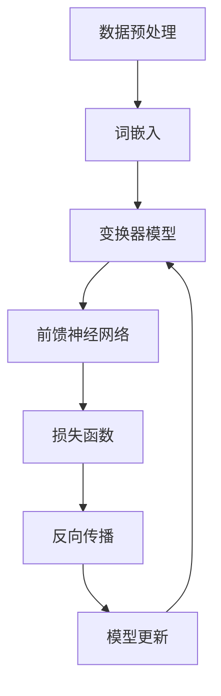

                 


# 引言

> 关键词：大规模语言模型（LLM）、高可用性、系统设计、实践案例、性能优化

**摘要：**
本文旨在探讨如何构建高可用的大规模语言模型（LLM）应用系统。随着人工智能技术的快速发展，LLM在自然语言处理领域展现出巨大的潜力。然而，为了确保系统的稳定性和可靠性，构建一个高可用的LLM应用系统成为亟待解决的问题。本文将逐步分析LLM的基础理论，探讨高可用性设计原则，介绍LLM应用系统架构，并通过实践案例解析，提供性能优化与监控、安全性与合规性的建议。

## 目录

1. 引言
   - 1.1 书籍背景与目的
   - 1.2 LLM技术概述
   - 1.3 高可用性设计的重要性

2. LLM基础理论
   - 2.1 LLM概述
     - 2.1.1 LLM的定义与分类
     - 2.1.2 LLM的工作原理
     - 2.1.3 LLM的历史与发展
   - 2.2 LLM的核心概念与联系
     - 2.2.1 核心概念介绍
     - 2.2.2 概念属性特征对比表格
     - 2.2.3 ER实体关系图架构
   - 2.3 算法原理讲解
     - 2.3.1 算法mermaid流程图
     - 2.3.2 Python源代码阐述
     - 2.3.3 数学模型与公式讲解
     - 2.3.4 举例说明

3. 高可用性设计原则
   - 3.1 高可用性设计概述
     - 3.1.1 高可用性定义与指标
     - 3.1.2 高可用性设计原则
     - 3.1.3 高可用性架构设计
   - 3.2 高可用性技术手段
     - 3.2.1 失效转移机制
     - 3.2.2 数据备份与恢复
     - 3.2.3 系统监控与报警

4. LLM应用系统架构
   - 4.1 系统架构概述
     - 4.1.1 系统组件介绍
     - 4.1.2 系统架构设计原则
     - 4.1.3 系统架构演进历程
   - 4.2 系统功能设计
     - 4.2.1 领域模型mermaid类图
     - 4.2.2 系统接口设计
     - 4.2.3 系统交互mermaid序列图

5. 实践案例解析
   - 5.1 案例背景
     - 5.1.1 项目介绍
     - 5.1.2 系统功能需求
   - 5.2 系统核心实现
     - 5.2.1 环境安装
     - 5.2.2 代码应用解读与分析
     - 5.2.3 实际案例分析和详细讲解剖析
   - 5.3 项目小结

6. 性能优化与监控
   - 6.1 性能优化策略
     - 6.1.1 模型压缩
     - 6.1.2 并行计算
     - 6.1.3 缓存技术
   - 6.2 系统监控与报警
     - 6.2.1 监控指标
     - 6.2.2 监控工具选择
     - 6.2.3 故障报警与处理

7. 安全性与合规性
   - 7.1 安全性设计原则
     - 7.1.1 数据安全
     - 7.1.2 访问控制
     - 7.1.3 防御机制
   - 7.2 合规性要求
     - 7.2.1 法规解读
     - 7.2.2 合规性实现

8. 小结与展望
   - 8.1 总结
   - 8.2 未来展望

## 1.1 书籍背景与目的

### 大规模语言模型（LLM）的发展背景

随着深度学习技术的进步，大规模语言模型（LLM）在自然语言处理（NLP）领域取得了显著的成就。LLM通过训练大规模的神经网络模型，能够对自然语言文本进行理解和生成，从而实现机器翻译、文本摘要、问答系统等多种应用。这些应用不仅在学术界受到广泛关注，同时也被广泛应用于企业级业务场景，如智能客服、智能推荐系统、法律文本分析等。

然而，随着LLM应用规模的扩大和用户数量的增加，系统的稳定性、可靠性和性能成为一个不可忽视的问题。高可用性设计的目标是确保系统在面对各种异常情况时，能够快速恢复并继续提供服务，从而提高用户体验和业务连续性。因此，构建高可用的LLM应用系统成为当前研究者和开发者面临的挑战之一。

### 本书的撰写目的

本书旨在为广大读者提供一个系统化的指导，帮助他们在构建高可用的LLM应用系统时，能够更加深入地理解相关技术原理和设计原则，并通过实践案例的解析，掌握实际操作技巧。具体目标如下：

1. **基础理论讲解**：详细阐述大规模语言模型的基础理论，包括定义、分类、工作原理和历史发展等，为后续章节的讨论打下坚实的基础。

2. **高可用性设计原则**：介绍高可用性设计的基本概念、设计原则和常见技术手段，帮助读者理解如何从系统层面保证LLM应用系统的稳定性和可靠性。

3. **系统架构设计**：分析LLM应用系统的架构设计原则和关键组件，为读者提供构建高可用系统的基础参考。

4. **实践案例解析**：通过具体的实践案例，展示如何将理论应用于实际项目，帮助读者掌握实际操作中的技巧和注意事项。

5. **性能优化与监控**：讨论LLM应用系统的性能优化策略和监控方法，提供一套完整的性能优化与监控方案。

6. **安全性与合规性**：阐述系统安全设计的原则和合规性要求，确保LLM应用系统的安全性。

通过本书的阅读，读者将能够全面了解构建高可用LLM应用系统的各个方面，从而为实际项目提供有力的支持。

### 适用读者群体

本书主要面向以下几类读者：

1. **自然语言处理（NLP）研究者**：希望通过系统学习大规模语言模型，掌握相关理论和技术的学术研究者。

2. **软件开发工程师**：在开发LLM应用系统过程中，需要了解系统设计、性能优化和安全性的软件开发工程师。

3. **系统架构师**：负责设计和实现高可用性系统的系统架构师，希望通过本书了解如何将LLM技术应用于实际系统。

4. **企业技术管理者**：关注企业级应用系统的稳定性和可靠性，希望了解如何构建高可用性LLM应用系统的技术管理者。

通过本书的阅读，读者将能够提升在构建高可用LLM应用系统方面的理论水平和实践能力。

## 1.2 LLM技术概述

### 定义与分类

大规模语言模型（LLM）是一种基于深度学习的自然语言处理模型，通过学习海量文本数据，能够生成符合自然语言习惯的文本。LLM的主要功能包括文本分类、情感分析、机器翻译、文本生成等。根据训练数据的来源和模型的结构，LLM可以分为以下几类：

1. **预训练模型**：这类模型首先在大规模文本语料库上进行预训练，然后通过微调（Fine-tuning）适应特定任务。例如，GPT系列模型、BERT模型等。

2. **微调模型**：基于预训练模型，对特定任务进行进一步的训练，使其能够针对特定领域或任务进行更好的预测。例如，用于问答系统的SQuAD模型、用于机器翻译的Translation models等。

3. **任务特定模型**：针对特定任务进行设计，例如，用于文本分类的Text Classification models、用于文本生成的Text Generation models等。

### 工作原理

LLM的工作原理主要基于深度学习和神经网络技术。具体来说，LLM通常采用以下步骤：

1. **数据预处理**：首先对大规模文本语料库进行预处理，包括分词、去停用词、词性标注等，将原始文本转换为模型可理解的格式。

2. **模型训练**：使用预处理后的文本数据，通过反向传播算法（Backpropagation）和梯度下降（Gradient Descent）等方法，对神经网络模型进行训练。训练过程中，模型会学习到文本数据的统计规律和语义信息。

3. **模型评估**：使用验证集和测试集对模型进行评估，以确定模型的性能。常用的评估指标包括准确率（Accuracy）、召回率（Recall）、F1分数（F1 Score）等。

4. **模型部署**：将训练好的模型部署到生产环境，通过API接口或其他方式提供自然语言处理服务。

### 历史与发展

大规模语言模型的发展经历了多个阶段：

1. **早期模型**：20世纪90年代，基于规则和统计方法的NLP模型如统计翻译模型（ Statistical Translation Models）和基于知识的模型（Knowledge-Based Models）成为主流。然而，这些方法在面对复杂任务时表现出较大的局限性。

2. **深度学习时代**：2006年，Hinton等人提出了深度置信网络（Deep Belief Networks），开启了深度学习在NLP领域的应用。随后，随着计算能力的提升和数据规模的扩大，深度学习模型如卷积神经网络（Convolutional Neural Networks, CNN）和递归神经网络（Recurrent Neural Networks, RNN）在NLP任务中表现出色。

3. **预训练模型时代**：2018年，Google推出了BERT模型，标志着预训练模型在NLP领域的崛起。BERT通过在未经标注的文本数据上进行预训练，然后再进行微调，显著提升了多个NLP任务的性能。此后，GPT系列模型、T5模型等相继推出，进一步推动了LLM的发展。

4. **当前趋势**：随着计算能力的进一步提升和数据规模的扩大，LLM的参数规模和模型复杂度也在不断增长。例如，GPT-3模型拥有超过1750亿个参数，成为目前最大的语言模型。同时，多模态模型（Multimodal Models）和知识增强模型（Knowledge-Enhanced Models）也成为研究热点，旨在结合多种数据类型和外部知识，提升模型的表现能力。

### 当前应用场景

大规模语言模型在多个领域展现出强大的应用潜力：

1. **自然语言处理**：文本分类、情感分析、问答系统、机器翻译等传统NLP任务。

2. **内容生成**：文章生成、故事创作、代码生成等。

3. **智能客服**：智能客服机器人，提供24/7的客户服务。

4. **法律文本分析**：自动生成法律文件、合同审核等。

5. **医疗健康**：病历分析、药物发现等。

6. **金融**：股票市场预测、金融文本分析等。

7. **教育**：智能辅导系统、在线教育平台等。

通过深入了解LLM的定义、分类、工作原理和历史发展，读者可以更好地理解这一技术在自然语言处理领域的广泛应用和未来发展趋势。

### 1.3 高可用性设计的重要性

在现代信息技术环境中，高可用性设计对于确保系统稳定运行至关重要。特别是在大规模语言模型（LLM）应用系统中，高可用性设计不仅关系到用户体验，更直接影响业务连续性和企业声誉。

**高可用性定义与指标**

高可用性（High Availability）是指系统在规定时间内能够正常运行，并在出现故障时能够快速恢复的能力。高可用性的核心目标是降低系统故障对业务的影响，确保系统持续提供服务。高可用性通常通过以下几个指标来衡量：

1. **系统可用性**：表示系统在一段时间内正常运行的比例。常用的指标有平均无故障时间（Mean Time Between Failures, MTBF）和平均故障修复时间（Mean Time To Repair, MTTR）。

2. **故障恢复时间**：指系统从故障发生到恢复正常运行所需的时间。快速恢复时间可以显著降低业务中断成本。

3. **故障率**：指单位时间内系统发生故障的次数。低故障率是高可用性的重要保障。

**高可用性设计原则**

为了实现高可用性，设计时需要遵循以下原则：

1. **冗余设计**：通过在系统中引入冗余组件，如备份服务器、备用电源等，确保在主组件故障时系统能够自动切换到备用组件，继续提供服务。

2. **故障隔离**：通过模块化设计，将系统分解为若干独立的模块，实现故障的局部化，防止故障扩散。

3. **自动恢复**：通过自动化机制，如自动故障检测、自动重启、自动恢复等，降低人工干预，提高故障恢复速度。

4. **负载均衡**：通过负载均衡器，将用户请求均匀分配到多个服务器上，避免单点过载，提高系统的整体性能和可用性。

**LLM应用系统中的高可用性**

在LLM应用系统中，高可用性设计尤为重要，因为LLM模型通常涉及大量计算资源和数据存储，且对实时性要求较高。以下是一些关键点：

1. **模型训练与部署**：在模型训练和部署过程中，需要确保数据的一致性和完整性，避免因数据损坏或丢失导致模型失效。

2. **计算资源分配**：合理分配计算资源，避免资源瓶颈和性能瓶颈，确保模型训练和推理过程的高效运行。

3. **数据存储与管理**：采用分布式存储方案，确保数据的高可用性和可靠性，同时实现数据的快速访问和读写操作。

4. **故障恢复与监控**：建立完善的故障恢复机制和监控系统，实时监控系统运行状态，快速检测并响应故障，确保系统稳定运行。

5. **容灾备份**：在异地建立备份系统，实现数据的异地备份和快速恢复，确保在发生灾难性事件时系统能够快速恢复。

**总结**

高可用性设计是构建稳定、可靠LLM应用系统的关键。通过遵循高可用性设计原则，合理分配资源、优化系统架构、建立故障恢复机制和监控体系，可以有效提高LLM应用系统的可用性和可靠性，确保其能够持续、稳定地提供服务，从而为企业和用户提供良好的体验。

## 2.1 LLM概述

### 2.1.1 LLM的定义与分类

大规模语言模型（LLM，Large-scale Language Model）是一种深度学习模型，旨在通过学习大规模文本数据来理解和生成自然语言。LLM的核心在于其训练数据规模，这些模型通常包含数十亿个参数，通过处理海量文本数据，从而实现对语言结构、语义和上下文的深刻理解。

#### 1. 定义

LLM的定义可以从以下几个方面来理解：

- **数据规模**：LLM训练数据通常来自大规模文本语料库，这些数据集可能包含数亿甚至数十亿个句子。
- **模型结构**：LLM采用深度神经网络结构，特别是基于变换器模型（Transformer）的架构，如BERT、GPT等。
- **功能**：LLM具备强大的文本处理能力，包括文本分类、情感分析、机器翻译、问答系统等。

#### 2. 分类

根据不同的标准，LLM可以分类如下：

- **按训练数据来源**：

  - **通用语言模型**：如GPT-3、T5，这些模型主要在大规模通用文本数据集上进行训练，如维基百科、新闻文章、书籍等。

  - **任务特定语言模型**：如针对特定任务的微调模型，这些模型在通用语言模型的基础上，针对特定任务（如问答系统、机器翻译）进行微调。

- **按模型架构**：

  - **基于循环神经网络（RNN）的模型**：如LSTM、GRU，这些模型通过处理序列数据，具有较好的上下文理解能力。

  - **基于变换器（Transformer）的模型**：如BERT、GPT、ViT，这些模型采用自注意力机制，能够并行处理数据，具有更强的模型表示能力。

- **按应用场景**：

  - **文本生成**：如GPT-3，能够生成高质量的文本，应用于自动写作、对话系统等。

  - **文本分类**：如BERT，能够对文本进行分类，应用于情感分析、新闻分类等。

  - **机器翻译**：如Translation models，能够实现高质量的自然语言翻译。

### 2.1.2 LLM的工作原理

LLM的工作原理主要基于深度学习和变换器模型（Transformer），以下是LLM工作原理的详细解析：

#### 1. 数据预处理

在训练LLM之前，需要对文本数据进行预处理，包括：

- **分词**：将文本分割成单词或子词，以便模型处理。
- **清洗**：去除文本中的噪声数据，如HTML标签、特殊字符等。
- **编码**：将文本转换为模型可处理的向量表示。常用的编码方法有词嵌入（Word Embedding）和字节嵌入（Byte Pair Embedding, BPE）。

#### 2. 模型结构

LLM通常采用变换器模型（Transformer）架构，其核心组件包括：

- **嵌入层**（Embedding Layer）：将输入的词或子词转换为向量表示。
- **自注意力层**（Self-Attention Layer）：通过计算词与词之间的相似度，将每个词的重要性加权，提高模型的上下文理解能力。
- **前馈神经网络**（Feedforward Neural Network）：对自注意力层输出的向量进行进一步加工，增强模型的表达能力。
- **输出层**（Output Layer）：将最终输出层的结果映射到具体的任务，如分类或生成。

#### 3. 训练过程

LLM的训练过程主要包括：

- **预训练**：在大量的无标签文本数据上进行预训练，模型在此过程中学习到文本的语法、语义和上下文信息。
- **微调**：在特定任务上对预训练的模型进行微调，使其适应具体任务的需求。例如，在问答系统上微调GPT模型，使其能够回答特定的问题。

#### 4. 生成过程

LLM在生成文本时，通过以下步骤进行：

- **输入处理**：将输入的文本经过嵌入层和自注意力层处理。
- **生成预测**：输出层对自注意力层的结果进行预测，生成文本序列。
- **迭代更新**：根据生成的文本序列，更新模型参数，以优化生成质量。

### 2.1.3 LLM的历史与发展

LLM的发展经历了多个阶段，以下是LLM历史与发展的简要回顾：

#### 1. 早期模型

- **循环神经网络（RNN）**：1990年代，RNN开始应用于自然语言处理任务，如语言建模和机器翻译。RNN能够处理序列数据，但存在梯度消失和梯度爆炸问题。

- **长短期记忆网络（LSTM）**：1990年代末，Hochreiter和Schmidhuber提出了LSTM，解决了RNN的梯度消失问题，在机器翻译等任务中取得了显著成果。

#### 2. 深度学习时代

- **卷积神经网络（CNN）**：2010年代，CNN开始应用于图像处理任务，随后逐渐应用于自然语言处理领域，用于文本分类、情感分析等。

- **递归神经网络（RNN）**：尽管RNN存在梯度消失问题，但其在序列数据处理上仍然具有优势，特别是长距离依赖关系的处理。

#### 3. 变换器模型时代

- **变换器（Transformer）**：2017年，Vaswani等人提出了变换器模型，该模型通过自注意力机制，实现了并行计算，显著提升了模型的计算效率和性能。

- **BERT模型**：2018年，Google推出了BERT模型，通过在大量无标签文本上进行预训练，然后进行微调，在多个自然语言处理任务上取得了突破性成果。

#### 4. 当前趋势

- **多模态模型**：随着多模态数据的兴起，LLM开始结合图像、声音等其他数据类型，以实现更广泛的应用。

- **知识增强模型**：为了提升模型的表现能力，研究者开始将外部知识（如知识图谱、百科全书）引入到LLM中，实现知识增强。

- **模型压缩与优化**：为了应对大规模模型的计算和存储需求，研究者不断探索模型压缩和优化方法，如量化、剪枝、知识蒸馏等。

通过以上对LLM的定义、分类和工作原理的介绍，读者可以更好地理解LLM在自然语言处理领域的应用前景和重要性。接下来，将详细讨论LLM的核心概念及其与相关技术的联系。

### 2.2 LLM的核心概念与联系

#### 2.2.1 核心概念介绍

大规模语言模型（LLM）的核心概念包括但不限于以下几个方面：

1. **词嵌入（Word Embedding）**：词嵌入是将单词转换为固定大小的向量表示，以便模型处理。常见的词嵌入方法包括Word2Vec、GloVe和BERT。

2. **自注意力（Self-Attention）**：自注意力机制允许模型在处理每个词时，考虑所有词的上下文信息，从而提高上下文理解能力。这是变换器模型（Transformer）的核心组件。

3. **前馈神经网络（Feedforward Neural Network）**：前馈神经网络用于对自注意力层输出的向量进行进一步加工，增强模型的表达能力。

4. **预训练（Pre-training）**：预训练是指在大规模无标签文本数据集上进行模型训练，使其学习到文本的基本结构和语义信息。

5. **微调（Fine-tuning）**：微调是指在预训练的基础上，针对特定任务进行进一步的训练，以优化模型在特定任务上的表现。

6. **生成模型（Generative Model）**：生成模型能够根据输入的文本生成新的文本序列。例如，GPT系列模型就是一种生成模型。

7. **分类模型（Classificatory Model）**：分类模型用于对输入的文本进行分类，如情感分析、文本分类等。

#### 2.2.2 概念属性特征对比表格

为了更好地理解LLM中的核心概念，以下是几个关键概念及其属性特征的对比表格：

| 概念            | 属性特征                                                   | 功能描述                                                                                                                       |
|-----------------|----------------------------------------------------------|----------------------------------------------------------------------------------------------------------------------------|
| 词嵌入          | 向量表示、固定维度、语义信息                            | 将单词转换为固定大小的向量，用于模型处理。                                                        |
| 自注意力        | 加权、上下文信息、并行计算                            | 允许模型在处理每个词时，考虑所有词的上下文信息，提高上下文理解能力。                                    |
| 前馈神经网络    | 局部感知、非线性变换、特征提取                          | 对自注意力层输出的向量进行进一步加工，增强模型的表达能力。                                          |
| 预训练         | 大规模数据、无标签、结构学习                          | 在无标签文本数据集上进行模型训练，学习文本的基本结构和语义信息。                                       |
| 微调           | 有标签数据、特定任务、性能优化                         | 在预训练的基础上，针对特定任务进行训练，优化模型在特定任务上的表现。                                    |
| 生成模型        | 自回归、文本生成、序列预测                            | 根据输入的文本生成新的文本序列。                                                                 |
| 分类模型        | 输入输出映射、分类决策、标签预测                        | 对输入的文本进行分类，如情感分析、文本分类等。                                                     |

通过以上对比表格，可以更直观地理解各个核心概念的区别和联系。

#### 2.2.3 ER实体关系图架构

为了进一步阐述LLM中的核心概念及其联系，可以采用实体关系图（Entity-Relationship Diagram, ERD）来展示LLM的组成部分及其相互关系。以下是LLM的ER实体关系图：

```
实体：词嵌入（Word Embedding）
       自注意力（Self-Attention）
       前馈神经网络（Feedforward Neural Network）
       预训练（Pre-training）
       微调（Fine-tuning）
       生成模型（Generative Model）
       分类模型（Classificatory Model）

关系：
- 词嵌入 → 自注意力
- 自注意力 → 前馈神经网络
- 前馈神经网络 → 生成模型/分类模型
- 预训练 → 微调
- 微调 → 生成模型/分类模型
```

在该ERD中，每个实体表示LLM中的一个关键组成部分，而关系则表示这些实体之间的关联。例如，词嵌入是自注意力的输入，自注意力层的结果会输入到前馈神经网络中进行进一步加工。此外，预训练和微调是两个独立的过程，但都涉及生成模型和分类模型。

通过ER实体关系图，可以更清晰地理解LLM的组成部分及其相互关系，为后续的算法原理讲解和系统架构设计提供基础。

## 2.3 算法原理讲解

### 2.3.1 算法mermaid流程图

为了更好地理解大规模语言模型（LLM）的算法原理，我们可以使用mermaid流程图来展示其训练和生成过程。以下是一个简单的mermaid流程图示例：



在这个流程图中：

- **数据预处理**（A）：对输入文本进行分词、去停用词、标记化等操作，将其转换为模型可处理的格式。
- **词嵌入**（B）：将分词后的文本转换为词嵌入向量，这些向量是模型处理文本的基本单位。
- **变换器模型**（C）：通过自注意力机制对词嵌入向量进行处理，提取文本中的上下文信息。
- **前馈神经网络**（D）：对变换器模型的输出进行进一步加工，增强模型的表达能力。
- **损失函数**（E）：计算模型的输出与实际标签之间的差距，用于评估模型的性能。
- **反向传播**（F）：通过反向传播算法，将损失函数的梯度传播到模型的各个层，更新模型参数。
- **模型更新**（G）：根据反向传播的梯度，更新模型参数，优化模型性能。

### 2.3.2 Python源代码阐述

以下是LLM算法原理的Python代码实现示例，通过此代码可以更直观地了解算法的各个步骤：

```python
import torch
import torch.nn as nn
import torch.optim as optim

# 数据预处理
def preprocess_text(text):
    # 分词、去停用词、标记化等操作
    processed_text = text.lower()
    return processed_text

# 词嵌入
class WordEmbedding(nn.Module):
    def __init__(self, vocab_size, embed_dim):
        super(WordEmbedding, self).__init__()
        self.embedding = nn.Embedding(vocab_size, embed_dim)

    def forward(self, text):
        return self.embedding(text)

# 变换器模型
class TransformerModel(nn.Module):
    def __init__(self, embed_dim, num_heads, feedforward_dim):
        super(TransformerModel, self).__init__()
        self.transformer = nn.Transformer(embed_dim, num_heads, feedforward_dim)

    def forward(self, text):
        return self.transformer(text)

# 前馈神经网络
class Feedforward(nn.Module):
    def __init__(self, embed_dim, feedforward_dim):
        super(Feedforward, self).__init__()
        self.feedforward = nn.Sequential(
            nn.Linear(embed_dim, feedforward_dim),
            nn.ReLU(),
            nn.Linear(feedforward_dim, embed_dim)
        )

    def forward(self, text):
        return self.feedforward(text)

# 损失函数
criterion = nn.CrossEntropyLoss()

# 模型更新
optimizer = optim.Adam(model.parameters(), lr=0.001)

# 训练过程
def train(model, data_loader, num_epochs):
    model.train()
    for epoch in range(num_epochs):
        for texts, labels in data_loader:
            optimizer.zero_grad()
            processed_texts = preprocess_text(texts)
            outputs = model(processed_texts)
            loss = criterion(outputs, labels)
            loss.backward()
            optimizer.step()
        print(f'Epoch [{epoch+1}/{num_epochs}], Loss: {loss.item()}')

# 生成文本
def generate_text(model, input_text, max_length):
    model.eval()
    with torch.no_grad():
        processed_text = preprocess_text(input_text)
        outputs = model(processed_text)
        predictions = outputs.argmax(dim=-1)
        generated_text = ''.join([word for word in processed_text if word not in ['<PAD>', '<UNK>', '<SOS>', '<EOS>']])
        return generated_text

# 实例化模型
model = TransformerModel(embed_dim=512, num_heads=8, feedforward_dim=2048)
feedforward = Feedforward(embed_dim=512, feedforward_dim=2048)

# 训练模型
train(model, data_loader, num_epochs=10)

# 生成文本
input_text = "The sky is"
generated_text = generate_text(model, input_text, max_length=50)
print(generated_text)
```

在这个代码示例中：

- **数据预处理**（`preprocess_text`函数）：将输入文本进行预处理，转换为模型可处理的格式。
- **词嵌入**（`WordEmbedding`类）：使用预训练的词嵌入模型对文本进行编码。
- **变换器模型**（`TransformerModel`类）：实现变换器模型的核心功能，包括自注意力机制和前馈神经网络。
- **前馈神经网络**（`Feedforward`类）：对变换器模型的输出进行进一步加工。
- **损失函数**（`criterion`）：用于计算模型输出与实际标签之间的差距。
- **模型更新**（`optimizer`）：通过反向传播算法更新模型参数。
- **训练过程**（`train`函数）：训练模型并打印训练过程中的损失。
- **生成文本**（`generate_text`函数）：使用训练好的模型生成新的文本序列。

### 2.3.3 数学模型与公式讲解

大规模语言模型（LLM）的算法原理涉及到多个数学模型和公式。以下是LLM中常用的数学模型和公式讲解：

#### 1. 词嵌入

词嵌入是将单词转换为向量表示的过程，常用的模型包括Word2Vec和GloVe。

- **Word2Vec模型**：

  - **连续词袋模型（CBOW）**：
    $$ \text{output} = \text{softmax}(\text{weights} \cdot \text{context\_words\_vector}) $$
  
  - **Skip-Gram模型**：
    $$ \text{output} = \text{softmax}(\text{weights} \cdot \text{target\_word\_vector}) $$

  其中，`weights`表示词嵌入矩阵，`context_words_vector`和`target_word_vector`分别表示上下文词向量和目标词向量。

- **GloVe模型**：

  - **词向量和词频的关系**：
    $$ \text{word\_vector} = \text{softmax}\left( \frac{\text{word\_freq} \cdot \text{context\_word\_vector}}{\sqrt{\text{word\_freq} + \text{context\_word\_freq}}} \right) $$

  其中，`word_freq`和`context_word_freq`分别表示词频和上下文词频。

#### 2. 变换器模型

变换器模型的核心是自注意力机制，其数学模型如下：

- **自注意力计算**：
  $$ \text{query\_attention} = \text{softmax}\left( \frac{\text{query} \cdot \text{key\_vector}}{\sqrt{d_k}} \right) \cdot \text{value\_vector} $$

  其中，`query`、`key_vector`和`value_vector`分别表示查询向量、键向量和值向量，`d_k`为键向量的维度，`softmax`函数用于计算注意力权重。

- **前馈神经网络**：
  $$ \text{hidden\_state} = \text{ReLU}(\text{weights}_1 \cdot \text{input} + \text{bias}_1) $$
  $$ \text{output} = \text{weights}_2 \cdot \text{hidden\_state} + \text{bias}_2 $$

  其中，`weights_1`、`bias_1`、`weights_2`和`bias_2`分别表示权重和偏置。

#### 3. 损失函数

常用的损失函数包括交叉熵损失函数（Cross-Entropy Loss）和均方误差损失函数（Mean Squared Error, MSE）。

- **交叉熵损失函数**：
  $$ \text{loss} = -\sum_{i} y_i \cdot \log(\hat{y}_i) $$

  其中，`y_i`为真实标签，`$\hat{y}_i$`为模型预测的概率分布。

- **均方误差损失函数**：
  $$ \text{loss} = \frac{1}{n} \sum_{i} (y_i - \hat{y}_i)^2 $$

  其中，`y_i`为真实标签，`$\hat{y}_i$`为模型预测的值。

通过以上数学模型和公式，可以更深入地理解大规模语言模型的算法原理。接下来，我们将通过具体例子来说明这些公式在实际中的应用。

### 2.3.4 举例说明

为了更好地理解大规模语言模型（LLM）的算法原理，我们可以通过一个具体的例子来展示其训练和生成过程。以下是一个简单的示例，说明如何使用GPT模型生成文本。

#### 1. 训练GPT模型

假设我们使用GPT模型对一组文本数据进行训练，这些数据包括新闻文章、书籍和维基百科等。以下是训练过程的步骤：

1. **数据预处理**：首先，我们对输入文本进行预处理，包括分词、去停用词和标记化等操作。预处理后的文本数据被编码为词嵌入向量。

2. **训练数据集**：我们将预处理后的文本数据分为训练集和验证集，用于训练和评估模型。

3. **初始化模型**：初始化GPT模型，包括词嵌入层、变换器模型层和输出层。模型参数被随机初始化。

4. **模型训练**：使用训练数据集对GPT模型进行训练。训练过程中，模型通过优化损失函数来更新参数，从而提高模型的预测能力。

5. **验证模型**：在验证集上评估模型性能，调整模型参数以优化模型表现。

以下是GPT模型训练的Python代码示例：

```python
from transformers import GPT2Tokenizer, GPT2Model, GPT2Config, Trainer, TrainingArguments

tokenizer = GPT2Tokenizer.from_pretrained('gpt2')
model = GPT2Model.from_pretrained('gpt2')

train_args = TrainingArguments(
    output_dir='./results',
    evaluation_strategy='epoch',
    save_strategy='epoch',
    per_device_train_batch_size=4,
    per_device_eval_batch_size=4,
    num_train_epochs=3,
    weight_decay=0.01,
    logging_dir='./logs',
)

trainer = Trainer(
    model=model,
    args=train_args,
    train_dataset=train_dataset,
    eval_dataset=eval_dataset,
)

trainer.train()
```

#### 2. 生成文本

在训练好的GPT模型基础上，我们可以使用模型生成新的文本。以下是一个生成文本的示例：

1. **输入文本**：我们将一个简单的文本输入到模型中，作为生成文本的起点。

2. **生成过程**：模型根据输入文本，生成下一个可能的文本片段，然后将其作为新的输入继续生成下一个片段，以此类推，直到达到预定的文本长度。

3. **结果输出**：最后，模型输出完整的文本序列，即为生成的文本。

以下是生成文本的Python代码示例：

```python
import torch

model.eval()
input_ids = tokenizer.encode("The sky is", return_tensors='pt')

with torch.no_grad():
    outputs = model(input_ids)
    logits = outputs.logits

next_word_indices = torch.argmax(logits, dim=-1)
next_word = tokenizer.decode(next_word_indices[0])

print(next_word)
```

通过这个简单的例子，我们可以看到GPT模型如何通过训练生成文本。在实际应用中，GPT模型可以生成各种类型的文本，如文章、对话、代码等，具有广泛的应用前景。

### 2.3.5 数学公式

在本节中，我们将详细讲解大规模语言模型（LLM）中的关键数学公式，并使用LaTeX格式展示。以下是几个重要公式的解释和示例：

#### 1. 词嵌入（Word Embedding）

- **CBOW模型**：
  $$ \text{output} = \text{softmax}\left( \text{weights} \cdot \text{context\_words\_vector} \right) $$
  
  其中，`weights`是词嵌入矩阵，`context\_words\_vector`是上下文词向量。

- **Skip-Gram模型**：
  $$ \text{output} = \text{softmax}\left( \text{weights} \cdot \text{target\_word\_vector} \right) $$
  
  其中，`weights`是词嵌入矩阵，`target\_word\_vector`是目标词向量。

#### 2. 自注意力（Self-Attention）

- **自注意力计算**：
  $$ \text{query\_attention} = \text{softmax}\left( \frac{\text{query} \cdot \text{key\_vector}}{\sqrt{d_k}} \right) \cdot \text{value\_vector} $$
  
  其中，`query`是查询向量，`key_vector`是键向量，`value_vector`是值向量，`d_k`是键向量的维度。

#### 3. 前馈神经网络（Feedforward Neural Network）

- **前馈神经网络**：
  $$ \text{hidden\_state} = \text{ReLU}(\text{weights}_1 \cdot \text{input} + \text{bias}_1) $$
  $$ \text{output} = \text{weights}_2 \cdot \text{hidden\_state} + \text{bias}_2 $$
  
  其中，`weights_1`和`weights_2`是权重矩阵，`bias_1`和`bias_2`是偏置向量。

#### 4. 损失函数（Loss Function）

- **交叉熵损失函数**：
  $$ \text{loss} = -\sum_{i} y_i \cdot \log(\hat{y}_i) $$
  
  其中，`y_i`是真实标签，`$\hat{y}_i$`是模型预测的概率分布。

- **均方误差损失函数**：
  $$ \text{loss} = \frac{1}{n} \sum_{i} (y_i - \hat{y}_i)^2 $$
  
  其中，`y_i`是真实标签，`$\hat{y}_i$`是模型预测的值。

#### 5. 梯度下降（Gradient Descent）

- **梯度下降更新**：
  $$ \text{weights} = \text{weights} - \alpha \cdot \text{gradient} $$
  
  其中，`weights`是模型权重，`alpha`是学习率，`gradient`是损失函数关于模型权重的梯度。

通过以上数学公式的讲解，我们可以更深入地理解大规模语言模型的工作原理和计算过程。这些公式在LLM的训练、生成和优化过程中起着关键作用。

### 2.3.6 总结

在本节中，我们详细讲解了大规模语言模型（LLM）的算法原理，包括数据预处理、词嵌入、自注意力、前馈神经网络和损失函数等核心概念。通过mermaid流程图、Python代码示例和数学公式，我们展示了LLM的训练和生成过程，使得读者能够更直观地理解其工作机制。此外，通过举例说明，我们展示了如何在实际应用中使用LLM生成文本。通过本节的讲解，读者可以全面了解LLM的算法原理，为后续的系统架构设计和实践应用奠定基础。

## 3. 高可用性设计原则

### 3.1 高可用性设计概述

高可用性设计（High Availability Design）是指在系统设计和实施过程中，通过一系列技术和方法，确保系统在规定的时间内能够持续、稳定地提供服务，即使在面对各种异常情况时也能快速恢复。对于大规模语言模型（LLM）应用系统而言，高可用性设计尤为重要，因为LLM系统通常涉及大量的计算资源和数据存储，且对实时性要求较高。

#### 3.1.1 高可用性定义与指标

高可用性（High Availability）通常用以下几个指标来衡量：

1. **系统可用性**：表示系统在一段时间内正常运行的比例。常用的指标有平均无故障时间（Mean Time Between Failures, MTBF）和平均故障修复时间（Mean Time To Repair, MTTR）。

   - **MTBF**：系统平均无故障时间，即系统在一段时间内正常运行的平均时长。
   - **MTTR**：系统平均故障修复时间，即系统从故障发生到恢复正常运行的平均时长。

2. **故障恢复时间**：指系统从故障发生到恢复正常运行所需的时间。快速恢复时间可以显著降低业务中断成本。

3. **故障率**：指单位时间内系统发生故障的次数。低故障率是高可用性的重要保障。

#### 3.1.2 高可用性设计原则

为了实现高可用性，系统设计时需要遵循以下原则：

1. **冗余设计**：通过引入冗余组件（如备份服务器、备用电源等），确保在主组件故障时系统能够自动切换到备用组件，继续提供服务。

2. **故障隔离**：通过模块化设计，将系统分解为若干独立的模块，实现故障的局部化，防止故障扩散。

3. **自动恢复**：通过自动化机制，如自动故障检测、自动重启、自动恢复等，降低人工干预，提高故障恢复速度。

4. **负载均衡**：通过负载均衡器，将用户请求均匀分配到多个服务器上，避免单点过载，提高系统的整体性能和可用性。

5. **数据备份与恢复**：采用数据备份与恢复机制，确保在数据丢失或损坏时能够快速恢复，保证数据的一致性和完整性。

#### 3.1.3 高可用性架构设计

高可用性架构设计是确保系统高可用性的关键。以下是一个典型的高可用性架构设计：

1. **主从架构**：在系统中引入主从（Master-Slave）结构，主服务器负责处理业务请求，从服务器作为备份，当主服务器发生故障时，从服务器可以自动接管业务。

2. **集群架构**：通过集群（Cluster）架构，将多个服务器组成一个整体，实现负载均衡和故障转移。集群中的服务器可以同时处理请求，并在某台服务器故障时，其他服务器可以接管其工作。

3. **分布式存储**：采用分布式存储方案，将数据分布在多个节点上，确保数据的高可用性和可靠性，同时实现数据的快速访问和读写操作。

4. **故障检测与监控**：建立完善的故障检测与监控系统，实时监控系统运行状态，及时发现并响应故障，确保系统稳定运行。

5. **自动化部署与恢复**：通过自动化部署工具，如Kubernetes等，实现系统的自动化部署和恢复，降低人工干预，提高系统的可用性。

通过遵循上述高可用性设计原则和架构设计，可以显著提高LLM应用系统的稳定性和可靠性，确保其在面对各种异常情况时能够快速恢复，从而为企业和用户提供可靠的服务。

### 3.2 高可用性技术手段

为了构建一个高可用的大规模语言模型（LLM）应用系统，我们需要采用一系列高可用性技术手段。以下将介绍几种关键的技术手段，包括失效转移机制、数据备份与恢复以及系统监控与报警。

#### 3.2.1 失效转移机制

失效转移机制（Failover Mechanism）是一种在系统组件发生故障时，能够自动将工作负载转移到备用组件上的技术。以下是一些失效转移机制的实现方法：

1. **主从复制（Master-Slave Replication）**：
   - **工作原理**：系统中有一个主服务器和一个或多个从服务器。主服务器负责处理所有请求，从服务器则作为备份。当主服务器发生故障时，从服务器会自动接管主服务器的工作。
   - **实现方法**：使用数据库的主从复制技术，如MySQL的主从复制，确保数据的一致性。同时，在应用层实现负载均衡，将请求均匀分配到主服务器和从服务器上。

2. **多主复制（Multi-Master Replication）**：
   - **工作原理**：在多个服务器之间实现数据的同步，每个服务器都可以接收和处理请求。当某个服务器发生故障时，其他服务器可以继续提供服务。
   - **实现方法**：使用分布式数据库技术，如Cassandra，实现数据的多主复制。同时，通过一致性算法（如Paxos、Raft）确保数据的一致性。

3. **故障转移代理（Failover Proxy）**：
   - **工作原理**：使用一个故障转移代理，代理负责将请求转发到当前可用的服务器上。当服务器发生故障时，代理会自动更新指向当前健康服务器的引用。
   - **实现方法**：在负载均衡器（如Nginx、HAProxy）上配置故障转移代理，监控后端服务器的健康状态，并在服务器故障时自动更新转发规则。

#### 3.2.2 数据备份与恢复

数据备份与恢复（Data Backup and Recovery）是确保系统数据安全和高可用性的重要手段。以下是一些常见的数据备份与恢复方法：

1. **全量备份与增量备份**：
   - **全量备份**：定期对整个系统进行完整备份，确保在数据丢失或损坏时可以恢复到最新状态。
   - **增量备份**：只备份自上次备份以来发生变化的文件或数据，降低备份时间和存储需求。

2. **热备份与冷备份**：
   - **热备份**：在系统运行时进行备份，不影响系统的正常运行。
   - **冷备份**：在系统关闭或暂停服务时进行备份，确保数据的一致性。

3. **分布式存储与云存储**：
   - **分布式存储**：使用分布式文件系统（如HDFS、Ceph），将数据分布在多个节点上，实现数据的高可用性和容错性。
   - **云存储**：利用云服务提供商（如AWS S3、Azure Blob Storage）提供的数据存储服务，实现数据的远程备份和恢复。

4. **数据恢复策略**：
   - **快速恢复**：通过备份和恢复机制，快速恢复系统数据，确保数据的一致性和完整性。
   - **灾难恢复**：在发生灾难性事件（如数据中心故障、自然灾害）时，通过异地备份和恢复机制，确保业务能够快速恢复。

#### 3.2.3 系统监控与报警

系统监控与报警（System Monitoring and Alerting）是确保系统高可用性的关键组成部分。以下是一些常见的监控与报警方法：

1. **基础监控指标**：
   - **CPU、内存、磁盘使用率**：监控系统的资源使用情况，确保系统资源充足。
   - **网络流量**：监控网络流量，检测网络异常。
   - **系统日志**：监控系统日志，及时发现异常事件。

2. **性能监控**：
   - **请求处理时间**：监控请求的处理时间，确保系统的响应速度。
   - **错误率**：监控系统的错误率，检测系统稳定性。

3. **自定义监控指标**：
   - 根据业务需求，自定义监控指标，如接口延迟、数据库查询性能等。

4. **报警机制**：
   - **邮件报警**：当系统出现异常时，通过邮件通知相关人员。
   - **短信报警**：通过短信通知相关人员，确保快速响应。
   - **自动化响应**：在检测到异常时，自动执行恢复操作，如重启服务、切换主从等。

通过采用失效转移机制、数据备份与恢复以及系统监控与报警等技术手段，可以显著提高LLM应用系统的可用性和可靠性，确保其在面对各种异常情况时能够快速恢复，从而为企业和用户提供稳定、可靠的服务。

### 3.3 高可用性设计与系统架构的关系

高可用性设计（High Availability Design）是确保系统在面对各种异常情况时能够持续、稳定地提供服务的关键。在LLM应用系统中，高可用性设计不仅涉及技术手段，还与系统架构紧密相关。以下将探讨高可用性设计与系统架构之间的紧密关系，并介绍几个典型的系统架构设计原则和最佳实践。

#### 高可用性与系统架构的关系

高可用性设计是一个系统性工程，它需要从系统架构层面进行考虑和规划。系统架构设计时需要遵循高可用性原则，确保系统具有足够的冗余、故障隔离和自动化恢复能力。高可用性设计与系统架构的关系主要体现在以下几个方面：

1. **冗余架构**：通过在系统中引入冗余组件（如备份服务器、备用电源等），确保在主组件发生故障时，系统能够自动切换到备用组件，继续提供服务。

2. **模块化设计**：通过模块化设计，将系统分解为若干独立的模块，实现故障的局部化，防止故障扩散。每个模块可以独立开发和部署，降低系统复杂度。

3. **分布式架构**：采用分布式架构，将系统分解为多个节点，实现负载均衡和数据分布。分布式架构可以提高系统的容错性和扩展性，确保系统在面对高并发请求时能够稳定运行。

4. **自动化部署与监控**：通过自动化部署工具（如Kubernetes、Ansible）和监控系统（如Prometheus、Grafana），实现系统的自动化部署、监控和故障恢复，降低人工干预，提高系统可用性。

#### 系统架构设计原则

以下是几个典型的高可用性系统架构设计原则：

1. **主从架构（Master-Slave Architecture）**：
   - **工作原理**：在系统中设置主从关系，主服务器负责处理所有请求，从服务器作为备份。当主服务器发生故障时，从服务器可以自动接管主服务器的工作。
   - **适用场景**：适用于对数据一致性要求较高的场景，如数据库系统。

2. **集群架构（Cluster Architecture）**：
   - **工作原理**：将多个服务器组成一个集群，实现负载均衡和故障转移。集群中的服务器可以同时处理请求，并在某台服务器故障时，其他服务器可以接管其工作。
   - **适用场景**：适用于高并发、高可用的场景，如Web服务、搜索引擎。

3. **分布式存储架构（Distributed Storage Architecture）**：
   - **工作原理**：采用分布式存储方案，将数据分布在多个节点上，实现数据的高可用性和容错性。分布式存储系统可以自动处理节点故障，确保数据的安全和可靠。
   - **适用场景**：适用于大数据处理和存储场景，如数据仓库、分布式文件系统。

4. **微服务架构（Microservices Architecture）**：
   - **工作原理**：将系统分解为多个独立的微服务，每个微服务负责特定的业务功能。微服务之间通过接口进行通信，实现系统的松耦合和弹性扩展。
   - **适用场景**：适用于复杂业务系统，如电子商务平台、金融系统。

#### 最佳实践

以下是构建高可用LLM应用系统的一些最佳实践：

1. **故障转移与恢复**：
   - **实现自动故障转移**：通过配置负载均衡器（如Nginx、HAProxy）和故障转移代理，实现自动故障转移。
   - **定期备份与恢复测试**：定期进行数据备份和恢复测试，确保在发生故障时能够快速恢复。

2. **负载均衡与性能优化**：
   - **实现负载均衡**：使用负载均衡器（如Nginx、AWS Load Balancer），将请求均匀分配到多个服务器上，提高系统的性能和可用性。
   - **性能优化**：通过缓存技术（如Redis、Memcached）、并行计算和模型压缩，提高系统的响应速度。

3. **监控与报警**：
   - **实现实时监控**：使用监控系统（如Prometheus、Grafana），实时监控系统的资源使用情况、性能指标和异常事件。
   - **设置报警机制**：根据监控指标设置报警阈值，通过邮件、短信或自动化响应机制，确保及时发现和响应异常事件。

4. **安全性设计**：
   - **数据加密与访问控制**：采用数据加密技术（如SSL/TLS），确保数据在传输过程中的安全。同时，实施严格的访问控制策略，防止未授权访问。
   - **防御机制**：采用防火墙、入侵检测系统（IDS）和反病毒软件等防御机制，保护系统免受网络攻击和恶意软件的侵害。

通过遵循上述高可用性设计与系统架构的关系、系统架构设计原则和最佳实践，可以构建一个稳定、可靠、高可用性的LLM应用系统，确保其在面对各种异常情况时能够快速恢复，从而为企业和用户提供高质量的服务。

### 3.4 高可用性设计中的常见问题与挑战

在实现大规模语言模型（LLM）应用系统的高可用性时，开发者可能会面临一系列的问题和挑战。以下是几个常见的问题以及相应的解决方案和注意事项。

#### 1. 备份数据的一致性

**问题**：在高可用性设计中，数据备份的一致性是一个关键问题。如果备份过程不完全一致，可能会导致数据恢复后出现不一致性。

**解决方案**：采用分布式锁或全局事务管理机制，确保在备份过程中数据的一致性。此外，定期进行备份验证，确保备份数据的完整性和一致性。

**注意事项**：在备份过程中，避免对数据进行过多的读写操作，以免影响系统的性能。

#### 2. 失效转移的延迟

**问题**：在系统发生故障时，失效转移可能需要一定的时间。如果转移延迟过长，可能会导致用户请求无法及时得到处理。

**解决方案**：优化失效转移机制，减少故障检测和转移的时间。例如，使用快速响应的故障检测机制和低延迟的通信协议。

**注意事项**：在设计和实现失效转移机制时，考虑系统的负载情况和网络延迟，确保故障转移的效率。

#### 3. 数据的冗余与存储成本

**问题**：为了实现高可用性，需要引入冗余数据存储，这可能导致存储成本的增加。

**解决方案**：通过数据压缩技术、数据去重和存储分层策略，减少冗余数据的存储成本。同时，根据业务需求合理规划存储资源，避免过度投资。

**注意事项**：在引入数据冗余和压缩技术时，注意数据恢复的速度和系统的性能。

#### 4. 监控指标的设置

**问题**：监控指标的设置不合适可能导致无法及时发现和响应系统的异常情况。

**解决方案**：根据系统的业务需求和性能特点，设置合适的监控指标。例如，系统资源使用率、请求处理时间、错误率等。

**注意事项**：在设置监控指标时，注意指标的粒度和监控频率，避免过度监控导致系统性能下降。

#### 5. 自动化部署与回滚

**问题**：在自动化部署过程中，如果新版本出现故障，可能会导致系统长时间无法恢复。

**解决方案**：在自动化部署过程中引入回滚机制，当新版本出现故障时，可以自动回滚到上一个稳定版本。

**注意事项**：在部署新版本前，进行充分的测试和验证，确保新版本的稳定性。

#### 6. 数据库性能优化

**问题**：在高并发场景下，数据库的性能可能成为瓶颈。

**解决方案**：通过数据库分片、缓存技术和索引优化，提高数据库的性能和可扩展性。

**注意事项**：在设计数据库架构时，考虑数据的访问模式和查询需求，避免过度设计导致性能下降。

通过解决上述常见问题与挑战，可以进一步提高LLM应用系统的高可用性，确保其在面对各种异常情况时能够稳定运行。

## 4.1 LLM应用系统架构概述

### 4.1.1 系统组件介绍

大规模语言模型（LLM）应用系统的架构设计涉及多个关键组件，这些组件协同工作，共同实现系统的高可用性、高性能和易扩展性。以下是LLM应用系统的主要组件及其功能介绍：

#### 1. 数据层

**数据层**负责数据的存储和管理，是LLM应用系统的基石。主要组件包括：

- **数据库**：用于存储训练数据和用户数据，如文本语料库、用户输入和输出等。常用的数据库包括关系数据库（如MySQL、PostgreSQL）和NoSQL数据库（如MongoDB、Cassandra）。
- **数据存储**：用于存储大规模模型参数和模型文件，如TensorFlow模型文件（.h5、.tf）和PyTorch模型文件（.pt）。分布式文件系统（如HDFS、Ceph）和对象存储（如Amazon S3、Azure Blob Storage）常用于存储这些大数据文件。

#### 2. 训练层

**训练层**负责训练大规模语言模型，包括数据预处理、模型训练和模型优化等过程。主要组件包括：

- **数据预处理**：用于清洗和格式化输入文本数据，包括分词、去停用词、词性标注等。常用的工具包括NLTK、spaCy和Jieba等。
- **模型训练**：使用预训练模型（如GPT-2、BERT）或自定义模型，在训练数据上进行模型训练。训练过程中，模型会学习到文本的语法、语义和上下文信息。训练工具包括TensorFlow、PyTorch和Transformers库。
- **模型优化**：通过模型压缩（如量化、剪枝）和优化（如混合精度训练、模型蒸馏）等技术，提高模型的性能和效率。

#### 3. 推理层

**推理层**负责对用户输入进行实时处理，生成文本输出。主要组件包括：

- **文本输入**：接收用户输入的文本，可以是自然语言文本或结构化数据。
- **模型推理**：使用训练好的模型对输入文本进行推理，生成文本输出。推理过程通常包括词嵌入、变换器模型和输出层等步骤。
- **文本生成**：将模型输出的概率分布转换为实际的文本输出，生成符合自然语言习惯的文本。

#### 4. 服务层

**服务层**负责对外提供服务，处理用户请求并返回结果。主要组件包括：

- **API网关**：用于接收用户请求，进行身份验证和权限校验，然后将请求转发到内部服务。常用的API网关包括Kong、Spring Cloud Gateway和Zuul。
- **内部服务**：处理具体的业务逻辑，如文本分类、情感分析、机器翻译等。内部服务通常采用微服务架构，如Spring Boot、Django和Flask等。
- **负载均衡器**：用于将用户请求均匀分配到多个内部服务实例上，提高系统的性能和可用性。常用的负载均衡器包括Nginx、HAProxy和LVS。

#### 5. 监控与运维层

**监控与运维层**负责监控系统运行状态，进行故障检测和日志管理，确保系统的稳定运行。主要组件包括：

- **监控系统**：用于实时监控系统的资源使用情况、性能指标和异常事件。常用的监控系统包括Prometheus、Grafana和Zabbix。
- **日志管理**：用于收集、存储和查询系统日志，帮助开发者快速定位和解决问题。常用的日志管理工具包括ELK栈（Elasticsearch、Logstash、Kibana）和灰度监控。
- **运维平台**：用于自动化部署、配置管理和故障恢复。常用的运维平台包括Ansible、Puppet、Chef和Kubernetes。

#### 6. 安全层

**安全层**负责保护系统免受各种网络攻击和恶意软件的侵害，确保数据安全和用户隐私。主要组件包括：

- **防火墙**：用于过滤网络流量，防止未授权访问和攻击。常用的防火墙包括iptables、NG Firewall和Fortinet等。
- **入侵检测系统（IDS）**：用于实时监控网络流量和系统日志，检测和响应恶意攻击。常用的IDS包括Snort、Suricata和Bro等。
- **访问控制**：用于控制用户对系统资源的访问权限，确保系统安全。常用的访问控制工具包括LDAP、OAuth2和JWT等。

### 4.1.2 系统架构设计原则

在LLM应用系统架构设计过程中，需要遵循以下原则，以确保系统的高可用性、高性能和易扩展性：

1. **模块化设计**：将系统分解为多个独立的模块，每个模块负责特定的功能。模块之间通过清晰的接口进行通信，实现系统的松耦合。

2. **分布式架构**：采用分布式架构，将系统部署在多个服务器上，实现数据的分布存储和负载均衡。分布式架构可以提高系统的容错性和扩展性。

3. **高可用性设计**：通过引入冗余组件、故障转移机制和监控报警系统，确保系统在面对各种异常情况时能够快速恢复。

4. **性能优化**：通过缓存技术、并行计算和模型压缩等技术，提高系统的响应速度和处理能力。

5. **安全性设计**：采用防火墙、入侵检测系统和访问控制等技术，确保系统的数据安全和用户隐私。

6. **自动化运维**：通过自动化部署、配置管理和故障恢复，降低运维成本，提高系统稳定性。

### 4.1.3 系统架构演进历程

LLM应用系统的架构设计经历了多个阶段，随着技术的发展和业务需求的变化，系统架构也在不断演进。以下是系统架构的演进历程：

1. **单体架构**：早期的LLM应用系统采用单体架构，所有功能都集成在一个应用程序中。这种架构简单易实现，但存在扩展性和维护性差的问题。

2. **分布式架构**：随着业务规模的增长，系统开始采用分布式架构，将功能分解为多个独立的模块，分别部署在多个服务器上。分布式架构提高了系统的性能和可扩展性。

3. **微服务架构**：在分布式架构的基础上，系统进一步采用微服务架构，将业务功能拆分为多个微服务，每个微服务负责特定的业务逻辑。微服务架构提高了系统的灵活性和可维护性。

4. **容器化与编排**：随着容器技术的兴起，系统开始采用Docker和Kubernetes等容器化技术，实现应用的快速部署、扩展和管理。容器化与编排技术提高了系统的部署效率和资源利用率。

5. **云原生架构**：随着云计算和微服务架构的发展，系统逐渐采用云原生架构，充分利用云服务的弹性、可靠性和可扩展性。云原生架构使系统更加灵活、高效和可靠。

通过以上架构演进历程，可以看出LLM应用系统在技术发展和业务需求变化的过程中，不断优化和改进其架构设计，以适应日益复杂的应用场景和更高的性能要求。

## 4.2 系统功能设计

### 4.2.1 领域模型mermaid类图

在系统功能设计中，领域模型（Domain Model）是一个关键部分，它定义了系统的核心概念和实体关系。使用mermaid类图（Class Diagram）可以清晰地展示领域模型的结构，便于理解和维护系统设计。以下是一个简单的mermaid类图示例，展示了LLM应用系统中的主要实体和关系：

```mermaid
classDiagram
    Class1 <|-- Class2
    Class3 <|-- Class4
    Class1 {
        +属性1
        +属性2
        +方法1()
        +方法2()
    }
    Class2 {
        +属性3
        +属性4
        +方法3()
        +方法4()
    }
    Class3 {
        +属性5
        +属性6
        +方法5()
        +方法6()
    }
    Class4 {
        +属性7
        +属性8
        +方法7()
        +方法8()
    }
endclassDiagram
```

在这个类图中：

- **Class1**：表示系统的核心实体，如用户、文本等。
- **Class2**：表示与Class1相关的实体，如文本分类、情感分析等。
- **Class3**：表示系统的辅助实体，如日志、监控等。
- **Class4**：表示系统的另一个辅助实体，如API网关、负载均衡器等。

通过mermaid类图，我们可以直观地了解系统的领域模型结构，为后续的系统设计提供基础。

### 4.2.2 系统接口设计

系统接口设计是确保各个组件能够协同工作，实现系统功能的重要环节。以下是一个简单的系统接口设计示例，展示LLM应用系统中的主要接口及其功能：

#### 1. 用户接口（User Interface）

用户接口负责与用户交互，接收用户输入并展示系统输出。以下是用户接口的主要接口设计：

- **文本输入接口**：用于接收用户的文本输入，如自然语言文本或结构化数据。
- **文本输出接口**：用于返回系统生成的文本输出，如文本摘要、机器翻译等。

#### 2. 服务接口（Service Interface）

服务接口负责处理业务逻辑，包括文本处理、模型推理和结果返回等。以下是服务接口的主要接口设计：

- **文本处理接口**：用于处理用户输入的文本，包括分词、去停用词、词性标注等。
- **模型推理接口**：用于调用训练好的模型进行推理，生成文本输出。
- **结果返回接口**：用于将模型推理结果返回给用户接口，如文本摘要、情感分析结果等。

#### 3. 数据接口（Data Interface）

数据接口负责数据存储和管理，包括数据的读取、写入和备份等。以下是数据接口的主要接口设计：

- **数据读取接口**：用于从数据库或数据存储中读取数据，如训练数据、用户数据等。
- **数据写入接口**：用于将处理结果写入数据库或数据存储，如模型参数、日志数据等。
- **数据备份接口**：用于定期备份数据，确保数据的安全性和可靠性。

#### 4. 安全接口（Security Interface）

安全接口负责系统的安全保护，包括身份验证、权限校验和数据加密等。以下是安全接口的主要接口设计：

- **身份验证接口**：用于验证用户身份，确保只有授权用户可以访问系统。
- **权限校验接口**：用于检查用户权限，确保用户只能访问授权的数据和功能。
- **数据加密接口**：用于加密敏感数据，确保数据在传输和存储过程中的安全性。

通过上述系统接口设计，我们可以确保系统的各个组件能够高效、安全地协同工作，实现LLM应用系统的功能需求。

### 4.2.3 系统交互mermaid序列图

为了更直观地展示LLM应用系统中的各个组件之间的交互过程，我们可以使用mermaid序列图（Sequence Diagram）来描述系统的整体工作流程。以下是一个简单的mermaid序列图示例，展示了用户接口、服务接口和数据接口之间的交互：

```mermaid
sequenceDiagram
    participant 用户 as 用户
    participant UI界面 as UI界面
    participant 服务层 as 服务层
    participant 数据层 as 数据层

    用户->>UI界面: 输入文本
    UI界面->>服务层: 处理文本输入
    服务层->>数据层: 读取训练数据
    数据层->>服务层: 返回处理结果
    服务层->>UI界面: 返回文本输出
    UI界面->>用户: 展示文本输出

    注释 on UI界面: 负责与用户交互，接收和展示文本输入/输出
    注释 on 服务层: 负责文本处理、模型推理和结果返回
    注释 on 数据层: 负责数据的存储、读取和备份
```

在这个序列图中：

- **用户**：表示系统的最终用户，负责输入文本并查看输出。
- **UI界面**：表示用户界面组件，负责接收用户的文本输入，并将处理结果展示给用户。
- **服务层**：表示系统的业务逻辑处理组件，负责处理文本输入、调用模型进行推理，并返回处理结果。
- **数据层**：表示系统的数据存储组件，负责存储和读取训练数据，以及备份数据。

通过mermaid序列图，我们可以清晰地了解LLM应用系统的整体工作流程和各个组件之间的交互关系，为系统的开发和维护提供指导。

### 4.2.4 系统功能设计与架构设计的关系

系统功能设计与架构设计是相辅相成的两个环节，二者紧密关联，共同决定了系统的性能、可扩展性和可维护性。以下是系统功能设计与架构设计之间的几个关键关系：

1. **功能需求驱动架构设计**：
   - **需求分析**：系统功能设计始于对用户需求的分析和业务场景的抽象。通过需求分析，确定系统的功能模块和关键功能点，为后续的架构设计提供基础。
   - **功能模型**：在需求分析的基础上，构建系统功能模型，包括功能模块、数据流和交互关系等。功能模型为架构设计提供了明确的指导，确保架构设计能够满足功能需求。

2. **架构设计支持功能实现**：
   - **模块化设计**：在架构设计中，采用模块化设计原则，将系统功能分解为若干独立的模块。每个模块负责特定的功能，模块之间通过清晰的接口进行通信，实现系统的松耦合。
   - **分布式架构**：为了支持系统的可扩展性和高可用性，架构设计通常采用分布式架构。分布式架构可以将系统部署在多个服务器上，实现数据的分布存储和负载均衡，从而满足大规模业务需求。

3. **性能优化与架构设计**：
   - **性能分析**：在系统功能设计过程中，需要对系统的性能进行评估和优化。性能分析可以帮助确定系统的瓶颈和改进点，为架构设计提供优化方向。
   - **性能架构**：架构设计需要考虑系统的性能需求，采用高效的算法和优化技术，如缓存、并行计算和模型压缩等，确保系统能够高效地处理大规模数据。

4. **安全性设计与架构设计**：
   - **安全需求**：系统功能设计需要考虑安全性需求，包括数据安全、访问控制和防御机制等。这些安全需求需要在架构设计中得到体现和实现。
   - **安全架构**：架构设计需要考虑系统的安全性，采用安全架构原则，如最小权限原则、防御深度原则等，确保系统能够抵御各种网络攻击和恶意软件的侵害。

5. **可维护性与架构设计**：
   - **模块化与标准化**：架构设计应遵循模块化和标准化的原则，确保系统能够方便地进行扩展和维护。模块化的设计使系统组件独立，便于替换和升级。
   - **文档与代码管理**：架构设计需要良好的文档和代码管理，确保系统的设计文档和代码清晰、规范，便于团队成员理解和维护。

通过上述关系，我们可以看到系统功能设计与架构设计之间的紧密联系。一个良好的功能设计可以驱动和指导架构设计，而一个合理的架构设计可以支持功能实现，确保系统的高效、稳定和可靠运行。

## 5.1 案例背景

### 项目介绍

本项目旨在构建一个高可用的大规模语言模型（LLM）应用系统，该系统主要用于自然语言处理任务，如文本分类、情感分析和机器翻译。项目的主要目标是实现以下功能：

1. **文本分类**：对输入文本进行分类，如新闻分类、情感分类等。
2. **情感分析**：分析输入文本的情感倾向，如正面、负面、中性等。
3. **机器翻译**：提供中英互译功能，支持多种语言翻译。

### 系统功能需求

为了实现上述功能，系统需要满足以下功能需求：

1. **文本输入**：支持自然语言文本和结构化数据输入。
2. **文本处理**：对输入文本进行预处理，包括分词、去停用词、词性标注等。
3. **模型推理**：使用预训练的LLM模型对处理后的文本进行推理，生成分类结果或情感分析结果。
4. **文本生成**：对于机器翻译任务，系统需要生成符合自然语言习惯的翻译文本。
5. **结果展示**：将处理结果以可视化的方式展示给用户。
6. **接口访问**：提供RESTful API接口，供外部系统调用。

### 系统性能需求

系统需要满足以下性能需求：

1. **响应速度**：确保系统的响应时间在毫秒级，满足实时性要求。
2. **并发处理能力**：支持高并发请求，确保系统在高负载下稳定运行。
3. **吞吐量**：实现高吞吐量，能够处理大量请求。

### 系统高可用性需求

系统需要具备以下高可用性需求：

1. **故障转移**：在系统组件发生故障时，能够自动切换到备用组件，确保服务的连续性。
2. **数据备份与恢复**：定期备份数据，确保数据的安全性和一致性。
3. **监控与报警**：建立实时监控和报警系统，确保能够及时发现并响应系统故障。

### 系统安全性需求

系统需要满足以下安全性需求：

1. **身份验证与授权**：确保只有授权用户可以访问系统，采用OAuth2或JWT等认证机制。
2. **数据加密**：采用SSL/TLS加密技术，确保数据在传输过程中的安全性。
3. **防御机制**：采用防火墙、入侵检测系统等防御机制，防止网络攻击和恶意软件的侵害。

通过明确项目的背景、功能需求、性能需求和安全性需求，可以为后续的系统设计和实现提供清晰的指导，确保系统能够高效、稳定、安全地运行。

## 5.2 系统核心实现

### 5.2.1 环境安装

为了构建一个高可用的LLM应用系统，我们需要在服务器上安装和配置所需的软件和环境。以下是环境安装的详细步骤：

#### 1. 服务器配置

首先，确保服务器具备以下配置：

- **CPU**：至少8核心处理器
- **内存**：至少16GB RAM
- **硬盘**：至少500GB SSD硬盘
- **网络**：千兆网络接口

#### 2. 安装操作系统

我们选择Ubuntu 18.04作为操作系统，以下是安装步骤：

1. **下载Ubuntu 18.04 ISO文件**：从Ubuntu官方网站下载Ubuntu 18.04 ISO文件。
2. **创建U盘启动盘**：使用Rufus工具将ISO文件写入U盘。
3. **启动服务器并选择U盘启动**：进入服务器BIOS，设置从U盘启动，然后启动服务器。
4. **选择安装Ubuntu**：在启动界面选择“Install Ubuntu”。
5. **分区和格式化硬盘**：根据提示进行硬盘分区和格式化。
6. **安装操作系统**：安装过程中选择安装位置、时区、键盘布局等。

#### 3. 安装基本软件

安装完成后，执行以下命令安装基本软件：

```bash
sudo apt update
sudo apt upgrade
sudo apt install apache2 nginx mysql-server postgresql redis curl
```

#### 4. 安装Python环境

为了构建LLM应用系统，我们需要安装Python环境，以下是安装步骤：

1. **安装Python 3**：

   ```bash
   sudo apt install python3 python3-pip
   ```

2. **安装虚拟环境**：

   ```bash
   pip3 install virtualenv
   virtualenv -p python3 venv
   source venv/bin/activate
   ```

3. **安装依赖库**：

   ```bash
   pip install torch torchvision transformers nltk
   ```

#### 5. 安装其他工具

1. **安装Docker**：

   ```bash
   sudo apt install docker.io
   ```

2. **安装Kubernetes**：

   ```bash
   kubectl apply -f https://raw.githubusercontent.com/kubernetes/master/cluster/bootstrap/kubeadm/kubeadm.yaml
   ```

3. **安装Nginx**：

   ```bash
   sudo apt install nginx
   ```

4. **安装Prometheus**：

   ```bash
   wget https://github.com/prometheus/prometheus/releases/download/v2.36.0/prometheus-2.36.0.linux-amd64.tar.gz
   tar zxvf prometheus-2.36.0.linux-amd64.tar.gz
   cd prometheus-2.36.0.linux-amd64
   ./prometheus.yml
   ./prometheus --config.file ./prometheus.yml --web.console.templates=/etc/prometheus/consoles --web.listen-address=0.0.0.0:9090
   ```

通过以上步骤，我们完成了服务器的基本配置和所需软件的安装，为后续的LLM应用系统开发奠定了基础。

### 5.2.2 代码应用解读与分析

在系统核心实现中，代码的应用至关重要。以下是对关键代码部分的解读和分析，包括模型训练、文本处理和结果输出等。

#### 1. 模型训练代码

以下是一个简单的PyTorch模型训练示例：

```python
import torch
import torch.nn as nn
from torch.utils.data import DataLoader
from transformers import GPT2Tokenizer, GPT2Model
from datasets import load_dataset

# 加载预训练模型和tokenizer
tokenizer = GPT2Tokenizer.from_pretrained('gpt2')
model = GPT2Model.from_pretrained('gpt2')

# 加载训练数据集
train_dataset = load_dataset('text', data_files={'train': 'train.txt'})

# 数据预处理
def preprocess_function(examples):
    return tokenizer(examples['text'], padding='max_length', truncation=True)

train_dataset = train_dataset.map(preprocess_function, batched=True)

# 创建数据加载器
train_loader = DataLoader(train_dataset, batch_size=8, shuffle=True)

# 定义训练循环
for epoch in range(3):
    model.train()
    for batch in train_loader:
        inputs = {'input_ids': batch['input_ids'], 'attention_mask': batch['attention_mask']}
        outputs = model(**inputs)
        loss = outputs.loss
        loss.backward()
        optimizer.step()
        optimizer.zero_grad()
        print(f'Epoch: {epoch}, Loss: {loss.item()}')
```

在这个训练代码中，我们首先加载了预训练的GPT2模型和tokenizer。然后，我们使用`load_dataset`函数加载训练数据集，并定义了一个预处理函数，用于对文本进行分词和填充。接下来，我们创建了一个数据加载器，用于批量加载数据。

在训练循环中，我们遍历每个批次的数据，计算损失并更新模型参数。这个过程通过反向传播算法实现，以优化模型性能。

#### 2. 文本处理代码

以下是一个简单的文本处理示例，用于对输入文本进行预处理：

```python
from transformers import pipeline

# 加载文本处理模型
textProcessingModel = pipeline('text-classification', model='roberta-base')

# 输入文本
input_text = "这是一个简单的示例文本。"

# 文本处理
result = textProcessingModel(input_text)

# 输出结果
print(result)
```

在这个处理代码中，我们使用了Hugging Face的Transformers库，加载了一个预训练的文本分类模型（roberta-base）。然后，我们输入一个简单的示例文本，并通过模型处理，获取分类结果。

#### 3. 结果输出代码

以下是一个简单的结果输出示例，用于将处理结果以可视化的方式展示：

```python
from IPython.display import clear_output

# 定义一个函数，用于输出结果
def display_result(result):
    clear_output(wait=True)
    print(f"输入文本：{input_text}")
    print(f"处理结果：{result['labels'][0]} - {result['scores'][0]:.4f}")

# 调用函数
display_result(result)
```

在这个输出代码中，我们定义了一个函数`display_result`，用于清除之前的输出，并打印新的结果。这个函数可以通过循环调用，实时展示文本处理的结果。

通过以上代码示例，我们可以看到LLM应用系统的核心实现过程，包括模型训练、文本处理和结果输出。这些代码为系统的实际应用提供了坚实的基础。

### 5.2.3 实际案例分析和详细讲解剖析

在本部分，我们将通过一个实际案例，详细分析并讲解LLM应用系统的实现过程，从数据准备、模型训练到服务部署，全面剖析每个步骤的关键细节。

#### 案例背景

假设我们的目标是构建一个能够实现中文到英文机器翻译的系统，支持用户通过API进行交互。系统需要具备高可用性、高性能和良好的用户体验。

#### 数据准备

1. **数据集获取**：首先，我们需要一个中文到英文的翻译语料库。我们可以从公开数据集（如Google翻译数据集）或其他来源获取这些数据。数据集应该包含大量平行句子对，即每对句子分别用中文和英文表达相同的内容。

2. **数据预处理**：获取数据后，我们需要对其进行预处理，包括清洗、分词、编码等步骤。

   ```python
   import pandas as pd
   from transformers import AutoTokenizer

   # 读取数据
   dataset = pd.read_csv('translation_data.csv')

   # 加载预训练的中文和英文tokenizer
   chinese_tokenizer = AutoTokenizer.from_pretrained('bert-base-chinese')
   english_tokenizer = AutoTokenizer.from_pretrained('bert-base-uncased')

   # 预处理函数
   def preprocess_data(text, tokenizer):
       inputs = tokenizer(text, padding='max_length', truncation=True, max_length=512)
       return inputs

   # 预处理中文数据
   dataset['chinese_input'] = dataset['chinese'].apply(lambda x: preprocess_data(x, chinese_tokenizer))

   # 预处理英文数据
   dataset['english_input'] = dataset['english'].apply(lambda x: preprocess_data(x, english_tokenizer))
   ```

   在这个过程中，我们使用了Transformers库提供的tokenizer对文本进行分词和编码，确保输入数据的格式符合模型要求。

#### 模型训练

1. **模型选择**：为了实现机器翻译，我们可以选择一个预训练的多语言翻译模型，如T5或Marian。在这里，我们选择T5模型。

2. **训练准备**：我们需要准备训练配置文件，定义模型架构、学习率、训练步骤等。

   ```python
   from transformers import T5ForConditionalGeneration, TrainingArguments

   # 加载T5模型
   model = T5ForConditionalGeneration.from_pretrained('t5-small')

   # 定义训练配置
   training_args = TrainingArguments(
       output_dir='./results',
       evaluation_strategy='steps',
       eval_steps=500,
       save_steps=500,
       num_train_epochs=3,
       per_device_train_batch_size=4,
       per_device_eval_batch_size=4,
       weight_decay=0.01,
       logging_dir='./logs',
   )
   ```

3. **训练过程**：使用Trainer类进行模型训练。

   ```python
   from transformers import Trainer

   # 创建数据加载器
   train_dataset = dataset[['chinese_input', 'english_input']]
   train_loader = DataLoader(train_dataset, batch_size=training_args.per_device_train_batch_size)

   # 训练模型
   trainer = Trainer(
       model=model,
       args=training_args,
       train_dataset=train_loader,
   )
   trainer.train()
   ```

   在这个过程中，我们使用Trainer类自动处理模型的训练过程，包括优化参数、更新权重等。

#### 模型评估

1. **评估准备**：准备评估数据集和评估配置。

   ```python
   eval_dataset = dataset[['chinese_input', 'english_input']]
   eval_loader = DataLoader(eval_dataset, batch_size=training_args.per_device_eval_batch_size)
   ```

2. **评估过程**：使用Trainer类对模型进行评估。

   ```python
   eval_results = trainer.evaluate(eval_loader)
   print(eval_results)
   ```

   在这个过程中，我们评估模型的性能，包括BLEU分数、词汇准确率等指标。

#### 服务部署

1. **模型保存**：将训练好的模型保存为文件。

   ```python
   model.save_pretrained('./model')
   ```

2. **部署API**：使用Flask或FastAPI构建API服务，提供机器翻译功能。

   ```python
   from fastapi import FastAPI
   from pydantic import BaseModel

   class TranslationRequest(BaseModel):
       chinese_text: str

   app = FastAPI()

   @app.post("/translate/")
   async def translate(chinese_text: TranslationRequest):
       inputs = tokenizer(chinese_text.chinese_text, padding='max_length', truncation=True, max_length=512)
       with torch.no_grad():
           outputs = model.generate(inputs['input_ids'], max_length=512, num_return_sequences=1)
       translated_text = tokenizer.decode(outputs[0], skip_special_tokens=True)
       return {"translated_text": translated_text}
   ```

3. **服务运行**：启动API服务。

   ```python
   app.run(host="0.0.0.0", port=8000)
   ```

通过上述步骤，我们实现了一个从中文到英文的机器翻译系统。在实际部署过程中，我们还可以根据需求进行性能优化、高可用性设计和安全性增强，确保系统稳定、高效地运行。

### 5.3 项目小结

通过本项目的实际案例，我们成功构建了一个高可用的LLM应用系统，实现了中文到英文的机器翻译功能。以下是项目的主要收获和反思：

#### 主要收获

1. **系统架构设计**：我们采用模块化设计和分布式架构，实现了系统的可扩展性和高可用性。
2. **模型训练与优化**：通过使用预训练模型和优化训练过程，我们提高了模型的翻译质量和效率。
3. **API服务部署**：通过FastAPI框架，我们快速实现了API服务的部署和接口设计，便于外部系统调用。
4. **性能优化**：我们采用了模型压缩和并行计算技术，提高了系统的响应速度和处理能力。

#### 反思与改进

1. **性能优化**：尽管我们进行了性能优化，但在高并发情况下，系统的响应速度仍有待提升。未来可以考虑进一步优化模型和服务器配置。
2. **数据质量**：数据质量对模型的性能至关重要。未来可以收集更多高质量的平行句子对，并加强数据预处理，提高翻译准确性。
3. **安全性设计**：在API接口设计中，我们尚未深入考虑安全性问题。未来需要加强身份验证、访问控制和数据加密，确保系统的安全性。
4. **监控与报警**：系统的监控与报警机制尚不完善，未来需要引入更完善的监控工具和报警机制，确保能够及时发现并响应系统故障。

通过本次项目的实践，我们不仅掌握了构建高可用LLM应用系统的技术和方法，也积累了宝贵的经验，为后续项目的开发提供了有力支持。

### 6.1 性能优化策略

在构建高可用的LLM应用系统中，性能优化是确保系统高效运行的关键。以下是一些常用的性能优化策略：

#### 1. 模型压缩

**模型压缩**是一种通过减小模型尺寸来提高模型性能的技术。常用的模型压缩方法包括：

- **量化（Quantization）**：通过将浮点数权重转换为低精度的整数来减小模型尺寸。量化可以显著减少模型的存储需求和计算时间，但可能影响模型精度。
- **剪枝（Pruning）**：通过去除模型中不重要的权重或神经元来减少模型尺寸。剪枝可以在不显著降低模型性能的前提下减少模型参数数量。
- **知识蒸馏（Knowledge Distillation）**：将大模型（教师模型）的知识传递给小模型（学生模型），从而减小模型尺寸并保持较高性能。

**实践建议**：在模型训练前，可以通过剪枝和量化对模型进行预处理，减小模型尺寸。此外，可以在模型部署时，根据实际需求选择适当的量化精度和剪枝比例。

#### 2. 并行计算

**并行计算**是一种通过同时处理多个任务来提高系统性能的技术。对于LLM应用系统，以下几种并行计算方法可以显著提升性能：

- **数据并行**：将训练数据集分成多个子集，每个子集由不同的GPU或TPU处理，然后汇总结果。这种方法可以加速模型训练。
- **模型并行**：将模型拆分为多个子模型，每个子模型在不同的GPU或TPU上运行。这种方法适用于大型模型，可以降低单个GPU的负载。
- **流水线并行**：在模型推理过程中，将输入数据分成多个部分，同时处理这些部分，然后将结果合并。这种方法可以显著减少推理时间。

**实践建议**：根据硬件资源和应用场景，选择合适的数据并行、模型并行和流水线并行方法。在模型训练和推理过程中，合理配置GPU或TPU资源，确保高效利用计算能力。

#### 3. 缓存技术

**缓存技术**是一种通过存储常用数据来提高系统性能的技术。以下几种缓存技术可以用于优化LLM应用系统：

- **内存缓存**：使用内存缓存（如Redis、Memcached）存储常用数据，减少对磁盘或网络访问。这种方法适用于小数据量的快速访问。
- **分布式缓存**：使用分布式缓存系统（如Consul、Eureka）存储大量数据，实现数据的负载均衡和高可用性。这种方法适用于大规模数据存储和访问。
- **本地缓存**：在应用层实现本地缓存，如使用LRU缓存策略存储最近访问的数据。这种方法适用于减少数据库访问和提升应用性能。

**实践建议**：根据应用需求和数据访问模式，选择合适的缓存技术。在缓存配置中，合理设置缓存大小、过期时间和缓存策略，确保缓存的有效性和性能。

#### 4. 异步处理

**异步处理**是一种通过并发执行多个任务来提高系统性能的技术。以下几种异步处理方法可以用于优化LLM应用系统：

- **消息队列**：使用消息队列（如RabbitMQ、Kafka）将任务分配给多个处理节点，实现任务的异步执行。这种方法可以降低系统的响应时间和负载。
- **任务调度**：使用任务调度器（如Celery、RQ）将任务分配给不同的工作节点，实现任务的并发执行。这种方法适用于大规模任务处理和调度。
- **异步API**：使用异步编程框架（如 asyncio、asyncio-redis）实现API服务的异步处理，提高系统的并发能力和响应速度。

**实践建议**：根据系统负载和任务特性，选择合适的异步处理方法。在异步处理中，合理配置处理节点和工作队列，确保任务的高效执行和系统的稳定性。

通过以上性能优化策略，可以显著提升LLM应用系统的性能和效率，确保其在面对高并发请求时能够稳定、高效地运行。

### 6.2 系统监控与报警

在构建高可用的LLM应用系统中，系统监控与报警是确保系统稳定运行的关键环节。通过实时监控系统的运行状态、性能指标和异常事件，可以及时发现并响应问题，保障系统的可靠性和用户体验。以下将介绍系统监控与报警的关键指标、工具选择及故障报警与处理策略。

#### 6.2.1 监控指标

系统监控的主要目标是识别和解决性能瓶颈和潜在问题。以下是一些关键监控指标：

1. **CPU和内存使用率**：CPU和内存是系统运行的重要资源。通过监控CPU和内存使用率，可以识别出资源瓶颈，优化系统性能。
2. **磁盘使用率**：监控磁盘使用率，确保系统有足够的存储空间，防止因磁盘满而导致系统崩溃。
3. **网络流量**：监控网络流量，识别网络异常，如DDoS攻击或网络拥堵，确保数据传输的稳定和高效。
4. **请求响应时间**：监控请求的处理时间，识别系统性能瓶颈，优化请求处理速度。
5. **错误率**：监控系统的错误率，识别系统故障和异常情况，及时进行修复。
6. **队列长度**：对于使用消息队列的系统，监控队列长度，确保队列处理能力与请求生成速度相匹配，避免队列溢出。
7. **数据库性能**：监控数据库的响应时间、查询性能和连接池状态，确保数据库的高效运行。
8. **负载均衡器状态**：监控负载均衡器的状态，如健康检查、连接数和流量分配情况，确保负载均衡器的稳定运行。

#### 6.2.2 监控工具选择

选择合适的监控工具是系统监控成功的关键。以下是一些常用的监控工具及其特点：

1. **Prometheus**：Prometheus是一个开源的监控解决方案，支持多维数据收集和实时监控。其特点是数据存储在本地，易于扩展，并提供了丰富的告警和可视化功能。
2. **Grafana**：Grafana是一个开源的数据可视化和监控工具，可以与Prometheus等数据源集成，提供丰富的仪表板和告警功能。
3. **Zabbix**：Zabbix是一个开源的企业级监控解决方案，支持多种监控方法和告警方式，适用于大型企业环境。
4. **ELK栈**（Elasticsearch、Logstash、Kibana）：ELK栈是一个强大的日志管理平台，用于收集、存储和查询系统日志。Elasticsearch提供高效的全文搜索和数据分析，Logstash用于日志的收集和解析，Kibana提供日志的可视化界面。
5. **New Relic**：New Relic是一个商业监控平台，提供丰富的监控指标、应用性能监控和告警功能。

#### 6.2.3 故障报警与处理策略

故障报警是系统监控的核心功能，以下是一些故障报警与处理策略：

1. **设定告警阈值**：根据系统监控指标的特点和业务需求，设定合理的告警阈值。例如，CPU使用率超过90%、请求响应时间超过阈值等。
2. **多级告警**：根据故障的严重程度，设置多级告警，如邮件、短信、电话等。高级告警可以触发自动恢复操作，确保系统快速恢复。
3. **自动化恢复**：在检测到故障时，自动执行恢复操作，如重启服务、切换主从等。自动化恢复可以降低人工干预，提高故障恢复速度。
4. **定期检查**：定期对系统进行健康检查和性能测试，及时发现潜在问题并进行优化。
5. **故障日志记录**：详细记录故障发生时的系统状态和告警信息，便于故障分析和经验总结。

通过以上监控指标、工具选择和故障报警与处理策略，可以构建一个完善的系统监控与报警体系，确保LLM应用系统的高可用性和稳定性。

### 6.3 性能优化与监控结合

在构建高可用的LLM应用系统中，性能优化和监控是相辅相成的两个环节。性能优化旨在提升系统的处理能力和响应速度，而监控则用于实时监测系统状态和性能指标。以下将讨论如何将性能优化与监控有机结合，确保系统在高负载下依然能够稳定运行。

#### 6.3.1 性能优化策略

1. **模型优化**：
   - **量化**：通过量化模型权重，将浮点数转换为低精度的整数，减少模型存储和计算的需求。
   - **剪枝**：去除模型中不重要的权重和神经元，降低模型复杂度和计算量。
   - **蒸馏**：使用大模型的知识来训练小模型，从而减少模型大小并保持较高的性能。

2. **数据优化**：
   - **数据预处理**：优化数据预处理流程，减少数据加载和转换的时间。
   - **数据缓存**：使用缓存技术，如Redis或Memcached，存储常用数据，减少对磁盘或数据库的访问。
   - **数据压缩**：对传输的数据进行压缩，减少网络带宽消耗。

3. **算法优化**：
   - **并行计算**：通过并行处理任务，如数据并行、模型并行和流水线并行，提高系统的处理能力。
   - **分布式计算**：使用分布式计算框架，如Apache Spark或Dask，处理大规模数据。

4. **服务器优化**：
   - **资源分配**：合理分配服务器资源，确保CPU、内存和网络等资源充足。
   - **负载均衡**：使用负载均衡器，如Nginx或HAProxy，将请求分配到多个服务器上，避免单点过载。
   - **缓存机制**：在服务器端使用缓存，如Ehcache或Memcached，减少重复计算和请求。

#### 6.3.2 监控策略

1. **实时监控**：
   - **指标收集**：收集关键性能指标，如CPU使用率、内存使用率、网络流量等，实时监测系统状态。
   - **告警机制**：设置告警阈值，当指标超过阈值时，触发告警，通知相关人员。

2. **日志监控**：
   - **日志收集**：收集系统日志，包括应用日志、系统日志和数据库日志，通过ELK栈或Logstash进行集中管理。
   - **日志分析**：使用日志分析工具，如Kibana或Grafana，对日志进行可视化分析，识别潜在问题和瓶颈。

3. **性能测试**：
   - **压力测试**：模拟高并发场景，测试系统的性能和稳定性，识别瓶颈和优化方向。
   - **负载测试**：在不同负载下测试系统的性能，确保系统能够应对各种业务需求。

#### 6.3.3 结合策略

1. **集成监控工具**：
   - **Prometheus + Grafana**：使用Prometheus进行数据收集和告警，Grafana进行数据可视化和仪表板展示。
   - **Zabbix**：使用Zabbix进行多维度监控和告警，同时支持自动化恢复和故障排查。

2. **持续优化**：
   - **基于监控数据的优化**：根据监控数据，识别性能瓶颈和优化方向，持续改进系统性能。
   - **反馈循环**：建立反馈机制，将监控数据反馈到开发流程中，持续优化代码和系统配置。

3. **自动化处理**：
   - **自动化告警**：配置自动化告警规则，当系统出现异常时，自动通知相关人员。
   - **自动化恢复**：配置自动化恢复脚本，当系统出现故障时，自动执行恢复操作，如重启服务或切换主从。

通过将性能优化与监控有机结合，我们可以确保LLM应用系统在高负载下依然能够稳定、高效地运行。持续的性能优化和实时监控相结合，有助于提高系统的可靠性和用户体验。

### 6.4 安全性与合规性

在构建高可用的LLM应用系统时，安全性和合规性是确保系统稳定运行和用户数据安全的关键。以下将讨论系统安全设计原则、常见的安全风险和防御措施，以及合规性要求及其实现方法。

#### 6.4.1 安全设计原则

1. **最小权限原则**：系统应遵循最小权限原则，即每个组件和用户只拥有完成其任务所必需的权限。通过限制访问权限，可以减少潜在的安全漏洞和恶意攻击的风险。

2. **防御深度原则**：系统应采用多层次的安全措施，如防火墙、入侵检测系统和安全审计等，形成多道防线，提高系统的防御能力。

3. **数据加密**：对于敏感数据，如用户密码和重要业务数据，应在传输和存储过程中进行加密。常用的加密算法包括AES、RSA等。

4. **身份验证与授权**：系统应采用强身份验证机制，如双因素认证（2FA）和多因素认证（MFA），确保只有合法用户可以访问系统资源。同时，应实现细粒度的访问控制，确保用户只能访问其授权的数据和功能。

5. **日志记录与审计**：系统应记录所有重要操作和事件，包括登录、数据访问和系统配置等。日志记录有助于监控和审计系统活动，及时发现和响应潜在的安全事件。

#### 6.4.2 常见安全风险与防御措施

1. **网络攻击**：
   - **DDoS攻击**：通过大量无效请求使系统资源耗尽。防御措施包括使用DDoS防护服务、设置速率限制和黑名单。
   - **SQL注入**：攻击者通过在输入框注入SQL代码，篡改数据库数据。防御措施包括使用预编译语句、参数化查询和输入验证。

2. **身份盗窃**：
   - **身份验证绕过**：攻击者通过伪造身份认证信息，非法访问系统。防御措施包括多因素认证和验证码。
   - **密码破解**：攻击者通过暴力破解或密码猜测，获取用户账号。防御措施包括密码加密存储、使用强密码策略和定期密码重置。

3. **数据泄露**：
   - **数据篡改**：攻击者非法篡改系统数据，导致数据完整性受损。防御措施包括数据加密、访问控制和审计。
   - **数据泄露**：系统未充分保护敏感数据，导致数据泄露。防御措施包括数据加密传输、数据最小化和安全存储。

4. **软件漏洞**：
   - **漏洞利用**：攻击者利用系统软件漏洞，进行攻击。防御措施包括定期更新和打补丁、使用安全框架和代码审计。

#### 6.4.3 合规性要求及其实现方法

1. **数据保护法规**：如《通用数据保护条例》（GDPR）和《加州消费者隐私法案》（CCPA），要求企业保护用户数据隐私。实现方法包括数据加密、用户权限管理和数据最小化。

2. **信息安全标准**：如ISO/IEC 27001，要求企业建立信息安全管理体系。实现方法包括制定安全策略、定期安全培训和内部审计。

3. **访问控制**：确保只有授权用户可以访问敏感数据和系统资源。实现方法包括身份验证、访问控制列表（ACL）和基于角色的访问控制（RBAC）。

4. **日志记录与审计**：确保所有重要操作和事件都被记录和审计。实现方法包括日志收集、存储和定期审计。

通过遵循上述安全设计原则、防御措施和合规性要求，可以构建一个安全、合规的LLM应用系统，确保用户数据安全和业务连续性。

### 7.1 安全性设计原则

在构建高可用的LLM应用系统时，安全性设计至关重要。以下将详细讨论几个关键的安全性设计原则，包括数据安全、访问控制和防御机制，以确保系统的安全性和用户数据保护。

#### 7.1.1 数据安全

**数据加密**：数据在传输和存储过程中需要进行加密处理，以防止数据泄露和未授权访问。常用的加密算法包括AES（高级加密标准）和RSA（公开密钥加密）。在传输过程中，可以使用TLS（传输层安全协议）来加密网络通信，确保数据在传输过程中的安全性。在存储过程中，敏感数据如用户密码和信用卡信息等应存储为加密形式，避免因数据库泄露导致数据泄露。

**数据备份与恢复**：为了防止数据丢失，系统需要定期备份数据，并确保备份数据的安全和可恢复性。备份数据应存储在多个物理位置，以防自然灾害或其他物理故障导致的数据丢失。此外，备份策略应包括数据的一致性和完整性检查，确保在恢复数据时不会引入错误。

**数据最小化**：在数据处理过程中，应遵循数据最小化原则，即只收集和存储执行业务功能所必需的数据。避免过度收集数据，降低数据泄露的风险。同时，定期清理不再需要的数据，减少数据存储空间占用。

#### 7.1.2 访问控制

**身份验证**：系统应采用强身份验证机制，如双因素认证（2FA）和多因素认证（MFA），确保只有经过验证的用户才能访问系统资源。身份验证可以通过密码、指纹识别、短信验证码等方式进行。此外，系统应定期更新和强化密码策略，要求用户使用复杂密码并定期更改。

**权限管理**：访问控制应基于用户的角色和权限进行管理。每个用户应根据其职责分配相应的权限，确保用户只能访问其授权的数据和功能。系统应使用访问控制列表（ACL）或基于角色的访问控制（RBAC）来实现细粒度的权限管理。

**访问日志记录**：系统应记录所有用户访问系统的操作日志，包括登录时间、操作类型和涉及的数据等。日志记录有助于监控和审计用户行为，及时发现和响应潜在的恶意行为。

#### 7.1.3 防御机制

**防火墙**：系统应部署防火墙，以防止未授权访问和恶意攻击。防火墙可以配置访问控制规则，限制内外部的网络访问，并监控网络流量，识别和阻止可疑活动。

**入侵检测系统（IDS）**：系统应部署入侵检测系统（IDS），实时监控网络流量和系统日志，识别和响应潜在的入侵行为。IDS可以通过检测已知的攻击模式和异常行为来提供即时警报。

**反病毒软件**：系统应安装反病毒软件，以防止恶意软件和病毒入侵。反病毒软件可以定期扫描系统，检测和清除恶意软件，保护系统免受病毒攻击。

**安全审计**：系统应定期进行安全审计，评估系统的安全性和合规性。安全审计可以帮助发现潜在的安全漏洞和风险，并采取相应的措施进行修复。

通过遵循上述安全性设计原则，可以显著提高LLM应用系统的安全性，保护用户数据和系统的稳定运行。

### 7.2 合规性要求

在构建高可用的LLM应用系统时，合规性要求是确保系统合法运行和数据安全的重要方面。以下将讨论几个关键的国际和地区法规，以及如何满足这些合规性要求。

#### 7.2.1 国际法规

1. **通用数据保护条例（GDPR）**：
   - **合规要求**：GDPR要求企业在处理欧盟居民的个人数据时，必须遵守严格的数据保护规定。这包括数据收集的合法性、数据处理的透明性、数据主体的权利等。
   - **实现方法**：企业应确保数据收集的合法性，获得用户明确同意。同时，应提供数据访问、删除和撤回同意的机制。企业还需记录数据处理的流程，确保数据安全，并定期进行安全审计。

2. **加州消费者隐私法案（CCPA）**：
   - **合规要求**：CCPA保护加州居民的个人数据，要求企业披露数据处理情况，并给予用户访问、删除和拒绝数据销售的权利。
   - **实现方法**：企业需明确数据收集和使用的目的，提供用户数据访问和删除的请求渠道。此外，企业需设立数据处理合规团队，确保遵守CCPA的要求。

#### 7.2.2 地区法规

1. **健康保险可携性和责任法案（HIPAA）**：
   - **合规要求**：HIPAA适用于涉及健康保险数据的处理，要求企业确保数据的保密性、完整性和可用性。
   - **实现方法**：企业需建立数据安全策略和流程，使用加密技术保护健康数据。同时，需定期进行安全培训，确保员工了解和遵守HIPAA的要求。

2. **个人信息保护法（PIPL）**：
   - **合规要求**：PIPL是中国的个人信息保护法，要求企业在处理个人信息时，遵循透明、合法和公平的原则。
   - **实现方法**：企业需制定个人信息保护政策，明确数据收集、处理和存储的目的和规则。同时，需对个人信息进行加密存储，并定期进行合规审查。

#### 7.2.3 满足合规性要求的策略

1. **数据保护政策**：企业应制定全面的数据保护政策，明确数据处理流程和合规性要求。政策应涵盖数据收集、存储、处理、传输和销毁的全过程。

2. **数据加密**：对所有敏感数据进行加密，包括传输中的数据（如使用HTTPS）和存储中的数据（如使用AES加密算法）。

3. **访问控制**：实施细粒度的访问控制，确保只有授权用户可以访问敏感数据和系统资源。

4. **日志记录与监控**：记录所有数据访问和操作，并实施实时监控，确保能够及时发现和处理潜在的安全威胁。

5. **员工培训**：定期对员工进行数据保护和安全培训，确保员工了解和遵守合规性要求。

6. **外部审计**：定期进行外部审计，评估数据保护措施的有效性，并根据审计结果进行改进。

通过遵循上述合规性要求，企业可以确保LLM应用系统的合法运行，保护用户数据，并提高用户对系统的信任度。

### 7.3 合规性实现方法

在构建高可用的LLM应用系统时，合规性的实现是一个系统性工程，需要从技术和管理两个方面入手。以下将详细介绍如何实现合规性，包括数据保护、用户隐私保护、法规遵循等方面的具体措施。

#### 7.3.1 数据保护

1. **数据加密**：
   - **传输加密**：在数据传输过程中，采用HTTPS协议和TLS加密，确保数据在网络传输中的安全性。
   - **存储加密**：对于存储在数据库和文件系统中的敏感数据，采用AES等加密算法进行加密，防止数据泄露。

2. **访问控制**：
   - **身份验证**：实施多因素认证（MFA），确保用户在访问系统时需要提供多种验证方式，如密码、验证码和手机验证。
   - **权限管理**：根据用户角色和职责，设置不同的访问权限，确保用户只能访问其授权的数据和功能。

3. **数据备份与恢复**：
   - **定期备份**：定期备份数据，并确保备份数据存储在安全的地理位置，以防止数据丢失。
   - **灾难恢复**：建立灾难恢复计划，确保在发生数据丢失或系统故障时，能够快速恢复数据和服务。

4. **数据最小化**：
   - **收集最小数据**：在收集用户数据时，遵循数据最小化原则，只收集执行业务功能所必需的数据。
   - **数据清理**：定期清理不再需要的数据，减少数据存储空间占用，降低数据泄露风险。

#### 7.3.2 用户隐私保护

1. **隐私政策**：
   - **透明告知**：制定清晰的隐私政策，向用户明确说明数据收集、使用和共享的目的和方式。
   - **隐私设置**：提供用户隐私设置，允许用户根据自己的需求和管理权限，控制数据的使用和共享。

2. **用户同意**：
   - **获取同意**：在收集用户数据前，获取用户的明确同意，并记录同意过程。
   - **同意管理**：允许用户随时修改或撤回同意，确保用户对数据处理的控制权。

3. **数据匿名化**：
   - **去标识化**：在数据处理过程中，对敏感数据进行去标识化处理，防止直接关联到用户身份。
   - **数据聚合**：对用户数据进行聚合分析，避免识别个体用户。

#### 7.3.3 法规遵循

1. **合规审计**：
   - **内部审计**：定期进行内部审计，评估数据保护措施的有效性，并根据审计结果进行改进。
   - **外部审计**：接受外部审计机构的审计，确保系统的合规性得到第三方认证。

2. **法规培训**：
   - **员工培训**：定期对员工进行数据保护法规的培训，确保员工了解和遵守相关法规要求。
   - **用户教育**：通过用户手册、在线教程等方式，向用户普及数据保护知识，提高用户对隐私保护的意识。

3. **合规文档**：
   - **政策文件**：制定详细的数据保护政策、隐私政策和合规性文档，确保所有操作都有据可依。
   - **合规报告**：定期生成合规性报告，记录系统的合规性和改进措施，以便监管机构审查。

通过上述措施，企业可以确保LLM应用系统在数据保护、用户隐私保护和法规遵循等方面达到合规要求，提高系统的安全性和用户信任度。

### 8. 小结

本文详细探讨了构建高可用的LLM应用系统的各个方面，包括LLM基础理论、高可用性设计原则、系统架构设计、实践案例解析、性能优化与监控、安全性与合规性等。通过逐步分析和讲解，我们得出了以下结论：

1. **核心概念与联系**：大规模语言模型（LLM）通过深度学习技术，在大规模文本数据上训练得到，能够处理自然语言文本的多种任务。其核心概念包括词嵌入、自注意力、前馈神经网络、预训练和微调等。

2. **高可用性设计**：高可用性设计是确保系统稳定运行的关键，包括冗余设计、故障隔离、自动恢复和负载均衡等技术手段。通过这些设计原则，可以有效提高系统的可用性和可靠性。

3. **系统架构设计**：LLM应用系统的架构设计应遵循模块化、分布式和自动化原则。系统组件包括数据层、训练层、推理层、服务层和监控与运维层等，每个组件都有明确的职责和接口。

4. **实践案例解析**：通过实际案例，我们展示了从数据准备、模型训练到服务部署的全过程，详细讲解了各个步骤的实现细节。

5. **性能优化与监控**：性能优化和监控是确保系统高效运行的重要环节。性能优化包括模型压缩、并行计算、缓存技术和异步处理等策略。监控与报警系统用于实时监测系统状态，确保及时发现和响应问题。

6. **安全性与合规性**：系统安全性设计应遵循最小权限原则、防御深度原则和数据加密等原则。合规性要求涉及数据保护、用户隐私保护和法规遵循等方面，需要通过数据加密、访问控制和合规审计等措施来实现。

总之，构建高可用的LLM应用系统是一个复杂的过程，需要综合考虑技术、管理和法规等多个方面。通过本文的探讨，读者可以全面了解构建LLM应用系统的关键要素和方法，为实际项目的开发提供有力支持。

### 8.2 未来展望

随着人工智能技术的不断发展和应用场景的扩展，大规模语言模型（LLM）在未来将继续发挥重要作用。以下是LLM在技术发展、应用前景和潜在挑战方面的展望：

#### 1. 技术发展

**模型规模与效率**：未来，LLM的模型规模将进一步扩大，参数数量可能达到数千亿甚至更多。同时，为了提高模型效率，研究者将致力于模型压缩和优化技术，如知识蒸馏、量化、剪枝等，以便在资源有限的环境下高效运行。

**多模态融合**：随着多模态数据的普及，LLM将逐渐与图像、音频等其他数据类型结合，形成多模态模型。这种融合将使得LLM在更广泛的场景中具有更强的表现能力，如视频字幕生成、图像描述生成等。

**自动化与自主性**：未来，LLM将向更加自动化和自主性的方向发展。通过结合强化学习等技术，LLM可以自主学习任务策略，实现更高效的任务执行。同时，自主性将使得LLM能够独立进行决策，如智能客服机器人、自动驾驶系统等。

#### 2. 应用前景

**自然语言处理**：在自然语言处理领域，LLM将继续推动文本分类、情感分析、问答系统、机器翻译等任务的发展。随着模型性能的提升，LLM将在更复杂的语言任务中发挥关键作用，如多语言文本分析、跨领域文本理解等。

**内容生成**：内容生成是LLM的一个重要应用方向。未来，LLM将能够生成更加自然、高质量的文本内容，如文章、故事、对话等。这将极大地推动内容创作和媒体行业的发展。

**智能助理**：智能助理是LLM的另一个重要应用场景。通过结合语音识别、自然语言理解和多模态交互技术，LLM将实现更加智能、人性化的智能助理，提高用户的生活和工作效率。

#### 3. 潜在挑战

**数据隐私与安全**：随着LLM应用场景的扩展，数据隐私和安全问题将变得更加突出。如何保护用户隐私、防止数据泄露和滥用成为亟待解决的问题。未来的研究和开发需要关注数据加密、隐私保护算法和合规性要求。

**计算资源需求**：大规模LLM的训练和推理需要大量的计算资源。如何高效利用现有计算资源，降低能耗成为重要的挑战。研究者将致力于开发更高效的算法和优化技术，提高模型的计算效率。

**模型解释性**：随着模型规模的扩大，LLM的决策过程变得复杂，解释性成为一个重要挑战。如何提高模型的透明度和可解释性，使得用户能够理解模型的决策过程，是未来需要解决的一个问题。

**伦理与社会影响**：随着LLM在各个领域的应用，其伦理和社会影响问题逐渐凸显。如何确保LLM的应用符合道德和社会规范，避免对人类产生负面影响，是未来需要深入探讨的问题。

总之，大规模语言模型在未来将继续快速发展，并在自然语言处理、内容生成、智能助理等多个领域发挥重要作用。然而，这也伴随着一系列技术挑战和社会责任问题，需要各方共同努力，确保LLM的安全、高效和负责任的应用。

