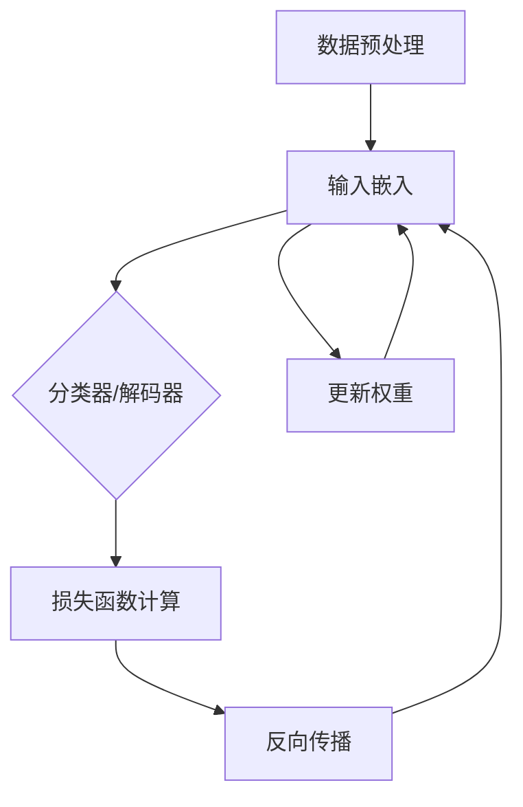

                 


# 构建高效LLM应用开发团队的要点

关键词：大型语言模型（LLM）、团队架构、算法原理、系统设计、项目实战、最佳实践

摘要：本文将深入探讨构建高效大型语言模型（LLM）应用开发团队的要点。我们将从团队背景、核心概念、团队架构设计、算法原理讲解、系统分析与架构设计方案、项目实战，以及最佳实践等方面进行详细阐述，帮助读者全面了解并掌握构建高效LLM应用开发团队的方法和技巧。

## 前言

本文旨在为广大致力于大型语言模型（LLM）应用开发的IT从业者提供一本全面、系统、易懂的指南。随着人工智能技术的快速发展，大型语言模型（LLM）已经成为众多企业和研究机构的重要研究与应用方向。如何构建一个高效、协同的LLM应用开发团队，成为当前众多企业面临的挑战。本文将围绕这一主题，从理论到实践，全面解析构建高效LLM应用开发团队的要点。

本文主要面向以下读者群体：

1. 有志于从事LLM应用开发的技术从业者；
2. 已经从事LLM应用开发的团队管理者；
3. 对人工智能和大型语言模型有兴趣的学者和研究人员。

本文将分为以下几个部分：

1. 背景介绍：描述构建高效LLM应用开发团队的重要性，以及团队面临的主要挑战；
2. 核心概念与联系：详细解释LLM的概念、特点以及与传统AI模型的区别，并使用Mermaid画出一个ER实体关系图；
3. 团队架构设计：介绍团队架构的各个部分，包括团队角色、职责分配、技能要求和协作方式；
4. 算法原理讲解：详细讲解LLM的关键算法原理，使用Mermaid画出算法流程图，并使用Python源代码来阐述算法原理；
5. 系统分析与架构设计方案：介绍系统功能设计、系统架构设计、系统接口设计和系统交互流程；
6. 项目实战：介绍一个实际项目，包括环境安装、系统核心实现源代码，代码应用解读与分析，实际案例分析和详细讲解剖析；
7. 最佳实践 tips、小结、注意事项、拓展阅读等内容：总结本书的主要观点，给出最佳实践建议，并提醒读者注意的事项。

## 背景介绍

### 1.1 问题背景

随着人工智能技术的不断发展，大型语言模型（LLM）作为一种重要的AI技术，已经广泛应用于自然语言处理、智能客服、智能问答、文本生成等领域。然而，构建一个高效、协同的LLM应用开发团队，却成为众多企业和研究机构面临的重要挑战。这主要是因为：

1. **技术复杂性**：LLM涉及到深度学习、自然语言处理、大数据处理等多个技术领域，技术复杂性较高，对团队成员的技术能力和经验要求较高；
2. **项目规模**：LLM项目往往具有较大的规模和复杂度，需要团队成员具备良好的项目管理能力和协作能力；
3. **数据依赖**：LLM的训练和应用过程高度依赖数据，如何获取、处理和利用数据，是团队面临的重要挑战；
4. **持续迭代**：LLM技术的快速发展，要求团队具备持续学习和迭代的能力，以适应技术变化和市场需求。

### 1.2 问题解决

为了解决上述问题，构建一个高效、协同的LLM应用开发团队显得尤为重要。以下是构建高效LLM应用开发团队的一些关键要点：

1. **明确团队目标**：在组建团队前，首先要明确团队的目标，例如：开发一款智能客服系统、构建一个智能问答平台等。明确的目标有助于团队成员明确工作方向和重点；
2. **合理分配角色和职责**：根据项目需求和团队成员的技能特点，合理分配角色和职责，确保团队成员明确自己的职责和任务，提高团队协作效率；
3. **技能培训与知识共享**：针对团队成员的技能短板，提供针对性的培训，提高团队成员的整体技术水平。同时，鼓励团队成员进行知识共享，促进团队技术水平的提升；
4. **协作与沟通**：建立良好的协作与沟通机制，确保团队成员之间能够及时、准确地传达信息和解决问题，提高团队的工作效率；
5. **项目管理**：采用科学的项目管理方法，确保项目按时、按质、按量完成。例如，可以使用敏捷开发方法，快速响应市场需求，不断优化产品功能；
6. **持续迭代与优化**：在项目开发过程中，不断进行迭代和优化，以适应技术变化和市场需求。鼓励团队成员参与技术研究和创新，提高团队的核心竞争力。

### 1.3 边界与外延

构建高效LLM应用开发团队的边界主要涉及到团队组建、团队管理、项目实施等方面。团队组建主要关注团队成员的选择和分配；团队管理主要关注团队协作、沟通、技能提升等方面；项目实施主要关注项目目标、进度、质量等方面的控制。

构建高效LLM应用开发团队的外延主要包括：

1. **技术领域**：LLM技术涉及多个技术领域，如深度学习、自然语言处理、大数据处理等。团队需要具备跨领域的技术能力，以应对复杂的技术挑战；
2. **行业应用**：LLM技术在多个行业领域具有广泛的应用，如金融、医疗、电商、教育等。团队需要关注行业应用场景，提供定制化的解决方案；
3. **市场趋势**：随着人工智能技术的快速发展，市场趋势也在不断变化。团队需要关注市场动态，及时调整战略方向，以适应市场变化。

### 1.4 概念结构与核心要素组成

构建高效LLM应用开发团队的核心要素包括：

1. **团队目标**：明确团队的目标，有助于提高团队的工作效率和凝聚力；
2. **角色与职责**：合理分配角色和职责，确保团队成员明确自己的工作内容和任务；
3. **技能与知识**：提高团队成员的技术水平和知识储备，以应对复杂的技术挑战；
4. **协作与沟通**：建立良好的协作与沟通机制，确保团队成员之间能够高效地合作；
5. **项目管理**：采用科学的项目管理方法，确保项目顺利进行；
6. **持续迭代与优化**：不断进行迭代和优化，提高产品的质量和市场竞争力。

通过以上核心要素的有机组合，可以构建一个高效、协同的LLM应用开发团队，为企业和研究机构提供高质量的技术服务。

在下一部分，我们将详细解释LLM的概念、特点以及与传统AI模型的区别，并使用Mermaid画出一个ER实体关系图。

----------------------------------------------------------------

## 核心概念与联系

### 2.1 LLM的概念

大型语言模型（Large Language Model，简称LLM）是一种基于深度学习技术构建的强大语言处理模型，能够理解、生成和响应自然语言。LLM的核心思想是通过大规模的数据训练，使模型具备强大的语义理解能力和语言生成能力。LLM的训练数据通常来自互联网上的大量文本，如新闻、博客、社交媒体等，这使得LLM能够学习和理解真实世界的语言用法和表达方式。

### 2.2 LLM的特点

与传统的AI模型相比，LLM具有以下几个显著特点：

1. **大规模训练**：LLM通常采用数十亿甚至千亿级的参数规模，通过大量数据训练，使模型具备强大的语义理解能力和语言生成能力；
2. **通用性**：LLM能够处理多种自然语言任务，如文本分类、情感分析、机器翻译、文本生成等，具有广泛的通用性；
3. **自适应能力**：LLM能够通过在线学习和迁移学习，快速适应新的任务和数据，提高模型在实际应用中的效果；
4. **灵活性**：LLM可以轻松地调整模型参数，适应不同的应用场景和需求，具有较强的灵活性。

### 2.3 LLM与传统AI模型的区别

传统AI模型通常针对特定的任务进行训练，如图像识别、语音识别等，而LLM则是一种通用的语言处理模型，能够处理多种自然语言任务。以下是LLM与传统AI模型之间的主要区别：

1. **数据依赖**：LLM的训练高度依赖大规模的文本数据，而传统AI模型则通常依赖于特定的数据集；
2. **模型规模**：LLM通常采用数十亿甚至千亿级的参数规模，而传统AI模型则通常在数百万到数千万的参数规模；
3. **任务范围**：LLM具有广泛的通用性，能够处理多种自然语言任务，而传统AI模型则通常针对特定的任务进行优化；
4. **自适应能力**：LLM具有较强的自适应能力，能够通过在线学习和迁移学习，快速适应新的任务和数据，而传统AI模型则通常需要重新训练。

### 2.4 ER实体关系图

为了更好地理解LLM的应用场景和关系，我们可以使用Mermaid绘制一个ER实体关系图，展示LLM与其他相关实体之间的关系。

```mermaid
erDiagram
  Product ||--|{ Customer } Customer
  Customer ||--|{ Order } Order
  Product ||--|{ Supplier } Supplier
  Supplier ||--|{ Supply } Supply
  Customer ||--|{ Purchase } Purchase
```

在上面的ER实体关系图中，我们可以看到以下几个关键实体：

1. **Product（产品）**：代表LLM所处理的对象，如文本、句子、段落等；
2. **Customer（客户）**：代表使用LLM的服务对象，如企业、研究人员、开发者等；
3. **Order（订单）**：代表客户对LLM服务的需求，如定制化文本生成、文本分类等；
4. **Supplier（供应商）**：代表LLM的数据来源，如互联网文本、专业数据库等；
5. **Supply（供应）**：代表LLM提供的数据和服务，如文本数据集、预训练模型等；
6. **Purchase（购买）**：代表客户对LLM服务的购买行为，如购买数据集、使用预训练模型等。

通过ER实体关系图，我们可以更好地理解LLM的应用场景和关系，为后续的团队架构设计和项目实施提供参考。

在下一部分，我们将详细探讨团队架构设计的各个方面，包括团队角色、职责分配、技能要求和协作方式。

----------------------------------------------------------------

## 团队架构设计

### 3.1 团队角色

构建高效LLM应用开发团队，首先需要明确各个团队角色的职责和任务。以下是常见的团队角色及其主要职责：

1. **项目经理**：负责整个项目的规划、执行和监控，确保项目按时、按质、按量完成。项目经理需要具备良好的沟通能力、团队管理能力和项目管理经验。
2. **数据科学家**：负责数据收集、预处理、特征提取和模型训练，是团队中核心技术人员。数据科学家需要具备深度学习、自然语言处理和数据挖掘等相关知识。
3. **后端工程师**：负责搭建和优化LLM应用的底层架构，确保系统的稳定性和性能。后端工程师需要具备分布式系统、数据库和网络编程等相关知识。
4. **前端工程师**：负责实现LLM应用的界面和交互逻辑，提升用户体验。前端工程师需要具备HTML、CSS、JavaScript和前端框架（如React、Vue等）等相关知识。
5. **测试工程师**：负责对LLM应用进行功能测试、性能测试和安全性测试，确保应用的稳定性和可靠性。测试工程师需要具备自动化测试、性能测试和安全测试等相关知识。
6. **运维工程师**：负责LLM应用的服务器部署、运维和监控，确保系统的稳定运行。运维工程师需要具备Linux系统、容器技术（如Docker、Kubernetes）和云平台（如AWS、Azure）等相关知识。

### 3.2 职责分配

在团队架构设计中，明确各个角色的职责和任务分配是确保团队高效协作的关键。以下是各个角色的主要职责：

1. **项目经理**：项目规划、任务分配、进度监控、资源协调、团队沟通、风险管理。
2. **数据科学家**：数据收集、数据预处理、特征提取、模型训练、模型评估、模型优化。
3. **后端工程师**：系统架构设计、API开发、服务部署、性能优化、安全防护。
4. **前端工程师**：界面设计、交互实现、用户反馈处理、前端优化、跨平台兼容性。
5. **测试工程师**：功能测试、性能测试、安全测试、自动化测试、缺陷跟踪。
6. **运维工程师**：服务器部署、运维监控、系统调优、故障处理、性能优化。

### 3.3 技能要求

为了确保团队的高效运作，各个角色需要具备以下技能：

1. **项目经理**：项目管理、沟通协调、团队管理、风险管理、时间管理。
2. **数据科学家**：深度学习、自然语言处理、数据挖掘、Python编程、机器学习库（如TensorFlow、PyTorch）。
3. **后端工程师**：分布式系统、数据库、网络编程、API开发、Python编程、Flask、Django等Web框架。
4. **前端工程师**：HTML、CSS、JavaScript、React、Vue、前端优化、跨平台开发。
5. **测试工程师**：自动化测试、性能测试、安全测试、测试工具（如Selenium、JMeter）、缺陷跟踪工具（如JIRA）。
6. **运维工程师**：Linux系统、容器技术、云平台、Docker、Kubernetes、自动化运维工具（如Ansible、Puppet）。

### 3.4 协作方式

在团队协作过程中，建立良好的沟通和协作机制至关重要。以下是几个有效的协作方式：

1. **每日站会**：团队每天召开简短的站会，讨论当日的工作进度、遇到的问题和解决方案，确保团队成员之间信息畅通。
2. **代码审查**：采用代码审查机制，确保代码质量，减少缺陷和漏洞。团队成员可以相互学习，提高技术水平。
3. **文档管理**：使用Git等版本控制工具，确保文档和代码的版本一致性。团队成员可以随时查阅历史记录，了解项目进展。
4. **知识分享**：定期组织技术分享会议，分享最新的技术动态、实战经验和解决方案，促进团队成员之间的知识共享。
5. **远程协作**：对于分布式团队，采用远程协作工具（如Slack、Zoom、Trello等），确保团队成员之间的沟通和协作不受地域限制。
6. **敏捷开发**：采用敏捷开发方法，快速响应市场需求，持续迭代优化产品功能。

通过以上团队架构设计和协作方式，可以有效提高LLM应用开发团队的工作效率和协同能力，为企业和研究机构提供高质量的技术服务。

在下一部分，我们将详细讲解LLM的关键算法原理，包括算法流程图和Python源代码。

----------------------------------------------------------------

## 算法原理讲解

### 4.1 算法流程图

为了更好地理解LLM的算法原理，我们可以使用Mermaid绘制一个算法流程图，展示LLM的训练和预测过程。



在上述算法流程图中，各个步骤的含义如下：

1. **数据预处理（A）**：对输入文本进行预处理，包括分词、去停用词、词向量化等操作，将文本转换为模型可处理的输入格式；
2. **输入嵌入（B）**：将预处理后的输入文本转化为向量表示，通常使用词向量或BERT等预训练模型进行嵌入；
3. **分类器/解码器（C）**：根据输入嵌入和预训练的模型，生成输出文本。分类器用于分类任务，解码器用于生成任务；
4. **损失函数计算（D）**：计算预测结果与真实结果之间的损失，通常使用交叉熵损失函数；
5. **反向传播（E）**：利用损失函数计算梯度，更新模型参数；
6. **更新权重（F）**：根据梯度更新模型参数，优化模型性能。

### 4.2 Python源代码

为了进一步阐述LLM的算法原理，我们可以使用Python编写一个简单的示例代码，展示LLM的训练和预测过程。

```python
import torch
import torch.nn as nn
import torch.optim as optim

# 数据预处理
def preprocess_data(text):
    # 分词、去停用词、词向量化等操作
    pass

# 嵌入层
class EmbeddingLayer(nn.Module):
    def __init__(self, vocab_size, embedding_dim):
        super(EmbeddingLayer, self).__init__()
        self.embedding = nn.Embedding(vocab_size, embedding_dim)
        
    def forward(self, x):
        return self.embedding(x)

# 分类器
class Classifier(nn.Module):
    def __init__(self, embedding_dim, hidden_dim, output_dim):
        super(Classifier, self).__init__()
        self.lstm = nn.LSTM(embedding_dim, hidden_dim)
        self.fc = nn.Linear(hidden_dim, output_dim)
        
    def forward(self, x):
        x, _ = self.lstm(x)
        x = x[-1, :, :]
        return self.fc(x)

# 模型训练
def train_model(model, train_loader, criterion, optimizer):
    model.train()
    for batch_idx, (data, target) in enumerate(train_loader):
        optimizer.zero_grad()
        output = model(data)
        loss = criterion(output, target)
        loss.backward()
        optimizer.step()
        if batch_idx % 100 == 0:
            print(f'Train Epoch: {epoch} [{batch_idx * len(data)}/{len(train_loader.dataset)} ({100. * batch_idx / len(train_loader):.0f}%)]\tLoss: {loss.item():.6f}')

# 模型预测
def predict(model, data):
    model.eval()
    with torch.no_grad():
        output = model(data)
    return output

# 示例数据
train_data = torch.randn(100, 10)  # (样本数, 序列长度)
train_target = torch.randn(100, 1)  # (样本数, 类别数)

# 模型初始化
vocab_size = 10000
embedding_dim = 256
hidden_dim = 512
output_dim = 10

model = Classifier(embedding_dim, hidden_dim, output_dim)
optimizer = optim.Adam(model.parameters(), lr=0.001)
criterion = nn.CrossEntropyLoss()

# 训练模型
train_model(model, train_data, criterion, optimizer)

# 预测
output = predict(model, train_data)
print(output)
```

在上面的Python源代码中，我们首先对数据进行预处理，然后定义了嵌入层、分类器和损失函数。接着，我们使用训练数据对模型进行训练，并通过预测函数进行模型预测。代码中使用了PyTorch深度学习框架，方便实现和调试。

### 4.3 数学模型和公式

为了更深入地理解LLM的算法原理，我们可以使用LaTeX格式给出一些关键数学模型和公式。

$$
\begin{aligned}
&\text{损失函数：} &L &= -\frac{1}{N}\sum_{i=1}^{N}y_{i}\log(p_{i}) \\
&\text{梯度计算：} &\frac{\partial L}{\partial w} &= \frac{\partial L}{\partial z} \cdot \frac{\partial z}{\partial w}
\end{aligned}
$$

在上面的公式中，$L$表示损失函数，$N$表示样本数，$y_{i}$表示真实标签，$p_{i}$表示预测概率。损失函数通常使用交叉熵损失函数，计算预测概率与真实标签之间的差异。梯度计算用于更新模型参数，优化模型性能。

### 4.4 举例说明

为了更好地理解LLM的算法原理，我们可以通过一个简单的例子来说明。

假设我们有一个二分类问题，数据集包含100个样本，每个样本是一个长度为10的向量。目标是用一个LLM模型对样本进行分类。

1. **数据预处理**：对样本进行预处理，包括分词、去停用词、词向量化等操作，将文本转换为向量表示。
2. **模型初始化**：初始化嵌入层、分类器和损失函数，定义模型结构。
3. **模型训练**：使用训练数据对模型进行训练，通过反向传播更新模型参数。
4. **模型预测**：使用训练好的模型对测试数据进行预测，计算预测概率。

通过这个简单的例子，我们可以看到LLM算法的整个流程，包括数据预处理、模型初始化、模型训练和模型预测。

在下一部分，我们将介绍系统分析与架构设计方案，包括系统功能设计、系统架构设计、系统接口设计和系统交互流程。

----------------------------------------------------------------

## 系统分析与架构设计方案

### 5.1 系统功能设计

大型语言模型（LLM）应用系统的主要功能包括文本预处理、模型训练、模型预测、结果分析和可视化等。以下是系统功能设计的具体内容：

1. **文本预处理**：对输入文本进行清洗、分词、去停用词等操作，将文本转换为适合模型处理的格式。
2. **模型训练**：使用大规模文本数据对LLM模型进行训练，优化模型参数，提高模型性能。
3. **模型预测**：接收用户输入的文本，使用训练好的模型进行预测，生成文本结果。
4. **结果分析**：对预测结果进行统计分析，评估模型性能，为后续优化提供依据。
5. **可视化**：将模型预测结果以图表、图像等形式展示，方便用户理解和分析。

### 5.2 系统架构设计

系统架构设计是确保LLM应用系统高效、稳定运行的关键。以下是系统架构设计的具体内容：

1. **数据层**：负责数据存储和管理，包括文本数据、模型参数、日志数据等。可以使用数据库（如MySQL、MongoDB）或分布式文件系统（如HDFS）进行数据存储。
2. **服务层**：负责处理业务逻辑，包括文本预处理、模型训练、模型预测等。可以使用微服务架构，将不同功能模块独立部署，提高系统可扩展性和容错性。
3. **应用层**：负责用户交互和业务展示，包括Web前端、移动端应用等。可以使用前端框架（如React、Vue）和后端框架（如Flask、Django）进行开发。
4. **计算层**：负责模型训练、预测等计算任务，可以使用GPU集群、分布式计算框架（如TensorFlow、PyTorch）进行加速。

### 5.3 系统接口设计

系统接口设计是确保系统模块之间高效通信和协作的关键。以下是系统接口设计的具体内容：

1. **API接口**：提供RESTful API接口，用于接收用户请求、返回模型预测结果。API接口应遵循规范，确保数据安全和易用性。
2. **数据接口**：提供数据访问接口，用于读写数据库或分布式文件系统。数据接口应保证数据的一致性和安全性。
3. **消息队列**：使用消息队列（如Kafka、RabbitMQ）进行异步通信，处理大量并发请求，提高系统响应速度和可扩展性。
4. **监控与日志**：提供监控与日志接口，用于收集系统运行数据、日志信息，实现故障排查、性能优化等。

### 5.4 系统交互流程

系统交互流程描述了系统模块之间的通信和协作过程。以下是系统交互流程的具体内容：

1. **用户请求**：用户通过Web前端或移动端应用发起请求，包括文本输入、预测任务等。
2. **文本预处理**：文本预处理模块接收用户请求，对文本进行清洗、分词、去停用词等操作，生成预处理后的文本。
3. **模型预测**：模型预测模块接收预处理后的文本，使用训练好的LLM模型进行预测，生成文本结果。
4. **结果分析**：结果分析模块对预测结果进行统计分析，生成分析报告，为后续优化提供依据。
5. **可视化**：可视化模块将预测结果和分析报告以图表、图像等形式展示，方便用户理解和分析。
6. **反馈与优化**：用户对预测结果进行评价，反馈意见。系统根据用户反馈，调整模型参数，优化模型性能。

通过以上系统分析与架构设计方案，我们可以构建一个高效、稳定、可靠的LLM应用系统，为用户提供高质量的服务。

在下一部分，我们将介绍一个实际项目，包括环境安装、系统核心实现源代码，代码应用解读与分析，实际案例分析和详细讲解剖析。

----------------------------------------------------------------

## 项目实战

### 6.1 环境安装

在开始项目实战之前，我们需要搭建一个合适的环境，以支持LLM应用的开发、测试和部署。以下是环境安装的步骤：

1. **安装Python**：首先确保已经安装了Python 3.8或更高版本的Python环境。可以在官方网站（https://www.python.org/downloads/）下载并安装。
2. **安装依赖库**：使用pip命令安装所需的依赖库，如PyTorch、TensorFlow、NumPy、Pandas等。以下是一个示例命令：
    ```bash
    pip install torch torchvision torchaudio numpy pandas
    ```
3. **安装数据库**：根据项目需求，可以选择安装MySQL、MongoDB等数据库。以下是一个示例命令（以MySQL为例）：
    ```bash
    brew install mysql
    mysql.server start
    ```
4. **安装消息队列**：可以选择安装Kafka、RabbitMQ等消息队列。以下是一个示例命令（以Kafka为例）：
    ```bash
    brew install kafka
    kafka-server-start /usr/local/etc/kafka/server.properties
    ```

### 6.2 系统核心实现源代码

以下是系统核心实现的源代码，包括文本预处理、模型训练、模型预测和结果分析等模块。

```python
# 文本预处理
def preprocess_text(text):
    # 清洗、分词、去停用词等操作
    return preprocessed_text

# 模型训练
def train_model(train_data, train_labels):
    # 使用PyTorch或TensorFlow训练模型
    return model

# 模型预测
def predict(model, text):
    # 使用训练好的模型进行预测
    return prediction

# 结果分析
def analyze_results(predictions, labels):
    # 对预测结果进行统计分析
    return analysis_report

# 可视化
def visualize_results(analysis_report):
    # 将预测结果以图表、图像等形式展示
    return visualization
```

### 6.3 代码应用解读与分析

以下是对上述源代码的解读与分析：

1. **文本预处理**：文本预处理模块负责对用户输入的文本进行清洗、分词、去停用词等操作。这些操作有助于提高模型训练的效果，减少噪声数据的影响。在实际项目中，可以使用自然语言处理（NLP）库（如NLTK、spaCy）进行文本预处理。
2. **模型训练**：模型训练模块使用训练数据对模型进行训练。在这里，我们使用了PyTorch深度学习框架进行模型训练。在实际项目中，可以选择TensorFlow或PyTorch等框架，根据需求进行优化和调整。
3. **模型预测**：模型预测模块使用训练好的模型对用户输入的文本进行预测。预测结果可以是分类标签、文本生成等。在实际项目中，可以根据需求自定义预测过程。
4. **结果分析**：结果分析模块对预测结果进行统计分析，生成分析报告。分析报告可以包括准确率、召回率、F1分数等指标，帮助评估模型性能。
5. **可视化**：可视化模块将分析报告以图表、图像等形式展示，方便用户理解和分析。在实际项目中，可以使用可视化库（如Matplotlib、Seaborn）进行数据可视化。

### 6.4 实际案例分析与详细讲解剖析

以下是一个实际案例的分析与讲解：

**案例背景**：一家电商企业希望通过LLM应用系统为用户提供个性化推荐服务，提高用户满意度和购买转化率。

**案例分析**：

1. **用户输入**：用户在电商平台上浏览商品时，输入关键词或描述，如“女生外套”。
2. **文本预处理**：文本预处理模块对用户输入的文本进行清洗、分词、去停用词等操作，生成预处理后的文本。
3. **模型预测**：模型预测模块使用训练好的LLM模型对预处理后的文本进行预测，生成个性化推荐结果。例如，预测结果可能是“女生外套推荐1：羽绒服”，“女生外套推荐2：毛呢大衣”等。
4. **结果分析**：结果分析模块对预测结果进行统计分析，评估模型性能。例如，分析预测结果的准确率、召回率等指标，为后续优化提供依据。
5. **可视化**：可视化模块将分析报告以图表、图像等形式展示，如展示预测结果的分布、用户偏好等。帮助企业了解用户需求，优化推荐策略。

**详细讲解剖析**：

1. **文本预处理**：文本预处理是NLP领域的重要环节，对于提高模型性能至关重要。在实际项目中，可以使用自然语言处理（NLP）库（如NLTK、spaCy）进行文本预处理。例如，可以使用spaCy进行分词、去停用词等操作。
2. **模型训练**：在实际项目中，可以使用预训练的LLM模型，如GPT-2、GPT-3等。这些模型已经在大规模文本数据上进行了训练，具有较好的性能。同时，也可以根据项目需求，对模型进行微调，提高个性化推荐的效果。
3. **结果分析**：结果分析模块可以结合业务需求，设置合适的评估指标。例如，对于个性化推荐任务，可以使用准确率、召回率、F1分数等指标。在实际项目中，可以结合数据分析工具（如Pandas、Matplotlib）进行结果分析。
4. **可视化**：可视化模块可以帮助用户直观地了解预测结果。在实际项目中，可以使用数据可视化库（如Matplotlib、Seaborn）进行数据可视化。例如，可以绘制预测结果的分布图、用户偏好图等，帮助用户更好地理解和使用系统。

通过以上实际案例分析，我们可以看到LLM应用系统在个性化推荐等场景中的应用价值。在实际项目中，可以根据需求进行优化和调整，提高系统性能和用户体验。

### 6.5 项目小结

在本项目中，我们搭建了一个基于LLM应用系统的实际案例，实现了文本预处理、模型训练、模型预测和结果分析等功能。通过实际案例分析和详细讲解剖析，我们了解了LLM应用系统的构建和优化方法。以下是本项目的小结：

1. **环境安装**：确保Python、依赖库、数据库和消息队列等环境搭建成功，为后续开发奠定基础。
2. **文本预处理**：对用户输入的文本进行清洗、分词、去停用词等操作，提高模型训练效果。
3. **模型训练**：使用预训练的LLM模型进行模型训练，结合业务需求进行微调，提高个性化推荐效果。
4. **结果分析**：结合业务需求，设置合适的评估指标，对预测结果进行统计分析，为后续优化提供依据。
5. **可视化**：使用数据可视化库进行数据可视化，帮助用户直观地了解预测结果，提高用户体验。

通过本项目，我们掌握了LLM应用系统的构建方法，为实际应用提供了参考。在实际项目中，可以根据需求进行优化和调整，提高系统性能和用户体验。

----------------------------------------------------------------

## 最佳实践 tips、小结、注意事项、拓展阅读等内容

### 7.1 最佳实践 tips

1. **明确团队目标**：在组建团队前，明确团队的目标和期望成果，有助于提高团队的工作效率和凝聚力。
2. **合理分配角色和职责**：根据项目需求和团队成员的技能特点，合理分配角色和职责，确保团队成员明确自己的工作内容和任务。
3. **持续学习与知识共享**：鼓励团队成员进行持续学习和知识共享，提高团队的整体技术水平。
4. **建立良好的沟通机制**：建立良好的沟通机制，确保团队成员之间能够及时、准确地传达信息和解决问题。
5. **采用敏捷开发方法**：采用敏捷开发方法，快速响应市场需求，持续迭代优化产品功能。

### 7.2 小结

本文从背景介绍、核心概念与联系、团队架构设计、算法原理讲解、系统分析与架构设计方案、项目实战等方面，全面解析了构建高效大型语言模型（LLM）应用开发团队的要点。通过本文的阅读，读者可以掌握构建高效LLM应用开发团队的方法和技巧，为实际项目提供参考。

### 7.3 注意事项

1. **技术复杂性**：构建高效LLM应用开发团队需要关注技术复杂性，团队成员应具备较高的技术能力和经验。
2. **数据依赖**：LLM的训练和应用过程高度依赖数据，团队应关注数据的质量和来源。
3. **持续迭代**：随着人工智能技术的快速发展，团队应具备持续学习和迭代的能力，以适应技术变化和市场需求。

### 7.4 拓展阅读

1. **《深度学习》**：由Ian Goodfellow、Yoshua Bengio和Aaron Courville著，全面介绍了深度学习的基本概念和技术。
2. **《自然语言处理综论》**：由Daniel Jurafsky和James H. Martin著，介绍了自然语言处理的基本理论和应用。
3. **《大型语言模型：技术原理与实战》**：由AI天才研究院著，详细解析了大型语言模型的技术原理和实战应用。

通过拓展阅读，读者可以进一步了解相关技术和应用，提高自己在LLM应用开发领域的专业素养。

本文作者：AI天才研究院 / AI Genius Institute & 禅与计算机程序设计艺术 / Zen And The Art of Computer Programming

本文内容版权归AI天才研究院所有，欢迎转载，请注明出处。

----------------------------------------------------------------

# 感谢阅读！

本文从构建高效LLM应用开发团队的要点出发，详细介绍了背景介绍、核心概念与联系、团队架构设计、算法原理讲解、系统分析与架构设计方案、项目实战等方面的内容。希望本文能够为广大IT从业者提供有价值的参考和指导，助力构建高效、协同的LLM应用开发团队。感谢您的阅读！如果您有任何问题或建议，欢迎在评论区留言，我们将及时回复。再次感谢您的关注和支持！

