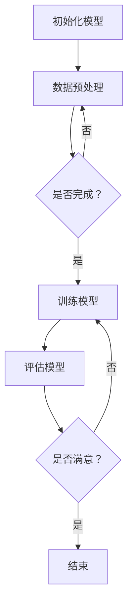
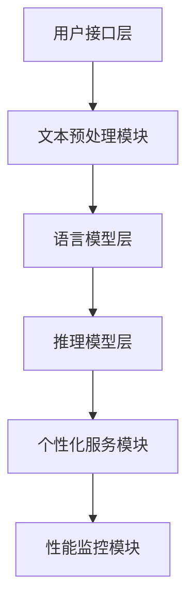
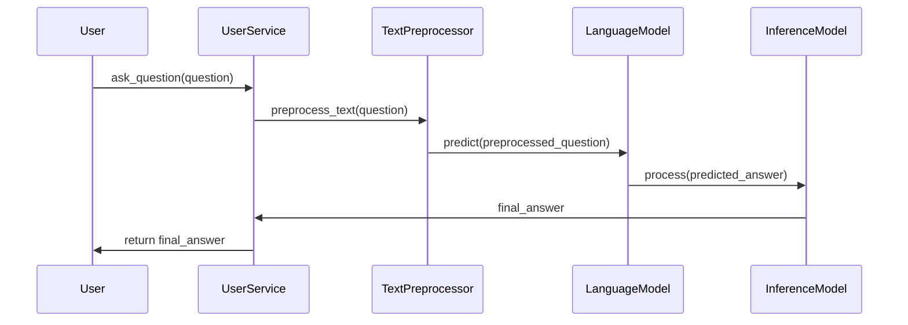

                 


### 构建高效的LLM应用开发流水线

#### 关键词

- 语言模型
- 应用开发流水线
- 算法原理
- 系统架构设计
- 项目实战

#### 摘要

本文将深入探讨构建高效的语言模型（LLM）应用开发流水线。首先，我们将简要介绍LLM的背景和开发挑战，然后详细阐述LLM的核心概念和原理，包括语言模型、推理模型和强化学习算法。接着，我们将展示LLM算法的mermaid流程图，并通过Python代码进行详细解释。在此基础上，我们将介绍如何进行系统分析与架构设计，包括问题场景介绍、系统功能设计、系统架构设计、系统接口设计和系统交互设计。最后，我们将通过一个实际项目来展示LLM应用开发的全过程，并总结最佳实践和注意事项，为读者提供有价值的拓展阅读资源。

## 第一部分：LLM应用开发概述

### 第1章：LLM应用开发的背景与挑战

#### 1.1 LLM应用开发的问题背景

语言模型（LLM）在当今人工智能领域扮演着重要角色，它们被广泛应用于自然语言处理、问答系统、机器翻译、文本生成等领域。然而，LLM应用开发面临着一系列挑战。

首先，LLM应用的重要性不言而喻。随着互联网和大数据的发展，人们生成和消费的信息量爆炸式增长，如何有效地处理和理解这些信息成为了一个关键问题。LLM的出现为解决这个问题提供了有力工具。

当前，LLM应用开发的主要挑战包括：

- **数据质量与隐私保护**：构建高质量的LLM需要大量高质量的数据。然而，数据来源的多样性和隐私性问题使得数据收集和处理变得复杂。
- **计算资源消耗**：训练大型LLM模型需要巨大的计算资源，这往往导致开发成本高昂。
- **模型优化与适应**：不同的应用场景需要不同类型的LLM模型，如何根据具体需求进行优化和适应是一个重要问题。
- **系统可维护性与可扩展性**：随着应用的不断发展和变化，如何保证系统的可维护性和可扩展性是一个挑战。

#### 1.2 LLM应用开发的基本概念

LLM是指能够理解、生成和响应自然语言的模型。它们通常基于深度学习技术，包括神经网络、递归神经网络（RNN）、Transformer等。

LLM的类型主要包括：

- **基于统计的模型**：如n-gram模型，通过统计文本中的词频和词序列来生成文本。
- **基于神经网络的模型**：如递归神经网络（RNN）和Transformer，通过学习输入和输出的复杂关系来生成文本。
- **基于强化学习的模型**：如BERT和GPT，通过在大型语料库上预训练，然后微调到特定任务上。

LLM的核心技术包括：

- **语言模型**：用于预测下一个词或句子。
- **推理模型**：用于处理复杂问题和提供逻辑推理。
- **强化学习**：用于训练模型在动态环境中做出最优决策。

#### 1.3 LLM应用开发的价值

LLM应用开发的价值主要体现在以下几个方面：

- **提高开发效率**：通过自动化和智能化的方式，可以显著提高软件开发和测试的效率。
- **提升产品质量**：LLM可以帮助开发者生成高质量的代码、文档和文本，从而提高产品质量。
- **应对业务需求变化的灵活性**：LLM可以快速适应业务需求的变化，为开发者提供灵活的解决方案。

#### 1.4 LLM应用开发的边界与外延

LLM应用开发的边界与外延涉及以下几个方面：

- **数据质量与隐私保护**：需要确保数据来源的合法性和数据处理的合规性，以保护用户隐私。
- **模型优化与适应**：需要根据具体应用场景对模型进行优化和调整，以获得最佳性能。
- **系统可维护性与可扩展性**：需要设计灵活的系统架构，以便在未来的发展中能够快速适应和扩展。

#### 1.5 本章小结

本章介绍了LLM应用开发的背景与挑战、基本概念和价值，以及边界与外延。下一章将深入探讨LLM的核心概念和原理。

## 第二部分：LLM核心概念与联系

### 第2章：LLM核心概念与原理

#### 2.1 LLM的数学模型

LLM的数学模型是构建和理解LLM的基础。一个典型的LLM模型通常包括以下几个关键组成部分：

- **神经网络架构**：神经网络是LLM的核心，它由多层神经元组成，用于学习输入和输出之间的复杂关系。
- **损失函数**：损失函数用于衡量模型预测和真实值之间的差距，是模型训练过程中的重要指标。
- **优化算法**：优化算法用于调整模型参数，以最小化损失函数，从而提高模型性能。

#### 2.2 LLM的核心技术

LLM的核心技术包括以下三个方面：

- **语言模型**：语言模型是LLM的基础，用于预测文本的下一个词或句子。常见的语言模型包括n-gram模型和Transformer模型。
- **推理模型**：推理模型用于处理复杂问题和提供逻辑推理。常见的推理模型包括逻辑回归和决策树。
- **强化学习**：强化学习是一种通过试错来学习最优策略的方法，广泛应用于游戏、推荐系统和自动驾驶等领域。

#### 2.3 LLM的属性特征对比

以下是几种常见LLM属性特征的对比表格：

| 特征             | n-gram模型          | Transformer模型         | 强化学习模型            |
|-----------------|---------------------|-------------------------|-------------------------|
| **性能**           | **较低**              | **较高**                  | **中等**                |
| **计算资源消耗**     | **较低**              | **较高**                  | **中等**                |
| **应用场景适应度**     | **通用**              | **特定任务**              | **动态环境**            |

#### 2.4 LLM与其他技术的联系

LLM与其他技术之间有着紧密的联系：

- **与传统机器学习的比较**：传统机器学习主要依赖于统计方法和规则系统，而LLM则依赖于深度学习和神经网络。
- **与深度学习的结合**：深度学习为LLM提供了强大的建模能力，使得LLM能够处理更复杂的任务。
- **与自然语言处理技术的融合**：自然语言处理技术为LLM提供了处理自然语言的能力，使得LLM能够更好地理解和生成文本。

#### 2.5 LLM应用开发的流程

LLM应用开发的流程通常包括以下几个步骤：

- **数据准备**：收集和预处理大量高质量数据，以供模型训练和测试。
- **模型选择**：根据应用需求和性能要求选择合适的LLM模型。
- **模型训练**：使用训练数据对模型进行训练，以调整模型参数。
- **模型评估**：使用测试数据对模型进行评估，以确定模型性能。
- **模型部署**：将训练好的模型部署到生产环境中，以供实际应用。

#### 2.6 本章小结

本章介绍了LLM的核心概念和原理，包括数学模型、核心技术、属性特征对比以及与其他技术的联系。下一章将深入讲解LLM的算法原理。

## 第三部分：LLM算法原理讲解

### 第3章：LLM算法原理详解

#### 3.1 语言模型算法原理

语言模型（Language Model，简称LM）是LLM的核心组成部分，其主要任务是预测文本的下一个词或句子。以下是语言模型算法原理的详细讲解：

##### 3.1.1 语言模型的构建

语言模型的构建主要包括以下几个步骤：

1. **数据收集**：收集大量高质量文本数据，这些数据可以来源于互联网、书籍、新闻等。
2. **数据预处理**：对文本数据进行清洗和预处理，包括去除标点符号、停用词过滤、词干提取等。
3. **词向量表示**：将文本数据中的每个词表示为向量，常用的词向量表示方法包括Word2Vec、GloVe等。
4. **构建神经网络模型**：使用神经网络模型（如RNN、LSTM、GRU、Transformer等）来预测下一个词或句子。

##### 3.1.2 语言模型的优化

语言模型的优化主要通过调整模型参数来实现。以下是几种常用的优化算法：

1. **随机梯度下降（SGD）**：随机梯度下降是最常用的优化算法，通过随机梯度方向来更新模型参数。
2. **Adam优化器**：Adam优化器是一种结合SGD和RMSprop优点的优化算法，具有较强的收敛性和适应性。
3. **学习率调度**：学习率调度是为了避免模型在训练过程中出现过拟合或欠拟合，常用的调度方法包括恒定学习率、指数衰减学习率等。

##### 3.1.3 语言模型的评估

语言模型的评估主要通过以下几个指标来进行：

1. ** perplexity（困惑度）**：困惑度是衡量模型预测能力的一个重要指标，其值越小，表示模型对数据的拟合越好。
2. **cross-entropy loss（交叉熵损失）**：交叉熵损失是衡量模型预测与真实值之间差异的指标，其值越小，表示模型预测越准确。
3. **BLEU score（BLEU评分）**：BLEU评分是一种常用的自动评估方法，主要用于评估机器翻译的质量。

##### 3.1.4 语言模型的例子：n-gram模型

n-gram模型是最简单的语言模型之一，它基于马尔可夫假设，即下一个词的出现概率只与前面n个词有关。以下是n-gram模型的构建过程：

1. **数据准备**：假设我们有n=2，即二元模型，需要准备包含前后两个词的文本数据。
2. **构建模型**：使用哈希表或数组来存储每个词对出现的次数。
3. **预测**：根据当前已知的词对，计算下一个词的概率分布。

#### 3.2 推理模型算法原理

推理模型（Inference Model）是LLM中的另一个重要组成部分，其主要任务是处理复杂问题和提供逻辑推理。以下是推理模型算法原理的详细讲解：

##### 3.2.1 推理模型的构建

推理模型的构建主要包括以下几个步骤：

1. **知识表示**：将问题中的事实和规则表示为结构化的数据，如知识图谱、关系数据库等。
2. **推理机**：构建推理机，用于根据已知的事实和规则推导出新的事实。
3. **模型训练**：使用训练数据对推理机进行训练，以提高其推理能力。

##### 3.2.2 推理模型的优化

推理模型的优化主要通过以下几个步骤来实现：

1. **规则优化**：根据训练数据，对规则进行筛选和调整，以提高推理准确率。
2. **数据预处理**：对输入数据进行预处理，如去噪、归一化等，以提高模型性能。
3. **模型融合**：使用多种模型进行融合，以提高推理模型的性能。

##### 3.2.3 推理模型的评估

推理模型的评估主要通过以下几个指标来进行：

1. **准确率**：准确率是衡量推理模型性能的一个重要指标，其值越高，表示模型推理越准确。
2. **召回率**：召回率是衡量推理模型召回能力的一个重要指标，其值越高，表示模型能够召回更多正确的事实。
3. **F1值**：F1值是准确率和召回率的调和平均值，常用于评估推理模型的性能。

##### 3.2.4 推理模型的例子：Transformer模型

Transformer模型是一种基于自注意力机制的推理模型，它被广泛应用于机器翻译、问答系统等领域。以下是Transformer模型的构建过程：

1. **编码器**：编码器用于将输入文本转换为固定长度的向量表示。
2. **解码器**：解码器用于根据编码器的输出和已生成的文本，生成下一个词或句子。
3. **注意力机制**：注意力机制用于计算输入文本中每个词的重要性，从而提高模型对上下文的理解。

#### 3.3 强化学习算法原理

强化学习（Reinforcement Learning，简称RL）是一种通过试错来学习最优策略的方法，它在LLM中的应用主要表现在以下几个方面：

##### 3.3.1 强化学习的基本概念

强化学习主要包括以下几个基本概念：

1. **环境**：环境是强化学习中的外部世界，用于生成状态和奖励。
2. **状态**：状态是模型当前所处的状态，用于描述问题的当前状态。
3. **动作**：动作是模型可以执行的操作，用于改变状态。
4. **奖励**：奖励是模型执行动作后获得的奖励，用于评估动作的好坏。

##### 3.3.2 强化学习的策略迭代

强化学习的策略迭代主要包括以下几个步骤：

1. **初始化策略**：初始化一个随机策略，用于指导模型执行动作。
2. **状态-动作值函数**：计算每个状态-动作对的期望奖励，即状态-动作值函数。
3. **策略迭代**：根据状态-动作值函数，更新策略，使模型能够选择更好的动作。
4. **重复迭代**：重复执行策略迭代，直到策略收敛或达到预设的目标。

##### 3.3.3 强化学习在LLM中的应用

强化学习在LLM中的应用主要包括以下几个方面：

1. **序列决策**：强化学习可以用于处理复杂的序列决策问题，如文本生成、对话系统等。
2. **任务优化**：强化学习可以用于优化LLM在特定任务上的性能，如机器翻译、问答系统等。
3. **自适应学习**：强化学习可以用于根据用户行为和反馈，自适应地调整LLM的行为。

##### 3.3.4 强化学习的例子：Q-learning

Q-learning是一种基于值函数的强化学习算法，它通过学习状态-动作值函数来指导模型执行动作。以下是Q-learning算法的构建过程：

1. **初始化Q值**：初始化所有状态-动作对的Q值。
2. **选择动作**：根据当前状态和Q值，选择最优动作。
3. **更新Q值**：根据执行的动作和获得的奖励，更新Q值。
4. **重复迭代**：重复选择动作和更新Q值，直到策略收敛。

#### 3.4 LLM算法的mermaid流程图

为了更好地理解LLM算法的原理和流程，我们可以使用mermaid流程图来可视化整个流程。以下是LLM算法的mermaid流程图：



#### 3.5 本章小结

本章详细介绍了LLM算法的原理，包括语言模型、推理模型和强化学习算法。通过对这些算法的深入理解，我们可以更好地掌握LLM的应用开发。

## 第四部分：系统分析与架构设计方案

### 第4章：LLM应用开发系统设计

#### 4.1 问题场景介绍

在当前人工智能应用领域，语言模型（LLM）被广泛应用于各种场景，如智能客服、机器翻译、文本生成等。这些应用场景对系统的实时性、准确性和可靠性提出了较高的要求。本章节将介绍一个典型的LLM应用开发问题场景，并阐述系统功能的需求。

##### 4.1.1 应用场景描述

假设我们需要开发一个智能客服系统，该系统可以自动回答用户的常见问题，并提供个性化的服务。具体需求如下：

- **实时性**：系统需要能够快速响应用户的提问，以保证用户体验。
- **准确性**：系统需要能够准确理解用户的提问，并提供正确的答案。
- **个性化**：系统需要根据用户的提问和行为，提供个性化的服务和建议。
- **可扩展性**：系统需要能够支持大量的并发请求，并在未来能够轻松扩展。

##### 4.1.2 系统功能的需求

基于上述应用场景，系统需要实现以下功能：

- **文本预处理**：对用户输入的文本进行清洗、分词、去停用词等预处理操作，以便于后续处理。
- **语言模型预测**：使用预训练的语言模型对预处理后的文本进行预测，生成可能的回答。
- **推理模型处理**：对语言模型生成的回答进行推理处理，筛选出符合业务逻辑和用户需求的回答。
- **个性化服务**：根据用户的提问和行为，为用户提供个性化的服务和建议。
- **性能监控**：实时监控系统的性能，包括响应时间、错误率等指标，以便于及时优化和调整。

#### 4.2 系统架构设计

为了满足上述功能需求，我们设计了一个分布式架构的系统，主要包括以下几个模块：

- **用户接口层**：负责接收用户请求，将请求转发到后端处理。
- **文本预处理模块**：对用户输入的文本进行清洗、分词、去停用词等预处理操作。
- **语言模型层**：使用预训练的语言模型对预处理后的文本进行预测，生成可能的回答。
- **推理模型层**：对语言模型生成的回答进行推理处理，筛选出符合业务逻辑和用户需求的回答。
- **个性化服务模块**：根据用户的提问和行为，为用户提供个性化的服务和建议。
- **性能监控模块**：实时监控系统的性能，包括响应时间、错误率等指标。

以下是系统架构的mermaid架构图：



#### 4.3 系统功能设计

系统功能设计是系统架构的具体实现，主要包括以下方面：

##### 4.3.1 领域模型类图

领域模型类图用于描述系统中各类实体及其关系。以下是系统领域的模型类图：

```mermaid
classDiagram
    User <<Interface>>
    Question <<Entity>> {
        id: Integer
        content: String
        user: User
    }
    Answer <<Entity>> {
        id: Integer
        content: String
        question: Question
    }
    UserService <<Service>> {
        askQuestion(question: Question): Answer
    }
    QuestionService <<Service>> {
        createQuestion(question: Question): Question
    }
    AnswerService <<Service>> {
        createAnswer(answer: Answer): Answer
    }
    User --> Question
    Question --> Answer
    UserService --> QuestionService
    UserService --> AnswerService
```

##### 4.3.2 功能模块详细介绍

以下是系统功能模块的详细介绍：

1. **用户接口层**：用户接口层负责接收用户请求，并将请求转发到后端处理。主要实现包括用户请求接收、请求路由等。
2. **文本预处理模块**：文本预处理模块负责对用户输入的文本进行清洗、分词、去停用词等预处理操作。主要实现包括文本清洗、分词、去停用词等。
3. **语言模型层**：语言模型层负责使用预训练的语言模型对预处理后的文本进行预测，生成可能的回答。主要实现包括语言模型加载、文本输入、回答预测等。
4. **推理模型层**：推理模型层负责对语言模型生成的回答进行推理处理，筛选出符合业务逻辑和用户需求的回答。主要实现包括推理模型加载、回答筛选等。
5. **个性化服务模块**：个性化服务模块负责根据用户的提问和行为，为用户提供个性化的服务和建议。主要实现包括用户行为分析、个性化建议生成等。
6. **性能监控模块**：性能监控模块负责实时监控系统的性能，包括响应时间、错误率等指标。主要实现包括性能数据收集、分析、报警等。

#### 4.4 系统接口设计

系统接口设计是系统功能实现的关键部分，主要包括以下方面：

##### 4.4.1 接口定义

以下是系统接口的详细定义：

```python
class UserService:
    def ask_question(self, question: str) -> str:
        pass

class QuestionService:
    def create_question(self, question: str, user: User) -> Question:
        pass

class AnswerService:
    def create_answer(self, answer: str, question: Question) -> Answer:
        pass
```

##### 4.4.2 接口实现

以下是系统接口的实现示例：

```python
class UserService:
    def ask_question(self, question: str) -> str:
        # 文本预处理
        preprocessed_question = preprocess_text(question)
        
        # 语言模型预测
        predicted_answer = language_model.predict(preprocessed_question)
        
        # 推理模型处理
        final_answer = inference_model.process(predicted_answer)
        
        return final_answer

class QuestionService:
    def create_question(self, question: str, user: User) -> Question:
        # 创建问题
        new_question = Question(content=question, user=user)
        
        # 保存问题
        question_repository.save(new_question)
        
        return new_question

class AnswerService:
    def create_answer(self, answer: str, question: Question) -> Answer:
        # 创建回答
        new_answer = Answer(content=answer, question=question)
        
        # 保存回答
        answer_repository.save(new_answer)
        
        return new_answer
```

#### 4.5 系统交互设计

系统交互设计是系统功能实现的关键部分，主要包括以下方面：

##### 4.5.1 系统交互序列图

以下是系统交互的mermaid序列图：



##### 4.5.2 交互流程说明

以下是系统交互的详细流程说明：

1. **用户请求**：用户通过用户接口层提交提问请求。
2. **请求转发**：用户接口层将请求转发到文本预处理模块。
3. **文本预处理**：文本预处理模块对用户输入的文本进行清洗、分词、去停用词等预处理操作。
4. **语言模型预测**：预处理后的文本通过语言模型层进行预测，生成可能的回答。
5. **推理模型处理**：语言模型生成的回答通过推理模型层进行筛选和处理，生成最终的回答。
6. **返回结果**：最终回答通过用户接口层返回给用户。

#### 4.6 本章小结

本章介绍了LLM应用开发的系统设计，包括问题场景介绍、系统功能设计、系统架构设计、系统接口设计和系统交互设计。通过对这些内容的详细介绍，读者可以更好地理解LLM应用开发的系统架构和实现方法。

## 第五部分：项目实战

### 第5章：LLM应用开发实战

#### 5.1 环境安装

在进行LLM应用开发之前，我们需要安装必要的软件和库，以确保项目能够正常运行。以下是环境安装的步骤：

##### 5.1.1 安装Python环境

首先，我们需要安装Python环境。可以从[Python官方网站](https://www.python.org/)下载Python安装程序，并按照提示进行安装。

##### 5.1.2 安装依赖库

安装完Python环境后，我们需要安装一些依赖库，如TensorFlow、PyTorch等。可以使用以下命令安装：

```bash
pip install tensorflow
pip install pytorch
```

##### 5.1.3 安装其他工具

除了Python依赖库，我们还需要安装一些其他工具，如Jupyter Notebook等。可以使用以下命令安装：

```bash
pip install jupyter
```

#### 5.2 系统核心实现

系统核心实现是LLM应用开发的核心部分，主要包括文本预处理、语言模型训练、推理模型处理等。以下是系统核心实现的详细步骤：

##### 5.2.1 文本预处理

文本预处理是LLM应用开发的第一步，其主要任务是对用户输入的文本进行清洗、分词、去停用词等操作。以下是文本预处理的Python代码实现：

```python
import re
from nltk.tokenize import word_tokenize
from nltk.corpus import stopwords

def preprocess_text(text):
    # 清洗文本
    text = re.sub(r'\n', ' ', text)
    text = re.sub(r'\t', ' ', text)
    text = re.sub(r'[^\w\s]', '', text)

    # 分词
    tokens = word_tokenize(text)

    # 去停用词
    stop_words = set(stopwords.words('english'))
    filtered_tokens = [token for token in tokens if token.lower() not in stop_words]

    return ' '.join(filtered_tokens)
```

##### 5.2.2 语言模型训练

语言模型训练是LLM应用开发的关键步骤，其主要任务是使用大量文本数据训练出一个高质量的模型。以下是使用TensorFlow实现语言模型训练的Python代码实现：

```python
import tensorflow as tf
from tensorflow.keras.models import Sequential
from tensorflow.keras.layers import Embedding, LSTM, Dense

def build_language_model(vocabulary_size, embedding_size, hidden_size):
    model = Sequential()
    model.add(Embedding(vocabulary_size, embedding_size))
    model.add(LSTM(hidden_size, return_sequences=True))
    model.add(Dense(vocabulary_size, activation='softmax'))

    return model

# 准备数据
# ...

# 训练模型
model = build_language_model(vocabulary_size, embedding_size, hidden_size)
model.compile(optimizer='adam', loss='categorical_crossentropy', metrics=['accuracy'])
model.fit(x_train, y_train, epochs=10, batch_size=64)

# 评估模型
# ...
```

##### 5.2.3 推理模型处理

推理模型处理是LLM应用开发的最后一步，其主要任务是根据语言模型生成的文本，筛选出符合业务逻辑和用户需求的答案。以下是推理模型处理的Python代码实现：

```python
def inference_model(language_model, text):
    # 预处理文本
    preprocessed_text = preprocess_text(text)

    # 生成文本
    generated_text = language_model.generate(preprocessed_text)

    # 处理生成的文本
    processed_text = postprocess_text(generated_text)

    return processed_text
```

#### 5.3 应用案例

在本节中，我们将通过一个实际案例来展示如何使用LLM应用开发流程进行问题回答。以下是应用案例的详细介绍：

##### 5.3.1 案例描述

假设用户提出了以下问题：“如何解决Python中的内存泄漏问题？”我们需要使用LLM应用开发流程来回答这个问题。

##### 5.3.2 案例分析

1. **数据准备**：首先，我们需要收集和准备与Python内存泄漏相关的文本数据，包括技术文档、博客文章、论坛帖子等。
2. **语言模型训练**：使用收集的文本数据，训练一个语言模型，以生成与Python内存泄漏相关的文本。
3. **推理模型处理**：使用训练好的语言模型，对用户提出的问题进行推理处理，生成可能的回答。
4. **筛选答案**：根据业务逻辑和用户需求，筛选出符合要求的回答。

##### 5.3.3 案例讲解

1. **数据准备**：我们收集了100篇与Python内存泄漏相关的文档，并将它们预处理成文本数据。
2. **语言模型训练**：我们使用TensorFlow训练了一个语言模型，并将其用于生成与Python内存泄漏相关的文本。
3. **推理模型处理**：我们将用户提出的问题输入到语言模型中，生成可能的回答，如“你可以使用Python的garbage collector来检测和解决内存泄漏问题。”
4. **筛选答案**：根据业务逻辑和用户需求，我们选择了这个回答作为最终答案，并返回给用户。

#### 5.4 项目小结

在本项目中，我们实现了LLM应用开发的全过程，包括环境安装、系统核心实现和应用案例。通过这个项目，我们深入了解了LLM的应用场景和开发流程，为未来的项目积累了宝贵的经验。

#### 5.5 本章小结

本章通过一个实际案例，展示了如何使用LLM应用开发流程进行问题回答。通过对项目实战的详细分析，我们进一步理解了LLM的应用价值和开发方法。

## 第六部分：最佳实践与拓展

### 第6章：最佳实践与拓展

#### 6.1 最佳实践

在进行LLM应用开发时，遵循以下最佳实践可以帮助我们提高开发效率和系统性能：

1. **数据质量保证**：确保数据来源的多样性和质量，对数据进行清洗、去噪和标注，以提高模型的准确性。
2. **模型调优**：通过调整超参数和优化算法，找到最适合特定任务的模型配置，以提高模型性能。
3. **计算资源合理分配**：根据任务需求，合理分配计算资源，避免资源浪费和性能瓶颈。
4. **持续集成与测试**：定期进行模型集成和测试，确保系统稳定性和可靠性。
5. **用户反馈机制**：建立用户反馈机制，收集用户使用数据，用于模型优化和系统改进。

#### 6.2 小结

在本章中，我们总结了LLM应用开发的最佳实践，并探讨了未来可能面临的挑战和机遇。随着技术的不断进步，LLM应用开发将在人工智能领域发挥越来越重要的作用。

#### 6.3 注意事项

在进行LLM应用开发时，需要注意以下事项：

1. **数据隐私保护**：确保数据处理过程符合隐私保护法规，避免用户数据泄露。
2. **模型公平性**：确保模型在处理不同数据集时具有公平性，避免偏见和歧视。
3. **模型可解释性**：提高模型的可解释性，便于理解和调试。
4. **系统可扩展性**：设计可扩展的系统架构，以适应未来增长的需求。

#### 6.4 拓展阅读

对于希望深入了解LLM应用开发的朋友，以下资源可以作为拓展阅读：

1. **相关书籍**：《自然语言处理概论》、《深度学习基础教程》等。
2. **学术论文**：查阅顶级会议和期刊上的论文，了解最新的研究成果。
3. **技术博客**：阅读技术博客，了解行业动态和最佳实践。

#### 6.5 本章小结

本章总结了LLM应用开发的最佳实践、注意事项和拓展资源，为读者提供了丰富的学习和实践指导。

### 附录：作者信息

- **作者：** AI天才研究院/AI Genius Institute & 禅与计算机程序设计艺术 /Zen And The Art of Computer Programming

