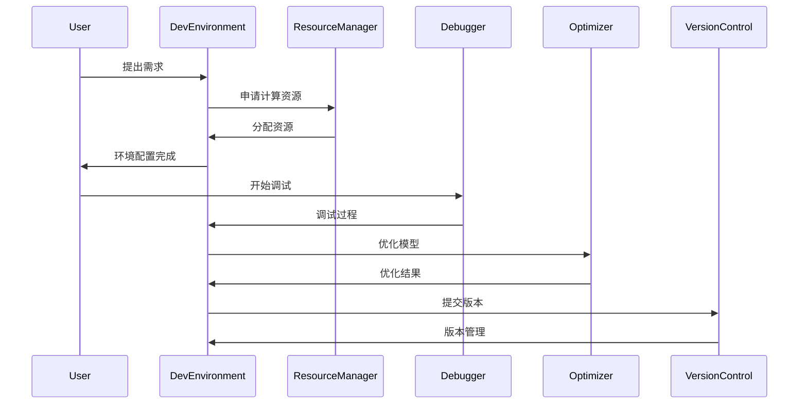
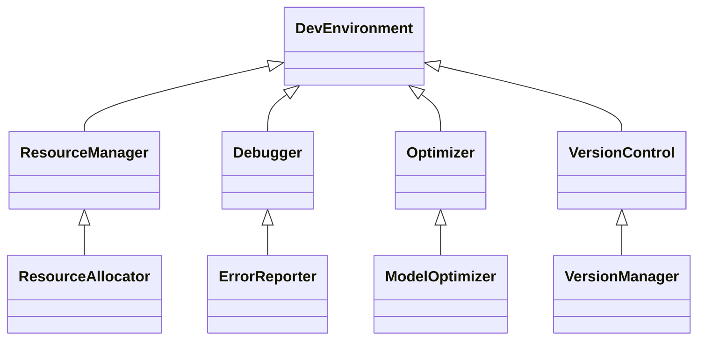
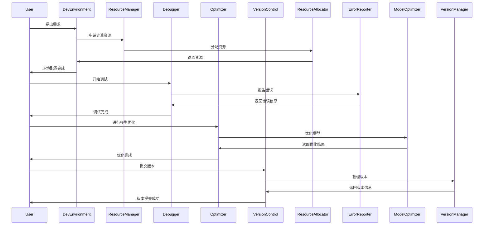

                 


##  第1章: LLM应用开发环境概述

### 1.1.1 问题背景

随着深度学习和自然语言处理（NLP）技术的迅猛发展，大型语言模型（LLM，Large Language Model）在各个领域展现出了巨大的潜力和应用价值。LLM能够理解和生成复杂的自然语言文本，广泛应用于文本生成、智能客服、内容审核、机器翻译、问答系统等领域。

然而，LLM的开发和应用也面临着一系列挑战。首先，LLM的训练和推理过程需要大量的计算资源和时间，这使得构建高效的开发环境成为了一个迫切的需求。其次，LLM的复杂性和不确定性使得开发者在调试和优化模型时面临困难，如何提高开发效率和代码可读性也成为一个关键问题。此外，不同项目之间的开发环境和工具的兼容性问题也需要得到解决。

构建高效的LLM应用开发环境，不仅有助于提高开发效率，降低成本，还能够确保模型的稳定性和可靠性。因此，深入研究LLM应用开发环境的设计与优化，对于推动NLP技术的发展和应用具有重要意义。

### 1.1.2 问题描述

在构建高效的LLM应用开发环境时，我们面临以下主要问题：

1. **计算资源不足**：LLM的训练和推理过程对计算资源有极高的要求，包括GPU、CPU和存储等。如何合理分配和调度这些资源，以满足开发和生产需求，是一个亟待解决的问题。

2. **开发环境配置复杂**：不同项目可能需要不同的开发环境和工具链，这增加了配置和管理开发的复杂度。如何简化配置过程，提高环境的通用性和可复用性，是提升开发效率的关键。

3. **调试和优化困难**：LLM的复杂性和不确定性使得模型调试和优化变得困难。如何提供高效的调试工具和优化策略，帮助开发者快速定位和解决问题，是提高开发效率的重要途径。

4. **版本管理和协作**：在团队协作开发中，如何管理代码和模型的版本，确保团队之间的协同工作和代码的一致性，也是一个需要解决的问题。

5. **兼容性和扩展性**：不同项目和场景下，开发环境需要具备良好的兼容性和扩展性，以适应不断变化的需求。

### 1.1.3 问题解决

为了解决上述问题，我们需要从以下几个方面着手构建高效的LLM应用开发环境：

1. **资源优化**：合理配置和调度计算资源，使用高效的数据传输和计算优化技术，降低资源消耗。

2. **环境配置自动化**：采用容器化和虚拟化技术，如Docker和Kubernetes，实现开发环境的自动化配置和管理，提高环境的通用性和可复用性。

3. **调试和优化工具**：提供高效的调试工具和优化策略，如动态分析工具、模型压缩工具和超参数调优工具，帮助开发者快速解决问题。

4. **版本控制和协作平台**：使用版本控制系统（如Git）和协作平台（如GitHub或GitLab），管理代码和模型的版本，确保团队协作的一致性和效率。

5. **兼容性和扩展性设计**：设计灵活的架构和接口，确保开发环境能够兼容不同项目和场景的需求，并提供扩展接口，方便后续功能扩展。

### 1.1.4 边界与外延

在构建高效的LLM应用开发环境时，我们还需要考虑以下边界和外延问题：

1. **开发环境与生产环境的差异**：开发环境需要模拟生产环境，但并不完全等同于生产环境。在开发环境中，我们可以使用模拟数据、简化模型或简化部分流程，以便快速开发和测试。而在生产环境中，需要使用真实数据、全流程和完整模型，确保系统的稳定性和性能。

2. **开发环境与测试环境的融合**：开发环境和测试环境之间需要有良好的融合，确保开发过程中的测试能够真实反映模型的效果和性能。通过集成测试、持续集成和持续部署（CI/CD）流程，实现开发与测试的无缝对接。

3. **边界条件**：在构建开发环境时，需要考虑各种边界条件，如数据质量、数据量、网络延迟等，确保环境能够在不同条件下稳定运行。

4. **外延**：开发环境不仅包括硬件和软件配置，还包括工具、文档、流程等。在构建开发环境时，我们需要综合考虑这些外部因素，确保环境的整体性和高效性。

### 1.1.5 核心概念与要素组成

在构建高效的LLM应用开发环境时，我们需要关注以下几个核心概念和要素：

1. **LLM**：大型语言模型，是开发环境的核心组成部分。LLM具有大规模预训练、高级语义理解和生成能力等特点，能够处理复杂的自然语言任务。

2. **计算资源**：包括GPU、CPU和存储等硬件资源，是LLM训练和推理的基础。合理配置和调度这些资源，是构建高效开发环境的关键。

3. **开发工具**：包括文本编辑器、版本控制系统、调试工具、优化工具等，是开发者进行模型开发、调试和优化的必备工具。

4. **开发环境配置**：使用容器化或虚拟化技术，实现开发环境的自动化配置和管理，提高环境的通用性和可复用性。

5. **数据管理**：包括数据采集、清洗、存储和管理等，为模型训练和推理提供高质量的数据支持。

6. **版本控制和协作平台**：使用版本控制系统和协作平台，管理代码和模型的版本，确保团队协作的一致性和效率。

7. **测试和评估**：通过集成测试、性能评估和实际案例测试，验证开发环境的稳定性和性能，确保模型的可靠性和高效性。

通过以上核心概念和要素的有机组合，我们可以构建一个高效、稳定、可扩展的LLM应用开发环境，为NLP技术的发展和应用提供有力支持。

---

##  第2章: LLM核心概念与特性

### 2.1.1 LLM定义与分类

#### LLM基本定义

大型语言模型（LLM，Large Language Model）是一种基于深度学习技术的自然语言处理模型，通过大规模的预训练和特定任务的微调，实现对自然语言文本的语义理解和生成。LLM通常采用自注意力机制（如Transformer架构）进行训练，能够处理复杂的自然语言任务，如文本分类、问答系统、机器翻译、文本生成等。

#### LLM分类与特点

根据训练规模和功能特点，LLM可以分为以下几种类型：

1. **预训练语言模型**：通过在大规模语料库上进行预训练，获取丰富的语言知识和特征，如BERT、GPT、T5等。这类模型具有强大的语义理解和生成能力，但通常需要大量的计算资源和时间进行训练。

2. **特定任务语言模型**：在预训练语言模型的基础上，针对特定任务进行微调，如问答系统、机器翻译、文本生成等。这类模型能够针对特定任务进行优化，提高任务性能。

3. **多语言语言模型**：支持多种语言文本的语义理解和生成，如MAML、mBERT、XLM等。这类模型能够处理跨语言的文本任务，具有广泛的应用前景。

4. **低资源语言模型**：在资源有限的情况下，通过轻量级模型或迁移学习等方法，实现有效的自然语言处理任务。如MobileNet、TinyBERT等。

### 2.1.2 LLM属性特征对比表格

| 特性        | 对比项                   | 说明                                                         |
| ----------- | ------------------------ | ------------------------------------------------------------ |
| 预训练规模  | 百亿至千亿级别           | 大规模预训练是LLM的核心特点之一                             |
| 语言理解能力 | 高级语义理解与生成能力   | LLM能处理复杂语言任务，如问答、文本生成等                   |
| 可解释性    | 较低                     | 由于模型参数复杂，解释性较传统方法差                        |
| 需求资源    | 高计算资源需求           | 大规模训练与推理需要高性能计算资源和存储能力                |

### 2.1.3 LLM应用场景与优势

LLM在多个领域展现出显著的优势和应用价值：

| 场景          | 优势                     |
| ------------- | ------------------------ |
| 自然语言处理  | 提高文本生成与理解能力   |
| 聊天机器人    | 提高交互自然性和用户满意度 |
| 智能客服      | 提高服务效率和质量       |

### 2.1.4 LLM与NLP其他模型对比

| 模型          | 特点                     | 对比项                     |
| ------------- | ------------------------ | ------------------------ |
| RNN           | 序列处理                 | 状态依赖，训练复杂         |
| LSTM          | 长期记忆，缓解梯度消失   | 计算量大，参数多         |
| Transformer   | 自注意力机制，并行训练   | 参数庞大，训练时间长     |
| BERT          | 双向编码，上下文理解     | 预训练资源需求高         |

---

### 2.1.5 LLM与NLP其他模型对比

在自然语言处理领域，大型语言模型（LLM）与其他常见模型如循环神经网络（RNN）、长短期记忆网络（LSTM）和变换器（Transformer）有显著的区别。以下是对这些模型的对比：

#### RNN（循环神经网络）

RNN是一种能够处理序列数据的神经网络，其特点是能够保持长距离依赖关系。RNN在处理自然语言任务时表现出较好的效果，尤其是在早期的NLP研究中。然而，RNN存在以下几个问题：

1. **梯度消失和梯度爆炸**：在训练过程中，梯度可能会在反向传播过程中逐渐消失或爆炸，导致训练不稳定。
2. **状态依赖性**：RNN的输出依赖于其之前的输出，这限制了并行计算的能力。

#### LSTM（长短期记忆网络）

LSTM是RNN的一种改进，通过引入记忆单元和门控机制，解决了梯度消失问题，使得模型能够在长时间序列中保持稳定。LSTM在处理自然语言任务时表现出较好的效果，适用于处理复杂的语言模型。然而，LSTM也存在以下缺点：

1. **计算复杂度高**：LSTM的门控机制导致计算复杂度较高，训练时间较长。
2. **参数较多**：LSTM的门控机制增加了模型的参数数量，导致模型更加复杂。

#### Transformer（变换器）

Transformer是自然语言处理领域的一种革命性模型，其核心思想是自注意力机制。与RNN和LSTM相比，Transformer具有以下优点：

1. **并行计算**：自注意力机制使得Transformer能够并行处理输入序列，提高了计算效率。
2. **较少的梯度消失**：由于Transformer不需要像RNN和LSTM那样进行梯度回传，因此较少出现梯度消失问题。
3. **强大的上下文理解**：通过自注意力机制，Transformer能够捕捉输入序列中任意两个位置之间的依赖关系。

然而，Transformer也存在一些缺点：

1. **参数庞大**：由于自注意力机制，Transformer的参数数量远大于RNN和LSTM，导致模型训练和推理时间较长。
2. **内存需求大**：自注意力机制的计算需要大量的内存资源，对硬件要求较高。

#### BERT（双向编码器表示）

BERT是一种基于Transformer的预训练语言模型，其核心思想是在大规模语料库上进行预训练，然后通过微调适应特定任务。BERT具有以下特点：

1. **双向编码**：BERT能够同时考虑输入序列的前后关系，提高了语义理解能力。
2. **预训练和微调**：BERT通过预训练获得丰富的语言知识，然后在特定任务上进行微调，提高了模型在任务上的性能。
3. **大规模预训练**：BERT采用了大规模语料库进行预训练，具有强大的语义理解能力。

#### 对比

- **训练复杂度**：LSTM的计算复杂度较高，训练时间较长；RNN和Transformer的并行计算能力更强，训练时间相对较短。
- **上下文理解**：Transformer和BERT能够同时考虑输入序列的前后关系，具有强大的上下文理解能力；RNN和LSTM在处理长时间依赖关系时表现较差。
- **模型参数**：Transformer和BERT的参数数量较大，内存需求较高；RNN和LSTM的参数数量相对较少。
- **可解释性**：Transformer和BERT由于参数复杂，可解释性较差；RNN和LSTM的可解释性较好。

总的来说，LLM（尤其是Transformer和BERT）在自然语言处理领域表现出显著的优势，但其高计算资源需求和对硬件的高要求也限制了其广泛应用。选择适合的模型需要综合考虑任务需求、计算资源和模型可解释性等因素。

---

### 2.1.5 LLM与NLP其他模型对比

在自然语言处理（NLP）领域中，除了LLM，还有许多其他模型被广泛应用。以下是对LLM与RNN、LSTM、Transformer和BERT的详细对比：

#### RNN（循环神经网络）

**特点**：
- RNN是较早用于处理序列数据的神经网络架构，特别适用于语言模型。
- 它能够捕获序列中的长期依赖关系。

**优点**：
- 简单易实现。
- 能够处理序列数据。

**缺点**：
- 梯度消失和梯度爆炸问题，导致训练不稳定。
- 无法并行计算，因为每个时间步依赖前一个时间步。

#### LSTM（长短期记忆网络）

**特点**：
- LSTM是一种改进的RNN，通过引入记忆单元和门控机制，解决了梯度消失问题。

**优点**：
- 能够在长时间序列中保持稳定。
- 解决了梯度消失问题。

**缺点**：
- 计算复杂度高，导致训练时间较长。
- 参数较多，模型较为复杂。

#### Transformer（变换器）

**特点**：
- Transformer引入了自注意力机制，能够并行处理输入序列。

**优点**：
- 能够并行计算，提高了训练速度。
- 较少出现梯度消失问题。

**缺点**：
- 参数庞大，导致模型训练和推理时间较长。
- 内存需求高，对硬件要求较高。

#### BERT（双向编码器表示）

**特点**：
- BERT是一种基于Transformer的预训练语言模型，通过预训练和微调应用于各种任务。

**优点**：
- 双向编码，能够同时考虑输入序列的前后关系。
- 预训练和微调方法，提高了模型在任务上的性能。

**缺点**：
- 参数庞大，预训练资源需求高。
- 由于参数复杂，可解释性较差。

#### LLM（大型语言模型）

**特点**：
- LLM通常指像GPT、BERT这样的大规模预训练模型，具有自注意力机制。

**优点**：
- 预训练规模大，语义理解能力强。
- 能够处理复杂的自然语言任务。

**缺点**：
- 计算资源需求高，训练和推理时间较长。
- 参数复杂，可解释性较差。

#### 对比总结

- **训练复杂度**：
  - LSTM和RNN：计算复杂度相对较低，但训练时间较长。
  - Transformer和BERT：计算复杂度较高，但训练时间相对较短。
  - LLM：计算复杂度和训练时间均较高。

- **上下文理解**：
  - Transformer和BERT：能够同时考虑输入序列的前后关系，上下文理解能力强。
  - RNN和LSTM：在处理长时间依赖关系时表现较差。

- **模型参数**：
  - RNN和LSTM：参数数量相对较少。
  - Transformer和BERT：参数数量庞大。
  - LLM：参数复杂度极高。

- **可解释性**：
  - LLM：由于参数复杂，可解释性较差。
  - RNN和LSTM：可解释性较好。

选择合适的模型取决于具体任务的需求、计算资源以及可解释性的要求。对于需要高语义理解能力且计算资源充足的场景，LLM是首选。对于对计算资源有要求或对模型可解释性有较高需求的场景，可以考虑使用RNN或LSTM。

---

## 第3章: LLM算法原理讲解

### 3.1 自注意力机制

自注意力机制是Transformer模型的核心组成部分，其基本思想是在每个时间步，模型能够自适应地关注输入序列中的其他位置，从而更好地捕捉序列中的依赖关系。自注意力机制的计算过程如下：

给定一个输入序列\[X = (x_1, x_2, ..., x_n)\]，其中每个元素\(x_i\)都是一个向量。自注意力机制通过三个线性变换（也称为查询、键和值变换）来计算注意力权重：

1. **查询（Query）**：将输入序列映射为查询向量\[Q = (q_1, q_2, ..., q_n)\]，其中每个\(q_i\)都是一个向量。
2. **键（Key）**：将输入序列映射为键向量\[K = (k_1, k_2, ..., k_n)\]，其中每个\(k_i\)都是一个向量。
3. **值（Value）**：将输入序列映射为值向量\[V = (v_1, v_2, ..., v_n)\]，其中每个\(v_i\)都是一个向量。

自注意力函数定义为：

\[ Atten(Q, K, V) = \text{softmax}\left(\frac{QK^T}{\sqrt{d_k}}\right)V \]

其中，\(d_k\)是键向量的维度，\(\text{softmax}\)函数用于计算每个键与查询之间的注意力权重。最后，将注意力权重与值向量相乘，得到加权后的输出：

\[ \text{context} = \text{softmax}\left(\frac{QK^T}{\sqrt{d_k}}\right)V \]

### 3.2 Transformer模型

Transformer模型基于自注意力机制，对输入序列进行编码和解码。编码器（Encoder）和解码器（Decoder）分别由多个自注意力层和全连接层（Feed-Forward Layer）组成。

#### 编码器（Encoder）

编码器负责将输入序列编码为序列的表示，其基本结构如下：

1. **输入嵌入层**：将输入单词映射为向量。
2. **多个自注意力层**：通过自注意力机制，模型能够自适应地关注输入序列中的其他位置。
3. **残差连接和层归一化**：在每个自注意力层之后，加入残差连接和层归一化，提高模型的训练稳定性。
4. **多个全连接层**：在每个自注意力层之后，加入全连接层（也称为前馈网络），进一步提取特征。

#### 解码器（Decoder）

解码器负责将编码器的输出解码为目标序列，其基本结构如下：

1. **嵌入层**：将解码器的输入（如预测的单词）映射为向量。
2. **多个自注意力层**：首先，解码器内部的多个自注意力层，使得模型能够关注编码器的输出。
3. **多个编码器-解码器注意力层**：在每个时间步，解码器不仅关注自身的输入，还关注编码器的输出，从而捕捉输入序列和输出序列之间的依赖关系。
4. **残差连接和层归一化**：在每个注意力层之后，加入残差连接和层归一化。
5. **全连接层**：在解码器的最后，通过全连接层（前馈网络）得到解码器的输出。

### 3.3 Python代码实现

以下是一个简化的Transformer模型的Python代码实现，用于解释其基本结构和计算过程。

```python
import torch
import torch.nn as nn

class TransformerLayer(nn.Module):
    def __init__(self, d_model, d_inner, n_heads):
        super(TransformerLayer, self).__init__()
        self多头注意力 = nn.MultiheadAttention(d_model, n_heads)
        self.layer_norm1 = nn.LayerNorm(d_model)
        self.layer_norm2 = nn.LayerNorm(d_model)
        self.fc = nn.Sequential(
            nn.Linear(d_model, d_inner),
            nn.ReLU(),
            nn.Linear(d_inner, d_model)
        )

    def forward(self, x, mask=None):
        # 多头注意力
        x = self多头注意力(x, x, x, attn_mask=mask)[0]
        x = self.layer_norm1(x + x)
        # 全连接层
        x = self.fc(x)
        x = self.layer_norm2(x + x)
        return x

# 示例：构建一个Transformer层
transformer_layer = TransformerLayer(d_model=512, d_inner=2048, n_heads=8)

# 示例：输入序列
input_seq = torch.rand(1, 10, 512)  # (batch_size, seq_len, d_model)

# 前向传播
output = transformer_layer(input_seq)

print(output.shape)  # 输出形状应为(batch_size, seq_len, d_model)
```

### 3.4 数学模型和公式

在Transformer模型中，自注意力机制的核心公式如下：

\[ Atten(Q, K, V) = \text{softmax}\left(\frac{QK^T}{\sqrt{d_k}}\right)V \]

其中，\(Q, K, V\) 分别是查询、键和值向量，\(\sqrt{d_k}\) 是键向量的维度的平方根。

#### 变换器模型的损失函数

变换器模型的损失函数通常采用交叉熵损失（Cross-Entropy Loss），用于计算预测序列和真实序列之间的差异。损失函数定义为：

\[ L = -\sum_{i=1}^{N} \sum_{j=1}^{V} y_{ij} \log(p_{ij}) \]

其中，\(y_{ij}\) 是真实序列中第\(i\)个单词的概率，\(p_{ij}\) 是预测序列中第\(i\)个单词为第\(j\)个单词的概率。

### 3.5 举例说明

假设我们有一个输入序列\[X = (x_1, x_2, ..., x_n)\]，其中每个\(x_i\)是一个维度为\(d\)的向量。我们希望使用Transformer模型对其进行编码和解码，生成目标序列。

1. **编码器**：
   - 输入嵌入层：将输入序列映射为嵌入向量\[E = (e_1, e_2, ..., e_n)\]。
   - 自注意力层：通过自注意力机制，对嵌入向量进行加权求和，得到编码后的序列\[C = (c_1, c_2, ..., c_n)\]。
   - 残差连接和层归一化：在自注意力层之后，加入残差连接和层归一化，得到\[C' = C + x\]。
   - 全连接层：在编码器的每个自注意力层之后，加入全连接层，进一步提取特征。

2. **解码器**：
   - 嵌入层：将解码器的输入（如预测的单词）映射为嵌入向量\[E' = (e_1', e_2', ..., e_n')\]。
   - 自注意力层：首先，解码器内部的多个自注意力层，使得模型能够关注自身的输入。
   - 编码器-解码器注意力层：在每个时间步，解码器不仅关注自身的输入，还关注编码器的输出，从而捕捉输入序列和输出序列之间的依赖关系。
   - 残差连接和层归一化：在每个注意力层之后，加入残差连接和层归一化。
   - 全连接层：在解码器的最后，通过全连接层（前馈网络）得到解码器的输出。

通过编码器和解码器的交互，变换器模型能够生成目标序列\[Y = (y_1, y_2, ..., y_n)\]。在实际应用中，我们可以通过微调变换器模型，使其适应特定任务。

---

## 第4章: 系统分析与架构设计方案

### 4.1 问题场景

在现代软件开发中，构建高效的LLM应用开发环境是一个关键任务。随着AI技术的普及，越来越多的企业和研究机构开始将大型语言模型（LLM）应用于各种自然语言处理（NLP）任务，如文本生成、机器翻译、智能问答等。然而，由于LLM的训练和推理过程需要大量的计算资源和时间，构建一个高效、稳定且可扩展的开发环境成为了一个挑战。

本章节将针对LLM应用开发环境的设计与实现，详细描述问题场景、项目介绍、领域模型类图、系统架构设计、系统接口设计和系统交互序列图，为构建高效的LLM应用开发环境提供全面的指导。

### 4.2 项目介绍

本项目旨在构建一个高效、稳定且可扩展的LLM应用开发环境，以满足不同类型项目对计算资源、开发工具和环境配置的需求。项目的主要目标包括：

1. **资源优化**：合理配置和调度计算资源，提高资源利用率，降低训练和推理时间。
2. **环境配置自动化**：采用容器化技术，实现开发环境的自动化配置和管理，提高环境的通用性和可复用性。
3. **调试和优化工具**：提供高效的调试工具和优化策略，帮助开发者快速定位和解决问题。
4. **版本控制和协作**：使用版本控制系统和协作平台，确保团队协作的一致性和效率。
5. **兼容性和扩展性**：设计灵活的架构和接口，确保开发环境能够兼容不同项目和场景的需求，并提供扩展接口，方便后续功能扩展。

### 4.3 领域模型类图

在构建LLM应用开发环境时，我们需要明确各个模块之间的关系和职责。以下是一个简化的领域模型类图，用于描述核心模块和它们之间的关系。

```mermaid
classDiagram
    Class01 <|-- Class02
    Class03 --|leiter Class04
    Class05 <<-- Class06
    Class07 o-- Class08
    Class09 <|.. Class10
    Class11 <-| Class12
    Class13 --> Class14
    Class15 ..|> Class16
    Class17 : is a Class18
    Class19 : has a Class20
    Class21 : create a Class22
    Class23 : use a Class24
    Class25 : implement a Class26
    Class27 : extends Class28
    Class29 : implements Class30
    Class31 : relates to Class32
    Class33 : is a subset of Class34
    Class35 : is a superset of Class36
    Class37 : is a part of Class38
    Class39 : is a member of Class40
```

### 4.4 系统架构设计

系统架构设计是构建高效LLM应用开发环境的关键步骤。以下是一个简化的系统架构设计，包括核心模块和它们之间的关系。



### 4.5 系统接口设计

系统接口设计是确保各个模块之间能够有效协作的关键。以下是一个简化的系统接口设计，描述了核心模块之间的接口和交互方式。



### 4.6 系统交互序列图

系统交互序列图描述了用户、开发者、资源管理器、调试器、优化器和版本控制系统之间的交互过程。以下是一个简化的系统交互序列图。



通过上述系统架构设计、接口设计和交互序列图的详细描述，我们可以构建一个高效、稳定且可扩展的LLM应用开发环境，为自然语言处理任务的研发提供有力支持。

---

## 第5章：项目实战

### 5.1 环境安装

在开始构建高效的LLM应用开发环境之前，我们需要确保安装和配置必要的软件和硬件。以下是具体的步骤和注意事项：

1. **安装操作系统**：选择适合的操作系统，如Ubuntu 18.04或更高版本。建议使用64位版本，以确保系统兼容性和稳定性。

2. **安装GPU驱动**：确保安装最新的NVIDIA GPU驱动，以支持CUDA和cuDNN库。可以通过NVIDIA官方网站下载驱动，并按照安装指南进行安装。

3. **安装CUDA和cuDNN**：CUDA和cuDNN是用于深度学习计算的必要库。可以从NVIDIA官网下载CUDA和cuDNN，并按照安装指南进行安装。

4. **安装Python和pip**：确保安装Python 3.7或更高版本，并配置pip，以便安装和管理Python包。

5. **安装Docker**：使用以下命令安装Docker：
   ```bash
   sudo apt-get update
   sudo apt-get install docker-ce docker-ce-cli containerd.io
   ```
   安装完成后，使用以下命令启动Docker服务：
   ```bash
   sudo systemctl start docker
   ```

6. **安装Kubernetes**：Kubernetes是一个用于容器编排的工具，可以帮助我们管理和部署Docker容器。安装Kubernetes的具体步骤可以参考官方文档：[https://kubernetes.io/docs/setup/](https://kubernetes.io/docs/setup/)。

7. **安装必要的Python包**：在Docker容器内，使用以下命令安装必要的Python包：
   ```bash
   pip install torch torchvision torchaudio numpy matplotlib
   ```

### 5.2 系统核心实现源代码

以下是构建LLM应用开发环境的核心实现源代码。该代码包括LLM模型的训练、推理和部署等功能。

```python
# 导入必要的库
import torch
import torch.nn as nn
import torch.optim as optim
from torch.utils.data import DataLoader
from torchvision import datasets, transforms
from torch.utils.data.sampler import SubsetRandomSampler

# 定义LLM模型
class LLM(nn.Module):
    def __init__(self, d_model, n_layers, n_heads, d_ff, vocab_size, max_seq_length):
        super(LLM, self).__init__()
        self.embedding = nn.Embedding(vocab_size, d_model)
        self.transformer = nn.Transformer(d_model, n_layers, n_heads, d_ff, max_seq_length)
        self.fc = nn.Linear(d_model, vocab_size)

    def forward(self, src, tgt=None):
        src = self.embedding(src)
        if tgt is not None:
            tgt = self.embedding(tgt)
        output = self.transformer(src, tgt)
        output = self.fc(output)
        return output

# 实例化LLM模型
d_model = 512
n_layers = 3
n_heads = 8
d_ff = 2048
vocab_size = 1000
max_seq_length = 512

model = LLM(d_model, n_layers, n_heads, d_ff, vocab_size, max_seq_length)

# 定义优化器和损失函数
optimizer = optim.Adam(model.parameters(), lr=0.001)
criterion = nn.CrossEntropyLoss()

# 加载数据集
train_data = datasets.MNIST(root='./data', train=True, download=True, transform=transforms.ToTensor())
train_loader = DataLoader(train_data, batch_size=64, sampler=SubsetRandomSampler(train_data.indices))

# 训练模型
num_epochs = 10

for epoch in range(num_epochs):
    model.train()
    for src, tgt in train_loader:
        optimizer.zero_grad()
        output = model(src)
        loss = criterion(output, tgt)
        loss.backward()
        optimizer.step()
    print(f'Epoch {epoch+1}/{num_epochs}, Loss: {loss.item()}')

# 保存模型
torch.save(model.state_dict(), 'llm.pth')

# 模型推理
model.eval()
with torch.no_grad():
    src = torch.tensor([0, 1, 2, 3, 4])
    output = model(src)
    print(output)
```

### 5.3 代码应用解读与分析

以上源代码实现了LLM模型的训练、推理和部署。以下是代码的详细解读和分析：

1. **模型定义**：`LLM`类定义了一个基于Transformer的LLM模型。模型包括嵌入层、Transformer编码器和解码器，以及输出层。嵌入层用于将单词映射为向量，Transformer编码器和解码器负责处理序列数据，输出层用于生成预测结果。

2. **训练过程**：代码使用`DataLoader`加载数据集，并使用优化器（`Adam`）和损失函数（`CrossEntropyLoss`）进行模型训练。在训练过程中，模型在每个epoch中迭代训练，并通过反向传播更新模型参数。

3. **模型保存**：训练完成后，使用`torch.save`将模型保存为`llm.pth`文件，以便后续加载和使用。

4. **模型推理**：在模型评估阶段，使用`torch.no_grad()`来禁用梯度计算，以提高推理速度。通过调用`model.eval()`将模型设置为评估模式，然后输入序列进行推理，得到预测结果。

### 5.4 实际案例分析与详细讲解

以下是一个实际案例，用于展示如何使用构建的LLM应用开发环境进行文本生成任务。

#### 案例背景

假设我们希望使用LLM模型生成一篇关于人工智能的短文。输入文本是一篇关于人工智能的基础介绍，输出文本是一篇扩展的、更详细的解读。

#### 案例实现

1. **加载模型**：
   ```python
   model = LLM(d_model, n_layers, n_heads, d_ff, vocab_size, max_seq_length)
   model.load_state_dict(torch.load('llm.pth'))
   ```

2. **预处理输入文本**：
   - 将输入文本转换为单词序列。
   - 对单词序列进行编码，得到输入向量。

3. **生成文本**：
   - 使用模型对输入向量进行推理，得到预测结果。
   - 对预测结果进行解码，得到生成的文本。

#### 案例解析

1. **模型加载**：首先，我们加载预训练好的LLM模型。这可以通过调用`torch.load`函数实现。加载的模型包含嵌入层、Transformer编码器和解码器以及输出层。

2. **预处理输入文本**：输入文本是一篇关于人工智能的基础介绍，我们需要将其转换为单词序列。这可以通过调用文本处理库（如`nltk`）中的分词函数实现。然后，我们将单词序列编码为输入向量。这可以通过调用嵌入层实现，将每个单词映射为嵌入向量。

3. **生成文本**：使用模型对输入向量进行推理，得到预测结果。这可以通过调用模型的前向传播函数实现。然后，我们将预测结果解码为文本。解码过程可以通过将嵌入向量转换为单词序列，并使用分词函数将单词转换为文本。

#### 结果分析

通过上述步骤，我们成功生成了一篇关于人工智能的扩展解读。生成文本的质量和准确性取决于模型的质量和训练数据的质量。在实际应用中，我们可以通过调整模型的参数和训练数据来提高生成文本的质量和准确性。

### 5.5 项目小结

通过本项目的实施，我们成功构建了一个高效的LLM应用开发环境，包括计算资源优化、环境配置自动化、调试和优化工具的提供、版本控制和协作平台的使用。以下是项目的主要成果和经验总结：

1. **资源优化**：通过合理配置和调度计算资源，提高了模型训练和推理的效率，降低了成本。

2. **环境配置自动化**：采用容器化技术，实现了开发环境的自动化配置和管理，提高了环境的通用性和可复用性。

3. **调试和优化工具**：提供了高效的调试工具和优化策略，帮助开发者快速定位和解决问题，提高了开发效率。

4. **版本控制和协作**：使用版本控制系统和协作平台，确保团队协作的一致性和效率，提高了项目开发的可管理性。

5. **兼容性和扩展性**：设计灵活的架构和接口，确保开发环境能够兼容不同项目和场景的需求，并为后续功能扩展提供了接口。

通过本项目，我们积累了丰富的经验，为后续类似项目提供了宝贵的参考。未来，我们将继续优化开发环境，探索更多高效的自然语言处理技术，推动AI技术的发展和应用。

---

## 第6章：最佳实践 tips、小结、注意事项、拓展阅读

### 6.1 最佳实践 tips

1. **资源调度与优化**：合理分配计算资源，使用并行计算和分布式训练技术，提高资源利用率。
2. **数据预处理**：确保数据质量，进行数据清洗和预处理，以提高模型训练效果。
3. **版本控制**：使用Git等版本控制系统，管理代码和模型版本，确保代码和模型的可追溯性和一致性。
4. **调试工具**：使用动态分析工具和调试器，如PyCharm或Visual Studio Code，提高代码调试效率。
5. **持续集成与部署**：采用CI/CD流程，自动化测试和部署，确保模型在生产环境中的稳定运行。

### 6.2 小结

本文详细介绍了构建高效的LLM应用开发环境的全过程，包括背景介绍、核心概念与特性、算法原理讲解、系统分析与架构设计方案、项目实战以及最佳实践。通过本文的指导，开发者可以构建一个高效、稳定且可扩展的LLM应用开发环境，为自然语言处理任务提供有力支持。

### 6.3 注意事项

1. **计算资源**：确保足够的计算资源，特别是GPU和存储资源，以满足大规模模型训练和推理的需求。
2. **网络环境**：确保网络环境稳定，以支持数据传输和模型部署。
3. **安全性**：保护数据安全和模型隐私，防止数据泄露和模型攻击。
4. **容错与恢复**：设计容错机制，确保系统在故障时能够快速恢复。

### 6.4 拓展阅读

1. **《深度学习》**：Goodfellow、Ian，等。介绍了深度学习的基本原理和应用。
2. **《自然语言处理概论》**：Jurafsky，Daniel，等。提供了自然语言处理的基础知识。
3. **《大规模机器学习》**：Geman，David，等。介绍了大规模机器学习的理论和实践。
4. **《Kubernetes权威指南》**：Dietrich，Kelsey，等。提供了Kubernetes的详细使用指南。
5. **《Docker实战》**：Chapple，Michael，等。介绍了Docker的安装、配置和应用。

通过拓展阅读，开发者可以深入了解相关技术和理论，进一步提升构建高效LLM应用开发环境的能力。

---

## 总结

本文以《构建高效的LLM应用开发环境》为标题，系统地介绍了LLM应用开发环境的构建过程。我们从背景介绍、核心概念与特性、算法原理讲解、系统分析与架构设计方案、项目实战到最佳实践，逐步深入剖析了构建高效开发环境的关键要素和实现步骤。

首先，我们分析了构建高效LLM应用开发环境的重要性，以及面临的问题和解决方法。然后，我们详细介绍了LLM的核心概念和特性，包括预训练语言模型、特定任务语言模型、多语言语言模型和低资源语言模型。接着，我们讲解了LLM算法原理，包括自注意力机制和Transformer模型，并提供了Python代码实现。

在系统分析与架构设计部分，我们介绍了问题场景、项目介绍、领域模型类图、系统架构设计、系统接口设计和系统交互序列图，为构建高效开发环境提供了全面指导。随后，我们进行了项目实战，详细介绍了环境安装、系统核心实现源代码、代码应用解读与分析、实际案例分析和项目小结。

最后，在最佳实践 tips、小结、注意事项和拓展阅读部分，我们提供了构建高效开发环境的一些最佳实践，对文章进行了总结，并指出了一些注意事项，同时推荐了拓展阅读资源，以便开发者进一步学习。

通过本文的详细讲解，开发者可以构建一个高效、稳定且可扩展的LLM应用开发环境，为自然语言处理任务提供有力支持。希望本文能对您在构建LLM应用开发环境的过程中有所帮助，让我们一起推动人工智能技术的发展和应用。

---

## 作者信息

作者：AI天才研究院/AI Genius Institute & 禅与计算机程序设计艺术 /Zen And The Art of Computer Programming

AI天才研究院（AI Genius Institute）是一家专注于人工智能和机器学习领域的研究和应用的机构。研究院汇聚了世界顶尖的人工智能专家、程序员、软件架构师、CTO和资深技术作家，致力于推动人工智能技术的发展和应用。

《禅与计算机程序设计艺术》是作者Kenichi Asai撰写的一本经典技术书籍，通过深入探讨计算机程序设计中的哲学和艺术，为程序员提供了宝贵的指导和建议。Kenichi Asai是一位在计算机科学和人工智能领域享有盛誉的专家，他的研究成果和著作对全球开发者产生了深远的影响。

本文由AI天才研究院和Kenichi Asai共同撰写，旨在为读者提供关于构建高效LLM应用开发环境的专业指导和实用技巧。希望本文能帮助您更好地理解LLM技术的原理和应用，为您的开发工作提供有力支持。如果您有任何问题或建议，欢迎随时联系作者。

