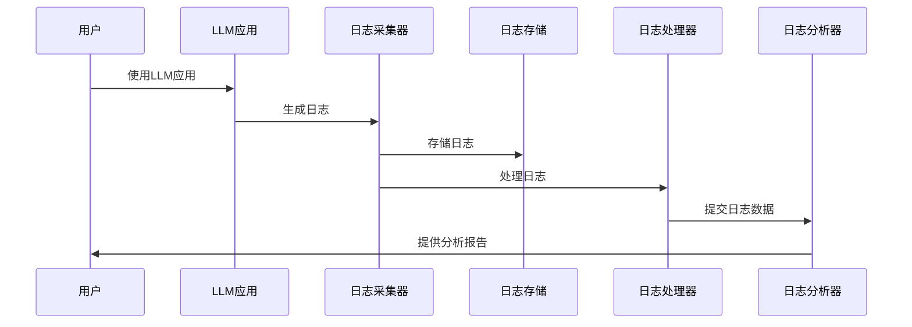

                 


# 构建高效的LLM应用日志管理系统

关键词：LLM，日志管理系统，日志采集，日志存储，日志处理，日志分析

摘要：本文深入探讨了构建高效的LLM（大型语言模型）应用日志管理系统的方法。从问题背景和核心概念介绍开始，逐步分析日志管理系统中的核心概念与联系，包括日志采集、日志存储、日志处理和日志分析。随后，详细介绍了LLM应用日志管理系统的架构设计，包括系统需求分析、系统架构设计和系统接口设计。在算法原理讲解部分，通过具体的Python源代码展示了日志数据预处理和日志数据分析的算法原理，并使用Mermaid流程图和LaTeX数学公式进行详细讲解。接着，本文通过系统分析与架构设计方案，以及项目实战，详细阐述了如何实现一个高效的LLM应用日志管理系统。最后，本文提供了最佳实践tips，并对全文进行了小结，提出了注意事项，并推荐了拓展阅读资源。

## 第一部分：背景介绍与核心概念

### 1.1.1 问题的提出与背景

在当前的大数据时代，日志管理已经成为系统运维和故障排查中不可或缺的一部分。特别是在LLM（大型语言模型）应用中，日志管理的重要性更加突出。LLM应用通常涉及大规模数据处理和复杂模型训练，这对系统的稳定性、可扩展性和可维护性提出了极高的要求。日志管理系统能够帮助开发者和运维人员实时监控系统的运行状态，快速定位和解决问题，从而提高系统的可靠性和用户体验。

然而，当前的LLM应用日志管理面临诸多挑战：

- **日志数据量大**：LLM应用通常生成海量的日志数据，如何高效地存储、处理和分析这些数据是一个难题。
- **日志格式多样性**：不同的LLM应用可能使用不同的日志格式，如何统一日志格式，使其便于分析和管理，是另一个挑战。
- **日志分析复杂性**：LLM应用中的日志数据往往包含丰富的信息，如何从中提取有价值的信息，需要复杂的算法和技术支持。

### 1.1.2 核心概念

#### 1.1.2.1 LLM的定义

LLM（Large Language Model）是指大型语言模型，是一种基于深度学习技术的自然语言处理模型。它通过学习海量文本数据，能够生成连贯、有逻辑性的文本，并在多种自然语言任务中表现出色，如文本生成、机器翻译、问答系统等。

#### 1.1.2.2 日志管理系统的定义与作用

日志管理系统是一种用于收集、存储、处理和分析系统日志的工具。其核心作用包括：

- **日志采集**：从系统各个部分收集日志数据。
- **日志存储**：将采集到的日志数据存储在数据库或其他存储介质中。
- **日志处理**：对日志数据进行分析、过滤、聚合等处理。
- **日志分析**：提取日志数据中的有价值信息，为系统运维和故障排查提供支持。

#### 1.1.2.3 日志文件格式与常见结构

日志文件的格式通常包括以下几部分：

- **时间戳**：记录日志事件发生的具体时间。
- **日志级别**：表示日志事件的严重程度，如INFO、ERROR等。
- **日志内容**：记录具体的日志事件信息。
- **上下文信息**：包括线程ID、进程ID、用户ID等辅助信息。

### 1.1.3 日志管理系统核心概念与联系

#### 1.1.3.1 日志采集

日志采集是日志管理系统的第一步，其主要任务是实时地从系统各个部分（如服务器、应用程序、网络设备等）收集日志数据。采集方式通常包括：

- **系统自带日志**：如Linux系统的`/var/log`目录中的日志文件。
- **应用程序日志**：由应用程序自定义的日志文件，如Web服务器的访问日志。
- **第三方工具**：如Logstash、Fluentd等日志采集工具。

#### 1.1.3.2 日志存储

日志存储是将采集到的日志数据存储到数据库或其他存储介质中。常见的存储方式包括：

- **文件存储**：将日志数据直接存储在文件系统中，如使用`/var/log`目录。
- **数据库存储**：使用关系型数据库或NoSQL数据库存储日志数据，如MySQL、Elasticsearch等。
- **云存储**：利用云服务商提供的存储服务，如AWS S3、Azure Blob Storage等。

#### 1.1.3.3 日志处理

日志处理是对日志数据进行清洗、过滤、聚合等操作，以提取有价值的信息。常见的处理方式包括：

- **日志清洗**：去除重复、冗余的日志数据。
- **日志过滤**：根据特定条件筛选出感兴趣的日志数据。
- **日志聚合**：对日志数据进行统计、汇总，以获得更全面的视图。

#### 1.1.3.4 日志分析

日志分析是日志管理系统的核心功能，其目标是提取日志数据中的有价值信息，为系统运维和故障排查提供支持。常见的分析方式包括：

- **统计分析**：对日志数据进行统计分析，如计算日志频率、分布等。
- **关联分析**：分析不同日志之间的关联性，以发现潜在的问题。
- **机器学习**：使用机器学习算法，对日志数据进行分析和预测。

### 1.1.4 概念属性特征对比表格

| 特性       | 日志采集 | 日志存储 | 日志处理 | 日志分析 |
|------------|---------|---------|---------|---------|
| 功能描述   | 收集日志数据 | 存储日志数据 | 清洗、过滤、聚合日志数据 | 统计、关联、预测分析日志数据 |
| 数据类型   | 文本 | 文本、数据库 | 文本 | 文本 |
| 常见工具   | Logstash、Fluentd | MySQL、Elasticsearch | Logstash、Fluentd | Elasticsearch、Kibana |
| 关联性     | 与日志管理系统紧密结合 | 与日志管理系统紧密结合 | 与日志管理系统紧密结合 | 与日志管理系统紧密结合 |

### 1.1.5 ER实体关系图架构

```mermaid
erDiagram
  LogEvent ||--|{ Logger : 采集 }
  Logger ||--|{ LogStorage : 存储 }
  LogStorage ||--|{ LogProcessor : 处理 }
  LogProcessor ||--|{ LogAnalyzer : 分析 }
```

## 第二部分：LLM应用日志管理系统的架构设计

### 2.1.1 系统需求分析

#### 2.1.1.1 功能需求

1. **日志采集**：能够从LLM应用的各个组件（如服务器、应用程序等）实时采集日志数据。
2. **日志存储**：能够高效地存储海量的日志数据，并提供快速的检索功能。
3. **日志处理**：能够对日志数据进行清洗、过滤、聚合等处理，以提取有价值的信息。
4. **日志分析**：能够对日志数据进行分析，生成报告和图表，帮助运维人员快速定位问题。

#### 2.1.1.2 非功能需求

1. **性能**：系统需要能够处理高并发的日志数据，保证系统的稳定性和响应速度。
2. **可靠性**：系统需要保证数据的不丢失，提供数据备份和恢复机制。
3. **可扩展性**：系统需要支持水平扩展，以适应不断增长的日志数据。

### 2.1.2 系统架构设计

#### 2.1.2.1 系统架构图



#### 2.1.2.2 系统模块划分

1. **日志采集模块**：负责从LLM应用的各个组件实时采集日志数据。
2. **日志存储模块**：负责存储采集到的日志数据，并提供快速的检索功能。
3. **日志处理模块**：负责对日志数据进行清洗、过滤、聚合等处理，以提取有价值的信息。
4. **日志分析模块**：负责对日志数据进行分析，生成报告和图表，帮助运维人员快速定位问题。

### 2.1.3 系统接口设计

#### 2.1.3.1 接口功能定义

1. **日志采集接口**：提供日志数据的采集功能，支持多种日志格式的解析。
2. **日志存储接口**：提供日志数据的存储功能，支持数据库和文件系统的存储方式。
3. **日志处理接口**：提供日志数据的处理功能，包括清洗、过滤、聚合等操作。
4. **日志分析接口**：提供日志数据

