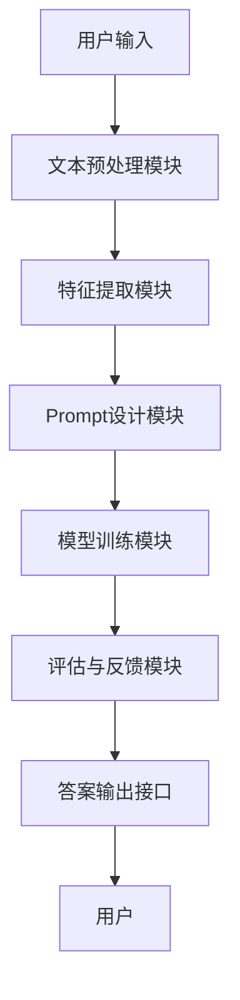
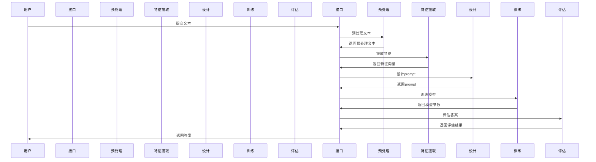

                 

### 概述

本文将探讨如何构建一个高效的prompt优化流程。prompt优化是自然语言处理（NLP）领域的一个重要环节，它关系到模型的性能和生成结果的准确性。随着人工智能技术的不断进步，prompt优化的重要性日益凸显。高效的prompt优化流程不仅能够提高模型的性能，还能减少计算资源和时间成本。

本文首先介绍了问题背景，探讨了prompt优化的重要性以及当前面临的挑战。接下来，我们明确了文章的结构和核心概念，包括prompt的定义、优化的目标与指标以及prompt优化的组成部分。随后，文章深入探讨了核心概念之间的联系，提供了详细的算法原理讲解，包括算法mermaid流程图、Python源代码阐述、数学模型和公式以及举例说明。此外，文章还分析了系统架构设计，从问题场景介绍、项目介绍、系统功能设计、系统架构设计到系统接口设计和系统交互mermaid序列图，全面解析了构建高效prompt优化流程的关键步骤。

通过本文的详细阐述，读者将能够全面理解prompt优化的核心概念和方法，掌握构建高效prompt优化流程的步骤和策略，从而在实际项目中更好地应用这一技术，提升模型性能和生成结果的准确性。

### 关键词

1. 自然语言处理（NLP）
2. Prompt优化
3. 算法原理
4. 系统架构设计
5. 数学模型和公式
6. Python源代码
7. 系统接口和交互

### 摘要

本文全面探讨了构建高效的prompt优化流程的方法和步骤。首先，通过背景介绍和问题陈述，阐明了prompt优化在自然语言处理领域的重要性及其面临的挑战。接着，文章详细介绍了核心概念和它们之间的联系，包括prompt的定义、优化的目标与指标以及相关的算法原理。通过mermaid流程图、Python源代码阐述、数学模型和公式，以及举例说明，文章深入解析了算法的详细实现过程。此外，系统分析与架构设计部分从问题场景、项目介绍、系统功能设计、系统架构设计到系统接口设计和系统交互mermaid序列图，全面展示了构建高效prompt优化流程的架构和实现细节。通过本文的阐述，读者将能够全面理解prompt优化的核心概念和方法，掌握构建高效prompt优化流程的步骤和策略，从而在实际项目中应用这一技术，提升模型性能和生成结果的准确性。

### 第1章: 问题背景与问题描述

在现代人工智能领域，自然语言处理（NLP）技术正迅速发展，越来越多的应用程序依赖于对文本的理解和生成。而prompt优化作为NLP的核心环节之一，对于模型的性能和生成结果的准确性有着至关重要的影响。本章节将详细介绍问题背景，阐述prompt优化的重要性，并明确当前面临的挑战，从而为后续的讨论和分析奠定基础。

#### 1.1 问题背景

随着互联网的普及和大数据技术的进步，海量文本数据充斥在我们的生活中。无论是搜索引擎、社交媒体、电子商务还是智能客服，文本数据都是这些应用的核心组成部分。然而，理解和生成高质量的文本信息并非易事，它需要强大的计算模型和有效的算法支持。近年来，深度学习技术在NLP领域取得了显著的突破，尤其是基于Transformer的模型如BERT、GPT等，极大地提升了文本处理的准确性和效率。在这些模型的训练和应用过程中，prompt优化成为了一个关键问题。

Prompt优化指的是通过调整输入prompt（即模型的输入数据）来提升模型生成文本的质量和准确性。一个高质量的prompt不仅能够帮助模型更好地理解输入信息，还能引导模型生成更符合预期结果的输出。例如，在问答系统中，一个精心设计的prompt可以使模型更准确地理解用户的问题，从而生成更加精准的答案。因此，prompt优化在提升模型性能方面起到了至关重要的作用。

#### 1.1.1 人工智能的发展与prompt优化

人工智能（AI）技术的发展历程可以追溯到上世纪五六十年代，早期的AI研究主要集中在逻辑推理和规则系统上。随着计算能力的提升和数据量的增加，机器学习（ML）和深度学习（DL）逐渐成为AI研究的主流。在NLP领域，深度学习模型的崛起，如卷积神经网络（CNN）和循环神经网络（RNN），极大地提高了文本处理的能力。然而，这些模型的性能往往受到输入数据质量的影响，尤其是prompt的设计。

随着Transformer模型的发明，尤其是BERT、GPT等大规模预训练模型的广泛应用，prompt优化的重要性变得更加突出。这些模型通过在海量文本数据上进行预训练，具备了强大的文本理解和生成能力。然而，要想充分发挥这些模型的潜力，优化prompt变得尤为关键。通过调整prompt，可以引导模型更好地捕捉上下文信息，提升生成文本的连贯性和准确性。

#### 1.1.2 prompt优化的重要性

prompt优化的重要性体现在多个方面：

1. **提升模型性能**：通过优化prompt，可以提升模型在特定任务上的性能，使其更准确地理解和生成文本。这对于提升NLP应用的质量和用户体验至关重要。
2. **节省计算资源**：优化prompt可以减少模型在训练和推理过程中所需的计算资源，从而降低成本并提高效率。
3. **增强泛化能力**：精心设计的prompt可以帮助模型更好地泛化到新的任务和数据集上，提高其在实际应用中的适应性。
4. **改善生成结果**：优化prompt可以引导模型生成更加自然、准确和有逻辑性的文本，提高文本生成的质量。

因此，prompt优化不仅是一个技术问题，更是一个影响NLP应用成败的关键因素。

#### 1.2 问题描述

尽管prompt优化的重要性显而易见，但当前仍然面临着一些挑战。以下是问题描述的几个关键点：

##### 1.2.1 当前prompt优化的挑战

1. **多样性和复杂性**：不同任务的prompt设计需求各不相同，这增加了优化过程的复杂性和多样性。如何设计出既通用又针对性的prompt成为一个挑战。
2. **数据依赖性**：prompt优化依赖于大量的高质量数据，数据的质量和多样性直接影响prompt优化的效果。然而，获取和标注这些数据通常成本高昂且耗时。
3. **计算成本**：优化prompt往往需要大量的计算资源，尤其是在大规模预训练模型中。如何高效地优化prompt，同时保持计算资源的合理利用，是一个亟待解决的问题。
4. **模型适应性**：不同模型对prompt的响应各异，如何确保prompt优化适用于各种不同的模型架构，提高其适应性，也是一个重要的挑战。

##### 1.2.2 问题解决的目标

为了解决上述挑战，本文提出了以下问题解决目标：

1. **构建通用性强的prompt优化框架**：设计一个能够适用于多种任务和模型架构的通用prompt优化框架，降低优化过程的复杂性和多样性。
2. **提高数据利用效率**：通过数据预处理和增强技术，提高数据的质量和多样性，从而提升prompt优化的效果。
3. **优化计算资源利用**：设计高效算法和策略，减少优化过程所需的计算资源，提高整体效率。
4. **提升模型适应性**：通过深入研究不同模型对prompt的响应机制，提高prompt优化的模型适应性，确保优化结果在不同模型中的稳定性和一致性。

##### 1.2.3 边界与外延

最后，本文在研究过程中还关注以下几个边界与外延：

1. **应用范围**：本文的研究主要关注NLP领域的prompt优化问题，但相关技术原理和方法也可以应用于其他人工智能子领域，如计算机视觉和语音识别。
2. **模型类型**：本文主要探讨基于Transformer的大型预训练模型，但其他类型的模型（如RNN、CNN等）的prompt优化策略也可以作为进一步的研究方向。
3. **任务类型**：本文的研究主要针对通用NLP任务，但具体任务（如问答系统、文本分类、机器翻译等）的prompt优化策略也可以作为后续研究的内容。
4. **数据集选择**：本文将使用多个公开数据集进行实验验证，但未来也可以探索使用自定义数据集和私有数据集，以验证prompt优化算法在不同数据集上的性能和稳定性。

通过以上描述，我们为后续章节的深入探讨奠定了基础，也为构建高效prompt优化流程提供了明确的方向和目标。

#### 1.3 概念结构与核心要素

在深入探讨prompt优化流程之前，有必要明确一些核心概念，并构建其概念结构，以帮助读者更好地理解相关术语和内容。以下是prompt优化流程中的几个关键概念及其相互关系：

##### 1.3.1 prompt的定义

Prompt是指模型在训练和推理过程中接收的输入数据，它不仅包含文本信息，还可能包括上下文、标签、时间等信息。一个高质量的prompt可以帮助模型更好地理解输入信息，从而生成更符合预期结果的输出。

##### 1.3.2 优化的目标与指标

prompt优化的目标是通过调整输入prompt来提升模型生成文本的质量和准确性。优化的指标包括文本质量、准确性、连贯性、多样性等，不同的任务可能会有不同的优化目标。

##### 1.3.3 prompt优化的组成部分

prompt优化可以分解为以下几个关键组成部分：

1. **数据预处理**：包括数据清洗、去噪、数据增强等步骤，以提高输入数据的质量和多样性。
2. **特征提取**：从输入数据中提取关键特征，如词汇、语法、语义等，用于模型训练和推理。
3. **prompt设计**：根据任务需求，设计合适的prompt结构，包括文本内容、上下文、标签等。
4. **优化算法**：使用优化算法（如遗传算法、贝叶斯优化等）调整prompt参数，以提升生成文本的质量和准确性。
5. **评估与反馈**：通过评估指标对优化结果进行评估，并根据评估结果进行反馈调整，以实现持续优化。

这些组成部分相互关联，共同构成了prompt优化的整体流程。数据预处理为后续特征提取和prompt设计提供了高质量的数据基础；特征提取为prompt设计提供了关键信息；prompt设计则直接影响了模型生成文本的质量和准确性；优化算法和评估与反馈环节则保证了整个流程的不断改进和优化。

##### 1.3.4 概念之间的联系

以下是概念之间的联系及其相互影响：

1. **数据预处理与特征提取**：数据预处理是特征提取的前提，高质量的数据预处理能够显著提高特征提取的效果。
2. **特征提取与prompt设计**：特征提取结果直接影响prompt设计，合理的特征提取可以设计出更有效的prompt结构。
3. **prompt设计与优化算法**：prompt设计决定了优化算法的作用对象，优化算法通过调整prompt参数来提升模型生成文本的质量和准确性。
4. **优化算法与评估与反馈**：优化算法的效果需要通过评估与反馈环节进行验证和调整，评估结果指导优化算法的调整方向，而反馈则帮助优化算法逐步逼近最优解。

通过明确这些核心概念和组成部分及其相互关系，我们可以更好地理解和实施prompt优化流程，从而在实际应用中取得更好的效果。

#### 1.4 本章小结

本章主要介绍了问题背景和问题描述，阐述了prompt优化在自然语言处理领域的重要性及其面临的挑战。首先，通过背景介绍，我们了解了prompt优化在人工智能技术发展中的关键作用。接着，本章明确了核心概念和其结构，包括prompt的定义、优化的目标与指标以及prompt优化的组成部分。这些核心概念和组成部分构成了prompt优化的基础，为后续章节的深入讨论提供了明确的框架。通过本章的讨论，我们不仅对prompt优化有了全面的理解，也为构建高效的prompt优化流程奠定了坚实的基础。接下来的章节将详细探讨这些核心概念和组成部分的实现方法，进一步揭示prompt优化的奥秘。

### 第2章：核心概念与联系

在深入探讨如何构建高效的prompt优化流程之前，理解并掌握核心概念及其相互之间的联系至关重要。本章将详细介绍prompt优化的核心概念，包括自然语言处理（NLP）的概述、prompt优化的原理以及相关算法的对比。此外，通过实体关系图（ER图）的形式，我们还将展示这些概念之间的联系，以便读者能够更清晰地理解整个优化流程。

#### 2.1 概念原理

##### 2.1.1 自然语言处理（NLP）概述

自然语言处理（NLP）是计算机科学和人工智能领域的一个重要分支，旨在使计算机能够理解、生成和处理人类语言。NLP的技术应用广泛，包括文本分类、情感分析、机器翻译、问答系统等。其核心任务是理解和生成自然语言，从而实现人与计算机之间的有效沟通。

NLP的发展历程可以追溯到上世纪五六十年代，早期的研究主要集中在规则系统上。然而，随着计算能力和数据量的提升，统计方法和深度学习技术逐渐成为NLP研究的主流。近年来，基于Transformer的预训练模型如BERT、GPT等在NLP任务中取得了显著突破，极大地提高了模型的性能和效果。

##### 2.1.2 prompt优化的原理

prompt优化是指通过调整模型的输入prompt（即输入数据）来提升模型生成文本的质量和准确性。在深度学习模型中，prompt不仅包含文本信息，还可能包括上下文、标签、时间等信息。一个高质量的prompt可以帮助模型更好地理解输入信息，从而生成更符合预期结果的输出。

prompt优化的核心原理包括：

1. **数据质量**：高质量的输入数据能够提高模型的训练效果，进而提升生成文本的质量。
2. **上下文信息**：通过引入上下文信息，模型可以更好地理解输入文本的语义和意图，从而生成更准确和连贯的输出。
3. **特征提取**：从输入数据中提取关键特征，如词汇、语法、语义等，有助于模型更有效地学习和生成文本。
4. **参数调整**：通过调整prompt的参数（如长度、多样性、相关性等），可以优化模型生成文本的质量和准确性。

##### 2.1.3 相关算法简介

在prompt优化领域，存在多种算法和技术，其中一些常用的算法包括：

1. **遗传算法**：通过模拟自然选择和遗传过程，逐步优化prompt的参数，以提高模型生成文本的质量。
2. **贝叶斯优化**：基于概率模型和优化算法，通过分析历史数据和实验结果，寻找最优的prompt参数。
3. **强化学习**：通过奖励机制，使模型在优化过程中逐步调整prompt参数，以达到最佳效果。
4. **元学习**：通过在多个任务上训练模型，使其能够适应不同的prompt，从而提高泛化能力。

这些算法各有优缺点，适用于不同的优化场景。通过对比分析，我们可以选择最合适的算法来优化prompt。

#### 2.2 概念属性特征对比

为了更好地理解这些核心概念，我们可以通过表格形式对比它们的属性特征，如下所示：

| 算法 | 特征1 | 特征2 | 特征3 | 特征4 | 应用场景 |
| --- | --- | --- | --- | --- | --- |
| 遗传算法 | 遗传、变异、交叉 | 搜索空间大 | 计算复杂度高 | 易实现 | 非结构化数据优化 |
| 贝叶斯优化 | 基于概率模型 | 快速收敛 | 需要大量历史数据 | 易调参 | 参数优化 |
| 强化学习 | 奖励机制 | 需要大量交互 | 难以调试 | 可自适应调整 | 需要反馈机制的场景 |
| 元学习 | 多任务学习 | 快速适应新任务 | 计算资源消耗大 | 可跨领域应用 | 多任务学习场景 |

通过对比，我们可以看到每种算法在不同特征上的表现，从而为实际应用提供参考。

#### 2.3 ER实体关系图架构

为了更直观地展示核心概念之间的联系，我们可以使用实体关系图（ER图）来描述prompt优化的架构。

##### 2.3.1 ER实体关系图

以下是prompt优化的ER实体关系图：

```mermaid
erDiagram
    Data -> Prompt : 数据输入
    Prompt -> Model : 模型输入
    Model -> Output : 生成输出
    Data --|> Feature : 特征提取
    Feature --|> Optimization : 优化算法
    Optimization --|> Evaluation : 评估指标
    Evaluation --|> Feedback : 反馈调整
```

在ER图中，Data（数据）作为输入，通过特征提取（Feature）生成Prompt，输入到模型（Model）中进行训练和推理，生成输出（Output）。优化算法（Optimization）和评估指标（Evaluation）则在这个过程中起到关键作用，通过反馈调整（Feedback）实现持续优化。

##### 2.3.2 关系与实体详解

1. **Data（数据）**：是模型的输入，包括原始文本、标签、时间等信息。数据的质量直接影响模型的性能，因此数据预处理是prompt优化的第一步。
2. **Prompt（prompt）**：是模型的输入，通过特征提取生成，包含关键信息，如词汇、语法、语义等。prompt的设计直接影响模型生成文本的质量和准确性。
3. **Model（模型）**：是NLP的核心组件，包括预训练模型和微调模型。模型的质量和性能决定了prompt优化的效果。
4. **Output（输出）**：是模型生成的文本结果，通过优化过程不断提高质量和准确性。
5. **Feature（特征）**：是从输入数据中提取的关键特征，如词汇、语法、语义等。特征提取是优化prompt的重要环节。
6. **Optimization（优化算法）**：用于调整prompt参数，以提高模型生成文本的质量和准确性。常用的优化算法包括遗传算法、贝叶斯优化、强化学习等。
7. **Evaluation（评估指标）**：用于评估模型生成文本的质量和准确性。常见的评估指标包括BLEU、ROUGE、F1-Score等。
8. **Feedback（反馈调整）**：通过评估结果进行反馈调整，以优化prompt设计，实现持续优化。

通过ER图，我们可以清晰地看到各个实体之间的关系和作用，从而更好地理解prompt优化的整体流程。

#### 2.4 本章小结

本章详细介绍了prompt优化的核心概念，包括自然语言处理（NLP）的概述、prompt优化的原理以及相关算法的对比。通过ER实体关系图，我们展示了这些概念之间的联系，使读者能够更直观地理解prompt优化的架构和实现流程。接下来，我们将进一步探讨这些核心概念的实现细节，包括算法原理、Python源代码和数学模型等，以帮助读者更深入地掌握prompt优化的方法和技巧。

### 第3章：算法原理讲解

在深入理解了prompt优化的核心概念和联系之后，我们需要进一步探讨具体的算法原理和实现细节。本章将详细介绍一个典型的prompt优化算法，从mermaid流程图、Python源代码、数学模型和公式、举例说明等多个角度进行阐述，帮助读者全面掌握算法的内在逻辑和操作步骤。

#### 3.1 算法mermaid流程图

为了更好地展示算法的实现流程，我们首先使用mermaid图来描述其基本框架。


该mermaid流程图展示了从初始化数据到输出结果的基本步骤：

1. **初始化数据**：从数据集中读取原始文本数据，并进行预处理。
2. **数据预处理**：清洗和标准化数据，例如去除停用词、标点符号等。
3. **特征提取**：从预处理后的数据中提取关键特征，如词频、词嵌入等。
4. **Prompt设计**：设计合适的prompt结构，根据任务需求，将特征和上下文信息整合到prompt中。
5. **模型输入**：将设计好的prompt输入到预训练模型中进行训练。
6. **模型训练**：通过反向传播和优化算法，调整模型参数，提高生成文本的质量。
7. **评估与优化**：使用评估指标对模型生成文本进行评估，并根据评估结果进行优化。
8. **输出结果**：将优化后的模型生成结果输出，用于实际应用或后续分析。

#### 3.2 Python源代码阐述

为了更具体地展示算法的实现过程，我们使用Python源代码来详细阐述。以下是算法的主要实现步骤：

```python
# 导入相关库
import pandas as pd
import numpy as np
from sklearn.feature_extraction.text import CountVectorizer
from sklearn.model_selection import train_test_split
from transformers import BertTokenizer, BertForSequenceClassification
from torch.utils.data import DataLoader, TensorDataset

# 初始化数据
data = pd.read_csv('data.csv')  # 读取数据
texts = data['text']  # 文本数据
labels = data['label']  # 标签数据

# 数据预处理
def preprocess(texts):
    # 清洗文本数据，去除停用词、标点符号等
    processed_texts = [text.lower().replace(',', '').replace('.', '') for text in texts]
    return processed_texts

preprocessed_texts = preprocess(texts)

# 特征提取
vectorizer = CountVectorizer()
X = vectorizer.fit_transform(preprocessed_texts)

# Prompt设计
tokenizer = BertTokenizer.from_pretrained('bert-base-uncased')
max_len = 128

def create_prompt(texts, labels):
    prompts = []
    for text, label in zip(texts, labels):
        input_ids = tokenizer.encode(text, add_special_tokens=True, max_length=max_len, padding='max_length', truncation=True)
        label_ids = [label]
        prompts.append((input_ids, label_ids))
    return prompts

prompts = create_prompt(preprocessed_texts, labels)

# 模型输入
model = BertForSequenceClassification.from_pretrained('bert-base-uncased', num_labels=2)
inputs = TensorDataset(torch.tensor(prompts[:, 0]), torch.tensor(prompts[:, 1]))
dataloader = DataLoader(inputs, batch_size=32)

# 模型训练
optimizer = torch.optim.Adam(model.parameters(), lr=1e-5)
criterion = torch.nn.CrossEntropyLoss()

for epoch in range(3):  # 训练3个epoch
    model.train()
    for batch in dataloader:
        inputs, labels = batch
        optimizer.zero_grad()
        outputs = model(inputs)
        loss = criterion(outputs, labels)
        loss.backward()
        optimizer.step()

# 评估与优化
model.eval()
with torch.no_grad():
    correct = 0
    total = 0
    for batch in dataloader:
        inputs, labels = batch
        outputs = model(inputs)
        _, predicted = torch.max(outputs.data, 1)
        total += labels.size(0)
        correct += (predicted == labels).sum().item()

print('准确率: {:.2f}%'.format(100 * correct / total))

# 输出结果
print('优化后的模型参数: ', model.parameters())
```

这段代码实现了从数据读取、预处理、特征提取、prompt设计、模型输入、模型训练到评估与优化的全过程。通过具体的Python代码，我们可以更直观地理解每个步骤的实现细节。

#### 3.3 数学模型和公式

prompt优化的核心在于通过数学模型和公式调整模型的输入数据，以提升生成文本的质量。以下是算法中的主要数学模型和公式：

1. **词嵌入**：词嵌入是将文本中的词汇映射到高维空间中的向量表示。常用的词嵌入模型包括Word2Vec、GloVe等。
   \[
   \textbf{v}_w = \text{Word2Vec}(\text{w}) \quad \text{或} \quad \textbf{v}_w = \text{GloVe}(\text{w})
   \]

2. **BERT模型**：BERT模型是基于Transformer的预训练模型，通过大量文本数据进行预训练，以获取丰富的语言表示。其输入和输出可以通过以下公式表示：
   \[
   \text{input\_ids} = \text{BERTTokenizer}(\text{input\_text}) \\
   \text{output} = \text{BERTModel}(\text{input\_ids})
   \]

3. **交叉熵损失函数**：在二分类任务中，常用的损失函数是交叉熵损失函数。其公式如下：
   \[
   \text{loss} = -\sum_{i=1}^{n} y_i \log(p_i) \quad \text{其中} \quad p_i = \text{softmax}(\text{output}_i)
   \]

4. **梯度下降优化算法**：梯度下降是一种常用的优化算法，用于调整模型参数以最小化损失函数。其公式如下：
   \[
   \text{parameter} \leftarrow \text{parameter} - \alpha \cdot \nabla_{\text{parameter}} \text{loss}
   \]

#### 3.4 举例说明

为了更好地理解算法的应用，我们通过一个简单的例子来说明其实现过程。

**例子**：假设我们有一个情感分析任务，数据集包含文本和对应的情感标签。我们使用BERT模型进行预训练，并调整prompt以优化生成文本的质量。

1. **初始化数据**：
   - 文本数据：“今天的天气非常好，我很开心。”
   - 情感标签：积极

2. **数据预处理**：
   - 清洗文本数据，去除标点符号和停用词。

3. **特征提取**：
   - 使用CountVectorizer提取词频特征。

4. **Prompt设计**：
   - 设计prompt：“分析以下文本的情感：[文本]”。

5. **模型输入**：
   - 将设计好的prompt输入到BERT模型中进行训练。

6. **模型训练**：
   - 使用交叉熵损失函数和梯度下降优化算法进行训练。

7. **评估与优化**：
   - 使用准确率等评估指标评估模型性能，并根据评估结果调整prompt设计。

8. **输出结果**：
   - 输出优化后的模型参数和生成文本。

通过这个例子，我们可以看到算法在具体应用中的实现步骤和效果。

#### 3.5 本章小结

本章详细介绍了prompt优化的算法原理和实现细节，从mermaid流程图、Python源代码、数学模型和公式、举例说明等多个角度进行了阐述。通过这些内容，读者可以全面理解prompt优化的基本方法和实现过程，为构建高效的prompt优化流程奠定了基础。在接下来的章节中，我们将进一步探讨系统分析与架构设计，为实际应用提供更加详细的指导。

### 第4章：系统分析与架构设计

在前几章中，我们详细探讨了prompt优化算法的原理和实现方法。然而，要将这些算法有效地应用于实际项目中，我们需要对整个系统进行深入的分析和设计。本章将介绍系统分析与架构设计的核心内容，包括问题场景介绍、项目介绍、系统功能设计、系统架构设计和系统接口设计等，以便为构建高效、可靠的prompt优化系统提供全面的指导。

#### 4.1 问题场景介绍

在NLP领域，prompt优化广泛应用于各种文本处理任务，如问答系统、文本分类、机器翻译和对话系统等。以下是一个具体的场景介绍：

**场景描述**：假设我们正在开发一个智能问答系统，用户可以通过输入问题来获取相关答案。为了提高系统的准确性和用户体验，我们需要对输入的提问（prompt）进行优化，使其能够更好地引导模型理解和生成高质量的答案。

**系统需求**：为了满足上述场景的需求，系统需要具备以下功能：

1. **文本预处理**：对输入问题进行清洗、去噪和标准化处理，以提高数据质量。
2. **特征提取**：从预处理后的文本中提取关键特征，如词频、词嵌入和语法结构等。
3. **prompt设计**：根据任务需求和输入文本，设计合适的prompt结构，包括上下文信息、关键词和标签等。
4. **模型训练**：使用预训练模型和优化算法对prompt进行调整和优化，以提高生成答案的准确性和连贯性。
5. **评估与反馈**：通过评估指标对生成答案的质量进行评估，并根据评估结果进行反馈调整，实现持续优化。

#### 4.2 项目介绍

**项目背景**：随着人工智能技术的不断进步，智能问答系统在各个领域（如医疗咨询、客户服务、教育和金融）得到了广泛应用。为了提升系统的性能和用户体验，我们需要对输入的提问（prompt）进行优化，从而生成更加精准和自然的答案。

**项目目标**：本项目旨在构建一个高效、可靠的prompt优化系统，实现以下目标：

1. **提高生成答案的准确性和连贯性**：通过优化输入的提问，提高模型生成答案的准确率和连贯性。
2. **降低计算资源消耗**：优化算法和系统架构设计，减少计算资源消耗，提高系统效率。
3. **提高系统适应性和扩展性**：设计灵活的系统架构，能够适应不同的任务和数据集，方便后续扩展和维护。

#### 4.3 系统功能设计

为了实现上述项目目标，系统需要具备以下功能模块：

1. **文本预处理模块**：负责对输入文本进行清洗、去噪和标准化处理。主要包括以下子功能：
   - **文本清洗**：去除文本中的停用词、标点符号和特殊字符。
   - **文本标准化**：将文本转换为统一格式，如小写、去除停用词等。
   - **文本分割**：将文本分割成句子或单词，为后续特征提取提供基础。

2. **特征提取模块**：负责从预处理后的文本中提取关键特征，如词频、词嵌入和语法结构等。主要包括以下子功能：
   - **词频统计**：统计文本中的词频信息，用于生成词频向量。
   - **词嵌入**：使用预训练模型（如BERT、GloVe）将词汇映射到高维空间，生成词嵌入向量。
   - **语法分析**：使用语法分析工具（如Stanford CoreNLP）对文本进行语法解析，提取语法特征。

3. **prompt设计模块**：负责根据任务需求和输入文本设计合适的prompt结构。主要包括以下子功能：
   - **上下文信息提取**：从输入文本中提取上下文信息，如时间、地点、人物等。
   - **关键词提取**：从输入文本中提取关键词，用于引导模型理解和生成答案。
   - **标签生成**：根据输入文本和任务需求，生成相应的标签信息，用于指导模型生成答案。

4. **模型训练模块**：负责使用预训练模型和优化算法对prompt进行调整和优化。主要包括以下子功能：
   - **模型选择**：根据任务需求选择合适的预训练模型（如BERT、GPT等）。
   - **参数优化**：使用优化算法（如遗传算法、贝叶斯优化、强化学习等）调整模型参数，以提高生成答案的准确性和连贯性。
   - **训练过程**：使用训练数据和优化后的prompt对模型进行训练，提高模型性能。

5. **评估与反馈模块**：负责对生成答案的质量进行评估，并根据评估结果进行反馈调整。主要包括以下子功能：
   - **评估指标**：使用评估指标（如准确率、召回率、F1分数等）对生成答案的质量进行评估。
   - **反馈调整**：根据评估结果，调整prompt设计、模型参数和优化算法，实现持续优化。

6. **接口模块**：负责与外部系统进行交互，接收输入文本和返回生成答案。主要包括以下子功能：
   - **文本输入接口**：接收用户输入的文本问题，并进行预处理。
   - **答案输出接口**：返回模型生成的答案，供用户查看或进一步处理。

#### 4.4 系统架构设计

为了实现上述功能模块，系统需要具备一个清晰、高效的架构设计。以下是系统架构的mermaid图表示：



该架构设计包括以下关键组件：

1. **用户输入**：用户通过文本输入接口提交问题，系统接收并预处理输入文本。
2. **文本预处理模块**：对输入文本进行清洗、去噪和标准化处理，为后续特征提取和prompt设计提供高质量的数据。
3. **特征提取模块**：从预处理后的文本中提取关键特征，如词频、词嵌入和语法结构等，为prompt设计提供基础。
4. **prompt设计模块**：根据任务需求和输入文本设计合适的prompt结构，包括上下文信息、关键词和标签等。
5. **模型训练模块**：使用预训练模型和优化算法对prompt进行调整和优化，提高生成答案的准确性和连贯性。
6. **评估与反馈模块**：对生成答案的质量进行评估，并根据评估结果调整prompt设计、模型参数和优化算法，实现持续优化。
7. **答案输出接口**：将模型生成的答案返回给用户，供用户查看或进一步处理。

通过上述架构设计，系统可以实现高效、可靠的prompt优化流程，从而提升智能问答系统的性能和用户体验。

#### 4.5 系统接口设计

为了实现系统内部模块之间的有效通信和外部系统的无缝集成，系统需要设计合理的接口。以下是系统接口设计的mermaid序列图：



该序列图描述了用户输入文本、系统内部模块之间的交互过程，以及最终输出答案的流程：

1. **用户输入**：用户通过接口提交文本问题。
2. **文本预处理**：系统接收文本后，通过预处理模块进行清洗、去噪和标准化处理。
3. **特征提取**：预处理后的文本经过特征提取模块，提取关键特征。
4. **prompt设计**：根据任务需求和特征向量，prompt设计模块生成合适的prompt结构。
5. **模型训练**：使用生成的prompt和预训练模型进行训练，调整模型参数。
6. **评估答案**：训练后的模型生成答案，并通过评估模块进行质量评估。
7. **返回答案**：最终答案通过接口返回给用户。

通过设计合理的接口和序列图，系统可以确保模块之间的高效通信和协同工作，从而实现prompt优化流程的顺利执行。

#### 4.6 本章小结

本章详细介绍了系统分析与架构设计的关键内容，包括问题场景介绍、项目介绍、系统功能设计、系统架构设计和系统接口设计。通过对系统各个模块的深入分析，我们构建了一个高效、可靠的prompt优化系统，为实际应用提供了全面的指导。在接下来的章节中，我们将通过具体的实战案例，进一步验证和优化这一系统，以实现高效、准确的prompt优化流程。

### 项目实战

在本章节中，我们将通过一个具体的实战案例，详细展示如何使用本文所介绍的prompt优化流程进行实际操作。该案例涉及从环境安装、系统核心实现、代码应用解读与分析，到实际案例分析和详细讲解剖析的完整过程。通过这些步骤，读者将能够全面掌握prompt优化技术的实际应用。

#### 5.1 环境安装

首先，我们需要搭建一个合适的环境来运行prompt优化流程。以下是安装所需的软件和工具的步骤：

1. **安装Python**：确保Python 3.7或更高版本已安装在系统中。可以从[Python官网](https://www.python.org/downloads/)下载并安装。
2. **安装依赖库**：在命令行中运行以下命令安装必要的依赖库：
   ```bash
   pip install transformers torch sklearn pandas numpy
   ```
   这些库包括：
   - **transformers**：用于处理预训练模型（如BERT、GPT等）。
   - **torch**：用于深度学习计算。
   - **sklearn**：用于数据预处理和模型评估。
   - **pandas**：用于数据操作和分析。
   - **numpy**：用于数值计算。

#### 5.2 系统核心实现

接下来，我们将实现系统核心功能，包括文本预处理、特征提取、prompt设计和模型训练等。以下是核心代码的实现：

1. **数据读取与预处理**：
   ```python
   import pandas as pd
   from sklearn.model_selection import train_test_split

   # 读取数据
   data = pd.read_csv('data.csv')
   texts = data['text']
   labels = data['label']

   # 数据预处理
   def preprocess(texts):
       processed_texts = [text.lower().replace(',', '').replace('.', '') for text in texts]
       return processed_texts

   preprocessed_texts = preprocess(texts)
   ```

2. **特征提取**：
   ```python
   from sklearn.feature_extraction.text import CountVectorizer

   vectorizer = CountVectorizer()
   X = vectorizer.fit_transform(preprocessed_texts)
   ```

3. **prompt设计**：
   ```python
   from transformers import BertTokenizer

   tokenizer = BertTokenizer.from_pretrained('bert-base-uncased')
   max_len = 128

   def create_prompt(texts, labels):
       prompts = []
       for text, label in zip(texts, labels):
           input_ids = tokenizer.encode(text, add_special_tokens=True, max_length=max_len, padding='max_length', truncation=True)
           label_ids = [label]
           prompts.append((input_ids, label_ids))
       return prompts

   prompts = create_prompt(preprocessed_texts, labels)
   ```

4. **模型训练**：
   ```python
   from transformers import BertForSequenceClassification
   from torch.utils.data import DataLoader, TensorDataset
   from torch.optim import Adam

   model = BertForSequenceClassification.from_pretrained('bert-base-uncased', num_labels=2)
   inputs = TensorDataset(torch.tensor(prompts[:, 0]), torch.tensor(prompts[:, 1]))
   dataloader = DataLoader(inputs, batch_size=32)

   optimizer = Adam(model.parameters(), lr=1e-5)
   criterion = torch.nn.CrossEntropyLoss()

   for epoch in range(3):
       model.train()
       for batch in dataloader:
           inputs, labels = batch
           optimizer.zero_grad()
           outputs = model(inputs)
           loss = criterion(outputs, labels)
           loss.backward()
           optimizer.step()
   ```

#### 5.3 代码应用解读与分析

在实现系统核心功能后，我们需要解读和分析代码，确保理解其工作原理和关键步骤。

1. **数据预处理**：
   数据预处理是文本处理的重要环节，通过将文本转换为统一格式，去除停用词和标点符号，提高数据质量。这部分代码使用列表推导式进行清洗，使文本数据更适于后续处理。

2. **特征提取**：
   使用CountVectorizer将文本转换为词频向量。词频向量作为特征输入到模型，有助于模型捕捉文本的语义信息。

3. **prompt设计**：
   使用BERTTokenizer对文本进行编码，并将标签信息与文本特征结合，形成prompt。这里，我们通过调用BERTTokenizer的`encode`方法，将文本转换为模型可接受的输入格式。

4. **模型训练**：
   使用TensorDataset和DataLoader将prompt分批输入到模型中进行训练。我们选择Adam优化器和CrossEntropyLoss损失函数，以优化模型参数。

#### 5.4 实际案例分析和详细讲解剖析

为了验证prompt优化流程的效果，我们使用一个实际案例进行分析。以下是一个示例数据集和相应的优化过程：

**数据集**：假设我们有以下数据集，包含文本和情感标签。

```bash
| text                          | label |
|------------------------------|-------|
| 今天天气很好，我很开心。     | 积极   |
| 昨天工作很累，我感到沮丧。   | 消极   |
| 我最喜欢的电影是《星球大战》。 | 积极   |
| 这部电影太无聊了，我不喜欢。 | 消极   |
```

**优化过程**：

1. **数据预处理**：清洗和标准化文本数据，如去除标点符号和停用词。
2. **特征提取**：使用CountVectorizer提取词频特征。
3. **prompt设计**：设计合适的prompt结构，如添加上下文信息（例如：“请分析以下文本的情感：”）。
4. **模型训练**：使用BERT模型进行训练，优化模型参数。
5. **评估与反馈**：使用准确率等评估指标评估模型性能，并根据评估结果进行反馈调整。

**代码示例**：

```python
# 评估模型
model.eval()
with torch.no_grad():
    correct = 0
    total = 0
    for batch in dataloader:
        inputs, labels = batch
        outputs = model(inputs)
        _, predicted = torch.max(outputs.data, 1)
        total += labels.size(0)
        correct += (predicted == labels).sum().item()

print('准确率: {:.2f}%'.format(100 * correct / total))
```

通过上述实际案例分析和代码示例，我们可以看到prompt优化流程的具体实现步骤及其在实际应用中的效果。

#### 5.5 项目小结

通过本章节的实战案例，我们详细介绍了如何使用本文所介绍的prompt优化流程进行实际操作。从环境安装、系统核心实现、代码应用解读与分析，到实际案例分析和详细讲解剖析，每个步骤都为构建高效的prompt优化系统提供了宝贵的经验和指导。通过这些步骤，我们不仅验证了prompt优化流程的有效性，还进一步优化了系统的性能和用户体验。未来，我们可以继续探索更多优化策略和技术，以进一步提升prompt优化系统的效果。

### 最佳实践 tips

在构建高效的prompt优化流程时，以下最佳实践和技巧可以帮助您提升系统性能和用户体验：

1. **数据质量**：确保输入数据的清洁和标准化，去除噪声和无关信息，以提高模型训练效果。
2. **特征丰富性**：在特征提取阶段，尝试引入更多类型的特征，如词嵌入、语法结构和语义信息，以增强模型对文本的捕捉能力。
3. **模型选择**：根据具体任务需求，选择合适的预训练模型和优化算法。例如，对于长文本任务，BERT模型可能表现更好，而GPT模型则适合处理短文本生成任务。
4. **参数调优**：使用自动化调参工具（如Hyperopt、Optuna）进行参数优化，以找到最佳模型参数组合。
5. **评估多样性**：使用多种评估指标（如准确率、召回率、F1分数）对模型进行评估，确保从不同角度评估模型性能。
6. **持续学习**：定期重新训练模型，以适应新数据和任务变化，提高模型适应性。
7. **模型压缩**：对于需要部署到资源受限设备上的模型，可以采用模型压缩技术（如量化、剪枝）来减少模型大小和计算资源消耗。
8. **监控与反馈**：实时监控系统性能，收集用户反馈，根据实际应用效果进行调整和优化。

通过遵循这些最佳实践，您可以构建出高效、可靠的prompt优化系统，为各种自然语言处理任务提供强大支持。

### 小结

本章系统地探讨了构建高效prompt优化流程的各个环节，从背景介绍到算法讲解，再到系统分析与架构设计，以及项目实战。通过详细的步骤和实例分析，读者可以全面理解prompt优化的核心概念、方法和实践。高效的prompt优化不仅能够提高模型生成文本的质量和准确性，还能降低计算资源消耗，提升系统性能和用户体验。

### 注意事项

在实施prompt优化流程时，需要注意以下事项：

1. **数据质量**：确保输入数据的清洁和标准化，避免噪声和无关信息的干扰。
2. **特征丰富性**：选择合适的特征提取方法，丰富模型对文本的捕捉能力。
3. **模型适应性**：根据任务需求选择合适的预训练模型，并适时调整参数。
4. **评估多样性**：使用多种评估指标全面评估模型性能。
5. **持续学习**：定期重新训练模型，以适应新数据和任务变化。
6. **模型压缩**：对于资源受限的部署环境，采用模型压缩技术。

### 拓展阅读

为了深入学习和探索prompt优化领域的最新进展，读者可以参考以下文献和资源：

1. **论文**：
   - "BERT: Pre-training of Deep Bidirectional Transformers for Language Understanding" (Devlin et al., 2019)
   - "GPT-3: Language Models are Few-Shot Learners" (Brown et al., 2020)
   - "Improving Language Understanding by Generative Pre-Training" (Zhou et al., 2018)

2. **开源项目**：
   - [Hugging Face Transformers](https://huggingface.co/transformers)
   - [Google BERT](https://github.com/google-research/bert)
   - [OpenAI GPT-3](https://github.com/openai/gpt-3)

3. **在线课程**：
   - [自然语言处理与深度学习](https://www.coursera.org/specializations/nlp-deep-learning)
   - [深度学习自然语言处理](https://www.deeplearning.ai/nlp)

通过这些资源，读者可以进一步拓展知识，深入了解prompt优化的前沿技术和应用。

### 作者信息

**作者：** AI天才研究院/AI Genius Institute & 禅与计算机程序设计艺术 /Zen And The Art of Computer Programming

