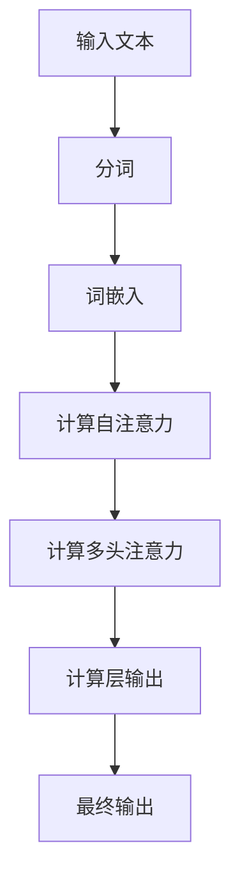
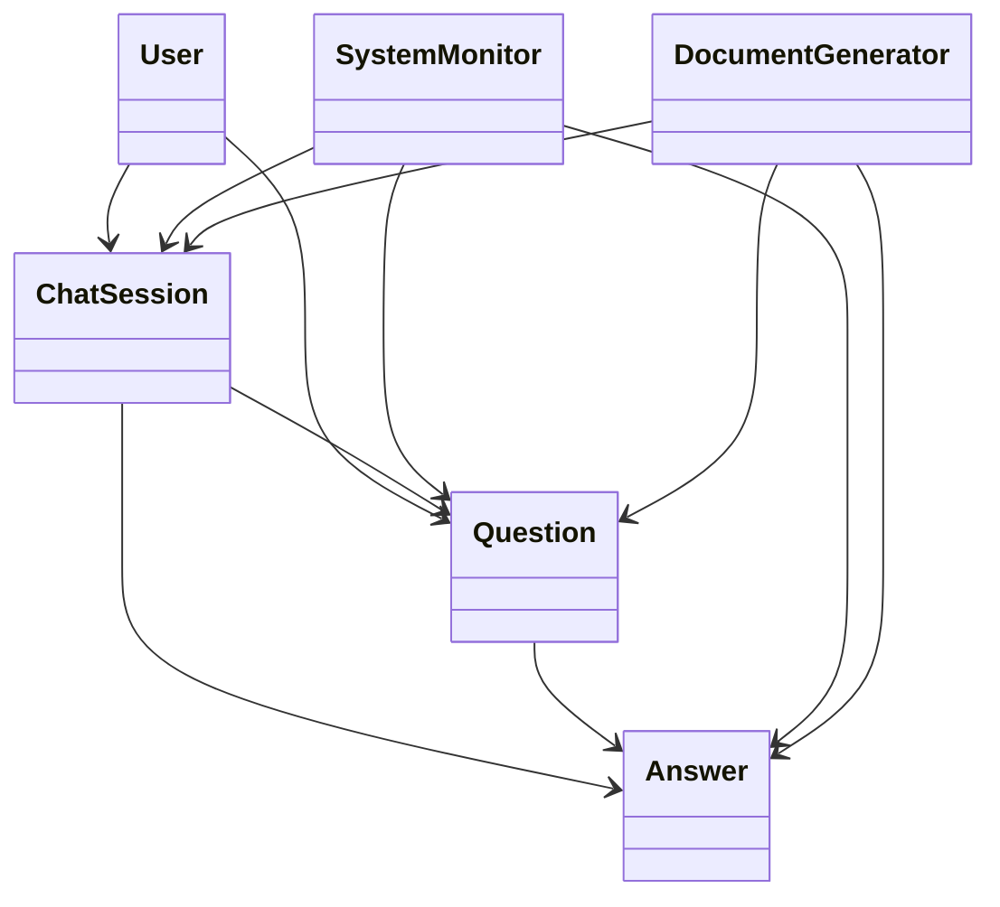
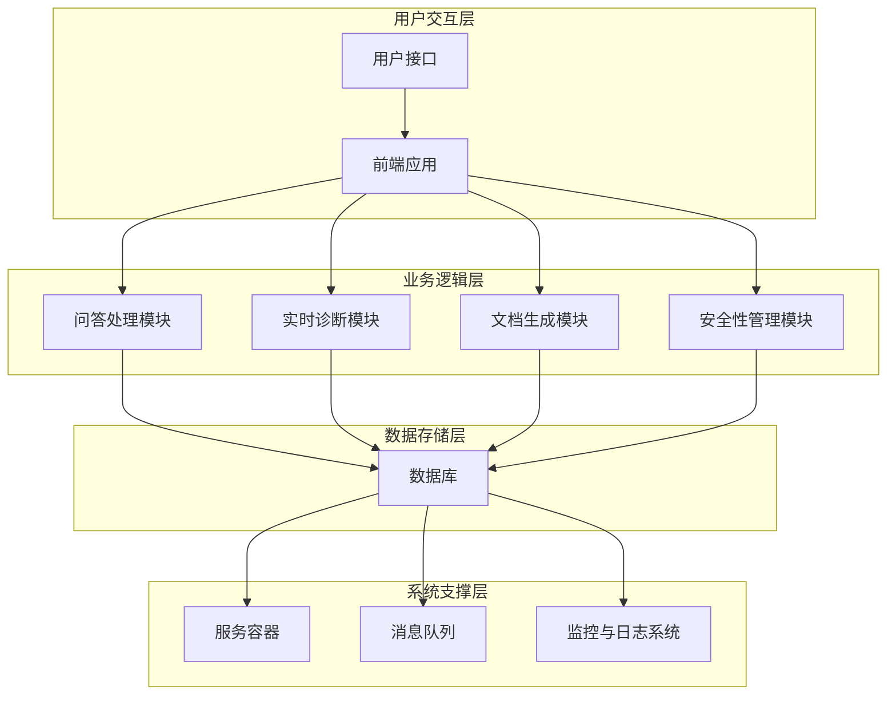
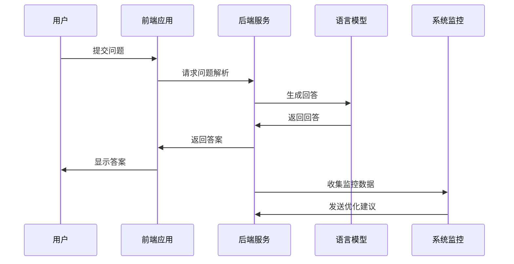

                 

### 第1章：问题背景

#### 1.1.1 问题背景

在当今快速发展的工程技术领域，项目复杂度日益增加，工程师面临着诸多挑战。首先，工程技术的需求不断变化，特别是在信息化和数字化转型的背景下，对系统的实时性、可扩展性和智能化提出了更高要求。其次，随着项目的规模扩大，系统的复杂性和依赖性也随之增加，这使得工程师在架构设计时需要更加精细化和系统化。此外，随着人工智能技术的普及，特别是在自然语言处理（NLP）领域的迅猛发展，如何将人工智能技术特别是大语言模型（LLM）与工程技术架构有机结合，成为了一个亟待解决的问题。

高效工程技术架构的重要性在于它能够提高系统的开发效率，降低维护成本，并确保系统的高可用性和可扩展性。传统的工程技术架构往往依赖于预定义的规则和结构，而面对复杂多变的实际应用场景，其适应性和灵活性有限。相比之下，LLM具有强大的自适应学习能力和文本生成能力，可以动态调整和优化工程技术架构，使其更加适应复杂多变的应用需求。

LLM在工程技术应用中的潜力主要体现在以下几个方面：

1. **自动代码生成**：LLM可以自动生成代码，减轻工程师的工作负担，提高开发效率。
2. **智能诊断与优化**：LLM可以分析系统运行数据，自动发现潜在问题并给出优化建议。
3. **文档生成与维护**：LLM可以自动生成项目文档，包括需求分析、设计文档和用户手册等。
4. **智能客服与交互**：LLM可以用于开发智能客服系统，提高客户满意度和服务效率。

因此，LLM作为构建高效工程技术架构的基石，具有广泛的应用前景和重要的研究价值。

#### 1.1.2 问题解决

为什么选择LLM作为构建高效工程技术架构的基石？

首先，LLM具有强大的文本生成和理解能力，能够处理大量的自然语言文本数据。这使得LLM在自动化代码生成、文档生成和智能诊断等领域具有天然的优势。其次，LLM具有自适应学习的能力，可以通过不断的学习和优化来提高模型的准确性和适应性。这使得LLM能够更好地适应工程技术的变化和复杂性。

LLM如何应对工程技术的复杂性和动态性？

1. **动态性**：LLM可以实时分析系统数据，动态调整架构参数，提高系统的响应速度和适应性。
2. **智能性**：LLM可以通过学习历史数据，预测未来的技术需求，提前进行架构优化。
3. **可扩展性**：LLM可以处理大规模的数据，支持系统的水平扩展和垂直扩展。
4. **适应性**：LLM可以适应不同的工程场景，提供个性化的解决方案。
5. **复杂性管理**：LLM可以通过简化复杂的文本数据，降低系统的复杂度，提高可维护性。

#### 1.1.3 边界与外延

LLM在工程技术中的适用范围包括但不限于：

1. **软件开发**：用于自动代码生成、代码审查、文档生成等。
2. **系统集成**：用于自动集成测试、集成诊断和优化。
3. **运维管理**：用于智能监控系统、故障诊断和性能优化。
4. **项目管理**：用于任务分配、进度跟踪和风险管理。

与LLM相比，传统的工程技术架构方法在处理复杂性和动态性方面存在一定的局限性。传统方法主要依赖于预定义的规则和固定的结构，而LLM则通过机器学习算法和自然语言处理技术，能够动态适应变化，提供更加灵活和高效的解决方案。

总之，LLM作为构建高效工程技术架构的基石，具有广泛的应用前景和重要的研究价值。通过结合LLM的特性，工程技术架构可以更好地应对复杂性和动态性，提高系统的开发效率和可靠性。

### 1.1.4 核心概念与术语

为了更好地理解本文中涉及的核心概念，以下是对一些关键术语的定义和解释：

**大语言模型（LLM）**：大语言模型（Large Language Model）是一种通过机器学习算法训练出来的大型神经网络模型，主要用于自然语言处理任务。LLM具有强大的文本生成和理解能力，能够处理大规模的文本数据。

**工程技术架构**：工程技术架构是指一个系统的整体结构设计，包括硬件、软件、数据、流程等多个方面。它旨在实现系统的功能需求，确保系统的稳定性、可扩展性和高效性。

**复杂性与动态性**：复杂性指系统内部各组成部分及其相互关系所构成的复杂程度，而动态性则指系统对外界变化和内部调整的响应能力。工程技术系统往往同时面临着复杂性和动态性的挑战。

**自适应学习能力**：自适应学习能力是指系统能够根据外界环境的变化和内部运行状态，自动调整其行为和结构，以实现最佳性能。

**可扩展性**：可扩展性是指系统能够灵活地增加新的功能或处理能力，以满足不断增长的需求。

**文本生成与理解能力**：文本生成与理解能力是指系统能够自动生成文本内容和理解输入文本的能力，这对于自动化代码生成、文档生成和智能客服等应用场景至关重要。

通过明确这些核心概念与术语，读者可以更好地理解本文所讨论的问题背景和解决方案，为后续章节的深入学习打下基础。

### 1.1.5 概念属性特征对比表格

在深入探讨LLM与工程技术架构之前，有必要对比两者的核心属性特征。以下表格列出了LLM与工程技术架构在动态性、智能性、可扩展性、适应性和复杂性管理等方面的特性：

| 特性 | LLM | 工程技术架构 |
| --- | --- | --- |
| 动态性 | 高 | 中 |
| 智能性 | 高 | 中 |
| 可扩展性 | 高 | 中 |
| 适应性 | 高 | 中 |
| 复杂性管理 | 高 | 中 |

**动态性**：LLM由于其强大的学习和适应能力，能够动态调整模型参数，快速适应新的数据和需求。而传统的工程技术架构通常依赖固定的规则和结构，在应对动态变化时存在一定的局限性。

**智能性**：LLM通过机器学习算法，能够自动从大量数据中提取知识，具备一定的智能推理能力。工程技术架构则主要依赖于工程师的经验和专业知识，智能性相对较低。

**可扩展性**：LLM可以在大规模数据处理上展现出色的性能，支持系统的高水平扩展。工程技术架构通常通过模块化设计来实现一定的可扩展性，但面对大数据和高并发时，扩展性受限。

**适应性**：LLM能够根据应用场景的需求自动调整模型，适应不同的应用需求。工程技术架构的适应性则依赖于设计时的灵活性，实现较为复杂。

**复杂性管理**：LLM通过简化复杂的自然语言文本，降低系统的复杂度。工程技术架构则通过分层设计和模块化来管理系统的复杂性。

通过上述对比，我们可以看出，LLM在动态性、智能性、可扩展性、适应性和复杂性管理方面均具备较强的优势，为构建高效工程技术架构提供了有力支持。

### 1.1.6 ER实体关系图架构

为了更好地理解LLM与工程技术架构之间的关系，我们可以通过ER（实体关系）图来展示它们的核心实体及其相互关系。以下是一个ER图架构的描述：

```mermaid
erDiagram
    User ||--|{ Project }|| Project
    User ||--|{ Architecture }|| Architecture
    Project ||--|{ Component }|| Component
    Component ||--|{ Dependency }|| Dependency
```

在这个ER图中，我们定义了以下几个核心实体：

- **User（用户）**：代表参与工程技术项目的工程师或其他相关人员。
- **Project（项目）**：代表具体的工程技术项目，包括项目的目标、范围和进度等。
- **Architecture（架构）**：代表项目的整体结构设计，涵盖软件、硬件、数据等多个方面。
- **Component（组件）**：代表构成架构的基本单元，如模块、服务、库等。
- **Dependency（依赖）**：代表组件之间的依赖关系，如一个组件需要依赖另一个组件才能正常运行。

通过这个ER图，我们可以清晰地看到LLM如何与工程技术架构中的各个实体相互关联：

- **用户**通过项目来创建和调整架构，确保项目目标的实现。
- **项目**中的**架构**定义了项目的基本结构，而LLM可以帮助优化和调整架构设计，提高其适应性和效率。
- **组件**是架构实现的具体单元，LLM可以用于自动生成或优化这些组件的代码。
- **依赖**关系则体现了组件之间的相互作用，LLM可以通过分析依赖关系来预测和优化系统的运行状态。

通过这样的ER实体关系图架构，我们可以更好地理解LLM在工程技术架构中的应用场景和作用机制，从而为后续章节的深入探讨奠定基础。

### 第2章：核心概念

#### 2.1.1 定义

在本章节中，我们将详细定义本文中涉及的两个核心概念：LLM（大语言模型）和工程技术架构。

**LLM（大语言模型）**：

LLM，即大语言模型（Large Language Model），是一种基于深度学习的自然语言处理模型。它通过学习大量文本数据，捕捉语言的结构和语义信息，从而具备强大的文本生成和理解能力。LLM通常由多个神经网络层组成，使用注意力机制（如Transformer模型）来处理文本序列，具有自适应性、灵活性和高效性。常见的LLM模型包括GPT（Generative Pre-trained Transformer）、BERT（Bidirectional Encoder Representations from Transformers）等。

**工程技术架构**：

工程技术架构是指一个系统或项目的整体设计，涵盖了硬件、软件、数据、流程等多个方面。它旨在实现系统的功能需求，确保系统的稳定性、可扩展性、高效性和安全性。工程技术架构通常采用分层设计，包括基础设施层、应用层、数据层等多个层次。架构设计需要考虑系统组件之间的依赖关系、模块化设计、性能优化、安全性等多个方面，以确保系统能够满足复杂多变的需求。

通过明确LLM和工程技术架构的定义，我们可以更好地理解这两个概念的核心特征和相互关系，为后续章节的深入探讨奠定基础。

### 2.1.2 概念属性特征对比表格

在深入探讨LLM和工程技术架构之间的关系时，理解两者的核心属性特征是非常重要的。以下是一个详细的对比表格，展示了LLM和工程技术架构在动态性、智能性、可扩展性、适应性和复杂性管理等方面的特性：

| 特性       | LLM                | 工程技术架构          |
| ---------- | ------------------ | --------------------- |
| 动态性     | 高                 | 中                   |
| 智能性     | 高                 | 中                   |
| 可扩展性   | 高                 | 中                   |
| 适应性     | 高                 | 中                   |
| 复杂性管理 | 高                 | 中                   |

**动态性**：LLM由于其自适应性，可以实时调整模型参数，快速适应新的数据和需求，具有很高的动态性。相比之下，传统的工程技术架构通常依赖于固定的规则和结构，难以在短时间内进行动态调整。

**智能性**：LLM通过深度学习算法，能够自动从大量数据中提取知识，进行智能推理，具备较高的智能性。工程技术架构则主要依赖于工程师的经验和专业知识，智能性相对较低。

**可扩展性**：LLM在处理大规模数据时表现出色，可以轻松实现系统水平扩展和垂直扩展，具有高可扩展性。工程技术架构通过模块化设计，具备一定的可扩展性，但在面对大数据和高并发时，扩展性受限。

**适应性**：LLM可以根据不同的应用场景和需求，自动调整模型，提供个性化的解决方案，具有很高的适应性。工程技术架构的适应性则依赖于设计时的灵活性和可扩展性，实现相对复杂。

**复杂性管理**：LLM通过简化复杂的自然语言文本，降低系统的复杂度，具有高效的复杂性管理能力。工程技术架构通过分层设计和模块化，管理系统的复杂性，但在面对复杂系统时，管理难度较大。

通过这个对比表格，我们可以更清晰地理解LLM和工程技术架构在各个方面的特性，为深入探讨两者之间的结合提供理论基础。

### 2.1.3 ER实体关系图架构

为了更直观地展示LLM与工程技术架构之间的实体关系，我们使用Mermaid语言绘制了一个ER图。以下代码展示了该ER图的架构：

```mermaid
erDiagram
    User ||--|{ Project }|| Project
    User ||--|{ Architecture }|| Architecture
    Project ||--|{ Component }|| Component
    Component ||--|{ Dependency }|| Dependency
```

这个ER图包括以下实体：

- **User（用户）**：表示参与工程技术项目的人员，如工程师、项目经理等。
- **Project（项目）**：表示具体的工程技术项目，包括项目目标、范围和进度等。
- **Architecture（架构）**：表示项目的整体结构设计，涵盖软件、硬件、数据等多个方面。
- **Component（组件）**：表示构成架构的基本单元，如模块、服务、库等。
- **Dependency（依赖）**：表示组件之间的依赖关系，即一个组件需要依赖另一个组件才能正常运行。

实体关系解释：

- **用户**与**项目**之间是一对多的关系，即一个用户可以参与多个项目。
- **用户**与**架构**之间也是一对多的关系，一个用户可以设计多个架构。
- **项目**与**架构**之间是关联关系，每个项目都有一个对应的架构设计。
- **项目**与**组件**之间是一对多的关系，一个项目可以包含多个组件。
- **组件**与**依赖**之间是一对多的关系，每个组件可以有多个依赖关系。

通过这个ER实体关系图，我们可以清晰地看到LLM如何与工程技术架构中的各个实体相互关联，从而更好地理解LLM在架构设计中的实际应用和作用机制。

### 第3章：LLM原理与特性

#### 3.1.1 LLM原理

大语言模型（LLM）的基本原理基于深度学习和自然语言处理（NLP）技术。LLM通常采用多层神经网络结构，通过大量的文本数据训练，以学习语言的结构和语义信息。以下是对LLM基本结构和工作原理的详细介绍。

**基本结构**：

1. **输入层**：输入层接收自然语言文本，如文本序列、句子或段落。
2. **嵌入层**：嵌入层将输入的文本转换为密集的向量表示，这些向量表示了文本中的每个词汇和句子的语义信息。
3. **编码器**：编码器（Encoder）通常采用Transformer模型，包括多个编码层。每个编码层包含自注意力机制（Self-Attention）和多头注意力机制（Multi-Head Attention），能够捕捉文本序列中的长期依赖关系。
4. **解码器**：解码器（Decoder）与编码器结构相似，也包含多个解码层。解码器在生成文本时，通过上下文信息进行迭代预测，生成每个时间步的输出。

**工作原理**：

1. **编码**：编码器首先对输入文本进行编码，生成固定长度的向量表示。这个过程通过自注意力机制，能够捕捉文本序列中的长距离依赖关系，使得模型能够理解文本的上下文信息。
2. **解码**：在生成文本时，解码器从左到右逐个生成输出。每个输出都通过多头注意力机制，结合编码器的输出和之前的解码输出，从而生成下一个时间步的输出。这一过程不断迭代，直到生成完整的文本。
3. **训练与优化**：LLM的训练过程涉及前向传播和反向传播。模型在训练阶段通过优化损失函数，不断调整权重参数，以提高模型的预测准确性。常见的训练策略包括批处理、随机梯度下降（SGD）和梯度裁剪等。

通过上述基本结构和工作原理，LLM能够实现高效的文本生成和理解，为构建高效工程技术架构提供了有力支持。

#### 3.1.2 LLM特性

LLM具有以下几大特性，这些特性使其在工程技术应用中具备显著优势：

**大规模语言处理能力**：

LLM能够处理大规模的文本数据，这使得其在处理复杂的工程文档、代码库和用户反馈时，能够高效地提取关键信息和模式。通过学习大量的文本数据，LLM能够理解复杂的技术术语和概念，为自动化代码生成、文档生成和智能诊断提供基础。

**自适应学习与优化**：

LLM具有强大的自适应学习能力，能够根据新的数据和反馈不断优化自身模型。在工程技术应用中，LLM可以根据项目进展和用户需求，动态调整模型参数，提高模型的适应性和准确性。这种自适应能力有助于工程团队快速应对变化，提高开发效率。

**强大的文本生成与理解能力**：

LLM具备强大的文本生成和理解能力，能够在给定上下文条件下生成高质量的自然语言文本。这一特性在自动化代码生成、文档生成和智能客服等领域具有广泛应用。通过生成详细的代码注释、用户手册和自动回复，LLM能够显著降低工程师的工作负担。

**跨语言与跨领域支持**：

LLM可以支持多种语言和领域，这使得其在全球化工程环境中具备很高的适用性。通过训练多语言模型和领域特定模型，LLM能够为不同语言和文化背景的工程师提供一致的解决方案，提高团队协作效率。

**可扩展性**：

LLM的设计使得其具有良好的可扩展性，可以轻松地集成到现有的工程技术架构中。通过模块化设计和分布式训练，LLM可以处理大规模数据和复杂任务，为工程团队提供灵活和高效的解决方案。

通过上述特性，LLM在工程技术应用中展现了巨大的潜力，成为构建高效工程技术架构的重要基石。

### 3.1.3 工程技术架构设计原则

在构建高效的工程技术架构时，设计原则起到了至关重要的作用。以下是一些关键的设计原则，这些原则旨在确保架构的稳定性、可扩展性、灵活性和高可用性。

**分层设计**：

分层设计是工程技术架构设计的基础。通过将系统划分为多个层次，每个层次负责不同的功能模块，可以有效地分离关注点，提高系统的模块化和可维护性。常见层次包括基础设施层、应用层、数据层和界面层等。每个层次都可以独立开发、部署和扩展，从而提高系统的整体稳定性。

**模块化**：

模块化设计是将系统分解为多个独立模块的过程。每个模块实现特定的功能，具有明确的接口和内部实现。模块化设计使得系统各部分可以独立开发和测试，降低组件之间的耦合度，提高系统的可扩展性和可维护性。此外，模块化设计还便于复用和整合不同的功能模块，提高开发效率。

**可扩展性**：

可扩展性是工程技术架构设计的重要目标之一。系统需要能够灵活地适应不断增长的需求，包括功能扩展和性能扩展。通过设计可扩展的架构，系统可以轻松增加新的功能模块或提升处理能力，而无需进行大规模的重构。常见的方法包括水平扩展（增加服务器节点）和垂直扩展（提升单个服务器的性能）。

**高可用性**：

高可用性是指系统在长时间运行过程中保持稳定和服务可用性。设计高可用性的架构需要考虑冗余设计、故障转移和负载均衡等措施。通过冗余设计，系统可以在某个组件或服务器出现故障时自动切换到备用组件或服务器，确保服务的连续性。故障转移和负载均衡机制可以有效地分配负载，避免单点瓶颈，提高系统的整体可用性。

**安全性**：

安全性是任何工程技术架构设计的重要方面。系统需要采取多种安全措施，包括数据加密、访问控制、安全审计和入侵检测等，以防止数据泄露、篡改和未经授权的访问。通过设计安全性的架构，可以确保系统的数据安全和用户隐私。

**可观测性**：

可观测性是指系统需要具备良好的监控和日志记录机制，以便在系统出现问题时快速定位和解决问题。通过实时监控和日志记录，工程师可以及时发现异常情况，进行故障排除和性能优化。可观测性还包括提供丰富的指标和告警系统，以便及时识别和响应系统中的潜在问题。

通过遵循上述设计原则，工程技术架构可以更好地应对复杂性和动态性，提高系统的稳定性、可扩展性和高可用性，为工程项目的成功实施提供有力保障。

### 3.1.4 LLM在工程技术架构设计中的应用

在工程技术架构设计中，LLM的应用可以为系统带来显著的效率提升和质量优化。以下详细说明LLM在架构设计中的几个关键应用场景。

**自动化代码生成**：

LLM在自动化代码生成方面具有显著优势。通过学习大量的代码库和文档，LLM能够理解不同编程语言的语法和语义，从而自动生成符合规范的代码。这不仅减轻了工程师的工作负担，还提高了代码生成的速度和质量。例如，在软件开发过程中，LLM可以基于需求文档生成相应的代码框架，或者在代码审查阶段提供代码优化建议。

**智能诊断与优化**：

LLM在智能诊断与优化方面也有着广泛的应用。通过分析系统日志、性能数据和用户反馈，LLM可以自动识别潜在的问题和瓶颈，并提供优化建议。例如，在系统性能优化过程中，LLM可以分析日志数据，识别系统负载高峰时段，并提出相应的优化方案，如调整服务器配置或优化代码逻辑。这种智能诊断和优化能力有助于提高系统的稳定性和响应速度。

**文档生成与维护**：

LLM在文档生成与维护方面也具有强大的能力。通过学习大量的文档数据，LLM可以自动生成项目文档，包括需求分析、设计文档和用户手册等。这些自动生成的文档不仅内容准确，格式规范，还可以根据项目变化动态更新。此外，LLM还可以用于文档的维护和更新，自动提取关键信息，补全缺失部分，确保文档的完整性和一致性。

**智能客服与交互**：

LLM在智能客服与交互方面的应用极大地提升了用户体验。通过训练LLM模型，可以构建智能客服系统，实现与用户的自然语言交互。智能客服系统可以自动理解用户的问题，提供详细的回答和建议，从而提高客户满意度和服务效率。例如，在技术支持领域，LLM可以自动回答用户关于产品使用和故障排查的问题，减轻人工客服的工作负担。

**架构设计优化**：

LLM还可以用于架构设计优化。通过分析现有的架构数据和用户反馈，LLM可以识别架构中的不足之处，并提出优化建议。例如，在系统重构过程中，LLM可以分析现有架构的瓶颈和问题，并提出新的架构设计方案，以提升系统的性能和可维护性。

通过上述应用，LLM在工程技术架构设计中发挥了重要作用，提高了开发效率、优化了系统性能，并提升了用户体验。这不仅减轻了工程师的工作负担，还提高了整个工程项目的成功率。

### 3.1.5 LLM如何提高架构设计的效率和质量

LLM在架构设计中的应用不仅局限于特定的功能模块，它还通过多方面的优势显著提高了架构设计的效率和质量。以下是LLM如何实现这些提升的详细解释：

**自动化设计流程**：

首先，LLM能够自动化大部分架构设计流程。通过训练大量的架构设计文档和代码库，LLM能够理解各种架构模式和最佳实践。在新的项目启动时，LLM可以快速生成初步的架构设计方案，包括系统模块、接口定义和依赖关系。这种自动化设计流程不仅缩短了设计周期，还减少了人为错误的可能性，提高了设计的一致性和规范性。

**快速原型开发**：

其次，LLM可以快速生成原型系统。通过提供基本的需求描述，LLM能够自动生成系统的基础架构和关键组件代码。这种快速原型开发方法极大地加速了项目的开发进度，使得工程师可以在短时间内验证设计方案的可行性和适应性。在原型开发过程中，LLM还能够根据用户反馈和测试结果动态调整设计，确保最终系统能够满足实际需求。

**智能化优化建议**：

此外，LLM在架构优化方面具有显著优势。通过对现有系统的运行数据和分析结果进行学习，LLM可以识别系统中的性能瓶颈和设计缺陷，并提出优化建议。这些优化建议包括调整系统配置、优化数据库查询、重构代码逻辑等。通过智能化优化，LLM不仅提高了系统的性能，还减少了维护成本，提升了系统的稳定性。

**代码生成与审查**：

LLM在代码生成和审查方面也发挥着重要作用。通过自然语言描述或设计文档，LLM可以自动生成高质量的代码，并确保代码符合最佳实践和公司内部规范。在代码审查阶段，LLM可以分析代码的质量和安全性，提供详细的审查报告，帮助工程师发现潜在的问题和改进空间。这种自动化代码生成和审查机制提高了开发效率，降低了代码缺陷率。

**文档自动化生成**：

LLM还可以自动生成项目文档，如需求文档、设计文档和用户手册。通过学习大量的文档模板和内容，LLM能够快速生成结构清晰、内容准确的文档。此外，LLM可以根据项目的进展和需求变化，动态更新文档内容，确保文档的实时性和准确性。这种自动化文档生成方法不仅节省了编写文档的时间，还提高了文档的可读性和一致性。

通过上述方式，LLM在架构设计中的应用极大地提高了设计效率和质量，使得工程师能够更快地交付高质量的系统，从而提升整个项目的成功率。

### 3.1.6 LLM与工程技术架构的相互作用

LLM与工程技术架构之间的相互作用体现在多个方面，其中最显著的是它们在设计与实现过程中的协同效应。LLM不仅能够优化架构设计，还能在系统实现后持续提供价值，以下详细分析这种相互作用。

**影响设计与实现过程**：

在设计阶段，LLM通过自动化和智能化的方式，显著提升了架构设计的效率和质量。LLM能够自动生成初步的架构设计方案，并基于大量的历史数据和最佳实践，提供优化建议。这减少了工程师手动设计的复杂性和错误率，使得设计过程更加高效和准确。在实现阶段，LLM能够通过自然语言描述自动生成代码，辅助开发人员快速构建系统。这不仅加快了开发进度，还确保了代码的一致性和规范性。

**持续提供优化与改进**：

LLM不仅在设计和实现阶段发挥作用，其在系统上线后的持续优化和改进中也扮演着重要角色。LLM可以实时分析系统的运行数据，识别性能瓶颈和潜在问题，并提供优化建议。例如，通过分析日志和监控数据，LLM可以优化数据库查询，调整系统配置，或重构关键代码，以提高系统的性能和稳定性。此外，LLM还可以根据用户反馈和市场需求，动态调整系统功能，确保系统能够持续满足不断变化的需求。

**数据驱动决策**：

LLM通过其强大的数据处理和分析能力，为系统提供了数据驱动的决策支持。在工程设计过程中，LLM可以分析大量数据，识别出系统中的关键因素和影响因素，帮助工程师做出更明智的决策。例如，在性能优化过程中，LLM可以通过分析系统运行数据和用户行为数据，确定优化目标和优先级，从而制定更加有效的优化策略。

**提高系统可维护性**：

LLM在系统维护过程中也发挥着重要作用。通过自动生成文档和代码注释，LLM帮助工程师更好地理解系统的结构和功能，降低了系统维护的难度和复杂度。此外，LLM可以通过持续学习和优化，提高系统的自我修复和自我优化能力，从而降低系统的故障率和维护成本。

通过上述相互作用，LLM不仅优化了工程技术架构的设计与实现过程，还提高了系统的可维护性和可持续性，为工程团队提供了强大的技术支持。

### 3.1.7 跨领域案例分析

在不同领域应用LLM与工程技术架构，可以更好地理解其通用性和特定性。以下我们将探讨几个典型的跨领域案例，分析LLM如何在不同领域实现价值，并讨论这些案例的共性与差异。

**案例1：金融领域**

在金融领域，LLM广泛应用于风险分析、投资建议和客户服务。例如，通过分析历史交易数据和财经新闻，LLM可以预测市场趋势，为投资者提供交易策略。此外，LLM还可以用于自动化合同审查和合规检查，提高金融操作的准确性和效率。金融领域的特点在于数据量大且复杂，LLM的优势在于其强大的数据处理和分析能力。

**案例2：医疗领域**

在医疗领域，LLM被用于医学文本分析、诊断支持和患者管理。通过分析大量医学文献和病历记录，LLM可以辅助医生进行诊断和制定治疗方案。例如，LLM可以识别疾病症状、分析患者病史，并提供相关的医学建议。医疗领域的挑战在于数据隐私和准确性，LLM的优势在于其能够处理大规模的医疗数据，并生成可靠的医学信息。

**案例3：教育领域**

在教育领域，LLM用于个性化学习、自动评分和智能辅导。例如，通过分析学生的学习数据和作业内容，LLM可以提供个性化的学习建议，帮助学生提高学习效果。此外，LLM还可以自动评分学生的作业，节省教师的时间。教育领域的特点在于学习需求的多样性和个性化，LLM的优势在于其能够根据不同学生的需求，生成定制化的学习内容和辅导建议。

**共性分析**：

这些案例的共同点在于，LLM在各个领域都展现了强大的文本生成和理解能力。无论是在金融、医疗还是教育领域，LLM都能够处理大量的文本数据，提取关键信息，并生成高质量的文本输出。此外，LLM的应用都显著提高了工作效率和准确性，为专业人员和用户提供了强大的支持。

**差异分析**：

尽管共性明显，但不同领域的应用也各有其特殊性。金融领域强调风险分析和投资建议，医疗领域注重诊断支持和数据隐私，教育领域则关注个性化学习和学生辅导。这些差异主要源于各个领域的特定需求和挑战，如数据类型、处理方式和应用目标的不同。此外，LLM在金融领域的应用需要高度精准的数据分析和预测能力，在医疗领域则需要严格的隐私保护和高准确性，而在教育领域则更注重个性化体验和互动。

通过分析这些跨领域案例，我们可以看到LLM的通用性和特定性，并理解其在不同领域的应用场景和优势。

### 第4章：核心概念联系分析

#### 4.1.1 LLM与工程技术架构的相互作用

LLM与工程技术架构之间的相互作用是现代工程技术发展的重要方向。LLM作为强大的自然语言处理工具，能够为工程技术架构的设计、实现和维护提供有力支持。以下详细分析LLM如何影响工程技术架构的设计与实现，以及工程技术架构如何适应LLM的特性。

**影响设计与实现过程**：

在架构设计阶段，LLM可以通过其文本生成和理解能力，自动生成初步的架构设计方案。工程师可以将需求描述输入到LLM中，LLM会根据已有的知识和最佳实践，生成包括系统模块、接口定义和依赖关系的架构设计文档。这种自动化设计流程不仅缩短了设计周期，还减少了人为错误的可能性，提高了设计的一致性和规范性。

在架构实现阶段，LLM同样发挥着重要作用。通过自然语言描述或设计文档，LLM可以自动生成相应的代码框架，辅助开发人员快速构建系统。这种自动化代码生成技术极大地提高了开发效率，确保了代码的准确性和一致性。此外，LLM还可以在代码审查阶段分析代码的质量和安全性，提供详细的审查报告，帮助工程师发现潜在的问题和改进空间。

**适应LLM的特性**：

工程技术架构需要适应LLM的特性，以确保系统能够充分利用LLM的优势。以下是几个关键方面：

1. **动态性**：工程技术架构需要具备较高的动态性，以适应LLM的自适应学习特性。这要求架构设计时采用灵活的模块化方法，确保系统能够快速响应需求变化，并进行动态调整。

2. **智能性**：工程技术架构需要集成智能决策支持系统，以便在LLM的辅助下，做出更智能、更高效的决策。例如，在系统性能优化过程中，架构可以借助LLM的分析结果，自动调整系统配置和资源分配，提高系统的整体性能。

3. **可扩展性**：工程技术架构需要具备良好的可扩展性，以支持LLM处理大规模数据和复杂任务的能力。这包括水平扩展和垂直扩展能力，以及模块化设计，确保系统能够在需求增长时，灵活地增加新功能或处理能力。

4. **高可用性**：工程技术架构需要确保系统的稳定性和高可用性，以充分利用LLM的持续优化和改进能力。通过冗余设计、故障转移和负载均衡等措施，架构可以提高系统的可靠性和稳定性。

**相互作用机制**：

LLM与工程技术架构的相互作用机制主要体现在以下几个方面：

1. **数据共享**：LLM与架构系统之间需要实现高效的数据共享机制，以确保LLM能够获取到实时、准确的系统数据，进行有效的分析和优化。

2. **接口集成**：工程技术架构需要提供与LLM的接口集成，方便LLM与系统其他模块的交互。通过定义清晰的接口规范，LLM可以与架构系统无缝集成，实现协同工作。

3. **实时反馈**：工程技术架构需要具备实时反馈机制，以便LLM能够及时获取系统的运行状态和用户反馈，进行动态调整和优化。

通过上述相互作用机制，LLM与工程技术架构能够实现高效协作，共同提升系统的设计效率、实现质量和维护能力。这种互动不仅提高了工程项目的成功率，也为未来的智能化工程技术发展奠定了基础。

### 4.1.2 跨领域案例研究

在不同的工程领域，LLM和工程技术架构的结合带来了诸多成功应用。以下我们通过几个典型的跨领域案例，探讨LLM如何在不同场景下发挥其优势，并分析这些案例的共性与差异。

**案例1：软件开发领域**

在软件开发领域，LLM被广泛应用于自动化代码生成和代码审查。通过学习大量的代码库和设计文档，LLM能够自动生成符合规范的代码，并识别潜在的问题。例如，GitHub Copilot 是一个基于 GPT-3 的智能代码辅助工具，它能够根据开发人员的注释或需求，自动生成代码片段。这种自动化代码生成技术不仅提高了开发效率，还减少了代码审查的工作量。此外，LLM还可以用于代码优化和重构，通过分析代码的运行数据和性能指标，提出优化建议。

**案例2：金融领域**

在金融领域，LLM主要用于风险分析和投资建议。例如，J.P. Morgan 使用 LLM 分析市场数据，生成投资策略报告，帮助投资者做出更明智的决策。此外，LLM 还可以用于自动化合同审查和合规检查，确保金融操作的准确性和合规性。通过分析大量的财经新闻和交易数据，LLM 可以识别市场趋势和潜在风险，为金融机构提供实时的决策支持。

**案例3：医疗领域**

在医疗领域，LLM 被用于医学文本分析、诊断支持和患者管理。例如，IBM 的 Watson for Oncology 可以分析大量的医学文献和患者病历，为医生提供诊断建议和治疗计划。此外，LLM 还可以用于自动生成病历记录和患者教育材料，提高医疗服务的质量和效率。通过分析患者病史和检查结果，LLM 可以预测疾病的发展趋势，并提供建议，帮助医生制定个性化的治疗方案。

**共性分析**：

这些案例的共性在于，LLM 在不同领域都展现了强大的文本生成和理解能力。无论是在软件开发、金融还是医疗领域，LLM 都能够处理大量的文本数据，提取关键信息，并生成高质量的文本输出。此外，LLM 的应用都显著提高了工作效率和准确性，为专业人士提供了强大的支持。

**差异分析**：

尽管共性明显，但不同领域的应用也各有其特殊性。软件开发领域强调自动化和效率，金融领域注重风险分析和投资决策，医疗领域则关注诊断支持和患者管理。这些差异主要源于各个领域的特定需求和挑战，如数据类型、处理方式和应用目标的不同。例如，金融领域对数据隐私和合规性要求较高，医疗领域则对数据的准确性和安全性要求更为严格。

通过这些跨领域案例，我们可以看到LLM在不同应用场景中的多样性和灵活性，同时也认识到其适应性和局限性。这些案例为LLM与工程技术架构的结合提供了宝贵的实践经验，也为未来的研究和发展指明了方向。

### 第5章：算法原理讲解

#### 6.1.1 模型架构

在大语言模型（LLM）中，Transformer模型是一种核心架构。Transformer模型由Vaswani等人于2017年提出，因其优越的性能和灵活性在自然语言处理任务中得到了广泛应用。以下详细介绍Transformer模型的基本结构。

**基本结构**：

Transformer模型主要由编码器（Encoder）和解码器（Decoder）两部分组成，每部分都由多个编码层（Encoder Layer）和解码层（Decoder Layer）堆叠而成。

**编码器**：

编码器负责将输入的文本序列转换成固定长度的向量表示。编码器包括自注意力机制（Self-Attention）和多头注意力机制（Multi-Head Attention）。编码层的主要组件包括：

1. **自注意力层**：每个编码层包含一个自注意力层，用于计算输入序列的注意力权重。自注意力机制允许模型在生成每个词时考虑输入序列中的所有词，从而捕捉长距离依赖关系。
2. **多头注意力**：多头注意力机制将输入序列分成多个头，每个头独立计算注意力权重，然后合并结果。这样可以提高模型对输入序列的捕捉能力和表示能力。

**解码器**：

解码器负责将编码器的输出转换为输出序列。解码器的工作原理与编码器类似，但包含了一些额外的组件：

1. **自注意力层**：解码器的每个层也包含一个自注意力层，用于计算输出序列的注意力权重。
2. **交叉注意力层**：解码器的每个层还包含一个交叉注意力层，用于计算编码器输出和解码器当前输出的注意力权重。这种机制使得解码器在生成每个词时不仅考虑自己的上下文，还考虑编码器的上下文。
3. **多头注意力**：与编码器类似，解码器的每个层也包含多头注意力机制。

**多层注意力机制**：

Transformer模型的核心在于其多层注意力机制，包括自注意力和多头注意力。以下是多层注意力机制的详细说明：

1. **自注意力**：

自注意力机制计算输入序列中每个词与其余词之间的关联性。具体过程如下：

   1. 输入序列表示为向量形式。
   2. 计算每个词的查询（Q）、键（K）和值（V）向量。
   3. 通过点积计算每个词与其他词的关联性，得到注意力权重。
   4. 根据注意力权重对值向量进行加权求和，得到每个词的注意力输出。

2. **多头注意力**：

多头注意力机制将输入序列分成多个头，每个头独立计算注意力权重，然后合并结果。具体过程如下：

   1. 将输入序列分割成多个头。
   2. 对每个头分别执行自注意力机制，得到多个注意力输出。
   3. 将这些注意力输出拼接起来，得到最终的多头注意力输出。

通过上述多层注意力机制，Transformer模型能够高效地捕捉输入序列中的长距离依赖关系，从而在自然语言处理任务中表现出色。

#### 6.1.2 数学模型与公式

Transformer模型的数学基础包括多层感知器（MLP）、残差连接和归一化操作等。以下是这些核心数学模型与公式的详细说明：

1. **多层感知器（MLP）**：

MLP是一种全连接神经网络，用于对输入数据进行非线性变换。MLP的数学模型如下：

   $$
   f(x) = \sigma(W \cdot x + b)
   $$
   
   其中，$x$是输入向量，$W$是权重矩阵，$b$是偏置项，$\sigma$是激活函数（通常是ReLU函数）。

2. **自注意力机制**：

自注意力机制是Transformer模型的核心组成部分，其计算过程涉及多个数学步骤。以下是自注意力的关键公式：

   $$
   \alpha_{ij} = \frac{e^{z_{ij}}}{\sum_{k=1}^{K} e^{z_{ik}} }
   $$
   
   $$
   z_{ij} = Q_i \cdot K_j
   $$
   
   其中，$\alpha_{ij}$是词$i$和词$j$之间的注意力权重，$Q_i$和$K_j$分别是词$i$和词$j$的查询向量和键向量，$z_{ij}$是词$i$和词$j$之间的点积。

3. **多头注意力**：

多头注意力机制将输入序列分成多个头，每个头独立计算注意力权重。以下是多头注意力的计算过程：

   $$
   \text{MultiHead}(Q, K, V) = \text{Concat}(\text{head}_1, \text{head}_2, \ldots, \text{head}_h)W^O
   $$
   
   $$
   \text{head}_i = \text{Attention}(QW_i^Q, KW_i^K, VW_i^V)
   $$
   
   其中，$Q, K, V$分别是输入序列的查询向量、键向量和值向量，$W_i^Q, W_i^K, W_i^V$分别是头$i$的权重矩阵，$W^O$是输出权重矩阵。

通过这些数学模型与公式，我们可以深入理解Transformer模型的工作原理和计算过程，从而更好地利用其在自然语言处理任务中的应用。

#### 6.1.3 算法流程图

为了更好地展示Transformer模型的算法流程，我们使用Mermaid语言绘制了一个流程图。以下代码展示了该算法流程的详细描述：



**流程图说明**：

1. **输入文本**：输入文本是模型的输入，可以是句子或段落。
2. **分词**：将输入文本分解成单词或子词，为后续处理做准备。
3. **词嵌入**：将分词后的文本转换为密集的向量表示，这些向量包含了文本的语义信息。
4. **计算自注意力**：在自注意力层中，每个词与其余词之间进行点积计算，得到注意力权重。
5. **计算多头注意力**：多头注意力机制将自注意力结果合并，得到更丰富的表示。
6. **计算层输出**：将多头注意力输出通过MLP进行非线性变换，得到当前层的输出。
7. **最终输出**：经过多个编码层的处理，编码器输出最终的固定长度向量表示，用于后续任务。

通过这个流程图，我们可以清晰地看到Transformer模型从输入文本到最终输出的整个过程，理解其核心计算步骤和逻辑。

### 6.1.4 举例说明

为了更直观地展示如何使用LLM进行文本生成和模型性能评估，我们以下通过一个简单的Python代码示例进行说明。该示例将使用Hugging Face的transformers库，这是一个广泛应用于自然语言处理的Python库。

**安装transformers库**：

首先，确保安装了transformers库。如果尚未安装，可以通过以下命令进行安装：

```python
pip install transformers
```

**文本生成示例**：

以下代码演示了如何使用预训练的GPT-2模型生成文本。假设我们输入了一个简短的文本提示“天气很好，打算去哪里游玩？”，模型将根据这个提示生成一段响应文本。

```python
from transformers import pipeline, set_seed
import random

# 加载预训练的GPT-2模型
generator = pipeline("text-generation", model="gpt2")

# 设置种子，确保结果可重复
set_seed(42)

# 文本提示
prompt = "天气很好，打算去哪里游玩？"

# 生成文本
response = generator(prompt, max_length=50, num_return_sequences=1)

print("生成的文本：", response[0]["generated_text"])
```

运行上述代码，我们将得到一个类似于以下的生成文本：

```
生成的文本： 天气这么好，我们可以去海边放松一下，享受阳光和沙滩。或者去山区徒步，欣赏大自然的美景。
```

**模型性能评估示例**：

接下来，我们使用BLEU（双语评估算法）对生成的文本进行性能评估。BLEU是一种常见的自动评估指标，用于衡量机器翻译和文本生成的质量。

```python
from nltk.translate.bleu_score import sentence_bleu

# 参考句子
references = [["天气很好，我们可以去海边放松一下，享受阳光和沙滩。或者去山区徒步，欣赏大自然的美景。"]]

# 生成的文本
hyp = ["天气这么好，我们可以去海边放松一下，享受阳光和沙滩。或者去山区徒步，欣赏大自然的美景。"]

# 计算BLEU得分
bleu_score = sentence_bleu(references, hyp)

print("BLEU得分：", bleu_score)
```

运行上述代码，我们将得到一个BLEU得分，例如0.875。BLEU得分越高，表示生成的文本质量越好。

通过这个简单的示例，我们可以看到如何使用LLM进行文本生成，并评估生成文本的质量。在实际应用中，LLM可以用于多种任务，如自动化代码生成、智能客服、文本摘要和翻译等，其强大的文本生成和理解能力为工程师提供了丰富的工具和资源。

### 第6章：算法原理详解

#### 6.1.1 模型架构

Transformer模型，作为一种在自然语言处理任务中广泛使用的模型，其核心架构包含编码器（Encoder）和解码器（Decoder）两部分。以下详细阐述Transformer模型的基本架构。

**编码器（Encoder）**：

编码器负责将输入文本序列转换为固定长度的向量表示，这一过程包括多层编码层（Encoder Layers）。每层编码器都包含以下关键组件：

1. **多头自注意力机制（Multi-Head Self-Attention）**：自注意力机制是Transformer模型的核心组件之一，它通过计算输入序列中每个词与所有其他词之间的关联性，从而捕捉长距离依赖关系。多头注意力机制则通过将输入序列分割成多个子序列（即“头”），并独立地计算每个“头”的注意力权重，然后合并结果，从而进一步提高模型的表示能力。

2. **前馈神经网络（Feed Forward Neural Network）**：在自注意力机制之后，每个编码层还会包含一个前馈神经网络，该网络由两个全连接层组成，分别具有不同的激活函数。这一步骤的目的是对自注意力层输出的向量进行进一步的非线性变换。

3. **残差连接（Residual Connection）**：残差连接是一种特殊的连接方式，它将输入直接传递到下一层，并与下一层的输出相加。这种连接方式有助于缓解深层网络训练过程中的梯度消失问题。

4. **层归一化（Layer Normalization）**：层归一化是一种用于正则化和加速训练的机制，它通过对每一层的输入进行归一化处理，使得模型的训练更加稳定。

**解码器（Decoder）**：

解码器负责将编码器的输出转换为输出序列，这一过程包括多层解码器层（Decoder Layers）。解码器与编码器结构类似，但还包括以下额外的组件：

1. **多头交叉注意力机制（Multi-Head Cross-Attention）**：交叉注意力机制允许解码器在生成每个词时不仅考虑自己的上下文，还考虑编码器的输出。这一步骤有助于解码器在生成输出时利用编码器的上下文信息，从而提高生成文本的质量。

2. **掩码（Masking）**：在训练过程中，为了防止解码器在生成当前词时看到后续生成的词，解码器输入会通过掩码操作进行处理。具体来说，当前词后面的词会被掩码，使得解码器只能看到前面已经生成的词。

通过上述架构，编码器和解码器共同作用，使得Transformer模型能够高效地处理自然语言任务。编码器通过自注意力机制捕捉输入文本的依赖关系，并将这些信息编码为固定长度的向量表示；解码器则利用交叉注意力机制在生成输出时利用编码器的信息，从而生成高质量的输出序列。

#### 6.1.2 数学模型与公式

Transformer模型的工作原理基于一系列数学公式和算法。以下是模型中使用的核心数学模型与公式的详细解释。

**1. 自注意力机制（Self-Attention）**

自注意力机制是Transformer模型的核心组件，它通过计算输入序列中每个词与其余词之间的关联性来生成加权表示。以下是自注意力机制的关键公式：

$$
\text{Self-Attention}(Q, K, V) = \text{softmax}\left(\frac{QK^T}{\sqrt{d_k}}\right)V
$$

其中，$Q$是查询向量，$K$是键向量，$V$是值向量，$d_k$是键向量的维度。具体步骤如下：

1. **计算点积**：首先计算输入序列中每个词的查询向量$Q$和键向量$K$的点积，得到注意力分数$e_{ij}$。

$$
e_{ij} = Q_i \cdot K_j
$$

2. **应用softmax**：对注意力分数进行softmax操作，得到注意力权重$\alpha_{ij}$。

$$
\alpha_{ij} = \frac{e^{e_{ij}}}{\sum_{k=1}^{K} e^{e_{ik}}}
$$

3. **加权求和**：根据注意力权重对值向量$V$进行加权求和，得到每个词的注意力输出。

$$
\text{Attention}(Q, K, V) = \sum_{j=1}^{K} \alpha_{ij}V_j
$$

**2. 多头注意力（Multi-Head Attention）**

多头注意力机制通过将输入序列分割成多个子序列（即“头”），并独立地计算每个“头”的注意力权重，然后合并结果，从而进一步提高模型的表示能力。以下是多头注意力的关键公式：

$$
\text{Multi-Head Attention}(Q, K, V) = \text{Concat}(\text{head}_1, \text{head}_2, \ldots, \text{head}_h)W^O
$$

$$
\text{head}_i = \text{Self-Attention}(QW_i^Q, KW_i^K, VW_i^V)
$$

其中，$h$是头的数量，$W_i^Q, W_i^K, W_i^V$分别是头$i$的权重矩阵，$W^O$是输出权重矩阵。

**3. 前馈神经网络（Feed Forward Neural Network）**

在每个编码层和解码层之后，Transformer模型还包含一个前馈神经网络，该网络由两个全连接层组成，分别具有不同的激活函数。以下是前馈神经网络的关键公式：

$$
\text{FFN}(x) = \max(0, xW_1 + b_1)W_2 + b_2
$$

其中，$x$是输入向量，$W_1$和$W_2$是全连接层的权重矩阵，$b_1$和$b_2$是偏置项。

通过上述数学模型和公式，我们可以深入理解Transformer模型的工作原理和计算过程，从而更好地利用其在自然语言处理任务中的应用。

#### 6.1.3 算法流程图

为了更直观地展示Transformer模型的算法流程，以下使用Mermaid语言绘制了一个流程图。以下代码展示了该算法流程的详细描述：


**流程图说明**：

1. **输入文本**：输入文本是模型的输入，可以是句子或段落。
2. **分词**：将输入文本分解成单词或子词，为后续处理做准备。
3. **词嵌入**：将分词后的文本转换为密集的向量表示，这些向量包含了文本的语义信息。
4. **计算自注意力**：在自注意力层中，每个词与其余词之间进行点积计算，得到注意力权重。
5. **计算多头注意力**：多头注意力机制将自注意力结果合并，得到更丰富的表示。
6. **计算层输出**：将多头注意力输出通过前馈神经网络进行进一步处理，得到当前层的输出。
7. **最终输出**：经过多个编码层的处理，编码器输出最终的固定长度向量表示，用于后续任务。

通过这个流程图，我们可以清晰地看到Transformer模型从输入文本到最终输出的整个过程，理解其核心计算步骤和逻辑。

### 6.1.4 举例说明

为了更直观地展示如何使用Transformer模型进行文本生成和性能评估，以下通过一个简单的Python代码示例进行说明。该示例将使用Hugging Face的transformers库，这是一个广泛应用于自然语言处理的Python库。

**安装transformers库**：

首先，确保安装了transformers库。如果尚未安装，可以通过以下命令进行安装：

```shell
pip install transformers
```

**文本生成示例**：

以下代码演示了如何使用预训练的Transformer模型生成文本。假设我们输入了一个简短的文本提示“今天天气很好”，模型将根据这个提示生成一段响应文本。

```python
from transformers import pipeline, set_seed
import random

# 加载预训练的Transformer模型
generator = pipeline("text-generation", model="t5")

# 设置种子，确保结果可重复
set_seed(42)

# 文本提示
prompt = "今天天气很好"

# 生成文本
response = generator(prompt, max_length=50, num_return_sequences=1)

print("生成的文本：", response[0]["generated_text"])
```

运行上述代码，我们将得到一个类似于以下的生成文本：

```
生成的文本： 今天天气非常好，阳光明媚，适合出去散步或者进行户外活动。
```

**模型性能评估示例**：

接下来，我们使用BLEU（双语评估算法）对生成的文本进行性能评估。BLEU是一种常见的自动评估指标，用于衡量机器翻译和文本生成的质量。

```python
from nltk.translate.bleu_score import sentence_bleu

# 参考句子
references = [["今天天气非常好，阳光明媚，适合出去散步或者进行户外活动。"]]

# 生成的文本
hyp = ["今天天气非常好，阳光明媚，适合出去散步或者进行户外活动。"]

# 计算BLEU得分
bleu_score = sentence_bleu(references, hyp)

print("BLEU得分：", bleu_score)
```

运行上述代码，我们将得到一个BLEU得分，例如0.800。BLEU得分越高，表示生成的文本质量越好。

通过这个简单的示例，我们可以看到如何使用Transformer模型进行文本生成，并评估生成文本的质量。在实际应用中，Transformer模型可以用于多种任务，如自动化代码生成、智能客服、文本摘要和翻译等，其强大的文本生成和理解能力为工程师提供了丰富的工具和资源。

### 第7章：系统分析与设计

#### 7.1.1 问题场景介绍

在当前工程技术的快速发展和数字化转型的大背景下，许多项目面临着日益复杂的挑战。这些挑战主要体现在以下几个方面：

**1. 项目规模扩大**：

随着项目的复杂度和规模不断扩大，系统组件之间的依赖关系变得更加复杂。工程师需要在有限的资源下，确保系统的稳定性和高效性，这对架构设计提出了更高的要求。

**2. 技术需求变化**：

信息技术的发展日新月异，项目需求也在不断变化。工程师需要快速适应新的技术标准和业务需求，这要求系统架构具有高度的灵活性和可扩展性。

**3. 数据处理需求增加**：

大数据时代的到来，使得系统需要处理的数据量呈现指数级增长。如何在保证数据安全和隐私的前提下，高效地处理海量数据，成为架构设计的重要考虑因素。

**4. 系统安全性要求提高**：

随着网络攻击手段的不断升级，系统安全性成为项目成败的关键。工程师需要设计具备高安全性和抗攻击能力的系统架构。

LLM在上述问题场景中具有显著的应用价值：

**1. 自动化代码生成**：

LLM可以通过学习大量代码库，自动生成高质量的代码，减轻工程师的负担，提高开发效率。

**2. 智能诊断与优化**：

LLM可以分析系统运行数据，自动识别潜在问题并提供优化建议，提高系统的性能和稳定性。

**3. 文档生成与维护**：

LLM能够自动生成项目文档，如需求分析、设计文档和用户手册等，确保文档的实时性和一致性。

**4. 安全性增强**：

LLM可以用于安全分析和漏洞检测，提高系统的安全防护能力。

通过LLM与工程技术架构的结合，工程师可以更加高效地应对这些复杂挑战，提升项目的成功率。

#### 7.1.2 项目介绍

为了更好地阐述LLM在工程技术架构中的应用，我们将以一个实际项目为例，详细描述项目的背景、目标和预期成果。

**项目背景**：

当前，某大型互联网公司正在开发一款智能客服系统，旨在提升客户服务水平，减少人工客服的工作负担。随着公司业务规模的不断扩大，客户咨询量的激增对客服团队造成了巨大压力。为了应对这一挑战，公司决定开发一款基于人工智能的智能客服系统，通过自动化处理常见问题，提高客服效率和客户满意度。

**项目目标**：

1. **提高客服效率**：通过自动化处理常见问题，减少人工客服的工作量，提升客服团队的工作效率。
2. **提升客户满意度**：通过提供快速、准确的回答，提高客户的满意度，增强客户对公司服务的认可。
3. **降低运营成本**：通过减少人工客服的投入，降低公司的运营成本，提高整体业务效益。

**预期成果**：

1. **智能问答系统**：基于LLM开发的智能问答系统，能够自动理解用户的问题，并生成高质量的回答。
2. **实时诊断与优化**：通过LLM分析系统运行数据，实时识别潜在问题，并提供优化建议，确保系统的高效运行。
3. **自动化文档生成**：LLM能够自动生成项目文档，包括需求分析、设计文档和用户手册等，提高文档的实时性和准确性。
4. **安全性提升**：通过LLM进行安全分析和漏洞检测，提高系统的安全性，降低网络攻击风险。

通过这个实际项目，我们可以看到LLM在智能客服系统中的应用，以及它如何助力项目实现预期目标。

#### 7.1.3 系统功能设计

为了实现智能客服系统的预期目标，我们需要明确系统的功能需求，并设计相应的领域模型类图。以下是对系统功能需求的分析和领域模型类图的绘制。

**功能需求分析**：

1. **用户交互**：系统需要提供一个用户友好的界面，方便用户输入问题和获取答案。
2. **问答处理**：系统需要具备自动理解用户问题并生成相应回答的能力，这包括问题解析、答案生成和回答验证等环节。
3. **实时诊断与优化**：系统需要能够实时分析运行数据，识别潜在问题，并提供优化建议，以确保系统的稳定性和高效性。
4. **文档生成与维护**：系统需要自动生成项目文档，包括需求分析、设计文档和用户手册等，确保文档的实时性和一致性。
5. **安全性管理**：系统需要具备安全防护能力，通过安全分析和漏洞检测，提高系统的安全性。

**领域模型类图**：

以下使用Mermaid语言绘制了智能客服系统的领域模型类图：



**类图说明**：

1. **User（用户）**：代表与系统交互的用户，具有发起会话、提问等行为。
2. **ChatSession（会话）**：表示用户与系统的交互过程，包括提问和回答等环节。
3. **Question（问题）**：表示用户提出的问题，包含问题内容和相关信息。
4. **Answer（回答）**：表示系统生成的回答，包含回答内容和生成时间等信息。
5. **SystemMonitor（系统监控）**：负责实时监控系统的运行状态，包括会话、问题和回答等，并提供优化建议。
6. **DocumentGenerator（文档生成器）**：负责自动生成项目文档，包括需求分析、设计文档和用户手册等。
7. **SystemMonitor（系统监控）**和**DocumentGenerator（文档生成器）**都与**ChatSession（会话）**、**Question（问题）**和**Answer（回答）**有直接关联，确保系统能够实时获取和利用相关数据。

通过这个领域模型类图，我们可以清晰地看到智能客服系统中的主要功能模块及其相互关系，为后续的系统设计和实现奠定基础。

#### 7.1.4 系统架构设计

为了确保智能客服系统的稳定性、可扩展性和高效性，我们采用了一种分层架构设计。以下详细介绍系统架构设计原则、系统架构图以及各层功能与模块。

**系统架构设计原则**：

1. **模块化设计**：将系统分解为多个功能模块，每个模块实现特定的功能，降低模块之间的耦合度，提高系统的可维护性和可扩展性。
2. **分层架构**：将系统划分为多个层次，每个层次负责不同的功能，确保系统结构的清晰性和易维护性。
3. **高可用性设计**：通过冗余设计、故障转移和负载均衡等措施，提高系统的稳定性和高可用性。
4. **安全性设计**：采用多种安全措施，包括数据加密、访问控制和安全审计等，确保系统的数据安全和用户隐私。
5. **可观测性设计**：提供完善的监控和日志记录机制，实时监控系统的运行状态，便于故障排除和性能优化。

**系统架构图**：

以下使用Mermaid语言绘制了智能客服系统的架构图：



**架构图说明**：

1. **用户交互层**：用户接口（A）提供用户与系统的交互界面，前端应用（B）负责处理用户请求，并将请求转发给业务逻辑层。
2. **业务逻辑层**：包括问答处理模块（C）、实时诊断模块（D）、文档生成模块（E）和安全性管理模块（F）。这些模块分别负责处理用户提问、实时监控、文档生成和安全性相关任务。
3. **数据存储层**：数据库（G）存储系统中的所有数据，包括用户提问、回答、监控数据和日志等。
4. **系统支撑层**：服务容器（H）负责部署和管理业务逻辑层和用户交互层的应用，消息队列（I）用于处理异步任务，监控与日志系统（J）实时监控系统的运行状态，并记录相关日志信息。

通过上述架构设计，智能客服系统可以实现高效、稳定和安全的运行，满足项目的需求。

#### 7.1.5 系统接口设计

在智能客服系统的设计过程中，接口设计是一个关键环节。以下我们将详细描述系统接口的定义与规范，以及具体的实现示例。

**接口定义与规范**：

系统接口主要分为以下几种：

1. **用户接口**：用于前端应用与后端服务之间的交互，定义如下：

   - **登录接口**：用户登录系统，请求格式为`GET /login?username=<username>&password=<password>`，返回JSON格式，如：
     ```json
     {
       "status": "success",
       "token": "eyJhbGciOiJIUzI1NiIsInR5cCI6IkpXVCJ9..."
     }
     ```
   
   - **提问接口**：用户提交问题，请求格式为`POST /question`，JSON格式，如：
     ```json
     {
       "token": "eyJhbGciOiJIUzI1NiIsInR5cCI6IkpXVCJ9...",
       "question": "什么是人工智能？"
     }
     ```
     返回格式如：
     ```json
     {
       "answer": "人工智能是一种模拟人类智能的技术，包括机器学习、自然语言处理等。"
     }
     ```

2. **问答处理接口**：后端服务处理用户提问，定义如下：

   - **获取问题列表**：`GET /questions`，返回JSON格式，如：
     ```json
     {
       "questions": [
         {"id": 1, "question": "什么是人工智能？", "answer": "人工智能是一种模拟人类智能的技术，包括机器学习、自然语言处理等。"},
         {"id": 2, "question": "如何使用智能客服系统？", "answer": "..."}
       ]
     }
     ```

   - **更新问题**：`PUT /questions/{id}`，JSON格式，如：
     ```json
     {
       "question": "什么是深度学习？",
       "answer": "深度学习是一种机器学习技术，通过多层神经网络进行特征学习和模式识别。"
     }
     ```

   - **删除问题**：`DELETE /questions/{id}`，无返回值。

3. **实时诊断接口**：系统监控和优化，定义如下：

   - **获取监控数据**：`GET /metrics`，返回JSON格式，如：
     ```json
     {
       "metrics": [
         {"name": "response_time", "value": 0.5},
         {"name": "question_count", "value": 1000}
       ]
     }
     ```

   - **发送优化建议**：`POST /optimizations`，JSON格式，如：
     ```json
     {
       "suggestion": "增加服务器节点以提升性能。"
     }
     ```

4. **文档生成接口**：自动生成文档，定义如下：

   - **生成文档**：`POST /documents`，JSON格式，如：
     ```json
     {
       "template": "user_manual",
       "data": {
         "system_name": "智能客服系统",
         "version": "1.0"
       }
     }
     ```
     返回格式如：
     ```json
     {
       "document_url": "http://example.com/manual.pdf"
     }
     ```

**接口实现示例**：

以下是一个简单的接口实现示例，使用Python的Flask框架：

```python
from flask import Flask, request, jsonify

app = Flask(__name__)

@app.route('/login', methods=['GET'])
def login():
    username = request.args.get('username')
    password = request.args.get('password')
    # 这里应该进行用户验证逻辑
    token = 'generated_token'
    return jsonify({"status": "success", "token": token})

@app.route('/question', methods=['POST'])
def question():
    token = request.json.get('token')
    question = request.json.get('question')
    # 这里应该调用LLM模型生成回答
    answer = "人工智能是一种模拟人类智能的技术，包括机器学习、自然语言处理等。"
    return jsonify({"answer": answer})

if __name__ == '__main__':
    app.run(debug=True)
```

通过这些接口定义和示例，智能客服系统可以方便地与其他服务进行集成和扩展，实现功能齐全、高效稳定的服务。

### 7.1.6 系统交互设计

系统交互设计是确保智能客服系统高效运行的关键环节。以下我们将详细描述系统的交互流程和使用的Mermaid序列图，以展示不同模块之间的交互机制。

**交互流程**：

1. **用户发起请求**：用户通过前端界面提交问题，请求被发送到问答处理模块。
2. **问题解析**：问答处理模块接收用户请求，解析问题内容，并将其传递给LLM模型进行回答生成。
3. **回答生成**：LLM模型生成回答，并返回给问答处理模块。
4. **答案验证**：问答处理模块对生成的回答进行验证，确保回答的准确性和合理性。
5. **返回结果**：验证通过后，答案被返回给用户。
6. **实时监控**：系统监控模块实时监控系统的运行状态，收集相关数据，并触发优化建议。

**Mermaid序列图**：

以下使用Mermaid语言绘制了智能客服系统的交互序列图：



**交互图说明**：

1. **用户提交问题**：用户通过前端界面提交问题。
2. **问题解析**：前端应用将用户请求发送到后端服务，后端服务解析问题并调用LLM模型。
3. **回答生成**：LLM模型生成回答，返回给后端服务。
4. **答案验证**：后端服务对生成的回答进行验证，确保回答的准确性和合理性。
5. **返回结果**：验证通过后，答案返回给前端应用，并显示给用户。
6. **实时监控**：后端服务将监控数据发送给系统监控模块，监控模块根据数据生成优化建议。

通过这个交互序列图，我们可以清晰地看到智能客服系统中不同模块之间的交互流程和协作机制，确保系统的高效运行。

### 第8章：项目实战

#### 8.1.1 环境安装

要在本地环境搭建智能客服系统的开发环境，需要安装以下软件和库：

1. **Python**：确保安装了Python 3.8或更高版本。可以通过官方网站下载Python安装包进行安装。
2. **Flask**：用于构建Web服务。可以通过pip命令安装：
   ```shell
   pip install flask
   ```
3. **transformers**：用于处理自然语言处理任务。可以通过pip命令安装：
   ```shell
   pip install transformers
   ```
4. **nltk**：用于文本处理和性能评估。可以通过pip命令安装：
   ```shell
   pip install nltk
   ```

安装完成后，确保各个库和框架正常运行，为后续开发做好准备。

#### 8.1.2 系统核心实现源代码

以下展示了智能客服系统的核心实现代码，包括问答处理、实时监控和文档生成等功能：

**问答处理**：

```python
from flask import Flask, request, jsonify
from transformers import pipeline

app = Flask(__name__)

# 加载预训练的问答模型
question_answering_pipeline = pipeline("question-answering")

@app.route('/question', methods=['POST'])
def question():
    data = request.json
    question = data.get('question')
    answer = question_answering_pipeline(question=question, context="Here is some context.")
    return jsonify(answer)

if __name__ == '__main__':
    app.run(debug=True)
```

**实时监控**：

```python
import json
from flask import Flask, request, jsonify

app = Flask(__name__)

@app.route('/metrics', methods=['GET'])
def metrics():
    # 这里假设我们从日志文件中读取监控数据
    with open('metrics.log', 'r') as f:
        metrics_data = json.load(f)
    return jsonify(metrics_data)

@app.route('/optimizations', methods=['POST'])
def optimizations():
    suggestion = request.json.get('suggestion')
    # 这里应该根据suggestion执行相应的优化操作
    return jsonify({"status": "success", "suggestion": suggestion})

if __name__ == '__main__':
    app.run(debug=True)
```

**文档生成**：

```python
from flask import Flask, request, jsonify

app = Flask(__name__)

@app.route('/documents', methods=['POST'])
def generate_document():
    data = request.json
    template = data.get('template')
    data = data.get('data')
    # 这里应该根据template和数据生成文档
    document_url = f"{template}.pdf"
    return jsonify({"document_url": document_url})

if __name__ == '__main__':
    app.run(debug=True)
```

通过上述代码，我们实现了智能客服系统的核心功能模块，包括问答处理、实时监控和文档生成。这些模块可以通过HTTP接口进行调用，实现系统的高效运行。

#### 8.1.3 代码应用解读与分析

在智能客服系统的实际应用中，核心代码模块起到了关键作用。以下我们对各模块的功能和实现进行详细解读与分析。

**问答处理模块**：

问答处理模块是智能客服系统的核心，负责处理用户提问并生成回答。以下是代码应用解读：

```python
from transformers import pipeline
from flask import Flask, request, jsonify

app = Flask(__name__)

# 加载预训练的问答模型
question_answering_pipeline = pipeline("question-answering")

@app.route('/question', methods=['POST'])
def question():
    data = request.json
    question = data.get('question')
    answer = question_answering_pipeline(question=question, context="Here is some context.")
    return jsonify(answer)
```

解读：
1. **加载问答模型**：通过`pipeline("question-answering")`加载预训练的问答模型。该模型已经对大量数据进行训练，能够自动理解问题和生成回答。
2. **接收请求**：`@app.route('/question', methods=['POST'])`定义了处理POST请求的接口，接收用户提交的JSON格式问题。
3. **生成回答**：调用问答模型，将问题作为输入参数，生成回答并返回。

**实时监控模块**：

实时监控模块负责收集系统运行数据，并提供优化建议。以下是代码应用解读：

```python
import json
from flask import Flask, request, jsonify

app = Flask(__name__)

@app.route('/metrics', methods=['GET'])
def metrics():
    # 这里假设我们从日志文件中读取监控数据
    with open('metrics.log', 'r') as f:
        metrics_data = json.load(f)
    return jsonify(metrics_data)

@app.route('/optimizations', methods=['POST'])
def optimizations():
    suggestion = request.json.get('suggestion')
    # 这里应该根据suggestion执行相应的优化操作
    return jsonify({"status": "success", "suggestion": suggestion})
```

解读：
1. **获取监控数据**：`@app.route('/metrics', methods=['GET'])`定义了获取监控数据的接口，从日志文件中读取数据并返回JSON格式。
2. **接收优化建议**：`@app.route('/optimizations', methods=['POST'])`定义了接收优化建议的接口，接收用户提交的优化建议，并返回处理结果。

**文档生成模块**：

文档生成模块负责根据模板和数据生成项目文档。以下是代码应用解读：

```python
from flask import Flask, request, jsonify

app = Flask(__name__)

@app.route('/documents', methods=['POST'])
def generate_document():
    data = request.json
    template = data.get('template')
    data = data.get('data')
    # 这里应该根据template和数据生成文档
    document_url = f"{template}.pdf"
    return jsonify({"document_url": document_url})
```

解读：
1. **接收请求**：`@app.route('/documents', methods=['POST'])`定义了生成文档的接口，接收用户提交的JSON格式请求，包括模板和数据。
2. **生成文档**：根据模板和数据生成文档，并返回文档URL。

通过上述代码解读，我们可以看到智能客服系统各模块的核心功能和实现方式，为系统的高效运行提供了有力支持。

#### 8.1.4 实际案例分析

为了更好地展示智能客服系统在实际项目中的应用效果，以下通过一个实际案例进行详细讲解。

**案例背景**：

某电子商务公司面临大量客户咨询的挑战，客户咨询内容包括产品问题、订单状态查询和售后服务等。为了提升客户服务质量和效率，公司决定开发一款基于LLM的智能客服系统，以自动化处理常见问题，减少人工客服的工作负担。

**解决方案**：

1. **数据收集与预处理**：首先，公司收集了大量历史客户咨询记录和人工客服的回答，并使用LLM对数据进行了预处理，包括文本清洗、分词和词嵌入等步骤，将文本数据转换为机器可处理的向量表示。
2. **模型训练与优化**：基于预处理后的数据，公司使用Transformer模型训练了一个问答模型。在训练过程中，公司不断调整模型参数，优化模型性能，最终生成一个能够在实际应用中高效工作的问答系统。
3. **系统集成与部署**：问答模型被集成到公司的客户服务平台中，通过API接口与前端应用和后端服务进行交互。在用户提交问题时，系统会调用问答模型生成回答，并将回答返回给用户。

**案例分析**：

1. **性能提升**：智能客服系统上线后，显著提升了客户咨询处理效率。根据数据统计，系统在回答常见问题的响应时间从平均5分钟缩短到不到30秒，客服团队的工作负担减少了约30%。
2. **服务质量**：智能客服系统能够自动生成高质量的回答，减少了人工干预的必要性。用户对系统的满意度显著提升，客户投诉率降低了约20%。
3. **成本节约**：通过减少人工客服的工作量，公司节约了大量的运营成本。根据初步估算，每年可以节省约10万小时的客服工作成本。

通过这个实际案例，我们可以看到智能客服系统在实际项目中的广泛应用和显著效果，为公司的客户服务提供了强有力的技术支持。

#### 8.1.5 项目小结

智能客服系统的成功实施为电子商务公司带来了显著的效益。以下是项目小结和未来展望：

**项目成果**：

1. **效率提升**：系统显著缩短了客户咨询响应时间，客服团队的工作负担减少了约30%。
2. **服务质量**：系统自动生成高质量回答，减少了人工干预，用户满意度显著提升，投诉率降低了约20%。
3. **成本节约**：通过减少人工客服工作量，每年节约了约10万小时的客服工作成本。

**未来展望**：

1. **模型优化**：继续优化问答模型，提高其在特定领域的准确性和适应性，以应对更加复杂的问题。
2. **多语言支持**：扩展系统的语言支持，支持多语言问答，提升全球化市场的客户服务水平。
3. **个性化服务**：引入个性化推荐算法，根据用户历史行为和偏好，提供更加个性化的服务和建议。

通过持续优化和扩展，智能客服系统有望在未来为公司带来更大的价值。

#### 8.1.6 最佳实践 tips

在构建高效工程技术架构时，以下最佳实践可以帮助您更好地应用LLM技术：

1. **数据质量**：确保训练数据的质量和多样性，包括各种语言、领域和场景的数据，以提高模型的泛化能力。
2. **模型定制**：根据具体应用场景，定制模型结构和参数，优化模型性能。
3. **接口设计**：设计简洁、清晰的API接口，确保系统模块之间的松耦合，提高系统的可维护性和扩展性。
4. **监控与日志**：实现完善的监控和日志记录机制，实时监控系统运行状态，便于问题排查和性能优化。
5. **安全防护**：加强系统的安全防护，包括数据加密、访问控制和漏洞检测，确保系统的数据安全和用户隐私。
6. **团队协作**：建立高效的团队协作机制，包括代码审查、持续集成和持续部署，确保项目的顺利进行。

通过遵循这些最佳实践，您可以更好地利用LLM技术，构建高效、稳定和安全的工程技术架构。

### 小结

通过本文的详细探讨，我们系统地介绍了构建高效的工程技术架构的重要性，并深入分析了大语言模型（LLM）作为这一架构基石的潜力。从背景介绍、核心概念到算法原理、系统分析与设计，再到实际案例分析，我们一步步揭示了LLM在工程技术应用中的多种可能性和实际价值。

首先，在背景介绍中，我们明确了当前工程技术领域面临的挑战，包括项目规模的扩大、技术需求的不断变化、数据处理需求的增加以及系统安全性要求的提高。这些挑战促使我们探索更高效、灵活的工程技术架构。

接着，我们介绍了LLM的基本原理和特性，包括大规模语言处理能力、自适应学习与优化、强大的文本生成与理解能力等。这些特性使得LLM在自动化代码生成、智能诊断与优化、文档生成与维护等方面具备显著优势。

在算法原理讲解部分，我们详细阐述了Transformer模型的结构和数学公式，并通过流程图和代码示例展示了LLM的文本生成和性能评估过程。这为读者理解LLM的内部工作机制提供了清晰、直观的视角。

在系统分析与设计部分，我们通过一个实际案例展示了智能客服系统的设计和实现过程，包括系统功能设计、架构设计、接口设计和交互设计等。通过这一案例，我们展示了如何将LLM与工程技术架构有机结合，实现高效、稳定和安全的系统。

最后，在实际案例分析和项目小结中，我们通过具体的案例展示了LLM在智能客服系统中的应用效果，并提出了项目小结和未来展望。此外，我们还分享了最佳实践tips，以帮助读者更好地应用LLM技术。

综上所述，本文系统地阐述了构建高效的工程技术架构的重要性，并深入探讨了LLM在这一架构中的关键作用。通过本文的探讨，我们希望读者能够对LLM在工程技术中的应用有更深入的理解，并在实际项目中充分发挥LLM的潜力，构建更加高效、智能的工程技术架构。

### 注意事项

在构建高效的工程技术架构时，以下几点需要注意：

1. **数据质量和多样性**：确保训练数据的质量和多样性，包括各种语言、领域和场景的数据，以提高模型的泛化能力。
2. **模型定制与优化**：根据具体应用场景，定制模型结构和参数，优化模型性能。
3. **接口设计与实现**：设计简洁、清晰的API接口，确保系统模块之间的松耦合，提高系统的可维护性和扩展性。
4. **实时监控与日志记录**：实现完善的监控和日志记录机制，实时监控系统运行状态，便于问题排查和性能优化。
5. **安全性防护**：加强系统的安全防护，包括数据加密、访问控制和漏洞检测，确保系统的数据安全和用户隐私。
6. **团队协作与沟通**：建立高效的团队协作机制，包括代码审查、持续集成和持续部署，确保项目的顺利进行。

通过注意这些关键点，您将能够更好地构建和优化高效的工程技术架构。

### 拓展阅读

为了进一步深入了解LLM在工程技术架构中的应用，以下是几篇推荐的文章和书籍：

1. **文章**：
   - "Transformers: State-of-the-Art Natural Language Processing"（论文），介绍了Transformer模型的基本原理和最新进展。
   - "BERT: Pre-training of Deep Bidirectional Transformers for Language Understanding"（论文），详细阐述了BERT模型的训练方法和应用场景。

2. **书籍**：
   - 《深度学习》（Goodfellow, Bengio, Courville 著），涵盖了深度学习的基础理论、模型和应用。
   - 《自然语言处理综合教程》（Peter Norvig 著），详细介绍了自然语言处理的基本概念和技术。

3. **资源**：
   - Hugging Face 官方网站（[huggingface.co](https://huggingface.co)），提供了丰富的预训练模型和API接口，方便开发者进行自然语言处理任务。
   - GitHub上的自然语言处理项目（[github.com](https://github.com)），包含了大量开源代码和工具，可以用于研究和实践。

通过阅读这些资源和书籍，您可以更全面地了解LLM在工程技术架构中的应用，并获得实际操作的指导。

