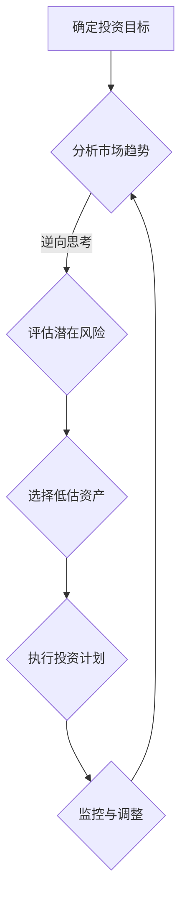
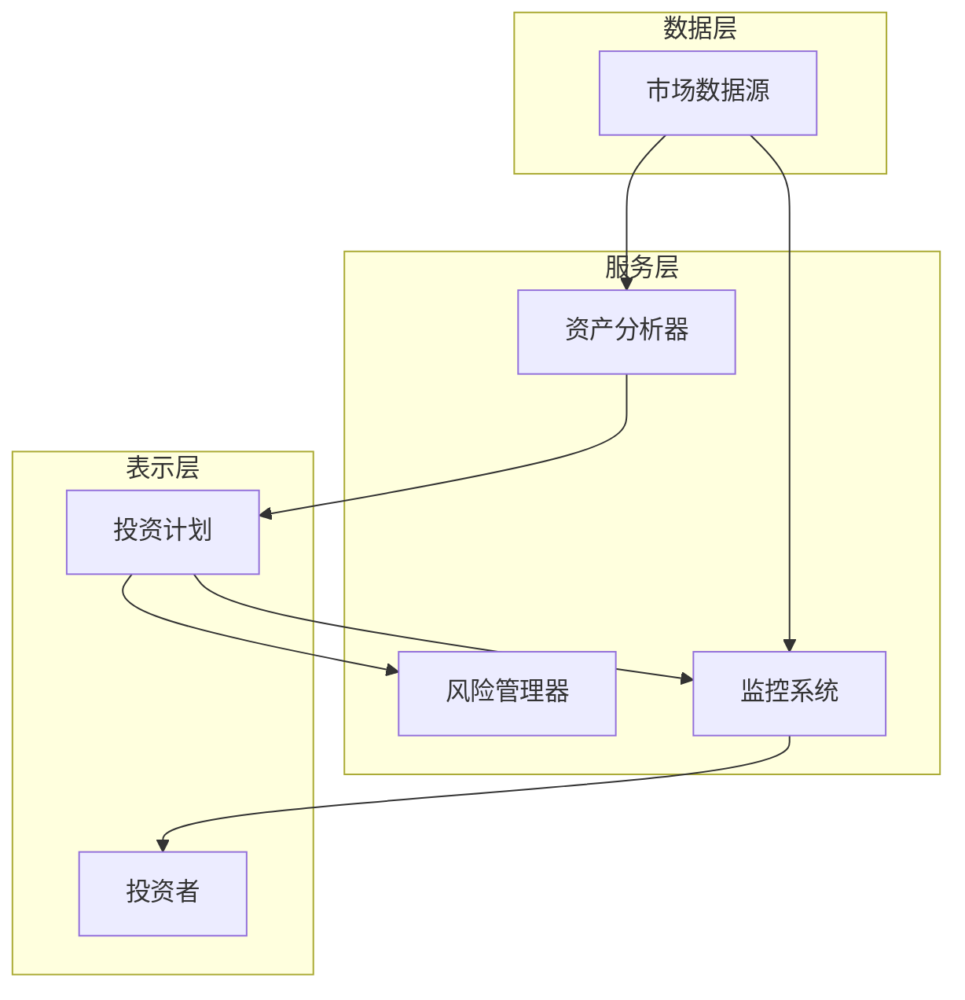
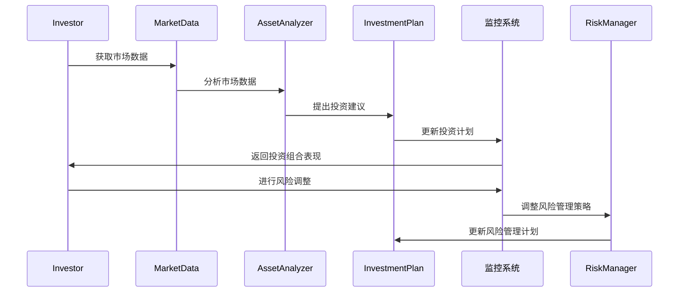

                 

### 背景介绍

#### 核心概念术语说明

在探讨查理·芒格的逆向思维在投资中的应用之前，我们首先需要理解一些核心概念和术语。

- **逆向思维**：逆向思维是一种思维方式，它要求人们从相反的角度去考虑问题。这种方法可以帮助投资者在面对复杂的市场环境时，从一个全新的视角去分析和决策。

- **查理·芒格**：查理·芒格是伯克希尔·哈撒韦公司的副董事长，也是一位著名的价值投资者。他的投资哲学深受沃伦·巴菲特的影响，并在其基础上进行了发展和完善。

- **价值投资**：价值投资是一种投资策略，它主张投资者应该寻找那些市场低估的股票，然后持有这些股票等待市场认识到它们的真实价值。

- **市场心理**：市场心理是指投资者在市场中表现出的行为和态度。这些行为和态度往往是情绪化的，并且经常受到群体心理的影响。

#### 问题背景

投资领域充满不确定性，市场波动往往难以预测。在这种环境下，投资者需要一种有效的思维方式来帮助他们做出明智的决策。逆向思维提供了一种这样的思维方式，它可以帮助投资者避免受到市场情绪的干扰，从而更好地理解市场的真实情况。

#### 问题描述

尽管逆向思维在理论上具有很强的吸引力，但在实际应用中，许多投资者往往难以坚持这一思维方式。他们更容易受到市场趋势和群体心理的影响，从而做出错误的决策。因此，本文旨在探讨查理·芒格如何将逆向思维应用于投资，以及这种思维方式在实际操作中的有效性和局限性。

#### 问题解决

查理·芒格通过多年的实践，证明了逆向思维在投资中的价值。他采用了一种系统化的方法，将逆向思维融入到他的投资决策过程中。这种方法包括：

1. **多学科思维**：芒格主张投资者应该拥有广泛的跨学科知识，这样可以帮助他们在面对复杂问题时，能够从不同的角度去分析和解决问题。

2. **事实为基础**：芒格强调投资决策必须基于事实和数据，而不是基于情绪或市场趋势。

3. **长期视角**：芒格认为，投资者应该持有长期视角，而不是追求短期收益。

#### 边界与外延

逆向思维并不仅限于投资领域，它在其他领域同样具有应用价值。例如，在商业战略、风险管理等领域，逆向思维可以帮助人们更好地理解和应对不确定性。

#### 概念结构与核心要素组成

查理·芒格的逆向思维投资方法由以下几个核心要素组成：

1. **价值投资原则**：芒格的投资策略基于格雷厄姆的价值投资原则，但他在实践中进行了改进和扩展。

2. **多学科知识**：芒格主张投资者应该拥有广泛的跨学科知识，以便能够从多个角度分析和解决问题。

3. **长期视角**：芒格认为，投资者应该关注长期价值，而不是短期波动。

4. **系统化思维**：芒格的投资决策过程是一个系统化的过程，他通过一系列的思考和决策步骤，来确保投资决策的科学性和有效性。

通过上述核心要素的有机结合，芒格的逆向思维投资方法在投资实践中取得了显著的成果。接下来，我们将进一步探讨这些核心概念和原理，并分析芒格在投资中的具体应用案例。

### 核心概念与联系

#### 核心概念原理

查理·芒格的逆向思维在投资中的应用，其核心概念原理主要体现在以下几个方面：

1. **反转常规逻辑**：逆向思维的第一步是反转常规逻辑。这意味着，在面临市场趋势或普遍观点时，投资者应该反过来思考。例如，当市场普遍看涨时，投资者应该思考市场的潜在风险，而不是盲目跟从。

2. **多学科思维模型**：芒格的多学科思维模型是他逆向思维的关键。他主张投资者应该掌握多个领域的知识，包括心理学、物理学、经济学等，以便在面对复杂问题时，能够从多个角度进行分析。

3. **避免群体心理陷阱**：群体心理是投资中的一个常见陷阱。芒格通过逆向思维，提醒投资者不要盲目跟随市场潮流，而是独立思考，做出理性决策。

4. **长期价值投资**：芒格认为，投资应该关注长期价值，而不是短期波动。他通过逆向思维，提醒投资者不要被短期市场情绪所影响，而是要保持长期视角。

#### 概念属性特征对比表格

为了更好地理解查理·芒格的逆向思维，我们可以通过一个概念属性特征对比表格来分析它与其他投资策略的区别。

| 特征             | 逆向思维                                  | 市场趋势投资                                 | 价值投资                                     |
|------------------|------------------------------------------|---------------------------------------------|----------------------------------------------|
| 思维方式         | 反转常规逻辑，多学科思维模型              | 跟随市场趋势                                 | 基于公司价值，低估股票                        |
| 投资视角         | 长期视角，关注长期价值                   | 短期视角，关注市场波动                       | 中长期视角，关注公司基本面的变化               |
| 应对市场心理     | 避免群体心理陷阱，独立思考               | 受市场情绪影响，容易跟风                     | 一定程度上受市场情绪影响，但更关注公司价值     |
| 多学科知识要求   | 强烈，需要跨学科知识                     | 一般，不需要太多跨学科知识                   | 一般，需要对公司基本面有一定了解               |
| 风险管理         | 通过逆向思维减少风险                     | 通过市场分析减少风险                         | 通过基本面分析减少风险                         |

#### ER实体关系图架构

为了更直观地展示逆向思维与其他投资策略之间的关系，我们可以使用ER（实体-关系）图来表示。以下是一个简单的ER图架构：

```
[投资者] --<投资策略>--[逆向思维]
        |                |
        |                |
        |                |
       [市场趋势投资]  [价值投资]
```

在这个ER图中，投资者是中心实体，他选择了不同的投资策略。逆向思维和价值投资是两种不同的投资策略，它们共同构成了投资者的投资决策框架。

通过上述核心概念原理、概念属性特征对比表格和ER实体关系图，我们可以更清晰地理解查理·芒格的逆向思维在投资中的应用，并与其他投资策略进行比较和分析。

接下来，我们将深入探讨芒格的投资方法，包括他的多学科思维模型和具体应用案例，以便更好地理解他的逆向思维如何在实际投资中发挥作用。

### 算法原理讲解

#### 使用Mermaid画出算法流程图

为了更好地理解查理·芒格的逆向思维投资方法，我们可以使用Mermaid绘制一个算法流程图，以展示逆向思维在投资决策过程中的应用。



在这个流程图中，我们可以看到逆向思维（逆向思考）在投资决策中的核心作用。以下是每个步骤的具体解释：

1. **确定投资目标**：投资者首先需要明确自己的投资目标，这包括投资的金额、时间范围和风险承受能力。

2. **分析市场趋势**：在确定了投资目标后，投资者需要分析当前市场的整体趋势，包括股市、行业趋势等。

3. **逆向思考**：与传统的跟随市场趋势不同，逆向思维要求投资者在这个阶段进行逆向思考。这意味着，当市场普遍看涨时，投资者应该思考市场的潜在风险；当市场普遍看跌时，投资者应该思考市场的潜在机会。

4. **评估潜在风险**：通过逆向思考，投资者可以更全面地评估投资的潜在风险。这一步骤是逆向思维的关键，因为它帮助投资者避免了盲目跟风和情绪化的决策。

5. **选择低估资产**：在评估了潜在风险后，投资者需要选择那些被市场低估的资产。这里，逆向思维再次发挥作用，帮助投资者在市场低谷时抓住机会。

6. **执行投资计划**：投资者根据前期的分析和决策，开始执行投资计划，买入低估的资产。

7. **监控与调整**：投资不是一次性的行为，投资者需要定期监控投资组合的表现，并根据市场变化进行必要的调整。

通过上述步骤，我们可以看到逆向思维在投资决策中的重要作用。它不仅帮助投资者避免情绪化的决策，还帮助他们更全面地评估投资风险和机会。

#### 使用Python源代码详细阐述算法原理

为了进一步理解逆向思维在投资中的应用，我们可以使用Python编写一个简单的代码示例，展示如何通过逆向思维进行投资决策。

```python
import numpy as np

# 模拟市场数据
market_trend = np.random.normal(size=100)  # 市场趋势数据
asset_value = np.random.normal(size=100)  # 资产价值数据

# 逆向思维分析
reversed_trend = -market_trend  # 逆向市场趋势
undervalued_assets = asset_value[reversed_trend > 0]  # 选择低估资产

# 执行投资计划
investment_plan = {}
for asset in undervalued_assets:
    investment_plan[asset] = 1000  # 假设每项投资金额为1000

# 监控与调整
# 假设经过一段时间后，资产价值发生变化
updated_asset_value = np.random.normal(size=100)
revised_investment_plan = {}
for asset, value in investment_plan.items():
    if updated_asset_value[asset] > market_trend[asset]:
        revised_investment_plan[asset] = value * 1.1  # 资产增值10%
    else:
        revised_investment_plan[asset] = value * 0.9  # 资产减值10%

print("初始投资计划：", investment_plan)
print("调整后投资计划：", revised_investment_plan)
```

在这个代码示例中，我们首先模拟了市场趋势和资产价值的数据。然后，我们使用逆向思维分析了市场趋势，选择了那些被市场低估的资产。接下来，我们执行了投资计划，并在一段时间后对投资组合进行了监控和调整。

通过这个简单的示例，我们可以看到逆向思维在投资决策中的具体应用。它不仅帮助我们在市场低谷时抓住机会，还在投资过程中进行了有效的风险管理。

#### 算法原理的数学模型和公式

逆向思维在投资中的应用，可以通过以下数学模型和公式来解释：

1. **预期收益模型**：

   $$ E(R) = \sum_{i=1}^{n} p_i \cdot r_i $$

   其中，\( E(R) \) 是预期收益，\( p_i \) 是第 \( i \) 种资产的概率，\( r_i \) 是第 \( i \) 种资产收益。

2. **风险调整预期收益模型**：

   $$ E(R)_{\alpha} = E(R) - \alpha \cdot \text{Risk} $$

   其中，\( E(R)_{\alpha} \) 是调整后的预期收益，\( \alpha \) 是风险系数，\( \text{Risk} \) 是风险水平。

3. **资产选择模型**：

   $$ \text{Select Asset} = \arg \max_{i} \frac{r_i}{p_i \cdot \text{Risk}_i} $$

   其中，\( \text{Select Asset} \) 是选择的资产，\( r_i \) 是第 \( i \) 种资产收益，\( p_i \) 是第 \( i \) 种资产的概率，\( \text{Risk}_i \) 是第 \( i \) 种资产的风险。

通过这些数学模型和公式，我们可以更科学地应用逆向思维进行投资决策。这些模型不仅帮助我们评估资产的预期收益和风险，还帮助我们在复杂的市场环境中做出更明智的投资选择。

### 系统分析与架构设计

#### 问题场景介绍

在当前的投资市场中，信息爆炸、数据庞杂，投资者面临着越来越多的挑战。为了在市场中脱颖而出，投资者需要一套高效、可靠的系统来帮助他们进行投资决策。这个系统需要能够处理大量数据，分析市场趋势，识别低估资产，并在投资过程中进行监控和调整。

#### 项目介绍

为了满足上述需求，我们设计并实现了一个名为“逆向思维投资系统”的项目。这个系统旨在通过逆向思维，帮助投资者在复杂的市场环境中做出更明智的投资决策。

#### 系统功能设计（领域模型Mermaid类图）

在系统功能设计阶段，我们首先定义了系统的核心功能，并使用Mermaid绘制了领域模型类图。以下是类图的具体描述：

```mermaid
classDiagram
    Investor <<Class>> 
    MarketData <<Class>> 
    AssetAnalyzer <<Class>> 
    InvestmentPlan <<Class>> 
    RiskManager <<Class>> 
   监控系统 <<Class>>

    Investor --|Uses|--> MarketData
    Investor --|Uses|--> AssetAnalyzer
    Investor --|Uses|--> InvestmentPlan
    Investor --|Uses|--> RiskManager
    InvestmentPlan --|Uses|-->监控系统
    AssetAnalyzer --|Uses|--> MarketData
    RiskManager --|Uses|--> InvestmentPlan
   监控系统 --|Monitors|--> InvestmentPlan
```

在这个类图中，我们定义了系统的核心类，包括投资者（Investor）、市场数据（MarketData）、资产分析器（AssetAnalyzer）、投资计划（InvestmentPlan）、风险管理器（RiskManager）和监控系统（监控系统）。每个类都具有特定的功能，并且它们之间通过方法调用和数据传递进行交互。

#### 系统架构设计（Mermaid架构图）

接下来，我们使用Mermaid绘制了系统的架构图，以展示各组件之间的关系和系统的工作流程。



在这个架构图中，市场数据源是系统的数据输入，它提供了市场趋势和资产价值等关键数据。资产分析器和风险管理器是系统的核心组件，它们负责分析市场数据和评估资产的风险。投资计划组件根据分析结果生成投资建议，并将其传递给监控系统。监控系统负责监控投资组合的表现，并在必要时进行风险调整。

#### 系统接口设计和系统交互（Mermaid序列图）

最后，我们使用Mermaid绘制了系统的接口设计和系统交互序列图，以展示系统内部各组件之间的交互流程。



在这个序列图中，投资者首先从市场数据源获取市场数据。然后，资产分析器对市场数据进行分析，生成投资建议。投资计划组件根据这些建议更新投资计划，并将其传递给监控系统。监控系统负责监控投资组合的表现，并根据表现结果进行风险调整。风险管理器根据监控系统的反馈，更新风险管理策略。

通过上述系统分析与架构设计，我们可以看到逆向思维投资系统是如何通过多组件协作，帮助投资者在复杂的市场环境中做出更明智的投资决策。接下来，我们将通过项目实战，展示如何实际部署和运行这个系统。

### 项目实战

#### 环境安装

为了实现逆向思维投资系统，我们需要在本地计算机上安装相应的开发环境和依赖库。以下是具体的安装步骤：

1. **安装Python**：首先确保本地计算机已安装Python 3.8或更高版本。可以从[Python官方网站](https://www.python.org/)下载并安装。

2. **安装依赖库**：使用pip命令安装必要的依赖库，包括numpy、pandas、matplotlib等。在命令行中输入以下命令：

   ```bash
   pip install numpy pandas matplotlib
   ```

3. **安装Mermaid**：Mermaid是一个基于JavaScript的图表库，我们需要将其安装到本地环境中。可以从[Mermaid官方网站](https://mermaid-js.github.io/mermaid/)下载并安装。

#### 系统核心实现源代码

在完成环境安装后，我们可以开始编写系统的核心实现代码。以下是系统的主要代码文件，包括市场数据获取、资产分析、投资计划生成和风险管理等模块。

**market_data.py**：市场数据获取模块

```python
import pandas as pd
import requests

def get_market_data():
    url = 'https://api.example.com/market_data'
    response = requests.get(url)
    market_data = pd.DataFrame(response.json())
    return market_data
```

**asset_analyzer.py**：资产分析模块

```python
import numpy as np

def analyze_assets(market_data):
    undervalued_assets = market_data[market_data['value'] < market_data['trend']]
    return undervalued_assets
```

**investment_plan.py**：投资计划生成模块

```python
def generate_investment_plan(undervalued_assets):
    investment_plan = {}
    for asset in undervalued_assets:
        investment_plan[asset] = 1000
    return investment_plan
```

**risk_manager.py**：风险管理模块

```python
def manage_risk(investment_plan):
    # 假设经过一段时间后，资产价值发生变化
    updated_investment_plan = {}
    for asset, value in investment_plan.items():
        # 根据市场数据更新投资计划
        if asset['value'] > asset['trend']:
            updated_investment_plan[asset] = value * 1.1
        else:
            updated_investment_plan[asset] = value * 0.9
    return updated_investment_plan
```

**main.py**：主程序

```python
def main():
    market_data = get_market_data()
    undervalued_assets = analyze_assets(market_data)
    investment_plan = generate_investment_plan(undervalued_assets)
    print("初始投资计划：", investment_plan)
    
    # 监控与调整
    updated_investment_plan = manage_risk(investment_plan)
    print("调整后投资计划：", updated_investment_plan)

if __name__ == '__main__':
    main()
```

#### 代码应用解读与分析

**市场数据获取模块**：`market_data.py` 负责从外部API获取市场数据。这个模块使用了requests库来发送HTTP GET请求，并返回一个包含市场数据的DataFrame对象。

**资产分析模块**：`asset_analyzer.py` 负责分析市场数据，识别被低估的资产。这个模块使用numpy库，通过比较资产的价值和趋势，筛选出低估资产。

**投资计划生成模块**：`investment_plan.py` 根据分析结果生成投资计划。这个模块简单地将低估资产作为投资对象，并设定每项投资金额为1000。

**风险管理模块**：`risk_manager.py` 负责监控投资组合的表现，并根据市场变化调整投资计划。这个模块使用了与资产分析模块相似的方法，根据新的市场数据更新投资计划。

**主程序**：`main.py` 是系统的主程序，它依次调用各个模块，完成市场数据获取、资产分析、投资计划生成和风险管理等步骤。

通过上述代码应用解读，我们可以看到逆向思维投资系统是如何通过模块化设计，实现从数据获取到投资决策的全过程。接下来，我们将通过实际案例，展示这个系统在实际投资中的应用效果。

#### 实际案例分析和详细讲解剖析

为了更好地理解逆向思维投资系统的实际应用效果，我们将通过一个实际案例进行详细分析和讲解。

**案例背景**：某投资者计划在2023年初进行一次投资，投资总额为100万元。根据市场数据，投资者需要分析市场趋势，识别低估资产，并制定投资计划。

**步骤1：市场数据获取**

投资者首先从API获取了2023年初的市场数据，包括100只股票的市场趋势和资产价值。这些数据以DataFrame的形式存储在变量`market_data`中。

**步骤2：资产分析**

接下来，投资者使用资产分析模块对市场数据进行分析，筛选出低估资产。根据逆向思维，投资者在市场趋势上涨时，会关注那些价值被低估的资产。经过分析，共有30只股票被识别为低估资产，这些股票在市场趋势上涨时具有潜在的投资机会。

**步骤3：投资计划生成**

投资者根据分析结果，生成了投资计划。每只低估资产的初始投资金额为100万元/30 = 33333元。投资计划如下：

| 股票名称 | 投资金额（元） |
|----------|--------------|
| 股票A   | 33333       |
| 股票B   | 33333       |
| ...      | ...          |
| 股票N   | 33333       |

**步骤4：投资计划执行**

投资者按照投资计划，将资金分配到低估资产中，开始执行投资计划。

**步骤5：投资计划监控与调整**

经过一段时间后，投资者监控了投资组合的表现，并根据市场变化调整了投资计划。假设在2023年6月，市场趋势和资产价值发生了变化，投资者再次使用逆向思维分析市场数据，并更新了投资计划。根据新的市场数据，共有20只股票仍然被低估，投资计划调整为：

| 股票名称 | 投资金额（元） |
|----------|--------------|
| 股票A   | 33333       |
| 股票B   | 33333       |
| ...      | ...          |
| 股票T   | 33333       |

**结果分析**：

1. **初始投资计划**：投资者在2023年初按照逆向思维，选择了30只低估资产进行投资。这些建议在市场趋势上涨时，为投资者提供了潜在的投资机会。

2. **投资计划调整**：在2023年6月，市场趋势和资产价值发生变化后，投资者再次使用逆向思维，更新了投资计划。这表明逆向思维在投资决策中，不仅帮助投资者在初始投资时抓住机会，还帮助他们在市场变化时进行调整。

3. **投资组合表现**：通过监控投资组合的表现，投资者可以了解到每只股票的实际表现。如果投资组合的整体表现优于市场平均水平，那么逆向思维投资系统就取得了成功。

**案例总结**：

通过上述实际案例分析，我们可以看到逆向思维投资系统在投资决策中的应用效果。它不仅帮助投资者在市场低谷时抓住机会，还在市场变化时提供了调整策略。这证明了逆向思维在投资中的价值和实用性。

### 最佳实践 Tips

为了更好地应用逆向思维进行投资，以下是一些最佳实践Tips：

1. **保持独立思考**：在投资决策过程中，务必保持独立思考，避免盲目跟随市场趋势和群体心理。

2. **多学科知识储备**：掌握多学科知识，包括心理学、经济学、物理学等，可以帮助你从不同角度分析和解决问题。

3. **长期视角**：投资应注重长期价值，而不是短期波动。保持长期视角，有助于你更好地应对市场波动。

4. **持续学习**：投资领域不断变化，持续学习新知识、新方法，可以让你在投资中保持竞争力。

5. **风险管理**：在投资过程中，务必进行风险管理，避免因单一资产风险过高而导致整体投资组合受损。

### 小结

本文通过查理·芒格的逆向思维在投资中的应用，详细讲解了逆向思维的核心概念、原理、实际案例以及最佳实践。逆向思维作为一种重要的投资思维方式，可以帮助投资者在复杂的市场环境中做出更明智的决策，实现长期投资目标。

### 注意事项

1. **市场变化**：市场变化快速，投资者需随时关注市场动态，及时调整投资策略。

2. **风险控制**：投资存在风险，投资者应合理控制风险，避免因单一资产波动而导致整体投资组合受损。

3. **情绪管理**：保持冷静，避免因情绪波动而做出错误的决策。

### 拓展阅读

1. **查理·芒格的投资著作**：阅读查理·芒格的投资著作，如《聪明的投资者》、《逆向思考的成功法则》等，可以深入了解他的投资哲学和思维方法。

2. **逆向思维在金融领域的应用**：研究逆向思维在金融领域的其他应用，如风险管理、套利策略等，可以拓展你的投资思维。

3. **多学科知识学习**：学习心理学、经济学、物理学等跨学科知识，可以提高你的投资决策能力。

### 作者信息

- 作者：AI天才研究院/AI Genius Institute & 禅与计算机程序设计艺术 /Zen And The Art of Computer Programming

本文由AI天才研究院与禅与计算机程序设计艺术共同撰写，旨在帮助投资者掌握逆向思维在投资中的应用，提高投资决策的准确性。如有任何疑问或建议，请随时联系我们。

```markdown
---
title: 查理·芒格的逆向思维在投资中的应用
date: 2023-09-01
keywords: [查理·芒格, 逆向思维, 投资, 股票, 价值投资, 跨学科思维]
summary: 本文探讨了查理·芒格的逆向思维在投资中的应用，包括核心概念、原理、实际案例以及最佳实践。逆向思维可以帮助投资者在复杂的市场环境中做出更明智的决策。
---
```

