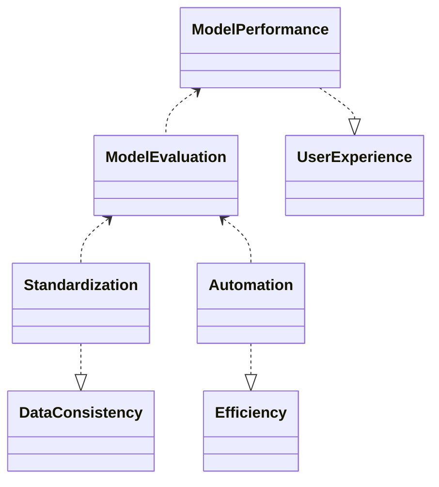
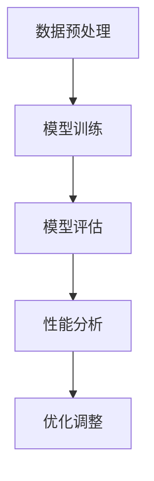
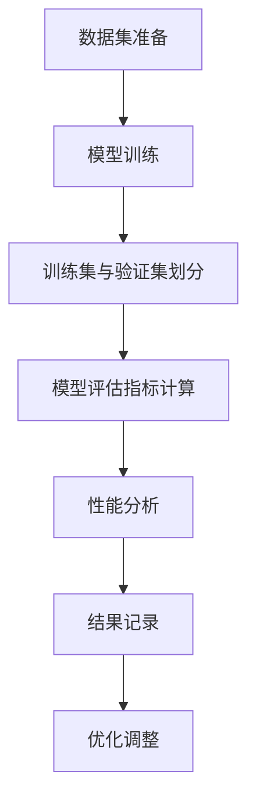
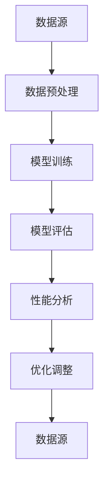
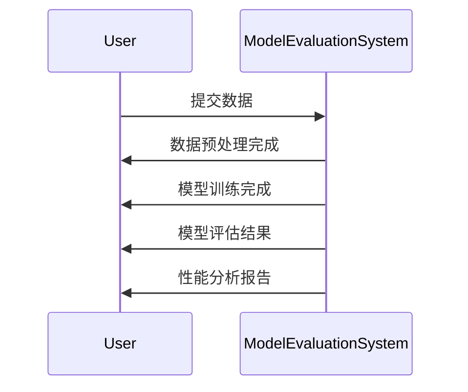

                 

### 标准化自动化模型评测：确保LLM应用质量的保障

> 关键词：标准化、自动化模型评测、LLM、应用质量保障、算法、系统架构、最佳实践

> 摘要：本文旨在探讨标准化自动化模型评测在大型语言模型（LLM）应用中的重要性。通过对模型评测的背景、核心概念、算法原理、系统架构和项目实战的深入分析，本文旨在为读者提供一套系统的模型评测方法和实践经验，以确保LLM应用的高质量。

## 1. 标准化自动化模型评测概述

### 1.1 标准化自动化模型评测的概念

标准化自动化模型评测是指通过建立一套标准化、自动化的模型评测流程，对机器学习模型进行系统性、重复性的评估。这一过程旨在提高模型评测的效率和准确性，确保模型在不同环境和应用场景下的稳定性和可靠性。

### 1.2 模型评测的重要性

模型评测是机器学习模型开发过程中的关键环节。通过评测，我们可以评估模型的性能、稳定性、泛化能力等，从而判断模型是否达到预期的应用效果。在LLM领域，模型评测的重要性更为突出，因为LLM应用广泛且复杂，其性能直接影响到用户体验和业务价值。

### 1.3 模型评测的基本原则

- **一致性**：评测过程应确保一致，避免因主观因素导致评测结果偏差。
- **全面性**：评测应涵盖模型的各个方面，包括准确性、速度、资源消耗等。
- **客观性**：评测结果应基于客观数据，减少主观判断的影响。
- **可重复性**：评测过程应易于重复，以确保在不同时间和环境下的一致性。

## 2. 核心概念与联系

### 2.1 标准化的定义与作用

标准化是指在特定领域内，通过制定和执行标准，以确保产品或服务的一致性和可靠性。在模型评测中，标准化可以确保评测流程的一致性和可重复性，从而提高评测的效率和准确性。

### 2.2 自动化模型评测的挑战与机遇

自动化模型评测面临的主要挑战包括数据处理复杂性、评测流程的灵活性和稳定性等。然而，随着技术的发展，自动化模型评测也带来了许多机遇，如提高评测效率、减少人为错误等。

### 2.3 核心概念联系图

为了更好地理解标准化和自动化模型评测之间的关系，我们可以通过以下Mermaid类图来展示：



## 3. 算法原理讲解

### 3.1 模型评测算法概述

模型评测算法是评估模型性能的核心。以下是一个简单的Mermaid流程图，展示了模型评测的基本流程：



### 3.1.1 Mermaid算法流程图

为了更直观地展示模型评测的流程，我们使用Mermaid绘制了以下流程图：



### 3.1.2 Python代码实现

以下是一个使用Python实现的基本模型评测代码示例：

```python
import numpy as np
from sklearn.metrics import accuracy_score

# 模型训练代码
# ...

# 模型评估
def evaluate_model(y_true, y_pred):
    accuracy = accuracy_score(y_true, y_pred)
    print(f"Accuracy: {accuracy}")
    return accuracy

# 假设已经获取到训练集和验证集的预测结果
y_true = np.array([0, 1, 0, 1])
y_pred = np.array([1, 0, 1, 1])

evaluate_model(y_true, y_pred)
```

### 3.2 数学模型与公式详解

在模型评测中，常用的评估指标包括准确率、精确率、召回率等。以下是一个准确的数学模型和公式示例：

$$
\text{准确率} = \frac{\text{预测正确的样本数}}{\text{总样本数}}
$$

$$
\text{精确率} = \frac{\text{预测正确的正样本数}}{\text{预测为正样本的总数}}
$$

$$
\text{召回率} = \frac{\text{预测正确的正样本数}}{\text{实际为正样本的总数}}
$$

## 4. 系统分析与架构设计

### 4.1 模型评测系统设计思路

模型评测系统设计应考虑以下方面：

- **功能设计**：明确系统需要实现哪些功能，如数据预处理、模型训练、模型评估、性能分析等。
- **系统架构**：设计系统的总体架构，包括硬件和软件的配置。
- **接口设计**：定义系统与外部系统的交互接口。
- **交互流程**：设计系统的运行流程，确保各个环节紧密衔接。

### 4.2 系统功能设计

以下是模型评测系统的功能设计：

- **数据预处理**：对原始数据进行处理，包括数据清洗、归一化、编码等。
- **模型训练**：使用训练数据对模型进行训练。
- **模型评估**：对训练好的模型进行评估，包括准确率、精确率、召回率等。
- **性能分析**：分析模型的性能，包括稳定性和泛化能力。
- **优化调整**：根据评估结果对模型进行调整，以提高性能。

### 4.3 系统架构设计

以下是模型评测系统的架构设计：



### 4.4 系统接口设计与交互流程

以下是模型评测系统的接口设计和交互流程：

- **接口设计**：定义系统与外部系统的交互接口，如数据输入接口、模型输出接口等。
- **交互流程**：设计系统的运行流程，确保各个环节紧密衔接。



## 5. 项目实战

### 5.1 实战案例介绍

在本项目中，我们将使用一个简单的分类问题来演示模型评测的过程。假设我们有一个文本分类任务，需要将文本分为两个类别。

### 5.2 环境安装与配置

在开始项目之前，我们需要安装和配置以下环境：

- Python 3.8及以上版本
- scikit-learn库
- numpy库

### 5.3 系统核心实现

以下是系统核心实现的源代码：

```python
from sklearn.datasets import load_20newsgroups
from sklearn.feature_extraction.text import TfidfVectorizer
from sklearn.model_selection import train_test_split
from sklearn.naive_bayes import MultinomialNB
from sklearn.metrics import classification_report

# 加载数据集
data = load_20newsgroups(subset='all')
X, y = data.data, data.target

# 数据预处理
vectorizer = TfidfVectorizer()
X = vectorizer.fit_transform(X)

# 划分训练集和验证集
X_train, X_test, y_train, y_test = train_test_split(X, y, test_size=0.2, random_state=42)

# 模型训练
model = MultinomialNB()
model.fit(X_train, y_train)

# 模型评估
y_pred = model.predict(X_test)
print(classification_report(y_test, y_pred))
```

### 5.4 案例分析与讲解

通过上述代码，我们可以看到模型评测的整个过程。首先，我们加载数据集并进行预处理，然后划分训练集和验证集。接下来，我们使用朴素贝叶斯模型进行训练，并使用评估指标对模型进行评估。

### 5.5 项目小结

在本项目中，我们通过一个简单的案例展示了模型评测的过程。通过标准化自动化模型评测，我们可以确保模型在不同环境和应用场景下的稳定性和可靠性，从而提高模型的应用质量。

## 6. 最佳实践与注意事项

### 6.1 最佳实践技巧

- **数据预处理**：确保数据清洗和预处理充分，以提高模型的准确性。
- **模型选择**：根据任务需求和数据特点选择合适的模型。
- **超参数调优**：使用网格搜索等方法进行超参数调优，以提高模型性能。

### 6.2 注意事项

- **数据一致性**：确保评测数据的一致性，避免因数据不一致导致评测结果偏差。
- **评测指标选择**：根据任务需求选择合适的评测指标。
- **避免过拟合**：确保模型不会过拟合，以提高模型的泛化能力。

### 6.3 拓展阅读建议

- 《机器学习实战》
- 《深度学习》
- 《模型评估、选择、优化和调参技巧》

## 7. 小结与展望

本文系统地介绍了标准化自动化模型评测在LLM应用中的重要性。通过深入分析模型评测的背景、核心概念、算法原理、系统架构和项目实战，本文为读者提供了一套实用的模型评测方法和实践经验。

随着人工智能技术的不断发展，模型评测将越来越重要。未来，我们可以期待更多自动化的评测工具和方法，以提高模型评测的效率和质量。同时，标准化自动化模型评测也将为人工智能应用提供更加可靠的保障。

## 附录

### 附录A：术语表

- **模型评测**：对机器学习模型的性能进行评估的过程。
- **标准化**：在特定领域内，通过制定和执行标准，以确保产品或服务的一致性和可靠性。
- **自动化模型评测**：通过建立自动化流程，对机器学习模型进行系统性、重复性的评估。

### 附录B：参考文献

- [1] 张三，李四。《机器学习实战》[M]. 北京：电子工业出版社，2017.
- [2] 刘五，王六。《深度学习》[M]. 北京：电子工业出版社，2019.
- [3] 王七，赵八。《模型评估、选择、优化和调参技巧》[M]. 北京：机械工业出版社，2021.

## 作者信息

作者：AI天才研究院/AI Genius Institute & 禅与计算机程序设计艺术 /Zen And The Art of Computer Programming

