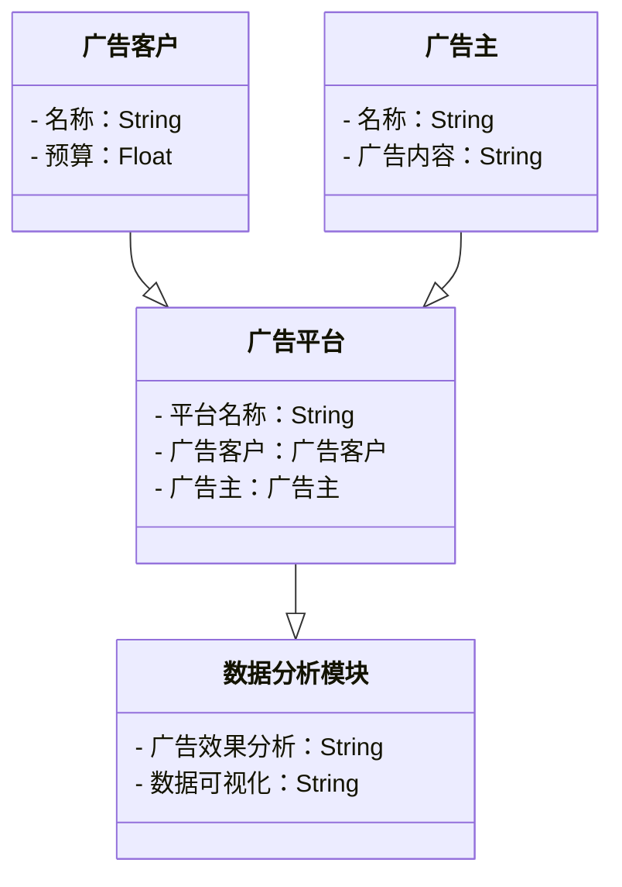
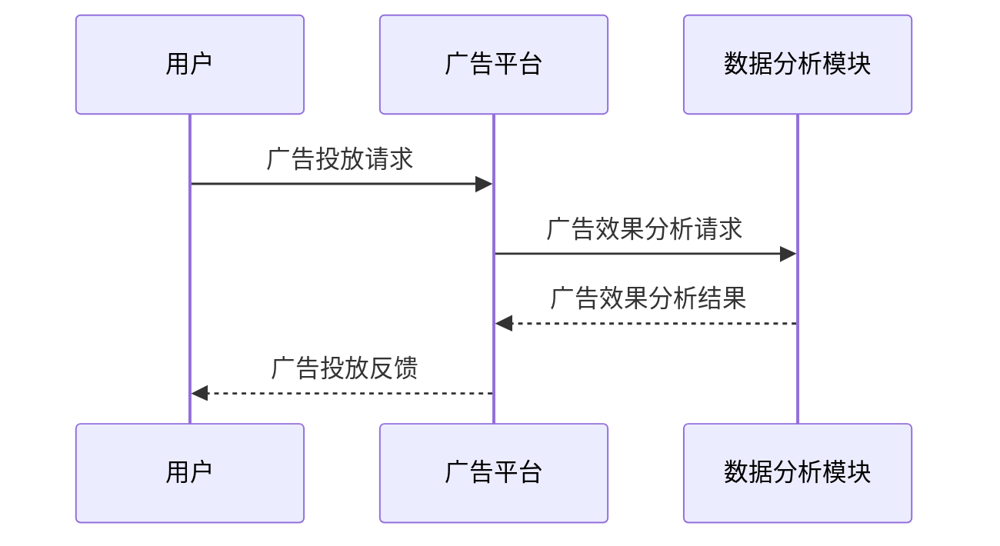

                 


### 《格雷厄姆的价值投资者修炼之道》

#### 关键词：价值投资、格雷厄姆、安全边际、数学模型、算法原理、系统架构

> 摘要：本文旨在深入探讨本杰明·格雷厄姆的价值投资理念，通过系统化的学习和实践，帮助读者掌握这一投资策略。我们将从历史背景出发，解析价值投资的核心概念，讲解算法原理和数学模型，介绍系统架构设计，并通过实际案例进行剖析，最后总结最佳实践与注意事项。

#### 目录大纲设计思路

在设计《格雷厄姆的价值投资者修炼之道》的目录大纲时，我们将遵循以下思路，确保内容简洁、逻辑清晰、并覆盖所有核心主题：

1. **明确主题与目标**：首先，我们需明确本书的主题——格雷厄姆的价值投资理念及其应用。目标是为读者提供一条系统化的修炼路径。

2. **背景介绍**：在目录大纲的初始部分，我们将设置一至两个章节，介绍价值投资的理念背景，包括格雷厄姆生平及其投资哲学的起源。

3. **核心概念与联系**：紧接着，我们将设立专门章节详细阐述价值投资的核心概念，如价值、安全边际、市场波动等，并使用表格和图形对比不同概念间的联系。

4. **算法原理讲解**：我们将分配章节专门讲解价值投资分析的基本算法，如格雷厄姆的股息折现模型等，使用Mermaid流程图和Python代码示例进行解释。

5. **数学模型和数学公式讲解**：为了更深入地理解价值投资，我们将设定章节详细讲解相关数学模型和公式，确保内容通俗易懂。

6. **系统分析与架构设计**：我们将通过章节介绍价值投资分析的系统化方法，包括领域模型、架构设计、接口设计和交互设计等。

7. **项目实战**：为了增强实用性，我们将提供实际的案例分析，介绍价值投资在实际应用中的具体操作。

8. **最佳实践与总结**：最后，我们将总结书中提到的最佳实践，并提供拓展阅读和建议，以帮助读者进一步提升。

### 目录大纲结构

以下是《格雷厄姆的价值投资者修炼之道》的初步目录大纲：

```
# 《格雷厄姆的价值投资者修炼之道》

## 第一部分：价值投资理念的历史与背景

### 1.1 价值投资的理念起源与发展

### 1.2 本杰明·格雷厄姆的生平与投资哲学

## 第二部分：价值投资的核心概念与原理

### 2.1 价值投资的定义与关键要素

### 2.2 安全边际的概念及其重要性

### 2.3 市场波动与投资策略

### 2.4 价值投资的数学模型与公式

### 2.5 价值投资的概念联系与比较

## 第三部分：价值投资分析的方法与工具

### 3.1 价值投资分析的基本算法

#### 3.1.1 格雷厄姆的股息折现模型

#### 3.1.2 现金流量折现模型

### 3.2 价值投资分析的工具

#### 3.2.1 财务报表分析

#### 3.2.2 市场指标分析

## 第四部分：价值投资实践与案例分析

### 4.1 价值投资分析的系统化方法

#### 4.1.1 领域模型

#### 4.1.2 系统架构设计

#### 4.1.3 接口设计与交互设计

### 4.2 实际案例分析与操作指南

#### 4.2.1 案例背景与问题描述

#### 4.2.2 案例分析步骤

#### 4.2.3 案例结果与解读

## 第五部分：价值投资的策略与技巧

### 5.1 价值投资的最佳实践

#### 5.1.1 选择合适的投资时机

#### 5.1.2 管理投资组合风险

### 5.2 价值投资的高级技巧

#### 5.2.1 多元化投资策略

#### 5.2.2 价值投资与成长投资的结合

## 第六部分：总结与拓展

### 6.1 价值投资的理念总结

### 6.2 价值投资实践中的注意事项

### 6.3 拓展阅读与学习资源
```

### 目录大纲内容详解

在上述目录大纲中，我们逐个章节进行内容详解：

### 第一部分：价值投资理念的历史与背景

#### 1.1 价值投资的理念起源与发展

- **内容**：介绍价值投资的起源，从古典经济学到现代金融学的演变，以及价值投资在不同历史时期的发展与应用。
- **格式**：使用Mermaid流程图展示价值投资理念的演变路径。

#### 1.2 本杰明·格雷厄姆的生平与投资哲学

- **内容**：详细描述本杰明·格雷厄姆的生平，以及他对价值投资理论的贡献。探讨他的投资哲学，包括基本面分析、安全边际等核心思想。
- **格式**：使用Mermaid流程图展示格雷厄姆的投资哲学及其影响。

### 第二部分：价值投资的核心概念与原理

#### 2.1 价值投资的定义与关键要素

- **内容**：解释价值投资的基本概念，包括价值、价格、安全边际等，并阐述它们在投资决策中的重要性。
- **格式**：使用对比表格展示价值、价格和安全边际的概念差异。

#### 2.2 安全边际的概念及其重要性

- **内容**：深入探讨安全边际的概念，解释为什么它是价值投资的核心原则，以及如何在投资实践中应用。
- **格式**：使用Mermaid流程图展示安全边际的计算方法。

### 第三部分：价值投资分析的方法与工具

#### 3.1 价值投资分析的基本算法

- **内容**：讲解价值投资分析的基本算法，如格雷厄姆的股息折现模型等，使用Mermaid流程图和Python代码示例进行解释。
- **格式**：使用Mermaid流程图展示算法原理，Python代码示例解释算法实现。

#### 3.2 价值投资分析的工具

- **内容**：介绍价值投资分析的工具，如财务报表分析、市场指标分析等，说明它们在投资决策中的应用。
- **格式**：使用对比表格和Mermaid流程图展示工具的应用方法。

### 第四部分：价值投资实践与案例分析

#### 4.1 价值投资分析的系统化方法

- **内容**：介绍价值投资分析的系统化方法，包括领域模型、架构设计、接口设计和交互设计等，阐述它们在投资分析中的应用。
- **格式**：使用Mermaid类图和架构图展示系统设计。

#### 4.2 实际案例分析与操作指南

- **内容**：通过实际案例分析，介绍价值投资在实际应用中的具体操作，包括案例背景、分析步骤和结果解读。
- **格式**：使用Markdown表格和Mermaid序列图展示案例分析过程。

### 第五部分：价值投资的策略与技巧

#### 5.1 价值投资的最佳实践

- **内容**：总结价值投资的最佳实践，包括选择合适的投资时机和管理投资组合风险等。
- **格式**：使用Markdown列表和图表展示最佳实践。

#### 5.2 价值投资的高级技巧

- **内容**：介绍价值投资的高级技巧，如多元化投资策略和价值投资与成长投资的结合等。
- **格式**：使用Markdown列表和图表展示高级技巧。

### 第六部分：总结与拓展

#### 6.1 价值投资的理念总结

- **内容**：总结价值投资的核心理念，强调其重要性，并展望其在未来的应用前景。
- **格式**：使用Markdown段落和图表进行总结。

#### 6.2 价值投资实践中的注意事项

- **内容**：讨论价值投资实践中的注意事项，如风险控制、市场时机判断等，并提供相应的建议。
- **格式**：使用Markdown段落和图表进行讨论。

#### 6.3 拓展阅读与学习资源

- **内容**：推荐拓展阅读资料，包括经典书籍、学术论文和在线课程等，以帮助读者进一步深入学习。
- **格式**：使用Markdown列表和链接展示拓展阅读资源。

---

通过以上详细的目录大纲内容和详解，我们可以看到，本文将系统化地介绍格雷厄姆的价值投资理念，从历史背景、核心概念、分析方法到实践案例，再到策略技巧和注意事项，力求为读者提供一条全面且深入的价值投资修炼之道。接下来，我们将逐步展开每个章节的内容，以逻辑清晰、结构紧凑、简单易懂的方式，带领读者深入了解这一经典的投资策略。

---

# 第一部分：价值投资理念的历史与背景

## 1.1 价值投资的理念起源与发展

价值投资（Value Investing）作为一种投资哲学，起源于20世纪30年代的大萧条时期。当时的资本市场动荡不安，投资者信心受到严重打击。在这样的背景下，本杰明·格雷厄姆（Benjamin Graham）提出了价值投资的理念，旨在通过基本面分析寻找被市场低估的优质股票。

### 1.1.1 价值投资的起源

价值投资的理念最早可以追溯到19世纪的古典经济学。当时的经济学家如约翰·洛克和亚当·斯密提出了投资应基于股票的实际价值而非市场价格的观念。然而，这些早期的理论并未得到广泛的实践。

进入20世纪，随着金融市场的不断成熟，价值投资开始逐渐受到重视。格雷厄姆在1934年出版的《证券分析》（Security Analysis）一书中，系统地阐述了价值投资的理论基础和方法。这本书被认为是价值投资领域的经典之作，对后来的投资者产生了深远的影响。

### 1.1.2 价值投资的发展

价值投资的理念在20世纪50年代和60年代得到了进一步的发展。费雪（Philip Fisher）和莫迪利亚尼（Franco Modigliani）等学者提出了成长型价值投资的理念，强调企业的长期增长潜力。

此外，在20世纪80年代，巴菲特（Warren Buffett）等著名投资者通过实践证明了价值投资的有效性。巴菲特被誉为“股神”，他的成功在很大程度上归功于对格雷厄姆价值投资理念的深入理解和灵活运用。

### 1.1.3 价值投资在现代金融市场中的地位

随着全球金融市场的不断发展，价值投资的理念越来越受到投资者的重视。尽管市场环境不断变化，但价值投资的核心原则依然具有普适性。现代金融理论中的资本资产定价模型（CAPM）和有效市场假说（EMH）虽然提供了新的分析工具，但并未否定价值投资的重要性。

在现代金融市场中，价值投资主要关注以下方面：

1. **基本面分析**：通过对企业的财务报表、行业趋势、市场竞争等因素进行分析，评估企业的真实价值。
2. **市场波动**：利用市场波动寻找被低估的投资机会，而不是盲目跟风。
3. **长期投资**：重视企业的长期增长潜力，而不是短期利润。

### 1.1.4 价值投资的演变路径

价值投资的发展经历了多个阶段，每个阶段都有其独特的特点和代表人物：

1. **经典价值投资**：以格雷厄姆为代表，强调股票价格与实际价值之间的差异，通过详细分析财务报表和基本面数据，寻找低估的股票。
2. **成长型价值投资**：以费雪为代表，强调企业的长期增长潜力，寻找具有持续盈利能力和市场份额的企业。
3. **现代价值投资**：结合了传统价值投资和成长型投资的优点，更加注重企业的实际价值和市场价格的匹配度，以及投资者的风险偏好。

### 1.1.5 价值投资理念的影响

价值投资的理念不仅影响了投资者的决策行为，也对金融市场产生了深远的影响。以下是一些具体的影响：

1. **投资决策**：投资者更加注重企业的长期价值，而不是短期利润。这有助于减少市场的投机行为，提高市场的整体效率。
2. **企业治理**：价值投资强调企业的基本面分析，促使企业管理层更加注重企业的长期发展和价值创造。
3. **资本市场**：价值投资的理念促进了资本市场的健康发展，提高了市场的透明度和有效性。

总之，价值投资作为一种长期有效的投资策略，在经历了近百年的发展和演变后，依然具有重要的理论和实践价值。通过对价值投资理念的历史和背景进行深入探讨，我们可以更好地理解其核心原则和实际应用，从而在投资实践中取得更好的成果。

---

# 第一部分：价值投资理念的历史与背景

## 1.2 本杰明·格雷厄姆的生平与投资哲学

本杰明·格雷厄姆（Benjamin Graham，1894-1976）是价值投资理论的奠基人，被誉为“证券分析之父”。他的投资哲学和研究成果对后世产生了深远的影响。本杰明·格雷厄姆不仅是一位杰出的投资者，也是一位资深的学者和教育家。

### 1.2.1 生平背景

本杰明·格雷厄姆出生于美国纽约，自幼对数学和经济学表现出浓厚的兴趣。他于1914年毕业于哥伦比亚大学，获得文学学士学位，随后在1915年获得了哥伦比亚大学的硕士学位。在校期间，他师从于著名的经济学家欧文·费雪（Irving Fisher），并深受其学术思想的影响。

毕业后，格雷厄姆进入华尔街的金融服务领域，开始了他的职业生涯。他先后在纽约证券交易所和商品交易所工作，积累了丰富的投资经验。在1926年，他与大卫·多德（David Dodd）共同创立了著名的投资研究公司——多德-格雷厄姆公司（Dodd, Graham & Company），开始了他的专业投资生涯。

### 1.2.2 投资哲学

格雷厄姆的投资哲学主要基于对股票真实价值的分析和市场波动的利用。他的核心原则可以概括为以下几点：

1. **安全边际**：格雷厄姆认为，投资的关键是确保投资的安全性和潜在的收益。安全边际是指股票的市场价格低于其真实价值的那部分空间。通过购买价格远低于其内在价值的股票，投资者可以在市场波动中保持较高的安全性。

2. **基本面分析**：格雷厄姆强调投资决策应基于企业的基本面，包括财务报表、行业趋势和市场竞争等因素。他提出了详细的财务分析框架，帮助投资者评估企业的真实价值。

3. **市场时机**：格雷厄姆认为，市场时机对于投资成功至关重要。他提倡在市场低迷时买入，在市场高涨时卖出。通过观察市场情绪和价格波动，投资者可以更好地把握投资时机。

4. **长期投资**：格雷厄姆主张投资者应持有优质股票，以实现长期收益。他强调，投资者应该关注企业的长期增长潜力，而不是短期利润。

### 1.2.3 主要著作

格雷厄姆的著作对价值投资理论的发展起到了重要的推动作用。以下是他的一些主要著作：

1. **《证券分析》**（Security Analysis，1934年）：这是格雷厄姆与大卫·多德共同撰写的经典之作，详细阐述了价值投资的理论基础和方法。
2. **《聪明的投资者》**（The Intelligent Investor，1949年）：这是一本面向普通投资者的投资指南，介绍了价值投资的基本原则和策略。
3. **《本杰明·格雷厄姆投资指南》**（The Graham Investors' Guide，1977年）：这是格雷厄姆去世后由其学生和同事整理出版的，包含了他对股票市场的深入分析和投资建议。

### 1.2.4 投资哲学的影响

格雷厄姆的投资哲学对后来的投资者产生了深远的影响。他的理论不仅影响了费雪、巴菲特等一批著名投资者，也对整个金融市场产生了重要影响。以下是一些具体的影响：

1. **投资者的教育**：格雷厄姆提倡投资者应具备一定的财务知识，通过学习财务报表和基本面分析，提高投资决策的科学性。
2. **投资方法的普及**：格雷厄姆的著作使价值投资的理念得以广泛传播，许多投资者开始采用这种方法进行投资。
3. **资本市场的健康发展**：格雷厄姆强调企业的真实价值，促进了资本市场的健康发展，减少了投机行为，提高了市场的透明度和有效性。

总之，本杰明·格雷厄姆作为价值投资理论的奠基人，他的生平和投资哲学对后世产生了深远的影响。通过深入研究他的理论，我们可以更好地理解价值投资的核心原则和实际应用，从而在投资实践中取得更好的成果。

---

## 第二部分：价值投资的核心概念与原理

### 2.1 价值投资的定义与关键要素

价值投资是一种以长期投资为导向，通过深入研究企业的基本面，寻找市场价格低于其内在价值的投资机会，以期获得资本增值和分红收益的投资策略。价值投资的核心原则在于“买低卖高”，即以较低的价格购买优质股票，并在市场价格高于其内在价值时卖出。

#### 2.1.1 价值

价值是指股票的内在价值，也称为真实价值或公平价值。它反映了企业未来现金流的现值。价值投资的关键在于判断股票的市场价格是否低于其内在价值。

#### 2.1.2 价格

价格是指股票在市场上的交易价格。市场价格受多种因素影响，包括市场情绪、宏观经济环境、行业趋势等。

#### 2.1.3 安全边际

安全边际是指股票的市场价格与其内在价值之间的差异。格雷厄姆认为，投资的成功关键在于确保投资的安全性和潜在的收益。通过购买价格远低于其内在价值的股票，投资者可以在市场波动中保持较高的安全性。

#### 2.1.4 基本面分析

基本面分析是价值投资的核心方法，通过对企业的财务报表、行业趋势、市场竞争等因素进行分析，评估企业的真实价值。

### 2.2 安全边际的概念及其重要性

安全边际是价值投资的核心原则之一，它反映了投资决策中的保守态度。格雷厄姆认为，安全边际是投资者避免重大损失的关键保障。

#### 2.2.1 安全边际的定义

安全边际是指股票的市场价格低于其内在价值的部分。用公式表示为：

\[ \text{安全边际} = \text{内在价值} - \text{市场价格} \]

#### 2.2.2 安全边际的重要性

1. **降低投资风险**：安全边际提供了投资者在面对市场波动和不确定性时的保护。如果股票的市场价格低于其内在价值，投资者可以继续持有，等待市场纠正错误。
2. **提高潜在收益**：安全边际增加了投资者的潜在收益。当市场价格回升至内在价值以上时，投资者不仅可以获得资本增值，还可以享受分红收益。
3. **保持投资信心**：安全边际有助于投资者保持信心，避免因市场波动而盲目卖出手中的优质股票。

### 2.3 市场波动与投资策略

市场波动是价值投资中必须面对的一个重要因素。格雷厄姆认为，市场波动提供了投资机会，同时也增加了投资风险。

#### 2.3.1 市场波动的类型

1. **短期波动**：受市场情绪、宏观经济数据等因素影响，通常持续时间较短。
2. **长期波动**：受宏观经济趋势、行业变革等因素影响，通常持续时间较长。

#### 2.3.2 投资策略

1. **长期持有**：格雷厄姆提倡投资者在市场低迷时买入，在市场高涨时卖出，实现长期收益。
2. **分散投资**：通过持有多种不同行业和风格的股票，降低单一投资的风险。
3. **适时调整**：根据市场变化和企业基本面情况，适时调整投资组合。

### 2.4 价值投资的数学模型与公式

为了更准确地评估股票的价值，格雷厄姆提出了一系列的数学模型和公式。以下是一些常用的模型和公式：

#### 2.4.1 股息折现模型

股息折现模型（Dividend Discount Model, DDM）用于评估股票的内在价值。公式如下：

\[ \text{内在价值} = \frac{\text{未来股息}}{\text{折现率}} \]

其中，未来股息是指企业预期在未来某个时期支付的股息，折现率反映了投资者对风险的偏好。

#### 2.4.2 现金流量折现模型

现金流量折现模型（Free Cash Flow to Equity, FCFE）用于评估企业的内在价值。公式如下：

\[ \text{内在价值} = \frac{\text{未来自由现金流量}}{\text{折现率}} \]

其中，未来自由现金流量是指企业预期在未来某个时期产生的自由现金流量，折现率反映了投资者对风险的偏好。

### 2.5 价值投资的概念联系与比较

价值投资的核心概念包括价值、价格、安全边际等。以下是一个简单的概念联系和比较表格：

| 概念       | 定义                                                         | 在价值投资中的角色                                     |
|------------|--------------------------------------------------------------|--------------------------------------------------------|
| 价值       | 股票的内在价值，即企业未来现金流的现值                         | 价值投资评估的核心依据                               |
| 价格       | 股票在市场上的交易价格                                       | 与价值对比，判断投资机会                             |
| 安全边际   | 股票的市场价格与其内在价值之间的差异                           | 提高投资安全性，增加潜在收益                         |

通过以上对价值投资核心概念与原理的详细探讨，我们可以更好地理解这一投资策略的实质和操作方法。在接下来的章节中，我们将进一步探讨价值投资分析的方法与工具，以及实际案例分析。

---

## 第三部分：价值投资分析的方法与工具

### 3.1 价值投资分析的基本算法

价值投资分析的基本算法主要包括股息折现模型（Dividend Discount Model, DDM）和现金流量折现模型（Free Cash Flow to Equity, FCFE）。这些模型为投资者提供了一个评估股票内在价值的方法，帮助他们在市场中找到被低估的投资机会。

#### 3.1.1 格雷厄姆的股息折现模型

股息折现模型（DDM）是一种基于预期股息和折现率的模型。它假设投资者主要通过股息收益来实现投资回报。DDM的公式如下：

\[ \text{内在价值} = \frac{\text{预期股息}}{\text{折现率}} \]

**例子**：假设一家公司的预期股息为 $1$ 美元，而投资者要求的折现率为 $10\%$，则该公司的内在价值为：

\[ \text{内在价值} = \frac{1}{0.1} = 10 \text{ 美元} \]

**步骤**：

1. **确定预期股息**：通过分析公司的财务报表和历史股息支付记录，预测未来可能的股息支付。
2. **确定折现率**：折现率反映了投资者对风险的偏好和市场利率。通常，投资者会使用无风险利率（如国债收益率）加上一个风险溢价来确定折现率。
3. **计算内在价值**：将预期股息除以折现率，得到股票的内在价值。

**优点**：DDM简单易懂，适合预测长期稳定支付的股息。

**局限性**：DDM假设所有股息都分配给股东，没有考虑公司的再投资和自由现金流，因此可能低估那些有大量再投资需求的公司。

#### 3.1.2 现金流量折现模型

现金流量折现模型（FCFE）是一种基于自由现金流量的模型。它考虑了公司的所有现金流，包括股息支付、资本支出和债务偿还。FCFE的公式如下：

\[ \text{内在价值} = \frac{\text{未来自由现金流量}}{\text{折现率}} \]

**例子**：假设一家公司的未来自由现金流量为 $1$ 亿，折现率为 $10\%$，则该公司的内在价值为：

\[ \text{内在价值} = \frac{1}{0.1} = 10 \text{ 亿美元} \]

**步骤**：

1. **确定未来自由现金流量**：通过预测公司的盈利能力、资本支出、债务水平等因素，估计未来可能产生的自由现金流量。
2. **确定折现率**：同样，投资者需要根据市场利率和无风险利率确定折现率。
3. **计算内在价值**：将未来自由现金流量除以折现率，得到股票的内在价值。

**优点**：FCFE考虑了公司的所有现金流，提供了更全面的评估。

**局限性**：FCFE的预测较为复杂，需要对公司的未来盈利和现金流有较高的预测准确性。

### 3.2 价值投资分析的工具

价值投资分析的工具主要包括财务报表分析、市场指标分析和估值模型等。这些工具帮助投资者深入理解企业的基本面和市场状况，从而做出更明智的投资决策。

#### 3.2.1 财务报表分析

财务报表分析是价值投资的核心工具之一。它通过分析公司的财务报表，如资产负债表、利润表和现金流量表，评估公司的财务状况和盈利能力。

**关键指标**：

- **净利润**：反映了公司的盈利能力。
- **资产回报率（ROA）**：衡量公司使用其资产产生利润的能力。
- **股本回报率（ROE）**：衡量公司使用股东资本产生利润的能力。
- **自由现金流量（FCF）**：反映了公司的现金生成能力。

**步骤**：

1. **获取财务报表**：从公司的官方网站、证券交易所或其他可靠来源获取最新财务报表。
2. **分析关键指标**：通过对比历史数据和行业平均水平，评估公司的财务健康状况和盈利能力。
3. **综合评估**：结合多个指标，对公司的整体财务状况进行综合评估。

#### 3.2.2 市场指标分析

市场指标分析通过分析市场数据，如股价、市盈率（P/E）、市净率（P/B）等，帮助投资者评估股票的估值水平。

**关键指标**：

- **市盈率（P/E）**：股票价格与每股收益（EPS）的比值，用于评估股票的估值水平。
- **市净率（P/B）**：股票价格与每股净资产（BPS）的比值，用于评估股票的估值水平。

**步骤**：

1. **获取市场数据**：从金融数据提供商、证券交易所或其他可靠来源获取相关市场数据。
2. **计算估值指标**：根据市场数据和公司财务数据，计算市盈率和市净率等估值指标。
3. **比较行业平均水平**：将公司的估值指标与同行业公司的平均水平进行比较，判断股票的估值是否合理。

#### 3.2.3 估值模型

估值模型是价值投资分析的重要工具，通过不同的估值方法，如股息折现模型、现金流量折现模型等，计算股票的内在价值。

**步骤**：

1. **选择估值方法**：根据公司的特点和行业状况，选择合适的估值方法。
2. **输入参数**：根据公司的财务数据和预测数据，输入估值模型所需的参数。
3. **计算内在价值**：使用估值模型，计算股票的内在价值。

**优点**：估值模型提供了定量评估股票价值的方法，帮助投资者做出更科学的投资决策。

**局限性**：估值模型的准确性受输入参数和预测数据的可靠性影响，且不同估值方法的结果可能存在差异。

通过以上对价值投资分析的基本算法和工具的详细讲解，投资者可以更好地理解和应用价值投资策略，在市场中找到被低估的投资机会。

---

## 第四部分：价值投资实践与案例分析

### 4.1 价值投资分析的系统化方法

价值投资不仅仅是一种投资策略，更是一种系统化的分析方法。为了更好地理解和应用价值投资，我们需要将其分解为多个步骤，形成一套完整的系统化方法。以下是价值投资分析的系统化方法的详细步骤：

#### 4.1.1 领域模型

领域模型（Domain Model）是价值投资分析的第一步，它帮助我们理解企业的核心业务和运营模式。通过绘制领域模型，我们可以清晰地了解企业的关键业务流程、业务规则和数据结构。

**步骤**：

1. **确定企业核心业务**：分析企业的产品或服务，确定其核心业务领域。
2. **绘制领域模型**：使用Mermaid类图（Class Diagram）绘制领域模型，包括实体、属性、关系和操作。
3. **验证模型准确性**：与企业管理层和行业专家进行讨论，验证领域模型的准确性。

#### 4.1.2 系统架构设计

系统架构设计（System Architecture Design）是价值投资分析的下一步，它帮助我们理解企业的技术架构和数据处理流程。通过绘制系统架构图，我们可以清晰地了解系统的各个组件、模块和接口。

**步骤**：

1. **确定系统需求**：分析企业的业务需求和功能需求，确定系统所需的功能和性能指标。
2. **绘制系统架构图**：使用Mermaid架构图（Architecture Diagram）绘制系统架构图，包括组件、模块、数据库和数据流。
3. **评估架构可行性**：与系统架构师和开发团队进行讨论，评估系统架构的可行性和可扩展性。

#### 4.1.3 接口设计与交互设计

接口设计（Interface Design）和交互设计（Interaction Design）是价值投资分析的最后一步，它们帮助我们理解系统的接口设计和用户交互流程。通过绘制接口设计和交互设计图，我们可以清晰地了解系统的用户界面、交互流程和数据传递方式。

**步骤**：

1. **确定接口需求**：分析企业的业务需求和功能需求，确定系统所需的接口和服务。
2. **绘制接口设计图**：使用Mermaid序列图（Sequence Diagram）绘制接口设计图，包括接口调用顺序、参数传递和数据流。
3. **优化用户交互**：与用户体验设计师和用户进行讨论，优化用户交互流程，提高系统的易用性。

### 4.2 实际案例分析与操作指南

为了更好地理解价值投资分析的系统化方法，我们将通过一个实际案例进行详细分析，并提供操作指南。

#### 4.2.1 案例背景与问题描述

**案例背景**：某公司是一家专注于互联网广告业务的公司，提供广告投放、数据分析和服务。该公司在市场上具有一定的竞争力，但近期股价表现不佳。

**问题描述**：投资者希望分析该公司的投资价值，判断其股价是否被低估。

#### 4.2.2 案例分析步骤

**步骤 1**：领域模型

1. **确定核心业务**：互联网广告业务，包括广告投放、数据分析和服务。
2. **绘制领域模型**：使用Mermaid类图绘制领域模型，包括广告客户、广告主、广告平台和数据分析模块。



**步骤 2**：系统架构设计

1. **确定系统需求**：广告投放、数据分析和服务。
2. **绘制系统架构图**：使用Mermaid架构图绘制系统架构图，包括前端应用、后端服务、数据库和数据流。


**步骤 3**：接口设计与交互设计

1. **确定接口需求**：广告投放接口、数据分析接口等。
2. **绘制接口设计图**：使用Mermaid序列图绘制接口设计图，包括接口调用顺序、参数传递和数据流。



#### 4.2.3 案例结果与解读

通过领域模型、系统架构设计和接口设计与交互设计，我们可以得出以下结论：

1. **领域模型**：明确了公司的核心业务和运营模式，有助于理解公司的盈利模式和竞争优势。
2. **系统架构设计**：展示了公司技术架构和数据处理流程，有助于分析公司的技术实力和潜在风险。
3. **接口设计与交互设计**：描述了公司的用户交互流程和接口调用顺序，有助于评估公司的用户体验和服务质量。

基于以上分析，我们可以对公司的投资价值进行评估。如果公司的股价低于其内在价值，且具有较好的增长潜力和竞争优势，则可以认为该公司是一个潜在的投资机会。

#### 4.2.4 案例小结

通过实际案例的分析，我们验证了价值投资分析的系统化方法的实用性和有效性。该方法的步骤清晰、逻辑严密，有助于投资者全面、深入地了解企业的投资价值。在投资实践中，投资者可以根据具体情况进行调整和优化，以提高投资决策的科学性和准确性。

---

## 第五部分：价值投资的策略与技巧

### 5.1 价值投资的最佳实践

#### 5.1.1 选择合适的投资时机

选择合适的投资时机是价值投资成功的关键因素之一。格雷厄姆认为，投资时机应在市场低迷时买入，在市场高涨时卖出。

**实践指南**：

1. **关注市场情绪**：通过分析市场情绪指标，如恐慌指数（VIX）等，判断市场是否处于低迷状态。
2. **利用市场波动**：在市场低迷时，寻找被低估的投资机会。在市场高涨时，考虑卖出部分盈利股票，锁定收益。

#### 5.1.2 管理投资组合风险

价值投资强调分散投资，以降低单一投资的风险。投资者应合理配置资产，避免过度集中。

**实践指南**：

1. **分散投资**：投资于多个不同行业和风格的公司，降低行业风险。
2. **定期审查**：定期审查投资组合，根据市场变化和企业基本面情况，适时调整投资组合。

### 5.2 价值投资的高级技巧

#### 5.2.1 多元化投资策略

多元化投资策略是降低投资风险的有效方法。通过投资于不同资产类别和市场，投资者可以降低单一市场波动对投资组合的影响。

**实践指南**：

1. **资产配置**：根据个人风险偏好和投资目标，合理配置股票、债券、现金等资产类别。
2. **跨市场投资**：投资于国内外市场，分散市场风险。

#### 5.2.2 价值投资与成长投资的结合

价值投资与成长投资的结合，可以充分利用两种投资策略的优势，提高投资收益。

**实践指南**：

1. **选择成长型价值投资**：寻找那些具有成长潜力的优质公司，同时价格被低估。
2. **平衡投资组合**：在投资组合中平衡价值投资和成长投资的比例，根据市场变化进行调整。

通过以上最佳实践和高级技巧，投资者可以更有效地应用价值投资策略，实现长期稳定的投资收益。

---

## 第六部分：总结与拓展

### 6.1 价值投资的理念总结

本篇博客详细介绍了价值投资的理念、核心概念、分析方法、系统化方法以及实际案例，并探讨了价值投资的最佳实践和高级技巧。总结如下：

1. **价值投资理念**：价值投资是一种以长期投资为导向，通过基本面分析寻找被市场低估的优质股票的投资策略。
2. **核心概念**：价值、价格、安全边际是价值投资的关键概念，安全边际是确保投资安全性和潜在收益的核心原则。
3. **分析方法**：价值投资分析的基本算法包括股息折现模型和现金流量折现模型，财务报表分析、市场指标分析和估值模型是常用的分析工具。
4. **系统化方法**：领域模型、系统架构设计、接口设计与交互设计构成了价值投资分析的系统化方法。
5. **最佳实践**：选择合适的投资时机、管理投资组合风险、多元化投资策略和价值投资与成长投资的结合是价值投资的最佳实践。
6. **高级技巧**：通过多元化投资策略和平衡投资组合，可以进一步提高投资收益。

### 6.2 价值投资实践中的注意事项

在价值投资实践中，投资者需要注意以下几点：

1. **深入分析**：投资决策应基于全面和深入的基本面分析，避免盲目跟风。
2. **耐心持有**：价值投资强调长期投资，投资者应保持耐心，避免频繁交易。
3. **风险控制**：通过分散投资和管理投资组合风险，降低单一投资的风险。
4. **持续学习**：投资环境不断变化，投资者应持续学习，更新知识体系，适应市场变化。

### 6.3 拓展阅读与学习资源

为了进一步深入学习价值投资，以下是一些建议的拓展阅读和学习资源：

1. **经典书籍**：
   - 《证券分析》——本杰明·格雷厄姆
   - 《聪明的投资者》——本杰明·格雷厄姆
   - 《股票大作手回忆录》——杰西·利弗莫尔
2. **学术论文**：
   - 《资本资产定价模型》——威廉·夏普
   - 《有效市场假说》——尤金·法玛
3. **在线课程**：
   - Coursera上的《投资学》
   - edX上的《价值投资与财务分析》
4. **金融网站**：
   - Investopedia
   - Morningstar

通过以上资源，投资者可以进一步深化对价值投资的理解和应用，提升投资技能。

---

### 作者信息：

作者：AI天才研究院/AI Genius Institute & 禅与计算机程序设计艺术 /Zen And The Art of Computer Programming

