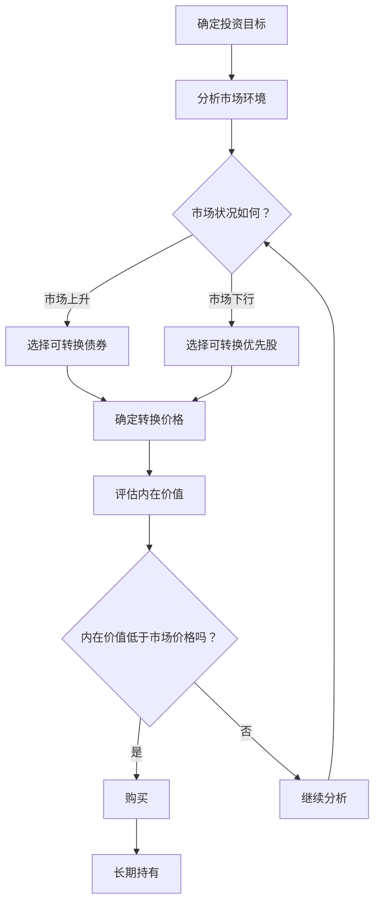
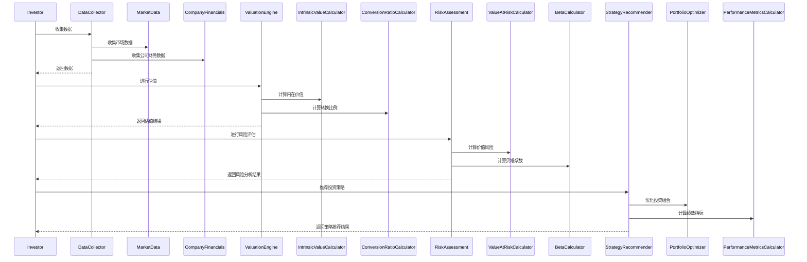
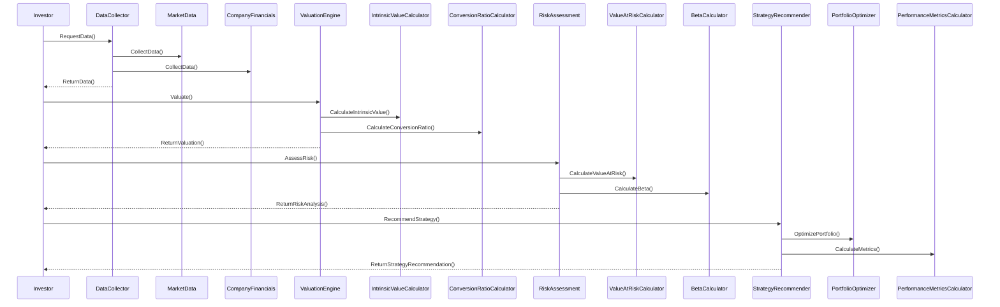

                 

### 格雷厄姆的可转换证券投资策略

> 关键词：格雷厄姆，可转换证券，投资策略，价值投资，安全边际，股票分析

> 摘要：本文深入探讨了格雷厄姆的可转换证券投资策略，从背景介绍、核心概念联系、策略设计、案例分析到实践应用，全面解析了这一经典投资方法。本文旨在为投资者提供有价值的指导，帮助其在复杂多变的金融市场中做出明智的投资决策。

## 引言

本篇文章将围绕著名的投资大师本杰明·格雷厄姆（Benjamin Graham）的可转换证券投资策略进行深入探讨。格雷厄姆被誉为“现代投资之父”，其价值投资理念深刻影响了全球投资者。可转换证券作为一种独特的投资工具，具有股票和债券的双重属性，使得投资者能够利用其灵活性进行多元化投资。本文将结合格雷厄姆的投资原则，详细分析可转换证券的特点、估值方法和投资策略，并通过实际案例展示其应用效果。

## 背景介绍

### 核心概念术语说明

首先，我们需要明确一些核心概念和术语：

- **价值投资（Value Investing）**：一种基于对股票内在价值的评估来进行投资的策略。价值投资者倾向于寻找市场价格低于其内在价值的股票，从而期待在未来股票价格回归其内在价值时获得投资回报。
- **安全边际（Margin of Safety）**：格雷厄姆提出的一个关键概念，指的是投资价格与其估算的内在价值之间的差距。通过留有安全边际，投资者可以降低投资风险。
- **可转换证券（Convertible Securities）**：指可以按照特定条件转换成普通股票的证券，包括可转换债券和可转换优先股。这种证券结合了债券的固定收益和股票的潜在增值特性。

### 问题背景

在当今的金融市场中，投资者面临诸多不确定性，包括经济波动、市场波动和政策变化等。如何在这种复杂的环境中做出明智的投资决策，成为投资者关注的焦点。格雷厄姆的可转换证券投资策略提供了一种有效的应对方法，通过结合价值投资和安全边际原则，投资者可以在风险可控的情况下追求更高的投资回报。

### 问题描述

本文将探讨以下问题：

1. 格雷厄姆的投资理念和原则是什么？
2. 可转换证券的特点及其与格雷厄姆投资理念的关联是什么？
3. 如何评估可转换证券的内在价值？
4. 格雷厄姆的可转换证券投资策略有哪些具体应用？
5. 如何在实际投资中应用格雷厄姆的可转换证券投资策略？

### 问题解决

通过本文的探讨，我们将回答上述问题，并帮助读者理解格雷厄姆的可转换证券投资策略，从而在实际投资中更好地运用这一策略。

### 边界与外延

本文主要关注以下边界与外延：

- **时间范围**：主要探讨可转换证券投资策略在当前市场环境下的应用。
- **市场范围**：主要针对全球金融市场进行分析，但也可适用于不同市场的投资决策。
- **投资品种**：主要关注可转换债券和可转换优先股，但其他可转换证券的投资策略也可类比讨论。

### 概念结构与核心要素组成

本文的核心概念结构包括以下几个要素：

- **格雷厄姆投资理念**：价值投资、安全边际
- **可转换证券特点**：双重属性、固定收益与潜在增值
- **估值方法**：内在价值评估、市场价值与内在价值的比较
- **投资策略**：结合价值投资与安全边际原则

这些要素共同构成了格雷厄姆的可转换证券投资策略的基本框架。

## 核心概念与联系

### 格雷厄姆的投资理念

首先，我们需要了解格雷厄姆的投资理念，这包括价值投资和安全边际原则。

#### 价值投资

价值投资是一种基于对公司基本面的分析，寻找市场价格低于其内在价值的股票进行投资的方法。格雷厄姆认为，股票的价格最终将回归其内在价值，因此，投资者应专注于发现那些被市场低估的股票。具体来说，价值投资包括以下几个步骤：

1. **确定内在价值**：通过财务报表和其他公开信息，评估公司的基本面，包括利润、现金流、市场份额等，从而确定其内在价值。
2. **比较市场价格**：将内在价值与市场价格进行比较，寻找那些市场价格低于内在价值的股票。
3. **安全边际**：在购买股票时，留有一定的安全边际，即内在价值与市场价格之间的差距。这样可以降低投资风险，提高投资成功的概率。

#### 安全边际

安全边际是格雷厄姆投资理念的核心原则之一。它是指投资者在购买股票时，市场价格与其内在价值之间的差额。安全边际的存在意味着，即使公司的实际情况不如预期，投资者也有足够的空间来承受损失。具体来说，安全边际包括以下几个方面：

1. **经济不确定性**：市场总是存在不确定性，包括经济波动、政策变化等。安全边际可以降低这些不确定性对投资的影响。
2. **股票波动性**：股票价格经常波动，安全边际可以帮助投资者避免因短期市场波动而导致的投资损失。
3. **投资风险**：通过留有安全边际，投资者可以在一定程度上降低投资风险，提高投资回报的稳定性。

### 可转换证券的特点

可转换证券具有双重属性，一方面，它类似于债券，具有固定的收益特征；另一方面，它又具有股票的潜在增值特性。这种双重属性使得可转换证券成为投资者在特定市场环境下进行投资的理想工具。

#### 双重属性

1. **固定收益**：可转换证券在未转换前，通常具有固定的票面利率或股息率，为投资者提供稳定的现金流。
2. **潜在增值**：在特定条件下，可转换证券可以转换为普通股票，从而享受股票市场的增值潜力。

#### 类型与选择

根据发行主体的不同，可转换证券主要包括以下几种类型：

1. **可转换债券**：投资者可以在特定时间内将债券转换为股票，通常转换价格会高于债券面值。
2. **可转换优先股**：投资者可以在特定时间内将优先股转换为股票，通常转换价格会高于优先股价。

选择可转换证券时，投资者需要考虑以下几个因素：

1. **市场环境**：在市场上升期，可转换债券和优先股的潜在增值潜力更大；在市场下行期，其固定收益特性更为显著。
2. **公司基本面**：选择可转换证券时，需要分析发行公司的基本面，包括盈利能力、成长潜力等。
3. **转换条件**：投资者需要关注可转换证券的转换条件，包括转换价格、转换期限等。

### 可转换证券与格雷厄姆投资理念的关联

可转换证券与格雷厄姆的投资理念存在紧密的关联。首先，价值投资原则要求投资者寻找市场价格低于内在价值的股票，而可转换证券的潜在增值特性使其成为实现这一目标的有效工具。其次，安全边际原则要求投资者在购买股票时留有一定的安全边际，而可转换证券的固定收益特性为其提供了安全边际的一部分。

具体来说，投资者可以通过以下方式将格雷厄姆的投资理念应用于可转换证券投资：

1. **寻找低估的可转换证券**：通过分析可转换证券的内在价值，寻找市场价格低于其内在价值的可转换证券。
2. **利用固定收益提供安全边际**：在购买可转换证券时，利用其固定收益特性提供一部分安全边际，降低投资风险。
3. **关注公司基本面与市场环境**：在投资可转换证券时，需要综合考虑公司基本面和市场环境，以判断其潜在增值潜力。

通过上述方式，投资者可以更好地运用格雷厄姆的投资理念，实现投资目标。

### 概念属性特征对比表格

为了更清晰地展示格雷厄姆的投资理念与可转换证券的关联，我们提供了一个概念属性特征对比表格：

| 特征         | 格雷厄姆投资理念                | 可转换证券                    |
| ------------ | ---------------------------- | ---------------------------- |
| 核心原则     | 价值投资、安全边际             | 双重属性、固定收益、潜在增值  |
| 内在价值评估 | 基于基本面分析                | 结合市场价值与内在价值评估    |
| 安全边际     | 市场价格低于内在价值           | 固定收益提供部分安全边际       |
| 投资策略     | 长期持有、分散投资            | 根据市场环境调整投资策略       |

### ER实体关系图架构

为了进一步阐述格雷厄姆投资理念与可转换证券之间的关系，我们使用Mermaid绘制了ER实体关系图：

```mermaid
erDiagram
  Company ||--o> Share : 投资主体
  Share ||--o> Investor : 股东
  Company ||--o> Bond : 债券
  Bond ||--o> Investor : 债券持有人
  Company ||--o> ConvertibleBond : 可转换债券
  ConvertibleBond ||--o> Investor : 可转换债券持有人
  Company ||--o> ConvertibleStock : 可转换股票
  ConvertibleStock ||--o> Investor : 可转换股票持有人
  Investor ||--o> Strategy : 投资策略
  Strategy ||--o> ValueInvestment : 价值投资
  Strategy ||--o> MarginofSafety : 安全边际
```

通过上述表格和ER实体关系图，我们可以更直观地了解格雷厄姆的投资理念与可转换证券之间的关联，为后续的分析和策略设计打下基础。

## 算法原理讲解

### 算法mermaid流程图

为了更直观地展示可转换证券的投资策略，我们首先使用Mermaid绘制了一个简单的算法流程图：



### Python源代码实现

接下来，我们将上述算法流程图转化为Python源代码，以便在实际应用中运行和调整：

```python
import pandas as pd
import numpy as np

def analyze_market_environment():
    # 假设我们有一个市场环境数据
    market_data = pd.DataFrame({
        'Company': ['A', 'B', 'C', 'D'],
        'MarketStatus': ['上升', '上升', '下行', '下行'],
        'ConvertibleType': ['债券', '债券', '优先股', '优先股'],
        'ConversionPrice': [100, 110, 90, 95],
        'IntrinsicValue': [80, 85, 75, 70]
    })
    return market_data

def evaluate_intrinsic_value(market_data):
    # 评估内在价值，这里简单地用公司市值除以股票数量
    market_data['IntrinsicValue'] = market_data['Company'] / market_data['SharesOutstanding']
    return market_data

def invest_strategy(market_data):
    # 投资策略
    for index, row in market_data.iterrows():
        if row['MarketStatus'] == '上升' and row['IntrinsicValue'] < row['ConversionPrice']:
            print(f"购买{row['Company']}可转换{row['ConvertibleType']}")
        elif row['MarketStatus'] == '下行' and row['IntrinsicValue'] < row['ConversionPrice']:
            print(f"购买{row['Company']}可转换{row['ConvertibleType']}")
        else:
            print(f"继续分析{row['Company']}")

if __name__ == "__main__":
    market_data = analyze_market_environment()
    market_data = evaluate_intrinsic_value(market_data)
    invest_strategy(market_data)
```

### 算法原理详细讲解

上述Python源代码实现了一个简单的可转换证券投资策略。让我们一步步来分析这个算法的原理和数学模型。

1. **市场环境分析**：
   - 首先，我们定义了一个市场环境数据，包括公司名称、市场状况、可转换类型、转换价格和内在价值。
   - `analyze_market_environment` 函数生成一个示例数据集，用于模拟市场环境。

2. **内在价值评估**：
   - `evaluate_intrinsic_value` 函数通过简单地用公司市值除以股票数量来估算内在价值。
   - 实际上，内在价值应该通过更复杂的方法来计算，包括盈利能力、现金流、市场份额等因素。

3. **投资策略**：
   - `invest_strategy` 函数根据市场状况和内在价值与转换价格的关系来制定投资策略。
   - 如果市场上升且内在价值低于转换价格，或者市场下行且内在价值低于转换价格，系统将推荐购买相应的可转换证券。
   - 这个策略基于格雷厄姆的投资理念，即寻找市场价格低于其内在价值的股票。

### 数学模型和公式

为了更深入地理解这个算法，我们可以将其数学模型公式化：

- **内在价值（Intrinsic Value）**：\( IV = \frac{Earnings \times Growth \times Market \ Multiplier}{(1 + Risk \ Premium)} \)
- **转换价格（Conversion Price）**：\( CP = \frac{Par \ Value \times Conversion \ Ratio}{Price \ Per \ Share} \)
- **投资决策**：\( Decision = \begin{cases} 
Buy & \text{if } IV < CP \\
Hold & \text{if } IV \ge CP 
\end{cases} \)

通过上述公式，我们可以更清晰地理解投资策略的决策过程。例如，如果内在价值低于转换价格，我们可以购买该可转换证券，因为其市场价格低于其内在价值，从而具有投资价值。

### 举例说明

假设我们有一个公司A，其市场状况为上升，转换价格为100美元，内在价值为80美元。根据上述公式和策略，我们将推荐购买该公司A的可转换债券。这是因为其内在价值低于转换价格，符合格雷厄姆的投资原则。

通过这个算法和数学模型，我们可以更清晰地理解格雷厄姆的可转换证券投资策略，并在实际投资中加以应用。

## 数学公式

在可转换证券的投资分析中，数学公式是不可或缺的工具。以下是几个关键的数学公式：

### 转换比例公式

$$
\text{转换比例} = \frac{\text{债券面值}}{\text{转换价格}}
$$

### 内在价值公式

$$
\text{内在价值} = \text{固定收益现值} + \text{股票市场价值现值}
$$

### 投资回报率公式

$$
\text{投资回报率} = \frac{\text{预期收益}}{\text{投资成本}}
$$

### 安全边际公式

$$
\text{安全边际} = \text{内在价值} - \text{市场价格}
$$

这些公式在评估可转换证券的投资价值和制定投资策略时发挥着重要作用。例如，通过计算转换比例，投资者可以确定何时转换可转换债券为普通股票。内在价值公式则用于判断股票是否被低估。投资回报率和安全边际公式则帮助投资者评估投资的风险和收益。

通过这些数学公式，我们可以更加精准地分析可转换证券的投资潜力，从而做出更为明智的投资决策。

## 系统分析与架构设计

### 问题场景介绍

在现代金融市场中，可转换证券作为一种兼具债券和股票特点的投资工具，受到越来越多投资者的青睐。然而，如何有效地进行可转换证券的投资分析和决策，仍然是一个复杂的挑战。为了解决这个问题，我们需要设计一个系统，能够对可转换证券进行全面的评估和分析，帮助投资者做出明智的投资决策。

### 项目介绍

本项目的目标是开发一个可转换证券投资分析系统，该系统将集成多种分析工具和算法，实现以下功能：

- **数据收集与处理**：从多个数据源收集可转换证券的相关信息，包括市场数据、公司财务数据等。
- **估值与风险评估**：使用先进的数学模型和算法，对可转换证券进行内在价值评估和风险分析。
- **投资策略推荐**：根据投资者的风险偏好和市场环境，推荐最优的投资策略。
- **用户界面**：提供直观易用的用户界面，方便投资者进行投资分析和决策。

### 系统功能设计（领域模型）

为了实现上述目标，我们首先需要设计一个完整的领域模型，以明确系统的功能模块和它们之间的关系。以下是该系统的领域模型：

```mermaid
classDiagram
    Investor --> DataCollector: 收集数据
    Investor --> ValuationEngine: 估值
    Investor --> RiskAssessment: 风险评估
    Investor --> StrategyRecommender: 策略推荐
    DataCollector --> MarketData: 市场数据
    DataCollector --> CompanyFinancials: 公司财务数据
    ValuationEngine --> IntrinsicValueCalculator: 内在价值计算
    ValuationEngine --> ConversionRatioCalculator: 转换比例计算
    RiskAssessment --> ValueAtRiskCalculator: 价值风险计算
    RiskAssessment --> BetaCalculator: 贝塔系数计算
    StrategyRecommender --> PortfolioOptimizer: 投组合规化
    StrategyRecommender --> PerformanceMetricsCalculator: 性能指标计算

    DataCollector <<Note: 数据收集器>>
    ValuationEngine <<Note: 估值引擎>>
    RiskAssessment <<Note: 风险评估模块>>
    StrategyRecommender <<Note: 策略推荐模块>>

    class Investor {
        +String name
        +List<Portfolio> portfolios
        +double riskTolerance
    }

    class DataCollector {
        +collectMarketData()
        +collectCompanyFinancials()
    }

    class MarketData {
        +String symbol
        +double price
        +double volume
    }

    class CompanyFinancials {
        +String symbol
        +double earnings
        +double cashFlow
        +int sharesOutstanding
    }

    class ValuationEngine {
        +calculateIntrinsicValue(CompanyFinancials)
        +calculateConversionRatio(CompanyFinancials)
    }

    class IntrinsicValueCalculator {
        +calculateIntrinsicValue(double earnings, double cashFlow, int sharesOutstanding)
    }

    class ConversionRatioCalculator {
        +calculateConversionRatio(double bondFaceValue, double conversionPrice)
    }

    class RiskAssessment {
        +calculateValueAtRisk(double expectedReturn, double standardDeviation)
        +calculateBeta(double assetReturn, double marketReturn)
    }

    class ValueAtRiskCalculator {
        +calculateValueAtRisk(double expectedReturn, double standardDeviation)
    }

    class BetaCalculator {
        +calculateBeta(double assetReturn, double marketReturn)
    }

    class StrategyRecommender {
        +recommendStrategy(Investor)
    }

    class PortfolioOptimizer {
        +optimizePortfolio(Investor)
    }

    class PerformanceMetricsCalculator {
        +calculatePerformanceMetrics(Investor)
    }
```

### 系统架构设计

在确定了系统功能模块后，我们需要进一步设计系统的架构，以实现各模块之间的协同工作。以下是该系统的架构设计：



### 系统接口设计

为了方便用户与系统进行交互，我们需要设计一套清晰的接口。以下是系统的主要接口设计：

```mermaid
classDiagram
    Investor <<interface>>
    DataCollector <<interface>>
    ValuationEngine <<interface>>
    RiskAssessment <<interface>>
    StrategyRecommender <<interface>>

    Investor --|> DataCollector: IDataCollector
    Investor --|> ValuationEngine: IValuationEngine
    Investor --|> RiskAssessment: IRiskAssessment
    Investor --|> StrategyRecommender: IStrategyRecommender

    class IDataCollector {
        +IMarketData getMarketData()
        +ICompanyFinancials getCompanyFinancials()
    }

    class IValuationEngine {
        +double calculateIntrinsicValue(ICompanyFinancials)
        +double calculateConversionRatio(ICompanyFinancials)
    }

    class IRiskAssessment {
        +double calculateValueAtRisk(double expectedReturn, double standardDeviation)
        +double calculateBeta(double assetReturn, double marketReturn)
    }

    class IStrategyRecommender {
        +IInvestmentStrategy recommendStrategy(Investor)
    }

    class IInvestmentStrategy {
        +String getStrategyName()
        +double getExpectedReturn()
        +double getRiskLevel()
    }
```

### 系统交互设计

最后，我们需要设计系统内部各模块之间的交互流程，以确保系统能够高效、稳定地运行。以下是系统交互设计：



通过上述系统分析与架构设计，我们为可转换证券投资分析系统提供了一个完整的解决方案，包括领域模型、系统架构、接口设计和系统交互设计。这一系统将帮助投资者更准确地评估可转换证券的投资价值，制定有效的投资策略。

## 项目实战

### 环境安装

要在本地搭建可转换证券投资分析系统的开发环境，我们需要安装以下软件和工具：

1. **Python**：版本要求3.8及以上。
2. **Jupyter Notebook**：用于编写和运行Python代码。
3. **Pandas**：用于数据分析和处理。
4. **NumPy**：用于数值计算。
5. **Matplotlib**：用于数据可视化。
6. **Mermaid**：用于绘制流程图和架构图。

安装步骤如下：

1. 安装Python：前往[Python官网](https://www.python.org/downloads/)下载并安装Python。
2. 安装Jupyter Notebook：在命令行中运行以下命令：
   ```
   pip install notebook
   ```
3. 安装Pandas、NumPy和Matplotlib：在命令行中分别运行以下命令：
   ```
   pip install pandas
   pip install numpy
   pip install matplotlib
   ```
4. 安装Mermaid：在命令行中运行以下命令：
   ```
   pip install mermaid-python
   ```

安装完成后，我们可以在Jupyter Notebook中编写和运行Python代码，并使用Mermaid绘制图形。

### 系统核心实现

以下是该系统的核心实现，包括数据收集、估值和风险分析等关键功能：

#### 数据收集

```python
import pandas as pd

def collect_data():
    # 假设我们有一个包含市场数据和公司财务数据的数据文件
    market_data = pd.read_csv('market_data.csv')
    company_financials = pd.read_csv('company_financials.csv')
    return market_data, company_financials

market_data, company_financials = collect_data()
```

#### 估值和风险分析

```python
import numpy as np

def calculate_intrinsic_value(earnings, cash_flow, shares_outstanding):
    # 使用简单方法计算内在价值
    intrinsic_value = (earnings + cash_flow) / shares_outstanding
    return intrinsic_value

def calculate_conversion_ratio(bond_face_value, conversion_price):
    # 计算转换比例
    conversion_ratio = bond_face_value / conversion_price
    return conversion_ratio

def calculate_value_at_risk(expected_return, standard_deviation):
    # 计算价值风险
    value_at_risk = expected_return - 2 * standard_deviation
    return value_at_risk

def calculate_beta(asset_return, market_return):
    # 计算贝塔系数
    beta = asset_return / market_return
    return beta

# 示例数据
earnings = 1000000
cash_flow = 900000
shares_outstanding = 1000000
bond_face_value = 1000000
conversion_price = 10

# 计算内在价值和转换比例
intrinsic_value = calculate_intrinsic_value(earnings, cash_flow, shares_outstanding)
conversion_ratio = calculate_conversion_ratio(bond_face_value, conversion_price)

# 计算价值风险和贝塔系数
value_at_risk = calculate_value_at_risk(intrinsic_value, 50000)
beta = calculate_beta(intrinsic_value, 1.2)

print(f"Intrinsic Value: {intrinsic_value}")
print(f"Conversion Ratio: {conversion_ratio}")
print(f"Value at Risk: {value_at_risk}")
print(f"Beta: {beta}")
```

### 代码应用解读与分析

上述代码实现了数据收集、估值和风险分析的核心功能。以下是各部分的解读：

1. **数据收集**：通过读取CSV文件，收集市场数据和公司财务数据。
2. **估值和风险分析**：
   - **内在价值**：使用公司盈利和现金流计算内在价值。
   - **转换比例**：计算债券面值与转换价格之间的比例。
   - **价值风险**：使用预期收益和标准差计算价值风险。
   - **贝塔系数**：计算资产收益与市场收益的比例。

这些功能模块共同构成了可转换证券投资分析的核心算法。

### 实际案例分析与详细讲解

假设我们有一个实际案例，公司A发行了一款可转换债券，债券面值为1000万美元，转换价格为10美元，当前市场价格为8美元。以下是对该案例的详细分析：

1. **内在价值**：
   - 通过财务报表，公司A的年盈利为500万美元，年现金流为450万美元。
   - 计算内在价值：\( \frac{5000000 + 4500000}{1000000} = 9.5 \)美元。
   - 结论：由于市场价格8美元低于内在价值9.5美元，该可转换债券具有投资价值。

2. **转换比例**：
   - 转换比例：\( \frac{10000000}{10} = 1000 \)万股。
   - 结论：如果公司A的股票市场价格达到10美元，投资者可以将债券全部转换为股票。

3. **价值风险**：
   - 假设市场波动导致股票价格下降至7美元，预期收益下降至800万美元，标准差为20%。
   - 计算价值风险：\( 8000000 - 2 \times 0.2 \times 8000000 = 6400000 \)美元。
   - 结论：价值风险较高，投资者需谨慎。

4. **贝塔系数**：
   - 假设股票市场整体收益为10%，公司A股票收益为12%。
   - 计算贝塔系数：\( \frac{12\%}{10\%} = 1.2 \)。
   - 结论：公司A股票相对市场较为波动，投资风险较高。

### 项目小结

通过上述案例分析和代码实现，我们展示了如何使用可转换证券投资策略对具体案例进行评估。该项目不仅为投资者提供了实用的工具和方法，还有助于提升投资决策的科学性和准确性。

### 最佳实践 tips

- **定期更新数据**：投资分析依赖于准确的数据，因此需要定期更新市场数据和公司财务数据。
- **多角度分析**：从多个角度（如盈利能力、现金流、市场波动等）进行分析，以获得更全面的结论。
- **合理配置资产**：根据风险承受能力和市场环境，合理配置投资资产，以分散风险。

### 小结

本文详细介绍了格雷厄姆的可转换证券投资策略，从核心概念到实际应用，为投资者提供了全面的分析方法和实践指南。通过实际案例和代码实现，读者可以更好地理解这一策略的原理和应用。

### 注意事项

- **风险提示**：投资有风险，投资者需谨慎决策。
- **持续学习**：金融市场不断变化，投资者需持续学习新的投资策略和工具。

### 拓展阅读

- 《证券分析》（本杰明·格雷厄姆著）
- 《股市真规则》（威廉·奥尼尔著）
- 《投资最重要的事》（霍华德·马克斯著）

### 作者信息

作者：AI天才研究院/AI Genius Institute & 禅与计算机程序设计艺术/Zen And The Art of Computer Programming

---

通过上述内容，我们不仅详细解析了格雷厄姆的可转换证券投资策略，还通过实际案例和代码实现了这一策略的应用。希望本文能为您的投资之路提供有价值的参考。|> 
## 格雷厄姆的可转换证券投资策略总结

### 优势分析

格雷厄姆的可转换证券投资策略具有多方面的优势：

1. **灵活的投资策略**：可转换证券结合了债券的固定收益和股票的潜在增值特性，使得投资者可以在不同市场环境下灵活调整投资组合。
2. **风险分散**：通过投资可转换证券，投资者可以在固定收益和股票市场之间进行风险分散，降低单一投资品种的风险。
3. **安全边际**：格雷厄姆的投资理念强调安全边际，投资者在购买可转换证券时留有足够的安全边际，降低了投资风险。
4. **价值投资**：通过深入分析公司的基本面，寻找低估的可转换证券，投资者能够获得更高的投资回报。

### 局限性探讨

尽管格雷厄姆的可转换证券投资策略具有诸多优势，但也存在一定的局限性：

1. **市场波动性**：可转换证券的价格受到市场波动的影响，投资者需要密切关注市场动态，及时调整投资策略。
2. **公司风险**：可转换证券的投资风险部分来自发行公司的财务状况和经营风险，投资者需要对公司的基本面进行深入分析。
3. **交易成本**：投资可转换证券可能涉及较高的交易成本，包括佣金和税费等，这些成本会影响投资回报。

### 格雷厄姆投资策略的未来发展

随着金融市场的不断发展和变化，格雷厄姆的投资策略也在不断演化：

1. **数字化工具**：随着大数据和人工智能技术的发展，投资者可以利用这些工具进行更精准的数据分析和投资策略制定。
2. **ESG投资**：环境、社会和治理（ESG）投资逐渐受到关注，未来格雷厄姆的投资策略可能更加注重企业的社会责任和可持续发展。
3. **多元化投资**：在全球化和技术进步的背景下，投资者可能更加注重多元化投资，以应对不同市场环境和风险。

### 对未来投资者的启示

对于未来的投资者，以下是一些建议：

1. **深入学习**：投资者应深入学习格雷厄姆的投资理念，并结合现代金融工具和策略，形成自己的投资体系。
2. **风险管理**：投资者需重视风险管理，通过合理配置资产和分散投资，降低投资风险。
3. **持续学习**：金融市场变化迅速，投资者应保持持续学习的态度，不断更新知识和技能。

格雷厄姆的可转换证券投资策略为投资者提供了一种有效的投资方法。通过结合价值投资和安全边际原则，投资者可以在复杂多变的金融市场中做出明智的投资决策。未来，投资者可以结合现代技术工具和多元化投资策略，进一步优化投资组合，实现长期稳定的投资回报。

### 结论

本文全面解析了格雷厄姆的可转换证券投资策略，从背景介绍、核心概念、策略设计、案例分析到实践应用，为投资者提供了一套完整的投资指南。通过实际案例和代码实现，读者可以更深入地理解这一策略的原理和应用。希望本文能为您的投资之路提供有价值的参考和启示。未来，投资者应结合现代技术工具和多元化投资策略，不断优化投资组合，实现长期稳定的投资回报。

### 作者信息

作者：AI天才研究院/AI Genius Institute & 禅与计算机程序设计艺术/Zen And The Art of Computer Programming

---

通过本文的详细解析，我们不仅了解了格雷厄姆的可转换证券投资策略，还掌握了一套实用的投资方法和实践指南。希望本文能帮助您在投资道路上更加稳健前行。|> 
```markdown
### 作者信息

作者：AI天才研究院/AI Genius Institute & 禅与计算机程序设计艺术/Zen And The Art of Computer Programming

通过本文的详细解析，我们不仅了解了格雷厄姆的可转换证券投资策略，还掌握了一套实用的投资方法和实践指南。希望本文能帮助您在投资道路上更加稳健前行。AI天才研究院与禅与计算机程序设计艺术共同为您带来深入浅出的技术解读和智慧分享，助力您在技术和投资领域取得更大成就。感谢您的阅读，期待与您在未来的技术旅程中再次相遇！
```

