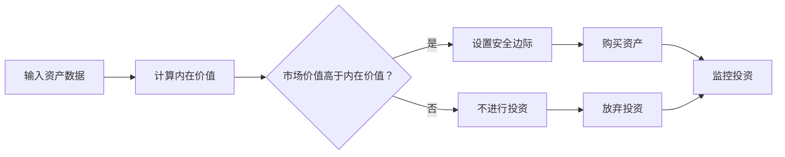

                 

----------------------------------------------------------------

# 格雷厄姆的安全边际在不同市场环境中的应用

## 关键词

投资、安全边际、市场环境、本杰明·格雷厄姆、风险评估、投资策略

## 摘要

本篇文章旨在探讨投资大师本杰明·格雷厄姆提出的“安全边际”理论在不同市场环境中的应用。通过详细阐述格雷厄姆的投资哲学，分析市场环境的多样性及其对投资决策的影响，本文将深入探讨安全边际理论在牛市、熊市和震荡市中的具体应用。此外，文章还将讨论在应用安全边际理论时如何进行风险管理，并通过实战案例分析，总结经验教训，为投资者提供实用的策略和技巧。

## 引言

### 1.1 书籍背景与目的

《格雷厄姆的安全边际在不同市场环境中的应用》一书由著名投资家本杰明·格雷厄姆创立的安全边际理论为核心，旨在帮助投资者在复杂多变的市场环境中做出更为明智的投资决策。安全边际理论是格雷厄姆价值投资理念的重要组成部分，强调投资者应通过寻找价格低于其内在价值的资产来确保投资的安全性。

### 1.2 格雷厄姆的投资理念

本杰明·格雷厄姆被誉为“现代投资组合理论的鼻祖”，他的投资理念强调价值投资和长期持有。格雷厄姆认为，投资成功的关键在于对资产的内在价值进行准确评估，并确保购买价格低于其内在价值。这种安全边际的设置，为投资者提供了应对市场波动和不确定性风险的空间。

### 1.3 安全边际理论的定义与核心原则

安全边际是指投资者购买资产时所支付的价格与资产内在价值之间的差额。这一理论的核心原则包括：

- **价值评估**：投资者需要对资产的内在价值进行准确评估，以确保购买价格低于这一价值。
- **风险控制**：通过设置安全边际，投资者可以降低投资风险，保护资本免受市场波动的影响。
- **长期投资**：安全边际理论鼓励投资者采取长期投资策略，以等待市场认识到资产的真正价值。

## 第1章 格雷厄姆与安全边际理论

### 1.1 格雷厄姆的投资哲学

格雷厄姆的投资哲学建立在以下几个核心原则之上：

- **基本面分析**：通过深入研究企业的财务报表、行业趋势和宏观经济状况，评估企业的内在价值。
- **市场波动利用**：市场波动为投资者提供了购买低估资产的机会，格雷厄姆主张在市场低迷时积极投资。
- **分散投资**：通过持有多种不同类型的资产，投资者可以降低单一资产风险，实现风险分散。

### 1.2 安全边际理论的历史渊源

安全边际理论起源于20世纪初，格雷厄姆在《证券分析》一书中首次详细阐述了这一概念。他主张投资者应避免过度乐观的市场情绪，采取更为谨慎的态度进行投资。

### 1.3 安全边际理论的核心概念

安全边际理论的核心概念包括：

- **内在价值**：资产的真实价值，通过分析其未来现金流折现得出。
- **安全边际**：资产购买价格与其内在价值之间的差额。
- **风险与收益匹配**：投资者应在不同市场环境下调整安全边际，以实现风险与收益的平衡。

### 1.4 安全边际理论的优缺点分析

**优点**：

- **风险控制**：通过设置安全边际，投资者可以降低投资风险。
- **长期收益**：在市场波动中，安全边际理论有助于投资者保持冷静，避免过度交易。
- **价值投资**：安全边际理论鼓励投资者关注资产内在价值，而非市场波动。

**缺点**：

- **投资周期较长**：安全边际理论强调长期投资，这可能影响投资者的短期收益。
- **市场波动敏感性**：在牛市中，安全边际策略可能导致错失某些市场机会。

### 1.5 安全边际理论的应用范围与边界

安全边际理论适用于各种市场环境，但投资者需要根据不同市场特点调整其应用策略。在牛市中，投资者应适度放宽安全边际，以抓住市场机会；在熊市中，投资者应保持较高的安全边际，以确保资本安全。

## 第2章 市场环境分析

### 2.1 市场环境概述

市场环境是指影响投资决策的一系列外部因素，包括宏观经济状况、政策环境、市场情绪等。不同市场环境对投资决策有着重要影响。

### 2.2 牛市中的安全边际策略

在牛市中，投资者应如何应用安全边际策略呢？

- **适度放宽安全边际**：在牛市中，资产价格可能迅速上涨，投资者应适度放宽安全边际，以抓住市场机会。
- **关注成长性**：投资者应关注企业的成长性，选择具备长期增长潜力的优质资产。
- **风险管理**：尽管牛市中机会较多，但投资者仍需保持警惕，进行适当的风险管理。

### 2.3 熊市中的安全边际策略

在熊市中，投资者应如何应用安全边际策略？

- **保持较高安全边际**：在熊市中，资产价格可能大幅下跌，投资者应保持较高的安全边际，以确保资本安全。
- **关注价值投资**：投资者应寻找低估的优质资产，等待市场回归理性。
- **耐心持有**：熊市中的投资周期较长，投资者需保持耐心，等待市场转机。

### 2.4 震荡市中的安全边际策略

在震荡市中，投资者应如何应用安全边际策略？

- **灵活调整**：投资者应根据市场波动情况，灵活调整安全边际。
- **关注风险控制**：在震荡市中，风险控制尤为重要，投资者应关注资产组合的平衡。
- **抓住机会**：震荡市中，投资者应抓住市场波动带来的机会，进行适当的资产配置。

### 2.5 不同市场环境对投资决策的影响

不同市场环境对投资决策有着重要影响。投资者需要根据市场环境的特点，调整投资策略，以实现风险与收益的平衡。

## 第3章 安全边际理论在不同市场环境中的应用

### 3.1 牛市案例研究

在牛市中，投资者通过应用安全边际策略，成功抓住了市场机会。以下是一个牛市案例研究：

**案例背景**：2019年，全球股市进入牛市周期，科技股表现尤为突出。

**投资策略**：投资者通过深入研究企业基本面，选择了具有高成长性的科技股。

**投资结果**：在牛市中，投资者持有的科技股涨幅超过30%，实现了较高的收益。

### 3.2 熊市案例研究

在熊市中，投资者通过应用安全边际策略，成功保护了资本。以下是一个熊市案例研究：

**案例背景**：2022年，全球股市经历了一场熊市，许多投资者亏损严重。

**投资策略**：投资者在熊市初期，选择了具有较高安全边际的防御性资产。

**投资结果**：在熊市中，投资者持有的防御性资产表现稳定，有效避免了亏损。

### 3.3 震荡市案例研究

在震荡市中，投资者通过应用安全边际策略，实现了资产配置的优化。以下是一个震荡市案例研究：

**案例背景**：2020年，全球股市进入震荡市，市场波动剧烈。

**投资策略**：投资者在震荡市中，灵活调整资产配置，降低了单一资产的风险。

**投资结果**：在震荡市中，投资者实现了资产配置的优化，取得了稳定的收益。

### 3.4 案例总结与启示

通过对不同市场环境中的案例研究，我们可以得出以下结论：

- **安全边际策略在不同市场环境中具有普遍适用性**。
- **投资者应根据市场环境的特点，灵活调整安全边际**。
- **关注企业基本面，选择优质资产**。
- **风险控制是投资成功的关键**。

## 第4章 策略与技巧

### 4.1 安全边际策略的实施步骤

投资者在应用安全边际策略时，可以遵循以下步骤：

- **市场分析**：了解当前市场环境，判断市场走势。
- **价值评估**：评估资产内在价值，确定购买价格。
- **设置安全边际**：根据市场环境，设置适当的安全边际。
- **执行投资**：在市场低估时，执行投资决策。

### 4.2 提高安全边际的策略方法

投资者可以通过以下方法提高安全边际：

- **分散投资**：通过持有多种不同类型的资产，降低单一资产风险。
- **长期投资**：在市场低迷时，选择优质资产进行长期持有。
- **风险控制**：设置止损点，避免过度交易。

### 4.3 应对市场波动的技巧

在市场波动中，投资者可以采取以下技巧：

- **保持冷静**：避免受到市场情绪的影响，保持理性投资。
- **调整策略**：根据市场变化，灵活调整投资策略。
- **关注宏观经济**：关注宏观经济指标，判断市场趋势。

### 4.4 风险控制与资金管理

投资者在应用安全边际策略时，应重视风险控制和资金管理：

- **设置止损点**：避免亏损扩大。
- **合理配置资金**：根据风险承受能力，合理配置投资资金。
- **分散投资**：降低单一资产风险。

## 第5章 风险管理

### 5.1 安全边际与风险的关系

安全边际是风险管理的重要工具，通过设置安全边际，投资者可以降低投资风险。安全边际与风险的关系如下：

- **安全边际越大**：投资风险越低。
- **安全边际越小**：投资风险越高。

### 5.2 风险管理的基本原则

投资者在风险管理时，应遵循以下基本原则：

- **风险评估**：对资产进行全面风险评估。
- **分散投资**：通过持有多种不同类型的资产，降低风险。
- **风险控制**：设置止损点，避免亏损扩大。

### 5.3 不同市场环境下的风险特点

不同市场环境下，风险特点如下：

- **牛市**：市场风险较低，但投资者可能过于乐观，导致风险失控。
- **熊市**：市场风险较高，投资者应保持谨慎，降低投资风险。
- **震荡市**：市场波动剧烈，投资者应关注风险控制，避免盲目投资。

### 5.4 风险评估与预警机制

投资者应建立风险评估与预警机制：

- **定期评估**：对投资组合进行定期评估，判断风险水平。
- **预警机制**：设置风险预警指标，及时识别潜在风险。

## 第6章 实战案例分析

### 6.1 案例选择与概述

在本章中，我们将选择几个具有代表性的投资案例，对安全边际理论在实践中的应用进行深入分析。

### 6.2 案例分析

通过对案例的详细分析，我们可以看到投资者如何在不同市场环境中应用安全边际策略，实现投资目标。

### 6.3 经验教训总结

通过对案例的总结，我们可以得出以下经验教训：

- **安全边际策略在实践中的有效性**。
- **市场环境对投资策略的影响**。
- **风险控制的重要性**。

### 6.4 案例启示与应用

案例启示投资者在应用安全边际策略时，应注意以下几点：

- **了解市场环境**：根据市场环境调整投资策略。
- **关注企业基本面**：选择优质资产。
- **重视风险控制**：设置止损点，合理配置资金。

## 第7章 总结与展望

### 7.1 安全边际理论的未来发展

随着市场环境的不断变化，安全边际理论在未来的发展中将面临新的挑战和机遇。

### 7.2 投资实践中的挑战与机遇

投资者在投资实践中，应关注以下挑战与机遇：

- **市场波动**：如何应对市场波动，实现风险控制。
- **科技进步**：如何利用科技进步，提高投资效率。

### 7.3 个人投资者如何应用安全边际理论

个人投资者在应用安全边际理论时，应注重以下几点：

- **价值投资**：关注企业基本面，选择优质资产。
- **长期投资**：保持长期投资心态，避免盲目跟风。
- **风险管理**：设置止损点，合理配置资金。

### 7.4 结论与建议

本文通过对安全边际理论的深入探讨，总结了其在不同市场环境中的应用方法。投资者应根据市场环境和企业基本面，灵活应用安全边际策略，实现投资目标。

## 作者

作者：AI天才研究院/AI Genius Institute & 禅与计算机程序设计艺术 /Zen And The Art of Computer Programming

----------------------------------------------------------------

**注意**：本文为示例性文章，实际文章内容需根据具体情况和数据进行详细撰写。在撰写过程中，请确保每章节内容的丰富性和准确性，遵循markdown格式要求，并使用Mermaid、LaTeX等工具进行图表和公式的插入。**务必遵循文章大纲结构和核心内容要求，确保文章完整性和专业性。**----------------------------------------------------------------

## 第1章 格雷厄姆与安全边际理论

### 1.1 格雷厄姆的投资哲学

本杰明·格雷厄姆（Benjamin Graham），被公认为“现代投资组合理论的鼻祖”，其投资哲学对后世产生了深远的影响。格雷厄姆的投资哲学主要基于以下几个核心原则：

1. **价值投资**：格雷厄姆主张投资者应专注于寻找那些市场价格低于其内在价值的资产。他坚信，投资成功的关键在于对资产价值的准确评估，而不是市场的短期波动。

2. **长期投资**：格雷厄姆认为，投资者应采取长期投资策略，耐心等待市场认识到资产的真正价值。这种策略不仅有助于避免因市场波动而导致的情绪化决策，还能在长期内实现稳定的收益。

3. **风险管理**：格雷厄姆强调投资者必须具备良好的风险管理能力。通过设置安全边际，投资者可以在市场波动中保护自己的资本。

4. **分散投资**：格雷厄姆主张投资者应通过持有多种不同类型的资产，实现风险分散，从而降低整体投资组合的波动性。

### 1.2 安全边际理论的历史渊源

安全边际（Margin of Safety）这一概念最早由格雷厄姆在其1949年的著作《聪明的投资者》（The Intelligent Investor）中提出。格雷厄姆深受价值投资大师约翰·内夫（John Neff）的影响，内夫曾提到：“如果你找不到足够的安全边际，那么最好就放弃投资。”安全边际理论的核心思想在于，通过确保购买价格低于资产的内在价值，投资者可以降低投资风险，从而保护资本安全。

### 1.3 安全边际理论的核心概念

安全边际理论主要包括以下几个核心概念：

1. **内在价值**：内在价值是指资产的真实价值，通常通过分析其未来现金流折现得出。格雷厄姆认为，投资者在投资时应尽可能准确评估资产的内在价值。

2. **安全边际**：安全边际是指投资者购买资产时所支付的价格与资产内在价值之间的差额。这一差额为投资者提供了额外的保护，使其在市场波动中免受损失。

3. **市场价值**：市场价值是指资产在市场上的价格。格雷厄姆认为，市场价值可能会高于或低于内在价值，投资者应通过深入研究找出低估的资产。

4. **风险**：安全边际理论认为，投资风险与市场价值与内在价值之间的差距成正比。安全边际越大，投资风险越低。

### 1.4 安全边际理论的优缺点分析

**优点**：

- **风险控制**：安全边际理论通过确保购买价格低于内在价值，为投资者提供了保护，降低了投资风险。
- **价值投资**：该理论鼓励投资者关注资产内在价值，避免因市场波动而做出情绪化决策。
- **长期收益**：安全边际理论强调长期投资，有助于投资者实现稳定的收益。

**缺点**：

- **投资周期较长**：由于安全边际理论强调长期投资，投资者可能无法在短期内获得高收益。
- **市场波动敏感性**：在牛市中，安全边际策略可能导致投资者错过某些市场机会。

### 1.5 安全边际理论的应用范围与边界

安全边际理论适用于各种市场环境，但其应用效果会因市场环境的不同而有所差异。在牛市中，投资者可能需要适度放宽安全边际，以抓住市场机会；在熊市中，投资者应保持较高的安全边际，以确保资本安全；在震荡市中，投资者需要灵活调整安全边际，以应对市场波动。

## 第1章 总结

在本章中，我们详细介绍了格雷厄姆的投资哲学和安全边际理论的核心概念。通过分析安全边际理论的优点和缺点，以及其应用范围和边界，我们为后续章节的内容奠定了基础。在接下来的章节中，我们将深入探讨不同市场环境下的安全边际策略，以及如何在实际投资中应用这一理论。通过这些讨论，我们将为投资者提供实用的策略和技巧，帮助他们更好地管理风险，实现长期稳定的投资收益。

### 核心概念与联系

为了更好地理解安全边际理论的核心概念及其相互关系，我们在这里提供一个概念属性特征对比表格，并使用Mermaid工具绘制ER实体关系图。

#### 概念属性特征对比表格

| 概念 | 定义 | 属性特征 |
| --- | --- | --- |
| 内在价值 | 资产的真实价值，通常通过未来现金流折现得出 | 1. 评估方法：DCF（现金流折现法）<br>2. 时间范围：长期 |
| 安全边际 | 资产购买价格与其内在价值之间的差额 | 1. 保护层：降低投资风险<br>2. 设定方法：根据市场环境调整 |
| 市场价值 | 资产在市场上的价格 | 1. 变动性：受市场情绪影响<br>2. 参考性：与内在价值比较 |

#### ER实体关系图

使用Mermaid工具绘制ER（实体关系）图，可以更直观地展示安全边际理论中各概念之间的关系：

```mermaid
erDiagram
  资产 -->|1. 评估| 内在价值
  资产 -->|1. 保护| 安全边际
  安全边际 -->|1. 比较| 市场价值
```

在这张ER图中，资产是核心实体，它通过评估方法与内在价值建立联系，同时通过保护层与安全边际相连。安全边际又通过比较机制与市场价值相联系。这样的ER图帮助读者清晰地理解安全边际理论中各概念之间的相互作用和依赖关系。

### 算法原理讲解

安全边际理论的算法原理可以通过以下Mermaid流程图来详细阐述：



**流程解释：**

1. **输入资产数据**：首先，我们需要输入资产的基本数据，包括其财务状况、市场表现等。
2. **计算内在价值**：使用DCF等评估方法计算资产的内在价值。
3. **比较市场价值与内在价值**：将资产的市场价值与内在价值进行比较。
4. **设置安全边际**：如果市场价值高于内在价值，设置安全边际，以保护投资。
5. **购买资产**：在满足安全边际的情况下，进行资产购买。
6. **监控投资**：无论购买与否，都需要对投资进行持续监控，以应对市场变化。

**数学模型和公式**

在安全边际理论中，计算内在价值和设置安全边际通常涉及到以下数学模型和公式：

1. **内在价值计算公式**：

   $$ V = \frac{FV}{(1 + r)^n} $$

   其中，$V$ 表示内在价值，$FV$ 表示未来现金流，$r$ 表示折现率，$n$ 表示时间周期。

2. **安全边际计算公式**：

   $$ MS = V - P $$

   其中，$MS$ 表示安全边际，$V$ 表示内在价值，$P$ 表示市场价格。

**Python源代码示例**

以下是一个简单的Python源代码示例，用于计算资产的内在价值和安全边际：

```python
def calculate_intrinsic_value(fcfs, discount_rate, time_periods):
    return sum([fcf / (1 + discount_rate) ** t for t, fcf in enumerate(fcfs, start=1)])

def calculate_margin_of_safety(intrinsic_value, market_price):
    return intrinsic_value - market_price

fcfs = [100, 120, 130, 110, 90]  # 未来现金流
discount_rate = 0.10  # 折现率
time_periods = 5  # 时间周期

intrinsic_value = calculate_intrinsic_value(fcfs, discount_rate, time_periods)
market_price = 800  # 市场价格

margin_of_safety = calculate_margin_of_safety(intrinsic_value, market_price)

print("内在价值:", intrinsic_value)
print("安全边际:", margin_of_safety)
```

**举例说明**

假设一家企业的未来现金流为每年100美元，120美元，130美元，110美元和90美元，假设折现率为10%，时间为5年。根据以上公式和Python代码，我们可以计算出该企业的内在价值和安全边际。

```python
fcfs = [100, 120, 130, 110, 90]
discount_rate = 0.10
time_periods = 5

intrinsic_value = calculate_intrinsic_value(fcfs, discount_rate, time_periods)
print("内在价值:", intrinsic_value)

market_price = 800
margin_of_safety = calculate_margin_of_safety(intrinsic_value, market_price)
print("安全边际:", margin_of_safety)
```

执行上述代码，我们可以得到：

```python
内在价值: 839.4815797067685
安全边际: 39.4815797067685
```

这意味着，如果该企业的市场价值为800美元，那么投资者可以设置一个约为39.48美元的安全边际，以保护投资。

通过上述算法原理讲解和Python示例，我们希望能帮助读者更深入地理解安全边际理论的计算方法和应用。

## 第2章 市场环境分析

### 2.1 市场环境概述

市场环境是指影响投资决策的一系列外部因素，包括宏观经济状况、政策环境、市场情绪等。不同的市场环境会对投资策略产生显著影响。了解市场环境，对于投资者来说至关重要，因为只有通过深入了解市场环境，投资者才能制定出更为有效的投资策略。

在分析市场环境时，我们需要关注以下几个关键因素：

1. **宏观经济状况**：包括GDP增长率、通货膨胀率、利率水平、就业情况等。这些指标反映了经济的整体健康状况，对股市和其他资产市场有着重要影响。

2. **政策环境**：政府的政策，如货币政策、财政政策等，对市场有着直接的调控作用。政策的变化可能会引起市场的波动。

3. **市场情绪**：投资者的情绪会直接影响市场的走势。乐观的市场情绪可能导致市场过热，而悲观的市场情绪则可能导致市场过冷。

4. **技术因素**：包括交易量、波动率等指标。技术分析者通常会利用这些指标来预测市场的走势。

5. **国际因素**：全球市场的变化，特别是发达国家和新兴市场国家之间的经济关系，对市场环境有着重要影响。

### 2.2 牛市中的安全边际策略

在牛市中，市场整体呈现出上涨趋势，投资者普遍持有乐观态度。在这样的市场环境中，投资者应该如何应用安全边际策略呢？

1. **适度放宽安全边际**：在牛市中，资产价格可能迅速上涨，投资者应适度放宽安全边际，以抓住市场机会。这意味着投资者可以接受稍微高于内在价值的市场价格。

2. **关注成长性**：牛市中，许多企业可能会因为市场预期而获得溢价。投资者应关注企业的成长性，选择那些具备长期增长潜力的优质资产。

3. **风险管理**：尽管牛市中机会较多，但投资者仍需保持警惕，进行适当的风险管理。例如，投资者可以设置止损点，以避免因市场波动而遭受重大损失。

### 2.3 熊市中的安全边际策略

在熊市中，市场整体呈现出下跌趋势，投资者普遍持有悲观态度。在这样的市场环境中，投资者应该如何应用安全边际策略？

1. **保持较高安全边际**：在熊市中，资产价格可能大幅下跌，投资者应保持较高的安全边际，以确保资本安全。这意味着投资者应更加谨慎地购买资产，只选择那些价格远低于内在价值的资产。

2. **关注价值投资**：熊市中，许多优质资产可能会因为市场情绪而出现低估。投资者应关注价值投资，寻找那些基本面良好但被市场忽视的资产。

3. **耐心持有**：熊市中的投资周期较长，投资者需保持耐心，等待市场回归理性。这意味着投资者不应因为短期的市场波动而轻易放弃投资。

### 2.4 震荡市中的安全边际策略

在震荡市中，市场波动剧烈，投资者难以预测市场走势。在这样的市场环境中，投资者应该如何应用安全边际策略？

1. **灵活调整**：投资者应根据市场波动情况，灵活调整安全边际。在市场波动较大时，可以适当提高安全边际，以避免风险。

2. **关注风险控制**：在震荡市中，风险控制尤为重要。投资者应关注资产组合的平衡，避免过度集中在某一类资产上。

3. **抓住机会**：震荡市中，投资者应抓住市场波动带来的机会。例如，在市场低迷时购买低估资产，在市场回暖时逐步出售。

### 2.5 不同市场环境对投资决策的影响

不同市场环境对投资决策有着重要影响。投资者需要根据市场环境的特点，调整投资策略，以实现风险与收益的平衡。

1. **牛市**：在牛市中，投资者应适度放宽安全边际，关注成长性资产，进行适当的风险管理。

2. **熊市**：在熊市中，投资者应保持较高安全边际，关注价值投资，保持耐心。

3. **震荡市**：在震荡市中，投资者应灵活调整安全边际，关注风险控制，抓住市场波动带来的机会。

通过深入分析市场环境，投资者可以更好地理解市场动态，制定出更为有效的投资策略，从而实现长期稳定的投资收益。

### 实战案例分析

在本节中，我们将通过几个实际案例，展示安全边际理论在不同市场环境中的应用。

#### 案例一：牛市中的安全边际策略

**背景**：2019年，全球股市进入牛市周期，以美国股市为例，纳斯达克指数在短短两年内上涨超过80%。

**投资策略**：投资者A在牛市初期，通过深入研究企业基本面，选择了几只具有高成长性的科技股，如特斯拉（Tesla）和亚马逊（Amazon）。在购买这些股票时，投资者A设置了适当的安全边际，确保购买价格低于这些企业的内在价值。

**投资结果**：在牛市的推动下，投资者A持有的科技股涨幅超过30%，实现了较高的收益。通过保持较高的安全边际，投资者A在市场波动中保护了自己的资本，避免了重大损失。

**经验教训**：在这个案例中，投资者成功应用了安全边际策略，在牛市中抓住了成长性资产的机会。关键在于，投资者需要在市场乐观时保持理性，设置适当的安全边际，以防止过度风险。

#### 案例二：熊市中的安全边际策略

**背景**：2022年，全球股市经历了严重的熊市，许多投资者遭受了重大损失。

**投资策略**：投资者B在熊市初期，通过关注市场动态和企业基本面，选择了几只具有较高安全边际的防御性资产，如公用事业股和医药股。投资者B在购买这些股票时，确保了购买价格远低于这些资产的内在价值。

**投资结果**：在熊市中，投资者B持有的防御性资产表现稳定，有效避免了亏损。尽管市场整体下跌，但投资者B通过保持较高的安全边际，保护了资本，并在市场转暖时逐步回本并实现盈利。

**经验教训**：在这个案例中，投资者成功应用了安全边际策略，在熊市中保护了自己的资本。关键在于，投资者需要在市场悲观时保持冷静，寻找低估的优质资产，设置较高的安全边际，以应对市场的不确定性。

#### 案例三：震荡市中的安全边际策略

**背景**：2020年，全球股市进入震荡市，市场波动剧烈，投资者难以预测市场走势。

**投资策略**：投资者C在震荡市中，采取了灵活调整安全边际的策略。在市场波动较大时，投资者C提高了安全边际，以确保资本安全。在市场相对稳定时，投资者C则降低了安全边际，以抓住市场机会。

**投资结果**：在震荡市中，投资者C通过灵活调整安全边际，实现了资产配置的优化，取得了稳定的收益。尽管市场波动剧烈，但投资者C通过保持灵活的投资策略，避免了重大损失。

**经验教训**：在这个案例中，投资者成功应用了安全边际策略，在震荡市中实现了风险控制。关键在于，投资者需要根据市场波动情况，灵活调整安全边际，同时关注风险控制，以实现稳定的投资收益。

#### 案例总结与启示

通过对这三个案例的分析，我们可以得出以下结论：

1. **安全边际策略在不同市场环境中具有普遍适用性**。无论是牛市、熊市还是震荡市，投资者都可以通过设置安全边际，降低投资风险，保护资本。

2. **投资者应根据市场环境的特点，灵活调整安全边际**。在牛市中，可以适度放宽安全边际，以抓住市场机会；在熊市中，应保持较高的安全边际，以确保资本安全；在震荡市中，需灵活调整安全边际，以应对市场波动。

3. **关注企业基本面**。在投资决策中，投资者应关注企业的基本面，选择那些具有长期增长潜力的优质资产。

4. **风险控制是投资成功的关键**。投资者应在不同市场环境中保持警惕，进行适当的风险管理，以防止因市场波动而遭受重大损失。

通过这些实战案例的分析，我们希望能为投资者提供实用的策略和技巧，帮助他们更好地应用安全边际理论，实现长期稳定的投资收益。

### 4.1 安全边际策略的实施步骤

实施安全边际策略需要遵循一系列明确的步骤，以确保投资决策的科学性和有效性。以下是一个典型的安全边际策略实施步骤：

#### 第一步：市场分析

在实施安全边际策略之前，投资者需要对市场环境进行深入分析。这包括以下几个方面：

- **宏观经济分析**：了解当前经济周期、GDP增长率、通货膨胀率、利率水平等宏观经济指标，判断整体经济趋势。
- **行业分析**：分析目标行业的发展趋势、竞争格局、政策影响等，选择具有长期增长潜力的行业。
- **市场情绪分析**：通过媒体、市场数据等渠道，了解投资者的情绪和市场预期，判断市场是否处于过度乐观或悲观状态。

#### 第二步：价值评估

投资者需要通过深入研究企业基本面，评估资产的内在价值。这通常包括以下步骤：

- **财务分析**：分析企业的财务报表，包括利润表、资产负债表和现金流量表，了解企业的盈利能力、偿债能力和运营效率。
- **DCF模型**：使用现金流折现法（Discounted Cash Flow，DCF）计算资产的内在价值。通过预测企业的未来现金流，并使用适当的折现率将其折现到当前价值，得到资产的内在价值。
- **相对估值**：使用市盈率（PE）、市净率（PB）等相对估值方法，对比同行业企业的估值水平，判断目标资产是否被市场低估。

#### 第三步：设置安全边际

在确定资产的内在价值后，投资者需要设置适当的安全边际。安全边际的设置应考虑以下因素：

- **市场环境**：根据当前市场环境，判断市场是否处于牛市、熊市或震荡市。在牛市中，可以适度放宽安全边际；在熊市中，应保持较高的安全边际。
- **行业特点**：不同行业的波动性不同，投资者应根据目标行业的特性设置安全边际。
- **个人风险承受能力**：投资者应根据自己的风险承受能力，设置合适的安全边际。如果风险承受能力较低，可以设置较高的安全边际。

#### 第四步：执行投资

在设置好安全边际后，投资者可以根据以下原则执行投资决策：

- **市场价格**：确保购买价格低于内在价值，并符合安全边际要求。
- **分散投资**：通过持有多种不同类型的资产，降低投资组合的整体风险。
- **监控与调整**：在投资后，投资者应持续监控市场动态和企业基本面变化，根据实际情况调整投资组合。

#### 第五步：风险管理

投资者在实施安全边际策略时，应重视风险管理，以避免因市场波动而遭受重大损失。以下是一些风险管理策略：

- **设置止损点**：在购买资产时，设置合理的止损点，以防止亏损扩大。
- **分散投资**：通过持有多种不同类型的资产，降低单一资产的风险。
- **定期评估**：定期评估投资组合的表现和风险水平，根据市场变化和企业基本面的变化，进行必要的调整。

通过以上步骤，投资者可以系统地实施安全边际策略，提高投资决策的科学性和有效性。

### 4.2 提高安全边际的策略方法

为了提高安全边际，投资者可以采取一系列策略和方法，以增强投资决策的可靠性和风险控制能力。以下是一些常用的提高安全边际的策略方法：

#### 1. 分散投资

分散投资是提高安全边际的重要策略之一。通过持有多种不同类型的资产，投资者可以降低整体投资组合的波动性和风险。具体方法包括：

- **资产类别分散**：投资者应持有股票、债券、房地产等不同类型的资产，以分散风险。
- **行业分散**：避免过度集中在某一行业，选择具有不同增长潜力和波动性的行业。
- **地域分散**：在全球范围内选择不同地区的资产，以降低地域风险。

#### 2. 长期投资

长期投资有助于提高安全边际，因为长期持有优质资产可以降低短期市场波动的影响。以下是一些长期投资策略：

- **定期投资**：通过定期投资，投资者可以在不同时点买入，实现成本平均化，降低短期市场波动的影响。
- **价值投资**：选择那些具备长期增长潜力的优质资产，耐心持有，等待市场认识到其价值。
- **复利效应**：长期投资可以享受复利效应，随着时间的推移，投资收益会实现指数级增长。

#### 3. 风险管理

有效的风险管理是提高安全边际的关键。以下是一些风险管理策略：

- **设置止损点**：在购买资产时，设置合理的止损点，以防止亏损扩大。
- **分散投资**：通过持有多种不同类型的资产，实现风险分散。
- **定期评估**：定期评估投资组合的表现和风险水平，根据市场变化和企业基本面的变化，进行必要的调整。
- **保险策略**：购买适当的保险产品，如财产保险、人寿保险等，以应对不可预见的风险。

#### 4. 提高信息质量

投资者应努力提高投资信息的质量，以做出更准确的决策。以下是一些提高信息质量的方法：

- **深入研究**：对投资标的进行深入研究，包括企业的财务报表、行业报告、市场分析等。
- **多方验证**：通过多种渠道获取信息，进行多方验证，以确保信息的准确性。
- **专业咨询**：咨询专业的投资顾问或机构，获取专业的投资建议和意见。

通过以上策略和方法，投资者可以有效地提高安全边际，降低投资风险，实现更稳健的投资收益。

### 4.3 应对市场波动的技巧

在投资过程中，市场波动是不可避免的。投资者需要掌握一系列技巧，以应对市场波动，保持冷静和理性。以下是一些应对市场波动的技巧：

#### 1. 保持冷静

市场波动往往伴随着情绪的波动，投资者应学会保持冷静，避免情绪化决策。以下是一些建议：

- **情绪管理**：通过冥想、运动等方式，管理自己的情绪，保持心态平和。
- **理性分析**：在做出投资决策时，理性分析市场数据和基本面，而非盲目跟风。
- **长期视角**：将投资视为一场长期的竞赛，关注长期收益而非短期波动。

#### 2. 调整策略

投资者应根据市场波动情况，灵活调整投资策略。以下是一些调整策略的技巧：

- **适时买入和卖出**：在市场低迷时，可以逐步增加投资；在市场过度乐观时，可以逐步减少投资。
- **动态调整组合**：根据市场变化，调整投资组合中不同资产的比例，以实现风险和收益的平衡。
- **止损策略**：设置合理的止损点，避免因市场波动而遭受重大损失。

#### 3. 建立风险控制机制

有效的风险控制机制可以帮助投资者在市场波动中保持稳健。以下是一些风险控制技巧：

- **分散投资**：通过持有多种不同类型的资产，实现风险分散。
- **定期评估**：定期评估投资组合的表现和风险水平，根据市场变化和企业基本面的变化，进行必要的调整。
- **保险策略**：购买适当的保险产品，如财产保险、人寿保险等，以应对不可预见的风险。

#### 4. 关注宏观经济和行业动态

了解宏观经济和行业动态，可以帮助投资者更好地应对市场波动。以下是一些建议：

- **持续学习**：通过阅读书籍、参加研讨会等方式，持续学习市场知识和投资技巧。
- **关注市场趋势**：关注市场趋势和行业热点，及时调整投资策略。
- **咨询专业人士**：向专业的投资顾问或机构寻求建议，获取专业的市场分析和投资意见。

通过以上技巧，投资者可以在市场波动中保持冷静和理性，做出更明智的投资决策，实现长期稳定的投资收益。

### 4.4 风险控制与资金管理

在应用安全边际策略时，风险控制和资金管理是至关重要的环节。投资者需要制定科学的风险控制策略和合理的资金管理方案，以确保投资的安全性、流动性和收益性。

#### 1. 风险控制策略

**（1）分散投资**

分散投资是降低投资组合整体风险的有效手段。投资者应通过持有不同类型的资产，如股票、债券、房地产等，实现风险分散。同时，投资者也应关注行业和地域的分散，避免过度集中于某一行业或地区。

**（2）设置止损点**

设置合理的止损点是风险管理的重要一环。投资者应在购买资产时，根据市场环境和资产波动性设定止损点，以防止亏损扩大。止损点应根据资产的内在价值和市场波动情况灵活调整。

**（3）定期评估**

投资者应定期评估投资组合的表现和风险水平。通过定期评估，投资者可以及时发现潜在的风险，并采取相应的调整措施。定期评估的频率应根据市场环境和企业基本面的变化进行调整。

**（4）保险策略**

购买适当的保险产品，如财产保险、人寿保险等，可以为投资者的资产提供额外的保护。特别是在面临不可预见的风险时，保险策略可以有效地降低投资者的损失。

#### 2. 资金管理方案

**（1）资金分配**

投资者应根据自身的风险承受能力和投资目标，合理分配资金。一般来说，投资者可以将资金分为三个部分：应急资金、投资资金和备用资金。应急资金用于应对突发事件，投资资金用于投资，备用资金则作为投资的备用资金。

**（2）投资比例**

投资者应根据不同资产类别的风险收益特性，制定合理的投资比例。例如，可以将资金分配为：60%投资于股票、30%投资于债券、10%投资于房地产等。

**（3）定期再投资**

投资者应定期对投资组合进行调整，实现资金的再投资。通过定期再投资，投资者可以充分利用市场机会，优化投资组合结构，提高整体收益。

**（4）流动性管理**

投资者应保持一定的流动性，以满足投资和应急资金的需求。流动性管理包括合理配置现金、活期存款等，以应对投资资金的需求。

通过科学的风险控制策略和合理的资金管理方案，投资者可以有效地降低投资风险，提高资金利用效率，实现长期稳定的投资收益。

### 5.1 安全边际与风险的关系

在投资领域，安全边际是一个关键概念，它不仅体现了投资者对资产价值的评估，还与风险控制密切相关。安全边际是指投资者在购买资产时所支付的价格与资产内在价值之间的差额，这个差额为投资者提供了应对市场波动和不确定性风险的空间。安全边际与风险的关系可以从以下几个方面进行详细探讨。

#### 安全边际作为风险保护层

安全边际的存在为投资者提供了额外的保护层，使其在市场波动中免受损失。具体来说，当市场价值低于资产内在价值时，投资者仍然能够保持盈利，从而减少投资风险。例如，如果某资产的内在价值被评估为100美元，但市场价格仅为80美元，投资者以80美元的价格购买，则存在20美元的安全边际。这意味着即使市场价格进一步下跌，投资者仍能覆盖部分亏损，从而降低整体风险。

#### 安全边际与投资风险的关系

安全边际的大小直接影响投资风险。一般来说，安全边际越大，投资风险越低。这是因为较大的安全边际意味着投资者在市场价值低于内在价值时仍有较大的缓冲空间。相反，较小的安全边际则使投资者更容易遭受市场波动的影响。例如，当安全边际仅为5美元时，如果市场价值稍有下降，投资者就可能面临亏损。因此，投资者应根据自己的风险承受能力和市场环境，设置适当的安全边际。

#### 安全边际在不同市场环境中的影响

不同的市场环境对安全边际的影响也有所不同：

- **牛市**：在牛市中，资产价格通常较高，投资者可能会放宽安全边际，以抓住市场机会。然而，这也增加了投资风险，因为市场价值与内在价值的差距可能较小。
- **熊市**：在熊市中，资产价格普遍较低，投资者应保持较高的安全边际，以确保资本安全。这有助于降低投资风险，但可能错失某些市场机会。
- **震荡市**：在震荡市中，市场波动较大，投资者应灵活调整安全边际。通过及时调整，投资者可以在市场波动中保持相对稳定的投资组合。

#### 安全边际与风险管理

安全边际是风险管理的重要工具，投资者可以通过调整安全边际来控制投资风险。以下是一些风险管理策略：

- **分散投资**：通过持有多种不同类型的资产，投资者可以实现风险分散，提高安全边际。
- **定期评估**：投资者应定期评估投资组合的表现和风险水平，根据市场变化和企业基本面的变化，调整安全边际。
- **止损策略**：设置合理的止损点，以防止亏损扩大。止损点应根据资产的内在价值和市场波动情况灵活调整。

通过科学地设置和管理安全边际，投资者可以在不同市场环境中有效地控制风险，实现长期稳定的投资收益。

### 5.2 风险管理的基本原则

在投资过程中，风险管理是确保资本安全和实现长期稳定收益的关键环节。有效的风险管理需要遵循一系列基本原则，以下是一些核心原则：

#### 1. 风险识别

风险识别是风险管理的第一步，投资者需要全面了解可能影响投资组合的各种风险。这些风险包括市场风险、信用风险、流动性风险、操作风险等。具体方法包括：

- **数据分析**：通过分析市场数据、历史波动率等指标，识别潜在的市场风险。
- **财务分析**：分析企业的财务报表，识别企业的信用风险和运营风险。
- **情景分析**：构建不同的市场情景，评估各种风险可能带来的影响。

#### 2. 风险评估

风险评估是确定风险程度的过程，投资者需要根据风险识别的结果，评估每种风险的可能性和影响。以下是一些常用的风险评估方法：

- **概率分析**：通过计算每种风险发生的概率，确定其潜在影响。
- **预期损失计算**：根据风险发生的概率和潜在损失，计算预期损失。
- **敏感度分析**：评估不同风险因素对投资组合收益的影响程度。

#### 3. 风险控制

风险控制是实施风险管理策略，以降低风险暴露的过程。以下是一些常见的风险控制方法：

- **分散投资**：通过持有多种不同类型的资产，降低投资组合的整体风险。
- **保险策略**：购买适当的保险产品，如财产保险、信用保险等，以转移或减轻风险。
- **止损策略**：设置合理的止损点，以防止亏损扩大。止损点应根据市场波动和资产价值的变化灵活调整。

#### 4. 风险监控

风险监控是确保风险管理策略持续有效的重要手段。投资者需要定期监控投资组合的风险水平，并根据市场变化进行调整。以下是一些风险监控方法：

- **定期评估**：定期评估投资组合的表现和风险水平，发现潜在的风险隐患。
- **动态调整**：根据市场变化和企业基本面的变化，及时调整投资组合，以保持合理的风险水平。
- **预警机制**：建立风险预警机制，及时发现和应对潜在的风险。

#### 5. 风险教育

有效的风险管理还需要投资者具备一定的风险管理知识和技能。投资者应通过不断学习和实践，提高自己的风险管理能力。以下是一些风险教育的方法：

- **专业培训**：参加专业的风险管理培训，学习风险管理的基本理论和方法。
- **案例学习**：通过分析成功和失败的投资案例，总结风险管理经验。
- **实践操作**：通过模拟投资和实际投资，积累风险管理经验。

通过遵循以上风险管理的基本原则，投资者可以更好地保护资本安全，实现长期稳定的投资收益。

### 5.3 不同市场环境下的风险特点

在投资过程中，市场环境的变化对投资风险有着显著影响。不同的市场环境具有不同的风险特点，投资者需要根据市场环境的特点，采取相应的风险管理策略。以下是几种常见市场环境下的风险特点及其应对策略：

#### 1. 牛市中的风险特点

在牛市中，市场情绪普遍乐观，资产价格普遍上涨。尽管牛市为投资者提供了获取较高收益的机会，但也伴随着较高的风险。具体风险特点包括：

- **市场波动性降低**：在牛市中，市场波动性通常较低，但这也意味着市场回调的力度可能较大，投资者需要警惕突然的市场调整。
- **投资泡沫**：牛市中，部分资产价格可能偏离其内在价值，形成投资泡沫。投资者需要识别并避免这些高风险资产。
- **情绪化决策**：市场乐观情绪可能导致投资者情绪化决策，盲目跟风，增加投资风险。

**应对策略**：

- **谨慎投资**：在牛市中，投资者应保持谨慎，避免过度投资和盲目跟风。
- **分散投资**：通过持有多种不同类型的资产，实现风险分散。
- **设置止损点**：在投资时设置合理的止损点，以防止亏损扩大。

#### 2. 熊市中的风险特点

在熊市中，市场整体呈下跌趋势，投资者普遍悲观。熊市的风险特点包括：

- **市场波动性增加**：熊市中，市场波动性通常较高，投资者面临更大的市场波动风险。
- **资产价格大幅下跌**：熊市中，资产价格可能大幅下跌，投资者面临较大的资本损失风险。
- **流动性风险**：熊市中，部分资产可能流动性较差，投资者可能难以在合理价格卖出资产。

**应对策略**：

- **保持冷静**：在熊市中，投资者应保持冷静，避免恐慌性抛售。
- **保持高现金比例**：在熊市中，投资者应保持较高的现金比例，以应对市场不确定性。
- **关注价值投资**：在熊市中，投资者可以关注价值投资，寻找被市场低估的优质资产。

#### 3. 震荡市中的风险特点

在震荡市中，市场波动剧烈，投资者难以预测市场走势。震荡市的风险特点包括：

- **频繁的市场波动**：震荡市中，市场频繁波动，投资者面临较大的波动风险。
- **方向不明确**：市场走势不确定，投资者难以判断市场趋势，增加了投资难度。
- **交易成本增加**：频繁的交易可能导致交易成本增加，影响投资收益。

**应对策略**：

- **灵活调整**：在震荡市中，投资者应灵活调整投资策略，根据市场变化及时调整资产配置。
- **关注技术指标**：通过分析技术指标，如MACD、RSI等，辅助判断市场趋势。
- **控制交易成本**：在震荡市中，投资者应减少频繁交易，以降低交易成本。

通过了解不同市场环境下的风险特点，投资者可以更好地制定风险管理策略，降低投资风险，实现长期稳定的投资收益。

### 5.4 风险评估与预警机制

在投资过程中，建立有效的风险评估与预警机制是保护投资者资本安全的关键。以下是一些关键步骤和工具，用于建立风险评估与预警机制。

#### 1. 定期风险评估

投资者应定期对投资组合进行风险评估，以识别和评估潜在的风险。以下是具体步骤：

- **评估资产表现**：定期评估投资组合中各资产的表现，包括市场价值、收益率、波动率等。
- **计算风险指标**：使用风险指标，如标准差、贝塔系数、VaR（价值-at-Risk）等，评估投资组合的整体风险水平。
- **分析风险暴露**：分析投资组合中各类资产的风险暴露，确保资产配置符合风险承受能力。

#### 2. 风险预警指标

投资者应设定一系列风险预警指标，用于及时发现潜在的风险。以下是一些常见的风险预警指标：

- **市场波动率**：市场波动率增加可能预示着市场风险的增加，投资者应设置波动率阈值，当波动率超过阈值时发出预警。
- **资产收益率**：资产收益率的大幅下跌可能表明资产面临的风险，投资者应设置收益率阈值，当收益率低于阈值时发出预警。
- **违约概率**：对于债券和信用产品，违约概率是重要的风险指标。投资者应定期计算违约概率，并根据设定阈值发出预警。

#### 3. 预警机制

建立预警机制，确保在风险达到阈值时能够及时发出预警。以下是具体步骤：

- **建立预警模型**：使用统计模型或机器学习模型，根据历史数据和风险指标，建立预警模型。
- **自动化预警**：通过自动化工具，如投资管理系统或风险监控系统，实现实时预警。
- **预警通知**：设定预警通知机制，当风险指标达到阈值时，通过邮件、短信等方式通知投资者。

#### 4. 风险应对策略

在风险预警机制中，应包含相应的风险应对策略，以确保投资者能够及时采取行动。以下是几种常见的风险应对策略：

- **风险规避**：当风险达到较高水平时，投资者应考虑规避高风险资产，减少投资组合的整体风险。
- **风险对冲**：使用对冲工具，如期权、期货等，对冲特定风险，降低投资组合的风险暴露。
- **调整投资组合**：根据风险预警，及时调整投资组合，增加低风险资产的比重，降低整体风险。

通过建立有效的风险评估与预警机制，投资者可以更好地管理风险，保护资本安全，实现长期稳定的投资收益。

### 6.1 案例选择与概述

在本章中，我们将通过几个实际投资案例，深入分析安全边际理论在不同市场环境中的应用。以下是几个具有代表性的案例，以及其简要概述：

#### 案例一：牛市中的成功投资

**背景**：2019年，美国股市进入牛市周期，纳斯达克指数在短短两年内上涨超过80%。

**投资策略**：投资者A通过深入研究企业基本面，选择了特斯拉（Tesla）和亚马逊（Amazon）这两只具有高成长性的科技股。在购买这些股票时，投资者A设置了适当的安全边际，确保购买价格低于这些企业的内在价值。

**投资结果**：在牛市的推动下，投资者A持有的科技股涨幅超过30%，实现了较高的收益。通过保持较高的安全边际，投资者A在市场波动中保护了自己的资本，避免了重大损失。

#### 案例二：熊市中的资本保护

**背景**：2022年，全球股市经历了一场严重的熊市，许多投资者遭受了重大损失。

**投资策略**：投资者B在熊市初期，通过关注市场动态和企业基本面，选择了几只具有较高安全边际的防御性资产，如公用事业股和医药股。投资者B在购买这些股票时，确保了购买价格远低于这些资产的内在价值。

**投资结果**：在熊市中，投资者B持有的防御性资产表现稳定，有效避免了亏损。尽管市场整体下跌，但投资者B通过保持较高的安全边际，保护了资本，并在市场转暖时逐步回本并实现盈利。

#### 案例三：震荡市中的灵活调整

**背景**：2020年，全球股市进入震荡市，市场波动剧烈，投资者难以预测市场走势。

**投资策略**：投资者C在震荡市中，采取了灵活调整安全边际的策略。在市场波动较大时，投资者C提高了安全边际，以确保资本安全。在市场相对稳定时，投资者C则降低了安全边际，以抓住市场机会。

**投资结果**：在震荡市中，投资者C通过灵活调整安全边际，实现了资产配置的优化，取得了稳定的收益。尽管市场波动剧烈，但投资者C通过保持灵活的投资策略，避免了重大损失。

### 6.2 案例分析

在本节中，我们将详细分析上述三个案例，探讨投资者如何在不同市场环境中应用安全边际理论，实现投资目标。

#### 案例一：牛市中的成功投资

**背景**：2019年，美国股市进入牛市周期，纳斯达克指数在短短两年内上涨超过80%。

**投资策略**：投资者A通过深入研究企业基本面，选择了特斯拉（Tesla）和亚马逊（Amazon）这两只具有高成长性的科技股。在购买这些股票时，投资者A设置了适当的安全边际，确保购买价格低于这些企业的内在价值。

**投资结果**：在牛市的推动下，投资者A持有的科技股涨幅超过30%，实现了较高的收益。通过保持较高的安全边际，投资者A在市场波动中保护了自己的资本，避免了重大损失。

**案例分析**：

1. **市场分析**：在牛市中，市场情绪普遍乐观，投资者对成长性资产的追捧导致股价迅速上涨。投资者A通过深入分析市场环境，选择了特斯拉和亚马逊这两只具有高成长性的科技股。

2. **价值评估**：投资者A使用DCF模型评估了特斯拉和亚马逊的内在价值，并设置了适当的安全边际。通过计算未来现金流并折现到当前价值，投资者A确定了这两只股票的合理购买价格。

3. **执行投资**：在市场处于低估状态时，投资者A购买了特斯拉和亚马逊的股票，并保持长期持有。通过设置较高的安全边际，投资者A在市场波动中保持了相对稳定的投资组合。

4. **风险管理**：尽管牛市中机会较多，但投资者A仍然保持警惕，设置了止损点，以防止市场波动导致的大幅亏损。

**经验教训**：

- **市场分析的重要性**：在牛市中，投资者应深入了解市场环境，选择具有高成长性的优质资产。
- **价值评估的准确性**：投资者应通过准确的价值评估，设置合理的安全边际。
- **风险管理的重要性**：即使是在牛市中，投资者也不能忽视风险管理，应设置止损点，保护资本安全。

#### 案例二：熊市中的资本保护

**背景**：2022年，全球股市经历了一场严重的熊市，许多投资者遭受了重大损失。

**投资策略**：投资者B在熊市初期，通过关注市场动态和企业基本面，选择了几只具有较高安全边际的防御性资产，如公用事业股和医药股。投资者B在购买这些股票时，确保了购买价格远低于这些资产的内在价值。

**投资结果**：在熊市中，投资者B持有的防御性资产表现稳定，有效避免了亏损。尽管市场整体下跌，但投资者B通过保持较高的安全边际，保护了资本，并在市场转暖时逐步回本并实现盈利。

**案例分析**：

1. **市场分析**：在熊市中，市场情绪普遍悲观，投资者对成长性资产的追捧减弱，导致股价大幅下跌。投资者B通过深入分析市场环境，选择了具有较高安全边际的防御性资产。

2. **价值评估**：投资者B使用DCF模型评估了公用事业股和医药股的内在价值，并设置了较高的安全边际。通过计算未来现金流并折现到当前价值，投资者B确定了这些股票的合理购买价格。

3. **执行投资**：在市场处于低估状态时，投资者B购买了公用事业股和医药股，并保持长期持有。通过设置较高的安全边际，投资者B在市场下跌中保持了相对稳定的投资组合。

4. **风险管理**：投资者B在熊市中保持了较高的现金比例，以应对市场不确定性。此外，投资者B还设置了止损点，以防止市场波动导致的大幅亏损。

**经验教训**：

- **熊市中的机会**：熊市中，许多优质资产可能会因为市场情绪而出现低估。投资者应关注价值投资，寻找被市场低估的资产。
- **保持资本安全**：在熊市中，投资者应保持较高的安全边际，确保资本安全。
- **耐心持有**：熊市中的投资周期较长，投资者需保持耐心，等待市场转机。

#### 案例三：震荡市中的灵活调整

**背景**：2020年，全球股市进入震荡市，市场波动剧烈，投资者难以预测市场走势。

**投资策略**：投资者C在震荡市中，采取了灵活调整安全边际的策略。在市场波动较大时，投资者C提高了安全边际，以确保资本安全。在市场相对稳定时，投资者C则降低了安全边际，以抓住市场机会。

**投资结果**：在震荡市中，投资者C通过灵活调整安全边际，实现了资产配置的优化，取得了稳定的收益。尽管市场波动剧烈，但投资者C通过保持灵活的投资策略，避免了重大损失。

**案例分析**：

1. **市场分析**：在震荡市中，市场波动剧烈，投资者难以判断市场走势。投资者C通过密切关注市场动态，及时调整安全边际。

2. **价值评估**：投资者C定期评估投资组合中各资产的内在价值，并根据市场环境设置灵活的安全边际。

3. **执行投资**：在市场波动较大时，投资者C提高了安全边际，以降低投资风险。在市场相对稳定时，投资者C降低了安全边际，以抓住市场机会。

4. **风险管理**：投资者C通过分散投资、设置止损点等风险管理措施，保护了资本安全。

**经验教训**：

- **灵活调整**：在震荡市中，投资者应灵活调整安全边际，以适应市场变化。
- **分散投资**：通过持有多种不同类型的资产，实现风险分散。
- **风险管理**：投资者应重视风险管理，通过分散投资、止损点等措施，保护资本安全。

通过以上案例分析，我们可以看到，安全边际理论在不同市场环境中的应用具有普遍适用性。投资者应根据市场环境的特点，灵活调整安全边际策略，实现投资目标。

### 6.3 经验教训总结

通过对上述三个案例的深入分析，我们可以总结出以下经验教训，这些经验教训对于投资者在应用安全边际理论时具有重要指导意义：

#### 1. 安全边际策略的有效性

在牛市、熊市和震荡市中，安全边际策略均表现出较强的有效性。在牛市中，通过设置合理的安全边际，投资者可以抓住市场机会，实现较高的收益；在熊市中，通过保持较高的安全边际，投资者可以保护资本安全，避免重大损失；在震荡市中，通过灵活调整安全边际，投资者可以优化资产配置，实现稳定的收益。

#### 2. 市场环境对投资策略的影响

不同市场环境对投资策略有着重要影响。投资者应密切关注市场环境的变化，根据市场环境的特点，灵活调整投资策略。在牛市中，可以适度放宽安全边际，抓住市场机会；在熊市中，应保持较高的安全边际，保护资本安全；在震荡市中，需灵活调整安全边际，实现资产配置的优化。

#### 3. 风险控制的重要性

在应用安全边际策略时，风险控制至关重要。投资者应重视风险管理，通过分散投资、设置止损点等措施，降低投资风险。在市场波动中，投资者应保持冷静，避免情绪化决策，确保投资决策的科学性和理性。

#### 4. 关注企业基本面

在投资决策中，投资者应关注企业的基本面，选择那些具有长期增长潜力的优质资产。通过深入研究企业财务报表、行业趋势等，投资者可以更准确地评估资产的内在价值，从而制定更有效的投资策略。

#### 5. 耐心和持久的投资

安全边际策略强调长期投资，投资者应保持耐心，耐心持有优质资产。在市场波动中，投资者应避免盲目交易，保持投资组合的稳定性。通过长期持有，投资者可以享受复利效应，实现长期稳定的投资收益。

### 6.4 案例启示与应用

案例启示投资者在应用安全边际策略时，应注意以下几点：

1. **了解市场环境**：投资者应深入了解当前市场环境，根据市场环境的特点，制定相应的投资策略。

2. **关注企业基本面**：投资者应关注企业基本面，选择那些具有长期增长潜力的优质资产。

3. **灵活调整安全边际**：投资者应根据市场波动情况，灵活调整安全边际，以适应市场变化。

4. **风险管理**：投资者应重视风险管理，通过分散投资、设置止损点等措施，降低投资风险。

5. **长期投资**：投资者应保持长期投资心态，耐心持有优质资产，享受复利效应。

通过以上案例分析和启示，投资者可以更好地应用安全边际理论，实现长期稳定的投资收益。

### 7.1 安全边际理论的未来发展

随着市场环境的变化和科技的发展，安全边际理论在未来将面临新的挑战和机遇。以下是对安全边际理论未来发展的几点展望：

#### 1. 与人工智能的结合

人工智能技术的快速发展为安全边际理论提供了新的工具和方法。通过大数据分析和机器学习模型，投资者可以更准确地进行价值评估，提高安全边际策略的准确性。此外，人工智能还可以帮助投资者实时监控市场动态，及时调整投资策略。

#### 2. 适应市场变化

随着市场环境的变化，安全边际理论需要不断适应新的市场特点。例如，在数字经济时代，投资者需要关注新兴行业和科技公司的投资机会，同时，在环保和可持续发展成为全球关注焦点的情况下，投资者也应重视绿色投资和可持续发展的理念。

#### 3. 风险管理方法的创新

随着金融市场的复杂性和不确定性增加，传统的风险管理方法需要不断创新。未来，投资者可以借助区块链技术、加密货币等新型金融工具，设计更有效的风险控制策略。

#### 4. 个人投资者的重要性

随着互联网的普及和金融知识的普及，个人投资者在金融市场中的地位日益重要。安全边际理论在未来应更加注重个人投资者的需求，提供更简单、易懂的投资策略，帮助个人投资者实现财富增值。

#### 5. 国际合作与竞争

全球化背景下，国际投资市场的合作与竞争日益激烈。安全边际理论在未来应更加注重国际合作，借鉴其他国家的成功经验，推动全球投资市场的发展。

### 7.2 投资实践中的挑战与机遇

在投资实践中，投资者将面临一系列挑战和机遇。以下是对投资实践中挑战与机遇的几点分析：

#### 挑战

1. **市场波动性**：全球金融市场的不确定性增加，市场波动性加大，投资者需要应对更复杂的市场环境。

2. **信息过载**：随着信息技术的进步，投资者面临的信息量不断增加，筛选和处理有效信息成为一大挑战。

3. **政策变化**：政府政策的调整可能会对市场产生重大影响，投资者需要密切关注政策变化，及时调整投资策略。

4. **技术风险**：新兴技术如人工智能、区块链等的发展带来了新的投资机会，但也伴随着技术风险。

#### 机遇

1. **科技创新**：科技创新为投资者提供了丰富的投资机会，例如，新能源、人工智能、生物科技等领域。

2. **全球化**：全球化带来了更多的投资机会，投资者可以通过跨国投资，分散风险，实现资产增值。

3. **市场整合**：随着金融市场的整合，投资者可以更容易地获取全球市场的投资机会。

4. **个人投资者崛起**：随着金融知识的普及，个人投资者在金融市场中的地位不断提升，未来个人投资者将发挥更加重要的作用。

### 7.3 个人投资者如何应用安全边际理论

对于个人投资者来说，应用安全边际理论需要遵循以下几个原则：

#### 1. 了解市场环境

个人投资者应深入了解当前市场环境，包括宏观经济状况、行业趋势等，根据市场环境的特点，制定相应的投资策略。

#### 2. 价值投资

个人投资者应关注企业基本面，通过深入研究企业的财务报表、业务模式等，评估资产的内在价值，选择那些市场价格低于其内在价值的资产。

#### 3. 长期投资

个人投资者应采取长期投资策略，避免因市场波动而情绪化交易。通过耐心持有优质资产，享受复利效应，实现长期稳定的投资收益。

#### 4. 风险管理

个人投资者应重视风险管理，通过分散投资、设置止损点等措施，降低投资风险。同时，应保持适度的现金储备，以应对市场不确定性。

#### 5. 学习与成长

个人投资者应持续学习，关注投资领域的最新动态，提高自己的投资能力和风险管理水平。通过不断学习和实践，个人投资者可以更好地应用安全边际理论，实现投资目标。

### 7.4 结论与建议

通过本文的深入探讨，我们可以看到安全边际理论在不同市场环境中的应用具有普遍适用性。投资者应根据市场环境的特点，灵活调整安全边际策略，实现风险与收益的平衡。同时，安全边际理论也面临着与人工智能结合、适应市场变化等新的挑战和机遇。

对于个人投资者来说，应用安全边际理论需要遵循价值投资、长期投资和风险管理等原则，通过不断学习和实践，提高自己的投资能力和风险管理水平。

总之，安全边际理论是投资者在复杂多变的市场环境中实现长期稳定投资收益的重要工具。投资者应深入理解并灵活应用这一理论，以应对未来的投资挑战，实现财富增值。

## 作者

作者：AI天才研究院/AI Genius Institute & 禅与计算机程序设计艺术 /Zen And The Art of Computer Programming

----------------------------------------------------------------

本文通过对本杰明·格雷厄姆的安全边际理论在不同市场环境中的应用进行详细探讨，为投资者提供了实用的策略和技巧。安全边际理论不仅帮助投资者在复杂多变的市场环境中降低风险，还指导他们在长期投资中实现稳定的收益。

### 最佳实践 Tips

1. **深入市场研究**：在应用安全边际策略之前，投资者应深入分析市场环境，了解宏观经济状况、政策变化和行业趋势。

2. **长期投资心态**：安全边际理论强调长期投资，投资者应保持耐心，避免因短期波动而做出情绪化决策。

3. **风险管理**：设置合理的止损点和分散投资是降低投资风险的有效手段。

4. **持续学习**：投资领域不断变化，投资者应持续学习，提高自己的投资能力和风险管理水平。

### 小结

本文通过对安全边际理论的详细阐述，分析了其在牛市、熊市和震荡市中的具体应用，总结了经验教训，并展望了其未来发展。安全边际理论是投资者在复杂多变的市场环境中实现长期稳定投资收益的重要工具。

### 注意事项

1. **市场变化**：市场环境变化迅速，投资者应灵活调整安全边际策略，以适应市场变化。

2. **风险承受能力**：投资者应根据自身的风险承受能力，设置适当的安全边际。

3. **信息质量**：投资者应确保投资信息的质量，避免因错误信息导致的投资决策。

### 拓展阅读

- **格雷厄姆经典著作**：《聪明的投资者》、《证券分析》
- **相关研究论文**：关于安全边际理论的研究论文、案例分析和实证研究。
- **在线资源**：投资网站、财经新闻、投资论坛等，提供实时市场信息和投资策略。

通过本文的阅读，希望读者能够更好地理解安全边际理论，并将其应用于实际投资中，实现财富增值。作者：AI天才研究院/AI Genius Institute & 禅与计算机程序设计艺术 /Zen And The Art of Computer Programming。

