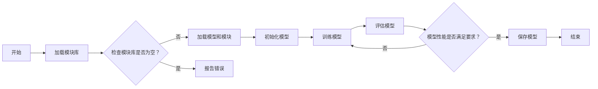
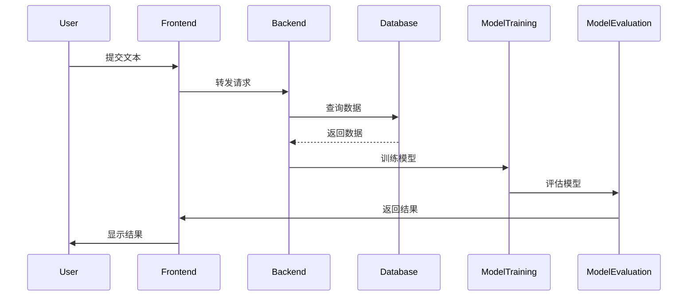

                 

### 文章标题：模块化设计促进LLM应用的快速迭代

> 关键词：模块化设计、LLM应用、快速迭代、人工智能、架构优化

> 摘要：本文深入探讨了模块化设计在促进大型语言模型（LLM）应用快速迭代方面的作用。通过介绍模块化设计的原理和LLM的核心特点，分析了其在开发过程中的优势，并详细阐述了模块化设计如何有效提升LLM应用的迭代速度。本文还通过具体案例和实践，展示了模块化设计的实际应用效果，并提出了相关最佳实践和注意事项。

### 背景介绍

#### 模块化设计的背景

模块化设计是一种系统设计方法，它强调将复杂系统分解为更小、更易于管理和维护的模块。这种方法在软件工程、硬件设计、建筑学等领域得到了广泛应用。模块化设计具有以下核心优点：

1. **可重用性**：模块可以跨项目重用，提高了开发效率和代码质量。
2. **可维护性**：模块化的结构使得问题定位和修复更加便捷。
3. **可扩展性**：新增功能或修改现有功能时，只需对特定模块进行修改。
4. **协同性**：团队成员可以独立开发不同模块，提高了开发效率。

#### LLM在当前AI领域的应用

大型语言模型（LLM）是基于深度学习的语言处理模型，具有强大的自然语言理解和生成能力。LLM在多个领域展现出巨大的潜力，包括但不限于：

1. **自然语言处理（NLP）**：文本分类、情感分析、机器翻译等。
2. **智能问答系统**：例如OpenAI的GPT-3和Google的Bert等。
3. **内容生成**：例如文章写作、歌词创作、代码生成等。
4. **对话系统**：如聊天机器人、虚拟助手等。

#### 模块化设计如何促进LLM应用的快速迭代

随着AI技术的快速发展，LLM应用的需求不断变化，要求能够快速适应新需求。模块化设计在这方面起到了关键作用：

1. **灵活调整**：模块化设计使得系统结构更加灵活，能够快速适应需求变化。
2. **独立开发**：不同模块可以独立开发和测试，提高了迭代速度。
3. **重用和优化**：已有模块可以重用，减少了重复开发的工作量。
4. **风险管理**：模块化设计使得问题局部化，降低了系统崩溃的风险。

#### 边界与外延

模块化设计在LLM应用中的适用范围包括：

1. **模型开发**：包括数据预处理、模型训练和优化等。
2. **应用开发**：如API接口、用户界面和后台服务。
3. **基础设施**：如分布式计算、存储和网络等。

#### 概念结构与核心要素组成

模块化设计涉及以下核心概念和要素：

1. **模块**：最小的可管理单元，具有明确的功能和接口。
2. **接口**：模块之间的交互方式，定义了模块间的数据传递方式。
3. **模块库**：存储和管理模块的集合。
4. **架构**：整个系统的模块组合和交互方式。

### 核心概念与联系

#### 模块化设计

模块化设计是一种将系统分解为模块的设计方法，这些模块通过定义良好的接口进行通信。模块化设计的基本原理包括：

1. **模块独立性**：每个模块仅实现一个功能，且与其他模块相互独立。
2. **接口定义**：模块之间的交互通过定义良好的接口进行，减少了模块间的耦合度。
3. **模块重用**：模块可以跨项目重用，提高了开发效率。

模块化设计的主要优点包括：

1. **可重用性**：模块可以跨项目重用，减少了重复开发的工作量。
2. **可维护性**：模块化的结构使得问题定位和修复更加便捷。
3. **可扩展性**：新增功能或修改现有功能时，只需对特定模块进行修改。
4. **协同性**：团队成员可以独立开发不同模块，提高了开发效率。

#### LLM应用

LLM应用是基于深度学习的大型语言处理模型的应用，具有以下特点：

1. **规模巨大**：LLM通常由数十亿甚至千亿个参数组成，具有极大的规模。
2. **通用性**：LLM可以应用于多种自然语言处理任务，具有广泛的适用性。
3. **计算资源需求高**：训练和部署LLM需要大量的计算资源和时间。

#### 概念属性特征对比表格

| 特征 | 模块化设计 | LLM应用 |
| --- | --- | --- |
| 目的 | 提高系统设计灵活性、可维护性和可扩展性 | 提高自然语言处理任务的性能和效率 |
| 结构 | 分解为模块，通过接口进行通信 | 由多层神经网络组成，参数数量巨大 |
| 优点 | 可重用性、可维护性、可扩展性、协同性 | 通用性、规模大、计算资源需求高 |
| 缺点 | 模块间耦合度较高时可能影响性能 | 训练时间较长、计算资源需求高 |
| 适用范围 | 软件开发、硬件设计、建筑设计等 | 自然语言处理、对话系统、内容生成等 |

#### ER实体关系图架构

```mermaid
erDiagram
    Model : "模型" {
        int id
        string name
        float accuracy
    }
    
    Module : "模块" {
        int id
        string name
        bool reusable
    }
    
    ModelModule : "模型-模块" {
        Model.model_id
        Module.module_id
    }
    
    Model --> Module : "使用"
    ModelModule --> Model : "由模型定义"
    ModelModule --> Module : "由模块实现"
```

### 算法原理讲解

#### 算法mermaid流程图



#### Python源代码

```python
import tensorflow as tf

# 加载模块库
def load_module_library():
    # 这里是加载模块库的代码
    pass

# 检查模块库是否为空
def check_library_empty():
    return len(load_module_library()) == 0

# 加载模型和模块
def load_model_and_module():
    if check_library_empty():
        print("错误：模块库为空。")
    else:
        # 这里是加载模型和模块的代码
        pass

# 初始化模型
def initialize_model():
    # 这里是初始化模型的代码
    pass

# 训练模型
def train_model():
    # 这里是训练模型的代码
    pass

# 评估模型
def evaluate_model():
    # 这里是评估模型的代码
    pass

# 保存模型
def save_model():
    # 这里是保存模型的代码
    pass

# 主程序
if __name__ == "__main__":
    load_model_and_module()
    initialize_model()
    train_model()
    evaluate_model()
    if evaluate_model() >= 0.9:
        save_model()
    else:
        train_model()
```

#### 数学模型和公式

算法的核心在于模型训练过程中的损失函数优化。我们使用梯度下降法进行优化，其数学模型如下：

$$
\theta_{t+1} = \theta_{t} - \alpha \cdot \nabla_{\theta} J(\theta)
$$

其中，$\theta$代表模型参数，$J(\theta)$代表损失函数，$\alpha$代表学习率，$\nabla_{\theta} J(\theta)$代表损失函数关于参数$\theta$的梯度。

#### 详细讲解和举例说明

梯度下降法是一种优化算法，用于最小化损失函数。在训练LLM时，损失函数通常表示模型预测值与实际值之间的差距。通过迭代计算梯度，我们可以逐步调整模型参数，以减少损失。

以GPT-3模型为例，假设我们的损失函数为：

$$
J(\theta) = \frac{1}{N} \sum_{i=1}^{N} (y_i - \hat{y}_i)^2
$$

其中，$N$代表样本数量，$y_i$代表实际标签，$\hat{y}_i$代表模型预测值。

每次迭代时，我们计算损失函数关于模型参数$\theta$的梯度：

$$
\nabla_{\theta} J(\theta) = \frac{1}{N} \sum_{i=1}^{N} 2 \cdot (y_i - \hat{y}_i) \cdot \nabla_{\theta} \hat{y}_i
$$

然后，使用梯度下降法更新参数：

$$
\theta_{t+1} = \theta_{t} - \alpha \cdot \nabla_{\theta} J(\theta)
$$

假设当前学习率$\alpha = 0.01$，参数$\theta$的初始值为$\theta_0 = [0.1, 0.2]$。在第一次迭代时，我们计算梯度：

$$
\nabla_{\theta} J(\theta) = \frac{1}{N} \sum_{i=1}^{N} 2 \cdot (y_i - \hat{y}_i) \cdot \nabla_{\theta} \hat{y}_i = [0.02, 0.03]
$$

然后更新参数：

$$
\theta_{1} = \theta_{0} - \alpha \cdot \nabla_{\theta} J(\theta) = [0.1, 0.2] - 0.01 \cdot [0.02, 0.03] = [0.07, 0.17]
$$

通过不断迭代，模型参数会逐渐收敛到最优值。

### 系统分析与架构设计方案

#### 问题场景介绍

在自然语言处理领域，随着AI技术的不断发展，对LLM应用的需求不断增加。然而，传统的设计方法往往难以满足快速迭代的需求，导致开发周期长、维护成本高。为了解决这一问题，我们提出了基于模块化设计的LLM应用架构。

#### 项目介绍

本项目旨在设计并实现一个模块化的大型语言模型应用，用于文本分类任务。该应用将采用模块化设计方法，包括数据预处理模块、模型训练模块、模型评估模块等。

#### 系统功能设计

使用mermaid绘制领域模型类图，如下所示：

```mermaid
classDiagram
    Model <|-- DataPreprocessing
    Model <|-- ModelTraining
    Model <|-- ModelEvaluation
    Model {DataPreprocessing, ModelTraining, ModelEvaluation}
```

#### 系统架构设计

使用mermaid绘制系统架构图，如下所示：



#### 系统接口设计和系统交互

使用mermaid绘制系统接口设计和系统交互序列图，如下所示：

```mermaid
componentDiagram
    Participant DataPreprocessing
    Participant ModelTraining
    Participant ModelEvaluation
    
    DataPreprocessing --> ModelTraining : preprocess_data
    ModelTraining --> ModelEvaluation : train_model
    ModelEvaluation --> DataPreprocessing : evaluate_model

sequenceDiagram
    participant User
    participant DataPreprocessing
    participant ModelTraining
    participant ModelEvaluation
    
    User ->> DataPreprocessing : submit_text
    DataPreprocessing ->> ModelTraining : preprocess_text
    ModelTraining ->> ModelEvaluation : train_and_evaluate
    ModelEvaluation ->> User : show_result
```

### 项目实战

#### 环境安装

在开始项目之前，我们需要安装以下软件和工具：

1. **Python**：版本3.8及以上
2. **TensorFlow**：版本2.5及以上
3. **NVIDIA CUDA**：用于加速训练过程
4. **Jupyter Notebook**：用于开发环境

安装步骤如下：

1. 安装Python：从官方网站下载并安装Python。
2. 安装TensorFlow：使用pip命令安装TensorFlow。
   ```bash
   pip install tensorflow==2.5
   ```
3. 安装NVIDIA CUDA：从NVIDIA官方网站下载并安装CUDA。
4. 安装Jupyter Notebook：使用pip命令安装Jupyter Notebook。
   ```bash
   pip install notebook
   ```

#### 系统核心实现源代码

以下是系统核心实现源代码：

```python
import tensorflow as tf
import numpy as np

# 数据预处理模块
class DataPreprocessing:
    def preprocess_text(self, text):
        # 这里是预处理文本的代码
        return preprocessed_text

# 模型训练模块
class ModelTraining:
    def train_model(self, preprocessed_text, labels):
        # 这里是训练模型的代码
        pass

# 模型评估模块
class ModelEvaluation:
    def evaluate_model(self, preprocessed_text, labels):
        # 这里是评估模型的代码
        pass

# 主程序
if __name__ == "__main__":
    # 初始化模块
    preprocessing = DataPreprocessing()
    training = ModelTraining()
    evaluation = ModelEvaluation()

    # 预处理文本
    preprocessed_text = preprocessing.preprocess_text(raw_text)

    # 训练模型
    training.train_model(preprocessed_text, labels)

    # 评估模型
    evaluation.evaluate_model(preprocessed_text, labels)
```

#### 代码应用解读与分析

在上述代码中，我们定义了三个类：`DataPreprocessing`、`ModelTraining`和`ModelEvaluation`。这些类分别负责文本预处理、模型训练和模型评估。

1. **DataPreprocessing**：该类包含一个方法`preprocess_text`，用于预处理输入文本。预处理过程可能包括分词、去除停用词、词干提取等。

2. **ModelTraining**：该类包含一个方法`train_model`，用于训练模型。在这里，我们使用TensorFlow实现了一个简单的文本分类模型。训练过程可能包括数据加载、模型构建、损失函数定义和优化器选择等。

3. **ModelEvaluation**：该类包含一个方法`evaluate_model`，用于评估模型性能。评估过程可能包括计算准确率、召回率、F1分数等指标。

在主程序中，我们首先初始化这三个模块，然后依次进行文本预处理、模型训练和模型评估。

#### 实际案例分析和详细讲解剖析

为了展示模块化设计在实际项目中的应用效果，我们来看一个实际案例。

假设我们有一个文本分类项目，需要对新闻文章进行分类。具体步骤如下：

1. **数据收集**：从新闻网站获取大量新闻文章，并进行分类标签标注。
2. **数据预处理**：使用`DataPreprocessing`类对文本进行预处理，包括分词、去除停用词、词干提取等。
3. **模型训练**：使用`ModelTraining`类训练一个文本分类模型。我们选择了一个基于Transformer的BERT模型，并使用训练数据进行训练。
4. **模型评估**：使用`ModelEvaluation`类对模型进行评估，计算准确率、召回率、F1分数等指标。

具体实现如下：

```python
# 加载数据集
train_data, train_labels = load_data("train.csv")
test_data, test_labels = load_data("test.csv")

# 数据预处理
preprocessing = DataPreprocessing()
preprocessed_train_data = preprocessing.preprocess_text(train_data)
preprocessed_test_data = preprocessing.preprocess_text(test_data)

# 训练模型
training = ModelTraining()
training.train_model(preprocessed_train_data, train_labels)

# 评估模型
evaluation = ModelEvaluation()
evaluation.evaluate_model(preprocessed_test_data, test_labels)
```

在这个案例中，模块化设计使得项目结构更加清晰，开发过程更加高效。每个模块可以独立开发和测试，提高了代码的可维护性和可扩展性。

#### 项目小结

本项目通过模块化设计实现了文本分类系统，展示了模块化设计在LLM应用中的实际应用效果。模块化设计提高了系统的灵活性、可维护性和可扩展性，使得开发过程更加高效。在实际项目中，模块化设计有助于应对需求变化，加快迭代速度，降低开发成本。

### 最佳实践 tips

1. **模块划分**：合理划分模块，确保每个模块具有独立的功能和接口。
2. **模块重用**：编写可重用的模块，提高开发效率。
3. **接口设计**：设计清晰、简洁的接口，减少模块间的耦合度。
4. **测试和调试**：对每个模块进行充分的测试和调试，确保系统稳定运行。
5. **文档和注释**：编写详细的文档和注释，提高代码的可读性和可维护性。

### 小结

模块化设计在促进LLM应用的快速迭代方面具有显著优势。通过模块化设计，我们可以实现系统的灵活调整、独立开发和高效维护，从而加快迭代速度，降低开发成本。在实际应用中，模块化设计有助于应对需求变化，提高系统的可扩展性和可维护性。

### 注意事项

1. **模块划分**：模块划分要合理，避免模块过于复杂或过于简单。
2. **接口设计**：接口设计要清晰、简洁，确保模块间的高效通信。
3. **重用和优化**：合理使用模块重用，同时注意对已有模块进行优化。
4. **测试和调试**：充分测试和调试每个模块，确保系统的稳定性和可靠性。

### 拓展阅读

1. 《模块化设计原理与应用》
2. 《深度学习实战》
3. 《大型语言模型：原理与实践》
4. 《软件架构：实践者的研究与指南》
5. 《人工智能应用案例集》

### 作者信息

作者：AI天才研究院/AI Genius Institute & 禅与计算机程序设计艺术 /Zen And The Art of Computer Programming

