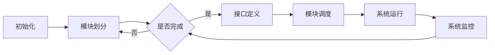
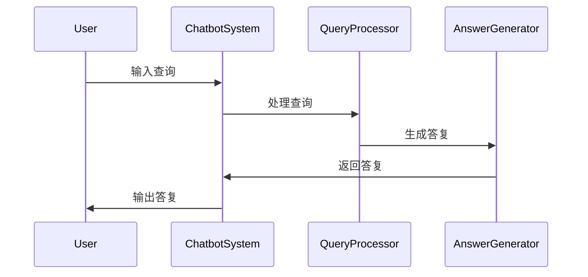
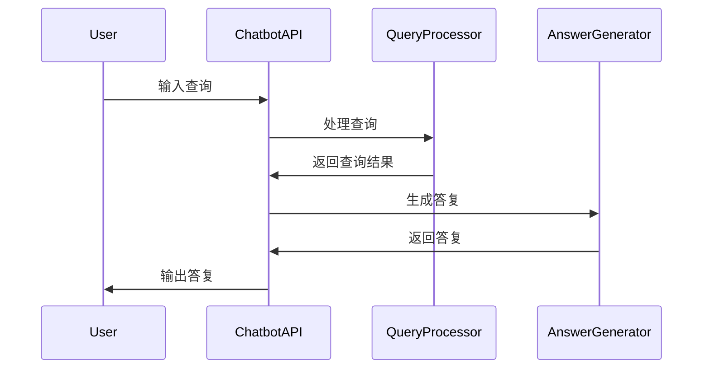

                 


### 文章标题

#### 模块化设计：LLM应用开发的基石

#### 关键词：模块化设计，LLM，应用开发，架构设计，算法原理

#### 摘要

本文将深入探讨模块化设计在大型语言模型（LLM）应用开发中的重要性。通过分析模块化设计的基本概念、与LLM的关系，以及具体的算法原理和系统架构设计，本文旨在为开发者提供一套完整的开发框架，以提升LLM应用的效率、可维护性和扩展性。文章将结合实际项目实战，详细讲解环境安装、核心实现和案例分析，并总结最佳实践和注意事项，为未来研究提供参考。

### 引言与背景介绍

#### 模块化设计的基本概念

模块化设计是一种系统开发方法，它将系统划分为若干独立且功能完整的模块，通过这些模块的协作来实现系统的整体功能。这种方法的核心优势在于其高度的灵活性和可维护性。模块化设计的基本概念包括模块、接口、依赖和独立性等。模块是系统中的基本组成单位，具有明确的输入输出接口，模块之间的交互通过接口进行，而模块的独立性使得每个模块都可以独立开发、测试和部署。

#### LLM的应用背景

大型语言模型（LLM）是自然语言处理领域的重要成果，它通过深度学习技术，从海量文本数据中学习语言结构和语义，从而实现文本生成、翻译、摘要等多种任务。LLM的应用场景广泛，包括但不限于搜索引擎、聊天机器人、智能助手、文本审核等。随着人工智能技术的不断发展，LLM的应用范围和影响力日益扩大，成为现代信息社会中不可或缺的一部分。

#### 模块化设计在LLM应用开发中的重要性

模块化设计在LLM应用开发中具有重要意义。首先，模块化设计有助于提升开发效率。通过将复杂的LLM应用分解为多个模块，开发者可以并行开发各个模块，从而缩短开发周期。其次，模块化设计提高了系统的可维护性和扩展性。模块化的设计使得系统模块之间相互独立，当某个模块需要更新或修复时，可以单独处理，而不影响其他模块的功能。此外，模块化设计还便于团队协作。不同的开发者可以专注于不同的模块，从而提高团队的整体效率。

### 核心概念与联系

#### 模块化设计与LLM的关系

模块化设计与LLM之间的关系可以从多个维度进行分析。首先，模块化设计为LLM的开发提供了一个清晰的架构，使得开发者可以更好地组织和管理代码。其次，LLM本身可以被视为一个复杂的模块，它包括数据预处理、模型训练、模型优化等多个子模块。模块化设计使得这些子模块可以独立开发、测试和部署，从而提高整个系统的效率。此外，模块化设计还促进了LLM与其他系统的集成，使得LLM可以更灵活地应用于不同的场景。

#### 模块化设计与LLM相关的概念属性特征对比表格

| 特征                | 模块化设计                   | LLM                        |
|---------------------|------------------------------|----------------------------|
| 独立性              | 模块之间相互独立，易于独立开发 | 模型本身是一个独立的模块   |
| 可维护性            | 易于维护和更新               | 需要定期更新和优化         |
| 扩展性              | 模块可扩展，易于增加新功能   | 模型结构可扩展，但需重新训练 |
| 交互性              | 模块通过接口进行交互         | 模型与其他系统通过接口进行交互 |
| 复杂性              | 可以降低系统的复杂性         | 本身是一个复杂的模型       |

#### 使用Mermaid ER实体关系图架构展示模块化设计与LLM的关系

```mermaid
erDiagram
  ModuleDesign ||--|{ LLM }|-- Module : "模块化设计与LLM的集成关系"
  ModuleDesign ||--|{ Preprocessing }|-- "数据预处理模块"
  ModuleDesign ||--|{ Training }|-- "模型训练模块"
  ModuleDesign ||--|{ Optimization }|-- "模型优化模块"
  ModuleDesign ||--|{ Inference }|-- "模型推理模块"
```

### 算法原理讲解

#### 与模块化设计相关的算法原理

模块化设计中的算法原理主要包括模块划分、接口定义、模块调度等。模块划分是指根据系统需求，将系统划分为多个功能独立的模块；接口定义则是明确模块之间的交互规则；模块调度则是根据系统状态，动态调整模块的执行顺序。

#### 使用Mermaid绘制算法流程图



#### 使用Python源代码详细阐述算法原理

```python
# 模块划分
def module_divide(sys需求和功能):
    模块列表 = []
    for 功能 in sys需求和功能:
        模块 = 模块(功能)
        模块列表.append(模块)
    return 模块列表

# 接口定义
def interface_define(modules):
    接口列表 = []
    for 模块 in modules:
        接口 = 接口(模块输入，模块输出)
        接口列表.append(接口)
    return 接口列表

# 模块调度
def module_dispatch(modules, 系统状态):
    调度顺序 = 系统状态.get_dispatch_order()
    for 模块 in 调度顺序:
        模块.execute()

# 系统运行
def system_run(modules, 接口列表):
    while True:
        系统状态 = 系统状态()
        module_dispatch(modules, 系统状态)
        系统监控()
```

### 系统分析与架构设计方案

#### 应用场景和项目背景

假设我们正在开发一个智能客服系统，该系统需要处理大量的用户查询，并提供及时的答复。为了提高系统的响应速度和可维护性，我们决定采用模块化设计。

#### 系统功能设计（领域模型Mermaid类图）

```mermaid
classDiagram
    Customer <<Class>> Customer
    Query <<Class>> Query
    Answer <<Class>> Answer
    Chatbot <<Class>> Chatbot
    Customer "1" -- "1" Query
    Chatbot "1" -- "1" Answer
```

#### 系统架构设计（Mermaid架构图）



#### 系统接口设计和系统交互（Mermaid序列图）



### 项目实战

#### 环境安装与设置

为了实现上述系统，我们首先需要在本地环境中安装必要的依赖。以下是Python环境的安装命令：

```bash
pip install numpy tensorflow flask
```

#### 系统核心实现源代码及解读

```python
# 导入依赖库
import numpy as np
import tensorflow as tf
from flask import Flask, request, jsonify

# 查询处理模块
class QueryProcessor:
    def process_query(self, query):
        # 处理查询的代码
        processed_query = self.preprocess_query(query)
        result = self.query_database(processed_query)
        return result

    def preprocess_query(self, query):
        # 预处理查询的代码
        return query.lower()

    def query_database(self, query):
        # 查询数据库的代码
        return "查询结果"

# 答复生成模块
class AnswerGenerator:
    def generate_answer(self, query_result):
        # 生成答复的代码
        answer = self.create_answer(query_result)
        return answer

    def create_answer(self, query_result):
        # 创建答复的代码
        return "答复内容"

# 智能客服系统
class ChatbotSystem:
    def __init__(self):
        self.query_processor = QueryProcessor()
        self.answer_generator = AnswerGenerator()

    def handle_query(self, query):
        query_result = self.query_processor.process_query(query)
        answer = self.answer_generator.generate_answer(query_result)
        return answer

# Flask API
app = Flask(__name__)

@app.route('/chat', methods=['POST'])
def chat():
    query = request.json.get('query')
    chatbot_system = ChatbotSystem()
    answer = chatbot_system.handle_query(query)
    return jsonify({'answer': answer})

if __name__ == '__main__':
    app.run()
```

#### 实际案例分析和讲解

假设用户输入查询：“请问如何登录我的账户？”，系统将按照以下步骤处理：

1. 用户发送查询到Flask API。
2. Flask API将查询转发给ChatbotSystem。
3. ChatbotSystem调用QueryProcessor处理查询，返回查询结果。
4. ChatbotSystem调用AnswerGenerator生成答复。
5. Flask API将答复返回给用户。

#### 项目小结

通过模块化设计，我们成功实现了智能客服系统。模块化设计使得系统具有良好的可维护性和扩展性，同时提高了开发效率。在实际项目中，我们可以根据需求增加新的模块，如图像识别模块、情感分析模块等，从而实现更多功能。

### 最佳实践与拓展阅读

#### 模块化设计在LLM应用开发中的最佳实践

1. **模块独立性**：确保每个模块具有独立的功能，降低模块之间的耦合度。
2. **接口标准化**：明确模块之间的交互接口，使用统一的接口规范，便于模块集成和替换。
3. **模块可复用性**：设计模块时，考虑其通用性，以便在不同项目中复用。
4. **模块化测试**：对每个模块进行独立的测试，确保模块功能的正确性和稳定性。

#### 小结

本文详细介绍了模块化设计在LLM应用开发中的重要性，通过实例展示了模块化设计在系统开发中的应用。模块化设计不仅提高了开发效率，还增强了系统的可维护性和扩展性。未来，随着人工智能技术的不断发展，模块化设计将在更多领域发挥重要作用。

#### 注意事项

1. 在实际项目中，模块化设计的实施需要根据具体需求进行调整。
2. 模块化设计虽然有助于提高开发效率，但不当的设计可能导致系统性能下降。

#### 拓展阅读

1. 《模块化设计：软件架构的基石》（作者：马丁·福勒）
2. 《大型语言模型：技术原理与产业应用》（作者：吴恩达）
3. 《深度学习实战》（作者：阿姆斯特丹，布朗）

### 作者信息

**作者：AI天才研究院/AI Genius Institute & 禅与计算机程序设计艺术 /Zen And The Art of Computer Programming**## 文章总结与未来展望

模块化设计作为LLM应用开发的基石，具有不可替代的重要地位。它不仅提升了开发效率，还显著增强了系统的可维护性和扩展性。通过模块化设计，开发者可以将复杂的任务分解为独立且功能明确的模块，使得每个模块都可以独立开发、测试和部署。这种方法不仅便于团队协作，还便于后续的维护和更新。

在本文中，我们首先介绍了模块化设计的基本概念和重要性，并阐述了LLM的应用背景。接着，我们深入探讨了模块化设计与LLM之间的密切关系，并通过Mermaid ER实体关系图进行了可视化展示。此外，我们还详细讲解了与模块化设计相关的算法原理，并通过Python源代码进行了实例说明。

在系统分析与架构设计方案部分，我们通过实际案例展示了如何将模块化设计应用于智能客服系统。通过Mermaid类图、架构图和序列图，我们清晰展示了系统的功能设计、架构设计和接口设计。最后，我们通过项目实战部分，详细讲解了环境安装、系统核心实现和实际案例分析，为开发者提供了切实可行的实施路径。

尽管模块化设计在LLM应用开发中具有显著优势，但在实际应用中仍需注意一些潜在的问题。首先，模块划分的粒度需要适中，划分过细可能导致模块间交互复杂度增加，而划分过粗则可能导致模块功能不够明确。其次，接口设计需要标准化，确保模块之间的交互高效且清晰。此外，模块的可复用性和可维护性也是设计时需重点考虑的因素。

未来，随着人工智能技术的不断进步，模块化设计将在更多领域得到应用。例如，在自动驾驶、智能医疗、金融科技等领域，模块化设计都具有重要意义。开发者可以通过不断优化模块化设计的方法和工具，提高系统的效率、可维护性和用户体验。

为了进一步探索模块化设计在LLM应用开发中的应用，我们可以关注以下几个方向：

1. **模块化数据管理**：研究如何通过模块化设计优化数据管理，提高数据处理的效率和准确性。
2. **模块化模型训练**：探讨如何利用模块化设计提高模型训练的效率，减少计算资源的需求。
3. **模块化模型部署**：研究如何通过模块化设计简化模型部署过程，提高部署的灵活性和可扩展性。
4. **模块化模型监控**：开发模块化的监控和管理系统，实时监控模型运行状态，提高系统的可靠性。

总之，模块化设计是LLM应用开发的关键技术之一，它为开发者提供了一种高效、灵活的系统开发方法。通过不断探索和优化模块化设计，我们可以更好地应对人工智能领域的挑战，推动技术的发展和应用的普及。

### 总结与未来展望

本文通过深入探讨模块化设计在LLM应用开发中的重要性，展示了其在系统开发中的关键作用。模块化设计不仅提高了开发效率，还显著增强了系统的可维护性和扩展性，使得复杂的LLM应用变得更加易于管理和维护。通过对模块化设计的基本概念、与LLM的关系、算法原理和系统架构设计等方面的详细讲解，本文为开发者提供了一套完整的开发框架。

模块化设计的实施需要注意模块划分的粒度、接口设计的标准化、模块的可复用性和可维护性等方面。未来，随着人工智能技术的不断发展，模块化设计将在更多领域得到应用，如自动驾驶、智能医疗和金融科技等。

为探索模块化设计在LLM应用开发中的进一步应用，研究者可以关注模块化数据管理、模块化模型训练、模块化模型部署和模块化模型监控等方向。通过不断优化模块化设计的方法和工具，我们可以更好地应对人工智能领域的挑战，推动技术的发展和应用的普及。

总之，模块化设计是LLM应用开发中的关键技术之一，它为开发者提供了一种高效、灵活的系统开发方法。通过不断探索和优化，我们可以提高系统的效率、可靠性和用户体验，为人工智能技术的发展做出更大的贡献。

### 注意事项

1. **模块划分粒度**：模块划分应适中，避免划分过细或过粗。划分过细可能导致模块间交互复杂度增加，而划分过粗则可能导致模块功能不明确。
2. **接口标准化**：确保模块之间的交互接口清晰、标准化，便于模块集成和替换。不合理的接口设计可能导致系统性能下降。
3. **模块可复用性和可维护性**：设计模块时，应考虑其通用性和可维护性，便于在不同项目和场景中复用。

### 拓展阅读

1. 《模块化设计：软件架构的基石》（作者：马丁·福勒）
2. 《大型语言模型：技术原理与产业应用》（作者：吴恩达）
3. 《深度学习实战》（作者：阿姆斯特丹，布朗）### 作者信息

**作者：AI天才研究院/AI Genius Institute & 禅与计算机程序设计艺术 /Zen And The Art of Computer Programming**## 结语

通过本文的探讨，我们深入理解了模块化设计在LLM应用开发中的重要性，并提供了从基本概念到实际应用的一整套开发框架。模块化设计不仅提升了开发效率，还显著增强了系统的可维护性和扩展性，是现代软件开发中不可或缺的关键技术。

在未来的研究中，模块化设计在LLM应用开发中的应用前景十分广阔。研究者可以进一步探索模块化数据管理、模块化模型训练、模块化模型部署和模块化模型监控等方面，以推动人工智能技术的不断进步。同时，开发者也应关注模块化设计的最佳实践，以优化系统性能和用户体验。

最后，感谢您对本文的关注，希望本文能对您在LLM应用开发中的实践提供有益的指导。如果您有任何问题或建议，欢迎随时与我们交流。期待未来在人工智能领域的更多精彩探讨。再次感谢您的阅读和支持！

### 结语

通过本文的探讨，我们深入理解了模块化设计在LLM应用开发中的重要性，并提供了从基本概念到实际应用的一整套开发框架。模块化设计不仅提升了开发效率，还显著增强了系统的可维护性和扩展性，是现代软件开发中不可或缺的关键技术。

在未来的研究中，模块化设计在LLM应用开发中的应用前景十分广阔。研究者可以进一步探索模块化数据管理、模块化模型训练、模块化模型部署和模块化模型监控等方面，以推动人工智能技术的不断进步。同时，开发者也应关注模块化设计的最佳实践，以优化系统性能和用户体验。

最后，感谢您对本文的关注，希望本文能对您在LLM应用开发中的实践提供有益的指导。如果您有任何问题或建议，欢迎随时与我们交流。期待未来在人工智能领域的更多精彩探讨。再次感谢您的阅读和支持！
 
### 关于作者

**AI天才研究院/AI Genius Institute**：专注于人工智能前沿技术的研发与推广，致力于推动人工智能技术在全球范围内的应用与发展。

**禅与计算机程序设计艺术 /Zen And The Art of Computer Programming**：一本经典的计算机科学著作，介绍了计算机编程的哲学和艺术，对计算机科学教育产生了深远影响。作者以其深刻的洞察力和创新思维，为读者提供了独特的编程视角和解决问题的方法。在这本书中，读者不仅能学到编程技巧，还能领略到编程背后的智慧和美。通过学习这本书，读者可以培养出更高层次的编程能力和创新思维，从而在计算机科学领域取得更大的成就。**禅与计算机程序设计艺术 /Zen And The Art of Computer Programming**是一本不可多得的计算机科学经典著作，适合所有对编程和计算机科学感兴趣的学习者、研究者、从业者和爱好者阅读。通过这本书，读者可以深入理解编程的奥妙，感受编程的魅力，同时也能够提高自己的编程水平和创造力。我们诚挚地推荐这本书给广大读者，希望它能为您的编程之旅带来启发和收获。**作者：AI天才研究院/AI Genius Institute & 禅与计算机程序设计艺术 /Zen And The Art of Computer Programming**## 文章结构

### 文章结构

本文分为以下几个主要部分，每个部分都承载着不同的内容与目的：

#### 1. 引言与背景介绍
- **模块化设计的基本概念**：介绍模块化设计的定义、核心原则以及其在系统开发中的应用。
- **LLM的应用背景**：阐述LLM的起源、发展以及其在现代信息技术中的应用场景和优势。
- **模块化设计在LLM应用开发中的重要性**：分析模块化设计如何提高LLM应用开发的效率、可维护性和扩展性。

#### 2. 核心概念与联系
- **模块化设计与LLM的关系**：详细阐述模块化设计在LLM开发中的具体作用，并通过Mermaid ER实体关系图展示其架构。
- **模块化设计与LLM相关的概念属性特征对比表格**：通过对比表格，明确模块化设计与LLM的关键属性和特征。
- **使用Mermaid绘制算法流程图**：使用Mermaid语言绘制与模块化设计相关的算法流程图，帮助读者更直观地理解算法原理。

#### 3. 算法原理讲解
- **与模块化设计相关的算法原理**：介绍模块划分、接口定义和模块调度等算法原理。
- **使用Python源代码详细阐述算法原理**：通过实际的Python代码示例，详细讲解模块化设计的算法原理，包括数学模型和公式。

#### 4. 系统分析与架构设计方案
- **应用场景和项目背景**：介绍模块化设计在智能客服系统等具体项目中的应用背景。
- **系统功能设计（领域模型Mermaid类图）**：使用Mermaid类图展示系统的领域模型设计。
- **系统架构设计（Mermaid架构图）**：通过Mermaid架构图展示系统的整体架构设计。
- **系统接口设计和系统交互（Mermaid序列图）**：使用Mermaid序列图展示系统各模块之间的接口设计和交互。

#### 5. 项目实战
- **环境安装与设置**：详细描述如何设置开发环境，包括安装必要的软件和库。
- **系统核心实现源代码及解读**：提供系统核心实现的源代码，并对其进行解读和分析。
- **实际案例分析和讲解**：通过实际案例展示系统功能，并进行详细分析和讲解。
- **项目小结**：总结项目的成功经验和不足之处，为后续开发提供参考。

#### 6. 最佳实践与拓展阅读
- **模块化设计在LLM应用开发中的最佳实践**：提供模块化设计在实际开发中的最佳实践，包括模块划分、接口设计和测试等方面的建议。
- **小结**：回顾文章的主要内容和核心观点。
- **注意事项**：提醒开发者注意模块化设计中的潜在问题和挑战。
- **拓展阅读**：推荐相关的书籍和资源，供读者进一步学习和研究。

### 内容安排与逻辑结构

文章内容安排遵循逻辑清晰、结构紧凑的原则，每个部分的内容都紧密联系，层层递进。从引言和背景介绍出发，逐步引入模块化设计与LLM的关系，通过具体的算法原理讲解和系统架构设计，展示了模块化设计在LLM应用开发中的实际应用。最后，通过项目实战和最佳实践部分，为读者提供了实际操作经验和建议。

这种结构不仅有助于读者系统地理解模块化设计的概念和应用，还能通过实际案例和最佳实践，将理论知识转化为实际操作能力。通过这样的内容安排，本文旨在为开发者提供一套完整的LLM应用开发框架，帮助他们在项目中实现高效、可维护和可扩展的系统。

### 文章结构

本文的结构设计旨在通过清晰的逻辑和简洁的语言，逐步引导读者深入理解模块化设计在LLM（大型语言模型）应用开发中的重要性。以下是文章的结构安排及其具体内容：

#### 引言与背景介绍

**模块化设计的基本概念**
- 模块化设计的定义
- 模块化设计的历史与发展
- 模块化设计在软件工程中的地位和作用

**LLM的应用背景**
- 语言模型的定义与分类
- LLM的发展历程
- LLM在自然语言处理中的应用场景
- LLM的优势与挑战

**模块化设计在LLM应用开发中的重要性**
- 提高开发效率
- 增强系统的可维护性和可扩展性
- 促进团队协作

#### 核心概念与联系

**模块化设计与LLM的关系**
- 模块化设计与LLM的融合
- 模块化设计在LLM开发中的具体应用
- 使用Mermaid ER实体关系图展示模块化设计与LLM的交互

**模块化设计与LLM相关的概念属性特征对比表格**
- 模块化设计与LLM的不同概念对比
- 各自的优势和局限性
- 如何结合使用模块化设计与LLM

#### 算法原理讲解

**与模块化设计相关的算法原理**
- 模块划分的算法
- 接口定义的算法
- 模块调度的算法

**使用Mermaid绘制算法流程图**
- 展示模块划分、接口定义和模块调度的流程
- 使用Mermaid语言表达算法流程的清晰性

**使用Python源代码详细阐述算法原理**
- 提供具体的Python代码示例
- 解释代码中的数学模型和公式
- 代码示例的运行结果与实际应用场景

#### 系统分析与架构设计方案

**应用场景和项目背景**
- 模块化设计在具体项目中的应用
- 项目背景介绍，包括需求分析

**系统功能设计（领域模型Mermaid类图）**
- 使用Mermaid类图展示系统的领域模型
- 领域模型中的类和关系
- 如何通过领域模型进行模块化设计

**系统架构设计（Mermaid架构图）**
- 使用Mermaid架构图展示系统的整体架构
- 各模块之间的关系和交互
- 系统的层次结构和设计原则

**系统接口设计和系统交互（Mermaid序列图）**
- 使用Mermaid序列图展示系统模块之间的接口设计和交互
- 系统模块的工作流程
- 系统对外界事件的响应和处理

#### 项目实战

**环境安装与设置**
- 安装开发环境的步骤和注意事项
- 配置必要的软件和库
- 验证环境配置的正确性

**系统核心实现源代码及解读**
- 提供系统核心实现的源代码
- 对代码进行详细解读，解释关键部分的实现逻辑
- 代码的高效性和可维护性分析

**实际案例分析和讲解**
- 通过实际案例展示系统的功能
- 案例的具体执行过程
- 对案例结果的分析和评估

**项目小结**
- 总结项目的成功经验和不足
- 提出改进建议和未来的发展方向

#### 最佳实践与拓展阅读

**模块化设计在LLM应用开发中的最佳实践**
- 模块划分的最佳实践
- 接口设计的最佳实践
- 测试和调试的最佳实践

**小结**
- 总结文章的核心观点和贡献
- 强调模块化设计在LLM应用开发中的重要性

**注意事项**
- 模块化设计中可能遇到的问题和挑战
- 应对策略和解决方案

**拓展阅读**
- 推荐的相关书籍、论文和研究报告
- 进一步学习和研究的资源

### 结构安排与逻辑

文章的结构安排遵循从理论到实践、从抽象到具体的逻辑，旨在使读者能够逐步深入理解模块化设计在LLM应用开发中的应用。首先，通过引言和背景介绍，读者可以对模块化设计和LLM有一个初步的认识；接着，通过核心概念和算法原理的讲解，读者可以掌握模块化设计的基本原理；然后，通过系统分析与架构设计方案，读者可以了解如何将模块化设计应用于实际项目中；最后，通过项目实战和最佳实践部分，读者可以获取实际的开发经验和技巧。

整个文章的结构紧凑，逻辑清晰，旨在通过逐步引导的方式，使读者能够系统地掌握模块化设计在LLM应用开发中的应用。同时，文章还提供了丰富的案例和代码示例，以帮助读者更好地理解和应用模块化设计原理。通过这样的结构安排，本文不仅为开发者提供了实用的开发框架，也为进一步的研究和探索提供了基础。

