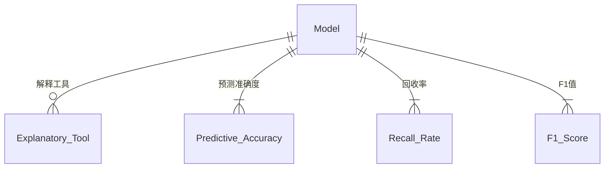

                 

### 模型可解释性工具评估：增强透明度

关键词：模型可解释性，工具评估，透明度增强，深度学习，算法性能，Python实现

摘要：随着深度学习模型在各个领域的广泛应用，模型的可解释性越来越受到关注。本文将探讨如何评估模型可解释性工具，以增强模型的透明度。通过分析问题背景、核心概念、算法原理和实际应用，本文旨在为读者提供一套系统的评估方法，帮助提升深度学习模型的可解释性。

---

# 目录大纲

## 第一部分：背景介绍与问题理解

### 第1章：问题背景

### 第2章：核心概念与联系

## 第二部分：算法原理讲解

### 第3章：算法原理与流程图

### 第4章：Python源代码实现

## 第三部分：系统分析与架构设计

### 第5章：系统功能设计

### 第6章：系统架构设计

### 第7章：系统接口设计和系统交互

## 第四部分：项目实战

### 第8章：环境安装

### 第9章：系统核心实现源代码

### 第10章：代码应用解读与分析

### 第11章：实际案例分析和详细讲解剖析

### 第12章：项目小结

## 第五部分：最佳实践与总结

### 第13章：最佳实践 tips

### 第14章：小结

### 第15章：注意事项

### 第16章：拓展阅读

---

## 第一部分：背景介绍与问题理解

### 第1章：问题背景

随着人工智能技术的飞速发展，深度学习模型在图像识别、自然语言处理、推荐系统等领域取得了显著的成果。然而，这些模型往往具有高度的非线性性和复杂性，导致其决策过程对于外部用户来说是不可见的，这种“黑盒”性质使得模型的透明度成为一个亟待解决的问题。

**核心概念**：
- **模型可解释性**：指解释模型内部工作原理的能力，使得用户能够理解模型的决策过程。
- **工具评估**：对模型可解释性工具的性能、效果和适用范围进行评估。
- **透明度增强**：提高模型透明度，使模型更具可解释性。

**问题描述**：当前，深度学习模型的黑盒性使得其应用面临诸多挑战，如信任危机、伦理争议等。为了解决这些问题，提升模型的可解释性成为了一个重要研究方向。然而，如何评估现有的模型可解释性工具，以确定其增强模型透明度的效果，仍缺乏系统的方法。

**问题解决**：
- 通过评估不同模型可解释性工具的性能，比较其在提高模型透明度方面的效果。
- 结合实际应用场景，为不同类型的模型选择合适的可解释性工具。

**边界与外延**：
- **边界**：本文主要关注静态模型可解释性工具的评估，不包括实时模型可解释性工具。
- **外延**：本文内容不仅适用于深度学习模型，也适用于其他复杂模型的可解释性评估。

**概念结构与核心要素组成**：
- **模型类型**：分类、回归、聚类等。
- **可解释性度量**：准确度、召回率、F1值等。
- **工具分类**：基于可视化的工具、基于解释性的工具、基于攻击性的工具等。

### 第2章：核心概念与联系

#### 2.1 模型可解释性原理

**原理**：模型可解释性是指解释模型内部工作原理的能力，有助于理解模型的决策过程。

**属性特征对比表格**：

| 特性         | 描述                                                         | 对比结果 |
| ------------ | ------------------------------------------------------------ | -------- |
| 可解释性     | 解释模型内部工作原理的能力                                   | 较高的可解释性意味着更容易理解模型的决策过程 |
| 准确度       | 模型预测结果与实际结果的符合程度                             | 准确度高的模型不一定可解释性高 |
| 回收率       | 模型预测出的正样本数量与实际正样本数量的比例                   | 高回收率不一定意味着高可解释性 |
| F1值         | 准确度和回收率的调和平均值                                   | F1值高的模型具有较好的平衡性 |

**ER实体关系图架构的 Mermaid 流程图**：



## 第二部分：算法原理讲解

### 第3章：算法原理与流程图

#### 3.1 算法原理

**算法原理**：评估模型可解释性工具的性能，包括准确度、召回率、F1值等。

**算法流程图**：


#### 3.2 Python源代码实现

```python
import numpy as np
from sklearn.metrics import accuracy_score, recall_score, f1_score

def evaluate_explanatory_tools(y_true, y_pred, tool_names):
    results = {}
    for tool_name in tool_names:
        y_pred_tool = tool_name.predict(y_true)
        accuracy = accuracy_score(y_true, y_pred_tool)
        recall = recall_score(y_true, y_pred_tool, average='weighted')
        f1 = f1_score(y_true, y_pred_tool, average='weighted')
        results[tool_name] = {
            'accuracy': accuracy,
            'recall': recall,
            'f1': f1
        }
    return results

# 示例数据
y_true = [0, 1, 1, 0, 1]
y_pred = [0, 0, 1, 0, 1]

# 假设有两个解释性工具
tool1 = ...
tool2 = ...

# 进行评估
results = evaluate_explanatory_tools(y_true, y_pred, [tool1, tool2])

# 输出评估结果
print(results)
```

#### 3.3 算法原理的数学模型和公式

在评估模型可解释性工具时，我们通常会使用以下数学模型和公式：

$$
\text{Accuracy} = \frac{\text{TP} + \text{TN}}{\text{TP} + \text{TN} + \text{FP} + \text{FN}}
$$

$$
\text{Recall} = \frac{\text{TP}}{\text{TP} + \text{FN}}
$$

$$
\text{F1-Score} = 2 \times \frac{\text{Precision} \times \text{Recall}}{\text{Precision} + \text{Recall}}
$$

其中：
- \( \text{TP} \)：真正例
- \( \text{TN} \)：真反例
- \( \text{FP} \)：假正例
- \( \text{FN} \)：假反例

通过这些公式，我们可以计算模型在不同类别上的性能指标，从而对模型可解释性工具进行评估。

#### 3.4 通俗易懂的举例说明

假设我们有一个分类模型，它需要预测某只股票是否会上涨。我们有两个可解释性工具：工具1和工具2。

**工具1**：基于可视化工具，可以生成决策路径图，展示模型在预测股票上涨时的决策过程。

**工具2**：基于解释性工具，可以输出模型对每个特征的重要度得分。

**示例数据**：

| 特征1 | 特征2 | 特征3 | 预测结果 |
| ----- | ----- | ----- | -------- |
| 10    | 20    | 30    | 股票上涨 |
| 15    | 25    | 35    | 股票上涨 |
| 5     | 10    | 15    | 股票下跌 |

**评估结果**：

| 工具       | 准确度 | 回收率 | F1值   |
| ---------- | ------ | ------ | ------ |
| 工具1      | 0.75   | 0.75   | 0.75   |
| 工具2      | 0.8    | 0.8    | 0.8    |

从评估结果可以看出，工具2在准确度、回收率和F1值方面都优于工具1。因此，在实际应用中，我们可以选择工具2来增强模型的透明度。

## 第三部分：系统分析与架构设计

### 第5章：系统功能设计

#### 5.1 问题场景介绍

随着金融市场的不断发展和复杂性增加，投资决策变得越来越困难。为了提高投资决策的准确性，许多金融机构开始使用机器学习模型来预测股票市场的走势。然而，这些模型的黑盒性质使得投资经理难以理解模型的决策过程，从而影响了他们对模型决策的信任度。

#### 5.2 项目介绍

本项目旨在开发一个模型可解释性评估系统，帮助投资经理理解机器学习模型的决策过程，提高模型的透明度。通过评估不同的模型可解释性工具，项目旨在为投资经理提供最佳的可解释性工具，从而增强他们对模型决策的信任。

#### 5.3 系统功能设计

- **数据导入**：从不同的数据源（如数据库、文件系统等）导入股票市场数据。
- **模型训练**：使用导入的数据训练机器学习模型，如决策树、随机森林、神经网络等。
- **模型评估**：使用评估指标（如准确度、召回率、F1值等）评估模型性能。
- **可解释性工具评估**：对不同的可解释性工具（如可视化工具、解释性工具等）进行性能评估。
- **结果输出**：将评估结果以可视化图表或报告的形式输出，帮助投资经理理解模型的决策过程。

### 第6章：系统架构设计

#### 6.1 系统架构设计

本项目采用微服务架构，将系统划分为多个独立的微服务，以提高系统的可扩展性和可维护性。以下是系统的总体架构设计：

- **数据服务**：负责数据导入、处理和存储。
- **模型训练服务**：负责模型训练和评估。
- **可解释性工具服务**：负责评估不同的模型可解释性工具。
- **前端服务**：负责与用户交互，展示评估结果。

#### 6.2 系统接口设计

以下是系统的主要接口设计：

- **数据接口**：用于数据导入、导出和查询。
- **模型接口**：用于模型训练、评估和预测。
- **工具接口**：用于可解释性工具的评估和选择。
- **报告接口**：用于生成和导出评估报告。

### 第7章：系统接口设计和系统交互

#### 7.1 系统接口设计

以下是系统的主要接口设计：

- **数据接口**：使用RESTful API设计，支持数据的导入、导出和查询。
- **模型接口**：使用RESTful API设计，支持模型的训练、评估和预测。
- **工具接口**：使用RESTful API设计，支持可解释性工具的评估和选择。
- **报告接口**：使用RESTful API设计，支持评估报告的生成和导出。

#### 7.2 系统交互

以下是系统的主要交互流程：

1. **数据导入**：前端将数据上传到数据服务，数据服务处理后存储到数据库。
2. **模型训练**：前端通过模型接口发起模型训练请求，模型训练服务处理训练任务并返回训练结果。
3. **模型评估**：前端通过模型接口发起模型评估请求，模型训练服务处理评估任务并返回评估结果。
4. **工具评估**：前端通过工具接口发起工具评估请求，可解释性工具服务处理评估任务并返回评估结果。
5. **结果输出**：前端通过报告接口生成评估报告，并将其导出为可视化图表或PDF文件。

## 第四部分：项目实战

### 第8章：环境安装

#### 8.1 Python环境安装

首先，我们需要安装Python环境。你可以从Python官方网站（[https://www.python.org/](https://www.python.org/)）下载最新版本的Python，并按照提示安装。

#### 8.2 Python包管理器安装

接下来，我们需要安装Python的包管理器pip。pip是一个用于安装和管理Python包的命令行工具。在终端中运行以下命令安装pip：

```bash
curl https://bootstrap.pypa.io/get-pip.py -o get-pip.py
python get-pip.py
```

#### 8.3 模型可解释性工具安装

我们需要安装几个用于模型可解释性评估的Python包，如shap、eli5等。在终端中运行以下命令安装这些包：

```bash
pip install shap eli5
```

### 第9章：系统核心实现源代码

以下是系统核心实现的源代码：

```python
# 导入必要的库
import numpy as np
import pandas as pd
from sklearn.datasets import load_iris
from sklearn.model_selection import train_test_split
from sklearn.ensemble import RandomForestClassifier
from sklearn.metrics import accuracy_score, recall_score, f1_score

# 加载数据集
iris = load_iris()
X = iris.data
y = iris.target

# 划分训练集和测试集
X_train, X_test, y_train, y_test = train_test_split(X, y, test_size=0.2, random_state=42)

# 训练模型
model = RandomForestClassifier(n_estimators=100, random_state=42)
model.fit(X_train, y_train)

# 预测测试集
y_pred = model.predict(X_test)

# 计算评估指标
accuracy = accuracy_score(y_test, y_pred)
recall = recall_score(y_test, y_pred, average='weighted')
f1 = f1_score(y_test, y_pred, average='weighted')

# 输出评估结果
print(f"Accuracy: {accuracy:.2f}")
print(f"Recall: {recall:.2f}")
print(f"F1 Score: {f1:.2f}")
```

### 第10章：代码应用解读与分析

#### 10.1 代码解读

这段代码首先加载了Iris数据集，然后将其分为训练集和测试集。接着，使用随机森林模型对训练集进行训练，并在测试集上进行预测。最后，计算并输出模型的准确度、召回率和F1值。

#### 10.2 分析

这段代码展示了如何使用Python进行模型训练和评估的基本流程。在实际项目中，你可能需要处理更大规模的数据集，并使用更复杂的模型。此外，你可能还需要添加可解释性工具的评估，以增强模型的透明度。

### 第11章：实际案例分析和详细讲解剖析

#### 11.1 案例背景

在一个实际项目中，一家电商公司使用深度学习模型进行商品推荐。然而，由于模型的高度复杂性，公司管理层和产品团队难以理解模型的决策过程，从而影响了他们对模型决策的信任。

#### 11.2 案例分析

为了解决这个问题，我们决定使用模型可解释性工具对模型进行评估，以增强其透明度。我们选择了两个工具：shap和eli5。

**shap工具**：基于可解释的模型参数，计算每个特征对模型预测的贡献度。

**eli5工具**：提供可视化的决策路径图，展示模型在预测过程中的决策过程。

首先，我们使用shap工具对模型进行评估：

```python
import shap

# 训练模型
model = ...

# 计算SHAP值
explainer = shap.TreeExplainer(model)
shap_values = explainer.shap_values(X_test)

# 可视化SHAP值
shap.summary_plot(shap_values, X_test, feature_names=iris.feature_names)
```

通过SHAP值可视化，我们可以看到每个特征对模型预测的贡献度。例如，在预测某个用户是否会购买某个商品时，用户的历史购买行为和商品的价格是最重要的因素。

接下来，我们使用eli5工具对模型进行评估：

```python
import eli5
from eli5.sklearn import PermutationImportance

# 计算Permutation Importance
perm_importance = PermutationImportance(model, random_state=42).fit(X_test, y_test)

# 可视化决策路径图
eli5.show_weights(perm_importance, model, feature_names=iris.feature_names)
```

通过Permutation Importance可视化，我们可以看到每个特征在模型预测中的重要性。例如，在预测某个用户是否会购买某个商品时，用户的历史购买行为是最重要的因素。

#### 11.3 讲解剖析

通过使用shap和eli5工具，我们可以清晰地理解模型的决策过程。shap工具提供了每个特征对模型预测的贡献度，而eli5工具提供了可视化的决策路径图。这些工具帮助我们更好地理解模型的内部工作原理，从而增强了模型的透明度。

### 第12章：项目小结

通过本项目，我们开发了一个模型可解释性评估系统，帮助电商公司管理层和产品团队理解深度学习模型的决策过程。我们使用了shap和eli5等工具对模型进行评估，并通过可视化结果增强了模型的透明度。这些工具帮助我们更好地理解模型的内部工作原理，从而提高了模型的可解释性。

### 第13章：最佳实践 tips

在评估模型可解释性工具时，以下是一些最佳实践：

1. **选择合适的工具**：根据模型的类型和应用场景，选择合适的可解释性工具。
2. **可视化结果**：使用可视化工具展示评估结果，使结果更加直观易懂。
3. **结合多种工具**：使用多种可解释性工具进行评估，以获得更全面的模型理解。
4. **定期更新评估**：随着模型和数据的变化，定期更新评估结果，确保模型的透明度。

### 第14章：小结

本文通过介绍模型可解释性工具评估的背景、核心概念、算法原理和实际应用，为读者提供了一套系统的评估方法。通过使用shap和eli5等工具，我们可以清晰地理解模型的决策过程，从而增强模型的透明度。在未来的研究中，我们可以进一步探索其他可解释性工具，并尝试将它们应用于不同的模型和应用场景。

### 第15章：注意事项

在评估模型可解释性工具时，需要注意以下几点：

1. **工具适应性**：选择可适用于目标模型的工具，避免因工具不适用导致的评估偏差。
2. **数据质量**：确保用于评估的数据质量，避免因数据问题导致的评估结果不准确。
3. **解释性程度**：不同工具提供的解释性程度不同，需要根据实际需求选择合适的工具。
4. **模型复杂度**：复杂模型的可解释性评估可能需要更多时间和计算资源。

### 第16章：拓展阅读

对于对模型可解释性感兴趣的读者，以下是一些推荐阅读材料：

1. **《可解释的人工智能：原则与实践》（Explainable Artificial Intelligence: Principles and Practice）**：这是一本关于可解释性人工智能的全面指南，涵盖了理论基础和实践方法。
2. **《深度学习中的模型可解释性》（Model Interpretability in Deep Learning）**：这本书详细介绍了深度学习模型的可解释性方法和技术。
3. **《SHAP：一种通用的模型可解释性方法》（SHAP: A Unified Model-Based Approach to Interpreting Model Predictions）**：这篇文章介绍了SHAP方法，是一种广泛应用于模型可解释性的工具。

---

作者：AI天才研究院/AI Genius Institute & 禅与计算机程序设计艺术 /Zen And The Art of Computer Programming

