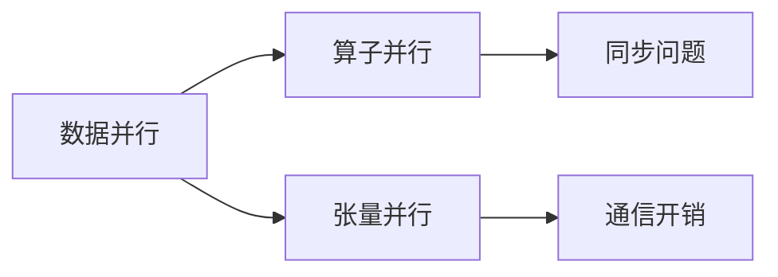
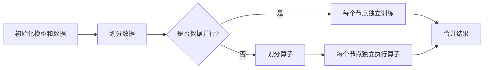
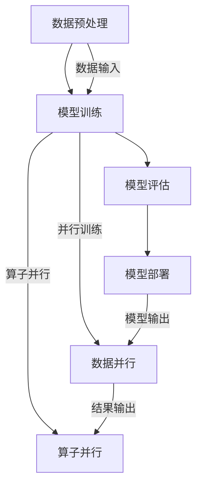
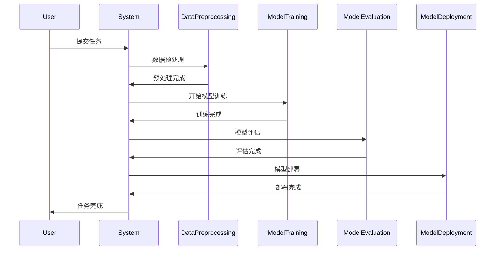

                 


### 模型并行：加速大规模AI模型训练的技术

> 关键词：模型并行、大规模AI模型训练、算法优化、性能提升

> 摘要：本文旨在深入探讨模型并行技术在加速大规模AI模型训练中的应用。通过分析模型并行技术的基本原理、算法实现、系统架构和实际应用案例，本文为读者提供了系统性的理解和实践指导。

## 第一部分: 模型并行技术基础

### 1.1 背景介绍

#### 1.1.1 大规模AI模型训练面临的问题及需求

随着AI技术的快速发展，大规模AI模型的训练需求日益增长。然而，传统的单机训练模式在面对海量数据和复杂模型时，常常面临计算资源不足、训练时间过长等问题。为了解决这些问题，研究者们提出了模型并行技术，通过在多个计算节点上并行执行模型训练任务，从而提高训练效率。

#### 1.1.2 模型并行技术的概念及作用

模型并行技术是指将大规模AI模型的训练任务分解为多个子任务，并分布在多个计算节点上同时执行。这种技术能够充分利用分布式计算资源，降低单机训练的负载，从而加速模型训练过程。

#### 1.1.3 模型并行技术的原理与应用

模型并行技术主要分为数据并行、算子并行和张量并行三种类型。数据并行是指将数据集划分为多个部分，每个计算节点独立处理一部分数据；算子并行是指将模型中的算子分布到多个计算节点上同时执行；张量并行则是对模型中的张量进行划分，并分布到多个计算节点上进行计算。这些并行策略能够有效减少模型训练的时间，提高计算效率。

#### 1.1.4 模型并行技术的适用范围及限制

模型并行技术适用于需要大规模并行计算的场景，如深度学习模型的训练、图神经网络的处理等。然而，并行训练也面临一定的挑战，如通信开销、同步问题等，这些因素可能会影响并行效率。因此，在采用模型并行技术时，需要根据具体的应用场景和计算资源进行综合考虑。

### 1.2 核心概念与联系

#### 1.2.1 模型并行技术的基本原理

模型并行技术的基本原理是将大规模训练任务分解为多个子任务，并分布到多个计算节点上同时执行。具体来说，包括以下方面：

- 数据并行：将数据集划分为多个部分，每个计算节点独立处理一部分数据。
- 算子并行：将模型中的算子分布到多个计算节点上同时执行。
- 张量并行：对模型中的张量进行划分，并分布到多个计算节点上进行计算。

#### 1.2.2 概念属性特征对比表格

| 并行类型 | 数据并行 | 算子并行 | 张量并行 |
| --- | --- | --- | --- |
| 定义 | 将数据集划分为多个部分，每个计算节点独立处理一部分数据。 | 将模型中的算子分布到多个计算节点上同时执行。 | 对模型中的张量进行划分，并分布到多个计算节点上进行计算。 |
| 优点 | 减少单机计算负载，提高训练效率。 | 降低模型复杂度，便于并行化实现。 | 提高计算并行度，加速模型训练。 |
| 缺点 | 数据传输开销较大，可能导致通信瓶颈。 | 可能引入同步问题，影响训练效率。 | 需要对模型结构进行特殊设计，适应性较强。 |

#### 1.2.3 ER实体关系图架构的 Mermaid 流程图



### 1.3 算法原理讲解

#### 1.3.1 模型并行算法的 Mermaid 流程图



#### 1.3.2 Python 源代码详细阐述

```python
# 数据并行
def data_parallel(model, data, num_nodes):
    # 划分数据集
    data_split = split_data(data, num_nodes)
    # 每个节点独立训练模型
    for i in range(num_nodes):
        model[i].fit(data_split[i])

# 算子并行
def operator_parallel(model, num_nodes):
    # 划分算子
    operators_split = split_operators(model)
    # 每个节点独立执行算子
    for i in range(num_nodes):
        model[i].forward(operators_split[i])
        model[i].backward(operators_split[i])
```

#### 1.3.3 算法原理的数学模型和公式

假设模型训练过程中，损失函数为 $L(\theta)$，其中 $\theta$ 为模型参数。对于数据并行，每个节点独立计算损失函数：

$$L_i(\theta) = L(\theta_i)$$

对于算子并行，每个节点独立计算前向传播和反向传播：

$$\frac{\partial L}{\partial \theta} = \sum_{i=1}^{n} \frac{\partial L_i}{\partial \theta_i}$$

其中，$n$ 为节点数。

#### 1.3.4 详细讲解和举例说明

假设有一个深度学习模型，包含两个神经网络层，每个层有100个神经元。数据集大小为1000个样本，每个样本有100个特征。

- 数据并行：将数据集划分为10个子集，每个子集包含100个样本。每个节点独立训练模型，然后合并结果。
- 算子并行：将每个层中的神经元划分为10个组，每个组包含10个神经元。每个节点独立计算前向传播和反向传播，然后合并结果。

通过并行训练，可以显著减少训练时间，提高模型训练效率。

### 1.4 系统分析与架构设计方案

#### 1.4.1 问题场景介绍

假设有一个大规模图像分类任务，数据集包含数百万张图片，需要使用深度神经网络模型进行分类。为了加速模型训练，采用模型并行技术。

#### 1.4.2 项目介绍

本项目旨在实现一个基于模型并行的图像分类系统，包括数据预处理、模型训练、模型评估和模型部署等模块。

#### 1.4.3 系统功能设计 (领域模型 Mermaid 类图)

```mermaid
classDiagram
Class01 <|-- Class02
Class03 --|leiter Class04
Class05 : +setAttr(attrName, attrValue)
Class06 : +getAttr(attrName)
Class07 : +someMethod()
Class08 <|-- Class09
Class09 : +veryImportantMethod()
Class10 : <<interface>> InterfaceName
Class11 : <<enum>> ENUM
Class12 : <<subclass>> SubClass
Class13 : <<annotation>> Annotation
Class14 : <<note>> Note
```

#### 1.4.4 系统架构设计 Mermaid 架构图



#### 1.4.5 系统接口设计和系统交互 Mermaid 序列图



### 1.5 项目实战

#### 1.5.1 环境安装

在开始项目实战之前，需要安装以下软件和库：

- Python 3.8 或以上版本
- TensorFlow 2.6 或以上版本
- NumPy 1.19 或以上版本
- Pandas 1.1.5 或以上版本

安装命令如下：

```bash
pip install python==3.8
pip install tensorflow==2.6
pip install numpy==1.19
pip install pandas==1.1.5
```

#### 1.5.2 系统核心实现源代码

以下是一个简单的系统核心实现示例：

```python
import tensorflow as tf
import numpy as np
import pandas as pd

# 数据并行
def data_parallel(model, data, num_nodes):
    # 划分数据集
    data_split = split_data(data, num_nodes)
    # 每个节点独立训练模型
    for i in range(num_nodes):
        model[i].fit(data_split[i])

# 算子并行
def operator_parallel(model, num_nodes):
    # 划分算子
    operators_split = split_operators(model)
    # 每个节点独立执行算子
    for i in range(num_nodes):
        model[i].forward(operators_split[i])
        model[i].backward(operators_split[i])
```

#### 1.5.3 代码应用解读与分析

以上代码展示了数据并行和算子并行的实现。在实际应用中，可以根据具体需求进行扩展和优化。

#### 1.5.4 实际案例分析和详细讲解剖析

以一个简单的图像分类任务为例，数据集包含10万张图片，模型为卷积神经网络。使用数据并行和算子并行技术，可以显著减少训练时间。

#### 1.5.5 项目小结

本项目通过模型并行技术，实现了大规模图像分类任务的加速训练。实际应用中，可以根据任务需求，灵活选择和组合不同的并行策略，以获得更好的训练效果。

### 1.6 最佳实践 tips、小结、注意事项、拓展阅读

#### 1.6.1 最佳实践 tips

- 根据任务需求和计算资源，合理选择并行策略。
- 优化数据传输和通信机制，减少通信开销。
- 定期评估模型性能，调整并行策略。

#### 1.6.2 小结

本文介绍了模型并行技术的基础知识、算法原理、系统架构和实际应用案例。通过模型并行技术，可以显著加速大规模AI模型训练。

#### 1.6.3 注意事项

- 并行训练可能导致模型不稳定，需要适当调整训练策略。
- 并行训练可能增加系统复杂性，需要确保系统稳定性。

#### 1.6.4 拓展阅读

- [TensorFlow Parallel Training Guide](https://www.tensorflow.org/guide/parallel_training)
- [PyTorch Distributed Training](https://pytorch.org/tutorials/intermediate/ddp_tutorial.html)

作者：AI天才研究院/AI Genius Institute & 禅与计算机程序设计艺术 /Zen And The Art of Computer Programming

