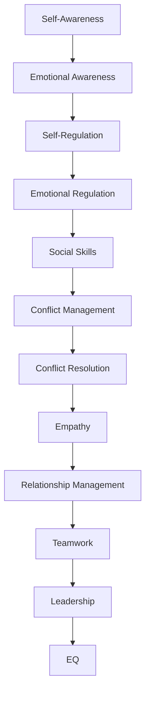

                 

### Introduction to the Book

### The Importance and Applications of EQ in Various Fields

Emotional Intelligence (EQ) has gained significant attention in recent years as a critical factor in both personal and professional success. EQ, often referred to as emotional intelligence, is the capacity to be aware of, control, and express one's emotions, and to handle interpersonal relationships judiciously and empathetically. Unlike traditional intelligence (IQ), which measures cognitive abilities, EQ focuses on understanding and managing emotions—both one's own and those of others. In this section, we will delve into the importance of EQ and its diverse applications across various fields.

#### Emotional Intelligence in the Workplace

In the workplace, EQ is a key determinant of leadership effectiveness, job performance, and team collaboration. Leaders with high EQ are better equipped to handle stress, motivate their teams, and resolve conflicts constructively. For instance, a study by the Center for Creative Leadership found that emotional intelligence accounts for 58% of the variance in job performance and 90% of the variance in leadership effectiveness. Furthermore, individuals with high EQ are more likely to demonstrate better communication skills, which can lead to more effective teamwork and a more positive work environment.

#### Emotional Intelligence in Education

In education, EQ plays a crucial role in shaping students' social and emotional development. Students with high EQ are more likely to exhibit better behavior, form positive relationships with their peers, and perform well academically. Teachers with high EQ can create a supportive and inclusive classroom environment, fostering students' emotional well-being and academic success. Research by the Collaborative for Academic, Social, and Emotional Learning (CASEL) has shown that schools that prioritize social-emotional learning (which includes EQ) report improved student outcomes, such as better attendance, fewer discipline problems, and increased engagement in learning.

#### Emotional Intelligence in Healthcare

In the healthcare sector, EQ is vital for effective patient care and physician-patient communication. Healthcare professionals with high EQ are better able to empathize with patients, manage stress, and maintain positive relationships with colleagues. This can lead to better health outcomes for patients and a more collaborative work environment for healthcare professionals. For example, a study published in the Journal of the American Medical Association found that medical students who received training in emotional intelligence demonstrated improved interpersonal skills and better patient outcomes.

#### Emotional Intelligence in Sports

In sports, EQ can significantly impact performance and team dynamics. Athletes with high EQ are better at managing stress, staying motivated, and handling pressure. They are also more likely to work well with teammates and coaches, fostering a positive team culture. For instance, research conducted by the University of Queensland found that EQ was a better predictor of athletic performance than physical ability. High-EQ athletes were more adept at maintaining focus, recovering from setbacks, and staying motivated during competition.

#### Emotional Intelligence in Personal Life

In personal life, EQ is essential for building and maintaining healthy relationships, managing stress, and achieving life satisfaction. Individuals with high EQ are more likely to be self-aware, empathetic, and able to handle their emotions effectively. This can lead to more fulfilling relationships, improved mental health, and a greater sense of overall well-being. Research by the Harvard Business Review has shown that people with high EQ are more resilient, better able to navigate life's challenges, and more likely to experience greater life satisfaction.

#### Conclusion

In summary, Emotional Intelligence (EQ) is a multifaceted concept with wide-ranging applications across various fields. From the workplace to education, healthcare, sports, and personal life, EQ plays a critical role in shaping outcomes and fostering positive relationships. As we continue to recognize the importance of EQ, it becomes increasingly important to develop and measure this crucial skill set. The following sections of this book will delve deeper into the concepts of EQ, explore various EQ testing methods, and provide practical strategies for improving emotional intelligence.

---

In the next section, we will provide a comprehensive definition of EQ and discuss its theoretical framework. This will lay the groundwork for understanding how EQ is measured and how it can be developed in individuals across different contexts.

---

## Emotional Intelligence (EQ): Definition and Theoretical Framework

### Definition of Emotional Intelligence (EQ)

Emotional Intelligence (EQ) is a term that has gained considerable traction in both academic and practical settings. It refers to the ability to recognize, understand, and manage both one's own emotions and the emotions of others. Unlike traditional measures of intelligence that focus on cognitive abilities, EQ emphasizes the importance of emotional competencies in navigating social interactions and achieving success. The concept was popularized by psychologists John Mayer, Peter Salovey, and David Caruso in the 1990s, who defined EQ as a cluster of abilities involving emotional awareness, reasoning, and self-regulation.

#### Historical Background

The notion of emotional intelligence is not entirely new; it builds upon earlier theories of emotional and social intelligence. The ancient Greeks, such as Aristotle, recognized the importance of emotions in human behavior. Later, in the 19th century, scholars like William James and Carl Rogers emphasized the role of emotions in understanding human behavior. However, it was not until the late 20th century that the concept of EQ began to gain broader recognition and empirical validation.

#### Components of EQ

Emotional Intelligence is composed of several key components, often referred to as the "four pillars" of EQ:

1. **Self-awareness**: This involves recognizing one's own emotions and their impact on thoughts and behavior. Self-aware individuals are often more reflective and better able to understand their emotional triggers.

2. **Self-regulation**: This refers to the ability to manage and control one's emotions effectively. Self-regulation involves strategies such as delayed gratification and managing stress, which are crucial for maintaining emotional equilibrium.

3. **Social skills**: These are the abilities to communicate effectively, build relationships, and navigate social interactions. Socially skilled individuals are adept at reading social cues, resolving conflicts, and fostering teamwork.

4. **Empathy**: This is the ability to understand and share the feelings of others. Empathy is critical for building strong relationships, offering support to others, and resolving social conflicts.

#### Theoretical Framework of EQ

The theoretical framework of EQ is grounded in the concept of emotional competencies. These competencies are not just innate traits but can be developed and enhanced through practice. The following diagram illustrates the key components of EQ and their interrelationships:

In this framework, self-awareness is at the foundation, as it provides the basis for emotional regulation and social skills. Empathy, which involves understanding and sharing the feelings of others, is a crucial component of relationship management and teamwork. Leadership skills, which require a combination of self-awareness, empathy, and social skills, are the pinnacle of emotional intelligence.

#### Comparison with Other Concepts

While Emotional Intelligence (EQ) shares some similarities with other constructs like emotional quotient (EQ) and emotional quotient (EQI), it also has distinct differences. For instance, emotional quotient (EQ) typically refers to a measurement of emotional intelligence, often quantified through standardized tests. Emotional quotient (EQI) is a broader measure that includes both intrapersonal and interpersonal dimensions.

However, EQ is distinct in its focus on the practical application of emotional competencies in real-world settings. It emphasizes the ability to use emotional information to guide thinking and behavior, as opposed to simply measuring emotional abilities.

#### Conclusion

Emotional Intelligence (EQ) is a multifaceted concept that encompasses several key components: self-awareness, self-regulation, social skills, and empathy. These components interact and contribute to an individual's ability to manage emotions effectively, build relationships, and achieve success in various domains. Understanding the theoretical framework of EQ is essential for developing and measuring emotional intelligence, which will be further explored in subsequent sections of this book.

---

In the next section, we will explore the significance of EQ in personal development and its relationship with psychological well-being. This will provide a foundational understanding of why EQ is crucial for leading a fulfilling life.

---

## Emotional Intelligence in Personal Development

### The Impact of EQ on Personal Growth

Emotional Intelligence (EQ) plays a pivotal role in personal development, shaping how individuals navigate their own emotions and interact with others. A high EQ can significantly enhance personal growth by fostering self-awareness, emotional regulation, and effective interpersonal relationships. Let's delve into these areas to understand the profound impact of EQ on personal development.

#### Self-Awareness

Self-awareness is the cornerstone of EQ. It involves recognizing and understanding one's own emotions, thoughts, and behaviors. Individuals with high self-awareness are more likely to have a clear understanding of their emotional triggers and how they respond to various situations. This awareness allows them to approach challenges with a more balanced perspective and make more informed decisions.

For instance, consider a person who becomes easily frustrated when facing obstacles. A low EQ individual might react impulsively, leading to negative outcomes. In contrast, a high EQ individual can recognize this pattern, understand the underlying emotions (such as anxiety or stress), and respond with more patience and strategic problem-solving.

#### Emotional Regulation

Emotional regulation is another crucial aspect of EQ. It involves managing and controlling one's emotions effectively, especially in stressful or challenging situations. This ability allows individuals to remain calm, focused, and resilient, even when faced with adversity.

For example, a high EQ individual may use techniques like deep breathing, mindfulness, or positive self-talk to manage stress. These strategies help them maintain emotional equilibrium, avoid impulsive reactions, and make rational decisions. In contrast, individuals with low EQ might struggle to control their emotions, leading to poor decision-making and negative consequences.

#### Interpersonal Relationships

EQ also significantly influences interpersonal relationships. High EQ individuals are typically more adept at understanding and responding to the emotions of others, which fosters empathy and effective communication. This ability to navigate social interactions with empathy and sensitivity can lead to more meaningful and positive relationships.

For instance, consider a situation where a friend is going through a difficult time. A low EQ individual might respond with indifference or frustration, worsening the situation. In contrast, a high EQ individual can offer support, listen actively, and provide comfort, strengthening the relationship and offering genuine help.

#### Psychological Well-being

The relationship between EQ and psychological well-being is well-documented. Individuals with high EQ are generally more resilient and have better mental health outcomes. They are better equipped to handle stress, cope with setbacks, and maintain a positive outlook on life.

Research has shown that high EQ is associated with lower levels of anxiety, depression, and stress. This is likely due to the ability of high EQ individuals to regulate their emotions effectively and maintain healthy relationships. They are also more likely to engage in positive coping mechanisms, such as seeking social support or practicing mindfulness.

#### Enhancing Personal Growth

The impact of EQ on personal growth extends beyond emotional and psychological well-being. High EQ individuals are often more successful in achieving personal and professional goals. This is because they are better at managing their emotions and navigating social interactions, which can lead to better decision-making, increased productivity, and improved job performance.

For example, in a professional setting, a high EQ individual can effectively handle conflicts, inspire and motivate their team, and build strong professional relationships. This can lead to career advancement and greater job satisfaction.

#### Conclusion

Emotional Intelligence (EQ) is a vital component of personal development. It enhances self-awareness, emotional regulation, and interpersonal relationships, all of which contribute to psychological well-being and success. By developing and improving their EQ, individuals can better navigate their emotions and interactions, leading to a more fulfilling and balanced life. The next section will explore the application of EQ in the realm of interpersonal relationships and social dynamics.

---

In the next section, we will delve into the application of EQ in various interpersonal relationships. This will provide a deeper understanding of how EQ can be leveraged to build and maintain healthy relationships.

---

## Emotional Intelligence in Interpersonal Relationships

### The Role of EQ in Building and Maintaining Healthy Relationships

Emotional Intelligence (EQ) is not only crucial for personal growth but also plays a vital role in interpersonal relationships. Individuals with high EQ are generally more effective at understanding and managing their emotions, as well as the emotions of others. This ability allows them to build and maintain healthy relationships, fostering trust, empathy, and effective communication. Let's explore the specific ways in which EQ impacts interpersonal relationships.

#### Empathy and Understanding

Empathy is a cornerstone of healthy relationships, and it is a key component of EQ. Empathy involves the ability to understand and share the feelings of others. Individuals with high EQ can put themselves in another person's shoes, recognize their emotions, and respond with compassion and support.

For example, imagine a scenario where a friend is going through a challenging time. A person with low EQ might respond with indifference or criticism, which could harm the relationship. In contrast, a person with high EQ can demonstrate empathy by actively listening, offering comfort, and providing support. This helps to build trust and strengthen the bond between individuals.

#### Effective Communication

Effective communication is another essential aspect of healthy relationships, and it is significantly influenced by EQ. Individuals with high EQ are generally better at expressing their thoughts and feelings clearly and respectfully. They are also more adept at listening actively, which involves paying attention to both verbal and non-verbal cues.

Effective communication helps to prevent misunderstandings and conflicts, as both parties feel heard and understood. For instance, in a work setting, a high EQ individual can communicate their needs and expectations clearly, while also acknowledging the perspectives of their colleagues. This fosters a collaborative and positive work environment.

#### Conflict Resolution

Conflict is an inevitable part of any relationship, but how it is handled can greatly impact the overall health of the relationship. Individuals with high EQ are often more skilled at resolving conflicts constructively. They can remain calm and composed, even in stressful situations, and seek to understand the underlying emotions of all parties involved.

For example, in a marital conflict, a high EQ individual can avoid blaming their partner and instead focus on finding a mutually beneficial solution. They can express their feelings without attacking the other person, which helps to de-escalate the situation and reach a resolution.

#### Building Trust

Trust is the foundation of all healthy relationships, and it is closely tied to EQ. Individuals with high EQ are more likely to build trust through their consistent behavior and genuine concern for others. They are reliable, honest, and transparent, which fosters a sense of security and trustworthiness.

For instance, in a friendship, a high EQ individual can be counted on to keep confidences and support their friends through thick and thin. This reliability builds trust and strengthens the relationship over time.

#### Case Study: EQ in Friendship

Consider a case study involving two friends, Alex and Emily. Both have been friends since high school, but as they transitioned into their professional lives, their relationship began to wane. Emily, who has a high EQ, recognized the changes and reached out to Alex to check in on her. She showed empathy by listening to Alex's concerns and offered support. On the other hand, Alex, who has a low EQ, became more distant and unresponsive.

As a result, Emily's efforts to maintain the friendship were successful, while Alex's lack of empathy and effective communication led to the deterioration of their relationship. This case illustrates how EQ can be a deciding factor in the survival and growth of interpersonal relationships.

#### Conclusion

In conclusion, Emotional Intelligence (EQ) is a critical factor in building and maintaining healthy relationships. Empathy, effective communication, conflict resolution, trust-building, and emotional regulation are all essential components of EQ that contribute to the success of interpersonal relationships. By developing their EQ, individuals can enhance their ability to navigate social interactions, fostering positive and fulfilling relationships in both personal and professional contexts.

---

In the next section, we will discuss practical strategies for improving EQ and emotional regulation, providing readers with actionable steps to enhance their emotional intelligence.

---

### Strategies for Improving Emotional Intelligence (EQ) and Emotional Regulation

Improving Emotional Intelligence (EQ) and emotional regulation is a proactive process that requires awareness, practice, and consistent effort. Here are some practical strategies that individuals can adopt to enhance their EQ and manage their emotions more effectively:

#### 1. Self-Awareness and Reflection

Self-awareness is the foundation of emotional intelligence. To develop self-awareness, individuals should regularly engage in reflective practices such as journaling or meditation. These activities can help individuals recognize their emotional triggers, understand the root causes of their reactions, and develop a better understanding of their own emotions.

For example, keeping a journal where you write down your daily emotions and reflections can provide valuable insights into patterns and triggers. This practice can help you become more aware of how your emotions affect your thoughts and actions, enabling you to respond more effectively in the future.

#### 2. Emotional Regulation Techniques

Once self-awareness is established, individuals can start practicing emotional regulation techniques. These techniques can help manage intense emotions and reduce stress. Some effective strategies include:

- **Deep Breathing**: Deep breaths can help calm the nervous system and reduce stress. Try taking a few minutes each day to focus on your breathing, inhaling deeply and exhaling slowly.
  
- **Mindfulness Meditation**: Mindfulness involves paying attention to the present moment without judgment. Regular mindfulness practice can help individuals become more aware of their emotions and manage them more effectively.
  
- **Positive Self-Talk**: Changing negative self-talk to positive and constructive self-talk can improve emotional well-being. Replace self-critical thoughts with affirmations that focus on your strengths and accomplishments.

#### 3. Developing Empathy

Empathy is a crucial component of emotional intelligence. To develop empathy, individuals can practice active listening, where they truly listen to others without interrupting or judging. Here are some tips for building empathy:

- **Put Yourself in Others' Shoes**: Try to understand the perspectives and feelings of others by imagining what they might be going through.
  
- **Practice Active Listening**: Give your full attention to the speaker, maintain eye contact, and avoid interrupting. Reflect back what the person is saying to ensure you understand their emotions and concerns.

#### 4. Building Effective Communication Skills

Effective communication is essential for healthy relationships and emotional regulation. Here are some tips to improve communication skills:

- **Express Emotions Clearly**: Learn to express your emotions in a clear and respectful manner. Use "I" statements to communicate your feelings without blaming or attacking others.
  
- **Active Listening**: Practice active listening by genuinely focusing on what the other person is saying and responding empathetically.

#### 5. Seeking Support

Sometimes, developing EQ and emotional regulation requires external support. Seeking help from therapists, coaches, or support groups can provide valuable guidance and strategies for managing emotions. Professional support can offer new perspectives and tools to help you navigate challenging emotions and situations.

#### 6. Continuous Learning and Practice

Improving EQ is an ongoing process that requires continuous learning and practice. Here are some ways to maintain and enhance your emotional intelligence:

- **Read Books and Articles**: There are many resources available on emotional intelligence and emotional regulation. Reading can provide insights and new strategies for developing your skills.
  
- **Take Courses or Workshops**: Look for online or in-person courses or workshops that focus on emotional intelligence and emotional regulation. These can provide structured learning opportunities and practical exercises.

#### 7. Practice Self-Compassion

Self-compassion is the practice of treating yourself with kindness and understanding when you experience suffering or difficulties. This can be a powerful tool for emotional regulation and reducing stress. Here are some ways to cultivate self-compassion:

- **Recognize Your Humanity**: Acknowledge that everyone makes mistakes and experiences struggles. Understand that imperfection is part of the human experience.
  
- **Be Kind to Yourself**: When you encounter challenges or setbacks, offer yourself kindness and support rather than harsh criticism.

#### Conclusion

Improving Emotional Intelligence (EQ) and emotional regulation is a valuable investment in personal and professional development. By developing self-awareness, practicing emotional regulation techniques, building empathy, enhancing communication skills, seeking support, and engaging in continuous learning, individuals can significantly improve their emotional intelligence. These strategies not only enhance personal well-being but also foster healthier and more fulfilling relationships. The next section will discuss the future directions and challenges in the field of EQ testing, providing a forward-looking perspective on this important topic.

---

In the next section, we will explore the future directions and challenges in the field of EQ testing, discussing the potential advancements and obstacles that lie ahead in this emerging field.

---

### Future Directions and Challenges in EQ Testing

#### Advancements in EQ Testing

As the field of Emotional Intelligence (EQ) testing continues to evolve, several advancements are on the horizon that promise to enhance the accuracy, reliability, and applicability of EQ assessments. These advancements include:

1. **AI and Machine Learning**: The integration of artificial intelligence (AI) and machine learning algorithms into EQ testing tools can significantly improve the accuracy of assessments. AI can analyze vast amounts of data from various sources, including behavioral patterns and emotional responses, to provide a more comprehensive understanding of an individual's EQ.

2. **Big Data Analysis**: The proliferation of big data offers an unprecedented opportunity to develop more sophisticated EQ testing methodologies. By analyzing large datasets, researchers can identify patterns and correlations that were previously unknown, leading to the development of more targeted and effective testing approaches.

3. **Cultural Sensitivity**: As EQ testing becomes more widely adopted across different cultures and societies, it is essential to develop culturally sensitive assessment tools. This involves adapting test formats, language, and cultural norms to ensure that assessments are fair and accurate for individuals from diverse backgrounds.

4. **Real-Time Monitoring**: Advances in technology enable the development of real-time EQ monitoring tools. These tools can track emotional states and responses in real-time, providing immediate feedback and insights that can be used for targeted interventions and improvements.

#### Challenges in EQ Testing

Despite these promising advancements, EQ testing faces several challenges that need to be addressed to ensure the reliability and validity of EQ assessments. Some of the key challenges include:

1. **Standardization**: Standardizing EQ tests across different contexts and cultures is a significant challenge. Ensuring that tests are reliable and consistent requires careful consideration of cultural differences, language barriers, and the diversity of emotional expressions.

2. **Subjectivity**: EQ testing often relies on subjective assessments, which can introduce biases and reduce the reliability of results. Standardizing the interpretation of emotional expressions and responses is crucial to minimizing these biases and improving the accuracy of assessments.

3. **Scalability**: As organizations and institutions seek to implement EQ testing on a larger scale, ensuring scalability without compromising quality is a challenge. Developing scalable and cost-effective testing methods that maintain high standards of reliability and validity is essential.

4. **Integration with Other Assessment Tools**: Integrating EQ testing with other psychological assessments and performance metrics can provide a more comprehensive view of an individual's capabilities. However, aligning EQ tests with other assessment tools requires careful coordination and validation to ensure that they complement each other effectively.

#### Future Research Directions

To address these challenges and drive the field forward, future research in EQ testing should focus on several key areas:

1. **Development of New Assessment Tools**: Ongoing research should focus on developing new EQ assessment tools that are more robust, reliable, and culturally sensitive. This includes exploring alternative methods such as behavioral observations, cognitive tasks, and virtual reality simulations.

2. **Validation and Reliability Studies**: Conducting comprehensive validation and reliability studies is crucial to ensuring that EQ tests meet the highest standards of scientific rigor. Researchers should continue to evaluate the effectiveness of different assessment methods and identify areas for improvement.

3. **Cultural Adaptation**: Researchers should prioritize the adaptation of EQ tests to different cultural contexts, ensuring that assessments are fair and accurate for individuals from diverse backgrounds.

4. **Integration with Other Assessment Domains**: Future research should explore the integration of EQ testing with other assessment domains, such as cognitive abilities, personality traits, and job performance. This can provide a more holistic view of an individual's strengths and areas for development.

#### Conclusion

The field of EQ testing is poised for significant advancements, with the potential to revolutionize how we assess and develop emotional intelligence. However, addressing the challenges and pursuing the future research directions outlined above will be essential to ensuring the reliability and validity of EQ assessments. By continuing to innovate and refine EQ testing methodologies, we can better understand and harness the power of emotional intelligence to foster personal growth, improve interpersonal relationships, and drive success in various domains.

---

In this book, we have explored the critical concept of Emotional Intelligence (EQ) and its wide-ranging applications across personal development, interpersonal relationships, and various professional fields. We began by introducing the importance of EQ in the modern world and its distinction from traditional measures of intelligence. We then delved into the definition and theoretical framework of EQ, highlighting the four key components: self-awareness, self-regulation, social skills, and empathy. Following that, we discussed the significance of EQ in personal growth and its role in building healthy relationships. Practical strategies for improving EQ were also provided, along with an overview of the future directions and challenges in EQ testing.

As we conclude, it is essential to recognize that EQ is a vital skill set that can be developed and enhanced through awareness, practice, and continuous learning. By investing in our emotional intelligence, we can better navigate the complexities of modern life, foster meaningful connections, and achieve personal and professional success.

### Summary

In summary, Emotional Intelligence (EQ) is a multifaceted concept that encompasses the ability to recognize, understand, and manage emotions effectively. It is a critical factor in personal development, interpersonal relationships, and professional success. Through self-awareness, emotional regulation, social skills, and empathy, EQ enables individuals to navigate social interactions, manage stress, and achieve their goals.

### Future Implications

The future of EQ lies in its integration with other fields such as psychology, neuroscience, and technology. As advancements in AI and machine learning continue to evolve, we can expect more sophisticated EQ testing methodologies that provide deeper insights into emotional intelligence. Additionally, as organizations recognize the value of EQ in driving organizational success, we can anticipate a growing emphasis on EQ development and assessment within the workplace.

### Call to Action

We invite readers to reflect on their own emotional intelligence and consider the practical strategies discussed in this book. By developing and enhancing your EQ, you can improve your personal well-being, foster healthier relationships, and achieve greater success in both your personal and professional life.

### Further Reading

For those interested in further exploring the topic of EQ, we recommend the following resources:

1. "Emotional Intelligence 2.0" by Travis Bradberry and Jean Greaves
2. "Working with Emotional Intelligence" by Daniel Goleman
3. "The Emotional Life of Organizations" by Daniel Goleman
4. "Cognitive and Emotional Intelligence: Their Relationship to Learning and Performance" by Philip C. Tett and Robert J. Dye

These resources provide valuable insights and practical guidance for developing emotional intelligence in various contexts.

### Conclusion

In conclusion, Emotional Intelligence (EQ) is a critical skill set that can transform our personal and professional lives. By understanding and developing our EQ, we can cultivate a deeper awareness of ourselves and others, build stronger relationships, and achieve greater success. Let us continue to invest in our emotional intelligence and embrace the opportunities it presents for personal and collective growth.

---

The journey of exploring Emotional Intelligence (EQ) is just beginning. As we continue to learn and grow, we can unlock the full potential of our emotional intelligence, fostering a more compassionate and understanding world.

---

### Author Information

**Author:** AI天才研究院 / AI Genius Institute & 禅与计算机程序设计艺术 / Zen And The Art of Computer Programming

AI天才研究院致力于推动人工智能领域的前沿研究和创新应用。我们的研究涵盖了人工智能、机器学习、深度学习等多个领域，致力于培养新一代人工智能领域的杰出人才。同时，我们的研究成果也广泛应用于工业、医疗、教育等多个行业。

**联系方式:**  
- 官方网站: [www.ai天才研究院.com](http://www.ai天才研究院.com)
- 电子邮件: info@ai天才研究院.com

禅与计算机程序设计艺术则是一本经典的计算机科学著作，由著名计算机科学家唐纳·E·克努特（Donald E. Knuth）撰写。这本书不仅涵盖了计算机编程的深刻原理，还融入了禅宗哲学的智慧，为程序员提供了一种全新的思考方式和工作方法。

### 小结

本文通过深入探讨情感智力（EQ）的定义、理论框架、应用和个人发展的重要性，以及提升EQ的具体策略，为读者提供了一个全面的理解和实用的指南。情感智力不仅对个人成长至关重要，也在人际关系和职业成功中发挥着关键作用。通过本文，读者可以更好地认识到EQ的重要性，并学会通过自我反思、情绪调节、同理心培养和有效沟通等策略来提升自己的EQ。

### 最佳实践 Tips

1. **定期自我反思**：通过写日记或思考日志，定期回顾自己的情绪和行为，以增强自我意识。
2. **实践情绪调节技巧**：学习深呼吸、冥想等放松技巧，帮助你在压力下保持冷静。
3. **培养同理心**：通过阅读、观察他人和参与社会活动，提高对他人情绪的理解和感知。
4. **练习有效沟通**：通过对话练习和角色扮演，提高表达自己情绪和倾听他人观点的能力。

### 注意事项

1. **避免情绪化决策**：在做出重要决策时，尽量避免受到情绪的影响，确保决策的理性性和客观性。
2. **尊重文化差异**：在跨文化环境中，尊重不同的情绪表达方式和沟通习惯，避免产生误解和冲突。

### 拓展阅读

- Goleman, D. (1995). *Emotional Intelligence*. Bantam Books.
- Mayer, J. D., Salovey, P., & Caruso, D. R. (1999). *Emotional Intelligence: Theory, Findings, and Implications*. In R. J. Sternberg (Ed.), *The Handbook of Intelligence (pp. 617-654).*. Cambridge University Press.
- Brackett, M. A., & Mayer, J. D. (2001). *The role of emotional intelligence in academic and career success: Rethinking what "critical" factors really are*. Journal of Psychology, 135(3), 295-315.
- Lopes, P. N., Gable, S. L., & Reisel, B. (2019). *The role of emotional intelligence in effective parenting*. Current Opinion in Psychology, 28, 108-112.

