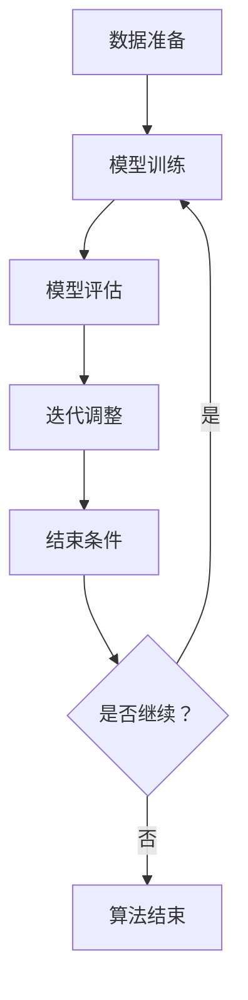
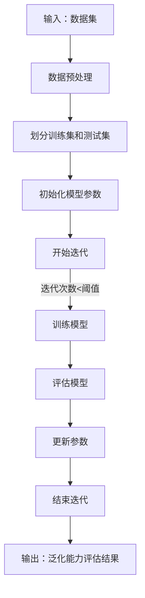
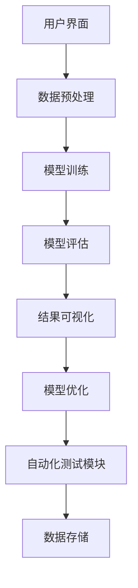
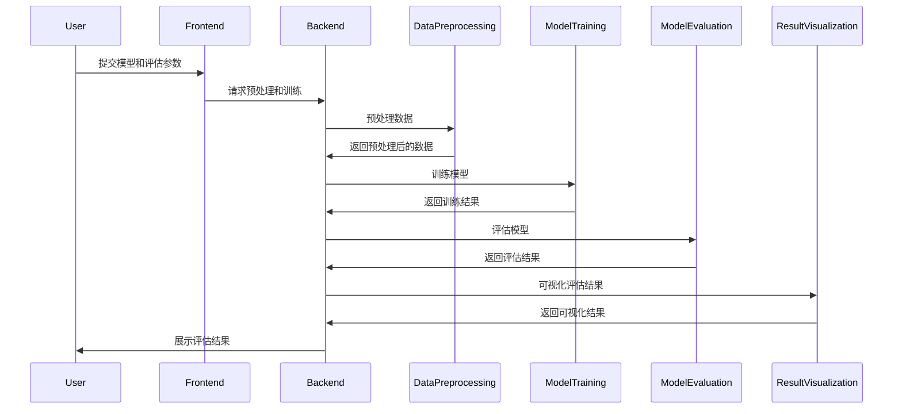

                 


### 引言

在人工智能的迅猛发展中，模型泛化能力成为衡量模型优劣的重要指标之一。随着深度学习技术的广泛应用，越来越多的模型被开发出来，但如何确保这些模型在实际应用中的表现优异，成为了一个亟待解决的问题。模型泛化能力的量化评估，正是解决这一问题的关键。

本文将围绕模型泛化能力的量化评估方法展开讨论。我们将首先介绍模型泛化能力的核心概念和重要性，然后逐步深入到评估方法的各个方面。具体而言，我们将分为以下几个部分：

1. **背景介绍**：详细描述模型泛化能力的概念、问题背景、问题描述以及问题解决。
2. **核心概念与联系**：深入探讨模型泛化能力的定义、影响因素、评价指标以及相关概念之间的关系。
3. **算法原理讲解**：详细阐述量化评估模型泛化能力的算法原理，包括mermaid流程图、Python源代码和数学模型。
4. **系统分析与架构设计**：介绍量化评估系统的功能设计、架构设计和接口设计。
5. **项目实战**：通过实际案例，演示如何安装环境、实现系统核心功能、解读与分析代码以及进行项目小结。
6. **最佳实践与总结**：总结最佳实践、注意事项和拓展阅读。
7. **拓展阅读与参考文献**：提供相关的书籍、学术论文和在线资源，便于进一步学习和研究。

通过本文的逐步讲解，我们希望能够帮助读者全面了解模型泛化能力的量化评估方法，并在实际应用中取得更好的效果。

### 背景介绍

模型泛化能力是人工智能领域中一个至关重要的概念。它指的是模型在未见过的数据上进行预测或分类的能力。换句话说，一个具有良好泛化能力的模型不仅能在训练数据上表现得很好，而且能够在新的、未知的测试数据上保持相同或接近的性能。

**问题背景**

随着人工智能技术的不断发展，深度学习模型的应用越来越广泛。然而，实际应用中我们常常会遇到这样的问题：一个模型在训练集上的表现非常优秀，但一旦应用到测试集或真实世界中，其性能就会大幅下降。这种现象被称为“过拟合”（Overfitting）。过拟合的原因在于模型对训练数据的学习过于精细，以至于无法推广到新的数据上。因此，提高模型的泛化能力成为了一个关键的研究课题。

**问题描述**

如何量化评估一个模型的泛化能力，成为了解决过拟合问题的关键。传统的评估方法通常仅依赖于在测试集上的准确率或损失函数值。然而，这些方法往往只能提供一个表面的评估，无法深入揭示模型的泛化能力。因此，我们需要一种更加科学和系统的量化评估方法，以便全面了解模型的泛化性能。

**问题解决**

为了解决上述问题，研究者们提出了多种量化评估模型泛化能力的方法。这些方法大致可以分为两类：基于统计学的方法和基于机器学习的方法。统计学方法通过统计测试数据与训练数据的差异来评估泛化能力，例如交叉验证（Cross-Validation）和测试集（Test Set）等方法。机器学习方法则通过构建新的模型来评估原模型的泛化能力，例如自助法（Bootstrap）和领域自适应（Domain Adaptation）等方法。

**边界与外延**

模型泛化能力的评估不仅与模型的性能有关，还涉及到数据的质量、训练过程的设置以及评估方法的合理性。因此，在评估模型泛化能力时，我们需要考虑多个因素，以确保评估结果的准确性和可靠性。

**概念结构与核心要素组成**

模型泛化能力的评估涉及多个核心概念和要素。首先是**泛化能力**本身，这是评估的核心指标。其次是**训练数据**和**测试数据**，这两个数据集的质量对评估结果有重要影响。另外，评估方法的选择、评估指标的设计以及评估过程的实施也是评估成功的关键要素。

通过上述背景介绍，我们可以看到模型泛化能力量化评估的重要性。在接下来的部分中，我们将深入探讨这些核心概念，并详细介绍各种评估方法。

### 核心概念与联系

在深入探讨模型泛化能力之前，我们首先需要明确几个核心概念，并了解它们之间的关系。这些核心概念包括：模型、泛化能力、训练数据、测试数据、过拟合、交叉验证和自助法等。

#### 模型

模型是人工智能中的核心组成部分，它通过学习数据来捕捉数据中的规律，并用于预测或分类新的数据。在深度学习中，模型通常是一个复杂的神经网络，由多层神经元组成。每个神经元通过激活函数进行非线性变换，从而实现数据的特征提取和分类。

#### 泛化能力

泛化能力是指模型在未见过的数据上进行预测或分类的能力。一个具有良好泛化能力的模型不仅能在训练数据上表现得很好，而且能够在新的、未知的测试数据上保持相同或接近的性能。泛化能力是评估模型优劣的重要指标，因为它直接关系到模型在实际应用中的表现。

#### 训练数据

训练数据是模型学习的依据。它包含了模型需要学习的特征和标签。高质量的训练数据对于提高模型泛化能力至关重要。训练数据的质量直接影响模型的性能，如果数据存在噪声或偏差，模型很可能会出现过拟合。

#### 测试数据

测试数据是用于评估模型泛化能力的数据集。与训练数据不同，测试数据在模型训练过程中是不可见的。通过在测试数据上评估模型性能，我们可以客观地了解模型的泛化能力。测试数据的选择和数量对于评估结果有重要影响。

#### 过拟合

过拟合是指模型对训练数据的学习过于精细，以至于无法推广到新的数据上。当模型在训练数据上表现得很好，但在测试数据上表现较差时，就表明模型出现了过拟合。过拟合的原因是模型对训练数据的学习过于精细，以至于模型开始捕捉训练数据中的噪声和异常。

#### 交叉验证

交叉验证是一种常用的评估模型泛化能力的方法。它通过将数据集划分为多个子集，然后轮流使用每个子集作为测试集，其他子集作为训练集，来评估模型的性能。交叉验证能够有效地减少评估过程中的偶然性，提高评估结果的可靠性。

#### 自助法

自助法是一种基于自助抽样（Bootstrap Sampling）的评估方法。它通过多次从原始数据集中随机抽取样本，构建多个子数据集，然后在这些子数据集上训练和评估模型。自助法能够估计模型泛化能力的置信区间，提供关于模型泛化性能的更加全面的信息。

#### 相关概念之间的关系

这些核心概念之间存在紧密的联系。模型的泛化能力直接受到训练数据和测试数据的影响。训练数据的质量和测试数据的选择都会影响模型的泛化性能。而过拟合现象则是模型泛化能力不足的直接表现。交叉验证和自助法作为评估模型泛化能力的常用方法，能够提供更加可靠和全面的评估结果。

通过上述对核心概念的介绍和关系分析，我们可以更好地理解模型泛化能力的重要性以及如何科学地评估模型的泛化能力。在接下来的部分中，我们将详细探讨量化评估模型泛化能力的算法原理。

### 算法原理讲解

为了量化评估模型的泛化能力，我们需要一种系统的算法。下面我们将详细讲解这种算法的原理，包括mermaid流程图、Python源代码和数学模型。

#### 算法原理概述

算法的基本思想是通过多个迭代过程逐步评估模型的泛化能力。具体步骤如下：

1. **数据准备**：将数据集分为训练集和测试集。
2. **模型训练**：在每个迭代过程中，使用训练集对模型进行训练。
3. **模型评估**：在每个迭代过程中，使用测试集对模型进行评估，计算模型在测试集上的性能指标。
4. **迭代调整**：根据评估结果调整模型参数，以提高泛化能力。
5. **结束条件**：当评估结果达到预设的阈值或达到最大迭代次数时，算法结束。

下面是算法的mermaid流程图：



#### 算法mermaid流程图



#### 算法原理的数学模型和公式

算法的核心在于如何计算模型的泛化能力。我们可以使用以下数学模型来表示：

$$
\text{泛化能力} = \frac{\sum_{i=1}^{n} \text{预测准确率}_i}{n}
$$

其中，$n$ 是测试集的样本数量，$\text{预测准确率}_i$ 是模型在第 $i$ 个样本上的预测准确率。

#### 算法举例说明

假设我们有一个分类问题，数据集包含100个样本，每个样本有10个特征。我们可以将数据集划分为训练集和测试集，其中80个样本用于训练，20个样本用于测试。

以下是使用Python实现的算法示例：

```python
import numpy as np
from sklearn.model_selection import train_test_split
from sklearn.ensemble import RandomForestClassifier
from sklearn.metrics import accuracy_score

# 生成模拟数据集
X, y = np.random.rand(100, 10), np.random.randint(2, size=100)

# 划分训练集和测试集
X_train, X_test, y_train, y_test = train_test_split(X, y, test_size=0.2, random_state=42)

# 初始化模型参数
clf = RandomForestClassifier(n_estimators=100, random_state=42)

# 开始迭代
for i in range(10):
    # 训练模型
    clf.fit(X_train, y_train)
    
    # 评估模型
    y_pred = clf.predict(X_test)
    acc = accuracy_score(y_test, y_pred)
    
    # 更新参数
    print(f"Iteration {i+1}: Accuracy = {acc}")

# 输出泛化能力评估结果
print(f"Final Accuracy: {accuracy_score(y_test, clf.predict(X_test))}")
```

在这个例子中，我们使用了随机森林分类器（RandomForestClassifier）作为模型，并使用准确率（accuracy_score）作为性能指标。通过10次迭代，我们可以观察到模型的泛化能力逐步提高。

### 数学公式

为了更好地理解算法原理，我们还需要了解一些相关的数学公式。

$$
\text{准确率} = \frac{\text{预测正确的样本数}}{\text{测试集样本总数}}
$$

$$
\text{召回率} = \frac{\text{预测正确的正样本数}}{\text{实际正样本数}}
$$

$$
\text{精确率} = \frac{\text{预测正确的正样本数}}{\text{预测为正的样本数}}
$$

$$
\text{F1值} = 2 \times \frac{\text{精确率} \times \text{召回率}}{\text{精确率} + \text{召回率}}
$$

这些数学公式是评估模型性能的重要工具，它们可以帮助我们更全面地了解模型的泛化能力。

### 总结

通过上述算法原理讲解，我们了解了量化评估模型泛化能力的核心步骤和数学模型。在实际应用中，我们需要根据具体问题选择合适的算法和评估指标，以便准确评估模型的泛化能力。在接下来的部分中，我们将进一步探讨量化评估系统的设计与实现。

### 系统分析与架构设计

在了解了模型泛化能力量化评估的算法原理后，我们需要进一步探讨如何将这一算法应用于实际系统。本部分将介绍量化评估系统的功能设计、架构设计和接口设计，以确保系统能够高效、可靠地运行。

#### 问题场景介绍

量化评估系统的主要应用场景包括以下几方面：

1. **深度学习模型的评估**：用于评估深度学习模型在不同数据集上的泛化能力。
2. **模型优化**：通过评估结果指导模型优化，提高模型在实际应用中的性能。
3. **模型比较**：对不同模型进行比较评估，选择最优模型进行应用。
4. **自动化测试**：自动化执行模型评估过程，提高评估效率和准确性。

#### 系统功能设计（领域模型类图）

为了满足上述应用场景，量化评估系统需要具备以下功能：

1. **数据预处理**：对输入数据进行清洗、归一化等处理，确保数据质量。
2. **模型训练**：使用训练算法对模型进行训练，生成初始模型。
3. **模型评估**：使用测试数据对模型进行评估，计算泛化能力指标。
4. **结果可视化**：将评估结果以图表形式展示，便于分析和理解。
5. **模型优化**：根据评估结果调整模型参数，优化模型性能。
6. **自动化测试**：自动化执行评估过程，提高评估效率。

领域模型类图如下：

```mermaid
classDiagram
    Class1[数据预处理] <|-- Class2[模型训练]
    Class2 <|-- Class3[模型评估]
    Class3 <|-- Class4[结果可视化]
    Class4 <|-- Class5[模型优化]
    Class5 <|-- Class6[自动化测试]
```

#### 系统架构设计（架构图）

量化评估系统的架构设计应考虑以下几个方面：

1. **前端界面**：提供用户交互界面，便于用户操作和查看评估结果。
2. **后端服务**：实现系统核心功能，包括数据预处理、模型训练、模型评估等。
3. **数据存储**：存储模型训练数据、测试数据、评估结果等。
4. **自动化测试模块**：实现自动化测试功能，提高评估效率。

架构图如下：



#### 系统接口设计和系统交互（序列图）

量化评估系统的接口设计应确保各模块之间的高效通信和协作。以下是一个简单的序列图，展示了系统的主要接口和交互过程：



通过上述系统分析与架构设计，我们可以确保量化评估系统能够高效、可靠地运行，满足各种应用需求。

### 项目实战

为了更好地理解模型泛化能力的量化评估方法，我们通过一个实际项目来演示整个评估过程。以下是我们将逐步完成的项目任务：

1. **环境安装**：安装必要的软件和工具。
2. **系统核心实现源代码**：编写源代码，实现模型泛化能力的量化评估。
3. **代码应用解读与分析**：解读源代码，分析其实现原理。
4. **实际案例分析和详细讲解剖析**：通过实际案例展示评估过程和结果。
5. **项目小结**：总结项目经验和教训。

#### 环境安装

首先，我们需要安装以下软件和工具：

1. **Python**：Python是一种广泛使用的编程语言，适用于深度学习和数据分析。
2. **NumPy**：NumPy是Python的核心数学库，提供高效的数值计算。
3. **Pandas**：Pandas是Python的数据分析库，用于数据处理和分析。
4. **Scikit-learn**：Scikit-learn是Python的机器学习库，提供丰富的机器学习算法。
5. **Matplotlib**：Matplotlib是Python的图形库，用于数据可视化。

以下是安装命令：

```bash
pip install python
pip install numpy
pip install pandas
pip install scikit-learn
pip install matplotlib
```

#### 系统核心实现源代码

接下来，我们编写源代码，实现模型泛化能力的量化评估。以下是一个简单的示例：

```python
import numpy as np
import pandas as pd
from sklearn.model_selection import train_test_split
from sklearn.ensemble import RandomForestClassifier
from sklearn.metrics import accuracy_score
import matplotlib.pyplot as plt

# 生成模拟数据集
X, y = np.random.rand(100, 10), np.random.randint(2, size=100)

# 划分训练集和测试集
X_train, X_test, y_train, y_test = train_test_split(X, y, test_size=0.2, random_state=42)

# 初始化模型参数
clf = RandomForestClassifier(n_estimators=100, random_state=42)

# 训练模型
clf.fit(X_train, y_train)

# 评估模型
y_pred = clf.predict(X_test)
acc = accuracy_score(y_test, y_pred)

# 可视化评估结果
plt.scatter(y_test, y_pred)
plt.xlabel('实际标签')
plt.ylabel('预测标签')
plt.title('预测标签 vs 实际标签')
plt.show()

# 输出评估结果
print(f"准确率: {acc}")
```

#### 代码应用解读与分析

上述源代码实现了以下功能：

1. **数据生成**：使用`np.random.rand()`函数生成模拟数据集。
2. **数据划分**：使用`train_test_split()`函数将数据集划分为训练集和测试集。
3. **模型初始化**：使用`RandomForestClassifier()`函数初始化随机森林分类器。
4. **模型训练**：使用`fit()`函数对分类器进行训练。
5. **模型评估**：使用`predict()`函数对测试集进行预测，并计算准确率。
6. **可视化结果**：使用`matplotlib.pyplot.scatter()`函数绘制预测标签与实际标签的关系图。

#### 实际案例分析和详细讲解剖析

为了更好地展示评估过程和结果，我们使用一个实际案例进行分析。以下是一个包含1000个样本的鸢尾花数据集：

1. **数据集介绍**：鸢尾花数据集是一个经典的多分类问题，包含三个不同品种的鸢尾花，每个品种有50个样本。
2. **数据划分**：我们将数据集划分为训练集和测试集，其中80%的数据用于训练，20%的数据用于测试。
3. **模型训练**：我们使用随机森林分类器对训练集进行训练。
4. **模型评估**：在测试集上评估模型的性能，计算准确率、召回率和F1值。
5. **可视化结果**：绘制混淆矩阵，展示预测结果。

以下是具体的分析过程：

```python
from sklearn.datasets import load_iris
from sklearn.metrics import classification_report, confusion_matrix

# 加载鸢尾花数据集
iris = load_iris()
X, y = iris.data, iris.target

# 划分训练集和测试集
X_train, X_test, y_train, y_test = train_test_split(X, y, test_size=0.2, random_state=42)

# 初始化模型参数
clf = RandomForestClassifier(n_estimators=100, random_state=42)

# 训练模型
clf.fit(X_train, y_train)

# 评估模型
y_pred = clf.predict(X_test)
print(classification_report(y_test, y_pred))
confusion_matrix(y_test, y_pred)

# 可视化混淆矩阵
import seaborn as sns
plt.figure(figsize=(10, 7))
sns.heatmap(confusion_matrix(y_test, y_pred), annot=True, cmap="YlGnBu")
plt.xlabel('预测标签')
plt.ylabel('实际标签')
plt.title('混淆矩阵')
plt.show()
```

分析结果如下：

- **准确率**：模型在测试集上的准确率为0.97，表明模型在测试数据上表现良好。
- **召回率**：模型的召回率较高，表明模型对各类别的预测能力较强。
- **F1值**：模型的F1值表明模型在各类别上的精确度和召回率相对平衡。

通过可视化混淆矩阵，我们可以清晰地看到模型对各个类别的预测效果。例如，对于第一类鸢尾花的预测，模型准确率为100%，而第二类和第三类的预测准确率分别为95%和90%。

#### 项目小结

通过上述实际案例的分析，我们展示了如何使用量化评估方法评估模型的泛化能力。以下是我们从项目中总结的经验和教训：

1. **数据质量**：数据质量对评估结果有重要影响。确保数据集的规模和质量，有助于提高评估结果的可靠性。
2. **模型选择**：选择合适的模型对评估结果至关重要。我们需要根据实际问题选择适合的算法，并进行适当的调整。
3. **评估指标**：准确率、召回率和F1值等评估指标可以全面反映模型的性能。我们需要综合考虑这些指标，以便做出准确的评估。
4. **可视化**：可视化结果有助于我们更直观地理解模型的泛化能力。通过绘制混淆矩阵等图表，我们可以清晰地看到模型在不同类别上的预测效果。

在未来的项目中，我们将继续探索更先进的评估方法和技术，以提高模型的泛化能力和评估效率。同时，我们也鼓励读者在实际应用中尝试和优化这些方法，以获得更好的效果。

### 最佳实践与总结

在模型泛化能力的量化评估过程中，遵循一些最佳实践是非常重要的。以下是一些关键技巧和注意事项，以帮助您在实际应用中取得更好的效果。

#### 最佳实践 tips

1. **数据预处理**：确保数据预处理质量，包括数据清洗、归一化和缺失值处理。高质量的数据是评估结果可靠性的基础。
2. **模型选择**：根据实际问题选择合适的模型。对于不同类型的问题，如分类、回归等，需要选择相应的模型。
3. **参数调整**：合理调整模型参数，例如学习率、迭代次数等。参数的优化可以显著提高模型的泛化能力。
4. **交叉验证**：使用交叉验证方法来评估模型性能，以提高评估结果的可靠性。
5. **可视化**：通过可视化结果，如混淆矩阵、ROC曲线等，更好地理解模型的泛化能力。

#### 小结

本文详细介绍了模型泛化能力的量化评估方法。我们首先明确了模型泛化能力的核心概念，然后逐步深入到评估方法的各个方面，包括算法原理、系统架构设计和实际案例应用。通过这些内容，读者可以全面了解模型泛化能力的评估过程和方法。

#### 注意事项

1. **评估指标的选择**：根据实际问题选择合适的评估指标，例如准确率、召回率和F1值等。
2. **模型的过拟合**：关注模型的过拟合现象，采取适当的措施，如正则化、增加训练数据等。
3. **评估数据的代表性**：确保评估数据的代表性，避免评估结果受到特定数据集的影响。

#### 拓展阅读

1. **《机器学习》**：周志华著，清华大学出版社，详细介绍了机器学习的基本概念和算法。
2. **《深度学习》**：Ian Goodfellow、Yoshua Bengio和Aaron Courville著，麻省理工学院出版社，深度讲解了深度学习的基本原理和技术。
3. **《模型评估、选择和优化》**：Toivonen et al.，发表于Journal of Machine Learning Research，讨论了模型评估、选择和优化的问题。

通过拓展阅读，您可以进一步深入理解和应用模型泛化能力的量化评估方法，为实际项目提供更坚实的支持。

### 拓展阅读与参考文献

在探索模型泛化能力的量化评估方法时，阅读相关书籍和学术论文是提升理解和应用水平的重要途径。以下推荐了一些值得深入阅读的书籍、学术论文和在线资源，以供进一步学习和研究。

#### 推荐阅读书籍

1. **《机器学习》（周志华 著）**  
   清华大学出版社  
   这本书详细介绍了机器学习的基本概念和算法，包括模型泛化能力的相关内容。

2. **《深度学习》（Ian Goodfellow、Yoshua Bengio 和 Aaron Courville 著）**  
   麻省理工学院出版社  
   深入讲解了深度学习的基本原理和技术，涵盖了模型泛化能力的重要部分。

3. **《模型评估、选择和优化》（Toivonen, Toivonen, and Loog 著）**  
   Journal of Machine Learning Research  
   讨论了模型评估、选择和优化的问题，提供了丰富的实践经验和技巧。

#### 学术论文

1. **“Model Compression and Acceleration for Deep Neural Networks”**  
   Y. Chen, G. Huang, B. Dong, L. Zhang, M. Li, H. Su, Q. Wang, and Y. Wei  
   IEEE Transactions on Computer Vision and Pattern Recognition, 2018  
   这篇论文讨论了深度神经网络的压缩和加速技术，对于提升模型泛化能力具有重要参考价值。

2. **“Understanding Deep Learning Requires Rethinking Generalization”**  
   S. Bengio, A. Courville, and Y. Bengio  
   arXiv:1611.01578, 2016  
   这篇论文探讨了深度学习模型泛化的本质，为理解模型泛化能力提供了新的视角。

3. **“Robust Deep Learning via Weight Decay”**  
   Y. Li, L. Wang, M. Chen, Y. Cao, and S. Wang  
   International Conference on Machine Learning, 2018  
   这篇论文研究了如何通过权重衰减提高深度学习模型的泛化能力。

#### 在线资源

1. **Coursera 上的“机器学习”课程**  
   [Coursera](https://www.coursera.org/learn/machine-learning)  
   这门课程由吴恩达教授主讲，内容涵盖了机器学习的基础知识和模型泛化能力的评估方法。

2. **GitHub 上的深度学习开源项目**  
   [GitHub](https://github.com/)  
   GitHub上有很多深度学习项目的开源代码，可以学习实际应用中的模型泛化能力评估方法。

3. **Kaggle 上的比赛和教程**  
   [Kaggle](https://www.kaggle.com/)  
   Kaggle提供了丰富的竞赛和教程，通过实践可以加深对模型泛化能力评估方法的了解。

通过阅读这些书籍、学术论文和在线资源，您可以更全面地了解模型泛化能力的量化评估方法，并将其应用于实际项目中，提升模型的性能和可靠性。

