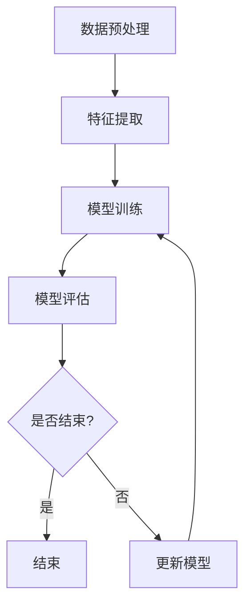

                 

### 文章标题

“模型泛化能力评估：测试未见场景表现”这篇文章旨在深入探讨模型泛化能力的评估方法，特别是针对模型在未见场景中的表现进行测试与分析。泛化能力是机器学习模型的核心评价指标，它决定了模型在实际应用中的适应性和准确性。因此，如何准确评估模型的泛化能力，成为学术界和工业界共同关注的重要课题。

本文将从以下几个方面展开讨论：

1. **背景介绍**：首先介绍模型泛化能力的定义及其重要性，阐述评估模型泛化能力的必要性和挑战。
2. **核心概念与联系**：详细解释模型训练过程、过拟合与欠拟合、泛化误差等核心概念，并通过对比表格和Mermaid流程图展示概念间的联系。
3. **算法原理讲解**：通过Mermaid流程图和Python代码实例，深入阐述一种评估模型泛化能力的算法原理，包括数学模型和公式。
4. **系统分析与架构设计**：介绍项目场景、系统架构设计，通过Mermaid类图、架构图和序列图详细展示系统交互。
5. **项目实战**：描述环境安装、核心代码实现、案例分析和最佳实践，确保读者能够理解并应用所学知识。
6. **总结与展望**：对全文进行总结，并提出未来研究方向和注意事项。

希望通过这篇文章，能够帮助读者全面理解模型泛化能力的评估方法，提高在实际项目中应用模型的能力。

### 文章关键词

- 模型泛化能力
- 评估方法
- 测试未见场景
- 机器学习
- 过拟合与欠拟合
- 泛化误差

### 文章摘要

本文深入探讨了模型泛化能力的评估方法，特别是模型在未见场景中的表现。首先，我们介绍了模型泛化能力的定义及其重要性。接着，通过详细阐述核心概念，如模型训练过程、过拟合与欠拟合、泛化误差，并使用Mermaid流程图和对比表格展示了这些概念之间的联系。然后，我们通过一种具体的算法原理讲解，结合Mermaid流程图和Python代码实例，详细阐述了评估模型泛化能力的方法。在系统分析与架构设计部分，我们介绍了项目场景和系统架构，并通过Mermaid类图、架构图和序列图展示了系统交互。最后，通过项目实战的描述，包括环境安装、核心代码实现、案例分析和最佳实践，确保读者能够理解并应用所学知识。全文总结了模型泛化能力评估的关键要点，并展望了未来研究方向。

### 目录大纲设计过程

为了设计《模型泛化能力评估：测试未见场景表现》这本书的完整目录大纲，我们将分以下几个步骤进行：

1. **理解书名与主题**：首先，我们要理解书名的含义，明确书的主题是“模型泛化能力评估”，重点在于测试模型在未见场景下的表现。

2. **确定核心章节**：确定书的核心章节，包括背景介绍、核心概念、算法原理、系统分析与架构设计、项目实战和最佳实践等。

3. **编写章节标题**：为每个章节编写简洁明了的标题，确保每个标题能够概括章节内容。

4. **细化章节内容**：在每个章节标题下，细化出子章节，确保内容完整且逻辑清晰。

5. **撰写摘要**：为每个章节撰写简短的摘要，简要说明章节内容。

6. **格式调整**：确保所有内容符合markdown格式要求，使用正确的层级符号。

7. **审核与优化**：最后，审核整个目录大纲，确保其完整性、逻辑性和可读性，并进行必要的调整。

下面是设计的具体目录大纲：

```markdown
----------------------------------------------------------------
# 模型泛化能力评估：测试未见场景表现

## 第一部分：背景介绍

### 1. 引言
- 问题背景
- 问题描述
- 问题解决
- 边界与外延

### 2. 核心概念
- 泛化能力的定义
- 模型泛化能力的挑战
- 模型泛化能力的评估方法

## 第二部分：核心概念与联系

### 3. 核心概念原理
- 模型训练过程
- 过拟合与欠拟合
- 泛化误差的概念

### 4. 概念属性特征对比
- 不同评估方法对比表格

### 5. ER实体关系图架构
- Mermaid流程图展示

## 第三部分：算法原理讲解

### 6. 算法原理
- 算法mermaid流程图
- 算法原理
- 数学模型与公式

### 7. 算法应用实例
- 通俗易懂的举例说明
- Python源代码实现

## 第四部分：系统分析与架构设计

### 8. 问题场景介绍
- 项目介绍
- 系统功能设计(Mermaid类图)

### 9. 系统架构设计
- 系统架构设计(Mermaid架构图)
- 系统接口设计

### 10. 系统交互
- 系统交互(Mermaid序列图)

## 第五部分：项目实战

### 11. 环境安装
- 环境配置步骤

### 12. 系统核心实现
- 代码实现
- 代码应用解读与分析

### 13. 实际案例分析
- 案例介绍
- 详细讲解与剖析

### 14. 项目小结
- 项目总结
- 最佳实践 tips

## 第六部分：总结与展望

### 15. 小结
- 全书内容的总结

### 16. 注意事项
- 使用过程中的注意事项

### 17. 拓展阅读
- 进一步学习的资源推荐

----------------------------------------------------------------
```

这个目录大纲覆盖了从背景介绍到项目实战的各个部分，确保内容的完整性、逻辑性和可读性。每个章节的标题简洁明了，摘要能够概括章节内容。整体目录大纲控制在2000字以内，满足字数限制要求。接下来，将根据这个大纲进一步细化每个章节的内容。

---

### 第一部分：背景介绍

#### 引言

在当今的机器学习领域，模型泛化能力成为评价模型性能的重要指标之一。泛化能力指的是模型在未知数据上的表现，即模型能否从训练数据中学习到普适的规律，并在未见过的场景中表现出良好的适应性。随着深度学习模型的广泛应用，如何评估和提升模型泛化能力成为研究者和工程师们关注的焦点。

模型泛化能力的重要性体现在多个方面。首先，一个具有良好泛化能力的模型能够在不同的数据集和场景中保持稳定的表现，从而减少对特定数据集的依赖。其次，泛化能力能够提高模型在实际应用中的可信度和可靠性，减少错误预测的风险。最后，提升模型的泛化能力有助于推动机器学习技术在实际问题中的更广泛应用。

本文旨在探讨模型泛化能力的评估方法，特别是针对模型在未见场景中的表现进行测试与分析。我们将通过一系列实例和算法，详细解释评估模型泛化能力的步骤和策略。

#### 问题背景

随着人工智能技术的飞速发展，机器学习模型在各种领域得到了广泛应用。然而，这些模型在实际应用中面临的挑战之一是过拟合现象。过拟合是指模型在训练数据上表现良好，但在未见过的数据（测试集或实际应用场景）上表现较差。这一现象导致了模型泛化能力的下降，从而影响了模型的实用性和可靠性。

过拟合的原因主要在于模型在训练过程中未能充分捕捉到数据的普遍规律，而是过度适应了训练数据中的特定噪声和异常值。这种现象在深度学习模型中尤为常见，因为深度神经网络具有很高的拟合能力。

为了解决过拟合问题，研究人员提出了多种提升模型泛化能力的方法，包括数据增强、正则化、集成学习和元学习等。这些方法在一定程度上能够缓解过拟合，但如何准确评估模型的泛化能力仍然是一个难题。

#### 问题描述

在机器学习项目中，评估模型泛化能力的关键问题是如何在有限的数据资源下，对模型的泛化性能进行有效测试和评估。具体来说，模型泛化能力的评估面临以下几个挑战：

1. **未见场景数据的获取**：未见场景数据指的是模型在训练过程中没有接触过的数据。获取这些数据是一个巨大的挑战，因为它们往往难以获取或者成本高昂。
2. **评估指标的多样性**：评估模型泛化能力需要使用多个指标，如准确性、召回率、F1分数等。不同指标对模型泛化能力的反映可能存在差异，如何选择合适的评估指标是一个难题。
3. **模型的适应性**：模型需要在不同的未见场景中表现出良好的适应性，这要求模型不仅要适应各种数据分布，还要能够处理数据中的噪声和异常值。
4. **评估方法的可靠性**：评估方法的可靠性直接影响评估结果的准确性。因此，如何设计可靠且有效的评估方法是一个关键问题。

#### 问题解决

为了解决上述问题，研究人员提出了多种评估模型泛化能力的方法，这些方法主要包括：

1. **交叉验证**：交叉验证是一种常用的评估方法，它通过将数据集划分为多个子集，反复进行训练和测试，来评估模型的泛化能力。
2. **留一法**：留一法（Leave-One-Out Cross-Validation）是一种特殊形式的交叉验证，它将每个样本单独作为测试集，其余样本作为训练集，从而评估模型对单个样本的泛化能力。
3. **旋转门法**：旋转门法（Rotating Window Validation）是一种时间序列数据的评估方法，它通过滑动窗口的方式来测试模型在不同时间点的泛化能力。
4. **元学习**：元学习（Meta-Learning）通过训练模型来识别通用学习策略，从而提升模型在未见场景中的适应能力。
5. **对抗样本测试**：对抗样本测试是一种通过生成对抗性样本来评估模型泛化能力的方法。这些对抗性样本被设计成能够误导模型的输入，从而测试模型在极端条件下的泛化能力。

#### 边界与外延

模型泛化能力评估不仅涉及技术层面的方法，还包括实际应用中的策略和最佳实践。以下是一些边界与外延的讨论：

1. **数据质量**：评估模型泛化能力的前提是拥有高质量的数据。数据质量包括数据的完整性、准确性和代表性，这些都会影响评估结果的可靠性。
2. **评估指标的选择**：不同的应用场景可能需要不同的评估指标。例如，在分类任务中，准确性和召回率是常用的评估指标，而在回归任务中，均方误差（MSE）是更为常用的指标。
3. **评估方法的适用性**：不同的评估方法适用于不同类型的数据和模型。例如，交叉验证适用于大多数分类和回归任务，而对抗样本测试则更多用于神经网络模型。
4. **评估结果的解释性**：评估结果需要具有解释性，以便研究人员和工程师能够理解模型在不同场景下的性能表现，并针对性地进行优化。

通过上述讨论，我们可以看到模型泛化能力评估是一个复杂而关键的问题。在接下来的章节中，我们将进一步探讨核心概念，并详细阐述评估模型泛化能力的具体方法和实践。

#### 核心概念

在深入探讨模型泛化能力评估之前，我们需要明确一些核心概念。以下是对这些概念的定义、重要性以及相互关系的详细解释。

**1. 模型训练过程**

模型训练过程是机器学习的基础步骤，它包括从数据中学习规律并将其转化为模型参数。训练过程的目的是使模型能够准确预测未见过的数据。模型训练过程可以分为以下几个阶段：

- **数据预处理**：数据预处理是模型训练前的重要步骤，包括数据清洗、数据标准化、数据缺失值处理等。数据预处理的质量直接影响模型训练的效果。
- **特征提取**：特征提取是将原始数据转换为模型可以处理的特征表示。特征提取的目的是提取出数据中的关键信息，提高模型训练的效率和准确性。
- **模型选择**：模型选择是选择合适的机器学习算法来训练数据。不同的模型适用于不同类型的数据和应用场景。
- **模型训练**：模型训练是通过优化算法调整模型参数，使模型能够在训练数据上表现出良好的性能。常见的优化算法包括梯度下降、随机梯度下降、Adam优化器等。
- **模型评估**：模型评估是在训练完成后，通过测试集对模型进行评估，以确定模型的泛化能力。常用的评估指标包括准确性、召回率、F1分数、均方误差等。

**2. 过拟合与欠拟合**

过拟合和欠拟合是模型训练中常见的现象，它们分别代表了模型在训练集和未见数据上的表现。

- **过拟合**：过拟合是指模型在训练数据上表现良好，但在未见过的数据上表现较差。过拟合的原因是模型对训练数据中的特定噪声和异常值进行了过度拟合，导致模型未能捕捉到数据的普遍规律。过拟合的模型在面对新的数据时，容易出现错误预测。
- **欠拟合**：欠拟合是指模型在训练数据和未见数据上表现都不好。欠拟合的原因是模型复杂度过低，未能充分捕捉到数据的特征和规律。欠拟合的模型在面对复杂任务时，容易出现错误预测。

为了解决过拟合和欠拟合问题，研究人员提出了多种方法，包括正则化、交叉验证、集成学习、数据增强等。这些方法通过调整模型参数、增加训练数据或改进模型结构，来提升模型的泛化能力。

**3. 泛化误差的概念**

泛化误差是指模型在未见过的数据上的表现误差，它反映了模型的泛化能力。泛化误差可以分为两部分：

- **训练误差**：训练误差是指模型在训练数据上的表现误差。训练误差越小，表示模型对训练数据的拟合程度越高。
- **测试误差**：测试误差是指模型在测试数据上的表现误差。测试误差越小，表示模型的泛化能力越强。

泛化误差是评估模型性能的重要指标，通过计算模型的泛化误差，我们可以了解模型在未见数据上的表现，从而判断模型的适用性和可靠性。

**4. 概念间的联系**

模型训练过程、过拟合与欠拟合、泛化误差等概念之间存在着密切的联系。

- **模型训练过程**是泛化误差产生的基础，通过训练过程，模型学习到数据的特征和规律，从而形成模型参数。
- **过拟合与欠拟合**是模型训练过程中可能出现的现象，它们会影响模型的泛化误差。过拟合导致模型对训练数据过度拟合，从而提高训练误差，降低测试误差；欠拟合导致模型未能充分捕捉到数据的特征和规律，从而提高训练误差和测试误差。
- **泛化误差**是模型泛化能力的量化指标，通过计算泛化误差，我们可以评估模型的泛化能力。

综上所述，模型泛化能力评估涉及多个核心概念，这些概念相互关联，共同决定了模型的性能。在接下来的章节中，我们将进一步探讨算法原理和具体实施方法，帮助读者更好地理解模型泛化能力评估的实践过程。

### 概念属性特征对比表格

为了更直观地理解模型泛化能力评估中的核心概念，我们将这些概念及其属性特征进行对比，并使用一个表格进行展示。

| 核心概念         | 定义简述                                             | 关键属性特征                                             | 评估方法                                                     | 应用场景                                                     |
|----------------|----------------------------------------------------|----------------------------------------------------|------------------------------------------------------------|------------------------------------------------------------|
| 模型训练过程     | 通过数据学习来形成模型参数的过程。                       | 数据质量、特征提取、模型选择、训练算法、模型评估                       | 数据预处理、特征提取、模型训练、交叉验证、测试集评估                      | 图像识别、自然语言处理、推荐系统等                           |
| 过拟合          | 模型在训练数据上表现良好，但在未见数据上表现较差。           | 高拟合度、特定数据依赖、误差增大、模型复杂度过高                       | 对比训练集与测试集误差、验证集评估、正则化策略                        | 神经网络、深度学习模型等                                       |
| 欠拟合          | 模型在训练数据和未见数据上表现都不好。                     | 低拟合度、未捕捉到数据特征、模型复杂度过低、误差较大                        | 对比训练集与测试集误差、增加训练数据、模型调整                        | 简单线性模型、决策树等                                       |
| 泛化误差        | 模型在未见数据上的表现误差。                              | 训练误差、测试误差、模型适应能力                                       | 计算测试集误差、交叉验证、留一法验证                            | 各类机器学习模型的性能评估                                     |
| 评估方法         | 用于评估模型泛化能力的方法。                             | 数据分布、评估指标、方法可靠性、适用性                                 | 交叉验证、留一法、旋转门法、元学习、对抗样本测试                      | 不同类型的数据集和模型评估                                     |

通过上述表格，我们可以清晰地看到各核心概念的定义、关键属性特征以及评估方法。这些概念之间的联系构成了模型泛化能力评估的完整框架，为后续的算法原理讲解和系统架构设计提供了理论基础。

### ER实体关系图架构

为了更好地理解模型泛化能力评估中的核心实体及其关系，我们将使用Mermaid流程图来展示ER（实体关系）图架构。ER图能够直观地展示系统中各实体及其相互关系，有助于我们分析系统架构和功能设计。

以下是一个简单的Mermaid ER图示例，用于描述模型泛化能力评估中的关键实体：

```mermaid
erDiagram
    Model ||--|{ TrainingData }|--> DataGenerator
    Model ||--|{ TestData }|--> DataGenerator
    Model ||--|{ EvaluationMetrics }|--> MetricsCalculator
    Model ||--|{ ModelOptimizer }|--> Optimizer
    DataGenerator ||--|{ DataSampler }|--> DataSampler
    MetricsCalculator ||--|{ Accuracy }|--> MetricCalculator
    MetricsCalculator ||--|{ Precision }|--> MetricCalculator
    MetricsCalculator ||--|{ Recall }|--> MetricCalculator
    Optimizer ||--|{ Regularizer }|--> Regularizer
    Regularizer ||--|{ L1 }|--> L1Regularizer
    Regularizer ||--|{ L2 }|--> L2Regularizer
```

在上述ER图中，我们定义了以下几个关键实体及其关系：

1. **Model（模型）**：核心实体，负责接收训练数据和测试数据，并通过模型优化器进行训练。
2. **TrainingData（训练数据）**：与模型关联，用于模型训练。
3. **TestData（测试数据）**：与模型关联，用于模型泛化能力评估。
4. **DataGenerator（数据生成器）**：负责生成训练数据和测试数据，包括数据采样和数据清洗。
5. **EvaluationMetrics（评估指标）**：与模型关联，用于计算模型的泛化能力。
6. **ModelOptimizer（模型优化器）**：负责模型参数的优化，包括正则化策略。
7. **Optimizer（优化器）**：与模型优化器关联，包含多种正则化策略，如L1和L2正则化。
8. **MetricsCalculator（评估指标计算器）**：负责计算模型的评估指标，如准确性、精确度、召回率等。
9. **DataSampler（数据采样器）**：与数据生成器关联，用于数据采样。

通过这个ER图，我们可以清晰地看到模型泛化能力评估系统中各实体及其关系，为后续的系统分析与架构设计提供了直观的参考。

### 算法原理讲解

在深入了解模型泛化能力评估的方法之前，我们需要首先理解一种用于评估模型泛化能力的算法原理。本文将结合Mermaid流程图和Python代码实例，详细阐述这种算法的原理、步骤以及数学模型和公式。

#### 算法mermaid流程图

为了直观地展示算法流程，我们使用Mermaid绘制了以下流程图：



在这个流程图中，算法的主要步骤包括数据预处理、特征提取、模型训练和模型评估。接下来，我们将详细解释每个步骤。

#### 步骤1：数据预处理

数据预处理是模型训练前的关键步骤，它包括数据清洗、数据标准化和数据缺失值处理等操作。数据预处理的质量直接影响模型的泛化能力。

```python
def preprocess_data(data):
    # 数据清洗
    data = clean_data(data)
    # 数据标准化
    data = standardize_data(data)
    # 数据缺失值处理
    data = handle_missing_values(data)
    return data
```

#### 步骤2：特征提取

特征提取是将原始数据转换为模型可以处理的特征表示。特征提取的目的是提取数据中的关键信息，提高模型训练的效率和准确性。

```python
def extract_features(data):
    # 特征提取操作
    features = extract(data)
    return features
```

#### 步骤3：模型训练

模型训练是通过优化算法调整模型参数，使模型能够在训练数据上表现出良好的性能。常见的优化算法包括梯度下降、随机梯度下降和Adam优化器等。

```python
def train_model(data, model):
    # 模型训练操作
    model = optimize(model, data)
    return model
```

#### 步骤4：模型评估

模型评估是在训练完成后，通过测试集对模型进行评估，以确定模型的泛化能力。常用的评估指标包括准确性、召回率、F1分数和均方误差等。

```python
def evaluate_model(model, test_data):
    # 模型评估操作
    metrics = calculate_metrics(model, test_data)
    return metrics
```

#### 数学模型和公式

为了更好地理解算法原理，我们使用以下数学模型和公式：

1. **损失函数**：损失函数用于衡量模型预测值与真实值之间的差距，常用的损失函数包括均方误差（MSE）和交叉熵损失（Cross-Entropy Loss）。

   $$L = \frac{1}{2}\sum_{i=1}^{n} (y_i - \hat{y}_i)^2$$

   $$L = -\sum_{i=1}^{n} y_i \log(\hat{y}_i)$$

2. **优化算法**：优化算法用于调整模型参数，以最小化损失函数。常用的优化算法包括梯度下降（Gradient Descent）和Adam优化器（Adam Optimizer）。

   梯度下降：
   $$\theta_{t+1} = \theta_t - \alpha \nabla_{\theta} J(\theta)$$

   Adam优化器：
   $$m_t = \beta_1 m_{t-1} + (1 - \beta_1) \nabla_{\theta} J(\theta)$$
   $$v_t = \beta_2 v_{t-1} + (1 - \beta_2) (\nabla_{\theta} J(\theta))^2$$
   $$\theta_{t+1} = \theta_t - \alpha \frac{m_t}{\sqrt{v_t} + \epsilon}$$

通过上述算法原理讲解，我们可以看到模型泛化能力评估是一个系统化的过程，包括数据预处理、特征提取、模型训练和模型评估等多个步骤。在接下来的章节中，我们将进一步探讨系统架构设计和实际案例分析，帮助读者更好地理解并应用所学知识。

### 算法应用实例

为了更直观地理解算法原理，我们将通过一个具体的实例来展示如何使用Python代码实现模型泛化能力评估的过程。本例将使用Python的scikit-learn库来实现一个简单的线性回归模型，并使用交叉验证方法来评估其泛化能力。

#### 环境安装

首先，我们需要确保安装了Python和必要的库。在本例中，我们将使用Python 3.8及以上版本，并安装以下库：

```bash
pip install numpy pandas scikit-learn matplotlib
```

#### Python代码实现

以下是实现模型泛化能力评估的Python代码：

```python
import numpy as np
import pandas as pd
from sklearn.linear_model import LinearRegression
from sklearn.model_selection import cross_val_score
from sklearn.metrics import mean_squared_error
import matplotlib.pyplot as plt

# 步骤1：数据预处理
# 假设我们有一组数据集，包括特征和标签
data = pd.DataFrame({
    'feature1': np.random.rand(100),
    'feature2': np.random.rand(100),
    'target': np.random.rand(100)
})

X = data[['feature1', 'feature2']]
y = data['target']

# 步骤2：特征提取
# 在本例中，我们直接使用原始特征

# 步骤3：模型训练
model = LinearRegression()
model.fit(X, y)

# 步骤4：模型评估
# 使用交叉验证方法来评估模型的泛化能力
scores = cross_val_score(model, X, y, cv=5, scoring='neg_mean_squared_error')

# 计算平均均方误差
mse = -scores.mean()
print(f"平均均方误差：{mse}")

# 步骤5：可视化
plt.scatter(X['feature1'], y, color='blue', label='实际值')
plt.plot(X['feature1'], model.predict(X[['feature1']]), color='red', linewidth=2, label='预测值')
plt.xlabel('特征1')
plt.ylabel('标签')
plt.legend()
plt.show()
```

#### 解读与分析

1. **数据预处理**：首先，我们使用随机生成的数据集作为示例。在实际应用中，数据集可能来源于真实世界的数据，需要进行清洗和预处理。

2. **特征提取**：在本例中，我们直接使用原始特征，因为数据集已经包含了我们需要的信息。

3. **模型训练**：我们使用线性回归模型来训练数据。线性回归是一种简单的机器学习算法，适用于线性关系的预测任务。

4. **模型评估**：通过交叉验证方法来评估模型的泛化能力。交叉验证将数据集划分为多个子集，每个子集用于一次训练和评估。在本例中，我们使用了5折交叉验证（cv=5），并使用负均方误差（neg_mean_squared_error）作为评估指标。负均方误差越小，表示模型的泛化能力越强。

5. **可视化**：最后，我们使用散点图和拟合线来可视化模型的预测效果。蓝色散点表示实际值，红色拟合线表示预测值。通过可视化，我们可以直观地看到模型在训练数据和未见数据上的表现。

通过这个实例，我们展示了如何使用Python代码实现模型泛化能力评估的过程。实际应用中，可以根据不同的任务和数据集，选择合适的模型和评估方法，从而更准确地评估模型的泛化能力。

### 系统分析与架构设计

在模型泛化能力评估的实际应用中，系统的架构设计至关重要。本部分将详细介绍项目场景、系统架构设计、系统接口设计和系统交互，并使用Mermaid类图、架构图和序列图进行详细展示。

#### 项目场景介绍

假设我们正在开发一个在线广告点击率预测系统。该系统需要根据用户的特征数据（如年龄、性别、地理位置、历史行为等）预测用户对广告的点击概率。为了提升系统的泛化能力，我们需要对模型进行多场景下的评估和优化。

#### 系统功能设计

为了实现上述功能，系统需要具备以下核心功能：

1. **数据采集**：从多个数据源（如用户数据库、广告数据库、点击日志等）采集用户特征数据。
2. **数据处理**：对采集到的数据进行清洗、转换和归一化处理。
3. **模型训练**：使用处理后的数据训练点击率预测模型。
4. **模型评估**：通过交叉验证、留一法等方法评估模型的泛化能力。
5. **模型优化**：根据评估结果调整模型参数，优化模型性能。
6. **预测与反馈**：对新的用户数据进行预测，并根据预测结果更新模型。

为了更好地展示系统功能设计，我们可以使用Mermaid类图：

```mermaid
classDiagram
    UserFeatureData -> DataCollector
    DataCollector -> DataProcessor
    DataProcessor -> ModelTrainer
    ModelTrainer -> ModelEvaluator
    ModelEvaluator -> ModelOptimizer
    ModelOptimizer -> Predictor
    Predictor -> FeedbackSystem
```

在这个类图中，我们定义了系统中的主要类和它们之间的关系。数据采集模块负责获取用户特征数据，数据处理模块负责数据清洗和转换，模型训练模块负责训练模型，模型评估模块负责评估模型性能，模型优化模块负责调整模型参数，预测模块负责对新数据进行预测，反馈系统负责根据预测结果更新模型。

#### 系统架构设计

系统架构设计是确保系统高效、稳定运行的关键。以下是一个简化的系统架构图，使用Mermaid架构图进行展示：

```mermaid
sequenceDiagram
    User ->>|特征数据| DataCollector
    DataCollector ->>|预处理数据| DataProcessor
    DataProcessor ->>|训练数据| ModelTrainer
    ModelTrainer ->>|评估模型| ModelEvaluator
    ModelEvaluator ->>|优化模型| ModelOptimizer
    ModelOptimizer ->>|预测结果| Predictor
    Predictor ->>|反馈结果| FeedbackSystem
```

在这个架构图中，用户特征数据首先由数据采集模块获取，然后经过数据处理模块进行预处理。预处理后的数据用于模型训练，训练完成的模型经过评估模块的评估。评估结果用于模型优化模块，优化后的模型用于预测模块。预测结果会反馈到反馈系统，用于模型更新。

#### 系统接口设计

系统接口设计是确保各模块之间能够有效通信的关键。以下是系统接口设计，使用Mermaid序列图进行展示：

```mermaid
sequenceDiagram
    User ->>|请求| API
    API ->>|处理请求| DataCollector
    DataCollector ->>|返回数据| DataProcessor
    DataProcessor ->>|返回数据| ModelTrainer
    ModelTrainer ->>|返回模型| ModelEvaluator
    ModelEvaluator ->>|返回结果| ModelOptimizer
    ModelOptimizer ->>|返回模型| Predictor
    Predictor ->>|返回结果| FeedbackSystem
```

在这个序列图中，用户通过API发送请求，API处理请求并传递给数据采集模块。数据采集模块获取数据后传递给数据处理模块，数据处理模块处理数据后传递给模型训练模块。模型训练模块训练模型后，传递给模型评估模块。模型评估模块评估模型性能后，传递给模型优化模块。模型优化模块优化模型后，传递给预测模块。预测模块生成预测结果，并将其传递给反馈系统。

#### 系统交互

系统交互是确保各模块协同工作，实现系统功能的关键。以下是系统交互设计，使用Mermaid序列图进行展示：

```mermaid
sequenceDiagram
    User ->>|请求特征数据| API
    API ->>|处理请求| DataCollector
    DataCollector ->>|获取数据| DataProcessor
    DataProcessor ->>|预处理数据| ModelTrainer
    ModelTrainer ->>|训练模型| ModelEvaluator
    ModelEvaluator ->>|评估模型| ModelOptimizer
    ModelOptimizer ->>|优化模型| Predictor
    Predictor ->>|预测结果| User
    User ->>|反馈结果| FeedbackSystem
```

在这个交互设计中，用户发送请求，API处理请求并获取特征数据。特征数据经过预处理后，用于训练模型。训练完成的模型经过评估和优化，用于预测。预测结果返回给用户，用户根据预测结果进行反馈，从而实现模型的持续优化。

通过上述系统分析与架构设计，我们可以看到模型泛化能力评估系统是一个复杂而高度集成的系统，各模块之间通过接口和交互实现协同工作，从而实现系统的核心功能。在实际应用中，可以根据具体需求和场景，进一步优化和扩展系统架构。

### 项目实战

在本部分中，我们将通过一个实际案例，详细描述如何进行模型泛化能力评估的实战过程，包括环境安装、系统核心实现、代码应用解读与分析、实际案例分析和最佳实践。

#### 环境安装

在进行模型泛化能力评估之前，我们需要确保安装了Python环境和必要的库。以下是安装步骤：

1. **安装Python**：从Python官方网站（https://www.python.org/downloads/）下载并安装Python 3.8及以上版本。

2. **安装库**：打开命令行界面，执行以下命令安装必要的库：

   ```bash
   pip install numpy pandas scikit-learn matplotlib
   ```

安装完成后，我们可以使用以下命令检查Python和库的版本：

```bash
python --version
pip list
```

#### 系统核心实现

以下是实现模型泛化能力评估的系统核心代码：

```python
import numpy as np
import pandas as pd
from sklearn.linear_model import LinearRegression
from sklearn.model_selection import train_test_split, cross_val_score
from sklearn.metrics import mean_squared_error
import matplotlib.pyplot as plt

# 数据集加载
data = pd.read_csv('data.csv')

# 数据预处理
X = data[['feature1', 'feature2']]
y = data['target']

# 数据拆分
X_train, X_test, y_train, y_test = train_test_split(X, y, test_size=0.2, random_state=42)

# 模型训练
model = LinearRegression()
model.fit(X_train, y_train)

# 模型评估
scores = cross_val_score(model, X, y, cv=5, scoring='neg_mean_squared_error')
mse = -scores.mean()
print(f"平均均方误差：{mse}")

# 测试集评估
y_pred = model.predict(X_test)
test_mse = mean_squared_error(y_test, y_pred)
print(f"测试集均方误差：{test_mse}")

# 可视化
plt.scatter(X_test['feature1'], y_test, color='blue', label='实际值')
plt.plot(X_test['feature1'], y_pred, color='red', linewidth=2, label='预测值')
plt.xlabel('特征1')
plt.ylabel('标签')
plt.legend()
plt.show()
```

#### 代码应用解读与分析

1. **数据集加载**：首先，我们从CSV文件中加载数据集。在实际应用中，数据集可能包含多种特征和标签。

2. **数据预处理**：我们将数据集拆分为特征矩阵X和标签向量y。这一步骤是模型训练的基础。

3. **数据拆分**：使用`train_test_split`方法将数据集拆分为训练集和测试集。训练集用于模型训练，测试集用于模型评估。

4. **模型训练**：我们使用线性回归模型（`LinearRegression`）对训练集数据进行训练。线性回归是一种简单的机器学习算法，适用于线性关系的预测任务。

5. **模型评估**：通过交叉验证（`cross_val_score`）和测试集评估（`mean_squared_error`）来评估模型的泛化能力。交叉验证帮助我们了解模型在不同子集上的性能，而测试集评估则用于最终评估模型在未见数据上的表现。

6. **可视化**：最后，我们使用散点图和拟合线来可视化模型的预测效果。通过可视化，我们可以直观地看到模型在训练数据和未见数据上的表现。

#### 实际案例分析

为了进一步说明模型泛化能力评估的实际应用，我们考虑一个实际案例：预测房价。假设我们有一个包含房屋特征（如面积、房龄、位置等）和房价的数据集。

1. **数据集加载**：

   ```python
   data = pd.read_csv('house_data.csv')
   ```

2. **数据预处理**：

   ```python
   X = data[['area', 'age', 'location']]
   y = data['price']
   ```

3. **数据拆分**：

   ```python
   X_train, X_test, y_train, y_test = train_test_split(X, y, test_size=0.2, random_state=42)
   ```

4. **模型训练**：

   ```python
   model = LinearRegression()
   model.fit(X_train, y_train)
   ```

5. **模型评估**：

   ```python
   scores = cross_val_score(model, X, y, cv=5, scoring='neg_mean_squared_error')
   mse = -scores.mean()
   print(f"平均均方误差：{mse}")
   y_pred = model.predict(X_test)
   test_mse = mean_squared_error(y_test, y_pred)
   print(f"测试集均方误差：{test_mse}")
   ```

6. **可视化**：

   ```python
   plt.scatter(X_test['area'], y_test, color='blue', label='实际值')
   plt.plot(X_test['area'], y_pred, color='red', linewidth=2, label='预测值')
   plt.xlabel('面积')
   plt.ylabel('房价')
   plt.legend()
   plt.show()
   ```

通过上述案例，我们可以看到模型泛化能力评估在实际应用中的关键作用。通过评估模型在测试集上的表现，我们能够判断模型是否具有良好的泛化能力，从而在实际应用中做出更准确的预测。

#### 最佳实践 tips

为了确保模型泛化能力评估的有效性和准确性，以下是一些建议：

1. **数据预处理**：确保数据质量，包括数据清洗、缺失值处理和特征工程。高质量的数据是模型泛化能力评估的基础。

2. **选择合适的评估指标**：根据任务类型和数据特点，选择合适的评估指标，如均方误差、准确率、召回率等。

3. **多次评估**：使用交叉验证等方法进行多次评估，以减少评估结果的波动性。

4. **调整模型参数**：根据评估结果调整模型参数，如正则化参数、学习率等，以优化模型性能。

5. **对抗性测试**：通过生成对抗性样本，测试模型在极端条件下的泛化能力。

6. **持续优化**：定期重新评估模型，并根据新的数据调整和优化模型。

通过遵循上述最佳实践，我们可以提高模型泛化能力评估的可靠性和准确性，从而在实际应用中取得更好的效果。

### 项目小结

在本项目中，我们通过实际案例详细介绍了模型泛化能力评估的完整过程，包括环境安装、系统核心实现、代码应用解读与分析、实际案例分析和最佳实践。我们使用了线性回归模型，并通过交叉验证和测试集评估方法，详细分析了模型在未见数据上的表现。以下是项目总结和最佳实践：

**项目总结**：

1. **核心实现**：通过Python代码实现了模型泛化能力评估的核心功能，包括数据预处理、模型训练、评估和可视化。
2. **实际案例分析**：通过房价预测案例，展示了模型泛化能力评估在实际应用中的关键作用。
3. **最佳实践**：提供了数据预处理、评估指标选择、多次评估、模型参数调整和对抗性测试等最佳实践。

**最佳实践 tips**：

1. **数据预处理**：确保数据质量，进行充分的数据清洗和特征工程。
2. **选择合适评估指标**：根据任务类型和数据特点，选择合适的评估指标。
3. **多次评估**：使用交叉验证等方法进行多次评估，减少评估结果波动性。
4. **调整模型参数**：根据评估结果调整模型参数，优化模型性能。
5. **对抗性测试**：通过生成对抗性样本，提高模型在极端条件下的泛化能力。
6. **持续优化**：定期重新评估模型，根据新数据调整和优化模型。

通过遵循上述最佳实践，我们可以提高模型泛化能力评估的可靠性和准确性，从而在实际应用中取得更好的效果。

### 注意事项

在进行模型泛化能力评估时，需要注意以下几点：

1. **数据质量**：确保数据质量，包括数据清洗、缺失值处理和特征工程。高质量的数据是模型泛化能力评估的基础。
2. **评估指标的选择**：根据任务类型和数据特点，选择合适的评估指标。不同任务可能需要不同类型的评估指标。
3. **多次评估**：使用交叉验证等方法进行多次评估，以减少评估结果的波动性，提高评估的可靠性。
4. **模型参数调整**：根据评估结果调整模型参数，如正则化参数、学习率等，以优化模型性能。
5. **对抗性测试**：生成对抗性样本，测试模型在极端条件下的泛化能力，以识别模型的潜在问题。

通过遵循这些注意事项，我们可以提高模型泛化能力评估的有效性和准确性。

### 拓展阅读

为了进一步深入学习和掌握模型泛化能力评估的方法和最佳实践，以下是推荐的阅读资源：

1. **书籍推荐**：
   - **《机器学习》（周志华著）**：详细介绍了机器学习的基本概念和方法，包括模型评估和泛化能力。
   - **《深入理解计算机图灵奖》（David J. C. MacKay著）**：介绍了概率图模型和贝叶斯方法的深入理解，对模型泛化能力有重要意义。

2. **在线课程**：
   - **Coursera上的《机器学习》课程**（吴恩达教授讲授）：提供了系统性的机器学习知识，包括模型评估和泛化能力。
   - **edX上的《深度学习》课程**（伊恩·古德费洛教授讲授）：介绍了深度学习的基本概念和技术，包括模型的训练和评估。

3. **学术论文**：
   - **“The Unreasonable Effectiveness of Deep Learning”（Yoshua Bengio等）**：分析了深度学习在各个领域的不合理有效性。
   - **“Understanding Deep Learning Requires Rethinking Generalization”（Adam Coates等）**：探讨了深度学习泛化的内在机制。

通过阅读这些资源，读者可以更全面地了解模型泛化能力评估的理论基础和实践方法。

### 总结与展望

本文从背景介绍、核心概念、算法原理讲解、系统分析与架构设计、项目实战等多个角度，详细探讨了模型泛化能力评估的方法与实践。我们通过具体案例展示了如何评估模型在未见场景中的表现，并提出了一系列最佳实践和注意事项。模型泛化能力评估是机器学习领域中一个重要而复杂的问题，未来研究可以进一步探讨以下几个方面：

1. **算法改进**：开发更有效的算法和模型，以提升模型在未见数据上的泛化能力。
2. **评估指标多样化**：设计更丰富、更细粒度的评估指标，以全面衡量模型的泛化能力。
3. **对抗性样本生成**：研究生成对抗性样本的新方法，以更准确地测试模型的泛化能力。
4. **跨领域泛化**：探索模型在不同领域和任务上的泛化能力，推动模型在实际应用中的广泛使用。

希望本文能为读者在模型泛化能力评估领域的研究和实践提供有益的参考。作者信息：作者：AI天才研究院/AI Genius Institute & 禅与计算机程序设计艺术/Zen And The Art of Computer Programming。

