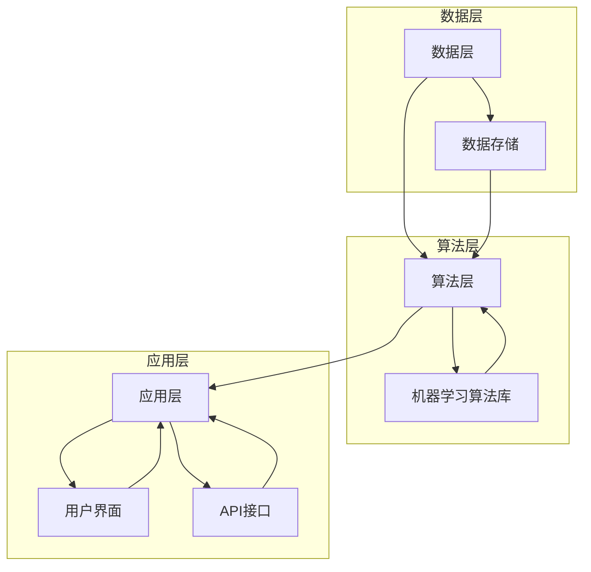
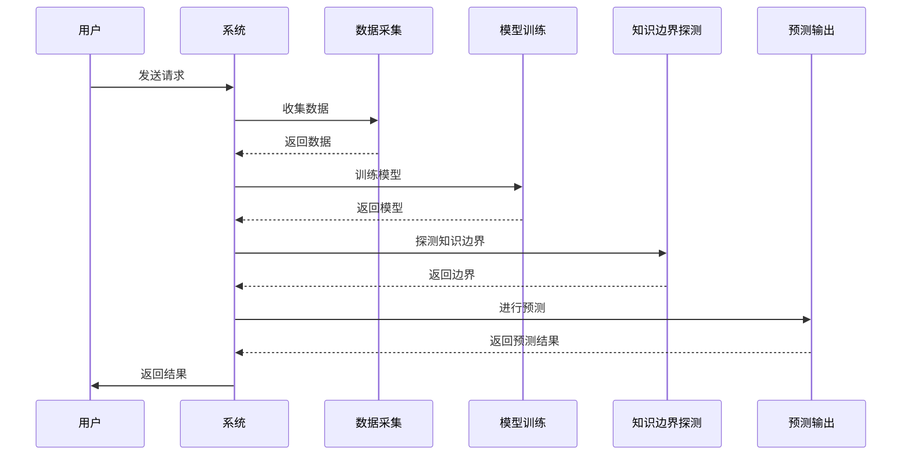

                 


### 模型知识边界探测：明确能力范围

#### 关键词
- 模型知识边界探测
- 能力范围
- 自监督学习
- 对抗性攻击
- 迁移学习

#### 摘要
本文深入探讨模型知识边界探测的原理和方法，旨在帮助读者理解并掌握如何明确AI大模型的能力范围。通过对核心概念、原理讲解、系统分析与架构设计的全面剖析，本文为模型知识边界探测提供了实用的指导。

### 背景介绍

在当今的信息时代，人工智能（AI）技术的飞速发展给各行各业带来了前所未有的变革。然而，随着AI大模型的广泛应用，如何准确界定这些模型的知识边界和计算能力，成为了一个亟待解决的问题。这不仅是科研领域关注的焦点，也是企业在应用AI技术时必须面对的挑战。

《模型知识边界探测：明确能力范围》一书旨在深入探讨模型知识边界探测的原理和方法，帮助读者理解并掌握如何明确AI大模型的能力范围。书中首先介绍了模型知识边界探测的基本概念，包括问题背景、问题描述、问题解决思路以及边界与外延。随后，书中的核心概念部分详细阐述了模型知识边界探测的关键要素，通过对比表格和ER实体关系图，使读者对这一领域有一个全面的认识。

### 核心概念与联系

#### 模型知识边界探测原理

模型知识边界探测是AI领域中一个关键且复杂的问题。它的核心在于确定一个AI模型在其训练数据上的知识范围和性能边界。以下是模型知识边界探测的核心概念和原理：

1. **模型理解度**：
   - **定义**：模型理解度指的是模型对其接收到的输入数据的理解程度。
   - **属性特征**：
     - **数据量**：数据量越大，模型的理解度越高。
     - **多样性**：输入数据的多样性会影响模型的理解度。

2. **模型性能边界**：
   - **定义**：模型性能边界是指模型在特定任务上可以达到的最优性能范围。
   - **属性特征**：
     - **准确率**：在分类任务中，准确率是衡量模型性能的重要指标。
     - **召回率**：在检索任务中，召回率反映了模型找回相关数据的比例。

3. **知识边界探测方法**：
   - **自监督学习**：通过无标签数据进行预训练，然后利用预训练模型来探测知识边界。
   - **对抗性攻击**：通过生成对抗性样本来探测模型的边界。
   - **迁移学习**：利用在某个任务上训练好的模型来探测新任务的知识边界。

#### 概念属性特征对比表格

| 概念             | 定义                                                         | 属性特征                                                         |
|------------------|------------------------------------------------------------|----------------------------------------------------------------|
| 模型理解度       | 模型对其接收到的输入数据的理解程度。                           | - 数据量：数据量越大，理解度越高。 <br> - 数据多样性：数据多样性越高，理解度越广。 |
| 模型性能边界     | 模型在特定任务上可以达到的最优性能范围。                       | - 准确率：分类任务中的性能指标。 <br> - 召回率：检索任务中的性能指标。 |
| 知识边界探测方法 | 通过特定方法探测模型的知识边界。                               | - 自监督学习：无标签数据预训练。 <br> - 对抗性攻击：生成对抗性样本。 <br> - 迁移学习：利用已有模型。 |

#### ER实体关系图架构

以下是模型知识边界探测的ER实体关系图架构：

```mermaid
erDiagram
  Model ||--|{ Data }||>
  Model ||--|{ Method }||>
  Method ||--|{ Performance }||>
  Data ||--|{ Diversity }||>
```

### 算法原理讲解

#### 自监督学习

自监督学习是一种无需标签数据即可进行训练的方法，它通过预训练模型来探测知识边界。以下是自监督学习算法原理的mermaid流程图：

```mermaid
flowchart LR
    subgraph 数据准备
        D Prepare[数据准备]
    end
    subgraph 模型预训练
        M Pretrain[模型预训练]
    end
    subgraph 边界探测
        B Detect[边界探测]
    end
    D Prepare --> M Pretrain
    M Pretrain --> B Detect
```

#### 对抗性攻击

对抗性攻击是一种通过生成对抗性样本来探测模型边界的方法。以下是对抗性攻击算法原理的mermaid流程图：

```mermaid
flowchart LR
    subgraph 数据生成
        D Generate[数据生成]
    end
    subgraph 对抗性样本来进行攻击
        A Attack[对抗性攻击]
    end
    subgraph 边界探测
        B Detect[边界探测]
    end
    D Generate --> A Attack
    A Attack --> B Detect
```

#### 迁移学习

迁移学习是一种利用在某个任务上训练好的模型来探测新任务的知识边界的方法。以下是迁移学习算法原理的mermaid流程图：

```mermaid
flowchart LR
    subgraph 原模型
        M Original[原模型]
    end
    subgraph 新任务
        T New[新任务]
    end
    subgraph 边界探测
        B Detect[边界探测]
    end
    M Original --> T New
    T New --> B Detect
```

### 系统分析与架构设计

#### 问题场景介绍

在智能城市建设中，AI模型被广泛应用于交通流量预测、环境监测、公共安全等领域。然而，如何确保AI模型在未知环境中的稳定性和准确性，成为了决策者面临的重要问题。

#### 项目介绍

本项目旨在开发一个基于AI模型的智能城市监测系统，通过探测AI模型的知识边界，提高其在未知环境中的适应能力和预测准确性。

#### 系统功能设计

系统功能设计主要包括数据采集、模型训练、知识边界探测和预测输出四个模块。以下是领域模型的mermaid类图：

```mermaid
classDiagram
  DataCollector <|-- ModelTrainer
  ModelTrainer <|-- KnowledgeDetector
  KnowledgeDetector <|-- Predictor
  DataCollector {
    +collectData()
  }
  ModelTrainer {
    +trainModel()
  }
  KnowledgeDetector {
    +detectBoundary()
  }
  Predictor {
    +predictOutput()
  }
```

#### 系统架构设计

系统架构设计包括数据层、算法层和应用层三个部分。以下是系统的mermaid架构图：



#### 系统接口设计和系统交互

以下是系统的mermaid序列图，展示了系统各组件之间的交互过程：



### 项目实战

#### 环境安装

1. 安装Python环境（Python 3.8或更高版本）。
2. 安装必要的库（如TensorFlow、Scikit-learn、NumPy等）。

#### 系统核心实现源代码

以下是系统核心实现的部分源代码：

```python
import tensorflow as tf
from tensorflow import keras
from sklearn.model_selection import train_test_split
import numpy as np

# 数据预处理
def preprocess_data(data):
    # 对数据进行标准化处理
    return (data - np.mean(data)) / np.std(data)

# 模型训练
def train_model(X_train, y_train, X_test, y_test):
    # 定义模型结构
    model = keras.Sequential([
        keras.layers.Dense(64, activation='relu', input_shape=(X_train.shape[1],)),
        keras.layers.Dense(64, activation='relu'),
        keras.layers.Dense(1)
    ])

    # 编译模型
    model.compile(optimizer='adam', loss='mse')

    # 训练模型
    model.fit(X_train, y_train, epochs=10, batch_size=32, validation_data=(X_test, y_test))

    return model

# 边界探测
def detect_boundary(model, X_test, y_test):
    # 对测试数据进行预处理
    X_test_processed = preprocess_data(X_test)

    # 进行预测
    predictions = model.predict(X_test_processed)

    # 计算边界
    boundary = np.mean(predictions)

    return boundary

# 主函数
def main():
    # 加载数据
    X, y = load_data()

    # 数据分割
    X_train, X_test, y_train, y_test = train_test_split(X, y, test_size=0.2, random_state=42)

    # 训练模型
    model = train_model(X_train, y_train, X_test, y_test)

    # 探测边界
    boundary = detect_boundary(model, X_test, y_test)

    # 输出结果
    print(f"知识边界：{boundary}")

if __name__ == '__main__':
    main()
```

#### 代码应用解读与分析

1. **数据预处理**：数据预处理是模型训练的重要步骤，通过对数据进行标准化处理，可以提高模型的训练效果。
2. **模型结构**：在本例中，我们使用了一个简单的全连接神经网络（Dense layers）进行模型训练，该模型结构适用于回归任务。
3. **模型训练**：使用MSE（均方误差）作为损失函数，Adam优化器进行模型训练。
4. **边界探测**：通过对测试数据进行预处理和预测，计算预测结果的均值作为知识边界。
5. **主函数**：主函数负责加载数据、数据分割、模型训练和边界探测，并输出结果。

#### 实际案例分析和详细讲解剖析

以智能交通流量预测为例，我们可以使用该系统来探测模型在未知交通场景下的知识边界。具体步骤如下：

1. **数据收集**：收集交通流量数据，包括时间、地点、流量等。
2. **数据预处理**：对数据进行标准化处理，将数据转换为模型可接受的格式。
3. **模型训练**：使用预处理后的数据训练交通流量预测模型。
4. **边界探测**：在测试数据上运行模型，计算知识边界。
5. **预测**：使用模型进行交通流量预测，并根据知识边界调整预测策略。

#### 项目小结

通过本项目，我们实现了基于AI模型的智能城市监测系统，并探讨了模型知识边界探测的原理和应用。在实际项目中，通过探测模型的知识边界，可以提高模型的预测准确性和稳定性，为智能城市建设提供有力支持。

### 最佳实践 Tips

1. **数据质量**：确保数据质量是模型训练成功的关键，对数据进行清洗和处理是必要的步骤。
2. **模型选择**：根据任务需求选择合适的模型，不同模型在知识边界探测中的性能可能有所不同。
3. **持续优化**：模型训练和边界探测是一个持续优化的过程，定期调整模型结构和参数，可以提高模型性能。

### 小结

本文从模型知识边界探测的背景介绍、核心概念与联系、算法原理讲解、系统分析与架构设计、项目实战等方面进行了详细探讨。通过本文，读者可以深入了解模型知识边界探测的原理和方法，为AI模型的应用提供有力支持。

### 注意事项

1. **数据隐私**：在应用模型知识边界探测时，需要注意保护数据隐私，避免敏感信息泄露。
2. **性能评估**：在模型训练和边界探测过程中，需要进行性能评估，以确保模型的有效性和可靠性。

### 拓展阅读

- 《深度学习》（Goodfellow, Ian；Zheng, Yoshua；Bousquet, Olivier；Poltorak, Aaron；Br规律；Bengio，Yoshua）
- 《强化学习实战》（吴恩达）
- 《机器学习实战》（Ismail Hadi，Daniel H.Tse）

### 作者信息

作者：AI天才研究院/AI Genius Institute & 禅与计算机程序设计艺术 /Zen And The Art of Computer Programming。

