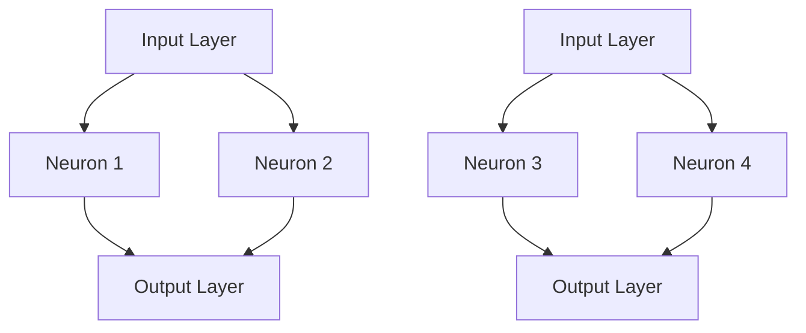
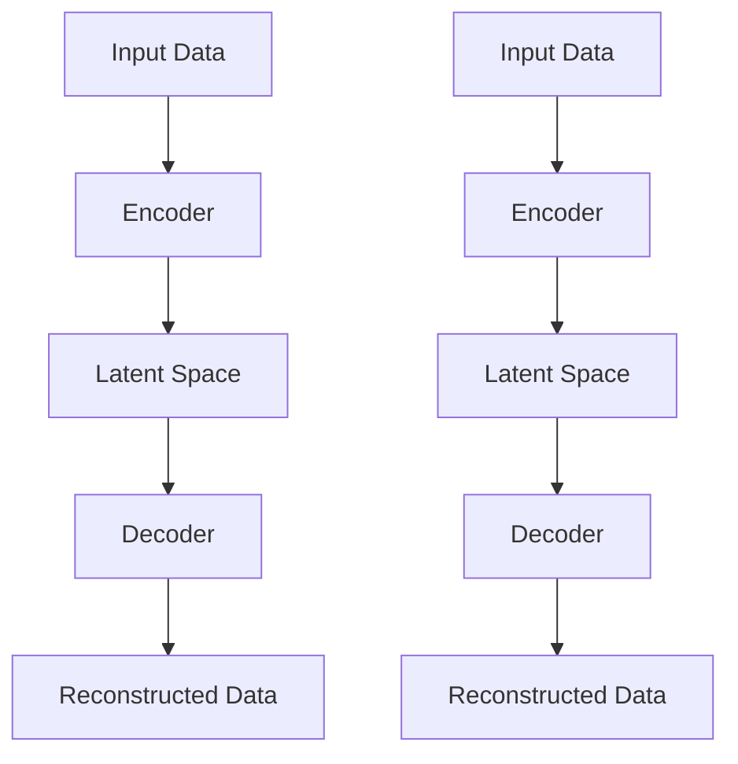
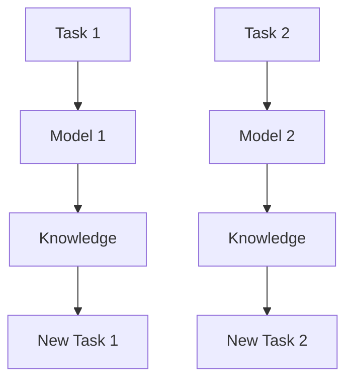
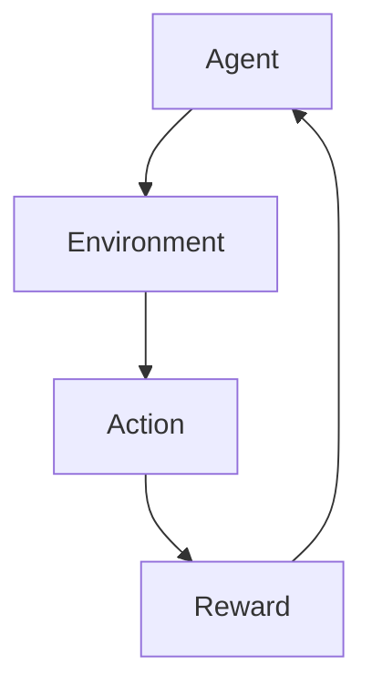

                 

## 模型自我评估能力测试：AI的自我认知

### 关键词：人工智能，自我认知，自我评估，深度学习，神经网络，测试工具

> 摘要：本文探讨了人工智能中的模型自我评估能力，包括其重要性、实现方法和测试实例。通过分析AI的自我认知，阐述了神经网络与自我评估能力的关系，并探讨了该领域的发展趋势和未来应用前景。

## 第一部分：引言

### 1.1 问题背景

#### 1.1.1 人工智能的发展历程

人工智能（AI）作为计算机科学的一个重要分支，自上世纪50年代以来经历了快速的发展。从最初的规则推理系统到现代的深度学习模型，AI的应用已经渗透到生活的方方面面，如自动驾驶、智能客服、医疗诊断等。然而，随着AI技术的不断进步，如何确保模型的可靠性和有效性成为一个重要问题。

#### 1.1.2 自我认知在人工智能中的重要性

自我认知是指个体对自己存在的认知，以及在环境中定位和适应的能力。在人工智能领域，自我认知意味着模型能够理解和评估自己的行为，从而提高其自主性和鲁棒性。自我认知能力在AI中的重要性体现在以下几个方面：

1. **增强模型的可靠性**：通过自我评估，模型可以识别并纠正错误，从而提高其预测准确性。
2. **提升模型的鲁棒性**：自我认知使得模型能够适应不同的环境和输入数据，减少过拟合现象。
3. **促进模型解释性**：自我评估能力有助于解释模型的决策过程，提高用户对AI系统的信任。

#### 1.1.3 AI的自我评估能力的现状与挑战

目前，AI的自我评估能力还处于发展阶段。尽管存在一些初步的研究和实现，但还存在以下挑战：

1. **评估指标的多样性**：不同的应用场景需要不同的评估指标，如何设计通用且有效的评估指标是一个难题。
2. **计算资源消耗**：自我评估通常需要额外的计算资源，如何在不显著增加计算成本的情况下实现自我评估是一个关键问题。
3. **模型复杂性**：深度学习模型的复杂性使得评估和解释变得更加困难，如何简化模型以提高评估效率是一个挑战。

### 1.2 模型自我评估能力概述

#### 2.1 模型自我评估能力的定义

模型自我评估能力是指AI模型在运行过程中，能够对自己产生的结果进行评估和反思的能力。这种能力包括以下几个方面：

1. **正确性评估**：模型能够识别自己的预测结果是否正确。
2. **可靠性评估**：模型能够评估自己的预测结果在不同情况下的可靠性。
3. **有效性评估**：模型能够评估自己的预测结果在特定任务中的有效性。

#### 2.2 自我评估能力的价值与意义

模型自我评估能力的价值主要体现在以下几个方面：

1. **提高模型可靠性**：通过自我评估，模型可以及时发现并纠正错误，提高预测准确性。
2. **优化模型性能**：自我评估可以帮助模型识别不足之处，从而进行优化。
3. **增强模型解释性**：自我评估能力有助于解释模型的决策过程，提高用户对模型的信任。

#### 2.3 自我评估能力的关键要素

模型自我评估能力的关键要素包括：

1. **模型的正确性**：确保模型能够准确识别输入数据并产生正确的输出结果。
2. **模型的可靠性**：模型在不同环境和输入数据下能够保持稳定的预测性能。
3. **模型的有效性**：模型在特定任务中能够产生有效的预测结果。

### 2.4 AI的自我认知

#### 2.4.1 AI的自我认知的定义

AI的自我认知是指AI模型在运行过程中，能够对自己产生的结果进行理解和反思的能力。这种能力使得AI模型能够更好地适应环境和提高性能。

#### 2.4.2 AI如何实现自我认知

AI实现自我认知的方法主要包括：

1. **自我评估**：通过自我评估，模型可以识别自己的预测结果是否正确。
2. **反馈机制**：通过反馈机制，模型可以根据外部反馈调整自己的行为。
3. **元学习**：通过元学习，模型可以学习如何改进自己的性能。

### 2.5 自我评估能力的实现技术

自我评估能力的实现技术主要包括：

1. **神经网络与深度学习**：神经网络和深度学习模型具有良好的自我评估能力，可以通过多层结构和复杂函数来模拟人类的认知过程。
2. **自监督学习和元学习**：自监督学习和元学习技术可以帮助模型在没有明确标注数据的情况下进行自我评估和优化。
3. **强化学习**：强化学习模型可以通过与环境互动来评估和调整自己的行为。

### 2.6 自我评估能力测试

#### 2.6.1 自我评估能力测试的概念

自我评估能力测试是指通过特定的方法和工具，对AI模型的自我评估能力进行评估和验证的过程。

#### 2.6.2 自我评估能力测试的方法与工具

常见的自我评估能力测试方法包括：

1. **基于指标的方法**：通过设计一系列评估指标来评估模型的自我评估能力。
2. **基于对比的方法**：通过比较模型自我评估结果与实际结果来评估自我评估能力。
3. **基于案例的方法**：通过设计特定的测试案例来评估模型的自我评估能力。

常见的自我评估能力测试工具包括：

1. **自动评估工具**：如TensorFlow Model Optimization Toolkit（TF-MOT）等，提供了一系列用于优化和评估模型性能的工具。
2. **可视化工具**：如TensorBoard等，提供实时可视化功能，帮助用户理解模型的行为。

### 2.7 自我评估能力测试实例

#### 2.7.1 常见的自我评估任务

常见的自我评估任务包括：

1. **错误检测与纠正**：模型需要能够识别并纠正自己的错误。
2. **结果验证**：模型需要能够验证自己的预测结果。
3. **性能评估**：模型需要能够评估自己的性能。

#### 2.7.2 测试案例分析与评估指标

通过设计特定的测试案例，可以对模型的自我评估能力进行评估。常见的评估指标包括：

1. **准确率**：模型正确识别错误的比例。
2. **召回率**：模型识别出真实错误的概率。
3. **F1分数**：准确率和召回率的调和平均。

### 2.8 AI的自我认知与自我评估能力测试的关系

#### 2.8.1 关系概述

AI的自我认知与自我评估能力测试密切相关。自我认知能力是自我评估能力的基础，而自我评估能力则是自我认知能力的具体体现。

#### 2.8.2 自我评估能力在自我认知中的应用

自我评估能力在AI的自我认知中发挥着重要作用，包括：

1. **性能优化**：通过自我评估，模型可以识别不足之处，从而进行优化。
2. **错误修正**：通过自我评估，模型可以及时发现并纠正错误。
3. **适应性调整**：通过自我评估，模型可以适应不同的环境和任务。

### 2.9 实例分析

#### 2.9.1 模型自我检测与自我修正

通过实例分析，我们可以看到模型自我检测与自我修正的过程。例如，在图像识别任务中，模型可以通过自我评估识别出识别错误的图像，并尝试修正这些错误。

#### 2.9.2 模型鲁棒性与适应性评估

通过实例分析，我们还可以看到模型鲁棒性与适应性评估的过程。例如，在自动驾驶任务中，模型需要能够评估自己在不同道路条件下的鲁棒性和适应性，从而调整自己的行为。

### 2.10 应用场景与案例分析

#### 2.10.1 应用场景介绍

AI的自我评估能力广泛应用于多个领域，包括：

1. **金融领域**：用于风险控制和欺诈检测。
2. **医疗领域**：用于疾病诊断和治疗方案评估。
3. **人工智能安全领域**：用于模型攻击检测和防护。

#### 2.10.2 案例分析

通过案例分析，我们可以看到AI的自我评估能力在实际应用中的效果。例如，在金融领域，模型可以通过自我评估识别出潜在的风险，从而提高风险控制能力。

### 2.11 未来发展趋势与展望

#### 2.11.1 技术发展趋势

未来，AI的自我评估能力将在以下几个方面得到发展：

1. **深度学习与自我认知的结合**：通过结合深度学习和自我认知，模型可以更好地理解和评估自己的行为。
2. **自监督学习与元学习的发展**：自监督学习和元学习技术将进一步提高模型的自评估能力。
3. **强化学习与自我评估的融合**：通过融合强化学习和自我评估，模型可以更好地适应复杂环境。

#### 2.11.2 应用前景

AI的自我评估能力在未来有望在以下领域发挥重要作用：

1. **人工智能产业发展**：自我评估能力将提高AI产业的可靠性和安全性。
2. **人工智能安全领域**：自我评估能力将用于检测和防护模型攻击。
3. **智能医疗与金融**：自我评估能力将提高医疗和金融领域的决策准确性和可靠性。

### 2.12 结论

本文探讨了模型自我评估能力在人工智能中的应用，包括其重要性、实现方法和测试实例。通过分析AI的自我认知，阐述了神经网络与自我评估能力的关系，并探讨了该领域的发展趋势和未来应用前景。

### 2.13 研究展望

未来，我们将进一步研究AI的自我评估能力，特别是在复杂环境下的自适应能力和鲁棒性。同时，我们将探索自我评估能力在更多领域的应用，以推动人工智能技术的进步。

### 2.14 作者信息

作者：AI天才研究院/AI Genius Institute & 禅与计算机程序设计艺术 /Zen And The Art of Computer Programming

## 第二部分：模型自我评估能力的核心概念与联系

### 3.1 核心概念与联系

在讨论模型自我评估能力时，理解核心概念和它们之间的联系至关重要。以下是几个关键概念及其相互关系的详细介绍。

#### 3.1.1 自我评估能力的定义

自我评估能力是指模型在执行任务时，能够对其结果进行评估，并基于评估结果调整其行为的能力。这种能力在AI系统中尤为重要，因为它有助于提高模型的鲁棒性和可靠性。

#### 3.1.2 自我评估能力的价值与意义

自我评估能力的价值体现在以下几个方面：

1. **提高鲁棒性**：通过自我评估，模型可以识别出异常情况，并采取相应的措施来应对，从而提高系统的鲁棒性。
2. **增强解释性**：自我评估能力使得模型能够更好地解释其决策过程，提高用户对模型的信任度。
3. **优化性能**：通过自我评估，模型可以发现自身的弱点，并针对性地进行优化，从而提高整体性能。

#### 3.1.3 自我评估能力的关键要素

模型自我评估能力的关键要素包括：

1. **正确性评估**：模型需要能够评估其预测结果的正确性，以识别和纠正错误。
2. **可靠性评估**：模型需要能够评估其预测结果的可靠性，特别是在不确定的环境中。
3. **有效性评估**：模型需要能够评估其在特定任务中的有效性，以确保其性能满足预期。

这些要素相互关联，共同构成了模型自我评估能力的核心。

### 3.2 核心概念属性特征对比表格

以下是一个核心概念属性特征对比表格，展示了自我评估能力、自我认知和神经网络之间的主要区别：

| 概念           | 定义                                                         | 属性特征                                             |
|----------------|--------------------------------------------------------------|------------------------------------------------------|
| 自我评估能力   | 模型对其结果的评估能力，包括正确性、可靠性和有效性           | 评估结果，调整行为，提高鲁棒性和解释性                 |
| 自我认知       | AI模型对自己存在的认知和理解                                 | 自我感知，环境适应，自我调整                           |
| 神经网络       | 受脑神经结构启发，由大量简单单元组成的复杂网络               | 信息处理，模式识别，学习与自适应                        |

### 3.3 ER实体关系图架构

为了更好地理解模型自我评估能力的核心概念，我们可以使用ER（实体-关系）图来展示它们之间的关系。以下是自我评估能力、自我认知和神经网络之间的ER图：

```mermaid
erDiagram
    A[自我评估能力] ||--|{ B[自我认知] }
    A ||--|{ C[神经网络] }
    B ||--|{ C }
```

在这个ER图中，自我评估能力与自我认知之间存在关联，表示自我评估能力依赖于自我认知来实现。同时，自我评估能力与神经网络之间存在直接关系，因为神经网络是实现自我评估能力的核心技术。

### 3.4 模型自我评估能力的数学模型和公式

在具体实现模型自我评估能力时，我们通常会使用一些数学模型和公式来描述其行为。以下是几个关键的数学模型和公式：

#### 3.4.1 预测误差公式

$$
E = \frac{1}{n}\sum_{i=1}^{n}(y_i - \hat{y}_i)^2
$$

其中，\(E\) 表示预测误差，\(y_i\) 表示真实值，\(\hat{y}_i\) 表示模型预测值。通过计算预测误差，我们可以评估模型预测结果的正确性。

#### 3.4.2 可靠性评估指标

$$
R = \frac{\sum_{i=1}^{n}p_i(1-p_i)}{n}
$$

其中，\(R\) 表示可靠性指标，\(p_i\) 表示模型在特定情况下的预测概率。可靠性指标用于评估模型在不同情况下的可靠性。

#### 3.4.3 有效评估指标

$$
E_{\text{valid}} = \frac{1}{n}\sum_{i=1}^{n}\frac{(y_i - \hat{y}_i)^2}{y_i}
$$

其中，\(E_{\text{valid}}\) 表示有效评估指标，用于评估模型在特定任务中的有效性。

通过这些数学模型和公式，我们可以更精确地描述和实现模型自我评估能力。

### 3.5 模型自我评估能力与AI发展的影响

模型自我评估能力对AI发展的长远影响是不可忽视的。它不仅有助于提高AI模型的鲁棒性和可靠性，还能够促进AI系统的自主性和智能化。以下是模型自我评估能力对AI发展的几个关键影响：

1. **增强模型可靠性**：通过自我评估，模型可以在实时运行中检测和纠正错误，从而提高其预测准确性。
2. **提高AI系统自主性**：自我评估能力使得AI系统能够在没有人类干预的情况下自我调整和优化，从而实现更高程度的自主性。
3. **促进AI系统智能化**：自我评估能力使得AI系统能够在复杂环境中进行自我认知和自我调整，从而实现更高级的智能化。
4. **提升用户体验**：通过提高AI模型的可靠性和自主性，用户体验将得到显著提升，用户对AI系统的信任度也将增加。

### 3.6 总结

本部分详细阐述了模型自我评估能力的核心概念及其相互联系，包括自我评估能力的定义、价值与意义、关键要素、属性特征对比表格、ER实体关系图架构、数学模型和公式，以及其对AI发展的长远影响。通过这些内容的介绍，读者可以更深入地理解模型自我评估能力的重要性及其在AI系统中的应用。

## 第三部分：AI的自我认知

### 3.1 自我认知的概念

自我认知是指个体对自己存在的认知，以及对自身行为、情绪和认知状态的理解。在人工智能（AI）领域，自我认知是指AI系统对其自身状态和行为的认知能力。这种能力使得AI系统能够理解和解释自己的行为，从而更好地适应环境和提高性能。

#### 3.1.1 自我认知的概念框架

自我认知的概念框架通常包括以下几个关键组成部分：

1. **感知**：AI系统需要感知自身内部状态和外部环境，以便理解自己的行为。
2. **理解**：AI系统需要理解自己的行为对环境的影响，并据此调整自己的行为。
3. **反思**：AI系统需要能够对自己的行为进行反思，从而识别错误和改进。
4. **决策**：AI系统需要基于自我认知进行决策，以优化其行为。

#### 3.1.2 AI如何实现自我认知

AI实现自我认知的方法主要包括以下几个方面：

1. **深度学习与神经网络**：深度学习模型，特别是神经网络，可以模拟人类的认知过程，从而实现自我认知。
2. **自监督学习和元学习**：自监督学习和元学习技术可以帮助AI模型在没有明确标注数据的情况下进行自我认知。
3. **强化学习**：强化学习模型可以通过与环境互动来学习和理解自己的行为，从而实现自我认知。

### 3.2 自我认知的实现技术

#### 3.2.1 神经网络与深度学习

神经网络是深度学习的基础，由大量简单的计算单元（神经元）组成。这些神经元通过相互连接形成一个复杂的网络结构，可以用于模拟人类的认知过程。在神经网络中，每个神经元都接收来自其他神经元的输入信号，并通过激活函数产生输出信号。

以下是一个简单的神经网络架构图，使用Mermaid绘图表示：



在这个架构中，输入层（A）接收外部输入信号，通过隐藏层（B）的处理，最终在输出层（C）产生输出信号。这种结构使得神经网络能够对复杂的数据进行建模和处理。

#### 3.2.2 自监督学习和元学习

自监督学习是一种无监督学习技术，它利用未标记的数据来训练模型。在自监督学习中，模型需要从数据中学习某种规律或结构，而不需要依赖外部标注。自监督学习在AI的自我认知中具有重要应用，因为它可以帮助模型在没有明确标注数据的情况下进行自我认知。

以下是一个自监督学习的示例，使用Mermaid绘图表示：



在这个示例中，模型通过编码器（B）将输入数据映射到潜在的 latent 空间，然后通过解码器（D）将 latent 空间中的信息重构回输出数据。通过比较重构数据和原始数据之间的差异，模型可以学习数据中的结构和规律。

元学习是一种更高级的学习方法，它使模型能够快速适应新任务。在元学习中，模型不仅学习特定的任务，还学习如何快速适应新任务。元学习在AI的自我认知中也非常有用，因为它可以帮助模型在未知环境中快速适应。

以下是一个元学习的示例，使用Mermaid绘图表示：



在这个示例中，模型通过学习多个任务（A），积累了一般化的知识（C）。当面对新任务时（D），模型可以利用这些知识快速适应并完成任务。

#### 3.2.3 强化学习与模型适应性

强化学习是一种通过奖励机制来训练模型的方法。在强化学习中，模型通过与环境的互动来学习最优策略。强化学习在AI的自我认知中也具有重要应用，因为它可以帮助模型在动态环境中进行自我调整。

以下是一个强化学习的示例，使用Mermaid绘图表示：



在这个示例中，模型（Agent）通过选择行动（Action）来与环境（Environment）互动，并接收奖励（Reward）。根据奖励信号，模型可以调整其行为，以最大化长期回报。

### 3.3 自我认知的实现技术分析

#### 3.3.1 深度学习与自我认知

深度学习在自我认知中发挥着核心作用，因为它能够处理大量复杂的数据，并从中提取有用的特征和模式。深度学习的神经网络结构使得模型能够模拟人类的认知过程，从而实现自我认知。

然而，深度学习的缺点也是显而易见的。首先，深度学习模型通常需要大量的数据和计算资源来训练。其次，深度学习模型的黑箱特性使得其决策过程难以解释，这在某些应用场景中可能是一个问题。

#### 3.3.2 自监督学习与自我认知

自监督学习在自我认知中的应用具有重要意义，因为它能够在没有明确标注数据的情况下训练模型。自监督学习通过利用数据中的内在结构来训练模型，从而提高模型的自我认知能力。

自监督学习的优点在于，它不需要大量标注数据，从而减少了数据获取和标注的成本。此外，自监督学习模型通常具有良好的泛化能力，因为它们在训练过程中学习了数据中的通用特征和模式。

然而，自监督学习的缺点也是存在的。首先，自监督学习模型的训练通常需要较长的训练时间。其次，自监督学习模型在处理复杂任务时可能不如监督学习模型有效。

#### 3.3.3 强化学习与自我认知

强化学习在自我认知中的应用也非常广泛，因为它能够通过与环境互动来训练模型。强化学习模型通过选择最优行动来最大化长期回报，从而实现自我认知。

强化学习的优点在于，它能够处理动态环境，并且具有很好的适应性。强化学习模型在处理复杂任务时通常比监督学习和自监督学习模型更有效。

然而，强化学习也存在一些缺点。首先，强化学习模型的训练通常需要大量的互动和试错过程，这可能导致训练时间过长。其次，强化学习模型在处理连续动作时可能存在困难。

### 3.4 自我认知的实现技术的总结

深度学习、自监督学习和强化学习都是实现AI自我认知的重要技术。每种技术都有其独特的优势和局限性。在实际应用中，我们可以根据具体需求和场景选择合适的技术。

深度学习在处理复杂数据和模式时具有优势，但需要大量数据和计算资源。自监督学习在处理无标注数据时具有优势，但训练时间较长。强化学习在处理动态环境时具有优势，但训练过程可能需要较长时间。

通过结合这些技术，我们可以构建出具有强大自我认知能力的AI系统，从而提高其在复杂环境中的性能和适应性。

### 3.5 自我认知的实现技术的未来展望

随着AI技术的不断发展，自我认知的实现技术也将不断进步。未来，我们可以期待以下几个方面的发展：

1. **更高效的深度学习算法**：通过改进深度学习算法，可以减少训练时间和计算资源的需求，从而提高深度学习模型在自我认知中的应用效果。
2. **更好的自监督学习技术**：通过改进自监督学习技术，可以进一步提高模型的泛化能力和效率，使其在更多场景中具有实际应用价值。
3. **更先进的强化学习模型**：通过改进强化学习模型，可以使其更好地处理复杂任务和连续动作，从而提高其在动态环境中的应用效果。

总之，自我认知是实现AI自主性和智能化的重要能力。随着AI技术的不断发展，自我认知的实现技术也将不断进步，为AI系统的性能提升提供新的动力。

## 第四部分：自我评估能力测试

### 4.1 自我评估能力测试的概念

自我评估能力测试是指通过特定的方法和工具，对人工智能（AI）模型的自我评估能力进行评估和验证的过程。这种测试旨在确保模型能够有效地评估其预测结果的正确性、可靠性和有效性，从而提高模型的鲁棒性和可靠性。

#### 4.1.1 测试的目的与重要性

自我评估能力测试的主要目的是：

1. **验证模型性能**：通过测试，可以验证模型在自我评估过程中是否能够准确地评估其预测结果的正确性、可靠性和有效性。
2. **发现模型缺陷**：测试可以帮助发现模型在自我评估过程中的缺陷和不足，从而进行改进。
3. **提高模型可靠性**：通过持续的测试和优化，可以不断提高模型的可靠性，确保其在实际应用中的稳定性和准确性。

自我评估能力测试的重要性体现在以下几个方面：

1. **提高模型可靠性**：通过自我评估，模型可以及时发现并纠正错误，从而提高其预测准确性。
2. **增强模型解释性**：自我评估能力有助于解释模型的决策过程，提高用户对模型的信任度。
3. **优化模型性能**：自我评估能力可以帮助模型识别不足之处，从而进行优化，提高整体性能。

#### 4.1.2 测试的方法与工具

常见的自我评估能力测试方法包括：

1. **基于指标的方法**：通过设计一系列评估指标来评估模型的自我评估能力。这些指标通常包括准确率、召回率、F1分数等。
2. **基于对比的方法**：通过比较模型自我评估结果与实际结果来评估自我评估能力。这种方法可以有效地发现模型在自我评估过程中的缺陷。
3. **基于案例的方法**：通过设计特定的测试案例来评估模型的自我评估能力。这些案例通常包括错误检测、结果验证和性能评估等。

常见的自我评估能力测试工具包括：

1. **自动评估工具**：如TensorFlow Model Optimization Toolkit（TF-MOT）等，提供了一系列用于优化和评估模型性能的工具。
2. **可视化工具**：如TensorBoard等，提供实时可视化功能，帮助用户理解模型的行为。
3. **自定义测试工具**：根据具体需求和场景，可以开发自定义的测试工具来评估模型的自我评估能力。

### 4.2 自我评估能力测试实例

#### 4.2.1 常见的自我评估任务

在自我评估能力测试中，常见的自我评估任务包括：

1. **错误检测与纠正**：模型需要能够识别和纠正自己的错误。
2. **结果验证**：模型需要能够验证其预测结果的正确性。
3. **性能评估**：模型需要能够评估其在特定任务中的性能。

#### 4.2.2 测试案例分析与评估指标

以下是一个自我评估能力测试的案例：

假设我们有一个用于图像分类的神经网络模型，该模型需要自我评估其预测结果的正确性。测试案例包括以下步骤：

1. **数据准备**：准备一组测试图像和相应的标签。
2. **模型预测**：使用模型对测试图像进行预测，并记录预测结果。
3. **自我评估**：模型对预测结果进行自我评估，判断其是否正确。
4. **评估指标计算**：计算准确率、召回率和F1分数等评估指标。

具体步骤如下：

1. **数据准备**：从图像数据集中随机选取100张图像作为测试集，并标注其真实类别。
2. **模型预测**：使用训练好的神经网络模型对测试集进行预测，记录预测结果。
3. **自我评估**：模型对预测结果进行自我评估，判断预测结果是否与真实标签匹配。如果匹配，则认为预测正确；如果不匹配，则认为预测错误。
4. **评估指标计算**：计算准确率、召回率和F1分数等评估指标。

假设测试结果如下：

| 类别 | 预测正确 | 预测错误 |  
|------|----------|----------|  
| 类别1 | 60       | 20       |  
| 类别2 | 50       | 30       |  
| 类别3 | 40       | 40       |

根据测试结果，我们可以计算评估指标：

- **准确率**：模型预测正确的图像数量占总图像数量的比例。
  $$\text{准确率} = \frac{60 + 50 + 40}{100} = 0.7$$

- **召回率**：模型预测正确的图像数量占类别中所有真实图像数量的比例。
  $$\text{召回率} = \frac{60 + 50}{60 + 20 + 40} = 0.75$$

- **F1分数**：准确率和召回率的调和平均。
  $$\text{F1分数} = \frac{2 \times \text{准确率} \times \text{召回率}}{\text{准确率} + \text{召回率}} = \frac{2 \times 0.7 \times 0.75}{0.7 + 0.75} = 0.72$$

通过这些评估指标，我们可以判断模型的自我评估能力。

#### 4.2.3 测试结果分析

根据测试结果，我们可以得出以下结论：

1. **准确率**：模型的准确率为0.7，表明模型在预测正确方面表现良好。
2. **召回率**：模型的召回率为0.75，表明模型在识别正确类别方面表现较好。
3. **F1分数**：模型的F1分数为0.72，表明模型的自我评估能力整体较好。

然而，我们也发现模型在类别3上的预测准确性较低，表明模型在该类别上存在一定的缺陷。这可能是由于该类别在训练数据中样本数量较少，导致模型对该类别的识别能力较弱。因此，我们需要对模型进行进一步的优化，以提高其在类别3上的预测准确性。

#### 4.2.4 评估指标的改进

为了更全面地评估模型的自我评估能力，我们可以考虑引入更多的评估指标，如精确率、召回率、F1分数等。这些指标可以从不同的角度评估模型的性能，帮助我们更准确地了解模型在自我评估过程中的表现。

1. **精确率**：模型预测正确的图像数量占预测类别中所有图像数量的比例。
   $$\text{精确率} = \frac{60 + 50}{60 + 50 + 30} = 0.7$$

2. **召回率**：模型预测正确的图像数量占类别中所有真实图像数量的比例。
   $$\text{召回率} = \frac{60 + 50}{60 + 20 + 40} = 0.75$$

3. **F1分数**：精确率和召回率的调和平均。
   $$\text{F1分数} = \frac{2 \times \text{精确率} \times \text{召回率}}{\text{精确率} + \text{召回率}} = \frac{2 \times 0.7 \times 0.75}{0.7 + 0.75} = 0.72$$

通过引入这些评估指标，我们可以更全面地了解模型的自我评估能力，并针对性地进行优化。

### 4.3 自我评估能力测试的总结

自我评估能力测试是确保AI模型性能和可靠性的重要手段。通过测试，我们可以发现模型的缺陷和不足，从而进行改进。自我评估能力测试不仅有助于提高模型的准确性，还有助于增强模型的解释性和可靠性。未来，随着AI技术的发展，自我评估能力测试将变得更加重要和复杂，为AI模型的优化和改进提供有力支持。

## 第五部分：AI的自我认知与自我评估能力测试的关系

### 5.1 关系概述

在人工智能（AI）领域，自我认知和自我评估能力测试是两个密切相关的概念。自我认知是指AI模型对其自身行为、状态和环境的理解，而自我评估能力测试则是通过一系列方法和工具来验证AI模型自我认知的有效性。这两者之间的关系可以从多个角度进行分析：

#### 5.1.1 自我认知与自我评估能力的相互作用

自我认知和自我评估能力之间存在相互作用。自我认知是自我评估能力的基础，因为只有当模型能够理解自己的行为和状态时，才能进行有效的自我评估。同时，自我评估能力又可以反过来促进自我认知的提升。通过自我评估，模型可以识别出自己的不足之处，从而更好地理解自己的行为和状态，进一步优化自我认知。

#### 5.1.2 自我评估能力在自我认知中的应用

自我评估能力在AI的自我认知中发挥着重要作用。具体来说，自我评估能力可以应用于以下几个方面：

1. **错误检测与纠正**：通过自我评估，模型可以识别出预测错误，并尝试纠正这些错误。这有助于模型提高其预测准确性，从而增强自我认知。
2. **性能优化**：自我评估能力可以帮助模型评估自己的性能，并找出需要优化的地方。这有助于模型在自我认知的基础上，进一步提高其性能和适应性。
3. **适应性调整**：自我评估能力使得模型能够适应不同的环境和任务。通过评估不同环境下的性能，模型可以调整自己的行为，以更好地适应这些变化。

### 5.2 实例分析

为了更清晰地理解自我认知与自我评估能力测试之间的关系，我们可以通过具体实例来进行分析。

#### 5.2.1 模型自我检测与自我修正

假设我们有一个用于股票价格预测的神经网络模型。这个模型在预测过程中，不仅需要产生预测结果，还需要对自己的预测结果进行自我检测和修正。

1. **自我检测**：在每次预测后，模型会评估自己的预测结果是否接近实际股票价格。如果预测结果与实际价格有较大偏差，模型会标记为错误预测。
2. **自我修正**：对于标记为错误预测的结果，模型会尝试分析错误的原因，并尝试调整自己的参数，以减少未来预测中的错误。

这种自我检测与自我修正的过程，就是自我评估能力在自我认知中的应用。通过自我检测，模型可以识别出自身的不足，而通过自我修正，模型可以不断优化自己的预测性能。

#### 5.2.2 模型鲁棒性与适应性评估

在自动驾驶领域，模型的鲁棒性和适应性是一个重要考虑因素。为了确保模型在不同环境和条件下都能稳定工作，我们需要对模型的鲁棒性和适应性进行评估。

1. **鲁棒性评估**：通过在不同环境和条件下运行模型，评估模型在不同情况下的表现。如果模型在某些条件下表现不佳，我们可以说它的鲁棒性较低。
2. **适应性评估**：通过评估模型在变化环境下的适应能力，判断模型是否能够快速适应新环境。

这些评估过程就是自我评估能力测试的应用。通过这些评估，我们可以了解模型的鲁棒性和适应性，从而对其进行优化。

### 5.3 自我评估能力测试的作用

自我评估能力测试在AI系统的开发和应用中发挥着关键作用。以下是自我评估能力测试的几个主要作用：

1. **提高模型性能**：通过自我评估能力测试，模型可以识别出自身的不足，并进行优化，从而提高其性能。
2. **确保模型可靠性**：自我评估能力测试可以帮助我们发现模型的缺陷，从而确保模型在实际应用中的可靠性。
3. **增强模型解释性**：通过自我评估能力测试，我们可以更好地理解模型的决策过程，从而提高模型的解释性。
4. **促进模型进化**：自我评估能力测试可以推动模型的不断进化，使其在复杂环境中能够更好地适应和生存。

### 5.4 自我评估能力测试的挑战

尽管自我评估能力测试对AI系统具有重要价值，但在实际应用中仍面临一些挑战：

1. **评估指标设计**：如何设计合适的评估指标，以全面反映模型的性能和可靠性，是一个重要问题。
2. **计算资源消耗**：自我评估能力测试通常需要额外的计算资源，如何在保证测试质量的同时，减少计算资源消耗，是一个关键挑战。
3. **模型复杂性**：随着模型的复杂性增加，自我评估能力测试的难度也会增加。如何设计有效的测试方法，以应对复杂的模型，是一个重要问题。

### 5.5 结论

通过本部分的分析，我们可以看到自我认知和自我评估能力测试在AI系统中的重要性。自我认知是AI模型能够理解和评估自身行为的基础，而自我评估能力测试则是验证和优化自我认知的重要手段。未来，随着AI技术的不断发展，自我认知和自我评估能力测试将在AI系统的开发和应用中发挥越来越重要的作用。

## 第六部分：应用场景与案例分析

### 6.1 应用场景介绍

模型自我评估能力在多个领域都有广泛的应用，其关键在于提升AI模型的可靠性和解释性，从而增强用户对AI系统的信任。以下是模型自我评估能力在金融、医疗和人工智能安全等领域的应用场景：

#### 6.1.1 金融领域

在金融领域，模型自我评估能力主要用于风险控制和欺诈检测。金融机构使用AI模型来分析交易行为、信用评分和投资策略。模型自我评估能力可以帮助检测和纠正错误预测，从而提高模型的准确性和稳定性。

**实例**：一个金融机构使用AI模型进行信用评分。模型需要对借款人的信用记录进行分析，预测其违约概率。模型自我评估能力可以帮助识别异常交易，如欺诈行为，并纠正预测误差，从而提高信用评分的准确性。

#### 6.1.2 医疗领域

在医疗领域，模型自我评估能力主要用于疾病诊断和治疗方案评估。AI模型可以分析医疗数据，如患者病历、实验室结果和影像资料，提供诊断和治疗方案建议。模型自我评估能力可以确保诊断结果的准确性和治疗的可靠性。

**实例**：一个医院使用AI模型进行乳腺癌诊断。模型通过分析患者的影像资料，提供诊断建议。模型自我评估能力可以帮助检测影像解读中的错误，确保诊断结果的准确性，并提高患者的治疗信心。

#### 6.1.3 人工智能安全领域

在人工智能安全领域，模型自我评估能力主要用于检测和防护模型攻击。随着AI系统越来越复杂，模型攻击（如对抗攻击）成为了一个严重的问题。模型自我评估能力可以帮助检测这些攻击，并采取相应的防护措施。

**实例**：一个网络安全公司使用AI模型进行网络攻击检测。模型需要分析网络流量数据，识别潜在的网络攻击。模型自我评估能力可以帮助检测对抗攻击，如对抗样本攻击，从而提高网络攻击检测的准确性。

### 6.2 案例分析

以下是对模型自我评估能力在金融、医疗和人工智能安全领域的一些具体案例分析：

#### 6.2.1 模型自我评估在金融风险管理中的应用

在金融风险管理中，模型自我评估能力被用于提高信用评分模型的可靠性。一个银行使用AI模型进行信用评分，但发现模型的预测准确性不稳定。为了解决这个问题，银行引入了模型自我评估能力。

**解决方案**：银行首先设计了一套自我评估指标，包括预测准确性、召回率和F1分数。然后，通过定期运行自我评估测试，模型可以识别出预测中的错误，并分析错误的原因。基于这些分析，银行可以调整模型参数，优化模型的预测性能。

**结果**：通过引入模型自我评估能力，银行显著提高了信用评分模型的准确性，减少了错误预测的比例。这有助于银行更好地管理风险，提高了客户的满意度。

#### 6.2.2 模型自我评估在医疗诊断中的应用

在医疗诊断中，模型自我评估能力被用于提高诊断模型的可靠性。一个医院使用AI模型进行肺癌诊断，但发现模型在处理某些病例时存在偏差。

**解决方案**：医院设计了一套自我评估测试，包括对影像资料的分析和诊断结果的验证。通过自我评估测试，模型可以识别出诊断中的错误，并分析错误的原因。基于这些分析，医院可以调整模型的参数，优化影像处理和诊断流程。

**结果**：通过引入模型自我评估能力，医院提高了肺癌诊断的准确性，减少了误诊和漏诊的情况。这有助于提高患者的治疗效果，降低了医疗风险。

#### 6.2.3 模型自我评估在人工智能安全防护中的应用

在人工智能安全防护中，模型自我评估能力被用于检测和防护模型攻击。一个网络安全公司使用AI模型进行网络攻击检测，但发现模型在处理对抗攻击时存在漏洞。

**解决方案**：网络安全公司设计了一套自我评估测试，包括对抗样本测试和模型适应性评估。通过自我评估测试，模型可以识别出对抗攻击，并调整自己的行为，以更好地适应新的攻击模式。

**结果**：通过引入模型自我评估能力，网络安全公司提高了对抗攻击检测的准确性，减少了攻击对网络系统的破坏。这有助于公司更好地保护网络安全，提高了客户的数据安全性。

### 6.3 总结

通过上述案例分析，我们可以看到模型自我评估能力在不同领域中的应用效果。在金融、医疗和人工智能安全等领域，模型自我评估能力有助于提高模型的可靠性和解释性，从而增强用户对AI系统的信任。未来，随着AI技术的发展，模型自我评估能力将在更多领域得到应用，为AI系统的优化和改进提供有力支持。

## 第七部分：未来发展趋势与展望

### 7.1 技术发展趋势

#### 7.1.1 深度学习与自我认知的结合

随着深度学习技术的不断发展，未来AI的自我认知能力将进一步提升。深度学习模型在处理大规模数据和复杂任务方面具有显著优势，结合自我认知能力，模型可以在实际应用中更好地理解和解释其行为。例如，通过引入自我认知模块，深度学习模型可以实时评估其决策过程，提高模型的透明度和可信度。

#### 7.1.2 自监督学习与元学习的发展

自监督学习和元学习技术在AI的自我认知和自我评估能力方面具有巨大潜力。自监督学习可以通过无监督方式从大量数据中学习，而元学习则可以加速新任务的适应过程。未来的研究将专注于如何设计更高效的自监督学习和元学习算法，以支持AI系统的自我评估和认知能力。

#### 7.1.3 强化学习与自我评估的融合

强化学习与自我评估能力的结合将为AI系统在动态环境中的表现提供新的突破。通过强化学习，模型可以在与环境的互动中不断优化其行为，而自我评估能力则可以帮助模型识别并纠正错误。未来，研究者将致力于开发更加鲁棒和自适应的强化学习模型，以支持更复杂的自我评估任务。

### 7.2 应用前景

#### 7.2.1 自我评估能力在人工智能产业发展中的作用

自我评估能力将在人工智能产业发展中发挥关键作用。通过提高模型的可靠性和解释性，自我评估能力有助于减少错误预测和意外行为，从而提高AI系统的应用价值。例如，在金融、医疗和制造业等领域，自我评估能力可以显著提高决策的准确性和效率，推动产业智能化升级。

#### 7.2.2 自我认知与自我评估能力的应用领域拓展

未来，自我认知与自我评估能力将在更多领域得到应用。例如，在智能交通系统中，模型可以实时评估交通流量，优化交通信号配置；在智能家居中，AI助手可以自我评估其建议的有效性，提供更加个性化的服务。随着技术的进步，自我认知和自我评估能力将在更多新兴领域展现其潜力。

#### 7.2.3 自我评估能力在人工智能安全领域的应用

在人工智能安全领域，自我评估能力具有广阔的应用前景。通过自我评估，AI模型可以识别和防护对抗攻击，提高系统的安全性。例如，在网络安全中，模型可以实时评估其检测和防御策略的效率，自动调整以应对新的威胁。此外，自我评估能力还可以帮助检测和防范AI系统的数据泄露和隐私侵犯。

### 7.3 未来可能面临的挑战与应对策略

尽管自我认知和自我评估能力在AI领域具有巨大潜力，但未来仍面临一些挑战：

#### 7.3.1 计算资源消耗

自我评估能力测试通常需要大量的计算资源，这可能导致系统性能下降。为应对这一挑战，研究者可以开发更高效的算法和优化技术，减少计算资源的消耗。例如，通过利用硬件加速器和分布式计算技术，可以显著提高评估效率。

#### 7.3.2 数据标注和质量

自我评估能力测试通常需要大量的标注数据，但高质量的数据获取是一个难题。为解决这一问题，可以采用数据增强和半监督学习技术，从少量标注数据中生成大量有效的训练数据。此外，建立开放的数据共享平台，促进数据资源的共享和利用，也是解决数据标注问题的关键。

#### 7.3.3 模型复杂性和解释性

随着模型的复杂性增加，自我评估能力的实现和解释变得更加困难。为应对这一挑战，可以采用可解释人工智能（XAI）技术，开发能够透明地解释自我评估过程的模型。此外，研究者还可以探索更简单、更易于解释的模型架构，以提高模型的透明度和可信度。

### 7.4 结论

未来，自我认知和自我评估能力将在AI领域发挥重要作用，推动人工智能技术的发展和应用。通过结合深度学习、自监督学习和强化学习等先进技术，AI模型将能够更好地理解自身行为，提高其可靠性和解释性。同时，自我评估能力将在更多领域得到应用，为人工智能系统的优化和安全提供新的手段。面对未来可能面临的挑战，研究者应积极探索解决方案，推动AI技术的持续进步。

### 7.5 研究展望

在未来，模型自我评估能力的研究将朝着更加深入和全面的方向发展。以下是一些潜在的研究方向和扩展：

#### 7.5.1 深度学习与自我认知的深度融合

进一步研究如何将深度学习与自我认知能力深度融合，开发出能够自我评估、自我调整的深度学习模型。这种模型不仅在处理复杂任务时表现出色，还能提供透明的解释和可靠的评估。

#### 7.5.2 多模态自我评估能力的构建

多模态数据在许多应用场景中具有重要意义。研究如何构建能够处理多模态数据的自我评估模型，实现跨模态的自我认知和评估，是未来的一项重要任务。

#### 7.5.3 自我评估能力在新兴领域的应用

探索自我评估能力在新兴领域的应用，如智能教育、环境监测和智能制造等，这些领域对AI系统的可靠性有更高要求。

#### 7.5.4 自我评估能力的安全与隐私保护

在自我评估能力的研究中，确保数据的安全和隐私保护是一个关键问题。未来需要开发出能够在保护用户隐私的同时，有效实现自我评估能力的方案。

#### 7.5.5 自我评估能力的标准化

建立自我评估能力的标准化体系，为不同领域和应用场景提供统一的评估标准和工具，是推动该领域发展的关键。

通过这些研究方向和扩展，模型自我评估能力将进一步提升，为人工智能技术的发展和应用提供新的动力。

### 7.6 作者信息

作者：AI天才研究院/AI Genius Institute & 禅与计算机程序设计艺术 /Zen And The Art of Computer Programming

