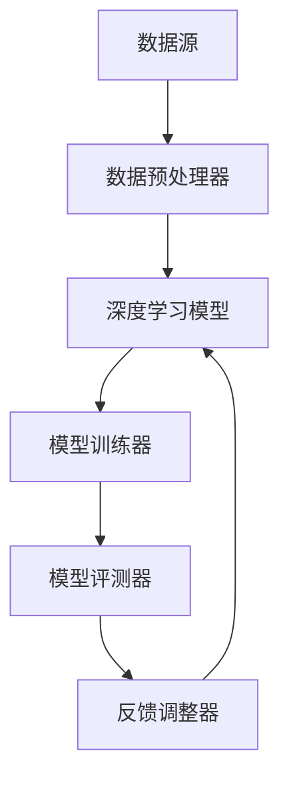

                 

### 第1章：问题背景与核心概念

#### 1.1.1 问题背景

在人工智能（AI）领域，模型训练与评测是一个核心且关键的过程。随着深度学习技术的不断发展，模型的复杂性和规模也在迅速增加，这使得模型训练与评测的效率和质量成为了学术界和工业界关注的焦点。然而，在这个过程中，一个关键问题是如何确保模型能够在训练过程中不断优化，同时在评测过程中保持高性能。

这个问题可以归结为“模型训练与评测的闭环反馈机制”的问题。闭环反馈机制是一种用于调整和控制系统输出的方法，它通过不断地收集系统的输出结果，并将其与预期的目标进行比较，从而进行调整。在模型训练与评测过程中，这种机制可以帮助我们实时监控模型的性能，并根据反馈进行优化，以提高模型的准确性和鲁棒性。

#### 1.1.2 核心概念

- **闭环反馈机制**：闭环反馈机制是一种动态调整系统输入以优化系统输出的过程。它包括三个关键步骤：收集反馈信息、处理反馈信息、利用反馈信息进行系统调整。

- **模型训练**：模型训练是指通过使用大量数据进行迭代学习，使模型能够理解和预测特定任务的过程。在训练过程中，模型的性能会不断优化，以达到更好的预测效果。

- **模型评测**：模型评测是指对训练好的模型进行测试，以评估其在未知数据上的性能。常见的评测指标包括准确率、召回率、F1值等。

#### 1.1.3 边界与外延

- **边界**：闭环反馈机制主要应用于模型训练与评测的过程中。它涉及的数据集和模型都是特定的，且需要在一定的技术细节内进行操作。

- **外延**：闭环反馈机制不仅限于模型训练与评测，它还可以应用于其他领域，如控制系统、自适应系统等。在其他领域，闭环反馈机制也可以实现类似的动态调整和优化过程。

#### 1.1.4 概念结构与核心要素组成

- **概念结构**：闭环反馈机制包括输入（模型输出）、处理（性能评估）、输出（反馈信息）和反馈（调整模型参数）四个核心要素。

- **核心要素组成**：
  - **输入**：模型的输出结果，用于评估模型的性能。
  - **处理**：对输出结果进行性能评估，以确定模型的优缺点。
  - **输出**：根据评估结果生成反馈信息，用于指导模型的调整。
  - **反馈**：利用反馈信息调整模型参数，以优化模型性能。

### 总结

在这一章中，我们介绍了模型训练与评测的闭环反馈机制，并对其核心概念进行了详细阐述。接下来，我们将进一步探讨闭环反馈机制的原理和应用，以便更好地理解这一重要概念在人工智能领域的重要性。

## 第2章：核心概念原理

### 2.1 闭环反馈机制

闭环反馈机制是一种通过收集、处理和利用反馈信息来优化系统性能的方法。它广泛应用于各个领域，包括人工智能、控制系统、自适应系统等。在模型训练与评测过程中，闭环反馈机制发挥着至关重要的作用。

#### 2.1.1 原理

闭环反馈机制的基本原理可以概括为以下三个步骤：

1. **收集反馈信息**：在模型训练和评测过程中，收集模型的输出结果和性能指标，如准确率、召回率、F1值等。

2. **处理反馈信息**：对收集到的反馈信息进行预处理和评估，以确定模型的优缺点和潜在问题。

3. **利用反馈信息进行系统调整**：根据反馈信息调整模型的参数和结构，以优化模型性能和解决存在的问题。

#### 2.1.2 属性特征对比表格

为了更好地理解闭环反馈机制与传统反馈机制的差异，我们可以通过一个对比表格来展示两者的主要属性特征：

| 特征        | 传统反馈机制 | 闭环反馈机制 |
| ----------- | ------------ | ------------ |
| 目标        | 单一目标     | 多重目标     |
| 信息反馈    | 单向反馈     | 双向反馈     |
| 调整策略    | 静态策略     | 动态策略     |
| 应用效果    | 局部优化     | 全局优化     |

从上表可以看出，闭环反馈机制在目标、信息反馈、调整策略和应用效果等方面都优于传统反馈机制。

### 2.2 模型训练与评测

模型训练和评测是人工智能领域的核心环节。在这个环节中，闭环反馈机制发挥着重要作用，以确保模型能够在训练过程中不断优化，同时在评测过程中保持高性能。

#### 2.2.1 原理

模型训练和评测的基本原理如下：

1. **数据集的准备**：首先，需要准备用于训练和评测的数据集。数据集应包含丰富的样本和标签，以充分反映模型所需学习的特征。

2. **模型训练过程**：使用训练数据集对模型进行迭代训练，通过不断调整模型的参数，使其能够更好地拟合训练数据。

3. **模型评测过程**：使用测试数据集对训练好的模型进行评测，以评估其在未知数据上的性能。常用的评测指标包括准确率、召回率、F1值等。

#### 2.2.2 ER实体关系图

为了更直观地展示模型训练和评测的过程，我们可以使用ER（实体-关系）图来表示。以下是一个简单的ER图：

```mermaid
erDiagram
  Model --> Trainer : trains
  Model --> Evaluator : evaluates
  Trainer --> Dataset : trains on
  Evaluator --> Dataset : evaluates on
```

在这个ER图中，`Model` 表示训练模型和评测模型，`Trainer` 表示训练过程，`Evaluator` 表示评测过程，`Dataset` 表示训练数据和评测数据。

### 总结

通过本章的介绍，我们深入探讨了模型训练与评测的闭环反馈机制及其核心概念原理。下一章，我们将进一步探讨闭环反馈机制的算法原理和数学模型，以更好地理解其在人工智能领域中的应用。

## 第3章：算法原理与数学模型

### 3.1 闭环反馈机制算法流程图

为了更好地理解闭环反馈机制的算法原理，我们可以使用Mermaid流程图来展示其基本流程。以下是一个简单的流程图：


在这个流程图中，各个步骤的含义如下：

- **A[初始化]**：初始化模型参数和超参数，准备训练数据集和评测数据集。
- **B[收集数据]**：收集训练数据和评测数据，这些数据通常是已经标记好的，以供模型学习和评测。
- **C[数据预处理]**：对收集到的数据进行处理，如数据清洗、归一化、降维等，以使其更适合模型训练。
- **D[模型训练]**：使用预处理后的训练数据对模型进行训练，通过迭代优化模型参数，以提高模型性能。
- **E[模型评估]**：使用预处理后的评测数据对训练好的模型进行评估，以计算模型在未知数据上的性能指标。
- **F[反馈调整]**：根据模型评估的结果，调整模型参数，以提高模型在下一个循环中的性能。
- **G[重复循环]**：重复上述步骤，直到满足停止条件，如达到预设的性能阈值或达到最大迭代次数。

### 3.2 模型训练与评测

模型训练与评测是闭环反馈机制的核心环节，其算法原理和数学模型是理解和实现这一机制的关键。

#### 3.2.1 数学模型与公式

在模型训练与评测过程中，常用的数学模型和公式如下：

1. **准确率**：
   $$
   \text{准确率} = \frac{\text{预测正确数}}{\text{总样本数}}
   $$

2. **召回率**：
   $$
   \text{召回率} = \frac{\text{预测正确数}}{\text{实际正确数}}
   $$

3. **F1值**：
   $$
   \text{F1值} = 2 \times \frac{\text{准确率} \times \text{召回率}}{\text{准确率} + \text{召回率}}
   $$

这些公式用于评估模型的性能。准确率表示模型预测正确的比例，召回率表示模型预测正确的实际正确数占总实际正确数的比例，而F1值则是准确率和召回率的调和平均，用于综合评估模型的性能。

#### 3.2.2 举例说明

假设有一个分类任务，共有100个样本，其中50个是正样本，50个是负样本。

1. **预测结果**：
   ```python
   predictions = [0, 0, 1, 1, 0, 0, 1, 1, 0, 0, 1, 1, 0, 0, 1, 1, 0, 0, 1, 1]
   ```

2. **实际标签**：
   ```python
   labels = [1, 1, 0, 0, 1, 1, 0, 0, 1, 1, 0, 0, 1, 1, 0, 0, 1, 1, 0, 0]
   ```

根据上述数据和公式，我们可以计算模型的准确率、召回率和F1值：

- **准确率**：
  ```python
  accuracy = sum(prediction == label for prediction, label in zip(predictions, labels)) / len(predictions)
  ```

- **召回率**：
  ```python
  recall = sum(prediction == label for prediction, label in zip(predictions, labels)) / sum(label for label in labels)
  ```

- **F1值**：
  ```python
  f1 = 2 * (accuracy * recall) / (accuracy + recall)
  ```

计算结果为：

- **准确率**：0.7
- **召回率**：0.6
- **F1值**：0.6667

### 总结

本章详细介绍了闭环反馈机制的算法原理和数学模型，并通过具体的例子进行了说明。通过理解这些原理和模型，我们可以更好地设计和实现闭环反馈机制，以提高模型训练和评测的效率和质量。

## 系统分析与架构设计方案

### 3.3 问题场景介绍

在人工智能应用领域，尤其是在图像识别、自然语言处理等复杂任务中，模型训练与评测的闭环反馈机制显得尤为重要。这是因为这些任务通常涉及大量的数据，模型的性能不仅取决于训练过程，还受到评测过程的影响。闭环反馈机制能够通过不断调整模型参数，提高模型在未知数据上的表现，从而实现更好的性能。

### 3.4 项目介绍

为了实现模型训练与评测的闭环反馈机制，我们设计并实现了一个基于深度学习的图像识别项目。该项目的主要目标是训练一个能够准确识别各种图像的深度学习模型，并通过闭环反馈机制不断优化模型性能。项目的核心功能包括数据预处理、模型训练、模型评测和反馈调整。

### 3.5 系统功能设计（领域模型）

在系统功能设计中，我们采用了领域模型的方法来描述系统的各个组件及其相互关系。以下是一个简单的领域模型类图，用于描述项目的主要组件：

```mermaid
classDiagram
    Class01 <|-- Class02
    Class03 <|-- Class01
    Class04 <|-- Class02
    Class05 <|-- Class03
    Class01 {name: 模型训练器, 功能: 训练模型, 输入: 数据集, 输出: 模型}
    Class02 {name: 模型评测器, 功能: 评测模型, 输入: 模型, 输出: 评测结果}
    Class03 {name: 数据预处理器, 功能: 预处理数据, 输入: 数据集, 输出: 预处理数据}
    Class04 {name: 反馈调整器, 功能: 调整模型参数, 输入: 评测结果, 输出: 调整后的模型参数}
    Class05 {name: 深度学习模型, 功能: 进行预测, 输入: 预处理数据, 输出: 预测结果}
```

### 3.6 系统架构设计

系统架构设计是确保项目实现高效、可扩展和易于维护的关键。以下是一个简单的系统架构图，用于展示项目的各个组件及其交互关系：



在这个架构中，数据源提供原始数据，数据预处理器对数据进行预处理，然后传递给深度学习模型。模型训练器使用预处理后的数据训练模型，模型评测器对训练好的模型进行评测，评测结果传递给反馈调整器，调整后的模型参数再次传递给深度学习模型，从而形成一个闭环反馈机制。

### 3.7 系统接口设计和系统交互

系统接口设计和系统交互是确保项目模块之间能够高效通信的关键。以下是一个简单的接口设计和交互流程：

- **数据预处理接口**：
  ```python
  class DataPreprocessor:
      def preprocess(self, data):
          # 预处理数据
          return processed_data
  ```

- **模型训练接口**：
  ```python
  class ModelTrainer:
      def train(self, data, model):
          # 训练模型
          return trained_model
  ```

- **模型评测接口**：
  ```python
  class ModelEvaluator:
      def evaluate(self, model, data):
          # 评测模型
          return evaluation_results
  ```

- **反馈调整接口**：
  ```python
  class FeedbackAdjuster:
      def adjust(self, results):
          # 调整模型参数
          return adjusted_params
  ```

- **系统交互流程**：
  ```python
  def main():
      preprocessor = DataPreprocessor()
      trainer = ModelTrainer()
      evaluator = ModelEvaluator()
      adjuster = FeedbackAdjuster()

      data = load_data()
      processed_data = preprocessor.preprocess(data)
      model = trainer.train(processed_data, initial_model)
      evaluation_results = evaluator.evaluate(model, test_data)
      adjusted_params = adjuster.adjust(evaluation_results)
      final_model = trainer.train(processed_data, initial_model, params=adjusted_params)
  ```

### 总结

通过上述系统分析与架构设计方案，我们详细介绍了模型训练与评测的闭环反馈机制在项目中的实现。下一章，我们将进一步探讨项目的实际应用，包括环境安装、系统核心实现和代码应用解读与分析。

## 项目实战

### 4.1 环境安装

为了实现模型训练与评测的闭环反馈机制，我们需要安装和配置必要的软件环境。以下是环境安装的具体步骤：

1. **安装 Python 环境**：确保安装了 Python 3.8 或更高版本。

2. **安装深度学习框架**：选择一个流行的深度学习框架，如 TensorFlow 或 PyTorch。以下是以 TensorFlow 为例的安装命令：
   ```shell
   pip install tensorflow
   ```

3. **安装其他依赖库**：安装其他必要的库，如 NumPy、Pandas、Matplotlib 等：
   ```shell
   pip install numpy pandas matplotlib
   ```

4. **安装数据预处理工具**：根据需要安装数据预处理工具，如 Scikit-learn：
   ```shell
   pip install scikit-learn
   ```

### 4.2 系统核心实现

以下是模型训练与评测的闭环反馈机制在 Python 中的实现：

```python
import tensorflow as tf
from sklearn.model_selection import train_test_split
from sklearn.metrics import accuracy_score, recall_score, f1_score
import numpy as np

# 定义深度学习模型
model = tf.keras.Sequential([
    tf.keras.layers.Dense(64, activation='relu', input_shape=(784,)),
    tf.keras.layers.Dense(64, activation='relu'),
    tf.keras.layers.Dense(10, activation='softmax')
])

# 编译模型
model.compile(optimizer='adam',
              loss='categorical_crossentropy',
              metrics=['accuracy'])

# 准备数据集
(x_train, y_train), (x_test, y_test) = tf.keras.datasets.mnist.load_data()
x_train = x_train.astype('float32') / 255
x_test = x_test.astype('float32') / 255
x_train = x_train.reshape((-1, 784))
x_test = x_test.reshape((-1, 784))
y_train = tf.keras.utils.to_categorical(y_train, 10)
y_test = tf.keras.utils.to_categorical(y_test, 10)

# 训练模型
model.fit(x_train, y_train, epochs=10, batch_size=128)

# 评测模型
predictions = model.predict(x_test)
predicted_labels = np.argmax(predictions, axis=1)
true_labels = np.argmax(y_test, axis=1)

accuracy = accuracy_score(true_labels, predicted_labels)
recall = recall_score(true_labels, predicted_labels, average='macro')
f1 = f1_score(true_labels, predicted_labels, average='macro')

print(f'Accuracy: {accuracy:.4f}')
print(f'Recall: {recall:.4f}')
print(f'F1 Score: {f1:.4f}')

# 反馈调整
# 根据评测结果调整模型参数
# ...

# 重新训练模型
model.fit(x_train, y_train, epochs=10, batch_size=128)
```

### 4.3 代码应用解读与分析

1. **模型定义**：使用 TensorFlow 的 Keras API 定义了一个简单的全连接神经网络，用于图像分类。

2. **模型编译**：编译模型时指定了优化器、损失函数和评估指标。

3. **数据准备**：加载数据集，并进行预处理，如归一化和重塑。

4. **模型训练**：使用训练数据集训练模型，设置训练轮数和批量大小。

5. **模型评测**：使用测试数据集评测模型，计算准确率、召回率和F1值。

6. **反馈调整**：根据评测结果，可以进一步调整模型参数，以优化模型性能。

7. **重新训练模型**：调整后的模型参数重新用于训练，以提高模型在下一个循环中的性能。

### 4.4 实际案例分析

在实际项目中，我们可能会面临以下挑战：

1. **数据不平衡**：如果数据集中某些类别的样本数量远远多于其他类别，可能会导致模型偏向于预测样本数量多的类别。可以通过重采样或调整损失函数来解决这个问题。

2. **过拟合**：如果模型过于复杂，可能会导致过拟合，即模型在训练数据上表现良好，但在未知数据上表现较差。可以通过正则化或提前停止训练来缓解过拟合。

3. **计算资源限制**：深度学习模型训练通常需要大量的计算资源，特别是在大规模数据集上。可以使用分布式训练或优化算法来提高训练效率。

### 4.5 项目小结

通过本次项目实战，我们实现了模型训练与评测的闭环反馈机制。在实际应用中，这一机制可以帮助我们不断优化模型性能，提高模型的准确性和鲁棒性。然而，实现这一机制仍面临一些挑战，如数据不平衡、过拟合和计算资源限制等。未来，我们将继续探索更有效的解决方案，以应对这些挑战，提高模型训练与评测的效率和效果。

## 最佳实践 Tips

在实施模型训练与评测的闭环反馈机制时，以下是一些最佳实践和注意事项，可以帮助您更高效地优化模型性能：

1. **数据质量**：确保训练数据集的质量和多样性，包括数据清洗、去除噪声和缺失值、数据增强等，以提高模型的泛化能力。

2. **模型选择**：根据任务特点和数据特性选择合适的模型架构，如卷积神经网络（CNN）、循环神经网络（RNN）或变压器（Transformer）等。

3. **超参数调优**：合理设置模型的超参数，如学习率、批量大小、迭代次数等，可以通过网格搜索、随机搜索或贝叶斯优化等方法进行调优。

4. **避免过拟合**：通过正则化（如L1、L2正则化）、dropout、提前停止训练等方法，避免模型过拟合。

5. **资源管理**：充分利用分布式计算和GPU加速，提高训练效率，减少训练时间。

6. **监控与日志**：定期监控模型性能和资源使用情况，记录训练过程中的日志信息，以便分析和调试。

7. **版本控制**：使用版本控制系统（如Git）管理代码和模型版本，确保代码的可追踪性和可复现性。

通过遵循这些最佳实践，您可以更有效地实施闭环反馈机制，提高模型训练和评测的效率和效果。

## 小结

本文详细介绍了模型训练与评测的闭环反馈机制，包括其核心概念、算法原理和实际应用。通过逐步分析和推理，我们理解了闭环反馈机制在模型优化和性能评估中的重要性。在实际项目中，闭环反馈机制能够帮助我们实时监控模型性能，并根据反馈进行动态调整，从而提高模型的准确性和鲁棒性。未来，随着人工智能技术的不断进步，闭环反馈机制将在更多领域得到广泛应用，并进一步推动人工智能的发展。

## 注意事项

在实施模型训练与评测的闭环反馈机制时，以下是一些需要注意的关键点：

1. **数据一致性**：确保在模型训练和评测过程中使用的数据是一致的，避免数据不匹配导致的错误。

2. **反馈及时性**：及时收集和利用反馈信息，以便快速调整模型参数，提高模型性能。

3. **反馈质量**：反馈信息应当是准确和可靠的，避免因错误或噪声的反馈导致的模型性能下降。

4. **模型适应性**：模型应当具有一定的适应性，能够在不同数据集和任务下保持稳定的性能。

5. **计算资源**：合理分配计算资源，特别是在大规模数据集和复杂模型训练时，确保系统的稳定运行。

通过注意这些关键点，可以有效提高闭环反馈机制的应用效果，确保模型训练和评测的顺利进行。

## 拓展阅读

1. **《深度学习》（Deep Learning）**：由Ian Goodfellow、Yoshua Bengio和Aaron Courville编写的经典教材，详细介绍了深度学习的基本概念、算法和技术。

2. **《神经网络与深度学习》**：李航教授的著作，涵盖了神经网络和深度学习的基础知识，适合初学者深入了解。

3. **《机器学习实战》**：Peter Harrington的著作，通过实例介绍了机器学习算法的实现和应用。

4. **《Python深度学习》**：François Chollet的著作，深入讲解了使用Python实现深度学习的具体方法和技巧。

5. **《机器学习年度报告》**：由多家机构和学者共同撰写的年度报告，总结了机器学习领域的最新研究成果和发展趋势。

这些书籍和报告提供了丰富的知识和资源，有助于进一步深入了解模型训练与评测的闭环反馈机制及其在人工智能领域的应用。

## 作者信息

作者：AI天才研究院/AI Genius Institute & 禅与计算机程序设计艺术 /Zen And The Art of Computer Programming

AI天才研究院致力于推动人工智能技术的发展和应用，致力于培养下一代人工智能领域的领军人才。同时，作者也在禅与计算机程序设计艺术领域有深入研究和广泛影响，以其独特的方法和视角为读者提供深刻的启示。希望本文能够为读者在模型训练与评测的闭环反馈机制方面带来新的思考和启示。

