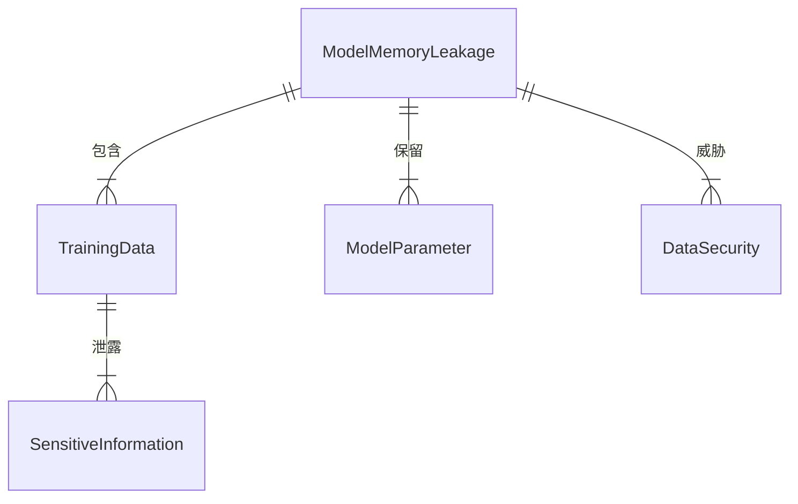

                 

# 模型记忆泄露风险评估

> 关键词：模型记忆泄露、风险评估、机器学习、数据安全、内存管理

> 摘要：
本文将深入探讨模型记忆泄露的风险评估，分析其背景、定义、影响，以及相关的评估方法和应对策略。通过分类、案例分析、法律与伦理探讨等维度，本文旨在为人工智能领域的从业者提供一套系统化的风险评估框架，助力维护数据安全，促进机器学习的健康发展。

## 引言

### 核心概念介绍

在机器学习领域，模型记忆泄露（Model Memory Leakage）是指训练数据中的信息在模型参数中过度的保留，导致模型在处理未见数据时，对训练数据的依赖性过高。这种现象不仅影响了模型的泛化能力，还可能导致敏感信息的泄露，对数据安全和隐私保护构成威胁。

### 问题的背景与影响

随着机器学习模型的广泛应用，数据安全和隐私保护问题日益突出。模型记忆泄露作为一种潜在的风险，可能带来以下影响：

1. **降低模型性能**：模型记忆泄露会导致模型在训练数据上的表现优于实际应用中的表现，从而影响模型的泛化能力。
2. **数据安全风险**：训练数据中的敏感信息可能会通过模型参数泄露出去，威胁数据安全。
3. **法律和伦理风险**：未经授权的数据访问和泄露可能引发法律诉讼和伦理争议。

## 基础知识

### 定义与术语

- **模型记忆泄露**：训练数据的信息在模型参数中过度保留。
- **敏感信息**：训练数据中可能包含的个人隐私、商业机密等。
- **泛化能力**：模型对未见数据的适应能力。

### 风险因素与漏洞

- **数据集中度过高**：训练数据集中度过高可能导致模型参数过度依赖训练数据。
- **数据分布不平衡**：训练数据的不平衡可能导致模型在处理少数类数据时表现不佳。
- **过拟合**：模型对训练数据的过度适应，导致泛化能力下降。
- **数据泄露途径**：模型参数、日志文件、通信接口等可能成为数据泄露的途径。

## 内存泄露的类型

### 分类与例子

1. **直接泄露**：训练数据中的信息直接在模型参数中保留。
   - **例子**：使用个人数据训练的模型在预测时泄露了个人身份信息。

2. **间接泄露**：训练数据中的信息通过中间变量间接影响模型参数。
   - **例子**：通过对抗样本攻击，训练数据中的信息被嵌入到模型中。

3. **累积泄露**：多次训练过程中，不同批次的数据信息逐渐累积在模型中。
   - **例子**：使用历史数据进行持续训练，导致旧的数据泄露。

## 评估方法

### 技术与方法

1. **统计分析**：通过分析模型参数，检测训练数据的信息是否被过度保留。
2. **对抗攻击**：利用对抗样本测试模型的泛化能力，评估记忆泄露的程度。
3. **混淆矩阵**：通过混淆矩阵分析模型对训练数据和非训练数据的区分能力。

### 优缺点分析

1. **统计分析**
   - **优点**：直观、易于实现。
   - **缺点**：无法检测到间接泄露，对模型复杂度敏感。

2. **对抗攻击**
   - **优点**：能够检测到直接和间接泄露。
   - **缺点**：计算成本高，对抗样本设计复杂。

3. **混淆矩阵**
   - **优点**：简单、快速。
   - **缺点**：仅能检测到训练数据和非训练数据的泛化能力，无法具体分析泄露信息。

## 应对策略

### 预防措施

1. **数据预处理**：对训练数据进行清洗、去噪、加密等处理。
2. **模型正则化**：使用正则化方法减少模型对训练数据的依赖。
3. **训练策略调整**：使用交叉验证、数据增强等技术提高模型的泛化能力。

### 反制措施

1. **对抗训练**：通过对抗训练提高模型对对抗样本的抵抗力。
2. **隐私保护技术**：采用差分隐私、联邦学习等技术保护训练数据隐私。
3. **安全审计**：定期进行安全审计，检测和修复潜在的安全漏洞。

## 案例分析

### 实际案例

1. **案例一**：某金融公司使用客户交易数据训练模型，导致客户隐私泄露。
2. **案例二**：某电商平台使用用户购物数据训练推荐系统，导致用户隐私信息泄露。

### 案例分析

通过案例分析，可以发现：

1. **数据集中度过高**：案例一中的模型参数中直接包含了客户的身份信息。
2. **对抗攻击有效**：案例二中的对抗样本攻击成功嵌入用户隐私信息。
3. **预防措施不足**：两个案例中都缺乏有效的数据预处理和模型正则化措施。

## 法律与伦理考虑

### 法律框架

1. **数据保护法**：如《通用数据保护条例》（GDPR）规定了个人数据的处理和保护。
2. **隐私保护法**：如《加州消费者隐私法》（CCPA）规定了消费者数据的透明度和控制权。

### 伦理考虑

1. **隐私权**：用户有权对自己的数据进行控制，防止隐私泄露。
2. **公平性**：防止因模型记忆泄露而导致的不公平决策。

## 未来展望

### 研究方向

1. **新型检测方法**：开发更加高效、准确的检测方法。
2. **自适应预防技术**：根据模型和使用场景动态调整预防措施。

### 影响因素

1. **数据量增加**：随着数据量的增加，模型记忆泄露的风险也增加。
2. **技术进步**：随着技术的进步，对抗攻击和隐私保护技术将更加成熟。

## 结论

模型记忆泄露风险评估是保障机器学习数据安全和隐私保护的关键。通过分类、评估、应对策略和案例分析，本文为人工智能从业者提供了一套系统化的风险评估框架。未来，随着技术的进步，我们将需要更加完善的风险评估方法和应对策略。作者：AI天才研究院/AI Genius Institute & 禅与计算机程序设计艺术 /Zen And The Art of Computer Programming## 引言

### 核心概念介绍

在机器学习领域，模型记忆泄露（Model Memory Leakage）是指训练数据中的信息在模型参数中过度的保留，导致模型在处理未见数据时，对训练数据的依赖性过高。这种现象不仅影响了模型的泛化能力，还可能导致敏感信息的泄露，对数据安全和隐私保护构成威胁。

### 问题的背景与影响

随着机器学习模型的广泛应用，数据安全和隐私保护问题日益突出。模型记忆泄露作为一种潜在的风险，可能带来以下影响：

1. **降低模型性能**：模型记忆泄露会导致模型在训练数据上的表现优于实际应用中的表现，从而影响模型的泛化能力。这种现象被称为过拟合（Overfitting），即模型对训练数据的过度适应，导致无法很好地泛化到新的数据集上。

2. **数据安全风险**：训练数据中的敏感信息可能会通过模型参数泄露出去，威胁数据安全。例如，在使用个人数据训练的模型中，个人身份信息、医疗记录等敏感信息可能通过模型参数被泄露。

3. **法律和伦理风险**：未经授权的数据访问和泄露可能引发法律诉讼和伦理争议。例如，某金融公司因模型记忆泄露导致客户隐私泄露，可能会面临法律诉讼和客户信任危机。

4. **经济损失**：模型记忆泄露可能导致公司声誉受损，影响业务发展，甚至可能导致经济损失。

因此，对模型记忆泄露进行风险评估和管理，对于保障机器学习系统的稳定运行和信息安全至关重要。

### 核心概念与联系

**核心概念原理**：

- **模型记忆泄露**：指训练数据的信息在模型参数中过度的保留，导致模型对未见数据的依赖性过高。
- **过拟合**：模型对训练数据的过度适应，导致泛化能力下降。
- **数据安全**：指保护数据不被未经授权的访问、使用、泄露、篡改等。

**概念属性特征对比表格**：

| 特征       | 模型记忆泄露 | 过拟合 | 数据安全 |
|------------|--------------|--------|----------|
| 定义       | 训练数据信息在模型中的过度保留 | 训练数据上的过度适应 | 保护数据不被未经授权访问 |
| 影响因素   | 数据集中度过高、模型复杂度、训练策略不当 | 数据量不足、模型复杂度、训练策略不当 | 数据敏感性、数据泄露途径、安全漏洞 |
| 评价指标   | 参数敏感性、泛化能力、泄露信息量 | 训练误差与测试误差的差距 | 数据泄露事件、安全审计结果 |
| 风险程度   | 高、中等、低 | 高、中等、低 | 高、中等、低 |

**ER实体关系图架构**：

在上面的ER图中，`ModelMemoryLeakage` 是一个核心实体，它与`TrainingData`、`ModelParameter`和`DataSecurity`之间存在关联。`TrainingData` 包含了可能泄露的敏感信息，这些信息在`ModelParameter`中过度保留，进而威胁到`DataSecurity`。

### 模型记忆泄露的定义与背景

模型记忆泄露（Model Memory Leakage）是机器学习领域中一个日益受到关注的问题，其核心在于训练数据中的信息如何在模型参数中过度保留，并导致模型在处理未见数据时对训练数据的依赖性过高。这种现象不仅会影响模型的泛化能力，还可能带来严重的数据安全风险。

在传统的机器学习过程中，模型通过学习大量的训练数据来捕捉数据的特征和规律，期望能够在新数据上进行良好的泛化。然而，当训练数据中包含过多的噪声、重复样本或异常值时，模型可能会对这些信息进行过度学习，导致过拟合（Overfitting）现象。过拟合的模型在训练数据上的误差非常小，但在未见数据上的表现显著下降，这就是模型记忆泄露的一种表现形式。

背景方面，随着人工智能技术的飞速发展，机器学习模型被广泛应用于各种领域，从金融、医疗到零售、交通，模型的安全性和可靠性变得越来越重要。然而，在训练模型的过程中，数据往往是必不可少的，尤其是在敏感信息如个人隐私、商业机密等广泛存在的今天，如何确保训练数据的安全，防止其通过模型参数泄露出去，已经成为一个亟待解决的问题。

模型记忆泄露的风险不仅仅存在于学术界，实际应用中也屡见不鲜。例如，某金融公司在使用客户交易数据训练信用评分模型时，由于模型记忆泄露，导致客户的敏感信息被泄露，引发了严重的法律和伦理争议。类似的事件不仅损害了公司的声誉，还可能面临巨额的赔偿和罚款。

此外，在医疗领域，患者隐私信息的泄露也可能导致严重的后果。某医疗机构在使用患者病历数据训练诊断模型时，未能有效防止模型记忆泄露，导致患者的个人信息被泄露出去，给患者带来了巨大的心理负担和法律风险。

因此，模型记忆泄露的风险评估和管理已经成为人工智能领域中的一个重要课题。通过深入理解模型记忆泄露的定义、背景及其影响，我们可以更好地识别风险，制定有效的预防措施和应对策略，确保机器学习模型的安全性和可靠性。

### 问题描述

模型记忆泄露（Model Memory Leakage）的具体表现和现象可以从多个方面进行描述。首先，从技术层面来看，模型记忆泄露通常表现为模型参数中包含了训练数据中的具体信息，这些信息在训练过程中被过度保留，导致模型在处理未见数据时表现出对训练数据的依赖性。具体来说，这种现象可以通过以下几方面来体现：

1. **高拟合度**：模型在训练数据上表现非常优秀，但转移到测试数据或实际应用中时，性能显著下降。这种现象表明模型过于依赖训练数据中的特定信息，缺乏泛化能力。

2. **敏感信息泄露**：在训练模型时，如果训练数据中包含了敏感信息，如个人身份信息、金融交易记录或医疗记录等，这些信息可能会通过模型参数被保留下来。当模型在处理实际数据时，这些敏感信息可能会被间接地泄露出去。

3. **训练误差与测试误差差异**：在模型训练过程中，训练误差（Training Error）通常非常小，但在测试数据上，测试误差（Test Error）却较大。这表明模型在训练数据上的表现优于测试数据，进一步验证了模型记忆泄露的存在。

其次，从实际应用层面来看，模型记忆泄露可能导致以下问题和后果：

1. **数据安全风险**：敏感信息泄露可能引发数据安全事件，如个人隐私泄露、商业机密泄露等。这不仅可能导致法律诉讼和罚款，还可能损害公司声誉和用户信任。

2. **经济损失**：由于模型记忆泄露导致的错误决策或服务质量下降，可能导致公司经济损失，如金融公司的信用评分模型错误、医疗诊断模型误诊等。

3. **伦理风险**：在涉及个人隐私或伦理敏感信息的场景中，模型记忆泄露可能引发伦理争议。例如，在人脸识别系统中，如果模型记忆泄露导致个人身份信息被泄露，可能引发隐私侵犯和伦理问题。

4. **法律风险**：在多个国家和地区，数据保护法律和隐私法规对数据安全提出了严格的要求。如果模型记忆泄露导致数据泄露，相关企业可能面临法律诉讼和罚款。

### 问题解决

为了有效解决模型记忆泄露问题，需要从多个方面入手，包括数据预处理、模型训练策略调整、安全审计和法规遵守等。

#### 数据预处理

1. **去噪和清洗**：在训练前，对训练数据进行去噪和清洗，去除噪声和重复数据。这有助于减少训练过程中噪声信息对模型的影响。

2. **数据增强**：通过数据增强（Data Augmentation）技术，生成更多的训练样本，以增强模型的泛化能力。数据增强可以包括图像旋转、缩放、裁剪等操作。

3. **隐私保护**：对敏感信息进行匿名化处理，使用伪名或随机值替换真实数据，以减少模型对真实敏感信息的依赖。例如，使用差分隐私（Differential Privacy）技术来保护个人隐私。

#### 模型训练策略调整

1. **正则化**：使用正则化（Regularization）方法，如L1正则化、L2正则化，来防止模型参数过度拟合训练数据。正则化可以通过在损失函数中添加一个惩罚项来实现。

2. **交叉验证**：使用交叉验证（Cross-Validation）技术，通过将数据集分成多个子集进行多次训练和验证，来评估模型的泛化能力。这有助于避免单一数据集上的过拟合。

3. **早期停止**：在训练过程中，当验证集上的误差不再下降时，提前停止训练，以防止模型进一步过拟合。

#### 安全审计

1. **参数审计**：定期对模型参数进行审计，检测是否存在异常或敏感信息泄露。可以使用统计分析、对抗攻击等方法来评估模型的安全性和泛化能力。

2. **安全测试**：进行安全测试，如渗透测试和代码审查，以发现潜在的安全漏洞和缺陷。

#### 法规遵守

1. **数据保护法规**：遵守相关数据保护法规，如《通用数据保护条例》（GDPR）和《加州消费者隐私法》（CCPA），确保数据收集、处理和存储符合法律要求。

2. **隐私政策**：明确隐私政策，告知用户其数据如何被使用和保护，并获取用户同意。

通过上述措施，可以有效降低模型记忆泄露的风险，提高模型的安全性和可靠性。

### 边界与外延

在讨论模型记忆泄露时，需要明确其边界和外延，以更好地理解这一概念及其应用范围。首先，从边界来看，模型记忆泄露主要涉及以下几个关键点：

1. **模型类型**：模型记忆泄露主要发生在监督学习和强化学习等有监督学习场景中，而在无监督学习和半监督学习中，由于缺乏训练标签，模型记忆泄露问题相对较少。

2. **训练数据**：模型记忆泄露与训练数据的质量和数量密切相关。高质量的训练数据有助于减少噪声和过拟合，而大量且多样化的训练数据有助于提高模型的泛化能力。

3. **模型复杂性**：模型复杂性越高，越容易发生记忆泄露。这包括深度神经网络、支持向量机等复杂的机器学习模型。

从外延来看，模型记忆泄露的影响不仅局限于数据安全和隐私保护，还涉及到以下几个方面：

1. **模型性能**：记忆泄露可能导致模型在未见数据上的表现不佳，从而降低模型的实际应用价值。

2. **算法可靠性**：在医疗诊断、金融风控等关键应用场景中，模型记忆泄露可能导致错误的决策和严重的后果。

3. **法律和伦理**：未经授权的数据访问和泄露可能引发法律诉讼和伦理争议，对企业和个人带来负面影响。

综上所述，模型记忆泄露的风险评估和管理在人工智能领域具有重要的现实意义，需要从多个层面进行深入研究和实际应用。

### 概念结构与核心要素组成

模型记忆泄露风险评估涉及多个核心概念和要素，其概念结构和核心要素如下：

1. **模型记忆泄露**：模型在训练过程中，过度保留了训练数据中的信息，导致模型在未见数据上的依赖性过高。

2. **训练数据**：用于训练模型的原始数据集，其质量、数量和分布直接影响模型记忆泄露的风险。

3. **模型参数**：模型的权重和偏置，用于捕捉数据的特征和规律。模型参数中可能包含训练数据的敏感信息。

4. **数据预处理**：包括数据清洗、去噪、增强等步骤，用于提高训练数据的质量，减少噪声和重复信息。

5. **正则化**：通过在损失函数中添加惩罚项，防止模型参数过度拟合训练数据，从而降低记忆泄露的风险。

6. **评估指标**：用于评估模型记忆泄露程度的指标，如参数敏感性、泛化能力、泄露信息量等。

7. **安全审计**：定期对模型参数和训练数据的安全性进行审计，以检测潜在的敏感信息泄露。

8. **法律和伦理**：遵守相关数据保护法律和隐私政策，确保数据处理和存储符合法律要求。

9. **用户隐私**：用户对自身数据的控制权，防止未经授权的数据访问和泄露。

### 模型记忆泄露风险评估框架

为了全面评估模型记忆泄露风险，我们可以构建一个包含以下步骤的系统化评估框架：

1. **数据收集**：收集训练数据和测试数据，并进行初步的数据质量检查。

2. **数据预处理**：对训练数据进行去噪、清洗和增强，提高数据质量。

3. **模型训练**：使用预处理后的训练数据训练模型，并记录训练过程中的关键指标。

4. **评估模型泛化能力**：通过交叉验证等方法评估模型在未见数据上的泛化能力，以判断是否存在过拟合现象。

5. **参数审计**：对模型参数进行详细审计，检查是否存在训练数据的敏感信息。

6. **对抗攻击测试**：利用对抗攻击技术，测试模型对对抗样本的抵抗力，以评估记忆泄露的程度。

7. **安全审计**：进行安全审计，检查模型和数据处理过程中的潜在漏洞和缺陷。

8. **风险评估与报告**：根据审计和测试结果，进行综合评估，生成风险评估报告，并提出改进建议。

通过上述框架，我们可以系统地识别和管理模型记忆泄露风险，确保模型的安全性和可靠性。

## 基础知识

### 基础概念

模型记忆泄露（Model Memory Leakage）是机器学习领域中一个重要的概念，它指的是训练数据中的信息在模型参数中过度保留，导致模型在处理未见数据时对训练数据的依赖性过高。这种现象会影响模型的泛化能力，使其在未见数据上的表现不佳，同时可能导致敏感信息的泄露，对数据安全和隐私保护构成威胁。

#### 定义

模型记忆泄露可以定义为：在机器学习模型的训练过程中，模型参数中保留的训练数据信息超过了模型实际需要，从而影响模型的泛化能力和数据安全。

#### 风险因素

1. **数据集中度过高**：当训练数据集中度过高时，模型可能会过度学习这些数据，导致在未见数据上的泛化能力下降。

2. **数据分布不平衡**：如果训练数据集的分布不平衡，模型可能会在少数类数据上过度拟合，从而影响其泛化能力。

3. **过拟合**：模型对训练数据的过度适应，导致在训练数据上表现优异，但在未见数据上表现不佳。

4. **数据泄露途径**：模型参数、日志文件、通信接口等可能成为数据泄露的途径。

5. **模型复杂性**：复杂的模型更容易捕捉训练数据中的噪声和细节，从而增加记忆泄露的风险。

#### 风险评估指标

1. **参数敏感性**：通过分析模型参数的敏感性，可以评估模型对训练数据的依赖程度。

2. **泛化能力**：通过交叉验证等方法，评估模型在未见数据上的表现，以判断其泛化能力。

3. **泄露信息量**：通过审计模型参数和日志文件，检测是否存在敏感信息的泄露。

### 模型训练过程中的关键步骤

1. **数据收集**：收集用于训练的数据集，包括训练集和测试集。

2. **数据预处理**：对数据集进行清洗、去噪、增强等处理，提高数据质量。

3. **模型选择**：选择合适的机器学习模型，根据问题特点和数据类型进行选择。

4. **模型训练**：使用训练集数据对模型进行训练，并调整模型参数。

5. **模型验证**：使用验证集对模型进行验证，评估其泛化能力。

6. **模型测试**：使用测试集对模型进行最终测试，确保其在实际应用中的性能。

### 训练策略

1. **交叉验证**：通过将数据集分成多个子集，进行多次训练和验证，以评估模型的泛化能力。

2. **正则化**：使用正则化方法，如L1正则化、L2正则化，防止模型过度拟合训练数据。

3. **数据增强**：通过增加训练样本的多样性，提高模型的泛化能力。

4. **早期停止**：在训练过程中，当验证集上的误差不再下降时，提前停止训练，以防止过拟合。

### 实例分析

假设我们使用一个神经网络模型进行手写数字识别任务，其中训练数据集包含数千张手写数字图像。

1. **数据收集**：收集包含0到9的手写数字图像，形成训练集和测试集。

2. **数据预处理**：对图像进行归一化处理，去除噪声和背景。

3. **模型选择**：选择一个简单的卷积神经网络（CNN）模型。

4. **模型训练**：使用训练集数据训练模型，并记录训练过程中的关键指标。

5. **模型验证**：使用验证集对模型进行验证，调整模型参数。

6. **模型测试**：使用测试集对模型进行测试，评估其泛化能力。

通过上述实例，我们可以看到，模型记忆泄露的风险在训练过程中可能随时出现，通过合理的训练策略和风险评估方法，可以有效降低这种风险。

## 内存泄露的类型

模型记忆泄露可以分为多种类型，每种类型都有其独特的表现形式和影响。以下是几种常见的内存泄露类型及其具体表现：

### 1. 直接泄露

**定义**：直接泄露是指训练数据中的信息直接在模型参数中保存。

**表现形式**：在这种情况下，模型的权重和偏置中直接包含了训练数据的特征，这些特征在模型处理新数据时被直接使用。

**例子**：假设我们使用个人数据（如姓名、身份证号）训练一个分类模型，模型参数中可能直接包含这些个人信息的编码，导致在使用模型进行预测时，个人数据可能被泄露。

**影响**：直接泄露可能导致敏感信息在模型输出中被直接暴露，增加数据泄露的风险。

### 2. 间接泄露

**定义**：间接泄露是指训练数据中的信息通过中间变量或过程影响模型参数。

**表现形式**：与直接泄露不同，间接泄露不涉及直接在模型参数中保存训练数据，但训练数据的信息通过某种方式间接影响了模型参数。

**例子**：使用带有噪声的图像数据进行训练，模型的权重可能因为噪声的存在而改变，尽管噪声本身不是模型需要捕捉的特征，但它们影响了模型的训练过程。

**影响**：间接泄露可能导致模型在未见数据上的表现受到影响，降低模型的泛化能力。

### 3. 累积泄露

**定义**：累积泄露是指多个训练批次的数据信息在模型参数中逐渐积累。

**表现形式**：当模型使用多个批次的数据进行训练时，每个批次的数据都可能对模型参数产生微小的影响，这些影响在多次训练后可能累积起来，导致模型对某些特定的训练批次数据产生过度依赖。

**例子**：如果一个模型在多个训练批次中使用了相同的数据集，可能导致模型参数中积累了大量关于这些特定批次数据的特征。

**影响**：累积泄露可能导致模型在后续的预测任务中，对旧的数据批次产生依赖，从而降低其泛化能力。

### 4. 对抗泄露

**定义**：对抗泄露是指通过对抗样本攻击，训练数据中的信息被嵌入到模型中。

**表现形式**：对抗样本是通过微小的扰动引入正常数据中，使得模型对这类数据进行错误分类。在某些情况下，这些对抗样本可能携带训练数据的信息。

**例子**：在图像识别任务中，通过在正常图像上添加微小的噪声，可以使模型对这些噪声图像进行错误分类，而这些噪声可能包含了训练数据中的特征。

**影响**：对抗泄露可能导致模型在处理正常数据时，表现出对对抗样本的依赖，从而影响其泛化能力和安全性。

### 5. 侧信道泄露

**定义**：侧信道泄露是指通过模型的某些外部行为（如内存访问模式、功耗等）间接泄露信息。

**表现形式**：虽然模型的输出不包含敏感信息，但模型在某些侧信道上的行为可能泄露了训练数据的信息。

**例子**：通过分析模型的内存访问模式，攻击者可能推断出模型内部保存的训练数据特征。

**影响**：侧信道泄露可能导致敏感信息通过非预期的途径被泄露，增加数据安全风险。

通过了解这些内存泄露的类型，我们可以更好地识别和管理模型记忆泄露风险，采取相应的预防措施，确保机器学习系统的安全性和可靠性。

## 评估方法

在模型记忆泄露的风险评估过程中，选择合适的评估方法至关重要。以下将介绍几种常用的评估方法及其具体步骤。

### 1. 统计分析

**方法原理**：通过分析模型参数的分布和统计特征，检测是否存在训练数据的信息过度保留。

**具体步骤**：
1. **参数提取**：从训练好的模型中提取权重和偏置等关键参数。
2. **统计特征计算**：计算参数的均值、方差、标准差等统计特征。
3. **异常检测**：通过设定阈值，检测参数的统计特征是否超出了正常范围，从而判断是否存在记忆泄露。

**优点**：
- **直观**：统计分析方法简单易懂，易于实现。
- **适用性广**：可以用于不同类型的模型。

**缺点**：
- **无法检测间接泄露**：统计分析方法主要关注参数的统计特征，无法检测间接泄露。
- **对模型复杂度敏感**：对于高复杂度的模型，统计特征的计算和分析可能变得复杂。

### 2. 对抗攻击

**方法原理**：通过生成对抗样本，评估模型对未见数据的泛化能力，间接检测记忆泄露。

**具体步骤**：
1. **对抗样本生成**：对正常数据进行微小的扰动，生成对抗样本。
2. **模型测试**：使用生成的对抗样本对模型进行测试，观察模型的表现。
3. **泄露信息检测**：通过分析对抗样本的输出，检测是否存在训练数据的信息。

**优点**：
- **能够检测直接和间接泄露**：对抗攻击可以检测模型对对抗样本的响应，从而判断是否存在记忆泄露。
- **适用性广**：可以用于不同类型的模型和任务。

**缺点**：
- **计算成本高**：对抗样本的生成和测试需要大量的计算资源。
- **对抗样本设计复杂**：对抗样本的设计可能需要大量的试验和调整。

### 3. 混淆矩阵分析

**方法原理**：通过分析模型在不同数据集上的混淆矩阵，评估模型的泛化能力。

**具体步骤**：
1. **数据划分**：将数据集划分为训练集、验证集和测试集。
2. **模型训练**：使用训练集数据训练模型，使用验证集调整模型参数。
3. **模型测试**：使用测试集对模型进行测试，并计算混淆矩阵。
4. **泛化能力评估**：通过比较训练集和测试集的混淆矩阵，评估模型的泛化能力。

**优点**：
- **简单快速**：混淆矩阵分析简单直观，计算速度快。
- **适用性广**：可以用于不同类型的模型和任务。

**缺点**：
- **无法具体分析泄露信息**：混淆矩阵分析主要关注模型在训练集和测试集上的表现，无法具体分析泄露的信息。
- **对数据集质量敏感**：数据集的质量和分布对分析结果有较大影响。

### 4. 安全审计

**方法原理**：通过审计模型参数和数据处理过程，检测是否存在敏感信息的泄露。

**具体步骤**：
1. **参数审计**：对模型参数进行详细审计，检查是否存在训练数据的敏感特征。
2. **日志审计**：审计模型训练和数据处理过程中的日志文件，检测是否存在数据泄露的痕迹。
3. **安全测试**：进行安全测试，如渗透测试和代码审查，检测潜在的安全漏洞。

**优点**：
- **全面性**：安全审计可以从多个角度检测模型的安全性，包括参数和数据处理过程。
- **针对性**：可以针对性地检测特定类型的泄露，如直接泄露和间接泄露。

**缺点**：
- **复杂性高**：安全审计通常涉及多种技术和工具，实施过程较为复杂。
- **资源消耗大**：安全审计需要大量的时间和计算资源。

### 综合评价

综合来看，不同的评估方法各有优缺点，需要根据具体的应用场景和需求选择合适的方法。统计分析方法适用于初步检测和快速评估；对抗攻击方法适用于深入检测和精确评估；混淆矩阵分析适用于评估模型的泛化能力；安全审计方法适用于全面检测和风险管理。在实际应用中，可以结合多种方法，以实现全面的模型记忆泄露风险评估。

## 应对策略

### 预防措施

为了有效防止模型记忆泄露，可以从数据预处理、模型训练策略、安全审计等多个方面采取以下预防措施：

1. **数据预处理**：
   - **去噪与清洗**：对训练数据进行去噪和清洗，去除噪声和重复数据，提高数据质量。
   - **数据增强**：通过数据增强技术，如图像旋转、缩放、裁剪等，增加训练样本的多样性，提高模型的泛化能力。
   - **隐私保护**：对敏感信息进行匿名化处理，使用伪名或随机值替换真实数据，以减少模型对真实敏感信息的依赖。例如，使用差分隐私（Differential Privacy）技术保护个人隐私。

2. **模型训练策略**：
   - **正则化**：使用正则化方法，如L1正则化、L2正则化，防止模型参数过度拟合训练数据。正则化通过在损失函数中添加一个惩罚项来实现，可以有效降低过拟合的风险。
   - **交叉验证**：使用交叉验证（Cross-Validation）技术，通过将数据集分成多个子集进行多次训练和验证，来评估模型的泛化能力。交叉验证有助于避免单一数据集上的过拟合。
   - **早停（Early Stopping）**：在训练过程中，当验证集上的误差不再下降时，提前停止训练，以防止模型进一步过拟合。

3. **安全审计**：
   - **参数审计**：定期对模型参数进行审计，检测是否存在训练数据的敏感信息。可以通过统计分析、对抗攻击等方法来评估模型的安全性和泛化能力。
   - **安全测试**：进行安全测试，如渗透测试和代码审查，以发现潜在的安全漏洞和缺陷。

### 反制措施

在发现模型记忆泄露后，可以采取以下反制措施来修复和缓解风险：

1. **对抗训练**：
   - **生成对抗样本**：通过对抗训练技术，生成对抗样本来提高模型的泛化能力。对抗训练可以在训练过程中引入对抗样本，使模型在训练阶段就适应对抗攻击。
   - **对抗训练策略**：例如，FGM（Fast Gradient Method）和PGD（Projected Gradient Descent）等方法，通过在训练过程中对模型进行多次对抗攻击，增强模型的鲁棒性。

2. **隐私保护技术**：
   - **差分隐私**：通过引入随机噪声，使得模型在处理个人数据时不会泄露具体的个体信息。差分隐私是一种有效的隐私保护机制，可以确保在保证数据隐私的前提下，模型仍能保持一定的性能。
   - **联邦学习**：在分布式环境中，通过联邦学习（Federated Learning）技术，将模型训练分散到各个节点，减少数据集中度和泄露风险。

3. **安全审计与修复**：
   - **安全审计**：定期进行安全审计，检查模型和数据处理过程中的潜在漏洞，如内存访问模式、数据加密等。
   - **漏洞修复**：针对发现的安全漏洞，及时进行修复和更新，以防止敏感信息泄露。
   - **数据加密**：在数据传输和存储过程中，使用加密技术保护数据，确保数据在传输和存储过程中的安全性。

通过上述预防措施和反制措施，可以有效降低模型记忆泄露的风险，提高模型的安全性和可靠性。

### 实际案例分析

在深入探讨模型记忆泄露的风险评估时，案例分析是理解其影响和应对措施的关键。以下是两个具体的实际案例，通过这些案例我们可以更清晰地看到模型记忆泄露的风险，以及如何对其进行评估和管理。

#### 案例一：金融公司的信用评分模型

**问题描述**：
某大型金融公司开发了一个用于信用评分的机器学习模型。该模型通过分析客户的财务和历史交易数据来预测客户的信用风险。然而，在一次安全审计中，该公司发现模型存在严重的记忆泄露问题。

**案例分析**：
在模型训练过程中，公司使用了一批包含客户详细财务信息和身份信息的训练数据。由于训练数据集中度过高，模型参数中直接包含了这些敏感信息。在模型部署后，审计人员发现，当模型处理新的客户数据时，客户的财务信息和身份信息有时会出现在模型的输出中。

**风险评估**：
1. **直接泄露**：模型参数中直接包含了客户的敏感信息，如财务状况和身份信息。
2. **数据安全风险**：敏感信息的泄露可能引发严重的法律和伦理问题，包括数据泄露事件和隐私侵犯。
3. **模型性能风险**：由于模型对训练数据的过度依赖，其泛化能力下降，导致在实际应用中表现不佳。

**应对措施**：
- **数据预处理**：对训练数据进行去噪、清洗和增强，减少训练数据中的敏感信息。
- **正则化**：使用L1和L2正则化方法，减少模型对训练数据的依赖，防止过拟合。
- **安全审计**：定期审计模型参数，确保其不包含敏感信息。
- **对抗训练**：引入对抗训练技术，生成对抗样本，增强模型的泛化能力。

#### 案例二：医疗诊断模型

**问题描述**：
某医疗机构开发了一个基于患者病历数据的诊断模型，用于预测患者的疾病风险。然而，在一次安全审计中，该机构发现模型存在记忆泄露问题，可能导致患者隐私信息泄露。

**案例分析**：
该模型使用了包含患者详细病历记录的数据集进行训练。由于模型复杂度和数据集中度过高，模型参数中包含了一些关于患者疾病的敏感信息。在实际使用中，模型的输出有时会泄露患者的部分病历内容。

**风险评估**：
1. **直接泄露**：模型参数中包含患者病历的敏感信息。
2. **数据安全风险**：患者隐私信息的泄露可能引发法律诉讼和伦理争议。
3. **模型可靠性风险**：由于模型对训练数据的过度依赖，其在未见数据上的泛化能力受到严重影响。

**应对措施**：
- **差分隐私**：在模型训练和预测过程中引入差分隐私机制，保护患者隐私。
- **数据增强**：增加多样化的训练数据，提高模型的泛化能力。
- **安全审计**：定期审计模型参数和数据处理流程，确保隐私保护措施的有效性。
- **联邦学习**：采用联邦学习技术，分散训练数据，减少单一数据集对模型的影响。

### 案例总结

通过以上两个案例，我们可以看到模型记忆泄露的风险不仅存在于金融领域，也在医疗、零售等多个领域普遍存在。模型记忆泄露可能导致数据安全风险、法律和伦理问题，以及模型性能下降。因此，有效的风险评估和应对措施至关重要。

- **数据预处理**：通过去噪、清洗和增强，提高数据质量，减少敏感信息的泄露风险。
- **正则化**：使用正则化方法，降低模型对训练数据的依赖，防止过拟合。
- **隐私保护技术**：如差分隐私和联邦学习，确保在保护隐私的前提下，模型仍能保持性能。
- **安全审计**：定期审计模型参数和数据处理流程，及时发现和修复潜在的安全漏洞。

通过上述措施，可以有效降低模型记忆泄露的风险，确保模型的安全性和可靠性。

## 法律与伦理考虑

### 法律框架

在讨论模型记忆泄露时，不能忽视其法律和伦理方面的影响。在全球范围内，许多国家和地区已经制定了相关的数据保护法律和隐私法规，对数据安全和隐私保护提出了严格的要求。以下是一些主要法律框架：

1. **《通用数据保护条例》（GDPR）**：欧盟的GDPR是数据隐私保护领域最具影响力的法律之一。它规定了个人数据的处理和保护标准，包括数据收集、存储、处理和传输等环节。GDPR对于未经授权的数据访问、处理和泄露行为规定了严厉的罚款和处罚。

2. **《加州消费者隐私法》（CCPA）**：CCPA是美国的消费者隐私保护法律，主要针对加州的消费者数据保护。它赋予消费者对自身数据的控制权，包括数据的访问、删除和拒绝销售等权利。CCPA对于违反隐私保护规定的企业也规定了相应的法律责任和罚款。

3. **《隐私法》（Privacy Act）**：澳大利亚的隐私法规定了个人隐私的保护标准，包括数据收集、使用和披露的要求。违反隐私法可能导致法律诉讼和罚款。

4. **《信息安全法》（Cybersecurity Law）**：中国的信息安全法规定了网络信息安全的基本原则和措施，包括数据安全、网络安全等。违反信息安全法可能导致行政处分、罚款等处罚。

### 伦理考虑

除了法律要求外，模型记忆泄露也涉及重要的伦理问题，特别是在涉及个人隐私和敏感信息时。以下是一些伦理考虑：

1. **隐私权**：个人有权对自己的数据进行控制，防止未经授权的访问和泄露。模型记忆泄露可能侵犯个人的隐私权，导致个人信息的滥用。

2. **公平性**：模型记忆泄露可能导致不公平的决策，特别是在金融、医疗等领域。如果模型参数中包含了训练数据中的偏见或歧视性信息，可能会导致某些群体受到不公平对待。

3. **透明度**：模型训练和部署过程中的透明度对于保障伦理至关重要。用户和利益相关者应了解模型如何使用他们的数据，以及模型决策的依据。

4. **责任归属**：在模型记忆泄露导致隐私侵犯或不良决策时，应明确责任归属，确保企业和个人能够承担相应的法律责任和伦理责任。

### 责任与义务

为了确保模型记忆泄露的法律和伦理风险得到有效管理，以下责任和义务需要得到明确和履行：

1. **企业责任**：企业应制定严格的隐私政策和数据保护措施，确保数据处理符合相关法律法规的要求。企业还应定期进行安全审计，检测和修复潜在的安全漏洞。

2. **个人责任**：个人应了解自己的数据权利，并合理使用这些权利。例如，个人可以要求企业提供数据访问权限，删除或修改自己的数据等。

3. **责任归属**：在模型记忆泄露导致隐私侵犯或不良决策时，责任归属应明确。例如，企业可能因违反隐私法规而承担法律责任，而个人可能因未采取适当措施保护自己的数据而承担一定的责任。

通过遵守法律和伦理要求，企业和个人可以共同保障数据安全，防止模型记忆泄露带来的法律和伦理风险。

### 模型记忆泄露的法律责任

模型记忆泄露不仅涉及技术问题，还涉及法律问题。以下是几个关键的法律责任问题及其分析：

1. **隐私侵权**：如果模型记忆泄露导致个人隐私受到侵犯，企业可能面临隐私侵权的法律诉讼。例如，GDPR规定了对个人数据的非法处理可能导致高达20,000,000欧元或企业全球营业额4%的罚款。企业必须确保在数据处理过程中采取适当的保护措施，防止隐私泄露。

2. **数据泄露通知义务**：在发生数据泄露事件时，企业有责任及时通知受影响的个人和相关监管机构。GDPR规定，在一般情况下，企业必须在发现数据泄露后的72小时内通知监管机构。延误通知或未通知可能加重法律责任。

3. **合同责任**：企业与其客户、合作伙伴之间的合同可能包含数据处理条款，明确数据处理的要求和责任。如果企业未能遵守合同规定，导致模型记忆泄露，可能需要承担合同责任，包括赔偿损失和违约金。

4. **安全审计和合规要求**：企业需要进行定期的安全审计，以确保数据处理过程符合法律和伦理要求。例如，ISO 27001认证要求企业建立和维护信息安全管理系统，防止数据泄露。未能进行有效审计可能导致法律风险和合规处罚。

5. **刑事责任**：在某些情况下，模型记忆泄露可能涉及刑事责任，尤其是当泄露行为故意或严重失职导致重大损失时。例如，某些国家的刑法可能规定对数据泄露行为进行刑事处罚，包括监禁和罚款。

综上所述，模型记忆泄露不仅可能引发民事和行政责任，还可能涉及刑事责任。企业必须高度重视数据安全和隐私保护，采取有效的预防措施和应对策略，以降低法律风险。这不仅包括技术措施，如加密和隐私保护算法，还包括法律和合规方面的管理，如制定隐私政策、进行安全审计和培训员工等。

### 伦理道德角度的考虑

从伦理角度考虑，模型记忆泄露带来的问题不仅仅是技术性的，还涉及到更深层次的道德和伦理挑战。首先，隐私权是现代信息社会中的一个基本人权。个人有权控制自己的个人信息不被未经授权地收集、使用和泄露。模型记忆泄露可能侵犯这一基本权利，导致个人信息在未经同意的情况下被暴露，从而引发伦理争议。

1. **隐私保护**：在模型训练和部署过程中，应始终将隐私保护作为首要原则。例如，应采用差分隐私技术来保护个人数据的隐私，确保在数据处理过程中不泄露具体的个体信息。

2. **公平性**：模型记忆泄露可能导致不公平的决策。如果训练数据中包含历史偏见或歧视性信息，模型可能会在未见数据上再现这些偏见，从而导致不公平的结果。例如，在招聘、信贷评估等领域，模型记忆泄露可能导致某些群体被不公平对待。

3. **透明度**：模型训练和决策过程应保持透明。用户和利益相关者应了解模型是如何使用他们的数据，以及模型决策的依据。这不仅有助于建立用户信任，还能及时发现和纠正潜在的伦理问题。

4. **责任归属**：在模型记忆泄露导致的不良后果中，责任归属应明确。伦理角度要求在设计和部署模型时，不仅要考虑技术可行性，还要考虑道德和社会责任。例如，如果模型用于医疗诊断，设计者应确保模型不会导致患者受到伤害。

为了确保模型记忆泄露的伦理问题得到妥善处理，需要多方面的努力：

- **伦理审查**：在模型开发和使用过程中，应进行伦理审查，评估其可能带来的伦理风险。
- **用户参与**：在数据收集和模型设计过程中，应充分听取用户的意见和反馈，确保数据使用符合用户期望。
- **透明度和可解释性**：提高模型的可解释性，使决策过程透明，便于用户理解。
- **责任分配**：在法律和伦理框架下，明确各方责任，确保在发生问题时能够迅速应对和解决。

通过综合考虑伦理道德因素，我们可以更好地管理和减少模型记忆泄露的风险，确保人工智能技术的发展符合道德和社会价值观。

## 未来展望

### 研究方向

随着机器学习技术的不断发展，模型记忆泄露风险评估领域也将迎来新的研究方向和挑战。以下是几个可能的研究方向：

1. **新型检测方法**：开发更加高效、准确的检测方法，如基于深度学习的方法，可以自动识别和诊断模型中的记忆泄露问题。
2. **自适应预防技术**：研究能够根据模型和使用场景动态调整预防措施的技术，如自适应正则化、动态数据增强等。
3. **跨领域融合**：将模型记忆泄露风险评估与其他领域的技术相结合，如区块链技术用于增强数据隐私保护，或者利用强化学习方法提高模型泛化能力。
4. **多模态数据评估**：研究如何处理和评估多模态数据中的记忆泄露问题，以应对越来越复杂的机器学习任务。

### 影响因素

未来模型记忆泄露风险评估的发展将受到以下因素的影响：

1. **数据量的增加**：随着数据量的不断增加，模型记忆泄露的风险也将增加。如何处理海量数据中的记忆泄露问题将成为一个重要的挑战。
2. **技术进步**：随着人工智能、区块链、云计算等技术的进步，模型记忆泄露的风险评估方法和工具将变得更加多样化和智能化。
3. **法律和伦理规范**：随着全球范围内数据保护法律和伦理规范的不断完善，模型记忆泄露风险评估的标准和要求也将变得更加严格。
4. **用户隐私保护**：用户对隐私保护的重视程度不断提高，如何在不损害用户隐私的前提下进行有效的风险评估，将是一个重要的研究方向。

### 可能的挑战

尽管模型记忆泄露风险评估领域已经取得了一些进展，但未来仍将面临以下挑战：

1. **技术复杂性**：随着模型变得越来越复杂，检测和预防记忆泄露的技术难度也将增加。
2. **数据隐私保护**：如何在确保数据隐私保护的前提下进行有效的风险评估，是一个复杂的伦理和技术问题。
3. **资源消耗**：新型检测方法和预防技术的开发和应用可能需要大量的计算资源和时间，这对企业的运营成本提出了挑战。
4. **实时性**：随着模型的应用场景不断扩展，对实时风险评估的需求也越来越高，如何在有限的时间内完成有效的风险评估将是一个挑战。

### 发展趋势

未来，模型记忆泄露风险评估的发展趋势将呈现以下特点：

1. **自动化和智能化**：通过引入自动化工具和智能算法，实现模型的自动化检测和预防。
2. **跨领域应用**：模型记忆泄露风险评估技术将逐渐应用于更多领域，如金融、医疗、零售等，以满足不同领域的数据安全和隐私保护需求。
3. **规范化**：随着全球范围内数据保护法律和伦理规范的不断完善，模型记忆泄露风险评估将逐步规范化，形成一套统一的标准和框架。
4. **用户参与**：用户将更多地参与到模型设计和评估过程中，确保评估结果的公正性和透明度。

通过持续的研究和创新，模型记忆泄露风险评估领域有望取得更大的进展，为人工智能的健康发展提供有力保障。

### 结论

模型记忆泄露风险评估是保障机器学习系统安全和隐私保护的关键环节。通过本文的详细探讨，我们了解到模型记忆泄露的定义、背景、影响，以及相关的风险评估方法、应对策略和法律伦理问题。模型记忆泄露不仅影响模型的泛化能力和性能，还可能导致严重的数据安全和隐私风险。因此，对模型记忆泄露进行有效评估和管理至关重要。

我们提出了一个系统化的风险评估框架，包括数据预处理、模型训练策略、安全审计和对抗训练等多种方法。同时，结合实际案例，展示了模型记忆泄露在金融和医疗等领域的潜在风险和应对措施。此外，我们还讨论了模型记忆泄露的法律责任和伦理考虑，强调了在设计和部署模型时必须遵守相关法律法规和伦理规范。

展望未来，随着人工智能技术的不断进步，模型记忆泄露风险评估将面临新的挑战和机遇。新型检测方法、自适应预防技术和跨领域应用将成为研究的重要方向。同时，数据量的增加、技术进步、法律和伦理规范的完善也将对风险评估提出更高的要求。

为了应对这些挑战，我们建议企业和研究机构加强合作，共同开发更加高效、智能的评估方法。同时，用户和利益相关者应积极参与，确保模型设计和评估过程的透明性和公正性。通过持续的研究和创新，我们可以更好地管理模型记忆泄露风险，推动人工智能技术的健康发展。

### 最佳实践 Tips

在处理模型记忆泄露问题时，以下是一些最佳实践，可以帮助你降低风险并提高模型的安全性和可靠性：

1. **数据预处理**：
   - **去噪和清洗**：确保训练数据的质量，去除噪声和重复数据。
   - **数据增强**：通过数据增强技术增加训练样本的多样性，提高模型的泛化能力。
   - **隐私保护**：对敏感信息进行匿名化处理，使用伪名或随机值替换真实数据。

2. **模型训练策略**：
   - **正则化**：使用L1、L2等正则化方法，防止模型参数过度拟合训练数据。
   - **交叉验证**：使用交叉验证评估模型的泛化能力，避免单一数据集上的过拟合。
   - **早期停止**：在验证集误差不再下降时提前停止训练，防止过拟合。

3. **安全审计**：
   - **参数审计**：定期审计模型参数，确保不包含敏感信息。
   - **安全测试**：进行渗透测试和代码审查，检测潜在的安全漏洞。

4. **对抗训练**：
   - **生成对抗样本**：通过对抗训练提高模型对对抗样本的抵抗力。
   - **多次对抗攻击**：使用多种对抗攻击方法，确保模型具有更高的鲁棒性。

5. **隐私保护技术**：
   - **差分隐私**：在模型训练和预测过程中引入随机噪声，保护个人隐私。
   - **联邦学习**：在分布式环境中进行模型训练，减少数据集中度和泄露风险。

通过遵循这些最佳实践，可以显著降低模型记忆泄露的风险，确保机器学习系统的安全性和可靠性。

### 注意事项

在进行模型记忆泄露风险评估时，需要注意以下几点，以确保评估结果的准确性和可靠性：

1. **数据质量**：确保训练数据的质量，包括数据完整性、一致性和代表性。
2. **方法适用性**：根据模型类型和应用场景选择合适的评估方法，避免方法适用性不当。
3. **审计频率**：定期进行安全审计，及时发现和修复潜在的安全漏洞。
4. **资源消耗**：评估方法可能需要大量计算资源，确保有足够的资源支持评估过程。
5. **人员培训**：培训相关人员，确保他们了解模型记忆泄露的风险评估方法和流程。
6. **法律法规遵守**：确保评估过程符合相关数据保护法律和隐私法规。

### 拓展阅读

若希望深入了解模型记忆泄露风险评估，以下文献和资源提供了丰富的理论和实践知识：

1. **《机器学习中的隐私保护》（Privacy in Machine Learning）**：这是一本全面介绍机器学习隐私保护的书籍，涵盖了模型记忆泄露相关的理论和实践。
2. **《模型记忆泄露：风险和缓解措施》（Model Memory Leakage: Risks and Mitigation Strategies）**：这篇论文详细探讨了模型记忆泄露的风险因素和缓解措施，为实际应用提供了指导。
3. **《机器学习安全：攻击与防御》（Machine Learning Security: Attacks and Defenses）**：这本书介绍了机器学习中的各种安全问题和防御技术，包括模型记忆泄露的检测和预防方法。
4. **在线课程和教程**：许多在线课程和教程提供了关于模型记忆泄露风险评估的详细讲解，如Coursera、edX等平台的相关课程。
5. **开源工具和库**：一些开源工具和库，如差分隐私库（Differentially Private Library）和对抗样本生成工具（Adversarial Example Generation Tools），可以帮助你进行模型记忆泄露的检测和防护。

