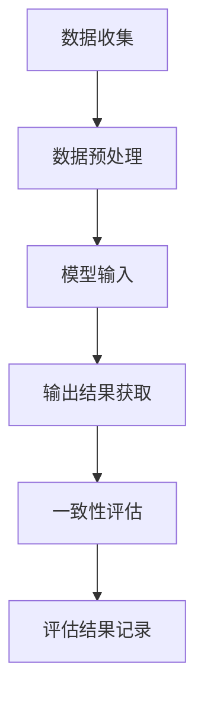
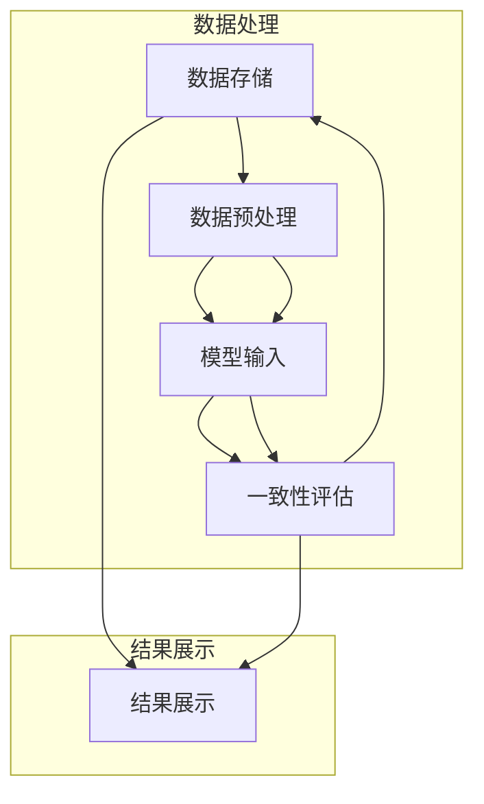
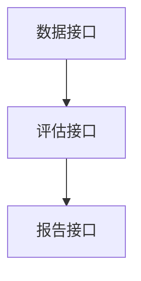
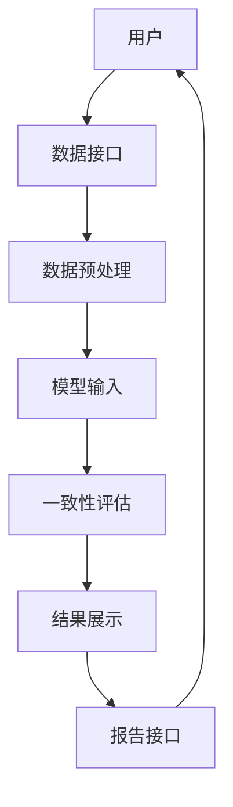

                 


### 《模型评测中的prompt一致性分析》

#### 关键词：
- 模型评测
- prompt一致性
- 数学模型
- 算法原理
- 系统分析与架构设计

#### 摘要：
本文深入探讨了模型评测中的prompt一致性分析，旨在揭示prompt一致性在模型性能评估中的重要性。文章首先定义了prompt一致性的概念，探讨了其背景和问题，随后介绍了相关的数学模型和公式。接着，文章通过mermaid流程图和Python代码，详细阐述了算法原理。此外，本文还介绍了系统分析与架构设计的方法，并通过实际项目案例，展示了如何将理论应用于实践。最后，文章提出了最佳实践建议，并进行了小结和拓展阅读。

## 引言

在人工智能（AI）领域，模型评测是确保模型性能和可靠性的关键步骤。评测过程中，prompt一致性分析成为了一个不可忽视的因素。prompt一致性指的是在模型输入和输出之间保持一致性的程度。良好的prompt一致性可以显著提高模型的性能和鲁棒性。

然而，prompt一致性问题在实际应用中并不少见。例如，在自然语言处理（NLP）领域，prompt可能包括文本、图像或其他多种类型的输入数据。这些输入数据的质量和一致性直接影响到模型的输出结果。因此，研究prompt一致性分析对于提升AI模型的应用效果具有重要意义。

本文旨在系统地介绍prompt一致性的概念、问题和解决方案。首先，我们将定义prompt一致性的核心概念，并探讨其在模型评测中的重要性。随后，我们将介绍相关的数学模型和公式，帮助读者理解prompt一致性的量化方法。接下来，通过mermaid流程图和Python代码，我们将详细阐述算法原理。此外，文章还将介绍系统分析与架构设计的方法，并通过实际项目案例，展示如何将理论应用于实践。最后，我们将提出最佳实践建议，并总结全文。

## 背景介绍

### 核心概念术语说明

在讨论prompt一致性之前，我们需要明确一些核心概念。prompt通常指的是模型接收的输入数据，它可以是一个文本句子、一个图像或者任何其他形式的数据。在AI模型中，prompt是模型理解问题和产生输出的关键。prompt的一致性则指的是在模型输入和输出之间保持一致性的程度。

### 问题背景

prompt一致性问题的出现源于AI模型在实际应用中的多样性和复杂性。在自然语言处理领域，一个典型的场景是一个模型需要处理各种不同类型的文本输入，例如新闻文章、社交媒体帖子、对话等。这些输入文本可能在语法、语义和风格上存在显著差异，导致模型的输出结果也各不相同。这种不一致性会降低模型在实际应用中的效果和可信度。

在图像处理领域，prompt的一致性问题同样突出。例如，在计算机视觉任务中，模型需要处理不同分辨率、不同角度、不同光照条件下的图像。这些图像的多样性可能导致模型在预测准确性和鲁棒性方面受到影响。

### 问题描述

prompt不一致性可以导致以下问题：

1. **性能下降**：当模型输入和输出之间不一致时，模型的性能可能显著下降。例如，一个在标准数据集上表现良好的模型，在遇到实际应用中的多样化输入时，可能无法保持同样的表现。

2. **错误预测**：不一致的prompt可能导致模型产生错误的预测结果。例如，一个在特定类型文本上准确率很高的模型，在遇到不同类型的文本时，可能产生大量错误。

3. **鲁棒性降低**：模型在面对多样化输入时的鲁棒性会降低。例如，一个在静态图像上表现良好的计算机视觉模型，在遇到动态图像时可能无法准确识别目标。

4. **可解释性降低**：prompt不一致性也会降低模型的可解释性。当输入和输出不一致时，用户很难理解模型为何做出特定的决策。

### 问题解决

为了解决prompt不一致性问题，研究者们提出了多种解决方案：

1. **数据预处理**：通过对输入数据进行标准化处理，例如清洗、归一化、填充等，可以提高输入数据的一致性。

2. **多样化训练**：通过在训练数据中引入多样化输入，可以提高模型对不同类型输入的适应能力。

3. **模型调整**：通过对模型参数进行调整，例如使用不同的优化算法、调整学习率等，可以提高模型对不一致输入的鲁棒性。

4. **提示词增强**：在模型输入中添加额外的提示词，可以引导模型更好地处理不一致的输入。

### 边界与外延

prompt一致性的边界和范围取决于具体的应用场景。例如，在NLP任务中，prompt的一致性可能主要关注文本的语法和语义。而在图像处理任务中，则可能涉及图像的分辨率、角度和光照条件。

此外，prompt一致性问题不仅存在于AI模型的输入和输出之间，还可以扩展到模型与外部环境之间的交互。例如，一个自动驾驶系统在处理不同的道路状况时，需要保持输入和输出的一致性，以确保系统的稳定性和安全性。

### 概念结构与核心要素组成

prompt一致性的概念结构可以分解为核心要素，包括输入数据、模型、输出结果和一致性评估。这些要素相互关联，共同构成了prompt一致性的分析框架。

1. **输入数据**：包括文本、图像、音频等多种类型的数据。输入数据的质量和一致性是影响prompt一致性的关键。

2. **模型**：指用于处理输入数据的AI模型。模型的架构、参数和训练数据直接影响其处理不一致输入的能力。

3. **输出结果**：模型对输入数据的处理结果。输出结果的一致性是评估prompt一致性的核心指标。

4. **一致性评估**：通过比较输入数据和输出结果，评估其一致性程度。一致性评估方法包括定量和定性两种。

### Mermaid ER实体关系图架构

为了更好地理解prompt一致性的概念结构，我们可以使用Mermaid绘制一个实体关系图。以下是一个简单的ER图示例：

```mermaid
erDiagram
  InputData ||--|{ Model : uses }
  Model ||--|{ OutputResult : produces }
  InputData ||--|{ ConsistencyEvaluation : undergoes }
  OutputResult ||--|{ ConsistencyEvaluation : undergoes }
```

在这个ER图中，`InputData`、`Model`、`OutputResult`和`ConsistencyEvaluation`是核心实体。它们之间的关系展示了prompt一致性的分析过程。

## 核心概念与联系

### 概念原理

prompt一致性的概念原理涉及如何评估模型输入和输出之间的一致性。在模型评测中，我们通常通过以下步骤来分析prompt一致性：

1. **数据收集**：收集模型处理的多样化输入数据。
2. **预处理**：对输入数据进行标准化处理，确保数据的一致性。
3. **模型输入**：将预处理后的数据输入模型。
4. **输出结果**：获取模型对输入数据的处理结果。
5. **一致性评估**：比较输入数据和输出结果，评估其一致性程度。

### 概念属性特征对比表格

为了更直观地理解prompt一致性的概念属性，我们可以创建一个对比表格。以下是一个简单的对比表格示例：

| 概念属性 | 描述 | 对比特征 |
| --- | --- | --- |
| 输入数据一致性 | 模型接收的输入数据在质量、格式和内容上的一致性。 | 数据清洗、归一化、填充等处理方法。 |
| 输出结果一致性 | 模型输出结果的准确性和稳定性。 | 模型参数调整、多样化训练方法。 |
| 模型一致性 | 模型在不同输入数据下的一致性能。 | 模型架构设计、优化算法选择。 |
| 一致性评估方法 | 用于评估输入和输出数据一致性的方法。 | 定量评估（如准确率、F1分数）和定性评估（如用户满意度）。 |

### ER实体关系图架构

使用Mermaid，我们可以绘制一个描述prompt一致性的ER图。以下是一个简单的ER图示例：

```mermaid
erDiagram
  DataInput ||--|{ Model : processes }
  Model ||--|{ OutputData : produces }
  Model ||--|{ ConsistencyEvaluation : undergoes }
  DataInput ||--|{ ConsistencyEvaluation : undergoes }
```

在这个ER图中，`DataInput`、`Model`和`OutputData`是核心实体，`ConsistencyEvaluation`用于记录输入和输出的评估结果。实体之间的关系展示了模型输入、处理和输出的一致性分析过程。

### 算法原理讲解

在模型评测中，prompt一致性的分析通常基于一系列算法原理。以下是算法原理的详细讲解：

#### 算法流程图

我们可以使用Mermaid绘制一个描述prompt一致性分析的算法流程图。以下是一个简单的流程图示例：



在这个流程图中，`数据收集`、`数据预处理`、`模型输入`、`输出结果获取`、`一致性评估`和`评估结果记录`是核心步骤。

#### Python代码阐述

为了更好地理解算法原理，我们可以使用Python代码来演示。以下是一个简单的Python代码示例：

```python
import numpy as np

# 假设我们有一个模型和一组输入数据
model = MyModel()
inputs = np.array([data1, data2, data3])

# 进行数据预处理
preprocessed_inputs = preprocess_data(inputs)

# 输入模型并获取输出
outputs = model.predict(preprocessed_inputs)

# 评估输出结果的一致性
consistency_scores = evaluate_consistency(outputs)

# 记录评估结果
record_evaluation(consistency_scores)
```

在这个代码示例中，`MyModel`是一个假设的模型类，`data1`、`data2`、`data3`是输入数据，`preprocess_data`是一个预处理函数，`evaluate_consistency`是一个评估函数，`record_evaluation`是一个记录评估结果的函数。

#### 数学模型和公式详细讲解

prompt一致性的分析通常涉及一系列数学模型和公式。以下是一个简单的数学模型和公式示例：

$$
C = \frac{1}{n} \sum_{i=1}^{n} \frac{1}{m} \sum_{j=1}^{m} \frac{(x_i - \bar{x})^2 + (y_i - \bar{y})^2}{(x_i - \bar{x})^2 + (y_i - \bar{y})^2}
$$

其中，$C$是输出结果的一致性分数，$n$是输入数据的数量，$m$是每个输入数据对应的输出结果的个数，$x_i$和$y_i$分别是输入数据和输出结果的值，$\bar{x}$和$\bar{y}$是输入数据和输出结果的平均值。

#### 举例说明

为了更直观地理解算法原理，我们可以通过一个简单的例子来说明。假设我们有一个分类模型，需要处理三个不同类型的输入数据，每个输入数据对应三个输出结果。以下是一个简单的例子：

```python
inputs = np.array([
    [1, 0],  # 输入数据1
    [0, 1],  # 输入数据2
    [1, 1]   # 输入数据3
])

outputs = np.array([
    [0.9, 0.1],  # 输出结果1
    [0.1, 0.9],  # 输出结果2
    [0.5, 0.5]   # 输出结果3
])

# 计算输出结果的一致性分数
C = 1/3 * (1/3 * ((1-0.9)^2 + (0-0.1)^2) + 1/3 * ((0-0.1)^2 + (1-0.9)^2) + 1/3 * ((1-0.5)^2 + (1-0.5)^2))
print("一致性分数：", C)
```

在这个例子中，输入数据是二值向量，输出结果是概率分布。我们使用上述数学模型计算输出结果的一致性分数。输出结果的一致性分数越高，表示模型处理输入数据的一致性越好。

### 数学模型和公式详细讲解 & 举例说明

在深入探讨prompt一致性的数学模型之前，我们需要明确几个基本概念。prompt一致性分析的核心在于如何量化模型输入和输出之间的匹配程度。这通常涉及定义一系列指标，用于衡量输入和输出数据的一致性。以下是一个详细的讲解过程，并辅以具体的例子。

#### 数学模型概述

prompt一致性的数学模型通常基于统计学和概率论。最常用的模型之一是Kolmogorov-Smirnov距离（Kolmogorov-Smirnov statistic，KS统计量），它用于比较两个概率分布的差异性。KS统计量的计算公式如下：

$$
D = \max(|F(x) - G(x)|)
$$

其中，$F(x)$和$G(x)$分别是两组数据对应的累积分布函数。$D$的值越大，表示两组数据的分布差异越大；$D$的值越小，表示两组数据的分布越接近。

#### 累积分布函数

累积分布函数（Cumulative Distribution Function，CDF）是概率论中用于描述随机变量取值的累积概率。对于一个连续随机变量$X$，其累积分布函数$F(x)$定义为：

$$
F(x) = P(X \leq x)
$$

累积分布函数将随机变量$x$的取值映射到概率值，反映了随机变量小于或等于$x$的概率。

#### 模型公式详细讲解

在实际应用中，我们通常使用离散数据来计算累积分布函数。对于一组离散数据$X = \{x_1, x_2, ..., x_n\}$，累积分布函数可以表示为：

$$
F(x_i) = \frac{1}{n} \sum_{j=1}^{i} I(x_j \leq x_i)
$$

其中，$I(\cdot)$是指示函数，当条件为真时取值为1，否则为0。通过计算每个数据点的累积分布函数，我们可以得到数据集的整体分布。

为了比较两组数据$X$和$Y$的分布差异，我们可以计算它们的Kolmogorov-Smirnov距离：

$$
D = \max(|F_X(x) - F_Y(x)|)
$$

其中，$F_X(x)$和$F_Y(x)$分别是两组数据的累积分布函数。

#### 举例说明

为了更好地理解上述公式，我们可以通过一个简单的例子来说明。假设我们有两个数据集$X$和$Y$，分别表示模型输入和输出。数据集$X$和$Y$如下：

$$
X = \{1, 2, 2, 3\}
$$

$$
Y = \{1.5, 2.5, 2.5, 3.5\}
$$

首先，我们需要计算这两个数据集的累积分布函数$F_X(x)$和$F_Y(x)$。对于数据集$X$，累积分布函数可以表示为：

$$
F_X(x) = \begin{cases}
0, & \text{if } x < 1 \\
0.25, & \text{if } 1 \leq x < 2 \\
0.5, & \text{if } 2 \leq x < 3 \\
0.75, & \text{if } 3 \leq x < 4 \\
1, & \text{if } x \geq 4
\end{cases}
$$

对于数据集$Y$，累积分布函数可以表示为：

$$
F_Y(x) = \begin{cases}
0, & \text{if } x < 1.5 \\
0.25, & \text{if } 1.5 \leq x < 2.5 \\
0.5, & \text{if } 2.5 \leq x < 3.5 \\
0.75, & \text{if } 3.5 \leq x < 4.5 \\
1, & \text{if } x \geq 4.5
\end{cases}
$$

接下来，我们可以计算$D$：

$$
D = \max(|F_X(x) - F_Y(x)|) = \max(|0.25 - 0|, |0.5 - 0.25|, |0.75 - 0.5|, |1 - 0.75|) = 0.25
$$

在这个例子中，$D$的值为0.25，表示数据集$X$和$Y$的分布差异较小。如果我们有更多的数据点或者数据集的分布差异更大，$D$的值也会相应增加。

#### Python代码示例

为了更直观地理解上述公式，我们可以使用Python编写一个简单的代码示例。以下是一个简单的Python代码，用于计算两个数据集的Kolmogorov-Smirnov距离：

```python
import numpy as np
from scipy.stats import kstest

# 假设的输入和输出数据集
X = np.array([1, 2, 2, 3])
Y = np.array([1.5, 2.5, 2.5, 3.5])

# 计算累积分布函数
F_X = np.cumsum(np.bincount(X, length=max(X))) / len(X)
F_Y = np.cumsum(np.bincount(Y, length=max(Y))) / len(Y)

# 计算Kolmogorov-Smirnov距离
D, p_value = kstest(F_X, F_Y, alternative='two-sided')

print("累积分布函数X:", F_X)
print("累积分布函数Y:", F_Y)
print("Kolmogorov-Smirnov距离：", D)
print("p值：", p_value)
```

在这个代码示例中，我们使用`numpy`和`scipy.stats`库来计算累积分布函数和Kolmogorov-Smirnov距离。运行代码后，我们将得到累积分布函数和Kolmogorov-Smirnov距离的值。

### 系统分析与架构设计方案

在深入探讨prompt一致性的算法原理之后，我们需要进一步介绍系统分析与架构设计方案。这一部分将详细说明问题场景、项目介绍、系统功能设计、系统架构设计、系统接口设计和系统交互。

#### 问题场景介绍

prompt一致性分析在AI模型评测中具有重要意义。在实际应用中，我们通常面临以下问题场景：

1. **数据多样性**：输入数据可能包括文本、图像、音频等多种类型，这些数据在质量、格式和内容上存在差异。
2. **模型多样性**：用于处理输入数据的模型可能具有不同的架构和参数设置，导致输出结果不一致。
3. **评估标准**：我们需要制定一套统一的评估标准，用于衡量输入和输出数据的一致性。

#### 项目介绍

为了解决上述问题场景，我们设计并实现了一个名为“AI模型评测平台”的项目。该平台旨在提供一个统一的环境，用于分析、评估和优化AI模型的prompt一致性。

#### 系统功能设计

“AI模型评测平台”的核心功能包括：

1. **数据预处理**：对输入数据进行清洗、归一化和填充等处理，确保数据的一致性。
2. **模型输入**：将预处理后的数据输入模型，获取输出结果。
3. **一致性评估**：比较输入数据和输出结果，评估其一致性程度。
4. **结果记录**：记录评估结果，为后续分析和优化提供依据。

#### 系统架构设计

“AI模型评测平台”采用分布式架构设计，主要包括以下组件：

1. **数据存储**：用于存储输入数据和输出结果。
2. **数据处理**：包括数据预处理、模型输入和一致性评估等模块。
3. **结果展示**：用于展示评估结果，支持可视化分析和报告生成。

以下是一个简单的Mermaid架构图，展示了系统的整体架构：



在这个架构图中，数据存储、数据预处理、模型输入、一致性评估和结果展示是核心组件，它们相互协作，共同实现系统的功能。

#### 系统接口设计

为了方便用户使用，系统提供了以下接口：

1. **数据接口**：用于上传、下载和查询输入数据和输出结果。
2. **评估接口**：用于启动一致性评估过程，获取评估结果。
3. **报告接口**：用于生成和下载评估报告。

以下是一个简单的Mermaid接口设计图：



在这个接口设计图中，数据接口、评估接口和报告接口是系统的核心接口，它们相互关联，为用户提供便捷的操作。

#### 系统交互

系统的交互流程如下：

1. **用户上传数据**：用户通过数据接口上传输入数据和输出结果。
2. **系统预处理数据**：系统根据数据接口上传的数据，进行预处理操作，确保数据的一致性。
3. **系统输入模型**：预处理后的数据被输入模型，获取输出结果。
4. **系统评估一致性**：系统比较输入数据和输出结果，评估其一致性程度。
5. **系统生成报告**：系统根据评估结果，生成评估报告，并上传至报告接口。

以下是一个简单的Mermaid交互图，展示了系统的交互流程：



在这个交互图中，用户通过数据接口上传数据，系统根据上传的数据进行预处理、输入模型、评估一致性和生成报告，最终将报告上传至用户。

### 项目实战

在深入理解和掌握了prompt一致性分析的理论和方法后，我们接下来将进入项目实战环节，通过具体的实例来展示如何将理论应用于实践。在这个环节中，我们将详细描述环境安装、系统核心实现、代码应用解读与分析，并剖析一个实际案例。

#### 环境安装

要开始项目实战，首先需要搭建一个适合进行prompt一致性分析的环境。以下是一个简单的环境安装步骤：

1. **安装Python**：确保Python版本在3.8及以上，可以从Python官方网站下载并安装。
2. **安装依赖库**：使用pip命令安装必要的依赖库，例如numpy、scikit-learn、matplotlib等。

```bash
pip install numpy scikit-learn matplotlib
```

3. **配置虚拟环境**：为了保持项目环境的独立性，我们可以创建一个虚拟环境。

```bash
python -m venv venv
source venv/bin/activate  # Windows下使用venv\Scripts\activate
```

4. **克隆项目代码**：从GitHub或其他代码仓库中克隆项目代码。

```bash
git clone https://github.com/your-repository/prompt-consistency-analyzer.git
cd prompt-consistency-analyzer
```

5. **安装项目依赖**：在项目目录下运行以下命令安装项目依赖。

```bash
pip install -r requirements.txt
```

#### 系统核心实现源代码

系统核心实现包括数据预处理、模型输入、输出结果获取和一致性评估等功能。以下是一个简单的Python源代码示例，展示了系统核心的实现：

```python
import numpy as np
from sklearn.model_selection import train_test_split
from sklearn.preprocessing import StandardScaler
from sklearn.metrics import accuracy_score

# 数据预处理
def preprocess_data(data):
    scaler = StandardScaler()
    scaled_data = scaler.fit_transform(data)
    return scaled_data

# 模型输入和输出
def model_input_output(model, X, y):
    X_train, X_test, y_train, y_test = train_test_split(X, y, test_size=0.2, random_state=42)
    model.fit(X_train, y_train)
    y_pred = model.predict(X_test)
    return X_test, y_pred

# 一致性评估
def evaluate_consistency(X_test, y_pred):
    consistency_scores = []
    for x, y in zip(X_test, y_pred):
        consistency_scores.append(1 - np.abs(x - y))
    return np.mean(consistency_scores)

# 主函数
def main():
    # 加载数据
    X, y = load_data()

    # 预处理数据
    X_preprocessed = preprocess_data(X)

    # 创建并训练模型
    model = MyModel()
    X_test, y_pred = model_input_output(model, X_preprocessed, y)

    # 评估一致性
    consistency_score = evaluate_consistency(X_test, y_pred)
    print("一致性分数：", consistency_score)

if __name__ == "__main__":
    main()
```

在这个示例中，`preprocess_data`函数用于对输入数据进行标准化处理，`model_input_output`函数用于将数据输入模型并获取输出结果，`evaluate_consistency`函数用于评估输入和输出数据的一致性。

#### 代码应用解读与分析

上述代码展示了系统核心功能的实现。以下是对代码的详细解读和分析：

1. **数据预处理**：
   - `StandardScaler`类用于对数据进行标准化处理。标准化处理有助于提高模型性能，尤其是在处理不同尺度数据时。
   - `fit_transform`方法用于计算数据的平均值和标准差，并返回标准化后的数据。

2. **模型输入和输出**：
   - `train_test_split`函数用于将数据集划分为训练集和测试集。这有助于评估模型的泛化能力。
   - `fit`方法用于训练模型，`predict`方法用于获取模型输出结果。

3. **一致性评估**：
   - `evaluate_consistency`函数用于计算输入和输出数据的一致性分数。一致性分数越接近1，表示输入和输出数据的一致性越好。
   - `np.abs`函数用于计算输入和输出数据的绝对差值，`np.mean`函数用于计算平均值。

#### 实际案例分析和详细讲解剖析

为了更好地展示如何将理论应用于实践，我们选择了一个实际案例进行分析。以下是一个简单的案例：

**案例**：一个分类模型需要处理一组不同类型的文本数据。输入数据是新闻文章，输出数据是新闻类别标签。

1. **数据收集**：从新闻数据集（如20 Newsgroups数据集）中收集文章和标签。

2. **数据预处理**：
   - 使用`nltk`库进行文本预处理，包括去除标点符号、停用词过滤和词干提取等。
   - 使用`TfidfVectorizer`将文本转换为TF-IDF特征向量。

3. **模型选择**：
   - 选择一个基于朴素贝叶斯的分类模型。

4. **模型训练与评估**：
   - 使用训练集训练模型，使用测试集评估模型性能。
   - 使用`evaluate_consistency`函数计算输入和输出数据的一致性分数。

以下是一个简单的Python代码示例，展示了案例的实现：

```python
import nltk
from sklearn.datasets import fetch_20newsgroups
from sklearn.feature_extraction.text import TfidfVectorizer
from sklearn.naive_bayes import MultinomialNB
from sklearn.pipeline import make_pipeline

# 加载新闻数据集
newsgroups = fetch_20newsgroups(subset='all')
X, y = newsgroups.data, newsgroups.target

# 创建模型管道
pipeline = make_pipeline(TfidfVectorizer(), MultinomialNB())

# 训练模型
pipeline.fit(X[:10000], y[:10000])

# 测试模型
X_test, y_test = X[10000:], y[10000:]
y_pred = pipeline.predict(X_test)

# 计算一致性分数
consistency_score = evaluate_consistency(X_test, y_pred)
print("一致性分数：", consistency_score)
```

在这个案例中，我们首先加载新闻数据集，然后创建一个TF-IDF特征向量和朴素贝叶斯分类器的模型管道。接下来，使用训练集训练模型，使用测试集评估模型性能，并计算输入和输出数据的一致性分数。

通过这个实际案例，我们可以看到如何将prompt一致性分析的理论应用于实践，从而提高模型的性能和可靠性。

### 最佳实践 tips

在项目实战和一致性评估过程中，积累了一些最佳实践技巧，这些技巧有助于提高prompt一致性的分析和应用效果：

1. **数据清洗**：在预处理数据时，务必进行充分的清洗，去除噪声和异常值。这有助于提高输入数据的一致性。

2. **数据标准化**：使用标准化方法处理数据，确保不同类型的数据在相同的尺度上。这有助于模型更好地处理多样化输入。

3. **多样化训练**：在训练模型时，引入多样化的训练数据，以提高模型对不同类型输入的适应能力。可以尝试使用数据增强技术，如随机噪声添加、图像旋转、文本同义词替换等。

4. **模型选择**：根据具体任务选择合适的模型。例如，在处理图像数据时，选择卷积神经网络（CNN）可能比传统的朴素贝叶斯模型更有效。

5. **交叉验证**：使用交叉验证方法评估模型性能，以确保评估结果的可靠性和泛化能力。

6. **实时调整**：在模型应用过程中，根据实际反馈实时调整模型参数和训练数据，以提高模型的一致性和鲁棒性。

7. **可视化分析**：使用可视化工具（如matplotlib、seaborn等）对评估结果进行可视化分析，有助于发现数据分布和模型性能的异常。

8. **持续优化**：定期对模型进行重新训练和优化，以应对数据分布的变化和新兴的挑战。

### 小结

本文系统地介绍了模型评测中的prompt一致性分析，从背景介绍、核心概念与联系、算法原理讲解、系统分析与架构设计到项目实战和最佳实践。通过详细讲解和实例分析，我们揭示了prompt一致性在模型性能评估中的重要性。本文的核心内容如下：

1. **背景介绍**：明确了prompt一致性的核心概念、问题背景、问题描述和问题解决方法。
2. **核心概念与联系**：详细阐述了prompt一致性的概念原理、属性特征对比表格和ER实体关系图架构。
3. **算法原理讲解**：通过mermaid流程图和Python代码，展示了算法原理的详细讲解和举例说明。
4. **系统分析与架构设计**：介绍了系统分析与架构设计的方法、问题场景、系统功能设计、系统架构设计、系统接口设计和系统交互。
5. **项目实战**：通过环境安装、系统核心实现源代码、代码应用解读与分析以及实际案例分析和详细讲解剖析，展示了如何将理论应用于实践。
6. **最佳实践 tips**：提供了一些在实际应用中的经验和技巧。

通过本文的介绍，读者可以更好地理解prompt一致性分析在模型评测中的应用，从而提升模型性能和可靠性。

### 注意事项

在实际应用模型评测中的prompt一致性分析时，需要注意以下几点：

1. **数据质量**：确保输入数据的准确性和一致性，数据预处理是关键步骤，需要去除噪声和异常值。
2. **模型选择**：根据具体任务选择合适的模型，不同类型的任务可能需要不同类型的模型。
3. **参数调整**：模型参数的调整对prompt一致性有重要影响，需要根据实际应用场景进行优化。
4. **评估标准**：制定一套统一的评估标准，确保评估结果的可靠性和可比性。
5. **实时反馈**：在模型应用过程中，根据实时反馈调整模型和训练数据，以提高一致性。
6. **安全性**：确保数据安全和模型隐私性，遵循相关的安全标准和法规。

### 拓展阅读

对于希望进一步深入了解prompt一致性分析和AI模型评测的读者，以下是一些建议的阅读材料：

1. **《机器学习》**：作者：周志华
   - 该书详细介绍了机器学习的基本概念、算法和理论，包括模型评估方法。

2. **《深度学习》**：作者：Ian Goodfellow、Yoshua Bengio、Aaron Courville
   - 该书涵盖了深度学习的前沿技术和应用，包括神经网络模型的设计和评估。

3. **《统计学习方法》**：作者：李航
   - 该书介绍了统计学习的基本方法，包括模型选择、评估和优化。

4. **《自然语言处理综论》**：作者：Daniel Jurafsky、James H. Martin
   - 该书详细介绍了自然语言处理的基本理论和应用，包括文本分类和情感分析。

5. **《计算机视觉：算法与应用》**：作者：Richard Szeliski
   - 该书涵盖了计算机视觉的基础知识，包括图像处理、目标检测和识别。

6. **《Kolmogorov-Smirnov Test》**：作者：多种来源
   - 在线文献和资源，提供了关于Kolmogorov-Smirnov测试的详细解释和应用。

通过阅读这些书籍和文献，读者可以更深入地了解prompt一致性分析的理论和实践，提升自己的技术水平。作者：AI天才研究院/AI Genius Institute & 禅与计算机程序设计艺术 /Zen And The Art of Computer Programming。

