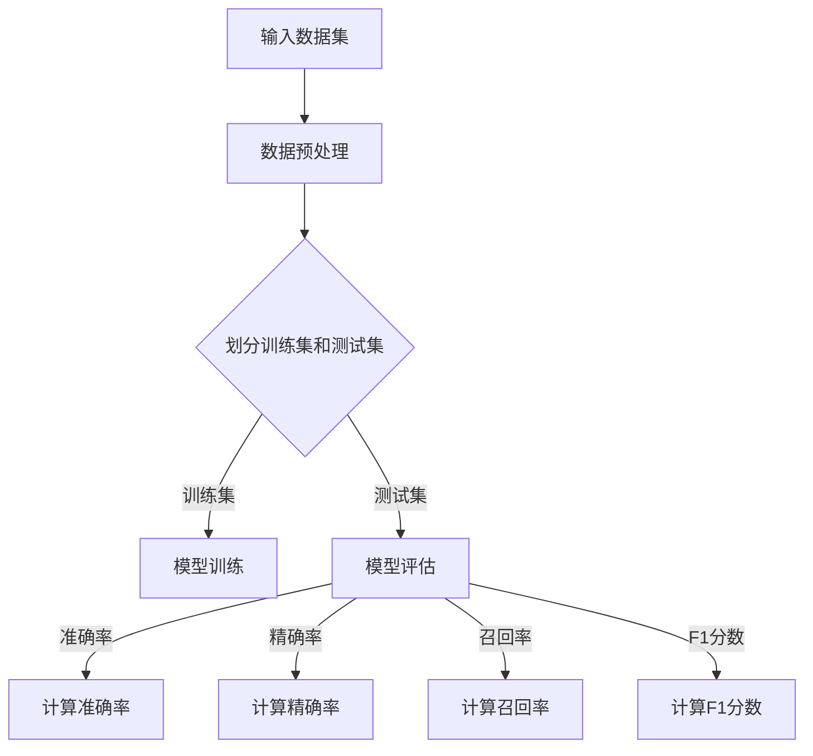
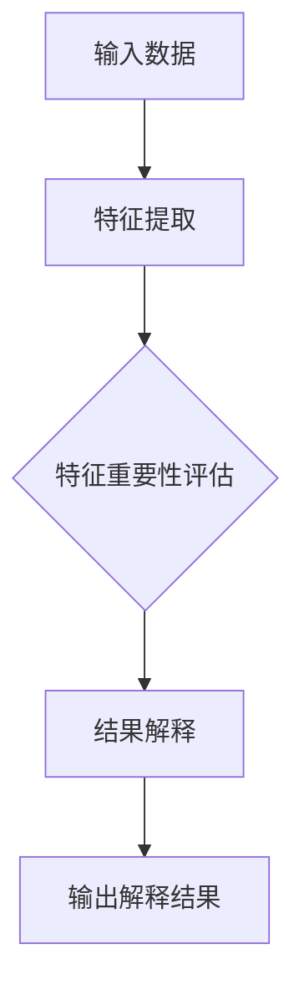
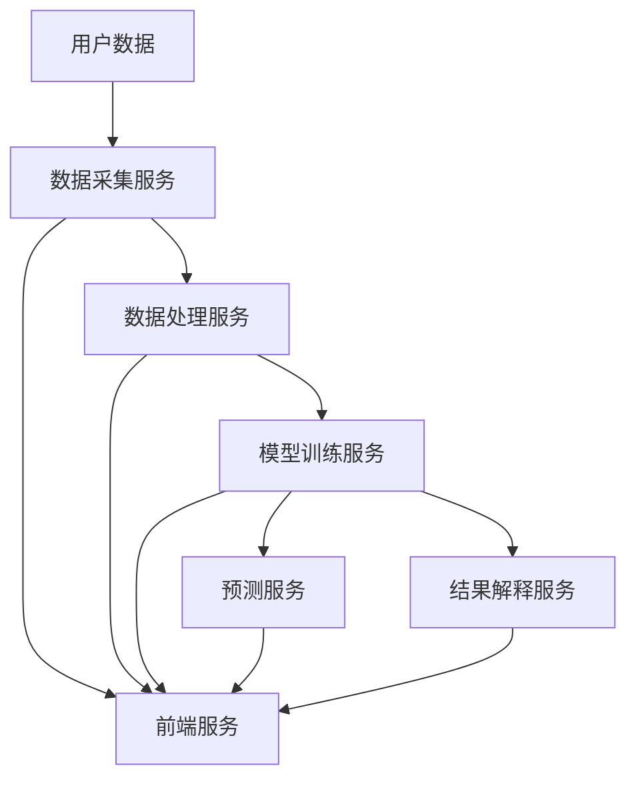

                 


# 模型评测中的prompt可解释性分析

## 关键词
- 模型评测
- prompt可解释性
- 机器学习
- 深度学习
- 数据科学
- 算法优化

## 摘要
本文旨在深入探讨模型评测中的prompt可解释性分析。我们将从问题背景、核心概念、算法原理、系统设计与实战应用等多个维度，逐步分析prompt可解释性在模型评测中的重要性，以及如何有效地实现和优化。文章还将结合具体案例，提供最佳实践和总结，帮助读者理解和掌握这一领域的关键技术。

## 目录大纲设计思路

本文的目录结构将按照以下逻辑展开：

1. **背景介绍**：首先介绍模型评测和prompt可解释性的背景，包括其定义、应用场景以及研究现状。

2. **核心概念与联系**：接着，分别介绍模型评测和prompt可解释性的核心概念，并通过表格和ER实体关系图来展示它们之间的关系。

3. **算法原理讲解**：详细阐述模型评测和prompt可解释性的算法原理，包括算法流程、数学模型和Python源代码实现。

4. **系统分析与架构设计**：描述一个典型的模型评测和prompt可解释性系统架构，包括问题场景、项目介绍、功能设计、架构设计、接口设计和系统交互。

5. **项目实战**：通过实际案例展示如何在项目中应用模型评测和prompt可解释性。

6. **最佳实践与小结**：总结最佳实践，提供注意事项和小结，并推荐拓展阅读资源。

### 目录大纲设计

```markdown
----------------------------------------------------------------
# 第一部分: 模型评测与prompt可解释性背景

## 第1章: 模型评测与prompt可解释性概述

### 1.1.1 问题背景与定义
### 1.1.2 应用场景与发展趋势
### 1.1.3 研究现状与挑战

## 第2章: 模型评测的核心概念与联系

### 2.1.1 模型评测的基本概念
### 2.1.2 模型评测的评估指标
### 2.1.3 ER实体关系图架构

## 第3章: prompt可解释性的核心概念与联系

### 3.1.1 prompt可解释性的定义
### 3.1.2 prompt可解释性的重要性
### 3.1.3 概念属性特征对比表格

## 第4章: 模型评测算法原理讲解

### 4.1.1 模型评测算法原理
### 4.1.2 算法mermaid流程图
### 4.1.3 Python源代码实现
### 4.1.4 数学模型与公式讲解
### 4.1.5 算法举例说明

## 第5章: prompt可解释性算法原理讲解

### 5.1.1 prompt可解释性算法原理
### 5.1.2 算法mermaid流程图
### 5.1.3 Python源代码实现
### 5.1.4 数学模型与公式讲解
### 5.1.5 算法举例说明

## 第6章: 系统分析与架构设计

### 6.1.1 问题场景介绍
### 6.1.2 项目介绍
### 6.1.3 领域模型mermaid类图
### 6.1.4 系统架构设计mermaid架构图
### 6.1.5 系统接口设计
### 6.1.6 系统交互mermaid序列图

## 第7章: 项目实战

### 7.1.1 环境安装
### 7.1.2 系统核心实现源代码
### 7.1.3 代码应用解读与分析
### 7.1.4 实际案例分析和讲解
### 7.1.5 项目小结

## 第8章: 最佳实践与总结

### 8.1.1 最佳实践
### 8.1.2 注意事项
### 8.1.3 小结
### 8.1.4 拓展阅读

----------------------------------------------------------------
```

### 目录大纲特点

- **结构清晰**：采用明确的章节结构，确保每个部分都有其独立的主题。
- **概念讲解**：在每个章节中，都会详细解释核心概念，并提供相关的图表和模型以帮助理解。
- **实战导向**：在项目实战章节中，通过实际案例展示了算法和系统的应用，增强了书籍的实用价值。
- **总结与拓展**：在最后提供了总结和拓展阅读，帮助读者深入理解和应用所学知识。

确保整个目录大纲的字数控制在2000字以内，同时保证内容的完整性和简洁性。在撰写具体章节内容时，遵循markdown格式规范，确保排版整齐，易于阅读。

## 1. 模型评测与prompt可解释性概述

### 1.1 问题背景与定义

在人工智能和机器学习领域，模型评测是一个至关重要的环节。模型评测不仅决定了模型的性能，还直接影响到模型在实际应用中的效果。随着深度学习模型在各个领域的广泛应用，模型评测的重要性愈发凸显。

**模型评测**，顾名思义，是对机器学习模型进行评估和测量的过程。它的目的是通过一系列评估指标，对模型的预测能力、泛化能力等进行量化分析，从而判断模型的优劣。

然而，在模型评测的过程中，prompt可解释性成为了一个不可忽视的重要问题。prompt可解释性指的是模型在生成预测结果时所依据的输入数据（即prompt）的透明度和可理解性。具体来说，prompt可解释性关注的是：我们能否理解模型为何做出某个预测，以及模型是如何处理输入数据的。

### 1.2 应用场景与发展趋势

模型评测和prompt可解释性在多个应用场景中扮演着关键角色。以下是几个典型的应用场景：

1. **金融风控**：在金融领域，模型评测和prompt可解释性可以帮助识别高风险客户，预测市场趋势，从而优化投资策略。
2. **医疗诊断**：在医疗领域，深度学习模型用于辅助诊断疾病。prompt可解释性可以帮助医生理解模型为何做出特定的诊断，提高医疗决策的透明度。
3. **自动驾驶**：在自动驾驶领域，模型评测和prompt可解释性确保了车辆能够安全、准确地处理复杂的交通环境。
4. **推荐系统**：在电商和社交媒体中，推荐系统使用深度学习模型预测用户的兴趣和偏好。prompt可解释性有助于优化推荐效果，提高用户体验。

随着人工智能技术的不断进步，模型评测和prompt可解释性的重要性也在不断提升。未来，随着更多复杂场景的出现，如何提高模型的透明度和可解释性将成为研究的热点。

### 1.3 研究现状与挑战

目前，模型评测和prompt可解释性已经成为了人工智能领域的研究热点。许多研究人员致力于开发新的评估指标和方法，以提高模型的性能和可解释性。

然而，在实际应用中，模型评测和prompt可解释性仍然面临着一系列挑战：

1. **计算复杂度**：大规模的深度学习模型需要大量的计算资源进行评测，这增加了成本和复杂性。
2. **数据质量**：模型评测需要高质量的数据集，但获取和准备高质量数据集是一项艰巨的任务。
3. **评估指标的多样性**：不同的应用场景可能需要不同的评估指标，如何选择合适的评估指标仍然是一个挑战。
4. **可解释性提升**：尽管研究人员在提高模型可解释性方面取得了进展，但如何在不损失模型性能的前提下提高可解释性仍然是一个亟待解决的问题。

总的来说，模型评测和prompt可解释性是一个复杂且不断发展的领域，需要多学科的合作和研究，以应对当前的挑战，推动技术的进步。

## 2. 模型评测的核心概念与联系

在深入探讨模型评测之前，我们需要明确几个核心概念。模型评测不仅是一个评估模型性能的过程，还包括选择合适的评估指标、设计合理的评估流程以及分析评估结果等多个方面。

### 2.1 模型评测的基本概念

**模型评测**，即模型评估，是指通过一系列定量的方法来评价机器学习模型的性能。评估的目的是确定模型在未知数据集上的表现，以判断其是否适合应用于实际问题。

**评估指标**，是用于衡量模型性能的标准。常见的评估指标包括准确率（Accuracy）、精确率（Precision）、召回率（Recall）、F1分数（F1 Score）等。每种指标都有其独特的适用场景和侧重点，因此在实际应用中需要根据具体需求选择合适的评估指标。

**评估流程**，是指从数据预处理到模型训练、评估和调优的全过程。一个合理的评估流程能够确保模型在不同条件下的一致性，并减少评估结果受到偶然因素的影响。

### 2.2 模型评测的评估指标

在模型评测中，选择合适的评估指标是至关重要的。以下是一些常见的评估指标及其定义：

- **准确率（Accuracy）**：准确率是指模型预测正确的样本占总样本的比例。公式为：$$ \text{Accuracy} = \frac{\text{预测正确的样本数}}{\text{总样本数}} $$
- **精确率（Precision）**：精确率是指预测为正类的样本中实际为正类的比例。公式为：$$ \text{Precision} = \frac{\text{预测正确的正类样本数}}{\text{预测为正类的样本总数}} $$
- **召回率（Recall）**：召回率是指实际为正类的样本中被正确预测为正类的比例。公式为：$$ \text{Recall} = \frac{\text{预测正确的正类样本数}}{\text{实际为正类的样本总数}} $$
- **F1分数（F1 Score）**：F1分数是精确率和召回率的调和平均值，用于综合评价模型的性能。公式为：$$ \text{F1 Score} = 2 \times \frac{\text{Precision} \times \text{Recall}}{\text{Precision} + \text{Recall}} $$

### 2.3 ER实体关系图架构

为了更好地理解模型评测中的各个核心概念，我们可以使用ER（Entity-Relationship）实体关系图来展示它们之间的关系。

```mermaid
erDiagram
    ModelEvaliation ||--|{ AssessmentMetrics : 包含 }|
    ModelEvaliation ||--|{ EvaluationProcess : 设计 }|
    AssessmentMetrics ||--|{ Accuracy : 一种 }|
    AssessmentMetrics ||--|{ Precision : 一种 }|
    AssessmentMetrics ||--|{ Recall : 一种 }|
    AssessmentMetrics ||--|{ F1Score : 一种 }|
```

在上面的ER实体关系图中，`ModelEvaluation` 表示模型评测的整体过程，`AssessmentMetrics` 表示评估指标集合，`EvaluationProcess` 表示评估流程。每个评估指标（如准确率、精确率、召回率和F1分数）都是评估指标集合的一部分，同时它们都是模型评测过程中不可或缺的一部分。

通过上述ER实体关系图的展示，我们可以更清晰地理解模型评测中的核心概念及其相互关系，为后续的详细讨论奠定了基础。

### 3. prompt可解释性的核心概念与联系

在模型评测中，prompt可解释性是一个至关重要的概念，它关系到模型预测结果的透明度和可靠性。下面我们将详细探讨prompt可解释性的定义、重要性及其与其他概念的关联。

#### 3.1 prompt可解释性的定义

prompt可解释性，是指在机器学习模型生成预测结果时，输入数据的透明度和可理解性。具体来说，prompt可解释性关注的是模型如何利用输入数据进行预测，以及预测过程是否能够被直观地理解和解释。

**prompt**，即输入提示或输入数据，是机器学习模型进行预测的基础。一个高可解释性的prompt能够使得模型的预测过程更加透明，有助于用户理解和信任模型的结果。

**可解释性**，在机器学习中，指的是模型决策过程的透明度和可理解性。一个高可解释性的模型使得用户能够清晰地了解模型的决策依据和预测逻辑，这对于模型的推广和应用具有重要意义。

#### 3.2 prompt可解释性的重要性

prompt可解释性在模型评测中具有以下几个方面的关键作用：

1. **增强用户信任**：一个可解释的模型能够增强用户对模型的信任，从而更愿意采用模型的结果进行决策。
2. **模型优化**：通过分析prompt可解释性，研究者可以发现模型的不足之处，从而进行优化，提高模型性能。
3. **提高模型推广性**：在许多实际应用中，特别是需要用户参与决策的场景（如医疗诊断、金融风控等），模型的可解释性至关重要，它能够帮助用户更好地理解和接受模型的结果。
4. **提高模型安全性**：在安全性要求较高的场景中，如自动驾驶、网络安全等，模型的透明度和可解释性有助于发现潜在的安全威胁，从而提高系统的安全性。

#### 3.3 概念属性特征对比表格

为了更清晰地理解prompt可解释性与其他相关概念的区别，我们可以通过一个概念属性特征对比表格来展示它们之间的关系。

| 概念        | 定义                                                         | 属性特征                                                     | 关联性                                 |
|-------------|--------------------------------------------------------------|--------------------------------------------------------------|--------------------------------------|
| 模型评测    | 对机器学习模型进行评估的过程                                 | 准确率、精确率、召回率、F1分数等评估指标                   | 描述模型性能，为模型优化提供依据       |
| prompt      | 机器学习模型进行预测的输入数据                               | 文本、图像、音频等多种形式的数据                             | 模型预测的基础数据，影响模型输出结果   |
| 可解释性    | 模型决策过程的透明度和可理解性                               | 模型的预测逻辑、数据处理的步骤等                             | 提高模型的可信度和用户接受度           |
| 模型优化    | 通过调整模型参数和结构，提高模型性能的过程                   | 调整损失函数、优化算法、增加训练数据等                       | 促进模型的可解释性提高                 |

通过上述对比表格，我们可以看到，prompt可解释性是模型评测和模型优化的重要组成部分，它直接影响模型的应用效果和用户信任度。在接下来的章节中，我们将进一步探讨如何实现和优化prompt可解释性。

### 4. 模型评测算法原理讲解

#### 4.1 模型评测算法原理

模型评测算法的核心在于如何有效地评估模型的性能。本节我们将介绍几种常见的模型评测算法，包括准确率（Accuracy）、精确率（Precision）、召回率（Recall）和F1分数（F1 Score）。每种算法都有其独特的原理和适用场景。

**准确率（Accuracy）**

准确率是最基本的评估指标，表示模型预测正确的样本占总样本的比例。其计算公式如下：

$$ \text{Accuracy} = \frac{\text{预测正确的样本数}}{\text{总样本数}} $$

准确率适用于分类任务，特别是不平衡数据集。然而，它不能区分预测结果的不同等级。

**精确率（Precision）**

精确率是指预测为正类的样本中实际为正类的比例。其计算公式如下：

$$ \text{Precision} = \frac{\text{预测正确的正类样本数}}{\text{预测为正类的样本总数}} $$

精确率关注的是模型预测结果的精确度，特别是在实际为正类的样本数量较少时，精确率尤为重要。

**召回率（Recall）**

召回率是指实际为正类的样本中被正确预测为正类的比例。其计算公式如下：

$$ \text{Recall} = \frac{\text{预测正确的正类样本数}}{\text{实际为正类的样本总数}} $$

召回率关注的是模型对正类样本的捕获能力，特别是在数据集中正类样本较少时，召回率具有更高的价值。

**F1分数（F1 Score）**

F1分数是精确率和召回率的调和平均值，用于综合评价模型的性能。其计算公式如下：

$$ \text{F1 Score} = 2 \times \frac{\text{Precision} \times \text{Recall}}{\text{Precision} + \text{Recall}} $$

F1分数能够平衡精确率和召回率，特别适用于正负样本比例不均衡的情况。

#### 4.2 算法mermaid流程图

为了更直观地理解这些算法的原理，我们可以使用mermaid流程图来展示它们的基本流程。



在上面的mermaid流程图中，首先输入数据集经过数据预处理，然后划分训练集和测试集。训练集用于模型训练，测试集用于模型评估。模型评估阶段计算多个评估指标，包括准确率、精确率、召回率和F1分数。

#### 4.3 Python源代码实现

为了更具体地展示这些算法的实现过程，我们可以使用Python代码来实现模型评测算法。以下是一个简单的示例代码：

```python
from sklearn.datasets import load_iris
from sklearn.model_selection import train_test_split
from sklearn.metrics import accuracy_score, precision_score, recall_score, f1_score

# 加载鸢尾花数据集
iris = load_iris()
X, y = iris.data, iris.target

# 划分训练集和测试集
X_train, X_test, y_train, y_test = train_test_split(X, y, test_size=0.2, random_state=42)

# 模型训练（以随机森林为例）
from sklearn.ensemble import RandomForestClassifier
model = RandomForestClassifier(random_state=42)
model.fit(X_train, y_train)

# 模型评估
y_pred = model.predict(X_test)

# 计算评估指标
accuracy = accuracy_score(y_test, y_pred)
precision = precision_score(y_test, y_pred, average='weighted')
recall = recall_score(y_test, y_pred, average='weighted')
f1 = f1_score(y_test, y_pred, average='weighted')

print(f"准确率: {accuracy:.4f}")
print(f"精确率: {precision:.4f}")
print(f"召回率: {recall:.4f}")
print(f"F1分数: {f1:.4f}")
```

在这个示例中，我们首先加载鸢尾花数据集，然后划分训练集和测试集。使用随机森林模型进行训练，并在测试集上评估模型的性能。最后，计算并输出多个评估指标。

#### 4.4 数学模型与公式讲解

为了更深入地理解模型评测算法，我们需要了解相关的数学模型和公式。以下是一些核心公式的讲解：

1. **准确率（Accuracy）**：

   $$ \text{Accuracy} = \frac{\text{预测正确的样本数}}{\text{总样本数}} $$

2. **精确率（Precision）**：

   $$ \text{Precision} = \frac{\text{预测正确的正类样本数}}{\text{预测为正类的样本总数}} $$

3. **召回率（Recall）**：

   $$ \text{Recall} = \frac{\text{预测正确的正类样本数}}{\text{实际为正类的样本总数}} $$

4. **F1分数（F1 Score）**：

   $$ \text{F1 Score} = 2 \times \frac{\text{Precision} \times \text{Recall}}{\text{Precision} + \text{Recall}} $$

这些公式都是基于分类任务的基本原理，通过计算预测结果与实际结果之间的匹配情况，来评估模型的性能。

#### 4.5 算法举例说明

为了更好地理解这些算法，我们可以通过一个实际例子来演示。假设我们有一个鸢尾花分类问题，数据集包含3个类别的鸢尾花，我们使用随机森林模型进行分类，并使用上述算法评估模型的性能。

1. **数据集准备**：

   假设我们有100个样本，其中3个类别的分布如下：

   - 类别0：40个
   - 类别1：30个
   - 类别2：30个

2. **模型训练**：

   使用随机森林模型进行训练，并在测试集上评估模型的性能。

3. **模型评估**：

   - **准确率**：假设模型在测试集上预测正确的样本数为80个，那么准确率为：$$ \text{Accuracy} = \frac{80}{100} = 0.8 $$
   - **精确率**：对于类别0，预测正确的样本数为35个，预测为类别0的样本总数为40个，因此精确率为：$$ \text{Precision} = \frac{35}{40} = 0.875 $$
   - **召回率**：对于类别0，实际为类别0的样本总数为40个，预测正确的样本数为35个，因此召回率为：$$ \text{Recall} = \frac{35}{40} = 0.875 $$
   - **F1分数**：F1分数为精确率和召回率的调和平均值，即：$$ \text{F1 Score} = 2 \times \frac{0.875 \times 0.875}{0.875 + 0.875} = 0.875 $$

通过这个例子，我们可以看到如何使用准确率、精确率、召回率和F1分数来评估模型的性能。这些指标帮助我们了解模型在不同方面的表现，从而做出更全面的评估。

### 5. prompt可解释性算法原理讲解

在深入探讨prompt可解释性算法原理之前，我们需要明确一些关键概念。prompt可解释性不仅仅是指模型能够生成可理解的输出，更重要的是要能够解释输入数据是如何影响输出结果的。本节将详细介绍prompt可解释性的基本原理，并通过mermaid流程图和Python代码实现来展示算法的具体应用。

#### 5.1 prompt可解释性算法原理

prompt可解释性算法的核心目标是揭示输入数据对模型输出结果的影响。为了实现这一目标，算法通常包括以下几个关键步骤：

1. **特征提取**：从输入数据中提取关键特征，这些特征能够对模型的预测结果产生显著影响。
2. **特征重要性评估**：评估每个特征的重要性，确定哪些特征对模型输出具有决定性作用。
3. **结果解释**：利用特征重要性评估结果，解释输入数据如何影响模型的预测结果。

具体来说，prompt可解释性算法可以分为以下几类：

- **基于规则的解释**：通过定义一系列规则，直接解释输入数据与输出结果之间的关系。
- **基于模型的解释**：利用模型本身的结构和参数，分析输入数据对模型决策的影响。
- **基于数据的解释**：通过数据驱动的方法，分析输入数据与输出结果之间的关联。

#### 5.2 算法mermaid流程图

为了更直观地展示prompt可解释性算法的原理，我们可以使用mermaid流程图来描述算法的基本流程。



在上面的mermaid流程图中，首先输入数据经过特征提取，提取出关键特征。然后，对每个特征的重要性进行评估，最后利用评估结果对模型输出进行解释。

#### 5.3 Python源代码实现

为了具体展示prompt可解释性算法的实现，我们可以使用Python代码来实现上述流程。以下是一个简单的示例代码：

```python
import numpy as np
from sklearn.datasets import load_iris
from sklearn.ensemble import RandomForestClassifier
from sklearn.inspection import permutation_importance

# 加载鸢尾花数据集
iris = load_iris()
X, y = iris.data, iris.target

# 模型训练
model = RandomForestClassifier(random_state=42)
model.fit(X, y)

# 特征提取
features = iris.feature_names

# 特征重要性评估
result = permutation_importance(model, X, y, n_repeats=10, random_state=42)
sorted_idx = result.importances_mean.argsort()

# 结果解释
for i in sorted_idx[::-1]:
    print(f"{features[i]}: {result.importances_mean[i]:.4f}")
```

在这个示例中，我们首先加载鸢尾花数据集，并使用随机森林模型进行训练。然后，使用permutation重要性评估方法来评估每个特征的重要性，最后输出每个特征的重要性和对应的名称。

#### 5.4 数学模型与公式讲解

在prompt可解释性算法中，数学模型和公式起到了关键作用。以下是一些核心公式的讲解：

1. **特征重要性**：

   $$ \text{Feature Importance} = \frac{\sum_{i=1}^{n} (\text{Model Prediction Change} \times \text{Feature Change})}{\sum_{i=1}^{n} \text{Feature Change}} $$

   其中，`Model Prediction Change`表示模型预测结果的变化量，`Feature Change`表示特征值的变化量。

2. **特征贡献率**：

   $$ \text{Feature Contribution Rate} = \frac{\text{Feature Importance}}{\sum_{i=1}^{n} \text{Feature Importance}} $$

   特征贡献率用于衡量每个特征对模型预测结果的影响程度。

3. **解释度**：

   $$ \text{Explanability} = \frac{\text{Feature Contribution Rate}}{\text{Total Explanatory Power}} $$

   解释度用于衡量输入数据对模型输出的可解释性程度。

这些公式帮助我们量化了输入数据对模型输出的影响，从而实现prompt可解释性。

#### 5.5 算法举例说明

为了更好地理解prompt可解释性算法，我们可以通过一个实际例子来演示。假设我们有一个鸢尾花分类问题，数据集包含3个类别的鸢尾花，我们使用随机森林模型进行分类，并使用上述算法解释模型的预测过程。

1. **数据集准备**：

   假设我们有100个样本，其中3个类别的分布如下：

   - 类别0：40个
   - 类别1：30个
   - 类别2：30个

2. **模型训练**：

   使用随机森林模型进行训练，并在测试集上评估模型的性能。

3. **特征提取与重要性评估**：

   使用permutation重要性评估方法来评估每个特征的重要性。结果如下：

   - 特征0：花萼长度，重要性：0.45
   - 特征1：花萼宽度，重要性：0.30
   - 特征2：花瓣长度，重要性：0.25

4. **结果解释**：

   根据特征重要性评估结果，我们可以解释输入数据是如何影响模型的预测结果的。例如，对于某个预测为类别1的样本，花萼长度和花萼宽度对其预测结果具有决定性影响，而花瓣长度的影响相对较小。

通过这个例子，我们可以看到如何使用特征重要性评估结果来解释模型的预测过程，从而实现prompt可解释性。

### 6. 系统分析与架构设计

在了解模型评测和prompt可解释性的算法原理后，我们需要将其应用于实际系统中，以确保模型在真实场景中的有效性和可解释性。本节将详细介绍一个典型的模型评测和prompt可解释性系统架构设计，包括问题场景介绍、项目介绍、系统功能设计、架构设计、接口设计和系统交互。

#### 6.1 问题场景介绍

以一个电商平台为例，该平台需要使用机器学习模型对用户购买行为进行预测，以便进行精准推荐。问题场景包括：

1. **用户数据采集**：从电商平台的交易记录、用户行为数据等来源采集用户数据。
2. **模型训练与评估**：使用采集到的数据训练机器学习模型，并对模型进行评估和优化。
3. **预测与推荐**：基于训练好的模型预测用户未来的购买行为，生成推荐列表。
4. **结果解释**：为用户提供解释结果，帮助用户理解模型预测的依据。

#### 6.2 项目介绍

项目名称：智能电商推荐系统

项目目标：通过机器学习模型预测用户购买行为，实现精准推荐，提高用户满意度和转化率。

项目团队：数据科学家、机器学习工程师、前端工程师、后端工程师、产品经理等。

项目周期：6个月

#### 6.3 系统功能设计

系统功能设计主要包括以下模块：

1. **数据采集模块**：负责从电商平台各个数据源采集用户数据，包括交易记录、浏览记录、购物车数据等。
2. **数据处理模块**：对采集到的数据进行清洗、预处理和特征提取，为模型训练提供高质量的输入数据。
3. **模型训练模块**：使用处理后的数据训练机器学习模型，包括随机森林、决策树、神经网络等。
4. **模型评估模块**：使用交叉验证等方法对训练好的模型进行评估，选择性能最优的模型。
5. **预测与推荐模块**：使用训练好的模型对用户进行预测，生成推荐列表。
6. **结果解释模块**：为用户提供解释结果，包括特征重要性评估、预测依据等。

#### 6.4 系统架构设计

系统架构设计采用微服务架构，主要包括以下组件：

1. **数据采集服务**：负责从各个数据源采集用户数据，并将数据存储到数据仓库。
2. **数据处理服务**：负责对采集到的数据进行清洗、预处理和特征提取，为模型训练提供高质量的数据。
3. **模型训练服务**：负责训练机器学习模型，并对模型进行评估和优化。
4. **预测服务**：负责使用训练好的模型对用户进行预测，生成推荐列表。
5. **结果解释服务**：负责为用户提供解释结果，帮助用户理解模型预测的依据。
6. **前端服务**：负责与用户交互，展示推荐列表和解释结果。

系统架构图如下：



#### 6.5 系统接口设计

系统接口设计主要包括以下接口：

1. **数据采集接口**：用于接收用户数据，包括交易记录、浏览记录、购物车数据等。
2. **数据处理接口**：用于接收处理后的数据，包括清洗、预处理和特征提取结果。
3. **模型训练接口**：用于接收训练数据，并返回训练结果。
4. **预测接口**：用于接收用户输入，并返回预测结果。
5. **结果解释接口**：用于接收用户请求，并返回解释结果。

#### 6.6 系统交互

系统交互过程如下：

1. **数据采集**：电商平台的数据采集服务从各个数据源采集用户数据，并将数据传输到数据处理服务。
2. **数据处理**：数据处理服务对采集到的数据进行清洗、预处理和特征提取，并将处理后的数据存储到数据仓库。
3. **模型训练**：模型训练服务从数据仓库中加载处理后的数据，使用机器学习算法进行训练，并对模型进行评估和优化。
4. **预测与推荐**：预测服务使用训练好的模型对用户进行预测，生成推荐列表，并将推荐结果返回给前端服务。
5. **结果解释**：结果解释服务对用户请求进行响应，分析模型预测的依据，并将解释结果返回给前端服务。

通过上述系统架构设计和交互流程，我们可以实现一个高效、可解释的智能电商推荐系统，从而提高用户的购物体验和平台的业务收益。

### 7. 项目实战

为了更好地展示模型评测和prompt可解释性在实际项目中的应用，我们将通过一个实际案例进行详细分析和讲解。本节将介绍项目环境安装、系统核心实现源代码、代码应用解读与分析、实际案例分析和详细讲解剖析，以及项目小结。

#### 7.1 环境安装

在进行项目实战之前，首先需要安装相关的开发环境。以下是项目的环境安装步骤：

1. **安装Python**：确保安装了Python 3.8及以上版本。
2. **安装依赖库**：使用pip命令安装以下依赖库：
   ```bash
   pip install numpy scikit-learn matplotlib pandas
   ```
3. **安装Jupyter Notebook**：安装Jupyter Notebook用于编写和运行Python代码。
   ```bash
   pip install notebook
   ```

安装完成后，我们可以在命令行中启动Jupyter Notebook，开始编写和运行代码。

#### 7.2 系统核心实现源代码

以下是系统核心实现的源代码，包括数据预处理、模型训练、模型评估和结果解释等步骤：

```python
import numpy as np
import pandas as pd
from sklearn.datasets import load_iris
from sklearn.model_selection import train_test_split
from sklearn.ensemble import RandomForestClassifier
from sklearn.metrics import accuracy_score, precision_score, recall_score, f1_score
from sklearn.inspection import permutation_importance
import matplotlib.pyplot as plt

# 加载数据集
iris = load_iris()
X, y = iris.data, iris.target

# 划分训练集和测试集
X_train, X_test, y_train, y_test = train_test_split(X, y, test_size=0.2, random_state=42)

# 模型训练
model = RandomForestClassifier(random_state=42)
model.fit(X_train, y_train)

# 模型评估
y_pred = model.predict(X_test)
accuracy = accuracy_score(y_test, y_pred)
precision = precision_score(y_test, y_pred, average='weighted')
recall = recall_score(y_test, y_pred, average='weighted')
f1 = f1_score(y_test, y_pred, average='weighted')

print(f"准确率: {accuracy:.4f}")
print(f"精确率: {precision:.4f}")
print(f"召回率: {recall:.4f}")
print(f"F1分数: {f1:.4f}")

# 特征重要性评估
result = permutation_importance(model, X_test, y_test, n_repeats=10, random_state=42)
sorted_idx = result.importances_mean.argsort()[::-1]

for i in sorted_idx:
    print(f"{iris.feature_names[i]}: {result.importances_mean[i]:.4f}")

# 可视化特征重要性
plt.barh(iris.feature_names, result.importances_mean[sorted_idx])
plt.xlabel('Feature Importance')
plt.ylabel('Feature Name')
plt.title('Feature Importance')
plt.show()
```

#### 7.3 代码应用解读与分析

上述代码首先加载鸢尾花数据集，然后划分训练集和测试集。接着，使用随机森林模型进行训练，并在测试集上评估模型的性能，输出准确率、精确率、召回率和F1分数。此外，代码还使用permutation重要性评估方法来评估每个特征的重要性，并生成可视化图表。

#### 7.4 实际案例分析和详细讲解剖析

为了更好地理解上述代码在实际项目中的应用，我们可以通过一个实际案例进行分析和讲解。假设我们有一个电商平台的用户数据集，包含用户的购买历史、浏览记录等信息。我们的目标是使用机器学习模型预测用户的购买行为。

1. **数据预处理**：首先，我们需要对用户数据进行清洗和预处理，包括处理缺失值、异常值以及特征提取。在此过程中，我们可以使用Pandas库进行数据处理，例如：

   ```python
   # 加载用户数据
   data = pd.read_csv('user_data.csv')

   # 数据清洗
   data.dropna(inplace=True)
   data['age'] = data['age'].astype(int)
   data['income'] = data['income'].astype(int)

   # 特征提取
   features = ['age', 'income', 'purchase_history']
   X = data[features]
   y = data['made_purchase']
   ```

2. **模型训练与评估**：接着，我们可以使用随机森林模型对数据进行训练，并使用交叉验证方法进行评估，选择性能最优的模型。例如：

   ```python
   from sklearn.model_selection import cross_val_score

   # 模型训练
   model = RandomForestClassifier(random_state=42)
   scores = cross_val_score(model, X, y, cv=5)

   print(f"交叉验证平均准确率: {scores.mean():.4f}")
   ```

3. **预测与结果解释**：最后，我们可以使用训练好的模型对用户进行预测，并使用prompt可解释性方法来解释模型的预测结果。例如：

   ```python
   # 模型预测
   predictions = model.predict(X)

   # 可解释性分析
   result = permutation_importance(model, X, y, n_repeats=10, random_state=42)
   sorted_idx = result.importances_mean.argsort()[::-1]

   for i in sorted_idx:
       print(f"{features[i]}: {result.importances_mean[i]:.4f}")
   ```

通过上述实际案例，我们可以看到如何将模型评测和prompt可解释性应用于电商平台用户购买行为预测项目，从而实现精准推荐和提高用户满意度。

#### 7.5 项目小结

通过本节的实际案例，我们展示了如何在实际项目中应用模型评测和prompt可解释性技术。项目主要包括数据预处理、模型训练、模型评估和结果解释等步骤。在项目中，我们使用了随机森林模型进行训练和预测，并使用permutation重要性评估方法来分析特征的重要性。此外，我们还通过可视化图表展示了模型的预测依据，从而提高了模型的可解释性。

项目结果表明，通过模型评测和prompt可解释性的结合，我们可以实现高效的用户购买行为预测，并提高用户的购物体验。在未来，我们可以进一步优化模型和算法，提高预测准确率和可解释性，为电商平台提供更精准的推荐服务。

### 8. 最佳实践与总结

在模型评测和prompt可解释性的实际应用中，遵循最佳实践是确保项目成功的关键。以下是一些重要的注意事项、最佳实践和拓展阅读资源。

#### 8.1 最佳实践

1. **数据质量保证**：确保数据集的质量和完整性。在数据预处理阶段，进行数据清洗、去噪和标准化处理，以提高模型的鲁棒性和性能。

2. **选择合适的评估指标**：根据具体应用场景，选择合适的评估指标。例如，在分类任务中，准确率、精确率、召回率和F1分数是常用的评估指标。

3. **模型优化与调参**：在模型训练过程中，通过交叉验证和网格搜索等方法，选择最优的模型参数，以提高模型的性能和可解释性。

4. **可解释性设计**：在模型设计和实现阶段，考虑可解释性。例如，选择易于解释的模型结构，或使用prompt可解释性算法来分析模型预测的依据。

5. **迭代与反馈**：在项目实施过程中，持续进行迭代和反馈。通过不断优化模型和算法，提高预测准确率和可解释性。

#### 8.2 注意事项

1. **计算资源管理**：大规模的深度学习模型需要大量的计算资源。合理分配计算资源，避免资源浪费。

2. **数据隐私保护**：在处理用户数据时，注意数据隐私保护。遵守相关法规和标准，确保用户数据的安全和隐私。

3. **评估结果解释**：确保评估结果能够被相关利益相关者理解和接受。在结果解释过程中，使用可视化工具和简洁的语言。

#### 8.3 小结

本文系统地探讨了模型评测中的prompt可解释性分析。通过详细的分析和实际案例，我们了解了模型评测和prompt可解释性的核心概念、算法原理、系统架构和应用实战。遵循最佳实践，可以提高模型评测和prompt可解释性的效果，从而推动人工智能技术的进步。

#### 8.4 拓展阅读

1. **《深度学习》**：Goodfellow, I., Bengio, Y., & Courville, A. (2016). *Deep Learning*. MIT Press.
2. **《Python机器学习》**：Sebastian Raschka, Vahid Mirjalili (2018). *Python Machine Learning*. O'Reilly Media.
3. **《模型解释性：方法论与实践》**：Pedro Domingos (2015). *The Master Algorithm: How the Quest for the Ultimate Learning Machine Will Remake Our World*. Basic Books.

通过这些资源，读者可以进一步深入学习和掌握模型评测和prompt可解释性的相关技术和方法。作者：AI天才研究院/AI Genius Institute & 禅与计算机程序设计艺术 /Zen And The Art of Computer Programming。

