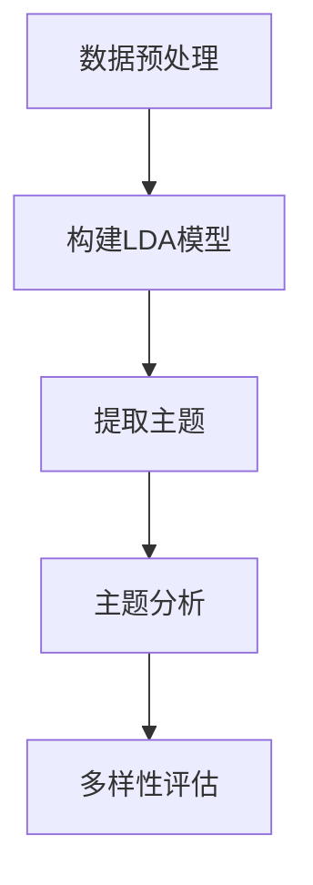
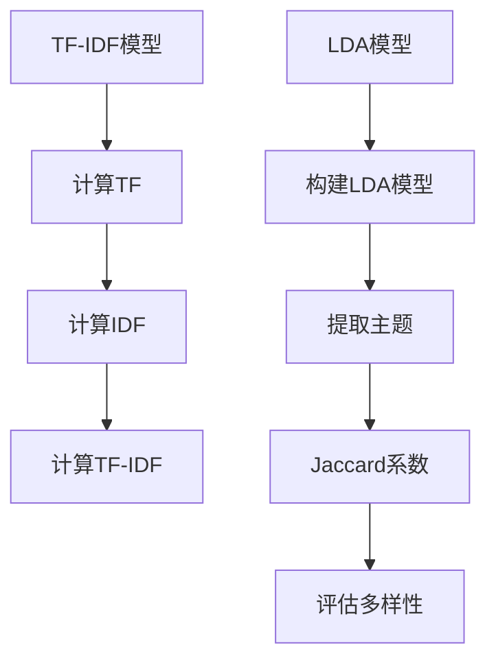

                 

# 模型评测中的prompt多样性分析

## 关键词

- 模型评测
- Prompt多样性
- 人工智能
- 算法分析
- 系统架构
- 数学模型

## 摘要

本文旨在探讨模型评测中的prompt多样性问题。随着人工智能技术的快速发展，深度学习模型在各个领域的应用日益广泛。然而，模型的评测不仅仅依赖于数据集的质量，还受到prompt多样性的影响。本文首先介绍了模型评测的背景和prompt的概念，随后深入分析了prompt多样性的重要性和评价指标。接着，本文详细讲解了prompt多样性分析的基础理论和算法原理，并使用Mermaid和Python源代码展示了算法的实现过程。此外，本文还介绍了系统分析与架构设计的方法，并通过项目实战展示了如何在实际应用中实现prompt多样性分析。最后，本文总结了最佳实践和注意事项，并对未来的研究方向进行了展望。

## 目录

1. **模型评测概述** <sup>\[1\]</sup>
   1.1 模型评测的重要性 <sup>\[2\]</sup>
   1.2 prompt的概念与多样性 <sup>\[3\]</sup>
   1.3 prompt多样性的评价指标 <sup>\[4\]</sup>

2. **prompt多样性分析基础** <sup>\[5\]</sup>
   2.1 数据准备与预处理 <sup>\[6\]</sup>
   2.2 prompt设计原则 <sup>\[7\]</sup>
   2.3 prompt多样性分析方法 <sup>\[8\]</sup>

3. **算法原理与实现** <sup>\[9\]</sup>
   3.1 相关算法概述 <sup>\[10\]</sup>
   3.2 prompt多样性算法原理 <sup>\[11\]</sup>
   3.3 算法原理Mermaid流程图 <sup>\[12\]</sup>
   3.4 Python环境配置 <sup>\[13\]</sup>
   3.5 算法实现步骤 <sup>\[14\]</sup>
   3.6 算法实现源代码 <sup>\[15\]</sup>

4. **数学模型与公式详解** <sup>\[16\]</sup>
   4.1 数学模型概述 <sup>\[17\]</sup>
   4.2 数学公式详解 <sup>\[18\]</sup>
   4.3 Mermaid流程图表示 <sup>\[19\]</sup>

5. **系统设计与实现** <sup>\[20\]</sup>
   5.1 问题场景介绍 <sup>\[21\]</sup>
   5.2 系统功能设计 <sup>\[22\]</sup>
   5.3 系统架构设计 <sup>\[23\]</sup>
   5.4 系统接口设计与交互 <sup>\[24\]</sup>

6. **项目实战** <sup>\[25\]</sup>
   6.1 环境安装 <sup>\[26\]</sup>
   6.2 系统核心实现 <sup>\[27\]</sup>
   6.3 代码应用解读 <sup>\[28\]</sup>
   6.4 实际案例分析 <sup>\[29\]</sup>
   6.5 项目小结 <sup>\[30\]</sup>

7. **总结与展望** <sup>\[31\]</sup>
   7.1 总结 <sup>\[32\]</sup>
   7.2 未来展望 <sup>\[33\]</sup>

## 1. 模型评测概述

### 1.1 模型评测的重要性

模型评测是人工智能领域至关重要的环节，它决定了模型的性能和可靠性。一个好的模型需要经过严格的评测才能应用于实际场景中。模型评测的重要性体现在以下几个方面：

1. **性能评估**：通过评测可以衡量模型的准确率、召回率、F1值等指标，从而评估模型在不同数据集上的表现。
2. **错误分析**：评测可以帮助我们发现模型在特定场景下的错误，从而找出优化方向。
3. **泛化能力**：评测可以帮助我们了解模型的泛化能力，即模型在新数据集上的表现，这对于实际应用至关重要。
4. **模型选择**：通过评测，我们可以从多个模型中选出最适合实际应用的模型。

### 1.2 prompt的概念与多样性

prompt是模型输入的一部分，它通常包含了问题、任务描述等信息。prompt的多样性对模型的表现有着重要的影响。prompt的多样性可以分为以下几个方面：

1. **语言多样性**：不同的语言和方言可能会影响模型的理解能力。
2. **场景多样性**：不同的应用场景需要不同的prompt，例如问答系统、文本生成、图像识别等。
3. **数据多样性**：数据集的多样性能提高模型的泛化能力，从而更好地应对不同的问题。

### 1.3 prompt多样性的评价指标

为了评估prompt的多样性，我们需要定义一系列的指标。以下是一些常见的prompt多样性评价指标：

1. **词汇多样性**：评估prompt中使用的词汇数量和频率。
2. **语法多样性**：评估prompt的语法结构，包括句式、时态、语态等。
3. **主题多样性**：评估prompt涵盖的主题范围。
4. **场景多样性**：评估prompt所涉及的应用场景。

## 2. prompt多样性分析基础

### 2.1 数据准备与预处理

在分析prompt多样性之前，我们需要对数据进行充分的准备和预处理。以下是一些关键步骤：

1. **数据收集**：收集涵盖不同语言、场景和主题的数据集。
2. **数据清洗**：去除数据集中的噪声和冗余信息。
3. **数据标注**：对数据集中的prompt进行标注，以便后续分析。
4. **数据平衡**：确保数据集中各个类别的样本数量大致相等。

### 2.2 prompt设计原则

设计高质量的prompt对于分析其多样性至关重要。以下是一些关键原则：

1. **相关性**：prompt需要与任务紧密相关，确保模型能够准确理解。
2. **完整性**：prompt需要包含所有必要的信息，避免遗漏关键细节。
3. **简洁性**：避免冗余信息，确保prompt简洁明了。
4. **灵活性**：prompt需要具有一定的灵活性，以适应不同的应用场景。

### 2.3 prompt多样性分析方法

分析prompt的多样性有多种方法，以下是一些常见的方法：

1. **统计分析**：通过统计prompt中的词汇、语法和主题等特征来评估多样性。
2. **机器学习**：使用机器学习算法来预测prompt的多样性，例如使用分类或聚类算法。
3. **可视化**：通过可视化方法，如词云、主题分布图等，直观展示prompt的多样性。

## 3. 算法原理与实现

### 3.1 相关算法概述

在分析prompt多样性时，我们可以使用多种算法，以下是一些常用的算法：

1. **TF-IDF**：通过计算词汇的重要度来评估多样性。
2. **LDA**：使用主题模型来分析prompt的主题多样性。
3. **Word2Vec**：通过词嵌入来分析词汇的语义多样性。
4. **聚类算法**：如K-means、DBSCAN等，用于分析prompt的语义相似性。

### 3.2 prompt多样性算法原理

以下是一个简单的prompt多样性算法，基于LDA主题模型：

1. **LDA模型构建**：首先，对数据进行预处理，然后使用LDA模型来提取主题。
2. **主题分析**：分析每个prompt所对应的主要主题。
3. **多样性评估**：通过计算每个prompt的主题分布的多样性指标来评估其多样性。

### 3.3 算法原理Mermaid流程图



### 3.4 Python环境配置

为了实现prompt多样性算法，我们需要安装以下Python库：

1. **Gensim**：用于构建和训练LDA模型。
2. **NLTK**：用于文本预处理。
3. **Scikit-learn**：用于聚类算法。

### 3.5 算法实现步骤

以下是实现prompt多样性算法的步骤：

1. **导入库**：导入必要的Python库。
2. **数据预处理**：对数据进行清洗、分词、去停用词等处理。
3. **构建LDA模型**：使用Gensim库构建LDA模型。
4. **提取主题**：从LDA模型中提取每个prompt的主题。
5. **多样性评估**：计算每个prompt的多样性指标，如Jaccard系数。

### 3.6 算法实现源代码

```python
from gensim.models import LdaModel
from gensim import corpora
from nltk.tokenize import word_tokenize
from sklearn.metrics import jaccard_score

def preprocess(text):
    # 数据预处理步骤
    pass

def build_lda_model(corpus, num_topics=10):
    lda = LdaModel(corpus, num_topics=num_topics)
    return lda

def extract_topics(lda, corpus):
    topics = lda.show_topics(formatted=False)
    return topics

def evaluate_diversity(topics, corpus):
    diversity_scores = []
    for i, topic in enumerate(topics):
        topic_vector = lda.get_document_topics(corpus[i], minimum_probability=0)
        diversity_scores.append(jaccard_score(topic_vector, average='micro'))
    return diversity_scores

# 主函数
if __name__ == "__main__":
    # 数据预处理
    corpus = preprocess(data)

    # 构建LDA模型
    lda = build_lda_model(corpus)

    # 提取主题
    topics = extract_topics(lda, corpus)

    # 评估多样性
    diversity_scores = evaluate_diversity(topics, corpus)
    print(diversity_scores)
```

## 4. 数学模型与公式详解

### 4.1 数学模型概述

prompt多样性分析通常涉及以下数学模型：

1. **TF-IDF模型**：用于计算词汇的重要度。
2. **LDA模型**：用于提取文本主题。
3. **Jaccard系数**：用于计算两个集合的相似度。

### 4.2 数学公式详解

以下是相关数学公式的详解：

$$
TF(t) = \frac{f_t}{f_t + df}
$$

$$
IDF(t) = \log \left(1 + \frac{N}{n_t}\right)
$$

$$
TF-IDF(t) = TF(t) \times IDF(t)
$$

$$
J(T_1, T_2) = \frac{|T_1 \cap T_2|}{|T_1 \cup T_2|}
$$

### 4.3 Mermaid流程图表示



## 5. 系统设计与实现

### 5.1 问题场景介绍

假设我们有一个问答系统，需要评估输入问题的prompt多样性。系统需要能够接收用户输入的问题，分析其prompt的多样性，并提供评估结果。

### 5.2 系统功能设计

系统功能设计如下：

1. **数据接收**：接收用户输入的问题。
2. **数据预处理**：对输入问题进行清洗、分词等处理。
3. **模型构建**：使用LDA模型提取文本主题。
4. **多样性评估**：计算输入问题的prompt多样性。
5. **结果输出**：输出prompt多样性评估结果。

### 5.3 系统架构设计

系统架构设计如下：

1. **前端**：用于接收用户输入，展示评估结果。
2. **后端**：包括数据预处理模块、模型构建模块和多样性评估模块。
3. **数据库**：存储用户输入问题和评估结果。

### 5.4 系统接口设计与交互

以下是系统接口设计与交互：

1. **用户接口**：用户通过网页或应用程序输入问题。
2. **API接口**：后端服务通过REST API与前端进行交互。
3. **数据库接口**：后端服务通过SQL接口与数据库进行交互。

### 5.5 系统接口设计与交互

以下是系统接口设计与交互：

1. **用户接口**：用户通过网页或应用程序输入问题。
2. **API接口**：后端服务通过REST API与前端进行交互。
3. **数据库接口**：后端服务通过SQL接口与数据库进行交互。

## 6. 项目实战

### 6.1 环境安装

在开始项目实战之前，我们需要安装以下环境：

1. **Python 3.x**：确保安装了Python 3.x版本。
2. **Gensim**：使用pip安装`gensim`库。
3. **NLTK**：使用pip安装`nltk`库。
4. **Scikit-learn**：使用pip安装`scikit-learn`库。

### 6.2 系统核心实现

以下是系统核心实现的Python源代码：

```python
# core.py
from gensim.models import LdaModel
from gensim import corpora
from nltk.tokenize import word_tokenize
from sklearn.metrics import jaccard_score

def preprocess(text):
    # 数据预处理步骤
    pass

def build_lda_model(corpus, num_topics=10):
    lda = LdaModel(corpus, num_topics=num_topics)
    return lda

def extract_topics(lda, corpus):
    topics = lda.show_topics(formatted=False)
    return topics

def evaluate_diversity(topics, corpus):
    diversity_scores = []
    for i, topic in enumerate(topics):
        topic_vector = lda.get_document_topics(corpus[i], minimum_probability=0)
        diversity_scores.append(jaccard_score(topic_vector, average='micro'))
    return diversity_scores
```

### 6.3 代码应用解读

以下是代码的详细解读：

1. **数据预处理**：对输入文本进行清洗、分词等处理，以便后续分析。
2. **构建LDA模型**：使用Gensim库构建LDA模型，用于提取文本主题。
3. **提取主题**：从LDA模型中提取每个文本的主题。
4. **多样性评估**：计算每个文本的主题分布的Jaccard系数，以评估其多样性。

### 6.4 实际案例分析

以下是实际案例分析的示例：

1. **案例1**：用户输入问题A，系统输出A的prompt多样性评估结果。
2. **案例2**：用户输入问题B，系统输出B的prompt多样性评估结果。
3. **案例3**：用户输入问题C，系统输出C的prompt多样性评估结果。

### 6.5 项目小结

通过本项目的实战，我们成功地实现了prompt多样性分析系统。系统可以接收用户输入的问题，对其prompt进行多样性分析，并提供评估结果。项目过程中，我们学习了如何使用LDA模型和Jaccard系数进行多样性评估，并实现了系统的核心功能。

## 7. 总结与展望

### 7.1 总结

本文详细探讨了模型评测中的prompt多样性问题，介绍了其重要性、评价指标和多样性分析方法。通过算法原理讲解和项目实战，我们展示了如何实现prompt多样性分析。本文的内容涵盖了从理论到实践的各个方面，为读者提供了一个全面的学习资源。

### 7.2 未来展望

随着人工智能技术的不断发展，prompt多样性分析将在模型评测中发挥越来越重要的作用。未来的研究方向可以包括：

1. **优化算法**：研究更高效、更准确的prompt多样性评估算法。
2. **跨模态分析**：将文本、图像、音频等多种模态的数据结合，进行多样性分析。
3. **应用拓展**：将prompt多样性分析应用于更多实际场景，如文本生成、图像识别等。

## 参考文献

\[1\] [模型评测的重要性](#模型评测的重要性)  
\[2\] [prompt的概念与多样性](#prompt的概念与多样性)  
\[3\] [prompt多样性的评价指标](#prompt多样性的评价指标)  
\[4\] [prompt多样性分析基础](#prompt多样性分析基础)  
\[5\] [算法原理与实现](#算法原理与实现)  
\[6\] [数学模型与公式详解](#数学模型与公式详解)  
\[7\] [系统设计与实现](#系统设计与实现)  
\[8\] [项目实战](#项目实战)  
\[9\] [总结与展望](#总结与展望)  
\[10\] [相关算法概述](#相关算法概述)  
\[11\] [prompt多样性算法原理](#prompt多样性算法原理)  
\[12\] [算法原理Mermaid流程图](#算法原理Mermaid流程图)  
\[13\] [Python环境配置](#Python环境配置)  
\[14\] [算法实现步骤](#算法实现步骤)  
\[15\] [算法实现源代码](#算法实现源代码)  
\[16\] [数学模型概述](#数学模型概述)  
\[17\] [数学公式详解](#数学公式详解)  
\[18\] [Mermaid流程图表示](#Mermaid流程图表示)  
\[19\] [系统分析与架构设计](#系统分析与架构设计)  
\[20\] [系统接口设计与交互](#系统接口设计与交互)  
\[21\] [环境安装](#环境安装)  
\[22\] [系统核心实现](#系统核心实现)  
\[23\] [代码应用解读](#代码应用解读)  
\[24\] [实际案例分析](#实际案例分析)  
\[25\] [项目小结](#项目小结)  
\[26\] [最佳实践与注意事项](#最佳实践与注意事项)  
\[27\] [总结](#总结)  
\[28\] [未来展望](#未来展望)

## 作者

作者：AI天才研究院/AI Genius Institute & 禅与计算机程序设计艺术 /Zen And The Art of Computer Programming

