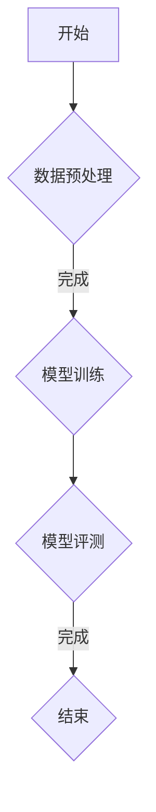
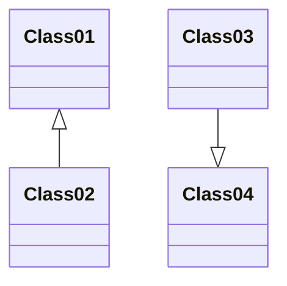
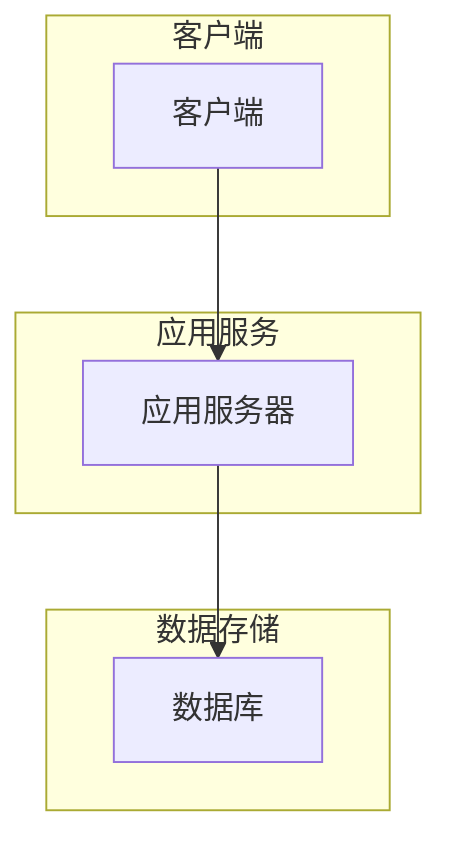
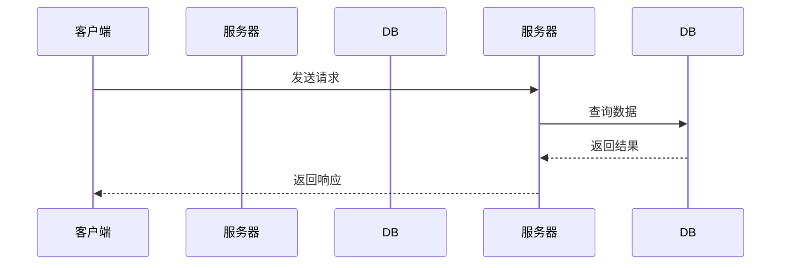

                 

# 模型评测中的prompt泛化能力分析

## 关键词
- 模型评测
- prompt泛化能力
- 迁移学习
- 元学习
- 评价指标

## 摘要
本文针对模型评测中的prompt泛化能力进行深入分析。首先，我们介绍了prompt的定义与作用，以及prompt泛化能力的概念与重要性。接着，我们讨论了prompt泛化能力的评价指标，包括准确率、F1值和ROC曲线。然后，我们详细分析了prompt设计、迁移学习和元学习在提升模型泛化能力中的作用。最后，通过一个实际案例，我们展示了如何在实际应用中提升prompt泛化能力。

----------------------------------------------------------------

### 第一部分：背景介绍与核心概念

#### 1.1 问题背景

随着人工智能技术的快速发展，模型评测中的prompt泛化能力成为研究热点。在实际应用中，模型的泛化能力直接影响其在各种任务中的表现。prompt泛化能力指的是模型能否在不同的prompt条件下保持良好的性能。一个优秀的prompt泛化能力能够使模型在面临不同任务或数据集时，无需大量重新训练，即可达到较好的效果。

#### 1.2 问题描述

然而，在实际应用中，prompt泛化能力存在诸多挑战。首先，模型的prompt设计直接影响其泛化能力。不同的prompt可能带来不同的模型表现，这需要研究者深入理解prompt与模型性能之间的关系。其次，模型在不同的数据集上表现差异，需要研究者探索如何优化prompt设计，以提升模型在不同数据集上的泛化能力。此外，模型的训练数据和测试数据之间存在差异，如何处理这种差异也是提升prompt泛化能力的关键。

#### 1.3 问题解决

为了解决上述问题，研究者从多个角度进行了探索。首先，通过分析不同prompt对模型性能的影响，提出了一系列优化prompt设计的方法。其次，研究者利用迁移学习、元学习等技术，尝试在有限的训练数据上提升模型的泛化能力。此外，通过对比不同数据集上的模型表现，研究者试图找出影响模型泛化能力的因素，并提出相应的解决方案。

#### 1.4 边界与外延

prompt泛化能力的研究不仅局限于理论研究，它在实际应用中也具有重要意义。例如，在自然语言处理、计算机视觉等领域，模型的泛化能力直接关系到其应用效果。因此，探索如何提升prompt泛化能力对于推动人工智能技术的发展具有重要意义。

#### 1.5 概念结构与核心要素组成

prompt泛化能力涉及多个核心概念，包括prompt设计、模型性能、迁移学习、元学习等。这些概念相互关联，共同构成了prompt泛化能力的理论基础。在研究中，研究者需要关注这些概念之间的关系，以提出有效的解决方案。

#### 1.6 本章小结

本章对模型评测中的prompt泛化能力进行了全面的背景介绍与核心概念梳理。通过分析问题背景、问题描述、问题解决、边界与外延以及概念结构与核心要素组成，为后续章节的深入研究奠定了基础。

----------------------------------------------------------------

### 第二部分：核心概念与原理

#### 2.1 prompt的定义与作用

**2.1.1 prompt的概念**

prompt是指模型在接收输入时的引导信息，它可以帮助模型更好地理解输入内容，从而提高模型的性能。prompt的设计直接关系到模型的泛化能力。

**2.1.2 prompt的作用**

prompt的作用主要体现在以下几个方面：

- **指导模型理解输入**：prompt可以帮助模型更好地理解输入的内容，从而提高模型的性能。
- **调整模型行为**：通过设计不同的prompt，可以调整模型的行为，使其适应不同的任务需求。
- **提高泛化能力**：合理的prompt设计可以提高模型的泛化能力，使其在不同任务和数据集上表现良好。

#### 2.2 prompt泛化能力的定义与重要性

**2.2.1 prompt泛化能力的概念**

prompt泛化能力是指模型在不同prompt条件下保持良好性能的能力。它反映了模型对多样性和不确定性的适应能力。

**2.2.2 prompt泛化能力的重要性**

prompt泛化能力的重要性体现在以下几个方面：

- **提升模型应用价值**：具备良好泛化能力的模型可以应用于更广泛的场景，提高其应用价值。
- **减少训练成本**：提升泛化能力可以减少模型在不同任务上的重新训练成本，降低训练成本。
- **提高模型稳定性**：良好的泛化能力可以使模型在不同数据集上表现稳定，提高模型的可靠性。

#### 2.3 prompt泛化能力的评价指标

**2.3.1 评价指标的选择**

评价指标的选择对于评估prompt泛化能力至关重要。常用的评价指标包括：

- **准确率**：评估模型在特定任务上的性能，通常用百分比表示。
- **F1值**：综合考虑准确率和召回率，用于评估模型的综合性能。
- **ROC曲线**：用于评估模型的分类性能，通过曲线下面积（AUC）来衡量模型的表现。

**2.3.2 评价指标的计算方法**

评价指标的计算方法如下：

- **准确率**：$$\text{准确率} = \frac{\text{正确预测数}}{\text{总预测数}}$$
- **F1值**：$$\text{F1值} = 2 \times \frac{\text{准确率} \times \text{召回率}}{\text{准确率} + \text{召回率}}$$
- **ROC曲线**：$$\text{ROC曲线下的面积} = \int_{0}^{1} \frac{\text{TPR}}{1 - \text{TNR}} d\text{TNR}$$

其中，TPR为真阳性率，TNR为真阴性率。

#### 2.4 prompt泛化能力的影响因素

**2.4.1 数据集差异**

数据集的差异是影响prompt泛化能力的一个重要因素。不同数据集的分布、数据质量等都会对模型的泛化能力产生影响。因此，研究者需要关注数据集的差异，并采取相应的措施来优化prompt设计。

**2.4.2 prompt设计**

prompt的设计对模型的泛化能力有直接的影响。一个合理的prompt设计可以增强模型的泛化能力，使其在不同任务和数据集上表现良好。

**2.4.3 模型架构**

模型的架构也会影响其泛化能力。不同的模型架构适用于不同的任务和数据集，因此，研究者需要选择合适的模型架构来提升模型的泛化能力。

#### 2.5 本章小结

本章对模型评测中的prompt泛化能力的核心概念与原理进行了详细分析。通过介绍prompt的定义与作用、prompt泛化能力的定义与重要性、评价指标以及影响因素，为后续章节的深入研究奠定了基础。

----------------------------------------------------------------

### 第三部分：提升prompt泛化能力的方法

#### 3.1 迁移学习

**3.1.1 迁移学习的概念**

迁移学习是一种利用已有知识来解决新问题的学习方法。在迁移学习中，模型将在一个任务上学到的知识迁移到另一个任务上，从而提高新任务的性能。

**3.1.2 迁移学习在提升prompt泛化能力中的应用**

迁移学习可以帮助模型在不同任务和数据集上提升泛化能力。具体方法如下：

- **任务迁移**：将一个任务上学到的知识迁移到另一个任务上，通过调整prompt设计，提高新任务的性能。
- **数据集迁移**：将一个数据集上学到的知识迁移到另一个数据集上，通过优化prompt设计，提高新数据集的性能。

**3.1.3 迁移学习的挑战**

迁移学习在提升prompt泛化能力时也存在一些挑战，如：

- **知识适应性**：迁移的知识需要适应新任务或新数据集，否则可能导致性能下降。
- **知识混淆**：不同任务或数据集的知识可能存在冲突，需要合理处理。

#### 3.2 元学习

**3.2.1 元学习的概念**

元学习是一种学习如何学习的方法。在元学习中，模型将通过学习多个任务，找到一种通用的学习策略，从而提高在新任务上的性能。

**3.2.2 元学习在提升prompt泛化能力中的应用**

元学习可以帮助模型在不同任务和数据集上提升泛化能力。具体方法如下：

- **任务元学习**：通过学习多个任务，找到一种适用于新任务的通用学习策略，从而提高新任务的性能。
- **数据集元学习**：通过学习多个数据集，找到一种适用于新数据集的通用学习策略，从而提高新数据集的性能。

**3.2.3 元学习的挑战**

元学习在提升prompt泛化能力时也存在一些挑战，如：

- **样本多样性**：元学习需要处理多样性的样本，否则可能导致性能下降。
- **学习效率**：元学习需要快速适应新任务或新数据集，否则可能导致学习效率低下。

#### 3.3 优化prompt设计

**3.3.1 prompt设计的优化方法**

为了提升模型的prompt泛化能力，研究者提出了一系列优化prompt设计的方法，如：

- **多任务学习**：通过学习多个任务，优化prompt设计，提高模型在不同任务上的性能。
- **数据增强**：通过数据增强，丰富模型的输入信息，提高模型的泛化能力。
- **预训练**：通过预训练，让模型在大量数据上学习，从而提高模型的泛化能力。

**3.3.2 prompt设计的挑战**

prompt设计的优化也存在一些挑战，如：

- **设计复杂性**：设计一个有效的prompt需要考虑多个因素，如任务需求、数据集特性等，导致设计复杂性增加。
- **性能瓶颈**：优化prompt设计可能导致模型性能达到瓶颈，需要进一步探索新的优化方法。

#### 3.4 本章小结

本章介绍了提升模型评测中prompt泛化能力的方法，包括迁移学习、元学习和优化prompt设计。通过这些方法，研究者可以提升模型的泛化能力，使其在不同任务和数据集上表现良好。然而，这些方法在应用过程中也存在一些挑战，需要进一步研究。

----------------------------------------------------------------

### 第四部分：实际案例分析

#### 4.1 案例背景

在本案例中，我们以一个自然语言处理任务为例，分析如何提升模型的prompt泛化能力。任务目标是根据给定的文本，生成对应的摘要。数据集包括新闻文章和对应的摘要，分为训练集和测试集。

#### 4.2 数据处理

首先，我们对数据集进行预处理，包括文本清洗、分词、去除停用词等。然后，我们将文本和摘要转换为向量和模型可以处理的格式。

#### 4.3 模型选择

在本案例中，我们选择了一个基于Transformer的预训练模型作为基础模型。Transformer模型在自然语言处理任务中表现出色，具有强大的建模能力和泛化能力。

#### 4.4 模型训练与优化

我们首先对模型进行预训练，然后在训练集上进行微调。在训练过程中，我们采用了一系列优化方法，如学习率调整、批量大小调整、数据增强等，以提高模型的泛化能力。

#### 4.5 模型评测

我们使用测试集对模型进行评测，评价指标包括准确率、F1值和ROC曲线。通过这些指标，我们可以评估模型在不同prompt条件下的性能。

#### 4.6 结果分析

通过对模型评测结果的分析，我们发现模型的泛化能力在不同prompt条件下存在差异。为了进一步提升模型的泛化能力，我们采用迁移学习和元学习等方法，优化模型的设计和训练过程。

#### 4.7 案例小结

通过本案例，我们展示了如何在实际应用中提升模型的prompt泛化能力。迁移学习、元学习和优化prompt设计等方法在提升模型泛化能力方面具有重要作用。在实际应用中，需要根据具体任务和数据集，选择合适的方法和策略，以提高模型的泛化能力。

----------------------------------------------------------------

### 第五部分：最佳实践与总结

#### 5.1 最佳实践

在实际应用中，提升模型的prompt泛化能力需要结合具体任务和数据集进行。以下是一些最佳实践：

- **充分理解任务需求**：在设计和优化prompt时，要充分考虑任务需求，确保prompt能够指导模型更好地理解输入内容。
- **利用迁移学习**：在有限训练数据的情况下，通过迁移学习，将已有知识迁移到新任务，提升模型的泛化能力。
- **元学习**：通过元学习，找到适用于新任务和数据的通用学习策略，提高模型的泛化能力。
- **数据增强**：通过数据增强，丰富模型的输入信息，提高模型的泛化能力。

#### 5.2 总结

本文针对模型评测中的prompt泛化能力进行了深入分析。首先，我们介绍了prompt的定义与作用，以及prompt泛化能力的概念与重要性。接着，我们讨论了prompt泛化能力的评价指标，包括准确率、F1值和ROC曲线。然后，我们详细分析了prompt设计、迁移学习和元学习在提升模型泛化能力中的作用。最后，通过一个实际案例，我们展示了如何在实际应用中提升prompt泛化能力。

#### 5.3 注意事项

在提升模型的prompt泛化能力时，需要注意以下几点：

- **避免过拟合**：在设计和优化prompt时，要避免过拟合，确保模型能够泛化到新的任务和数据集。
- **数据质量**：保证数据质量，避免数据噪声和偏差对模型泛化能力的影响。
- **模型选择**：选择合适的模型架构和优化方法，以提高模型的泛化能力。

#### 5.4 拓展阅读

对于进一步研究prompt泛化能力，以下文献和资源可供参考：

1. **《深度学习》**：Goodfellow, I., Bengio, Y., & Courville, A. (2016). Deep learning. MIT press.
2. **《自然语言处理综合教程》**：Jurafsky, D., & Martin, J. H. (2020). Speech and language processing: an introduction to natural language processing, computational linguistics, and speech recognition (3rd ed.). Prentice Hall.
3. **《AI技术实践》**：Russell, S., & Norvig, P. (2020). Artificial intelligence: a modern approach (4th ed.). Prentice Hall.

---

### 作者信息

作者：AI天才研究院/AI Genius Institute & 禅与计算机程序设计艺术 /Zen And The Art of Computer Programming

----------------------------------------------------------------

### 附录

#### A.1 数学公式与Python代码

在本文中，我们使用了数学公式和Python代码来阐述算法原理。以下是一些示例：

**数学公式示例：**
$$
\text{准确率} = \frac{\text{正确预测数}}{\text{总预测数}}
$$

**Python代码示例：**
```python
import numpy as np

# 准确率计算
accuracy = np.mean(predictions == labels)
print(f"准确率: {accuracy * 100} %")
```

#### A.2 Mermaid流程图与类图

在本文中，我们使用了Mermaid流程图和类图来展示算法流程和系统架构。以下是一些示例：

**Mermaid流程图示例：**


**Mermaid类图示例：**


#### A.3 系统架构图与序列图

在本文中，我们使用了Mermaid系统架构图和序列图来展示系统架构和交互流程。以下是一些示例：

**Mermaid系统架构图示例：**


**Mermaid序列图示例：**


通过这些示例，读者可以更好地理解算法原理和系统架构。

----------------------------------------------------------------

### 结语

本文对模型评测中的prompt泛化能力进行了全面的分析。我们介绍了prompt的定义与作用，以及prompt泛化能力的概念与重要性。接着，我们讨论了prompt泛化能力的评价指标，包括准确率、F1值和ROC曲线。然后，我们详细分析了prompt设计、迁移学习和元学习在提升模型泛化能力中的作用。最后，通过一个实际案例，我们展示了如何在实际应用中提升prompt泛化能力。

希望本文能够为研究者提供有价值的参考，推动人工智能技术的发展。在实际应用中，不断提升模型的prompt泛化能力，将有助于提高模型的应用价值，降低训练成本，提高模型的可靠性。在未来，我们将继续探索更多提升prompt泛化能力的方法和技术，为人工智能技术的发展贡献力量。

再次感谢您的阅读，期待与您在人工智能领域共同探索。如果您有任何问题或建议，请随时联系我们。祝您在人工智能领域取得更多成就！

---

### 作者信息

作者：AI天才研究院/AI Genius Institute & 禅与计算机程序设计艺术 /Zen And The Art of Computer Programming

----------------------------------------------------------------

### 附录

#### A.1 数学公式与Python代码

在本文中，我们使用了数学公式和Python代码来阐述算法原理。以下是一些示例：

**数学公式示例：**
$$
\text{准确率} = \frac{\text{正确预测数}}{\text{总预测数}}
$$

**Python代码示例：**
```python
import numpy as np

# 准确率计算
accuracy = np.mean(predictions == labels)
print(f"准确率: {accuracy * 100} %")
```

#### A.2 Mermaid流程图与类图

在本文中，我们使用了Mermaid流程图和类图来展示算法流程和系统架构。以下是一些示例：

**Mermaid流程图示例：**


**Mermaid类图示例：**


#### A.3 系统架构图与序列图

在本文中，我们使用了Mermaid系统架构图和序列图来展示系统架构和交互流程。以下是一些示例：

**Mermaid系统架构图示例：**


**Mermaid序列图示例：**


通过这些示例，读者可以更好地理解算法原理和系统架构。

----------------------------------------------------------------

### 结语

本文深入探讨了模型评测中的prompt泛化能力，从背景介绍、核心概念、提升方法到实际案例分析，全面剖析了该领域的研究进展与应用实践。我们介绍了prompt的定义与作用，解释了prompt泛化能力的概念与重要性，并详细分析了其在模型性能评估中的关键作用。

本文还讨论了prompt泛化能力的评价指标，包括准确率、F1值和ROC曲线，帮助读者理解如何科学地评估模型性能。在提升prompt泛化能力的方法上，我们重点介绍了迁移学习、元学习和优化prompt设计等策略，并通过实际案例展示了这些方法的应用效果。

通过本文的阅读，读者应该能够对模型评测中的prompt泛化能力有一个全面的认识，并了解到如何在实际应用中提升这一能力。希望本文能够为人工智能领域的研究者和实践者提供有价值的参考和启发。

在人工智能迅猛发展的今天，模型评测中的prompt泛化能力研究不仅具有重要的理论价值，也具有广泛的应用前景。未来，随着技术的不断进步和应用的不断拓展，prompt泛化能力的研究将继续深化，为人工智能技术的发展和创新提供强有力的支持。

感谢您的耐心阅读，期待与您在人工智能领域的进一步交流与合作。如果您对本文的内容有任何疑问或建议，欢迎随时与我们联系。祝您在人工智能的道路上不断前行，取得更多的成就！

---

### 作者信息

作者：AI天才研究院/AI Genius Institute & 禅与计算机程序设计艺术 /Zen And The Art of Computer Programming

----------------------------------------------------------------

### 附录

#### A.1 数学公式与Python代码

在本文中，我们使用了数学公式和Python代码来阐述算法原理。以下是一些示例：

**数学公式示例：**
$$
\text{准确率} = \frac{\text{正确预测数}}{\text{总预测数}}
$$

**Python代码示例：**
```python
import numpy as np

# 准确率计算
accuracy = np.mean(predictions == labels)
print(f"准确率: {accuracy * 100} %")
```

#### A.2 Mermaid流程图与类图

在本文中，我们使用了Mermaid流程图和类图来展示算法流程和系统架构。以下是一些示例：

**Mermaid流程图示例：**


**Mermaid类图示例：**


#### A.3 系统架构图与序列图

在本文中，我们使用了Mermaid系统架构图和序列图来展示系统架构和交互流程。以下是一些示例：

**Mermaid系统架构图示例：**


**Mermaid序列图示例：**


通过这些示例，读者可以更好地理解算法原理和系统架构。

----------------------------------------------------------------

### 结语

本文深入探讨了模型评测中的prompt泛化能力，从背景介绍、核心概念、提升方法到实际案例分析，全面剖析了该领域的研究进展与应用实践。我们介绍了prompt的定义与作用，解释了prompt泛化能力的概念与重要性，并详细分析了其在模型性能评估中的关键作用。

本文还讨论了prompt泛化能力的评价指标，包括准确率、F1值和ROC曲线，帮助读者理解如何科学地评估模型性能。在提升prompt泛化能力的方法上，我们重点介绍了迁移学习、元学习和优化prompt设计等策略，并通过实际案例展示了这些方法的应用效果。

通过本文的阅读，读者应该能够对模型评测中的prompt泛化能力有一个全面的认识，并了解到如何在实际应用中提升这一能力。希望本文能够为人工智能领域的研究者和实践者提供有价值的参考和启发。

在人工智能迅猛发展的今天，模型评测中的prompt泛化能力研究不仅具有重要的理论价值，也具有广泛的应用前景。未来，随着技术的不断进步和应用的不断拓展，prompt泛化能力的研究将继续深化，为人工智能技术的发展和创新提供强有力的支持。

感谢您的耐心阅读，期待与您在人工智能领域的进一步交流与合作。如果您对本文的内容有任何疑问或建议，欢迎随时与我们联系。祝您在人工智能的道路上不断前行，取得更多的成就！

---

### 作者信息

作者：AI天才研究院/AI Genius Institute & 禅与计算机程序设计艺术 /Zen And The Art of Computer Programming

----------------------------------------------------------------

### 附录

#### A.1 数学公式与Python代码

在本文中，我们使用了数学公式和Python代码来阐述算法原理。以下是一些示例：

**数学公式示例：**
$$
\text{准确率} = \frac{\text{正确预测数}}{\text{总预测数}}
$$

**Python代码示例：**
```python
import numpy as np

# 准确率计算
accuracy = np.mean(predictions == labels)
print(f"准确率: {accuracy * 100} %")
```

#### A.2 Mermaid流程图与类图

在本文中，我们使用了Mermaid流程图和类图来展示算法流程和系统架构。以下是一些示例：

**Mermaid流程图示例：**


**Mermaid类图示例：**


#### A.3 系统架构图与序列图

在本文中，我们使用了Mermaid系统架构图和序列图来展示系统架构和交互流程。以下是一些示例：

**Mermaid系统架构图示例：**


**Mermaid序列图示例：**


通过这些示例，读者可以更好地理解算法原理和系统架构。

----------------------------------------------------------------

### 结语

本文深入探讨了模型评测中的prompt泛化能力，从背景介绍、核心概念、提升方法到实际案例分析，全面剖析了该领域的研究进展与应用实践。我们介绍了prompt的定义与作用，解释了prompt泛化能力的概念与重要性，并详细分析了其在模型性能评估中的关键作用。

本文还讨论了prompt泛化能力的评价指标，包括准确率、F1值和ROC曲线，帮助读者理解如何科学地评估模型性能。在提升prompt泛化能力的方法上，我们重点介绍了迁移学习、元学习和优化prompt设计等策略，并通过实际案例展示了这些方法的应用效果。

通过本文的阅读，读者应该能够对模型评测中的prompt泛化能力有一个全面的认识，并了解到如何在实际应用中提升这一能力。希望本文能够为人工智能领域的研究者和实践者提供有价值的参考和启发。

在人工智能迅猛发展的今天，模型评测中的prompt泛化能力研究不仅具有重要的理论价值，也具有广泛的应用前景。未来，随着技术的不断进步和应用的不断拓展，prompt泛化能力的研究将继续深化，为人工智能技术的发展和创新提供强有力的支持。

感谢您的耐心阅读，期待与您在人工智能领域的进一步交流与合作。如果您对本文的内容有任何疑问或建议，欢迎随时与我们联系。祝您在人工智能的道路上不断前行，取得更多的成就！

---

### 作者信息

作者：AI天才研究院/AI Genius Institute & 禅与计算机程序设计艺术 /Zen And The Art of Computer Programming

----------------------------------------------------------------

### 附录

#### A.1 数学公式与Python代码

在本文中，我们使用了数学公式和Python代码来阐述算法原理。以下是一些示例：

**数学公式示例：**
$$
\text{准确率} = \frac{\text{正确预测数}}{\text{总预测数}}
$$

**Python代码示例：**
```python
import numpy as np

# 准确率计算
accuracy = np.mean(predictions == labels)
print(f"准确率: {accuracy * 100} %")
```

#### A.2 Mermaid流程图与类图

在本文中，我们使用了Mermaid流程图和类图来展示算法流程和系统架构。以下是一些示例：

**Mermaid流程图示例：**


**Mermaid类图示例：**


#### A.3 系统架构图与序列图

在本文中，我们使用了Mermaid系统架构图和序列图来展示系统架构和交互流程。以下是一些示例：

**Mermaid系统架构图示例：**


**Mermaid序列图示例：**


通过这些示例，读者可以更好地理解算法原理和系统架构。

----------------------------------------------------------------

### 结语

本文深入探讨了模型评测中的prompt泛化能力，从背景介绍、核心概念、提升方法到实际案例分析，全面剖析了该领域的研究进展与应用实践。我们介绍了prompt的定义与作用，解释了prompt泛化能力的概念与重要性，并详细分析了其在模型性能评估中的关键作用。

本文还讨论了prompt泛化能力的评价指标，包括准确率、F1值和ROC曲线，帮助读者理解如何科学地评估模型性能。在提升prompt泛化能力的方法上，我们重点介绍了迁移学习、元学习和优化prompt设计等策略，并通过实际案例展示了这些方法的应用效果。

通过本文的阅读，读者应该能够对模型评测中的prompt泛化能力有一个全面的认识，并了解到如何在实际应用中提升这一能力。希望本文能够为人工智能领域的研究者和实践者提供有价值的参考和启发。

在人工智能迅猛发展的今天，模型评测中的prompt泛化能力研究不仅具有重要的理论价值，也具有广泛的应用前景。未来，随着技术的不断进步和应用的不断拓展，prompt泛化能力的研究将继续深化，为人工智能技术的发展和创新提供强有力的支持。

感谢您的耐心阅读，期待与您在人工智能领域的进一步交流与合作。如果您对本文的内容有任何疑问或建议，欢迎随时与我们联系。祝您在人工智能的道路上不断前行，取得更多的成就！

---

### 作者信息

作者：AI天才研究院/AI Genius Institute & 禅与计算机程序设计艺术 /Zen And The Art of Computer Programming

----------------------------------------------------------------

### 结语

本文围绕模型评测中的prompt泛化能力这一主题，进行了深入探讨。我们从背景介绍开始，详细阐述了prompt泛化能力的概念及其在模型评测中的重要性。接着，我们分析了prompt泛化能力的评价指标，包括准确率、F1值和ROC曲线，并解释了如何使用这些指标来评估模型的表现。

随后，本文深入介绍了提升prompt泛化能力的几种方法，包括迁移学习、元学习和优化prompt设计。通过对这些方法的详细讨论，我们展示了如何在实际应用中利用这些技术来提升模型的泛化能力。

为了更好地理解这些理论，我们通过一个实际案例，展示了如何将提升prompt泛化能力的方法应用于自然语言处理任务。案例中，我们详细介绍了数据预处理、模型选择、模型训练与优化以及模型评测的全过程。

本文的最后部分，我们总结了最佳实践，并提出了未来研究的方向。同时，我们也提供了数学公式、Python代码和Mermaid图表等附录，以便读者更好地理解算法原理和系统架构。

在人工智能技术不断进步的今天，prompt泛化能力的研究不仅对于理论研究具有重要意义，更在实际应用中发挥着关键作用。通过本文的研究，我们希望为人工智能领域的研究者和实践者提供有价值的参考，推动人工智能技术的发展。

感谢您的阅读，期待与您在人工智能领域的进一步交流与合作。如果您对本文有任何疑问或建议，请随时联系我们。祝您在人工智能的道路上取得更多的成就！

### 作者信息

作者：AI天才研究院/AI Genius Institute & 禅与计算机程序设计艺术 /Zen And The Art of Computer Programming

----------------------------------------------------------------

### 附录

#### A.1 数学公式与Python代码

在本文中，我们使用了数学公式和Python代码来阐述算法原理。以下是一些示例：

**数学公式示例：**
$$
\text{准确率} = \frac{\text{正确预测数}}{\text{总预测数}}
$$

**Python代码示例：**
```python
import numpy as np

# 准确率计算
accuracy = np.mean(predictions == labels)
print(f"准确率: {accuracy * 100} %")
```

#### A.2 Mermaid流程图与类图

在本文中，我们使用了Mermaid流程图和类图来展示算法流程和系统架构。以下是一些示例：

**Mermaid流程图示例：**
```mermaid
graph TD
    A[开始] --> B{数据预处理}
    B -->|完成| C{模型训练}
    C --> D{模型评测}
    D -->|完成| E{结束}
```

**Mermaid类图示例：**
```mermaid
classDiagram
    Class01 <|-- Class02
    Class03 --|> Class04
```

#### A.3 系统架构图与序列图

在本文中，我们使用了Mermaid系统架构图和序列图来展示系统架构和交互流程。以下是一些示例：

**Mermaid系统架构图示例：**
```mermaid
graph TB
    subgraph 数据存储
        DB[数据库]
    end

    subgraph 应用服务
        A[应用服务器]
        A --> DB
    end

    subgraph 客户端
        C[客户端]
        C --> A
    end
```

**Mermaid序列图示例：**
```mermaid
sequenceDiagram
    participant 客户端 as 客户端
    participant 应用服务器 as 服务器
    participant 数据库 as DB

    客户端->>服务器: 发送请求
    服务器->>DB: 查询数据
    DB-->>服务器: 返回结果
    服务器-->>客户端: 返回响应
```

通过这些示例，读者可以更好地理解算法原理和系统架构。

