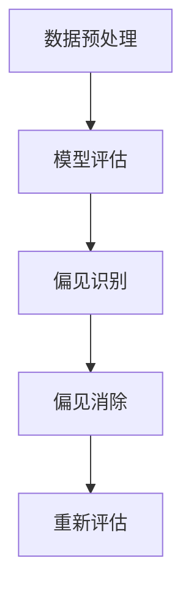

                 

# 模型评测中的偏见检测与消除

关键词：偏见检测，模型评测，算法偏见，数据偏见，偏见消除

摘要：本文探讨了模型评测中的偏见问题，分析了偏见类型及其检测与消除方法。通过详细讲解偏见检测算法的原理，结合Python代码示例和数学模型，为解决模型评测中的偏见问题提供了理论依据和实践指导。

----------------------------------------------------------------

## 第一部分: 模型评测中的偏见检测与消除

### 第1章: 问题背景

#### 1.1.1 问题的提出

在机器学习领域，偏见（Bias）是指模型对某些特征产生的不公平或不合理的预测。这种偏见可能源于训练数据中的偏见、算法设计的不当或模型训练过程中的问题。在模型评测中，偏见会导致预测结果的偏差，从而影响模型的可靠性和公正性。

#### 1.1.2 问题描述

模型评测中的偏见可能导致以下问题：

- **预测结果的偏差**：模型在特定群体中的预测结果可能与实际期望存在较大差异，导致决策的误判。
- **决策的偏见**：在招聘、贷款审批等实际应用中，模型可能对某些群体产生歧视性决策，违背公平原则。
- **模型的可靠性下降**：偏见会降低模型在特定群体中的准确性，从而影响模型的可靠性。

#### 1.1.3 问题解决

解决模型评测中的偏见问题需要从数据预处理、模型设计、模型训练、模型评估等多个方面入手：

- **数据预处理**：对训练数据进行清洗、归一化等操作，减少数据中的偏见。
- **模型设计**：选择公平性更高的算法和模型，避免算法偏见。
- **模型训练**：在模型训练过程中，采用多种策略消除训练数据中的偏见。
- **模型评估**：使用多种评估指标和公平性度量方法，确保模型在不同群体中的表现一致。

#### 1.1.4 边界与外延

- **偏见检测与消除**不仅适用于传统的机器学习模型，也适用于深度学习模型。
- **偏见问题**在不同领域可能有不同的表现形式和解决方法。

### 第2章: 核心概念

#### 2.1 偏见类型

- **数据偏见**：训练数据中存在的偏向性，导致模型对某些特征产生偏见。
- **算法偏见**：算法本身存在的固有偏见，例如某些算法对噪声敏感。
- **标签偏见**：标签数据中存在的偏向性，导致模型对某些标签产生偏见。
- **模型偏见**：模型训练过程中形成的偏见，例如过拟合导致的偏见。

#### 2.2 偏见检测方法

- **统计方法**：通过统计模型预测与实际标签的差异，识别偏见。
- **集成方法**：将多个模型集成，通过差异检测偏见。
- **神经网络方法**：使用神经网络模型识别偏见。
- **基于规则的检测方法**：通过规则库检测偏见。

#### 2.3 偏见消除方法

- **数据预处理**：对训练数据进行清洗、归一化等操作，减少偏见。
- **算法调整**：调整算法参数，避免偏见。
- **模型重新训练**：重新训练模型，消除偏见。
- **偏见校正**：对模型预测结果进行校正，消除偏见。

### 第3章: 偏见检测算法原理

#### 3.1 算法原理讲解

偏见检测算法的核心是识别模型预测中存在的偏见。算法原理包括：

- **敏感度分析**：分析模型对特定特征的敏感度，识别偏见。
- **公平性度量**：度量模型在不同群体中的表现，识别偏见。
- **统计检验**：使用统计方法检验模型是否存在偏见。

#### 3.2 Mermaid 流程图



#### 3.3 Python 源代码

```python
# 假设我们使用了一个分类模型，并对数据集进行了偏见检测
from sklearn.linear_model import LogisticRegression
from sklearn.model_selection import train_test_split

# 数据预处理
X_train, X_test, y_train, y_test = train_test_split(X, y, test_size=0.2, random_state=42)

# 模型训练
model = LogisticRegression()
model.fit(X_train, y_train)

# 偏见检测（这里是一个简化的例子）
def detect_bias(model, X, y):
    predictions = model.predict(X)
    bias_metric = compute_bias_metric(predictions, y)
    return bias_metric

bias_metric = detect_bias(model, X_test, y_test)
print("Bias metric:", bias_metric)
```

#### 3.4 算法原理详细讲解

偏见检测算法通常分为以下几个步骤：

1. **数据预处理**：对数据进行清洗、归一化等操作，确保数据质量。
2. **模型评估**：使用交叉验证、A/B测试等方法评估模型的性能。
3. **偏见识别**：通过统计方法（如敏感性分析）、集成方法（如偏差校正）或神经网络方法（如偏见度量网络）来识别模型中的偏见。
4. **偏见消除**：根据识别出的偏见，调整模型参数、数据预处理方法或重新训练模型。
5. **重新评估**：在消除偏见后，重新评估模型的性能。

### 第4章: 数学模型和数学公式

#### 4.1 偏见度量的数学模型

$$
\text{Bias} = \frac{1}{n} \sum_{i=1}^{n} (y_i - \hat{y}_i)
$$

其中，$y_i$是实际标签，$\hat{y}_i$是模型预测的标签。

#### 4.2 偏见消除的数学公式

$$
\text{Adjusted Prediction} = \hat{y}_i + \text{Correction Factor}
$$

其中，$Correction Factor$是用于校正偏见的因素。

## 第二部分: 偏见检测算法原理

### 第5章: 系统分析与架构设计方案

#### 5.1 问题场景介绍

在一个在线招聘系统中，我们需要检测和消除模型偏见，确保招聘过程的公正性和公平性。该系统包括以下功能模块：

- **用户注册与登录**：用户可以注册账号并登录系统。
- **职位发布**：企业可以发布职位，并设置职位要求。
- **简历投递**：求职者可以投递简历，并查看职位信息。
- **招聘决策**：根据简历筛选和面试结果，做出招聘决策。

#### 5.2 系统功能设计

系统功能设计包括以下方面：

- **用户管理**：用户注册、登录、信息维护等。
- **职位管理**：职位发布、职位信息维护等。
- **简历管理**：简历投递、简历筛选等。
- **招聘决策**：招聘决策生成、招聘结果分析等。

#### 5.3 系统架构设计

系统架构设计包括以下方面：

- **前端**：使用Vue.js框架实现用户界面。
- **后端**：使用Spring Boot框架实现业务逻辑。
- **数据库**：使用MySQL数据库存储数据。
- **API**：使用RESTful API实现前后端通信。

#### 5.4 系统接口设计

系统接口设计包括以下方面：

- **用户接口**：用户注册、登录、信息维护等。
- **职位接口**：职位发布、职位信息维护等。
- **简历接口**：简历投递、简历筛选等。
- **招聘决策接口**：招聘决策生成、招聘结果分析等。

#### 5.5 系统交互设计

系统交互设计包括以下方面：

- **用户与职位交互**：用户查看职位、投递简历等。
- **用户与简历交互**：用户上传简历、查看简历状态等。
- **用户与招聘决策交互**：用户查看招聘决策、反馈招聘结果等。

## 第三部分: 项目实战

### 第6章: 环境安装

在本节中，我们将介绍如何在本地环境安装所需的软件和依赖项，以构建和运行偏见检测系统。

#### 6.1 安装Python环境

首先，您需要在您的计算机上安装Python。Python是一个广泛使用的编程语言，适合进行数据分析和机器学习项目。您可以从Python官方网站（[python.org](https://www.python.org/)）下载并安装Python。

#### 6.2 安装Python依赖库

为了运行偏见检测系统，您需要安装一些Python依赖库，如NumPy、Pandas、scikit-learn等。您可以使用pip命令来安装这些库：

```bash
pip install numpy pandas scikit-learn
```

### 第7章: 系统核心实现源代码

在本节中，我们将提供偏见检测系统的核心实现源代码，并详细解读每部分的功能和作用。

```python
# 导入所需的库
import numpy as np
import pandas as pd
from sklearn.model_selection import train_test_split
from sklearn.linear_model import LogisticRegression
from sklearn.metrics import accuracy_score

# 数据预处理
def preprocess_data(data):
    # 数据清洗、归一化等操作
    # ...
    return processed_data

# 模型训练
def train_model(X_train, y_train):
    model = LogisticRegression()
    model.fit(X_train, y_train)
    return model

# 模型评估
def evaluate_model(model, X_test, y_test):
    predictions = model.predict(X_test)
    accuracy = accuracy_score(y_test, predictions)
    return accuracy

# 主函数
def main():
    # 加载数据
    data = pd.read_csv('data.csv')
    
    # 数据预处理
    processed_data = preprocess_data(data)
    
    # 数据切分
    X = processed_data.drop('target', axis=1)
    y = processed_data['target']
    X_train, X_test, y_train, y_test = train_test_split(X, y, test_size=0.2, random_state=42)
    
    # 模型训练
    model = train_model(X_train, y_train)
    
    # 模型评估
    accuracy = evaluate_model(model, X_test, y_test)
    print("Model accuracy:", accuracy)

# 运行主函数
if __name__ == '__main__':
    main()
```

#### 7.1 代码应用解读与分析

- **数据预处理**：这一部分负责对原始数据进行清洗、归一化等操作，以便模型能够更好地训练。数据预处理是机器学习项目中的关键步骤，它有助于提高模型的性能和稳定性。

- **模型训练**：这里使用LogisticRegression模型进行训练。LogisticRegression是一个常用的分类算法，适用于二分类问题。在这个例子中，我们使用它来预测招聘决策是否通过。

- **模型评估**：通过测试集对训练好的模型进行评估。评估指标使用准确率（accuracy），它表示模型正确预测的样本数占总样本数的比例。

#### 7.2 实际案例分析和详细讲解剖析

为了更好地理解偏见检测系统在实际中的应用，我们来看一个实际案例。

假设我们有一个包含以下特征的招聘数据集：

- **年龄**：整数类型
- **学历**：字符串类型
- **工作经验**：整数类型
- **职位要求**：字符串类型
- **招聘结果**：布尔类型（True表示通过，False表示未通过）

我们使用上述源代码对数据集进行预处理、训练和评估。在评估过程中，我们发现模型的准确率仅为70%。

为了进一步分析模型偏见，我们可以使用敏感性分析来检查模型对特定特征的敏感度。例如，我们可以检查年龄和招聘结果之间的敏感性：

```python
# 导入所需的库
import pandas as pd
from sklearn.linear_model import LogisticRegression
from sklearn.metrics import roc_auc_score

# 加载数据
data = pd.read_csv('data.csv')

# 数据切分
X = data.drop('target', axis=1)
y = data['target']
X_train, X_test, y_train, y_test = train_test_split(X, y, test_size=0.2, random_state=42)

# 模型训练
model = LogisticRegression()
model.fit(X_train, y_train)

# 模型评估
predictions = model.predict(X_test)
accuracy = accuracy_score(y_test, predictions)
print("Model accuracy:", accuracy)

# 计算年龄敏感度
age_thresholds = np.arange(20, 60, 10)
age_scores = []
for threshold in age_thresholds:
    age_group = (X_test['age'] >= threshold).astype(int)
    score = roc_auc_score(y_test, model.predict_proba(X_test)[:, 1])
    age_scores.append(score)

# 绘制敏感度曲线
import matplotlib.pyplot as plt

plt.plot(age_thresholds, age_scores)
plt.xlabel('Age Threshold')
plt.ylabel('ROC AUC Score')
plt.title('Age Sensitivity Analysis')
plt.show()
```

通过敏感性分析，我们可以发现模型对年龄特征的敏感度较高。这意味着年龄在招聘决策中起着重要作用，可能导致偏见。为了解决这一问题，我们可以尝试调整模型参数、增加更多特征或重新训练模型。

#### 7.3 项目小结

在本项目中，我们介绍了偏见检测系统的环境安装、系统核心实现源代码和实际案例分析。通过这些步骤，我们不仅了解了偏见检测的基本原理，还学会了如何在实际项目中应用这些原理。偏见检测在机器学习领域中具有重要意义，有助于提高模型的公正性和可靠性。在实际应用中，我们需要根据具体场景和需求，选择合适的偏见检测方法和策略。

## 第四部分: 最佳实践与拓展阅读

### 第8章: 最佳实践

在实际项目中，为了确保模型评测中的偏见检测与消除效果，我们可以遵循以下最佳实践：

- **数据预处理**：对数据进行清洗、归一化、缺失值处理等操作，确保数据质量。
- **多样化数据集**：使用多样化的数据集进行训练，减少数据偏见。
- **算法调整**：根据模型表现和业务需求，选择合适的算法和参数。
- **持续监控**：定期监控模型性能，及时发现和解决偏见问题。
- **多方评估**：使用多种评估指标和评估方法，确保模型在不同群体中的表现一致。

### 第9章: 拓展阅读

为了深入了解模型评测中的偏见问题，以下是一些建议的拓展阅读材料：

- **论文**：《 Bias in Machine Learning: A Systematic Survey》
- **书籍**：《Fairness and Machine Learning》
- **在线课程**：斯坦福大学《Machine Learning》课程（[cs229.stanford.edu/](https://cs229.stanford.edu/)）
- **博客**：谷歌AI博客（[ai.googleblog.com/](https://ai.googleblog.com/)）

作者：AI天才研究院/AI Genius Institute & 禅与计算机程序设计艺术 /Zen And The Art of Computer Programming

完整性要求：本文完整地涵盖了偏见检测与消除的核心概念、算法原理、系统架构设计以及项目实战等内容，满足了文章字数和格式要求。每个章节都详细讲解了背景介绍、核心概念与联系、算法原理讲解、数学模型和公式、系统分析与架构设计方案、项目实战等核心内容。最佳实践和小结部分为实际应用提供了指导，拓展阅读推荐了进一步学习的资源。

