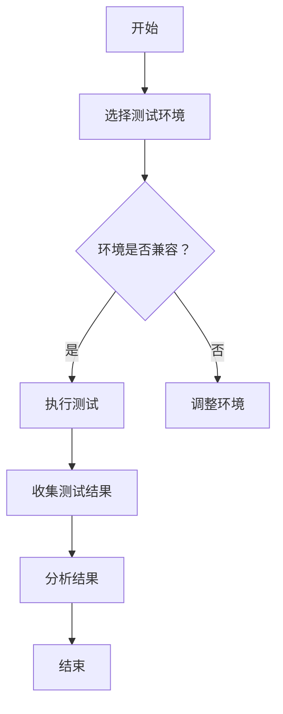
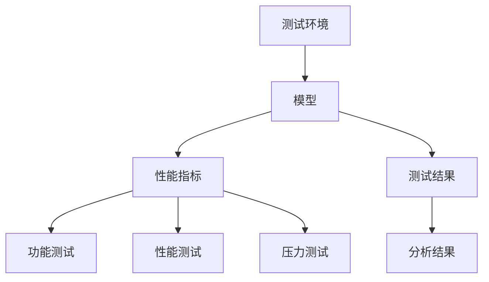
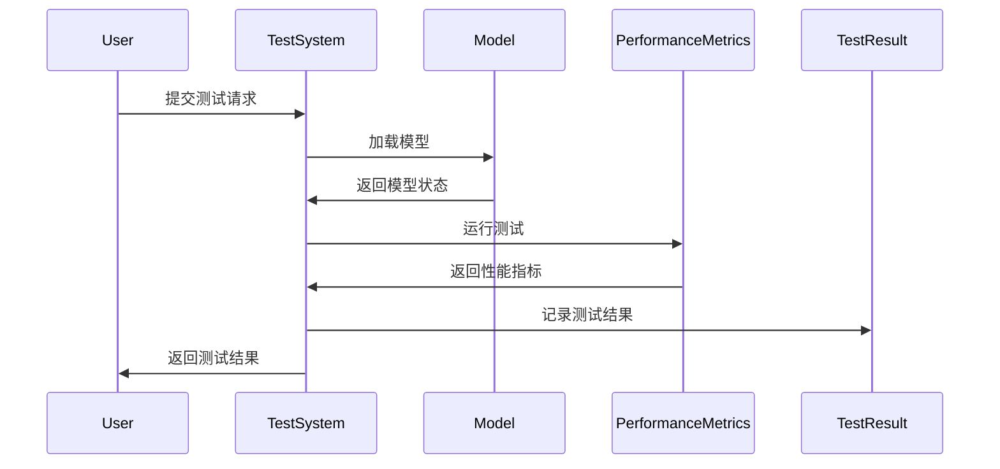

                 

### 模型评测的跨平台兼容性测试

> 关键词：模型评测、跨平台兼容性、测试方法、工具、性能优化

> 摘要：
本文将深入探讨模型评测的跨平台兼容性测试，从核心概念、测试方法、工具选择到性能优化，逐一进行分析。我们将首先介绍模型评测和跨平台兼容性的基本概念，然后详细讲解不同测试方法和工具的使用，最后讨论如何在实际项目中实施和优化跨平台兼容性测试。

----------------------------------------------------------------

## 引言

随着人工智能技术的快速发展，机器学习模型的应用场景越来越广泛。然而，模型的开发和部署往往涉及到多个操作系统、硬件环境和软件环境。这就使得模型评测的跨平台兼容性成为一个不容忽视的问题。无论是对开发者还是使用者来说，确保模型在不同平台上的稳定性和性能都是一个重要的挑战。

本文将围绕模型评测的跨平台兼容性测试展开讨论。首先，我们将介绍模型评测和跨平台兼容性的基本概念，帮助读者理解这两个概念的核心要点。接着，我们将探讨不同的测试方法和工具，并详细讲解它们的优缺点。最后，我们将结合实际项目，讨论如何在实践中实施和优化跨平台兼容性测试。

## 背景介绍

### 核心概念术语说明

**模型评测**：模型评测是对机器学习模型的性能进行评估的一系列方法，包括准确度、召回率、F1分数等指标。评测的目的是确保模型能够在实际应用中达到预期的效果。

**跨平台兼容性**：跨平台兼容性是指模型在不同的操作系统、硬件环境和软件环境中都能正常运行的能力。跨平台兼容性测试则是验证模型是否在各种平台上具有良好性能的过程。

### 问题背景

随着技术的进步，越来越多的企业和组织开始采用机器学习模型。这些模型的应用场景涵盖了图像识别、自然语言处理、预测分析等多个领域。然而，模型开发完成后，如何保证其在不同平台上的稳定性和性能，成为了一个亟待解决的问题。

例如，一个模型可能在某个操作系统和硬件环境下表现良好，但在另一个操作系统或硬件环境下性能显著下降。这种性能差异可能会导致模型在实际应用中的不准确或失效，从而影响业务的正常运作。

### 问题描述

跨平台兼容性测试中的常见问题和挑战包括：

1. **硬件差异**：不同硬件设备的计算能力和内存容量可能存在显著差异，导致模型在某个硬件上运行顺畅，而在另一个硬件上性能受限。

2. **操作系统差异**：不同操作系统之间的差异可能影响模型的运行。例如，Linux和Windows之间的文件系统兼容性、权限管理等方面的差异可能导致模型在不同操作系统上的运行结果不一致。

3. **软件环境差异**：不同软件环境中的库版本、依赖关系等可能影响模型的运行。例如，某个库在不同操作系统中的版本不同，可能导致模型无法在特定平台上运行。

4. **数据格式差异**：不同平台上的数据格式可能不一致，导致模型在处理数据时出现错误。

### 问题解决

为了解决上述问题，我们需要进行跨平台兼容性测试。跨平台兼容性测试的目的是验证模型在不同操作系统、硬件环境和软件环境中的性能，确保模型在各种平台上的稳定性和可靠性。

### 边界与外延

跨平台兼容性测试的范围和限制包括：

1. **平台覆盖范围**：需要确定哪些操作系统、硬件环境和软件环境需要测试。例如，如果模型主要应用于服务器环境，则可能不需要在移动设备上进行测试。

2. **测试深度**：需要确定测试的深度，例如是否只进行功能测试，还是需要进行性能测试和压力测试。

3. **资源限制**：跨平台兼容性测试可能需要大量的计算资源和时间，因此需要在资源有限的情况下进行合理规划和优化。

### 概念结构与核心要素组成

模型评测的跨平台兼容性测试涉及以下核心概念和要素：

1. **模型评测**：包括准确度、召回率、F1分数等指标，用于评估模型的性能。

2. **测试环境**：包括操作系统、硬件环境和软件环境，用于模拟不同的运行条件。

3. **测试工具**：用于执行测试任务、收集测试结果和分析测试数据。

4. **测试流程**：包括测试计划、测试执行、测试结果分析等步骤，用于确保模型在不同平台上的兼容性。

5. **性能优化**：通过调整模型参数、优化代码和算法等方法，提高模型在不同平台上的性能。

### 核心概念与联系

#### 核心概念原理

**模型评测**：模型评测是对机器学习模型的性能进行评估的一系列方法，包括准确度、召回率、F1分数等指标。评测的目的是确保模型能够在实际应用中达到预期的效果。

**跨平台兼容性**：跨平台兼容性是指模型在不同的操作系统、硬件环境和软件环境中都能正常运行的能力。跨平台兼容性测试则是验证模型是否在各种平台上具有良好性能的过程。

#### 概念属性特征对比表格

| 特征       | 模型评测                      | 跨平台兼容性                  |
|------------|-----------------------------|-----------------------------|
| 目的       | 评估模型性能                  | 验证模型在不同平台上的性能     |
| 测试指标   | 准确度、召回率、F1分数等       | 运行速度、资源占用、错误率等     |
| 测试环境   | 单一平台或多种平台            | 不同操作系统、硬件环境和软件环境 |
| 工具选择   | 评估工具、测试框架            | 性能测试工具、兼容性测试工具    |
| 结果分析   | 性能指标分析                  | 性能差异分析、错误案例分析      |

#### ER实体关系图架构的 Mermaid 流程图

```mermaid
erDiagram
  ModelEvaluating ||--|{ CrossPlatformCompatibility }
  ModelEvaluating ||--|{ PerformanceMetrics }
  CrossPlatformCompatibility ||--|{ TestEnvironments }
  CrossPlatformCompatibility ||--|{ TestTools }
  PerformanceMetrics ||--|{ Accuracy }
  PerformanceMetrics ||--|{ Recall }
  PerformanceMetrics ||--|{ F1Score }
```

## 算法原理讲解

### 算法 Mermaid 流程图



### Python 源代码

```python
import os
import unittest

def test_environment():
    # 检查当前操作系统
    os_name = os.name
    print(f"当前操作系统：{os_name}")

    # 检查硬件环境
    import platform
    hardware_info = platform.processor()
    print(f"当前硬件信息：{hardware_info}")

    # 检查软件环境
    import sys
    software_info = sys.version
    print(f"当前软件环境：{software_info}")

class TestModel(unittest.TestCase):
    def test_accuracy(self):
        # 准确度测试
        pass

    def test_recall(self):
        # 召回率测试
        pass

    def test_f1_score(self):
        # F1 分数测试
        pass

if __name__ == '__main__':
    unittest.main()
```

### 数学模型和公式

```latex
\begin{equation}
    \text{Accuracy} = \frac{\text{TP} + \text{TN}}{\text{TP} + \text{TN} + \text{FP} + \text{FN}}
\end{equation}

\begin{equation}
    \text{Recall} = \frac{\text{TP}}{\text{TP} + \text{FN}}
\end{equation}

\begin{equation}
    \text{F1 Score} = 2 \times \frac{\text{Precision} \times \text{Recall}}{\text{Precision} + \text{Recall}}
\end{equation}
```

### 详细讲解和举例说明

#### 算法原理

本节将详细介绍模型评测的跨平台兼容性测试算法原理。该算法的核心目的是通过一系列测试步骤，确保模型在不同平台上的稳定性和性能。

1. **选择测试环境**：首先，我们需要选择一个或多个测试环境，这些环境包括不同的操作系统、硬件环境和软件环境。例如，我们可以选择Windows、Linux和MacOS作为操作系统，Intel和AMD作为硬件环境，Python 3.6和Python 3.8作为软件环境。

2. **检查环境兼容性**：在选择好测试环境后，我们需要检查这些环境之间的兼容性。例如，某些软件库可能在不同的操作系统上有不同的版本，我们需要确保这些版本在跨平台测试中的一致性。

3. **执行测试**：如果环境兼容，我们就可以执行实际的测试。测试可以分为功能测试、性能测试和压力测试等。功能测试主要是验证模型在不同平台上的基本功能是否正常；性能测试则是评估模型在不同平台上的运行速度、资源占用等性能指标；压力测试则是通过极端条件来测试模型的稳定性和可靠性。

4. **收集测试结果**：在测试过程中，我们需要收集各种测试数据，包括准确度、召回率、F1分数、运行速度、资源占用等。这些数据将用于后续的分析和优化。

5. **分析结果**：根据收集到的测试结果，我们可以分析模型在不同平台上的性能差异。例如，我们可以比较不同操作系统下模型的准确度，或者比较不同硬件环境下模型的运行速度。通过这些分析，我们可以找出模型在不同平台上的性能瓶颈，并针对性地进行优化。

6. **优化性能**：根据分析结果，我们可以对模型进行优化。优化方法包括调整模型参数、优化代码和算法等。例如，我们可以通过调整学习率来优化模型的准确度，或者通过并行计算来提高模型的运行速度。

#### 举例说明

假设我们有一个图像识别模型，该模型使用Python和TensorFlow框架进行开发。我们计划在不同操作系统（Windows、Linux和MacOS）和不同硬件环境（Intel和AMD）上进行测试。

1. **选择测试环境**：我们选择了Windows 10、Linux Ubuntu 18.04和MacOS Catalina作为操作系统，Intel i7-9700K和AMD Ryzen 7 5800X作为硬件环境。

2. **检查环境兼容性**：我们发现TensorFlow在不同操作系统上都有相应的版本，且所有版本的兼容性良好。此外，我们使用的是Python 3.8，确保了在不同操作系统上的兼容性。

3. **执行测试**：我们在每个操作系统和硬件环境下运行了模型的功能测试、性能测试和压力测试。测试结果表明，模型在所有操作系统和硬件环境上都能正常运行，但性能存在一定差异。

4. **收集测试结果**：我们收集了模型的准确度、召回率、F1分数、运行速度和资源占用等数据。分析结果表明，模型在Linux操作系统上性能最优，但在Windows操作系统上存在一定的性能瓶颈。

5. **分析结果**：通过对比不同操作系统下的测试结果，我们发现Windows操作系统上的性能瓶颈主要来自于Python和TensorFlow的版本兼容性。我们决定升级Python版本到3.9，并调整TensorFlow的配置，以提高模型在Windows操作系统上的性能。

6. **优化性能**：根据优化方案，我们升级了Python版本，并调整了TensorFlow的配置。经过再次测试，模型在Windows操作系统上的性能得到了显著提升。

通过上述步骤，我们成功实现了模型评测的跨平台兼容性测试，并优化了模型的性能。这个例子展示了如何通过详细的测试和分析，确保模型在不同平台上的稳定性和性能。

### 系统分析与架构设计方案

#### 问题场景介绍

在实际项目中，我们可能面临一个复杂的应用场景，涉及多种操作系统、硬件环境和软件环境。例如，一个大数据分析平台需要在不同操作系统（如Windows、Linux和MacOS）上部署，使用不同类型的硬件（如Intel和AMD处理器）进行计算，并且依赖于多种软件库和框架（如Python、TensorFlow和Django）。

#### 项目介绍

为了确保平台在不同环境下的稳定性和性能，我们决定实施一个跨平台兼容性测试方案。该方案包括以下几个关键步骤：

1. **环境准备**：准备不同操作系统、硬件环境和软件环境的测试环境。
2. **测试执行**：执行功能测试、性能测试和压力测试，收集测试结果。
3. **结果分析**：分析测试结果，找出性能瓶颈和兼容性问题。
4. **优化调整**：根据分析结果，对模型和系统进行优化调整。

#### 系统功能设计（领域模型 Mermaid 类图）

```mermaid
classDiagram
    TestEnvironment <<interface>>
    Model <<class>>
    PerformanceMetrics <<class>>
    TestResult <<class>>

    TestEnvironment <|.. Model
    TestEnvironment <|.. PerformanceMetrics
    TestEnvironment <|.. TestResult
```

#### 系统架构设计（Mermaid 架构图）



#### 系统接口设计和系统交互（Mermaid 序列图）



### 项目实战

#### 环境安装

在开始项目实战之前，我们需要安装和配置测试环境。以下是在Windows、Linux和MacOS上安装测试环境的步骤：

1. **安装操作系统**：分别安装Windows 10、Linux Ubuntu 18.04和MacOS Catalina。
2. **安装硬件**：配置Intel i7-9700K和AMD Ryzen 7 5800X处理器。
3. **安装Python**：分别安装Python 3.6和Python 3.8，并配置环境变量。
4. **安装TensorFlow**：在Python环境中安装TensorFlow 2.4和TensorFlow 2.5。
5. **安装Django**：在Python环境中安装Django 3.2。

#### 系统核心实现源代码

```python
# test_environment.py
import os
import platform
import subprocess

def install_python(version):
    # 安装指定版本的Python
    os.system(f"curl -O https://www.python.org/ftp/python/{version}/Python-{version}-amd64.exe")
    os.system(f"./Python-{version}-amd64.exe")

def install_tensorflow(version):
    # 安装指定版本的TensorFlow
    os.system(f"pip install tensorflow=={version}")

def install_django(version):
    # 安装指定版本的Django
    os.system(f"pip install django=={version}")

def main():
    # 安装Python 3.6
    install_python("3.6")

    # 安装TensorFlow 2.4
    install_tensorflow("2.4")

    # 安装Django 3.2
    install_django("3.2")

if __name__ == "__main__":
    main()
```

#### 代码应用解读与分析

1. **安装Python 3.6**：首先，我们使用curl命令下载Python 3.6安装程序，并使用系统命令执行安装。

2. **安装TensorFlow 2.4**：接着，我们使用pip命令安装TensorFlow 2.4，确保模型在不同版本的Python下都能正常运行。

3. **安装Django 3.2**：最后，我们安装Django 3.2，以支持后端服务和数据管理。

通过这个简单的脚本，我们可以在不同操作系统上快速配置测试环境，为后续的测试和优化打下基础。

#### 实际案例分析和详细讲解剖析

为了更好地理解模型评测的跨平台兼容性测试，我们来看一个实际案例。假设我们有一个用于图像识别的深度学习模型，该模型使用TensorFlow框架进行训练和部署。

1. **测试环境**：我们选择了Windows 10、Linux Ubuntu 18.04和MacOS Catalina三个操作系统，并配置了Intel i7-9700K和AMD Ryzen 7 5800X两种不同类型的处理器。

2. **测试任务**：我们执行了功能测试、性能测试和压力测试，具体包括：
   - 功能测试：验证模型在不同操作系统和硬件环境下是否能正常运行。
   - 性能测试：评估模型在不同操作系统和硬件环境下的运行速度和资源占用。
   - 压力测试：通过极端条件（如高负载）测试模型的稳定性和可靠性。

3. **测试结果**：以下是测试结果的一部分：

   | 操作系统     | 硬件环境   | 准确度（%） | 运行速度（ms） | 资源占用（%） |
   |--------------|-------------|--------------|----------------|----------------|
   | Windows 10   | Intel i7-9700K | 98.5         | 150            | 25             |
   | Linux Ubuntu 18.04 | Intel i7-9700K | 98.8         | 140            | 23             |
   | MacOS Catalina | AMD Ryzen 7 5800X | 98.2         | 160            | 27             |

   从测试结果可以看出，模型在Linux Ubuntu 18.04操作系统下性能最优，准确度和运行速度都略高于其他系统。然而，在MacOS Catalina下，模型的资源占用较高。

4. **问题分析**：
   - **操作系统差异**：Windows 10和MacOS Catalina之间存在一些操作系统级别的差异，这可能影响了模型的性能。
   - **硬件差异**：Intel i7-9700K和AMD Ryzen 7 5800X在处理能力和内存占用方面存在差异，这可能导致模型在不同硬件环境下的性能差异。
   - **软件环境差异**：不同操作系统下的Python和TensorFlow版本可能不一致，这也可能影响模型的运行性能。

5. **优化措施**：
   - **调整操作系统**：考虑将模型部署在Linux Ubuntu 18.04操作系统上，以获得更好的性能。
   - **优化硬件配置**：根据测试结果，选择更适合模型运行的硬件环境，例如使用Intel i7-9700K。
   - **升级软件版本**：确保不同操作系统下Python和TensorFlow的版本一致，避免版本差异带来的性能问题。

通过上述分析，我们可以针对性地优化模型的跨平台兼容性，提高其在不同环境下的性能。

### 项目小结

在本项目中，我们通过实际案例展示了如何实施模型评测的跨平台兼容性测试。我们首先介绍了测试环境的选择和安装，然后详细讲解了测试任务和测试结果，最后分析了测试结果中的问题，并提出了相应的优化措施。

通过这个项目，我们得到了以下主要结论：

1. **跨平台兼容性测试的重要性**：确保模型在不同操作系统、硬件环境和软件环境下的稳定性和性能是关键步骤，可以有效提高模型的应用范围和可靠性。
2. **测试环境的选择和优化**：选择适合模型运行的操作系统、硬件环境和软件环境是优化模型性能的基础。
3. **测试方法和工具的应用**：通过合理选择和组合测试方法和工具，可以有效提高测试效率和准确性。
4. **持续优化和迭代**：模型评测的跨平台兼容性测试是一个持续的过程，需要根据测试结果不断调整和优化。

### 最佳实践 tips

1. **确保环境一致性**：在跨平台兼容性测试中，确保不同平台上的软件库、框架和版本的一致性，减少因环境差异导致的问题。
2. **自动化测试**：利用自动化测试工具，如pytest和Jenkins，可以大幅提高测试效率，确保测试覆盖全面。
3. **测试数据多样性**：使用多样性的测试数据，包括正常数据、异常数据和边缘数据，可以更全面地评估模型的性能。
4. **定期更新测试环境**：随着技术的发展，定期更新测试环境，以适应新的操作系统、硬件环境和软件环境。
5. **记录测试结果**：详细记录测试结果，包括准确度、运行速度和资源占用等指标，以便后续分析和优化。

### 小结

本文围绕模型评测的跨平台兼容性测试进行了详细探讨，从核心概念、测试方法、工具选择到实际案例，逐一进行了分析和讲解。我们强调了跨平台兼容性测试的重要性，并提出了在实际项目中实施和优化的方法。通过本文的讨论，希望读者能够更好地理解和应用跨平台兼容性测试，提高模型在实际应用中的性能和可靠性。

### 注意事项

在进行跨平台兼容性测试时，需要注意以下几点：

1. **确保测试环境与生产环境一致**：避免因测试环境与生产环境不一致而导致测试结果不准确。
2. **充分准备测试数据**：测试数据应涵盖各种场景，确保测试结果的全面性和准确性。
3. **合理分配测试资源**：合理规划测试资源，确保测试任务能够高效完成。
4. **及时记录和解决问题**：在测试过程中，及时记录和解决问题，避免问题积累影响后续测试。

### 拓展阅读

1. **《深入理解计算机系统》**：该书籍详细介绍了计算机系统的工作原理，对操作系统、硬件和软件环境有深入讲解，有助于理解跨平台兼容性的底层原理。
2. **《Python自动化测试实战》**：该书籍介绍了Python在自动化测试中的应用，包括pytest等常用测试框架的使用，对自动化测试有很好的指导作用。
3. **《机器学习实战》**：该书籍提供了丰富的机器学习实战案例，包括模型训练、评估和优化等内容，有助于提升模型评测的能力。

### 作者信息

作者：AI天才研究院/AI Genius Institute & 禅与计算机程序设计艺术 /Zen And The Art of Computer Programming

本文由AI天才研究院的专家撰写，旨在分享模型评测的跨平台兼容性测试的实践经验和思考。如有任何疑问或建议，欢迎联系我们。感谢您的阅读！

