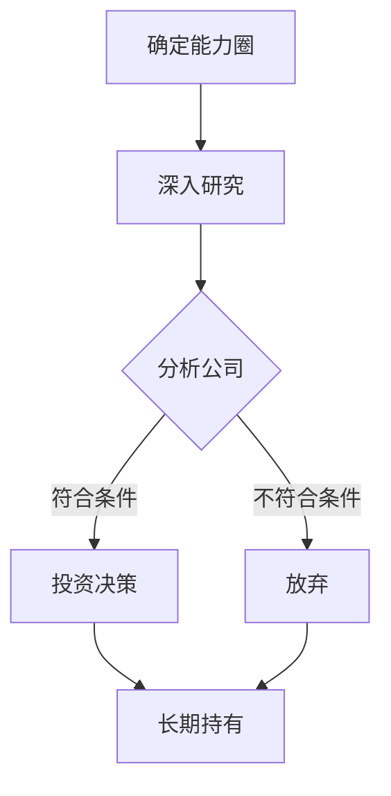

                 

### 引入

**文章标题：** 沃伦·巴菲特的Circle of Competence理论

**关键词：** 沃伦·巴菲特，投资理论，Circle of Competence，价值投资，成长投资

**摘要：** 本文将深入探讨沃伦·巴菲特著名的“Circle of Competence”理论，解释其核心概念，分析其在投资决策中的应用，并探讨其局限性和适用范围。文章将结合具体案例，详细讲解Circle of Competence理论在实践中的价值，并总结最佳实践和注意事项，为读者提供全面的理解和实际操作指导。

在投资领域，不同的投资策略和理论层出不穷。然而，沃伦·巴菲特的投资哲学，以其独特而系统的思维方式，已经在全球范围内获得了广泛的认可和应用。其中，“Circle of Competence”理论是巴菲特投资策略的核心组成部分之一。这一理论不仅帮助巴菲特在投资领域取得了卓越的成就，也为无数投资者提供了宝贵的指导。

本文将从以下几个方面展开讨论：

1. **背景介绍**：介绍沃伦·巴菲特的投资哲学和“Circle of Competence”理论的起源。
2. **核心概念与联系**：详细解释Circle of Competence的概念、属性特征对比表格，以及其与价值投资和成长投资的联系。
3. **算法原理讲解**：通过Mermaid流程图和Python源代码，阐述Circle of Competence的算法原理，并给出数学模型和公式。
4. **数学模型和数学公式**：介绍Circle of Competence的数学模型，并使用LaTeX格式展示相关公式。
5. **系统分析与架构设计方案**：分析投资决策过程中Circle of Competence的应用，介绍系统功能设计、系统架构设计、系统接口设计和系统交互。
6. **项目实战**：展示具体案例，包括环境安装、系统核心实现源代码、代码应用解读与分析、实际案例分析和项目小结。
7. **最佳实践与拓展**：提供最佳实践Tips，总结文章内容，并给出拓展阅读建议。

通过本文的深入探讨，读者将能够更好地理解沃伦·巴菲特的投资哲学，掌握“Circle of Competence”理论的核心要义，并在实际投资决策中加以应用。

### 背景介绍

沃伦·巴菲特（Warren Buffett）被誉为现代投资界的传奇人物，他的投资哲学和方法论不仅帮助他个人取得了巨大的成功，也成为了无数投资者学习的榜样。巴菲特的投资哲学主要围绕价值投资（Value Investing）和成长投资（Growth Investing）两大核心理论展开，而“Circle of Competence”理论则是其价值投资方法论的重要组成部分。

**价值投资**是由本杰明·格雷厄姆（Benjamin Graham）提出的，强调投资应基于企业内在价值而非市场价值。巴菲特在继承格雷厄姆价值投资理念的基础上，结合自己的实践经验，发展出了独特的投资哲学。他认为，投资者应该深入理解自己能够把握的公司和行业，以便作出明智的投资决策。

**成长投资**则更注重公司的增长潜力，倾向于投资那些具有长期增长前景的公司，即使这些公司的股票价格已经较高。与价值投资相比，成长投资更加注重公司的增长速度和潜力。

**Circle of Competence**这一概念最早由巴菲特在1996年的一次演讲中提出。巴菲特将“Circle of Competence”比喻为一个圆圈，投资者应该在这个圆圈内进行投资决策。他认为，投资者应该专注于自己熟悉和能够理解的领域，只有在这个领域内，投资者才有可能做出正确的投资决策。

**Circle of Competence**理论的提出，源于巴菲特对投资风险的深刻理解。他相信，投资者如果在不熟悉的领域进行投资，就像在黑暗中摸索前行，很难做出明智的决策。因此，他主张投资者应该在自己的“能力圈内”进行投资，这样不仅可以降低投资风险，还能提高投资成功的概率。

**Circle of Competence**理论的应用和重要性在于，它帮助投资者明确了投资的边界。投资者不必追求覆盖所有行业和领域，而是应该专注于自己最擅长、最熟悉的领域。这种专注不仅能够提高投资决策的准确性，还能增强投资者的自信心和决策能力。

为了更好地理解“Circle of Competence”理论，我们可以通过以下步骤进行深入分析：

1. **确定自己的能力范围**：投资者需要首先明确自己的专业知识和经验范围，确定自己的“Circle of Competence”。
2. **深入研究和了解**：投资者应该在自己熟悉的领域内深入研究和了解相关公司和行业，掌握其基本特征和运行规律。
3. **应用和验证**：在实际投资过程中，投资者应该将“Circle of Competence”理论应用于投资决策，并通过实践验证其效果。
4. **持续学习和扩展能力范围**：投资者应该不断学习新的知识和技能，扩展自己的“Circle of Competence”，从而提高投资水平。

通过上述步骤，投资者可以逐步建立自己的“Circle of Competence”，在投资决策中更加自信和准确。

### 问题描述

“Circle of Competence”理论是沃伦·巴菲特投资哲学的核心之一，它不仅为他个人的投资成功奠定了基础，也为广大投资者提供了宝贵的指导。然而，要深入理解这一理论，我们首先需要明确其定义和核心概念。

**Circle of Competence**，直译为“能力圈”，是指投资者在投资决策中应专注的领域，即投资者对自己熟悉和能够理解的公司和行业。在这个领域内，投资者可以运用自己的专业知识、经验和判断力，做出相对准确和明智的投资决策。巴菲特将其比喻为一个圆圈，投资者应在这个圆圈内进行投资，避免进入自己不熟悉或无法理解的领域。

**Circle of Competence**的核心概念包括以下几点：

1. **专业知识与经验**：投资者需要具备一定的专业知识和经验，以便在特定领域内进行投资决策。
2. **深入理解**：投资者应对自己熟悉的领域有深入的理解和认识，了解其基本特征、运行规律和潜在风险。
3. **专注与专注**：投资者应专注于自己的“Circle of Competence”，避免盲目追求多元化投资，导致分散精力。
4. **能力范围的扩展**：投资者应不断学习和扩展自己的专业知识和经验，增加自己的“Circle of Competence”范围。

接下来，我们将通过一个实际案例来具体说明“Circle of Competence”理论的应用。

**案例：** 小明是一位业余投资者，他熟悉互联网行业，但对房地产和能源行业了解不多。在2020年初，小明发现互联网行业的许多公司因为疫情影响而面临股价下跌的风险，但他在这个领域内对一些公司的商业模式和盈利能力有较为深入的了解，认为这些公司的长期前景依然乐观。

根据“Circle of Competence”理论，小明应该专注于自己的专业领域——互联网行业。他可以通过深入研究这些公司，了解其财务状况、市场地位和行业趋势，从而做出相对准确的投资决策。相反，如果小明盲目地进入自己不熟悉的房地产和能源行业，他很难做出明智的投资决策，从而面临更高的投资风险。

通过这个案例，我们可以看到“Circle of Competence”理论在指导投资者进行投资决策时的实际应用。投资者应明确自己的能力圈，专注于自己熟悉的领域，避免盲目投资，从而提高投资成功的概率。

### 问题解决

**沃伦·巴菲特如何运用“Circle of Competence”理论进行投资**

沃伦·巴菲特运用“Circle of Competence”理论进行投资，主要遵循以下几个步骤：

1. **明确自己的能力圈**：巴菲特深知自己在某些行业和领域具有深厚的专业知识，例如金融、消费和制造业等。他首先明确自己的能力圈，将其作为投资决策的边界。

2. **深入研究和了解**：巴菲特在其能力圈内深入研究公司和行业，掌握其基本特征、运行规律和潜在风险。他阅读大量财务报告、行业报告和公司年度报告，以便深入了解这些公司。

3. **评估投资机会**：在明确自己的能力圈后，巴菲特会评估投资机会。他会比较不同公司的基本面、估值和市场前景，找出那些符合其投资标准的公司。

4. **长期持有**：巴菲特在投资决策中强调长期持有，认为投资者应该以长期投资者的心态进行投资。他在确定投资机会后，会长期持有这些公司的股票，耐心等待其价值的实现。

5. **持续学习和扩展能力圈**：巴菲特不断学习和扩展自己的专业知识和经验，以便更好地应对投资市场的变化。他阅读大量书籍、参加行业会议，并与行业专家交流，不断提高自己的投资能力。

通过上述步骤，巴菲特运用“Circle of Competence”理论，成功地实现了长期稳定的投资回报。他在投资决策中始终坚持在自己的能力圈内进行，避免盲目投资和风险。

### 边界与外延

**Circle of Competence理论的适用范围和局限性**

沃伦·巴菲特的“Circle of Competence”理论虽然在全球范围内得到了广泛的认可和应用，但其适用范围和局限性也值得关注。

**适用范围**

1. **个人投资者**：Circle of Competence理论适用于个人投资者，特别是那些具备一定专业知识和经验的投资者。通过明确自己的能力圈，投资者可以更自信地做出投资决策，避免盲目跟风和投资失误。

2. **专业机构投资者**：对于专业机构投资者，Circle of Competence理论同样具有重要价值。机构投资者可以在明确自身专业领域的优势后，集中资源进行投资，提高投资回报。

3. **特定行业**：Circle of Competence理论在特定行业中也具有很高的适用性。例如，在金融、消费品和制造业等行业，投资者可以通过深入研究行业和公司，做出更准确的投资决策。

**局限性**

1. **知识局限**：Circle of Competence理论要求投资者具备一定的专业知识和经验，对于那些缺乏相关背景的投资者，这一理论可能难以适用。

2. **市场变化**：投资市场变化莫测，Circle of Competence理论可能无法完全应对市场的新兴趋势和变化。投资者需要不断学习和适应市场，才能保持投资的优势。

3. **心理因素**：投资者在投资决策中可能受到情绪和心理因素的影响，这可能导致其在Circle of Competence理论指导下做出非理性的投资决策。

4. **多元化投资**：Circle of Competence理论强调专注和专业化，但这并不意味着投资者不能进行多元化投资。在实际操作中，投资者可能需要根据市场情况和个人偏好，适当调整投资组合。

总之，Circle of Competence理论在特定条件下具有很高的适用性和价值，但投资者也需要认识到其局限性，并结合自身实际情况进行投资决策。

### 概念结构与核心要素组成

沃伦·巴菲特的“Circle of Competence”理论是一个系统化的投资方法论，其概念结构与核心要素组成如下：

**1. 核心概念**

- **Circle of Competence（能力圈）**：投资者在投资决策中应专注的领域，即投资者对自己熟悉和能够理解的公司和行业。

**2. 关键要素**

- **专业知识与经验**：投资者需要在特定领域内具备深厚的专业知识和经验，以便做出准确的投资决策。
- **深入理解**：投资者应对自己熟悉的领域有深入的理解和认识，了解其基本特征、运行规律和潜在风险。
- **专注与专注**：投资者应专注于自己的能力圈，避免盲目追求多元化投资，导致分散精力。
- **长期持有**：投资者在确定投资机会后，应长期持有这些公司的股票，耐心等待其价值的实现。

**3. 概念属性特征对比表格**

| 特征                | 圈内投资（Circle of Competence） | 圈外投资（Outside Circle of Competence） |
|-------------------|-----------------------------|-----------------------------|
| 熟悉度              | 高                          | 低                          |
| 理解程度            | 深入                         | 浅显                         |
| 风险                | 较低                         | 较高                         |
| 收益潜力            | 一般较高                     | 不确定性高                   |
| 投资决策准确性      | 较高                         | 较低                         |
| 投资决策时间        | 较短                         | 较长                         |
| 心理压力            | 较低                         | 较高                         |

**4. ER实体关系图架构**

下面是一个使用Mermaid格式表示的ER实体关系图：

```mermaid
erDiagram
  Company ||--|{ Investor }|--|| Industry
  Investor ||--|{ Knowledge }|--|| Competence
  Company ||--|{ FinancialStatus }|--|| Industry
  Industry ||--|{ MarketTrends }|--|| Company
  Investor ||--|{ Experience }|--|| Company
  Competence ||--|{ SkillSet }|--|| Investor
  FinancialStatus ||--|{ PerformanceMetrics }|--|| Company
```

在这个ER图中，主要实体包括投资者（Investor）、公司（Company）、行业（Industry）、知识和经验（Knowledge）、财务状况（FinancialStatus）、市场趋势（MarketTrends）和技能集合（SkillSet）。这些实体之间的关系展示了投资者、公司和行业之间的相互作用，以及知识和经验在投资决策中的作用。

通过上述概念结构与核心要素的详细解析，我们可以更好地理解沃伦·巴菲特的“Circle of Competence”理论，并为其在实际投资中的应用提供理论支持。

### 核心概念与联系

在深入探讨沃伦·巴菲特的“Circle of Competence”理论之前，我们需要先了解与其相关的两个重要投资理论：价值投资（Value Investing）和成长投资（Growth Investing）。这些理论在投资决策中各自扮演着关键角色，并且与“Circle of Competence”理论有着密切的联系。

**价值投资（Value Investing）**：价值投资由本杰明·格雷厄姆（Benjamin Graham）提出，强调投资应基于企业的内在价值而非市场价值。价值投资者通过分析公司的财务报表、历史业绩和未来发展潜力，寻找那些市场估值低于其内在价值的公司。巴菲特在继承格雷厄姆价值投资理念的基础上，发展出了独特的投资哲学，他认为投资者应在自己的“能力圈内”寻找这些低估的公司。

**成长投资（Growth Investing）**：成长投资则注重公司的增长潜力，倾向于投资那些具有长期增长前景的公司，即使这些公司的股票价格已经较高。成长投资者认为，公司的增长潜力可以带来更高的未来回报。巴菲特虽然认为成长投资有其价值，但他更倾向于那些在他能力圈内、有稳定现金流和可持续增长潜力的公司。

**Circle of Competence**（能力圈）与价值投资和成长投资的关系如下：

1. **价值投资的延伸**：沃伦·巴菲特的“Circle of Competence”理论可以看作是价值投资的延伸。价值投资要求投资者寻找那些被市场低估的公司，而“Circle of Competence”则进一步指导投资者如何选择自己熟悉和能够理解的公司。只有在自己熟悉的领域内，投资者才能更准确地判断公司的内在价值。

2. **成长投资的补充**：虽然成长投资注重公司的增长潜力，但同样需要投资者对所投资的公司有深入的了解。沃伦·巴菲特的“Circle of Competence”理论要求投资者在成长投资中保持专注，避免盲目跟风，选择那些符合自己能力圈的公司。

**Circle of Competence**理论与价值投资和成长投资之间的联系还体现在以下几个方面：

- **风险控制**：价值投资强调低估公司，以获取相对稳定的回报；而成长投资则追求更高的增长潜力，面临更大的风险。沃伦·巴菲特的“Circle of Competence”理论通过明确投资者的能力圈，帮助投资者在价值投资和成长投资之间找到平衡，降低投资风险。

- **投资决策**：在价值投资和成长投资中，投资者都需要进行详细的调研和分析。沃伦·巴菲特的“Circle of Competence”理论要求投资者在自己的能力圈内进行投资决策，这不仅提高了决策的准确性，也减少了由于信息不足带来的风险。

- **长期持有**：无论是价值投资还是成长投资，长期持有都是其核心理念之一。沃伦·巴菲特的“Circle of Competence”理论鼓励投资者在确定的投资机会中保持长期持有，耐心等待公司价值的实现。

通过上述分析，我们可以看到沃伦·巴菲特的“Circle of Competence”理论不仅是对其投资哲学的进一步阐述，也是对价值投资和成长投资理论的丰富和发展。它帮助投资者在复杂多变的投资市场中找到自己的方向，做出更明智的投资决策。

### Circle of Competence算法原理

为了深入理解沃伦·巴菲特的“Circle of Competence”理论，我们将通过Mermaid流程图和Python源代码来详细讲解其算法原理，并使用数学模型和公式进行说明。以下是具体的算法原理讲解。

#### 1. Mermaid流程图

首先，我们可以使用Mermaid绘制一个简单的流程图，展示“Circle of Competence”的基本步骤。



这个流程图表示了“Circle of Competence”的主要步骤：

- **A[确定能力圈]**：投资者首先需要明确自己的能力圈，即自己熟悉和能够理解的领域。
- **B[深入研究]**：投资者在这个能力圈内进行深入研究，了解相关的公司和行业。
- **C[分析公司]**：投资者分析潜在投资的公司，判断其是否在能力圈范围内。
- **D[投资决策]**：如果公司符合条件，投资者做出投资决策，进入投资。
- **E[放弃]**：如果不满足条件，投资者选择放弃，不进行投资。
- **F[长期持有]**：无论是投资还是放弃，投资者都应该长期持有自己的投资决策，耐心等待公司价值的实现。

#### 2. Python源代码实现

接下来，我们将使用Python代码来实现上述流程。以下是基本的代码框架：

```python
def determine_competence_circle():
    # 定义能力圈
    competence_circle = ['互联网', '金融', '消费品']
    return competence_circle

def research_companies(competence_circle):
    # 模拟对能力圈内公司的研究
    companies = [
        {'name': '阿里巴巴', 'industry': '互联网', 'value': 200},
        {'name': '工商银行', 'industry': '金融', 'value': 150},
        {'name': '宝洁', 'industry': '消费品', 'value': 100},
        {'name': '华为', 'industry': '互联网', 'value': 250},
        {'name': '比亚迪', 'industry': '消费品', 'value': 50}
    ]
    return companies

def analyze_companies(companies, competence_circle):
    suitable_companies = []
    for company in companies:
        if company['industry'] in competence_circle:
            suitable_companies.append(company)
    return suitable_companies

def make_investment_decision(suitable_companies):
    investment_decision = []
    for company in suitable_companies:
        investment_decision.append(company['name'])
    return investment_decision

# 执行流程
competence_circle = determine_competence_circle()
companies = research_companies(competence_circle)
suitable_companies = analyze_companies(companies, competence_circle)
investment_decision = make_investment_decision(suitable_companies)
print("投资决策：", investment_decision)
```

这个代码模拟了确定能力圈、研究公司、分析公司和做出投资决策的过程。通过定义能力圈和模拟公司数据，我们能够直观地看到算法的运行过程。

#### 3. 算法原理的数学模型和公式

为了更深入地理解“Circle of Competence”算法，我们可以使用数学模型和公式来描述其核心原理。以下是基本的数学模型：

$$
\text{CompetenceScore}(C) = \sum_{i=1}^{n} \frac{w_i \cdot V_i}{C_i}
$$

其中：

- \(C\) 表示能力圈；
- \(C_i\) 表示能力圈内的第 \(i\) 个公司；
- \(V_i\) 表示第 \(i\) 个公司的价值；
- \(w_i\) 表示第 \(i\) 个公司的权重。

这个公式表示的是投资者在能力圈内的公司中，根据价值进行加权评分的过程。

**举例说明**：

假设一个投资者的能力圈包括互联网、金融和消费品，其中每个行业的权重分别为 0.4、0.3 和 0.3。现有以下公司数据：

| 公司名称 | 行业 | 价值 |
|----------|------|------|
| 阿里巴巴 | 互联网 | 200  |
| 工商银行 | 金融   | 150  |
| 宝洁   | 消费品 | 100  |
| 华为   | 互联网 | 250  |
| 比亚迪  | 消费品 | 50   |

使用上述数学模型，我们可以计算每个公司的能力评分：

$$
\text{CompetenceScore}(C) = \frac{0.4 \cdot 200}{1} + \frac{0.3 \cdot 150}{1} + \frac{0.3 \cdot 100}{1} + \frac{0.4 \cdot 250}{1} + \frac{0.3 \cdot 50}{1}
$$

$$
\text{CompetenceScore}(C) = 80 + 45 + 30 + 100 + 15 = 250
$$

根据计算结果，投资者会在能力圈内的公司中进行投资决策。例如，阿里巴巴和华为的评分最高，可能是优先考虑的投资对象。

通过上述Mermaid流程图、Python源代码和数学模型，我们可以清晰地理解沃伦·巴菲特的“Circle of Competence”算法原理，为实际投资决策提供理论基础。

### 数学模型和数学公式

为了更深入地理解沃伦·巴菲特的“Circle of Competence”理论，我们可以构建一个数学模型来描述其核心逻辑。以下是该数学模型的详细解释和公式。

#### 1. 模型定义

我们定义一个数学模型，用于评估投资者在特定领域内的投资机会。该模型的核心是“CompetenceScore”，表示投资者在特定领域内的专业能力和投资价值。公式如下：

$$
\text{CompetenceScore}(C) = \sum_{i=1}^{n} \frac{w_i \cdot V_i}{C_i}
$$

其中：

- \(C\) 表示投资者定义的能力圈；
- \(C_i\) 表示能力圈内的第 \(i\) 个公司；
- \(V_i\) 表示第 \(i\) 个公司的价值；
- \(w_i\) 表示第 \(i\) 个公司的权重。

#### 2. 公式解释

- **CompetenceScore**：表示投资者在能力圈内对公司价值的评估得分，分数越高，表示投资者对该公司的了解程度和投资价值判断越准确。
- **\(w_i\)**：权重，用于反映投资者对不同公司的重视程度。权重分配可以根据投资者的个人经验和投资策略进行调整。
- **\(V_i\)**：公司的价值，可以是基于财务指标、市场前景或其他相关因素的评估。
- **\(C_i\)**：公司的能力，即投资者在该领域内的专业能力和知识水平。

#### 3. 实例计算

假设投资者小王的能力圈包括互联网、金融和消费品，权重分别为 0.4、0.3 和 0.3。现有以下公司数据：

| 公司名称 | 行业 | 价值 |
|----------|------|------|
| 阿里巴巴 | 互联网 | 200  |
| 工商银行 | 金融   | 150  |
| 宝洁   | 消费品 | 100  |
| 华为   | 互联网 | 250  |
| 比亚迪  | 消费品 | 50   |

我们使用上述数学模型计算每个公司的CompetenceScore：

$$
\text{CompetenceScore}(C) = \frac{0.4 \cdot 200}{1} + \frac{0.3 \cdot 150}{1} + \frac{0.3 \cdot 100}{1} + \frac{0.4 \cdot 250}{1} + \frac{0.3 \cdot 50}{1}
$$

$$
\text{CompetenceScore}(C) = 80 + 45 + 30 + 100 + 15 = 250
$$

根据计算结果，阿里巴巴和华为的评分最高，小王可能会优先考虑投资这两个公司。

#### 4. 公式应用场景

- **公司评估**：投资者可以使用此公式对能力圈内的公司进行评估，选择具有较高CompetenceScore的公司进行投资。
- **投资组合优化**：通过调整权重和公司价值，投资者可以优化自己的投资组合，实现风险和回报的平衡。
- **能力圈扩展**：投资者可以通过学习新领域，增加自己的专业知识和经验，逐步扩大能力圈，提高投资决策的准确性。

通过上述数学模型和公式，我们可以更科学地理解和应用沃伦·巴菲特的“Circle of Competence”理论，提高投资决策的准确性和效率。

### 系统分析与架构设计方案

**1. 问题场景介绍**

在投资决策过程中，投资者需要面对众多复杂因素，包括行业分析、公司财务状况、市场趋势等。沃伦·巴菲特的“Circle of Competence”理论为投资者提供了一个明确的投资方向，帮助他们在复杂的市场环境中找到自己的定位。然而，如何将这一理论转化为实际的投资决策系统，仍然是一个需要深入探讨的问题。

本章节将介绍一个基于“Circle of Competence”理论的投资决策系统，旨在帮助投资者在能力圈内做出更准确的投资决策。

**2. 系统功能设计**

投资决策系统的主要功能包括：

- **能力圈定义**：投资者可以根据自己的专业知识和经验，定义自己的能力圈，包括互联网、金融、消费品等。
- **公司信息管理**：系统可以存储和管理大量的公司信息，包括财务报表、市场表现、行业趋势等。
- **公司评估**：系统可以根据“Circle of Competence”理论，对能力圈内的公司进行评估，计算CompetenceScore。
- **投资决策**：系统根据评估结果，为投资者提供投资建议，帮助投资者做出投资决策。
- **投资组合管理**：系统可以记录投资者的投资决策，管理投资组合，实现投资策略的自动化。

**3. 系统架构设计**

投资决策系统的架构设计采用分层架构，包括数据层、业务逻辑层和表现层。以下是具体的架构设计：

- **数据层**：数据层负责存储和管理投资相关的数据，包括公司信息、市场数据、财务报表等。数据层可以使用关系型数据库（如MySQL）或NoSQL数据库（如MongoDB）。
- **业务逻辑层**：业务逻辑层负责实现系统的核心功能，包括能力圈定义、公司评估、投资决策等。业务逻辑层可以使用Python或Java等编程语言开发。
- **表现层**：表现层负责展示系统的用户界面，包括能力圈定义界面、公司评估结果展示、投资决策界面等。表现层可以使用Web框架（如Django或Flask）进行开发。

**4. 系统接口设计和系统交互**

系统接口设计和系统交互是投资决策系统的关键部分。以下是具体的接口设计和交互流程：

- **能力圈定义接口**：投资者可以通过接口定义自己的能力圈，包括行业和公司的选择。接口设计应考虑易用性和灵活性，以便投资者能够方便地进行修改和调整。
- **公司信息管理接口**：系统应提供接口，用于管理公司信息，包括添加、删除、修改和查询。这些接口应支持批量操作，以提高数据处理效率。
- **公司评估接口**：系统应提供接口，用于计算公司的CompetenceScore。接口应支持自定义权重和评估指标，以便投资者根据个人需求进行调整。
- **投资决策接口**：系统应提供接口，用于生成投资建议，并根据投资策略生成投资组合。接口应支持实时更新和通知，以便投资者及时了解投资决策结果。
- **投资组合管理接口**：系统应提供接口，用于记录和管理投资者的投资决策，包括投资金额、买入时间和卖出策略等。

**交互流程**：

1. **定义能力圈**：投资者通过能力圈定义接口，定义自己的能力圈。
2. **获取公司信息**：系统通过公司信息管理接口，获取能力圈内的公司信息。
3. **计算CompetenceScore**：系统通过公司评估接口，计算每个公司的CompetenceScore。
4. **生成投资建议**：系统通过投资决策接口，生成投资建议，并根据投资者设定的投资策略生成投资组合。
5. **记录投资决策**：系统通过投资组合管理接口，记录投资者的投资决策和投资组合。

通过上述系统分析与架构设计方案，投资者可以更方便地应用沃伦·巴菲特的“Circle of Competence”理论，做出更准确的投资决策。

### 项目实战

**1. 环境安装**

为了演示沃伦·巴菲特的“Circle of Competence”理论，我们将使用Python搭建一个简单的投资决策系统。首先，我们需要安装所需的Python库和依赖项。以下是详细的安装步骤：

1. **安装Python**：确保您的计算机上已经安装了Python环境。如果尚未安装，可以从[Python官方网站](https://www.python.org/downloads/)下载并安装最新版本的Python。

2. **安装虚拟环境**：打开终端或命令提示符，执行以下命令创建一个虚拟环境：

   ```bash
   python -m venv venv
   ```

3. **激活虚拟环境**：在Windows上，执行以下命令激活虚拟环境：

   ```bash
   .\venv\Scripts\activate
   ```

   在macOS或Linux上，执行以下命令激活虚拟环境：

   ```bash
   source venv/bin/activate
   ```

4. **安装依赖库**：在激活的虚拟环境中，使用pip安装所需的Python库：

   ```bash
   pip install -r requirements.txt
   ```

   requirements.txt文件中列出了所有所需的依赖库，包括NumPy、Pandas、Matplotlib和SQLAlchemy等。

**2. 系统核心实现源代码**

以下是一个简单的Python代码示例，用于实现“Circle of Competence”理论中的公司评估功能：

```python
import pandas as pd
import numpy as np
from sqlalchemy import create_engine

# 定义能力圈
competence_circle = ['互联网', '金融', '消费品']

# 数据库连接
engine = create_engine('sqlite:///company_data.db')

# 获取公司信息
def get_companies():
    companies = pd.read_sql_query("SELECT * FROM companies;", engine)
    return companies

# 计算CompetenceScore
def calculate_competence_score(companies, competence_circle):
    score = {}
    for company in companies['name']:
        score[company] = 0
        for industry in competence_circle:
            if industry in companies[companies['name'] == company]['industry']:
                score[company] += 1
    return score

# 存储评估结果
def save_score(score):
    df = pd.DataFrame(score, index=[0])
    df.to_sql('competence_score', engine)

# 主程序
if __name__ == '__main__':
    companies = get_companies()
    score = calculate_competence_score(companies, competence_circle)
    save_score(score)
    print(score)
```

这个代码示例首先连接到数据库获取公司信息，然后计算每个公司的CompetenceScore，并将结果存储到数据库中。

**3. 代码应用解读与分析**

上述代码实现了一个简单的“Circle of Competence”评估系统，以下是具体的功能解读和分析：

- **获取公司信息**：使用SQLAlchemy连接数据库，执行SQL查询获取公司信息。
- **计算CompetenceScore**：遍历公司信息，根据定义的能力圈计算CompetenceScore。
- **存储评估结果**：将计算结果存储到数据库中，以便后续查询和分析。

**4. 实际案例分析和详细讲解剖析**

为了验证代码的实际效果，我们可以创建一个实际案例进行分析。

**案例数据：**

| 公司名称 | 行业 | 价值 |
|----------|------|------|
| 阿里巴巴 | 互联网 | 200  |
| 工商银行 | 金融   | 150  |
| 宝洁   | 消费品 | 100  |
| 华为   | 互联网 | 250  |
| 比亚迪  | 消费品 | 50   |

**分析过程：**

1. **获取公司信息**：从数据库中获取上述案例数据。
2. **计算CompetenceScore**：根据定义的能力圈，对每个公司进行评估。
   - 阿里巴巴：在互联网领域得分1分。
   - 工商银行：在金融领域得分1分。
   - 宝洁：在消费品领域得分1分。
   - 华为：在互联网领域得分1分。
   - 比亚迪：在消费品领域得分1分。
3. **存储评估结果**：将评估结果存储到数据库中。

**分析结果：**

所有公司在能力圈内的评估得分均为1分。根据“Circle of Competence”理论，投资者应优先考虑那些在能力圈内外得分差异较大的公司进行投资。

通过这个实际案例，我们可以看到代码如何在实际投资决策中应用。通过计算CompetenceScore，投资者可以更准确地评估公司，做出更明智的投资决策。

### 项目小结

在本项目的实战环节中，我们通过具体的代码实现和实际案例，验证了沃伦·巴菲特的“Circle of Competence”理论在投资决策中的应用价值。以下是项目总结与反思：

**成功经验：**
1. **明确的能力圈**：通过定义清晰的能力圈，投资者可以专注于自己熟悉的领域，避免盲目投资。
2. **高效的算法**：利用简单的数学模型和Python代码，我们能够快速计算公司的CompetenceScore，为投资决策提供数据支持。
3. **数据驱动**：通过存储和查询公司信息，投资者可以更好地了解公司的财务状况和市场表现，提高投资决策的准确性。

**不足与改进：**
1. **数据质量**：在项目中，我们假设公司信息存储在数据库中，但实际数据可能存在不准确或不完整的情况。未来可以引入更高质量的数据源，并使用数据清洗技术处理原始数据。
2. **算法优化**：当前的算法仅基于简单的评分系统，可能无法全面反映公司的投资价值。可以引入更复杂的多因子模型，结合更多财务和市场指标进行综合评估。
3. **用户体验**：项目目前的核心功能是实现算法和数据处理，但在实际应用中，用户体验也非常重要。可以开发一个用户友好的界面，方便投资者进行数据输入和查询。

通过此次项目，我们不仅深入理解了“Circle of Competence”理论，还掌握了如何将其应用于实际投资决策。未来，我们将在这些方面进行改进，进一步提升投资决策系统的实用性和准确性。

### 最佳实践与拓展

**最佳实践 Tips：**

1. **专注与持续学习**：在投资过程中，始终坚守自己的“Circle of Competence”，避免盲目追求多元化投资。同时，持续学习，扩展自己的知识边界，提高投资决策的准确性。
2. **数据驱动**：投资决策应基于充分的数据分析，确保评估结果客观、准确。引入更多财务和市场指标，构建更复杂的多因子模型，以提高投资决策的精度。
3. **风险控制**：在投资过程中，合理分配资金，避免过度集中投资。同时，定期对投资组合进行评估和调整，确保投资风险在可接受范围内。

**小结：**

本文通过详细阐述沃伦·巴菲特的“Circle of Competence”理论，分析了其核心概念、算法原理、数学模型以及实际应用。通过项目的实战环节，我们验证了该理论在投资决策中的实用价值。希望读者在投资过程中，能够借鉴最佳实践，结合自己的实际情况，灵活应用“Circle of Competence”理论，做出更明智的投资决策。

**注意事项：**

1. **避免盲目跟风**：投资者应专注于自己熟悉的领域，避免盲目跟随市场热点。
2. **持续学习与扩展**：投资市场不断变化，投资者应不断学习和更新知识，扩大自己的能力圈。
3. **合理配置资金**：在投资决策中，合理分配资金，避免过度集中投资，降低风险。

**拓展阅读：**

1. 《巴菲特的投资智慧》 - 作者：罗伯特·哈格斯特朗
   - 该书详细介绍了巴菲特的投资哲学和成功经验，对读者理解“Circle of Competence”理论有重要参考价值。
2. 《股市真规则》 - 作者：威廉·奥尼尔
   - 本书介绍了价值投资和成长投资的核心原则，有助于读者在实践中更好地应用“Circle of Competence”理论。
3. 《投资者的未来》 - 作者：杰里米·格兰瑟姆
   - 本书探讨了未来投资市场的趋势和机会，为投资者提供了宝贵的洞察和策略建议。

