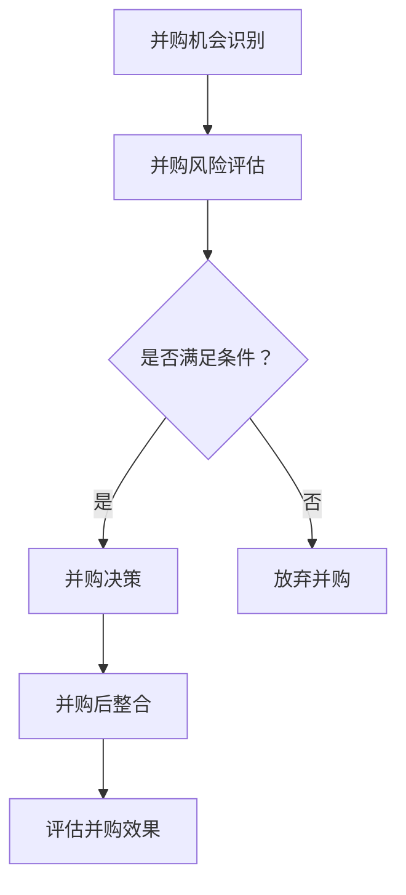
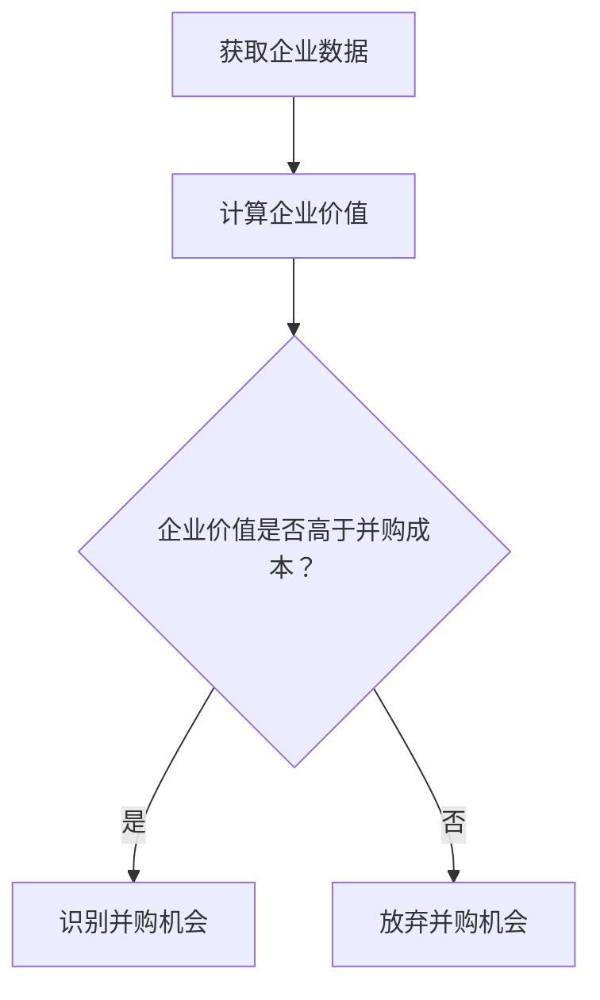

                 


### 《沃伦巴菲特的并购策略分析》

> 关键词：沃伦·巴菲特、并购策略、企业价值评估、成本效益分析、风险评估、并购后整合

> 摘要：本文旨在深入剖析沃伦·巴菲特的并购策略，从背景介绍、核心概念与联系、并购策略原理、案例分析、实战应用等方面进行详细分析，旨在为读者提供一套系统化、结构化的并购策略分析框架。

---

## 引言

沃伦·巴菲特，被誉为“股神”，是世界上最成功的投资者之一。他的投资哲学和策略深受全球投资者和研究者的关注。本文将重点分析巴菲特的并购策略，探讨其核心原理、数学模型、算法流程以及实际应用。

### 第1章：巴菲特并购策略的背景与历史

#### 1.1 巴菲特的投资哲学

巴菲特的投资哲学可以概括为“价值投资”。他坚信投资的首要目标是寻找价格低于价值的公司股票。这一哲学在他的并购策略中也得到了充分体现。

#### 1.2 巴菲特并购策略的发展

巴菲特的并购策略始于20世纪70年代，通过一系列成功的并购案例，逐渐形成了他独特的并购模式。这一模式的核心是深度分析企业价值、成本效益和并购风险。

#### 1.3 并购策略的核心理念

巴菲特的并购策略核心理念包括：寻找具有长期增长潜力的企业、确保并购价格合理、以及通过有效整合实现协同效应。

#### 1.4 并购策略的演变与影响

随着市场环境的变化，巴菲特的并购策略也在不断演变。他更加注重企业内在价值，而非短期市场波动。这种策略在全球资本市场产生了深远影响。

### 第2章：巴菲特并购策略的核心概念与联系

#### 2.1 企业价值评估

企业价值评估是巴菲特并购策略的核心。他使用一系列指标，如净资产、现金流和市盈率等，来评估企业价值。

#### 2.2 成本效益分析

巴菲特在并购过程中，会深入分析并购的成本和潜在收益，确保并购的性价比。

#### 2.3 并购风险分析

巴菲特深知并购风险的存在，因此他会进行全面的风险评估，包括市场风险、财务风险和运营风险等。

#### 2.4 并购后的整合策略

并购后的整合是巴菲特并购策略的关键。他强调通过有效的组织架构和流程优化，实现并购企业的协同效应。

### 第3章：巴菲特并购策略的数学模型与公式

#### 3.1 并购策略中的基本数学公式

巴菲特在企业价值评估中，使用了以下基本数学公式：

$$
V = \frac{FC}{(1 + r)^n}
$$

其中，V代表企业价值，FC代表现金流，r代表折现率，n代表现金流持续期。

#### 3.2 并购策略的数学模型解释

巴菲特使用上述数学模型，将企业价值与其并购成本进行比较，以判断是否进行并购。

#### 3.3 数学模型的应用示例

假设一家企业的现金流为1000万美元，折现率为10%，现金流持续期为10年。根据上述公式，该企业的价值为：

$$
V = \frac{1000}{(1 + 0.1)^10} = 385.54 万美元
$$

如果该企业的收购价为500万美元，则巴菲特会考虑进行并购。

### 第4章：巴菲特并购策略的算法原理与流程图

#### 4.1 并购策略中的算法原理

巴菲特的并购策略包括三个核心算法：并购机会识别、并购风险评估和并购后整合优化。

#### 4.2 并购策略流程图

以下是巴菲特并购策略的流程图：



#### 4.3 算法流程图示例

以下是并购机会识别算法的流程图示例：



### 第5章：巴菲特的并购案例分析

#### 5.1 华盛顿邮报并购案

华盛顿邮报并购案是巴菲特的一次经典并购案例。以下是该案例的分析：

##### 5.1.1 案例背景

巴菲特在2007年以3.15亿美元的价格收购了华盛顿邮报。当时，华盛顿邮报面临严重的财务困境和市场竞争压力。

##### 5.1.2 案例分析

巴菲特通过深入分析华盛顿邮报的财务数据和市场状况，认为其具备长期增长潜力。他采取了以下策略：

1. 优化组织架构，提高运营效率。
2. 投资于数字媒体，扩大市场份额。
3. 保持公司的独立性，不受政治影响。

##### 5.1.3 案例结论

华盛顿邮报并购案的成功证明了巴菲特并购策略的可行性。尽管面临诸多挑战，但通过有效的并购后整合，华盛顿邮报实现了业绩的持续增长。

#### 5.2 约翰逊控制公司并购案

约翰逊控制公司并购案是巴菲特的另一项重要并购案例。以下是该案例的分析：

##### 5.2.1 案例背景

巴菲特在2015年以200亿美元的价格收购了约翰逊控制公司。这是一家全球领先的消费品公司，拥有众多知名品牌。

##### 5.2.2 案例分析

巴菲特在收购约翰逊控制公司时，主要关注以下方面：

1. 企业价值评估：巴菲特通过分析约翰逊控制公司的财务数据和市场状况，认为其价值被低估。
2. 成本效益分析：巴菲特认为，约翰逊控制公司的收购成本与其潜在收益相比，性价比很高。
3. 并购后整合：巴菲特计划通过优化公司结构、提高运营效率，实现并购后的协同效应。

##### 5.2.3 案例结论

约翰逊控制公司并购案的成功展示了巴菲特并购策略的广泛适用性。尽管收购金额巨大，但通过有效的并购后整合，巴菲特实现了预期的投资回报。

### 第6章：巴菲特并购策略的实战应用

#### 6.1 实战应用环境搭建

要进行巴菲特并购策略的实战应用，需要搭建一个包含财务分析工具、市场分析工具和企业评估模型的计算环境。

#### 6.2 并购策略的核心实现

以下是一个简单的Python代码示例，用于实现巴菲特并购策略的核心功能：

```python
import numpy as np

def calculate_enterprise_value(fc, r, n):
    """
    计算企业价值
    :param fc: 现金流
    :param r: 折现率
    :param n: 现金流持续期
    :return: 企业价值
    """
    v = np.sum([fc / (1 + r)**i for i in range(n)])
    return v

def assess_cost_benefit_ratio(acquisition_cost, enterprise_value):
    """
    评估成本效益比
    :param acquisition_cost: 收购成本
    :param enterprise_value: 企业价值
    :return: 成本效益比
    """
    return enterprise_value / acquisition_cost

def risk_analysis(fc, r, n, acquisition_cost):
    """
    风险评估
    :param fc: 现金流
    :param r: 折现率
    :param n: 现金流持续期
    :param acquisition_cost: 收购成本
    :return: 风险评估结果
    """
    ev = calculate_enterprise_value(fc, r, n)
    cbr = assess_cost_benefit_ratio(acquisition_cost, ev)
    if cbr > 1:
        return "并购风险较低"
    else:
        return "并购风险较高"

# 示例
fc = 1000000
r = 0.1
n = 10
acquisition_cost = 5000000

ev = calculate_enterprise_value(fc, r, n)
cbr = assess_cost_benefit_ratio(acquisition_cost, ev)
risk_result = risk_analysis(fc, r, n, acquisition_cost)

print("企业价值：", ev)
print("成本效益比：", cbr)
print("风险评估结果：", risk_result)
```

#### 6.3 实际案例分析

以下是一个简单的实际案例分析，用于展示巴菲特并购策略的应用：

**案例一：并购决策过程分析**

1. 获取企业财务数据。
2. 计算企业价值。
3. 评估成本效益比。
4. 进行风险评估。
5. 基于评估结果做出并购决策。

**案例二：并购后整合效果分析**

1. 评估并购后的运营效率。
2. 分析并购后的财务状况。
3. 评估并购后的市场份额。
4. 总结并购后的整合效果。

### 第7章：巴菲特并购策略的最佳实践与拓展

#### 7.1 最佳实践技巧

1. 深入了解行业和市场。
2. 注重企业价值评估的准确性。
3. 全面评估并购风险。
4. 设计有效的并购后整合策略。

#### 7.2 并购策略的注意事项

1. 避免过度依赖市场波动。
2. 注意并购后的整合成本。
3. 保持并购策略的灵活性。

#### 7.3 拓展阅读与进一步学习

1. 《巴菲特的投资智慧》
2. 《巴菲特致股东的信》
3. 《企业并购策略》

---

**作者：AI天才研究院/AI Genius Institute & 禅与计算机程序设计艺术 /Zen And The Art of Computer Programming**

