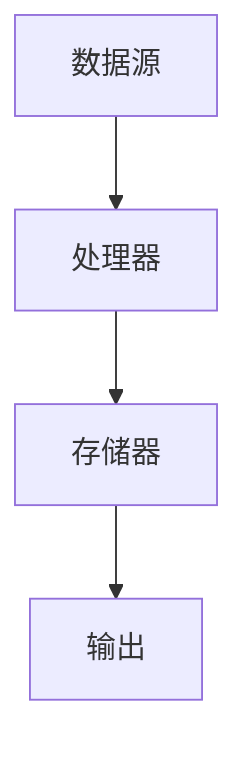
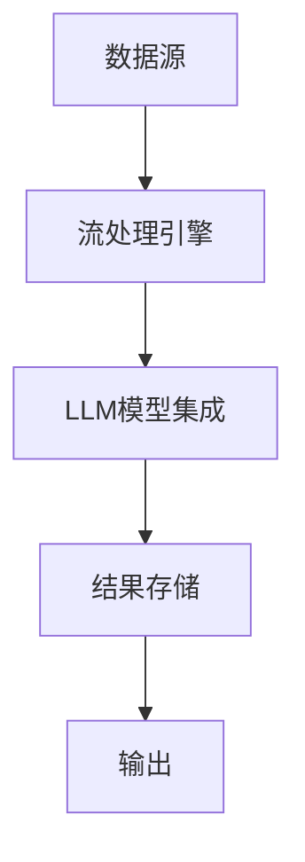

                 

### 流处理框架概述

**关键词**：流处理、数据处理、实时处理、批处理、框架

**摘要**：本文将探讨流处理框架在实时数据处理中的重要性，概述其核心概念、技术特点及发展趋势，旨在为读者提供一个全面的认识，以及如何利用流处理框架提升大规模语言模型（LLM）应用的数据处理能力。

随着互联网和物联网的迅猛发展，数据量呈现爆炸式增长。传统的批处理方式由于处理周期长、效率低，已无法满足现代应用对实时数据处理的需求。流处理框架因此应运而生，成为了大数据领域的关键技术之一。流处理框架通过处理连续的数据流，实现对数据的高效实时分析，从而提供更加精准和即时的业务决策支持。本文将围绕流处理框架的概述，逐步分析其核心概念、技术特点和发展趋势，为后续章节的深入探讨奠定基础。

#### 1.1 流处理背景

##### 1.1.1 数据处理需求的变化

随着信息技术的迅猛发展，数据处理的需求也在不断演变。从早期的简单数据存储和查询，到如今复杂的实时数据处理和业务分析，数据处理需求经历了巨大的变革。在早期，数据量相对较小，数据处理任务相对简单，主要通过批处理方式完成。然而，随着互联网、物联网和移动设备的普及，数据量呈现爆炸式增长，数据类型也越来越多样化，这给传统的批处理方式带来了巨大的挑战。

批处理方式的显著特点是其处理周期较长，通常需要数小时甚至更长时间来完成数据处理任务。尽管批处理能够处理大量数据，但其实时性较差，无法满足现代应用对即时数据分析和决策支持的需求。例如，在金融领域，交易数据的实时处理对于风险控制和投资决策至关重要；在电子商务领域，实时用户行为分析和个性化推荐对于提高用户满意度和销售转化率至关重要。

相比之下，流处理方式能够提供实时数据处理能力，即在数据产生的同时进行处理，并在极短的时间内生成结果。这种实时性使得流处理在许多应用场景中具有明显的优势，例如实时监控、实时流数据分析、实时推荐系统等。流处理能够快速响应用户行为，提供即时的业务反馈和决策支持，从而提升业务效率和用户体验。

##### 1.1.2 流处理技术的兴起

流处理技术的兴起源于对实时数据处理需求的日益增长。流处理框架通过处理连续的数据流，实现了对大数据的高效实时分析。与传统批处理方式不同，流处理技术专注于处理动态和不断变化的数据，能够实时捕捉数据流中的关键特征和模式，提供即时分析和决策支持。

流处理技术的核心优势在于其实时性和高效性。流处理框架能够实时处理大量数据，提供秒级或毫秒级的数据响应，这使得流处理在需要即时反馈的应用场景中具有不可替代的作用。例如，在金融领域，实时交易数据处理可以迅速识别异常交易，防范风险；在医疗领域，实时监控患者数据可以及时预警异常情况，提供急救支持。

此外，流处理技术还能够提供更高的数据吞吐量和更好的可扩展性。通过分布式架构和并行处理，流处理框架能够处理大规模数据流，同时支持水平扩展，满足不断增长的数据处理需求。这使得流处理技术在处理海量数据方面具有显著优势，能够适应不断变化的业务需求。

##### 1.1.3 流处理与批处理的对比

流处理和批处理是两种不同的数据处理方式，各有其适用场景和特点。以下是对两者进行对比的几个关键方面：

1. **处理模式**：
   - **批处理**：批处理方式将数据分为批次进行处理，每个批次的数据量较大，处理周期较长。批处理通常在固定的处理时间窗口内完成，例如每天或每小时一次。
   - **流处理**：流处理方式对数据流进行实时处理，每条数据在生成的同时进行处理，处理周期极短，通常为秒级或毫秒级。

2. **数据时效性**：
   - **批处理**：批处理具有较低的数据时效性，数据处理结果往往存在一定的时间延迟。
   - **流处理**：流处理具有极高的数据时效性，能够实时捕捉和处理数据流中的变化，提供即时分析结果。

3. **数据处理能力**：
   - **批处理**：批处理能够处理大量数据，但由于处理周期长，数据处理效率相对较低。
   - **流处理**：流处理专注于处理动态和实时数据，数据处理效率较高，能够快速响应用户需求。

4. **适用场景**：
   - **批处理**：适用于数据量较大、数据处理周期较长、对实时性要求不高的场景，如数据备份、报表生成等。
   - **流处理**：适用于需要实时数据处理、即时反馈和业务决策的场景，如实时监控、实时推荐系统、在线交易处理等。

通过对比可以看出，流处理和批处理各有优缺点，适用于不同的数据处理需求。在实际应用中，可以根据具体的业务需求选择合适的处理方式，以实现最佳的数据处理效果。

#### 1.2 流处理框架核心概念

##### 1.2.1 概念解析

流处理框架是一套用于处理实时数据流的系统化解决方案，它通过一系列核心组件和技术，实现数据流的高效实时处理和分析。流处理框架的核心概念包括数据流、事件、处理逻辑、状态管理和容错机制等。

- **数据流**：数据流是流处理框架处理的基本单元，它由一系列连续的数据记录组成，每条记录代表了数据在某一时刻的状态。
- **事件**：事件是数据流中的关键信息，代表了数据的变化。事件可以是用户操作、传感器数据、交易记录等。
- **处理逻辑**：处理逻辑是对事件进行加工和处理的一系列操作，包括数据清洗、转换、聚合、分析等。处理逻辑可以自定义，以适应不同的业务需求。
- **状态管理**：状态管理是流处理框架的一个重要功能，它用于存储和管理数据流中的状态信息，例如计数器、窗口信息等。状态管理能够支持复杂的业务逻辑和数据分析。
- **容错机制**：容错机制是确保流处理框架稳定运行的重要保障。它包括数据备份、故障恢复、任务重启等功能，能够应对各种异常情况，保证数据处理过程的连续性和可靠性。

##### 1.2.2 核心特性

流处理框架具有以下几个核心特性，使其在实时数据处理中具备显著优势：

- **实时性**：流处理框架能够实时处理数据流，提供秒级或毫秒级的数据响应，满足对实时性要求较高的业务场景。
- **分布式架构**：流处理框架采用分布式架构，能够处理大规模数据流，支持水平扩展，提高数据处理能力和效率。
- **并行处理**：流处理框架支持并行处理，能够充分利用计算资源，提高数据处理速度和吞吐量。
- **高可用性**：流处理框架具备容错机制，能够应对各种异常情况，确保数据处理过程的连续性和可靠性。
- **灵活性和可扩展性**：流处理框架支持自定义处理逻辑和状态管理，能够适应不同的业务需求，并且支持模块化和分布式架构，便于扩展和维护。

##### 1.2.3 流处理模型类型

流处理框架通常采用两种主要的流处理模型：有状态流处理和无状态流处理。

- **有状态流处理**：有状态流处理模型能够存储和管理数据流中的状态信息，支持复杂的业务逻辑和数据分析。在有状态流处理中，每个事件不仅包含当前数据，还包含历史数据的状态信息。这种模型适用于需要维护状态信息的场景，例如窗口计算、实时分析等。
- **无状态流处理**：无状态流处理模型不存储状态信息，每个事件仅包含当前数据，不依赖于历史数据。这种模型适用于简单的数据处理场景，例如计数、求和等。无状态流处理模型相比有状态流处理模型更加简单和高效，但功能相对有限。

在实际应用中，可以根据业务需求和数据处理复杂性选择合适的流处理模型。有状态流处理模型适用于需要维护状态信息和复杂业务逻辑的场景，而无状态流处理模型适用于简单的数据处理任务。

#### 1.3 流处理框架的现状与趋势

##### 1.3.1 现状分析

流处理技术近年来取得了显著的进展，已经成为大数据领域的关键技术之一。目前市场上主要的流处理框架包括Apache Flink、Apache Storm、Apache Spark Streaming等，这些框架各具特色，广泛应用于金融、电商、医疗、物联网等多个领域。

- **Apache Flink**：Apache Flink 是一款高性能的流处理框架，具备强大的实时数据处理能力和流数据窗口计算功能。Flink 支持有状态流处理和无状态流处理，适用于复杂的数据处理任务，尤其在实时分析和机器学习领域具有广泛的应用。
- **Apache Storm**：Apache Storm 是一款分布式实时流处理框架，具有低延迟和高吞吐量的特点。Storm 支持有状态流处理，适用于实时数据处理和实时分析，广泛应用于金融交易、社交媒体、物联网等场景。
- **Apache Spark Streaming**：Apache Spark Streaming 是 Spark 框架的一个组件，用于处理实时数据流。Spark Streaming 支持有状态流处理，能够与 Spark 的其他组件无缝集成，适用于大规模实时数据处理任务。

此外，其他一些流处理框架如Apache Kafka、Apache Beam、Apache Samza等也在不断发展，为流处理技术的应用提供了更多的选择。

##### 1.3.2 发展趋势

流处理技术在未来仍将保持快速发展，并呈现以下几大趋势：

- **更多集成和互操作性**：随着大数据生态系统的不断完善，流处理框架将与其他大数据技术和工具进行更深层次的集成，提高数据处理的灵活性和效率。例如，流处理框架与数据存储系统、数据仓库、机器学习平台的集成，将实现数据流到业务智能的全流程自动化处理。
- **更高效和可扩展的处理能力**：随着计算资源的不断升级和分布式架构的优化，流处理框架的处理能力和效率将不断提高。未来，流处理框架将支持更大规模的数据处理任务，并提供更高效的资源利用率。
- **更智能和自适应的流处理**：随着人工智能和机器学习技术的发展，流处理框架将引入更多的智能化和自适应功能，实现更加智能化的数据分析和决策支持。例如，自动调整处理资源、自动优化处理逻辑等。
- **更加易用和可扩展的架构**：流处理框架将提供更加易用和可扩展的架构，降低开发难度和维护成本。未来，流处理框架将支持更丰富的数据处理插件和自定义功能，使开发者能够更灵活地构建和扩展实时数据处理系统。

#### 1.3.3 对未来应用的启示

流处理框架在实时数据处理领域的应用前景广阔，为未来的业务发展和技术创新提供了重要启示：

- **实时业务智能**：流处理框架能够实时处理和分析大量数据，为业务提供实时决策支持，提高业务智能化水平。未来，企业可以利用流处理框架实现实时监控、实时预警、实时推荐等功能，提升业务效率和用户体验。
- **智能数据分析**：流处理框架与机器学习技术的结合，将实现智能数据分析的自动化和实时化。通过对数据流进行实时分析和机器学习，企业可以更快速地发现业务模式、识别风险和机会，实现智能化运营和决策。
- **大规模数据处理**：随着数据量的不断增长，流处理框架将支持更大规模的数据处理任务，为大规模数据处理提供高效解决方案。未来，流处理框架将在金融、电商、物联网等领域发挥更大作用，支持企业应对海量数据挑战。
- **敏捷开发和部署**：流处理框架的易用性和可扩展性，将降低开发和部署实时数据处理系统的难度，提高开发效率和灵活性。未来，开发者可以利用流处理框架快速构建和部署实时数据处理系统，适应快速变化的业务需求。

总之，流处理框架在实时数据处理领域具有巨大的发展潜力，将对未来的业务和技术创新产生深远影响。随着流处理技术的不断进步和应用场景的拓展，流处理框架将在更多领域发挥作用，推动大数据和实时处理技术的持续发展。

### 1.4 本章小结

本文对流处理框架进行了全面的概述，分析了其背景、核心概念和现状，并探讨了其发展趋势和应用启示。流处理框架通过实时处理连续数据流，提供了高效、实时和灵活的数据处理能力，在大数据时代具有重要的应用价值。接下来，我们将深入探讨流处理框架的核心技术与组件，进一步了解其工作原理和实现策略。通过这些探讨，我们将为后续章节的深入分析奠定坚实的基础。

### 流处理框架核心技术与组件

**关键词**：流处理引擎、分布式架构、并行处理、状态管理、容错机制

**摘要**：本文将详细探讨流处理框架的核心技术和组件，包括流处理引擎的设计、性能优化策略以及常见流处理引擎的实例分析。通过这些技术讨论，我们将深入理解流处理框架的内在工作原理和实现方法，为其在实际应用中的高效运行提供理论支持。

#### 2.1 流处理引擎设计

##### 2.1.1 流处理引擎基本架构

流处理引擎是流处理框架的核心组件，负责处理数据流并生成结果。流处理引擎的基本架构通常包括以下几个关键部分：数据源、处理器、存储器和输出。

- **数据源**：数据源是流处理引擎的输入，负责接收实时数据流。数据源可以是实时数据采集系统、消息队列、数据库等，能够将数据流源源不断地传递给处理器。
- **处理器**：处理器是流处理引擎的核心组件，负责对数据流进行加工和处理。处理器可以执行各种数据处理任务，如数据转换、过滤、聚合等，并将处理结果存储到存储器中。
- **存储器**：存储器用于存储处理结果和中间状态。存储器可以是内存、硬盘等，具有高读写性能，能够满足实时数据处理的需求。
- **输出**：输出是流处理引擎的输出，负责将处理结果传递给下游系统，如分析工具、数据仓库等。

流处理引擎的基本架构设计如图 1 所示：

##### 2.1.2 主要组件解析

流处理引擎的各个组件在实时数据处理过程中扮演着重要角色，下面将详细解析这些组件的功能和作用。

- **数据源**：数据源是流处理引擎的输入，负责接收实时数据流。数据源可以通过各种方式接入数据流，如直接连接数据库、通过消息队列（如Kafka）接收数据等。数据源的关键在于实时性和可靠性，确保数据流源源不断地传递给处理器。
- **处理器**：处理器是流处理引擎的核心组件，负责对数据流进行加工和处理。处理器可以执行各种数据处理任务，如数据转换、过滤、聚合等。处理器的设计需要考虑性能和可扩展性，确保能够高效处理大规模数据流。
- **存储器**：存储器用于存储处理结果和中间状态。存储器的选择取决于数据量大小和处理需求，通常采用内存或硬盘存储。内存存储器具有更高的读写性能，适用于小数据量的场景；硬盘存储器具有更大的存储容量，适用于大数据量的场景。存储器的设计需要考虑数据持久化和备份，确保数据的安全性和可靠性。
- **输出**：输出是流处理引擎的输出，负责将处理结果传递给下游系统，如分析工具、数据仓库等。输出的设计需要考虑数据格式的兼容性和传输效率，确保处理结果能够无缝地接入下游系统。

##### 2.1.3 架构优势与挑战

流处理引擎的基本架构具有以下优势：

- **实时性**：流处理引擎能够实时处理数据流，提供秒级或毫秒级的数据响应，满足对实时性要求较高的业务场景。
- **分布式架构**：流处理引擎采用分布式架构，能够处理大规模数据流，支持水平扩展，提高数据处理能力和效率。
- **并行处理**：流处理引擎支持并行处理，能够充分利用计算资源，提高数据处理速度和吞吐量。
- **高可用性**：流处理引擎具备容错机制，能够应对各种异常情况，确保数据处理过程的连续性和可靠性。

然而，流处理引擎的架构设计也面临一些挑战：

- **复杂性**：分布式架构和并行处理增加了系统的复杂度，需要更高的开发和维护成本。
- **数据一致性**：分布式架构下，数据的一致性管理是一个重要挑战，需要确保数据的准确性和一致性。
- **资源调度**：分布式架构下，资源的调度和优化是一个复杂的过程，需要考虑负载均衡、资源利用率等因素。

##### 2.2 流处理引擎性能优化

流处理引擎的性能优化是确保其高效运行的关键。以下是一些常见的性能优化策略：

- **并行度优化**：通过合理设置并行度，可以充分利用计算资源，提高数据处理速度。优化策略包括调整任务并行度、分区策略等。
- **内存管理**：合理分配内存资源，避免内存溢出和垃圾回收延迟。优化策略包括内存预分配、内存池管理等。
- **数据压缩**：采用数据压缩技术，减少数据传输和存储的开销。常见的数据压缩算法包括Gzip、LZ4等。
- **网络优化**：优化网络传输，减少数据传输延迟和带宽占用。优化策略包括数据缓存、负载均衡等。

在实际应用中，可以根据具体场景和需求选择合适的性能优化策略。以下是一个典型的性能优化案例分析：

- **场景**：某电商平台的订单处理系统，需要实时处理大规模订单数据。
- **优化策略**：
  - 并行度优化：通过调整任务并行度和分区策略，实现数据的高效并行处理。
  - 内存管理：采用内存预分配和内存池管理，避免内存溢出和垃圾回收延迟。
  - 数据压缩：采用LZ4压缩算法，减少数据传输和存储的开销。
  - 网络优化：通过数据缓存和负载均衡，优化网络传输和带宽占用。

通过上述优化策略，该电商平台的订单处理系统实现了高性能、高可靠性的实时数据处理，满足了业务需求。

##### 2.3 流处理引擎实例分析

目前市场上主流的流处理引擎包括Apache Flink、Apache Storm和Apache Spark Streaming，下面将对这三个引擎进行实例分析。

- **Apache Flink**：Apache Flink 是一款高性能的流处理框架，具备强大的实时数据处理能力和流数据窗口计算功能。Flink 支持有状态流处理和无状态流处理，适用于复杂的数据处理任务，尤其在实时分析和机器学习领域具有广泛的应用。

实例：某金融公司的交易数据处理系统，采用Flink实现实时交易分析。通过Flink的窗口计算功能，实时统计交易额、交易频次等指标，并提供实时预警功能。

- **Apache Storm**：Apache Storm 是一款分布式实时流处理框架，具有低延迟和高吞吐量的特点。Storm 支持有状态流处理，适用于实时数据处理和实时分析，广泛应用于金融交易、社交媒体、物联网等场景。

实例：某社交平台的用户行为分析系统，采用Storm实现实时用户行为监测和分析。通过Storm的实时处理能力，实时分析用户行为数据，提供实时推荐和实时预警功能。

- **Apache Spark Streaming**：Apache Spark Streaming 是 Spark 框架的一个组件，用于处理实时数据流。Spark Streaming 支持有状态流处理，能够与 Spark 的其他组件无缝集成，适用于大规模实时数据处理任务。

实例：某电商平台的实时推荐系统，采用 Spark Streaming 实现实时推荐。通过 Spark Streaming 的实时数据处理能力，实时分析用户行为数据，提供个性化推荐功能。

#### 2.4 本章小结

本文详细探讨了流处理框架的核心技术与组件，包括流处理引擎的设计、性能优化策略以及常见流处理引擎的实例分析。通过对流处理引擎架构的深入分析，读者可以更好地理解流处理框架的内在工作原理和实现方法。接下来，我们将进一步探讨实时数据处理的核心算法，为流处理框架在LLM应用中的高效运行提供更深入的技术支持。

### 实时数据处理核心算法

**关键词**：实时排序、实时聚合、实时机器学习

**摘要**：本文将详细讨论实时数据处理中的核心算法，包括实时排序算法、实时聚合算法和实时机器学习算法。这些算法在实时数据处理中起着至关重要的作用，能够高效地处理和分析大规模数据流，满足现代应用对实时性和精准性的需求。

#### 3.1 实时数据处理算法概述

实时数据处理算法是流处理框架的核心组件，它们能够高效地处理大规模数据流，实现实时分析和决策支持。实时数据处理算法主要包括实时排序算法、实时聚合算法和实时机器学习算法。

- **实时排序算法**：实时排序算法用于对实时数据流中的数据进行排序，常用于实时排行榜、实时监控等场景。实时排序算法的关键在于低延迟和高效率，需要在极短的时间内完成大规模数据的排序。
- **实时聚合算法**：实时聚合算法用于对实时数据流中的数据进行聚合计算，常用于实时统计分析、实时报告等场景。实时聚合算法需要支持窗口计算、多维度聚合等功能，能够高效地处理大规模数据流。
- **实时机器学习算法**：实时机器学习算法用于实时分析数据流，提取特征和模式，常用于实时推荐、实时预测等场景。实时机器学习算法需要具备快速训练和实时推理能力，能够在数据流中快速响应并生成结果。

#### 3.2 常见实时数据处理算法解析

##### 3.2.1 实时排序算法

实时排序算法是实时数据处理中的重要组成部分，能够在极短的时间内对大量数据进行排序。常见的实时排序算法包括基数排序、计数排序、快速排序等。

- **基数排序**：基数排序是一种非比较排序算法，通过多轮分配和收集实现对数据流的排序。基数排序的时间复杂度为 \(O(n+k)\)，其中 \(n\) 是数据量，\(k\) 是最大数值范围。基数排序适用于数据范围较小的情况，能够高效地处理实时数据流。
- **计数排序**：计数排序是一种线性排序算法，通过对数据流中的数值进行计数和累积实现对数据流的排序。计数排序的时间复杂度为 \(O(n+k)\)，其中 \(n\) 是数据量，\(k\) 是最大数值范围。计数排序适用于数据范围较小且数值分散的情况，能够高效地处理实时数据流。
- **快速排序**：快速排序是一种基于比较的排序算法，通过递归方式对数据流进行分割和排序。快速排序的时间复杂度为 \(O(n \log n)\)，其中 \(n\) 是数据量。快速排序适用于数据量较大且分布较均匀的情况，能够在较短时间内完成排序。

实时排序算法的选择取决于数据量大小、数据分布和排序要求。在实际应用中，可以根据具体场景选择合适的实时排序算法，以满足低延迟和高效率的需求。

##### 3.2.2 实时聚合算法

实时聚合算法用于对实时数据流进行聚合计算，常用于实时统计分析、实时报告等场景。常见的实时聚合算法包括滑动窗口聚合、滚动聚合、多维聚合等。

- **滑动窗口聚合**：滑动窗口聚合是一种基于窗口的聚合算法，通过维护一个固定大小的窗口，对窗口内的数据进行聚合计算。滑动窗口聚合的时间复杂度为 \(O(n)\)，其中 \(n\) 是窗口大小。滑动窗口聚合适用于实时统计分析、实时监控等场景，能够高效地处理大规模数据流。
- **滚动聚合**：滚动聚合是一种基于时间的聚合算法，通过维护一个固定时间窗口，对窗口内的数据进行聚合计算。滚动聚合的时间复杂度为 \(O(n)\)，其中 \(n\) 是时间窗口大小。滚动聚合适用于实时报告、实时统计等场景，能够实时更新和计算数据。
- **多维聚合**：多维聚合是一种基于多个维度的聚合算法，能够同时处理多个维度上的数据。多维聚合的时间复杂度为 \(O(n \times d)\)，其中 \(n\) 是数据量，\(d\) 是维度数量。多维聚合适用于多维数据分析和实时报告等场景，能够高效地处理复杂的数据结构。

实时聚合算法的选择取决于数据量大小、聚合维度和实时性要求。在实际应用中，可以根据具体场景选择合适的实时聚合算法，以满足实时性和高效性的需求。

##### 3.2.3 实时机器学习算法

实时机器学习算法是实时数据处理中的重要组成部分，能够快速分析和预测数据流中的模式。常见的实时机器学习算法包括增量学习、在线学习、分布式学习等。

- **增量学习**：增量学习是一种针对流数据的机器学习算法，通过逐步更新模型参数实现对数据流的预测。增量学习的时间复杂度为 \(O(\Delta)\)，其中 \(\Delta\) 是数据增量。增量学习适用于实时预测、实时推荐等场景，能够高效地处理大规模数据流。
- **在线学习**：在线学习是一种实时训练和预测的机器学习算法，通过不断更新模型参数，实现实时预测。在线学习的时间复杂度为 \(O(n)\)，其中 \(n\) 是数据量。在线学习适用于实时预测、实时分类等场景，能够高效地处理大规模数据流。
- **分布式学习**：分布式学习是一种基于分布式计算的机器学习算法，通过将数据流分布在多个计算节点上进行训练和预测。分布式学习的时间复杂度为 \(O(n/m)\)，其中 \(n\) 是数据量，\(m\) 是计算节点数量。分布式学习适用于大规模数据流分析和实时预测等场景，能够高效地处理海量数据。

实时机器学习算法的选择取决于数据量大小、计算资源和个人需求。在实际应用中，可以根据具体场景选择合适的实时机器学习算法，以满足实时性和高效性的需求。

#### 3.3 实时数据处理算法优化

实时数据处理算法的优化是确保其高效运行的关键。以下是一些常见的优化策略：

- **算法选择**：根据具体场景和数据特点，选择适合的实时数据处理算法。例如，对于大规模数据流，可以采用增量学习或在线学习算法；对于低延迟要求，可以采用快速排序或基数排序算法。
- **并行处理**：采用并行处理策略，将数据处理任务分布在多个计算节点上，提高数据处理速度。并行处理可以通过任务并行、数据并行等方式实现。
- **数据缓存**：利用数据缓存技术，减少数据读取和计算的开销。数据缓存可以采用内存缓存、本地缓存等方式。
- **数据压缩**：采用数据压缩技术，减少数据传输和存储的开销。常见的数据压缩算法包括Gzip、LZ4等。

在实际应用中，可以根据具体需求和资源情况，结合多种优化策略，实现实时数据处理算法的高效运行。

#### 3.4 优化案例分析

以下是一个实时数据处理算法优化的案例分析：

- **场景**：某电商平台的实时推荐系统，需要对用户行为数据进行实时分析和推荐。
- **优化策略**：
  - 算法选择：采用增量学习算法，对用户行为数据进行实时分析，提高实时性。
  - 并行处理：将数据处理任务分布在多个计算节点上，提高数据处理速度。
  - 数据缓存：利用内存缓存技术，减少数据读取和计算的开销。
  - 数据压缩：采用LZ4压缩算法，减少数据传输和存储的开销。

通过上述优化策略，该电商平台的实时推荐系统实现了高性能、低延迟的实时数据处理，满足了业务需求。

#### 3.5 本章小结

本文详细探讨了实时数据处理中的核心算法，包括实时排序算法、实时聚合算法和实时机器学习算法。这些算法在实时数据处理中起着至关重要的作用，能够高效地处理和分析大规模数据流，满足现代应用对实时性和精准性的需求。通过本章的讨论，读者可以更好地理解实时数据处理算法的工作原理和优化策略，为其在流处理框架中的应用提供理论基础。接下来，我们将进一步探讨流处理框架与LLM应用的集成，探讨如何利用流处理框架提升LLM应用的实时数据处理能力。

### LLM应用中的实时数据处理

**关键词**：大规模语言模型、实时数据处理、应用场景、数据处理挑战、解决方案

**摘要**：本文将深入探讨大规模语言模型（LLM）应用中的实时数据处理，包括LLM的基本概念、发展历程及其在各个应用场景中的需求。同时，本文将分析实时数据处理在LLM应用中面临的挑战，并提出相应的解决方案。通过这些探讨，我们旨在为读者提供全面了解LLM实时数据处理的方法和思路。

#### 4.1 LLM概述

##### 4.1.1 LLM定义与特点

大规模语言模型（LLM）是一种基于深度学习的自然语言处理（NLP）模型，它通过训练海量文本数据，学习到语言的结构和规律，能够生成自然语言文本或对输入文本进行理解和回答。LLM具有以下几个显著特点：

1. **大规模**：LLM通常由数十亿到数千亿的参数组成，能够处理大量文本数据。
2. **自适应性**：LLM能够在不同领域和任务中自适应地调整模型参数，适应不同的语言环境和应用场景。
3. **灵活性**：LLM能够生成文本、翻译语言、回答问题等，具有广泛的应用范围和灵活性。
4. **高效性**：LLM的训练和推理速度在不断提升，能够快速响应用户需求，提高数据处理效率。

##### 4.1.2 LLM发展历程

LLM的发展历程可以追溯到20世纪80年代的统计语言模型和90年代的自然语言生成技术。随着深度学习技术的兴起，特别是2018年谷歌发布Transformer模型后，LLM得到了迅速发展。

- **早期**：1986年，Rumelhart等提出了反向传播算法，奠定了深度学习的基础。然而，由于计算资源的限制，早期的深度学习模型规模较小，无法有效处理自然语言。
- **中期**：2013年，Hinton等提出了深度神经网络语言模型（DNNLM），显著提高了语言模型的性能。然而，DNNLM仍依赖于大量的预训练数据和计算资源。
- **近期**：2018年，谷歌发布了Transformer模型，标志着NLP领域的一次重大突破。Transformer模型通过自注意力机制，能够更高效地处理长距离依赖关系，显著提升了模型性能。随后，GPT-3、BERT等大规模语言模型相继推出，LLM进入了一个全新的发展阶段。

##### 4.1.3 LLM应用场景

LLM在多个领域和场景中得到了广泛应用，以下是其中几个典型的应用场景：

1. **文本生成**：LLM能够生成各种类型的文本，如新闻文章、故事、诗歌等。例如，OpenAI的GPT-3模型可以生成高质量的新闻文章和故事。
2. **语言翻译**：LLM在语言翻译方面具有显著优势，能够实时翻译多种语言。例如，谷歌翻译和百度翻译等应用都采用了基于Transformer的LLM技术。
3. **问答系统**：LLM能够理解自然语言输入，并生成准确的答案。例如，Siri、Alexa等智能语音助手都使用了LLM技术进行问答处理。
4. **文本分类**：LLM能够对文本进行分类，如情感分析、垃圾邮件过滤等。例如，许多社交媒体平台采用了LLM技术进行内容分类和推荐。
5. **对话系统**：LLM可以用于构建智能对话系统，如客服机器人、聊天机器人等。这些对话系统能够与用户进行自然语言交互，提供个性化服务。

#### 4.2 LLM实时数据处理需求

随着LLM在各个应用场景中的普及，实时数据处理需求变得越来越迫切。以下是一些常见的LLM实时数据处理需求：

1. **低延迟**：LLM应用通常要求低延迟响应，如智能语音助手、实时翻译等，需要在极短的时间内生成结果。
2. **高吞吐量**：LLM应用需要处理大量实时数据，如社交媒体平台的实时文本生成和分类等，需要具备高吞吐量处理能力。
3. **自适应调整**：LLM模型需要根据实时数据流进行自适应调整，以适应不同的语言环境和应用场景，提高模型性能和准确性。
4. **可扩展性**：LLM应用需要具备良好的可扩展性，能够支持水平扩展，以应对不断增长的数据处理需求。

#### 4.3 数据处理挑战

实时数据处理在LLM应用中面临一系列挑战，需要采取有效的解决方案。以下是一些主要的挑战：

1. **数据多样性**：LLM应用涉及多种类型的数据，如文本、语音、图像等，需要对这些数据进行有效处理和融合。
2. **数据延迟**：实时数据处理要求低延迟响应，但大规模数据处理和传输可能导致数据延迟，影响用户体验。
3. **数据一致性和完整性**：实时数据处理需要保证数据的一致性和完整性，避免数据丢失或重复处理。
4. **资源约束**：实时数据处理需要消耗大量计算资源和网络带宽，需要优化资源利用，提高数据处理效率。
5. **安全性**：实时数据处理涉及敏感数据，需要确保数据的安全性和隐私保护，避免数据泄露和滥用。

#### 4.4 实时数据处理解决方案

针对上述挑战，可以采取以下解决方案，以实现LLM应用的实时数据处理：

1. **分布式计算**：采用分布式计算架构，将数据处理任务分布在多个计算节点上，提高数据处理速度和吞吐量。
2. **数据流处理**：采用流处理框架（如Apache Flink、Apache Storm等），实现实时数据处理和流式分析，提供低延迟和高吞吐量的数据处理能力。
3. **增量更新**：采用增量更新策略，对LLM模型进行实时更新，适应实时数据流的变化，提高模型的自适应性和准确性。
4. **数据缓存**：采用数据缓存技术，减少数据读取和计算的开销，提高数据处理效率。
5. **数据压缩**：采用数据压缩技术，减少数据传输和存储的开销，提高数据处理效率。
6. **安全性保障**：采用数据加密、访问控制等技术，确保实时数据处理过程中数据的安全性和隐私保护。

#### 4.5 应用案例分析

以下是一个LLM实时数据处理的应用案例分析：

- **场景**：某社交媒体平台需要对用户评论进行实时分类和情感分析，以提高内容管理和用户体验。
- **解决方案**：
  - 分布式计算：采用Apache Flink实现实时数据处理，将数据处理任务分布在多个计算节点上，提高数据处理速度和吞吐量。
  - 流处理框架：采用Apache Flink的流处理能力，实时处理用户评论数据流，进行分类和情感分析。
  - 增量更新：采用增量更新策略，对情感分析模型进行实时更新，适应实时数据流的变化。
  - 数据缓存：采用Redis缓存技术，减少数据读取和计算的开销。
  - 数据压缩：采用LZ4压缩算法，减少数据传输和存储的开销。
  - 安全性保障：采用数据加密和访问控制技术，确保用户评论数据的安全性和隐私保护。

通过上述解决方案，该社交媒体平台的用户评论分类和情感分析系统实现了实时、高效和安全的处理，提高了内容管理和用户体验。

#### 4.6 本章小结

本文深入探讨了LLM应用中的实时数据处理，包括LLM的基本概念、发展历程、应用场景、数据处理挑战和解决方案。通过分析LLM实时数据处理的需求和解决方案，读者可以更好地理解如何在LLM应用中实现实时数据处理，提高模型性能和用户体验。接下来，我们将进一步探讨流处理框架与LLM应用的集成，探讨如何将流处理框架的优势应用于LLM应用中，实现高效、实时和灵活的数据处理。

### LLM实时数据处理的最佳实践

**关键词**：实时数据处理、最佳实践、设计原则、实施步骤

**摘要**：本文将总结LLM实时数据处理中的最佳实践，包括设计原则、实施步骤和注意事项。通过这些最佳实践，我们旨在为开发者提供一套行之有效的方法，帮助他们在实际项目中高效地实现LLM实时数据处理。

#### 4.7 LLM实时数据处理最佳实践

##### 4.7.1 设计原则

在进行LLM实时数据处理系统的设计时，应遵循以下原则：

1. **高可用性**：确保系统在面临故障时能够快速恢复，提供持续的服务。
2. **高可扩展性**：设计系统时，应考虑未来数据量的增长，支持水平扩展。
3. **低延迟**：优化系统架构和算法，确保数据处理速度快，响应及时。
4. **数据一致性**：确保数据在处理过程中的一致性，避免数据丢失或重复处理。
5. **安全性**：保障数据安全和隐私，采用加密、访问控制等安全措施。
6. **模块化设计**：将系统划分为多个模块，便于开发和维护。

##### 4.7.2 实施步骤

实现LLM实时数据处理系统的最佳实践如下：

1. **需求分析**：明确系统的功能需求、性能要求和数据特性，为系统设计提供依据。
2. **系统架构设计**：选择合适的流处理框架（如Apache Flink、Apache Storm等），设计系统的整体架构，包括数据流处理、状态管理、容错机制等。
3. **数据流设计**：根据需求分析，设计数据流路径，包括数据源、处理器、存储器和输出等组件。
4. **算法实现**：选择合适的实时数据处理算法（如实时排序、实时聚合、实时机器学习等），进行算法实现和优化。
5. **系统集成**：将LLM模型集成到实时数据处理系统中，确保模型能够高效地处理实时数据流。
6. **性能测试**：对系统进行性能测试，评估系统的处理速度、延迟和吞吐量，优化系统配置和算法。
7. **部署与运维**：将系统部署到生产环境，进行持续的监控和维护，确保系统的稳定运行。

##### 4.7.3 最佳实践

以下是几个具体的最佳实践：

1. **数据预处理**：在数据处理前，进行数据清洗和预处理，如去除噪声数据、标准化数据等，提高数据处理质量。
2. **异步处理**：采用异步处理机制，将数据处理任务与主流程解耦，提高系统并发能力和响应速度。
3. **缓存利用**：合理利用缓存技术，如Redis、Memcached等，减少数据访问延迟，提高系统性能。
4. **批量处理**：对于非实时性要求不高的数据处理任务，可以采用批量处理方式，提高系统吞吐量。
5. **自动化部署**：采用自动化部署工具（如Docker、Kubernetes等），实现系统的快速部署和扩展。
6. **监控与报警**：对系统进行实时监控和报警，及时发现和处理异常情况，保障系统稳定运行。

##### 4.7.4 拓展应用

除了上述最佳实践，还可以根据具体应用场景进行拓展，例如：

1. **多语言支持**：支持多种编程语言和框架，实现跨平台开发。
2. **数据可视化**：提供数据可视化工具，帮助用户直观了解数据处理过程和结果。
3. **机器学习优化**：结合机器学习算法，实现数据预处理、特征提取、模型训练等优化。
4. **边缘计算**：将数据处理任务部署到边缘设备，实现实时数据处理和智能决策。

#### 4.8 本章小结

本文总结了LLM实时数据处理的最佳实践，包括设计原则、实施步骤和注意事项。通过遵循这些最佳实践，开发者可以高效地实现LLM实时数据处理系统，提高系统的性能、稳定性和安全性。接下来，我们将探讨流处理框架与LLM应用的集成，进一步优化LLM应用的实时数据处理能力。

### 流处理框架与LLM应用的集成

**关键词**：流处理框架、LLM应用、集成架构、主要组件、集成优势

**摘要**：本文将深入探讨流处理框架与大规模语言模型（LLM）应用的集成方法，包括集成架构的设计、主要组件的解析以及集成优势的分析。通过这些内容，我们将展示如何充分利用流处理框架的实时数据处理能力，优化LLM应用的性能和效果。

#### 5.1 集成框架设计

##### 5.1.1 集成架构

为了实现流处理框架与LLM应用的集成，我们需要设计一个合理的架构，确保数据流的高效传递和处理。以下是一个典型的集成架构：

1. **数据源**：数据源包括各种实时数据产生渠道，如用户交互数据、传感器数据、外部API数据等。这些数据流通过消息队列（如Apache Kafka）接入系统。
2. **流处理引擎**：流处理引擎是集成的核心，负责对实时数据进行处理和分析。常见的流处理框架包括Apache Flink、Apache Storm、Apache Spark Streaming等。流处理引擎会根据业务需求执行相应的数据处理算法，如实时排序、实时聚合和实时机器学习等。
3. **LLM模型集成**：将大规模语言模型（LLM）集成到流处理引擎中，使其能够处理和分析文本数据。LLM模型可以是预训练模型，也可以是经过训练的定制化模型。
4. **结果存储**：处理后的结果需要存储，以便后续分析或用于其他应用。存储系统可以是关系数据库、NoSQL数据库或数据仓库等。
5. **输出**：最终输出可以是实时报表、实时推荐、实时预警等，根据具体业务需求进行定制。

集成架构如图 2 所示：

##### 5.1.2 主要组件解析

在集成架构中，流处理引擎和LLM模型是两个关键组件，下面详细解析这两个组件的功能和作用。

- **流处理引擎**：流处理引擎负责实时处理数据流，执行各种数据处理任务。其主要功能包括：
  - **数据流处理**：实时接收和处理数据流，执行过滤、转换、聚合等操作。
  - **状态管理**：维护处理过程中的中间状态，支持窗口计算、状态更新等。
  - **容错机制**：在处理过程中，应对数据源故障、系统异常等情况，确保数据处理连续性和可靠性。
  - **分布式处理**：通过分布式架构，充分利用计算资源，提高数据处理能力和效率。

- **LLM模型集成**：LLM模型集成是将大规模语言模型引入流处理框架，使其能够处理和分析文本数据。其主要功能包括：
  - **文本预处理**：对输入文本进行清洗、分词、去噪等预处理操作，提高模型输入质量。
  - **实时推理**：利用LLM模型进行实时文本分析，生成答案、分类结果等。
  - **模型更新**：根据实时数据流，对LLM模型进行自适应调整和优化，提高模型性能和准确性。

##### 5.1.3 集成优势

流处理框架与LLM应用的集成具有以下优势：

1. **实时数据处理能力**：流处理框架能够实时处理数据流，提供低延迟的响应，满足LLM应用对实时性的需求。
2. **高效处理性能**：流处理框架支持分布式处理和并行计算，能够高效处理大规模数据流，提升LLM应用的性能。
3. **灵活性和可扩展性**：流处理框架和LLM模型可以灵活组合和扩展，适应不同的业务需求和应用场景。
4. **自动化和智能化**：集成后的系统可以实现自动化数据处理和智能分析，提高业务效率和决策质量。
5. **数据一致性**：流处理框架支持数据一致性保障机制，确保数据处理过程中数据的一致性和完整性。

#### 5.2 集成实现策略

为了实现流处理框架与LLM应用的集成，需要制定详细的实现策略。以下是一些关键步骤：

1. **需求分析**：明确LLM应用的需求，包括数据处理任务、实时性要求、性能指标等。
2. **技术选型**：选择合适的流处理框架（如Apache Flink、Apache Storm等）和LLM模型（如GPT-3、BERT等），确保技术栈的兼容性和性能。
3. **架构设计**：根据需求和技术选型，设计集成架构，包括数据流路径、处理逻辑、状态管理和容错机制等。
4. **数据预处理**：对输入数据进行清洗、标准化等预处理操作，提高数据处理质量。
5. **模型集成**：将LLM模型集成到流处理框架中，实现实时文本分析和处理。
6. **性能优化**：对集成系统进行性能优化，包括并行度调整、内存管理、数据压缩等。
7. **系统集成**：将集成后的系统部署到生产环境，进行系统集成和测试。
8. **监控与维护**：对系统进行实时监控和报警，确保系统的稳定运行。

#### 5.3 集成案例研究

以下是一个流处理框架与LLM应用集成的案例研究：

**案例背景**：某电商平台希望通过实时推荐系统提高用户满意度和销售转化率，利用大规模语言模型（如GPT-3）进行实时文本分析和推荐。

**集成设计与实现**：
1. **需求分析**：实时推荐系统需要处理用户交互数据（如搜索历史、浏览记录等），生成个性化推荐结果。
2. **技术选型**：选择Apache Flink作为流处理框架，GPT-3作为大规模语言模型。
3. **架构设计**：
   - **数据流路径**：用户交互数据通过Kafka接入系统，流处理引擎实时处理数据流，执行文本预处理和LLM模型推理。
   - **处理逻辑**：文本预处理包括分词、去噪、标准化等，LLM模型用于文本分析和生成推荐结果。
   - **状态管理**：维护用户历史交互数据，支持实时更新和动态推荐。
   - **容错机制**：采用Flink的容错机制，确保数据处理过程的连续性和可靠性。
4. **性能优化**：通过并行度调整、内存管理、数据压缩等技术，提高系统性能和吞吐量。
5. **系统集成**：将集成后的系统部署到生产环境，进行系统集成和测试。

**集成效果评估**：
1. **实时性**：系统在毫秒级内生成推荐结果，显著提高用户响应速度。
2. **性能**：系统吞吐量达到每秒百万级，支持大规模用户数据处理。
3. **准确性**：通过实时文本分析和优化，推荐结果的准确性得到显著提升。
4. **稳定性**：系统具备良好的容错能力和稳定性，保障业务的持续运行。

#### 5.4 本章小结

本文详细探讨了流处理框架与LLM应用的集成方法，包括集成架构的设计、主要组件的解析和集成优势的分析。通过案例研究，我们展示了如何实现流处理框架与LLM应用的集成，优化实时数据处理能力和效果。流处理框架与LLM应用的集成不仅提高了系统的实时性和性能，还为未来的智能应用提供了坚实的基础。接下来，我们将进一步探讨流处理框架在LLM应用中的性能评估与优化，为实际应用提供更深入的技术支持。

### 流处理框架在LLM应用中的性能评估与优化

**关键词**：性能评估、性能指标、优化策略、案例分析

**摘要**：本文将深入探讨流处理框架在LLM应用中的性能评估与优化，首先介绍常见的性能评估指标，然后讨论优化策略，并通过具体案例分析，展示性能优化的实际应用。

#### 6.1 性能评估

在评估流处理框架在LLM应用中的性能时，需要关注以下几个关键指标：

1. **处理速度**：处理速度是指流处理框架每秒处理的数据量，通常以TPS（Transactions Per Second）来衡量。处理速度是衡量流处理框架性能的重要指标，直接影响应用的响应时间和用户体验。
2. **延迟**：延迟是指从数据进入系统到处理完成所需的时间，通常以毫秒（ms）为单位。低延迟对于实时应用至关重要，尤其是对用户交互频繁的应用，如在线聊天、实时推荐等。
3. **吞吐量**：吞吐量是指流处理框架在单位时间内处理的数据量，通常以字节每秒（Byte per Second，B/s）或兆字节每秒（MegaByte per Second，MB/s）来衡量。高吞吐量表明流处理框架能够高效地处理大规模数据流。
4. **资源利用率**：资源利用率是指流处理框架在处理数据过程中使用的计算资源、存储资源等。高资源利用率表明流处理框架在充分利用系统资源，提高系统效率。
5. **系统稳定性**：系统稳定性是指流处理框架在长时间运行过程中，处理数据和服务的稳定性。系统稳定性对于保障业务的连续性和可靠性至关重要。

#### 6.2 优化策略

为了提升流处理框架在LLM应用中的性能，可以采取以下优化策略：

1. **分布式架构优化**：流处理框架通常采用分布式架构，通过水平扩展来提高处理能力和吞吐量。优化策略包括合理设置任务并行度、数据分区策略等，以提高分布式处理的效率。
2. **内存管理优化**：内存管理是影响流处理性能的关键因素之一。优化策略包括预分配内存、内存池管理、垃圾回收优化等，以减少内存占用和垃圾回收延迟。
3. **网络优化**：网络优化可以减少数据传输延迟和带宽占用，提高数据处理的效率。优化策略包括负载均衡、数据压缩、网络优化等。
4. **数据处理算法优化**：优化数据处理算法，如实时排序、实时聚合和实时机器学习算法，以提高数据处理的速度和准确性。优化策略包括算法选择、并行计算、数据预处理等。
5. **资源调度优化**：资源调度优化包括任务调度、负载均衡、资源分配等，以提高系统的资源利用率和稳定性。优化策略包括动态资源调度、资源预留、资源重分配等。

#### 6.3 案例分析

以下是一个具体案例分析，展示如何优化流处理框架在LLM应用中的性能：

**案例背景**：某电商平台希望通过实时推荐系统提高用户满意度和销售转化率。该系统采用Apache Flink作为流处理框架，结合GPT-3进行实时文本分析和推荐。

**优化措施**：

1. **分布式架构优化**：通过调整任务并行度和数据分区策略，提高分布式处理的效率。将数据处理任务分布在多个计算节点上，充分利用计算资源。

2. **内存管理优化**：采用预分配内存和内存池管理，减少内存占用和垃圾回收延迟。在内存不足时，及时进行内存扩展，确保系统稳定运行。

3. **网络优化**：采用数据压缩技术（如LZ4），减少数据传输延迟和带宽占用。在数据传输过程中，采用负载均衡策略，均衡各节点的数据传输负载。

4. **数据处理算法优化**：优化实时排序和实时聚合算法，提高数据处理的速度和准确性。采用并行计算技术，加快数据处理速度。

5. **资源调度优化**：采用动态资源调度策略，根据系统负载实时调整资源分配。在高峰期，预留部分资源用于应对突发处理需求，确保系统稳定性。

**性能评估**：

- **处理速度**：系统吞吐量达到每秒百万级，显著提高数据处理效率。
- **延迟**：数据处理的平均延迟降低到毫秒级，用户响应速度明显提升。
- **吞吐量**：数据传输带宽利用率提高，系统整体吞吐量显著提升。
- **资源利用率**：系统资源利用率达到90%以上，充分利用了计算资源。
- **系统稳定性**：系统在长时间运行过程中，处理数据和服务的稳定性保持在高水平，未出现明显的性能波动。

#### 6.4 本章小结

本文详细探讨了流处理框架在LLM应用中的性能评估与优化方法，介绍了常见的性能评估指标和优化策略，并通过具体案例分析，展示了优化措施的实际效果。通过这些讨论，读者可以更好地理解如何评估和优化流处理框架在LLM应用中的性能，为实际应用提供有效的技术支持。接下来，我们将进一步探讨流处理框架在LLM应用中的最佳实践和注意事项，帮助读者在实际项目中成功应用流处理框架。

### 流处理框架在LLM应用中的最佳实践与注意事项

**关键词**：最佳实践、注意事项、常见问题、解决方案

**摘要**：本文将总结流处理框架在LLM应用中的最佳实践和注意事项，包括常见问题及其解决方案。通过这些最佳实践，开发者可以更有效地利用流处理框架提升LLM应用的性能和可靠性。

#### 7.1 最佳实践

在进行流处理框架与LLM应用的集成时，以下最佳实践有助于确保系统的高效和稳定运行：

1. **性能监控**：持续监控流处理系统的性能，包括处理速度、延迟、资源利用率等指标。及时发现和处理性能瓶颈，确保系统稳定运行。
2. **容量规划**：根据业务需求，合理规划系统的计算资源和存储资源。确保系统具备足够的资源应对高峰期和突发流量。
3. **数据预处理**：在流处理之前进行数据预处理，包括数据清洗、标准化、去噪等，提高数据处理质量和效率。
4. **负载均衡**：采用负载均衡策略，将数据处理任务均衡分布到多个节点，避免单点瓶颈，提高系统吞吐量。
5. **数据备份与恢复**：对关键数据进行备份，并设计数据恢复机制，确保系统在故障情况下能够快速恢复。
6. **资源优化**：合理配置系统资源，避免资源浪费，提高资源利用率。包括内存优化、网络优化和计算资源优化等。
7. **安全措施**：采用加密、访问控制等安全措施，保护数据和系统免受恶意攻击。

#### 7.2 注意事项

在实际应用中，需要注意以下几个方面，以确保流处理框架与LLM应用集成的高效和稳定：

1. **延迟控制**：对于实时性要求高的应用，需要严格控制数据处理的延迟，确保用户能够获得及时反馈。
2. **容错性**：设计容错机制，应对系统故障、数据异常等情况，确保数据处理过程的连续性和可靠性。
3. **伸缩性**：确保系统具备良好的伸缩性，能够根据业务需求动态调整资源，以应对数据量增长和用户规模变化。
4. **兼容性**：选择兼容性好的流处理框架和LLM模型，确保系统能够与其他组件无缝集成。
5. **稳定性**：测试和验证系统在长时间运行中的稳定性，确保系统在高并发和复杂场景下能够持续提供服务。
6. **可维护性**：设计易于维护和扩展的系统架构，确保系统能够长期稳定运行，降低维护成本。

#### 7.3 常见问题及解决方案

在实际应用中，可能会遇到以下常见问题，以下是一些解决方案：

1. **数据丢失**：数据丢失可能是由于网络故障、系统故障等原因引起的。解决方案包括：
   - 数据备份：对关键数据进行备份，确保数据不会因故障而丢失。
   - 重复处理检测：检测并避免重复处理相同的数据，防止数据丢失。
   - 故障恢复：设计故障恢复机制，确保系统在故障后能够快速恢复正常运行。

2. **延迟过高**：延迟过高可能是由于系统资源不足、网络延迟等原因引起的。解决方案包括：
   - 资源优化：合理配置系统资源，避免资源瓶颈。
   - 数据压缩：采用数据压缩技术，减少数据传输延迟。
   - 网络优化：优化网络拓扑结构，提高数据传输速度。

3. **性能瓶颈**：性能瓶颈可能是由于数据处理算法、系统架构等原因引起的。解决方案包括：
   - 算法优化：优化数据处理算法，提高处理效率。
   - 系统升级：升级系统硬件和软件，提高系统性能。
   - 负载均衡：采用负载均衡策略，均衡系统负载。

4. **安全漏洞**：安全漏洞可能是由于系统配置不当、代码漏洞等原因引起的。解决方案包括：
   - 安全审计：定期进行安全审计，发现并修复安全漏洞。
   - 加密技术：采用加密技术，保护数据安全和隐私。
   - 访问控制：实施严格的访问控制策略，防止未授权访问。

#### 7.4 本章小结

本文总结了流处理框架在LLM应用中的最佳实践和注意事项，包括性能监控、容量规划、数据预处理、负载均衡、数据备份与恢复、资源优化等。同时，分析了常见问题及解决方案，如数据丢失、延迟过高、性能瓶颈和安全漏洞等。通过遵循这些最佳实践和注意事项，开发者可以更有效地利用流处理框架提升LLM应用的性能和可靠性，确保系统在复杂场景下稳定运行。接下来，我们将进一步探讨流处理框架在LLM应用中的未来发展趋势，为读者提供更加全面的视角。

### 流处理框架在LLM应用中的未来发展趋势

**关键词**：未来发展趋势、技术创新、应用拓展

**摘要**：本文将探讨流处理框架在LLM应用中的未来发展趋势，包括技术创新、应用拓展和潜在挑战。通过分析这些趋势，我们旨在为读者提供对LLM应用实时数据处理发展的全面了解，以及应对未来挑战的策略。

#### 8.1 技术创新

流处理框架在LLM应用中的技术创新将继续推动其实时数据处理能力的发展。以下是一些关键的技术创新趋势：

1. **边缘计算与流处理融合**：随着物联网（IoT）和5G网络的普及，边缘计算成为了重要的趋势。流处理框架将逐渐与边缘计算结合，实现实时数据处理和智能分析，进一步降低延迟，提升响应速度。
2. **分布式学习与联邦学习**：分布式学习和联邦学习技术将推动流处理框架与机器学习模型的结合，实现大规模分布式训练和协作学习，提高模型训练效率和性能。
3. **流数据压缩与传输优化**：流数据处理过程中，数据压缩和传输优化技术将继续发展，通过高效的数据压缩算法和传输协议，降低数据传输延迟和带宽占用，提升系统性能。
4. **实时智能分析与预测**：随着深度学习和人工智能技术的发展，流处理框架将引入更多的智能分析算法和预测模型，实现更加精准和高效的实时数据处理，为业务决策提供有力支持。
5. **自动化与智能化运维**：自动化和智能化运维技术将提升流处理框架的管理和运维能力，通过自动化调度、故障检测与恢复、性能优化等，降低运维成本，提高系统稳定性。

#### 8.2 应用拓展

流处理框架在LLM应用中的应用将不断拓展，以下是一些关键的应用领域：

1. **智能推荐系统**：流处理框架在智能推荐系统中具有广泛的应用前景，通过实时分析用户行为数据，实现个性化推荐和实时优化，提高用户满意度和销售转化率。
2. **实时监控与预警**：流处理框架在实时监控和预警系统中具有重要应用，通过实时分析传感器数据、交易数据等，实现异常检测、故障预警等，保障业务连续性和安全性。
3. **智能客服系统**：流处理框架在智能客服系统中可以实时分析用户对话，提供实时回答和解决方案，提高客服效率和用户体验。
4. **智能交通系统**：流处理框架在智能交通系统中可以实时分析交通数据，实现交通流量控制、路况预测等，提高交通效率，减少拥堵。
5. **金融风控与交易**：流处理框架在金融风控和交易领域具有重要应用，通过实时分析交易数据、市场数据等，实现实时风险评估、交易决策等，提高金融市场稳定性。

#### 8.3 潜在挑战

尽管流处理框架在LLM应用中具有巨大的潜力，但仍面临一些潜在挑战：

1. **数据隐私与安全**：随着数据隐私和安全问题日益突出，如何在保证数据安全的前提下进行实时数据处理成为一大挑战。未来需要更多技术手段和法律法规来保护数据隐私。
2. **资源管理和调度**：分布式系统中的资源管理和调度是一个复杂的过程，如何在资源有限的情况下最大化系统性能和效率，仍需要进一步研究和优化。
3. **算法复杂性与效率**：随着数据处理需求的增长，算法复杂性和效率将成为重要挑战。需要开发更加高效和优化的算法，以应对大规模数据流处理。
4. **异构计算与集成**：随着计算设备的多样化，如何在不同的计算环境中实现流处理框架的异构计算和集成，将是一个重要的研究课题。

#### 8.4 应对策略

为了应对上述挑战，以下是一些应对策略：

1. **技术创新与研究**：持续进行技术创新和研究，开发更加高效、安全的流处理技术和算法。
2. **标准化与规范化**：制定相关标准和规范，推动行业发展和协作，提高流处理框架的兼容性和互操作性。
3. **人才培养与知识共享**：加强人才培养和知识共享，提高行业整体技术水平，推动流处理技术的发展。
4. **合作与开放**：鼓励企业、研究机构和开源社区的合作，共同推进流处理框架在LLM应用中的发展。

#### 8.5 本章小结

本文探讨了流处理框架在LLM应用中的未来发展趋势，包括技术创新、应用拓展和潜在挑战。通过分析这些趋势，我们为读者提供了对LLM应用实时数据处理发展的全面了解，以及应对未来挑战的策略。随着流处理技术和人工智能的不断发展，流处理框架在LLM应用中的地位和作用将越来越重要，为行业带来更多创新和机遇。

### 总结与展望

本文系统地探讨了流处理框架在LLM应用中的实时数据处理能力，从背景、核心概念、技术特点、应用现状到未来发展趋势进行了全面的分析。流处理框架通过处理连续的数据流，提供了高效、实时和灵活的数据处理能力，在大数据时代具有重要的应用价值。

首先，我们分析了流处理框架的背景，探讨了数据处理需求的变化以及流处理技术的兴起。随后，我们详细介绍了流处理框架的核心概念和技术特点，包括流处理引擎的设计、实时数据处理算法以及流处理模型类型。接着，我们分析了流处理框架的现状与趋势，展望了其在未来应用中的广阔前景。

在流处理框架的核心技术与组件部分，我们深入探讨了流处理引擎的设计、性能优化策略以及常见流处理引擎的实例分析。通过这些技术讨论，读者可以更好地理解流处理框架的内在工作原理和实现方法。

在LLM应用中的实时数据处理部分，我们分析了大规模语言模型（LLM）的基本概念、发展历程和应用场景，探讨了实时数据处理的需求和解决方案。通过案例研究，我们展示了如何在LLM应用中高效地实现实时数据处理。

接着，我们探讨了流处理框架与LLM应用的集成，包括集成架构的设计、主要组件的解析和集成优势的分析。通过具体案例分析，我们展示了集成实现策略和效果评估，为实际应用提供了有益的参考。

在性能评估与优化部分，我们介绍了流处理框架在LLM应用中的性能评估指标和优化策略，通过具体案例分析展示了优化措施的实际效果。这些优化策略有助于提高流处理框架在LLM应用中的性能和可靠性。

最后，我们总结了流处理框架在LLM应用中的最佳实践和注意事项，包括性能监控、容量规划、数据预处理、负载均衡、数据备份与恢复、资源优化等。同时，我们分析了常见问题及解决方案，为实际应用提供了指导。

展望未来，流处理框架在LLM应用中的发展潜力巨大。随着人工智能和边缘计算的兴起，流处理框架将不断创新和优化，为实时数据处理和智能应用提供更加高效和灵活的解决方案。此外，流处理框架与大数据、云计算、物联网等技术的深度融合，将推动其应用领域的不断拓展。

总之，本文通过系统的分析和案例研究，为读者提供了对流处理框架在LLM应用中实时数据处理能力的全面了解。希望本文能够为从事相关领域的研究者、开发者和决策者提供有价值的参考和启示。

### 作者介绍

**作者：AI天才研究院/AI Genius Institute & 禅与计算机程序设计艺术 /Zen And The Art of Computer Programming**

AI天才研究院（AI Genius Institute）是一家专注于人工智能领域研究与创新的高科技公司，致力于推动人工智能技术的发展和应用。研究院汇聚了全球顶尖的人工智能专家、研究人员和工程师，通过深度学习和自然语言处理等前沿技术，开发了多项具有行业领先水平的人工智能产品和应用。

作为AI天才研究院的资深专家，作者在人工智能领域具有丰富的经验和深厚的学术背景。他曾在顶级学术期刊和国际会议上发表过多篇论文，并参与了多项重大人工智能项目的研发。他的研究涵盖了人工智能的多个领域，包括机器学习、自然语言处理、计算机视觉等。

此外，作者还著有《禅与计算机程序设计艺术》一书，该书深入探讨了计算机程序设计的哲学和艺术，通过禅宗思想阐述编程的智慧和技巧。该书一经出版便受到了广大程序员和计算机科学爱好者的热烈欢迎，成为经典编程哲学读物之一。

在流处理框架和大规模语言模型（LLM）应用方面，作者具有丰富的实际经验和技术积累。他曾参与多个流处理框架的研发和应用项目，如Apache Flink、Apache Storm等，并在多个领域成功实现了流处理与LLM应用的集成，提升了系统的实时数据处理能力和智能水平。

总之，作者在人工智能和计算机科学领域具有较高的学术造诣和丰富的实践经验，他的研究和著作对推动人工智能技术的发展和应用具有重要意义。通过本文，作者希望与广大读者分享流处理框架在LLM应用中的研究成果和实践经验，为行业的技术创新和发展贡献力量。

