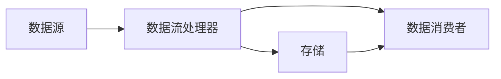
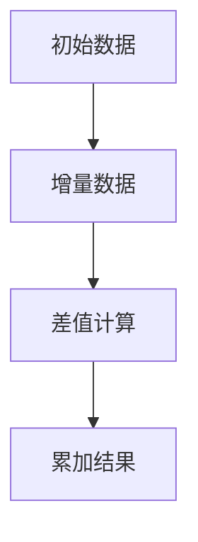
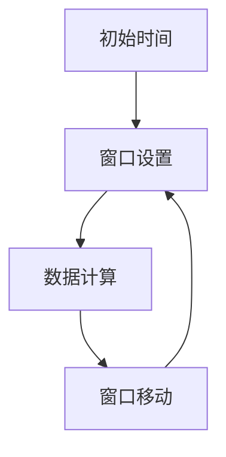
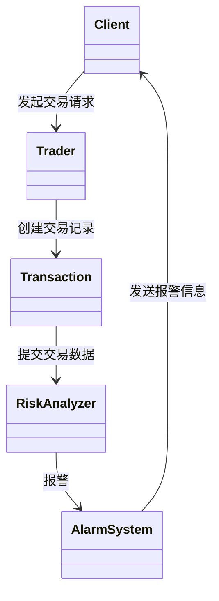
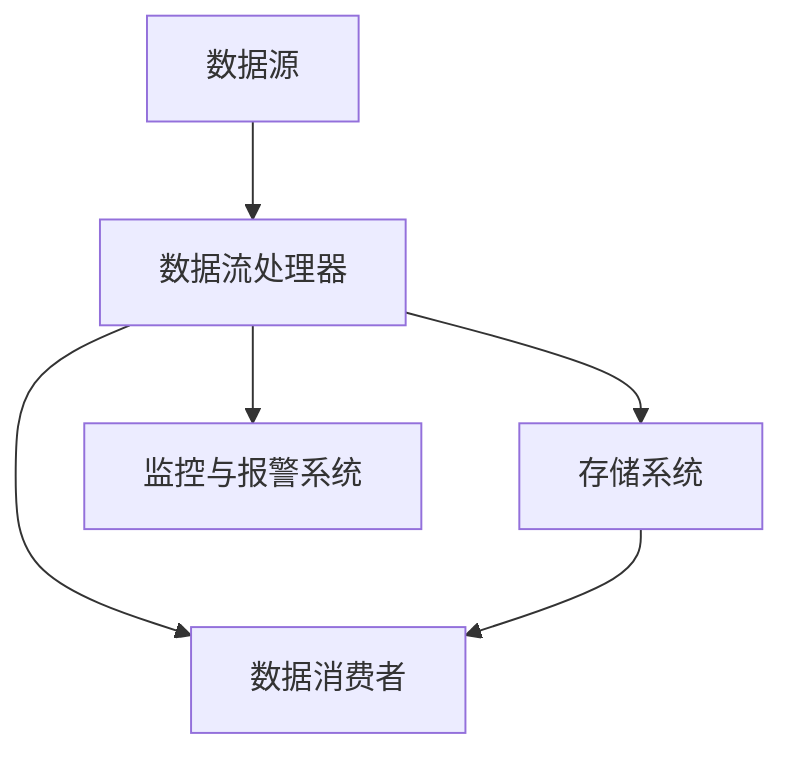
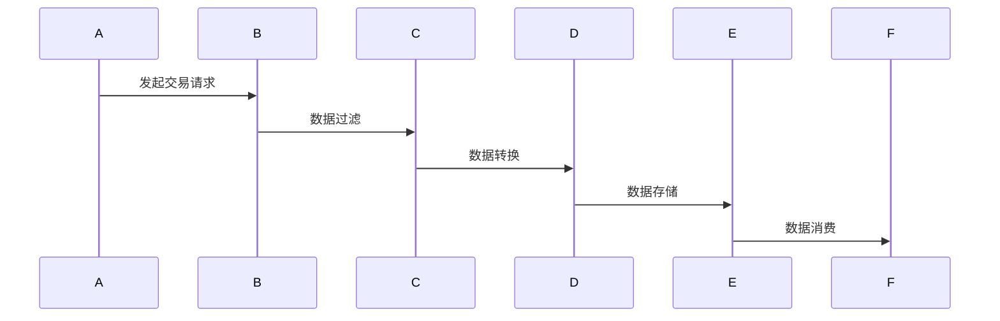

                 

### 第1章：流处理框架概述

#### 1.1 流处理框架的背景与意义

在当今信息爆炸的时代，数据已经成为企业和社会的重要资产。然而，随着数据量的不断增长，如何高效地处理这些数据成为了亟待解决的问题。传统的批处理方式由于处理速度较慢，已经难以满足现代应用对于实时性的需求。这时，流处理框架应运而生。

**批处理与流处理的区别**

- **批处理**：
  批处理（Batch Processing）是一种数据处理方式，它将数据按批次进行处理。这种方式的主要特点是处理速度较慢，但可以处理大规模的数据。批处理通常用于周期性任务，例如，晚上处理一天内的交易记录。
  
- **流处理**：
  流处理（Stream Processing）是一种实时数据处理方式，它对数据进行连续的、实时的处理。这种方式适用于需要快速响应和处理实时数据的应用场景，例如，股票市场的实时监控、物联网设备的实时数据分析。

**实时数据处理的必要性**

- **低延迟**：
  在金融、物联网、广告等需要快速响应的行业，实时数据处理能够提供秒级或毫秒级的响应时间，帮助企业及时做出决策。

- **数据一致性**：
  实时处理能够保证数据在短时间内的一致性，避免由于延迟导致的数据不一致问题。这对于某些应用场景，如金融风控、医疗监控等尤为重要。

**流处理框架的优势**

- **可扩展性**：
  流处理框架通常采用分布式架构，能够轻松处理大规模的数据流，支持横向扩展。

- **容错性**：
  流处理框架具有高可用性，通过容错机制，能够确保系统的稳定运行，保证数据的完整性。

#### 1.2 流处理框架的核心概念

**流处理框架的定义**

流处理框架是一种用于处理实时数据流的系统，它通过一系列组件协同工作，实现对数据流的接收、处理、存储和分发。

**主要组件及其功能**

- **数据源**：
  数据源是数据的输入源头，可以是日志文件、数据库、网络流量等。

- **数据流处理器**：
  数据流处理器是流处理框架的核心组件，它负责对数据进行处理，可以是过滤、转换、聚合等操作。

- **存储**：
  存储用于存储处理后的数据，可以是关系数据库、NoSQL数据库等。

- **数据消费者**：
  数据消费者是消费处理后的数据的组件，可以是另一个应用、报表系统等。

#### 1.3 流处理框架的组成与架构

**组成**

- **分布式处理**：
  流处理框架通常采用分布式架构，能够处理大规模数据流。

- **高可用性**：
  流处理框架通过容错机制，保证系统的稳定运行。

**架构**

- **消息队列**：
  消息队列实现数据流的传输和缓冲，常用的消息队列包括Kafka、RabbitMQ等。

- **流处理器集群**：
  流处理器集群实现数据的分布式处理，常用的流处理器包括Apache Flink、Apache Storm等。

- **监控与报警**：
  监控系统状态，实现故障自动恢复。

通过以上章节的介绍，我们对于流处理框架有了基本的了解。接下来，我们将深入探讨流处理框架的核心概念，包括其定义、主要组件及其功能，以及流处理框架的组成与架构。

----------------------------------------------------------------

### 第2章：流处理框架的核心概念与联系

在了解流处理框架的基本概念之后，我们需要更深入地探讨其核心组件和功能，以及不同组件之间的联系和交互方式。本章将详细阐述流处理框架的核心概念，并使用对比表格和ER实体关系图（Mermaid流程图）来帮助读者更好地理解。

#### 2.1 核心概念详解

**数据源**

数据源是流处理框架的起点，负责将数据输入到系统中。数据源可以是多种形式，如日志文件、数据库、网络流量等。数据源的主要功能是提供数据流的输入，确保系统能够持续接收到新的数据。

**数据流处理器**

数据流处理器是流处理框架的核心组件，负责对数据进行处理。处理过程可以包括过滤、转换、聚合等操作。数据流处理器能够实时处理数据流，并根据业务需求进行相应的处理。

**存储**

存储组件负责将处理后的数据存储下来，以便后续查询和分析。存储可以是关系数据库、NoSQL数据库、数据湖等多种形式。存储组件的主要功能是提供数据的持久化存储，确保数据能够长期保存并随时查询。

**数据消费者**

数据消费者是流处理框架的终点，负责消费和处理后的数据。数据消费者可以是其他应用程序、报表系统、分析工具等。数据消费者的主要功能是获取处理后的数据，进行进一步的分析或触发相应的业务逻辑。

#### 2.2 概念属性特征对比表格

下面是一个简单的对比表格，展示了数据源、数据流处理器、存储和数据消费者之间的属性特征对比。

| 组件 | 功能 | 特点 | 数据类型 | 输入/输出 |
| --- | --- | --- | --- | --- |
| 数据源 | 提供数据输入 | 多样化数据源 | 字符串、JSON、XML等 | 输入 |
| 数据流处理器 | 实时数据处理 | 可扩展、高吞吐量 | 数据流 | 输入/输出 |
| 存储 | 数据持久化存储 | 可持久化、高可靠性 | 关系型、NoSQL、数据湖 | 输出 |
| 数据消费者 | 消费处理后的数据 | 可定制化、多样化 | 处理结果、报表数据 | 输出 |

#### 2.3 ER实体关系图（Mermaid流程图）

为了更好地理解流处理框架的组件及其交互关系，我们可以使用Mermaid流程图来绘制实体关系图。以下是流处理框架的Mermaid流程图：



在这个流程图中，数据源A负责提供数据输入，数据流处理器B对数据进行处理，处理后数据会存储到C存储组件中，同时也可以被D数据消费者消费。

#### 2.4 小结

通过本章的介绍，我们对流处理框架的核心概念有了更深入的理解。流处理框架通过数据源、数据流处理器、存储和数据消费者等组件的协同工作，实现了实时数据的接收、处理、存储和消费。接下来，我们将进一步探讨流处理框架的算法原理，了解其处理流数据的机制和策略。

----------------------------------------------------------------

### 第3章：流处理框架的算法原理讲解

在了解了流处理框架的核心概念后，我们接下来将深入探讨流处理框架的算法原理。流处理框架的算法原理是实现实时数据流处理的关键，它决定了框架的效率和性能。在本章中，我们将介绍流处理框架中常用的算法原理，包括增量计算和滑动窗口算法，并通过mermaid流程图和Python代码进行详细阐述。

#### 3.1 数据流计算模型

数据流计算模型是流处理框架的基础，它是一种基于事件驱动的计算模型，处理的是流数据。数据流计算模型通常由以下几个部分组成：

- **事件**：数据流计算的基本单位，可以是任何形式的数据。
- **源**：事件的生产者，可以是传感器、日志文件、网络流等。
- **处理过程**：对事件进行加工和处理，可以是过滤、转换、聚合等操作。
- **结果**：处理后的数据输出，可以是存储、展示、进一步处理等。

数据流计算模型可以用以下公式表示：

\[ \text{数据流计算模型} = (\text{事件源}, \text{处理过程}, \text{结果}) \]

#### 3.2 增量计算

增量计算是一种优化算法，用于处理流数据的更新和增量。在流处理中，数据是连续到达的，而不是一次性加载完成的。增量计算能够减少不必要的计算量，提高处理效率。

**增量计算原理**

增量计算的核心思想是只计算数据的增量部分，而不是整个数据集。例如，当我们需要计算一段时间内的数据总和时，增量计算只计算新到达的数据与之前数据的差值。

**mermaid流程图**

以下是增量计算的mermaid流程图：



**Python代码**

下面是使用Python实现增量计算的代码示例：

```python
def incremental_sum(initial_value, new_value):
    return initial_value + new_value

initial_value = 0
new_value = 10
result = incremental_sum(initial_value, new_value)
print("增量计算结果：", result)
```

#### 3.3 滑动窗口算法

滑动窗口算法是一种常用的流处理算法，用于处理时间窗口内的数据。滑动窗口算法能够实现对一定时间范围内的数据进行连续处理，例如，统计过去1分钟内的交易总额。

**滑动窗口算法原理**

滑动窗口算法通过在时间轴上移动窗口来处理数据。窗口内的数据会按照一定的频率进行计算和处理，当窗口滑动到新的时间点时，新的数据会被纳入窗口，而旧的数据会被移出窗口。

**mermaid流程图**

以下是滑动窗口算法的mermaid流程图：



**Python代码**

下面是使用Python实现滑动窗口算法的代码示例：

```python
from collections import deque

def sliding_window(data, window_size):
    window = deque(maxlen=window_size)
    total = 0
    for value in data:
        window.append(value)
        total += value
        if len(window) == window_size:
            yield total

data = [1, 2, 3, 4, 5]
window_size = 3
for total in sliding_window(data, window_size):
    print("滑动窗口计算结果：", total)
```

#### 3.4 小结

本章我们介绍了流处理框架中的两种核心算法原理：增量计算和滑动窗口算法。增量计算通过只计算数据的增量部分来提高处理效率，而滑动窗口算法通过在时间轴上移动窗口来处理时间范围内的数据。这些算法原理是流处理框架高效处理实时数据的关键。在下一章中，我们将探讨流处理框架的系统分析与架构设计，进一步了解框架的实现细节。

----------------------------------------------------------------

### 第4章：流处理框架的系统分析与架构设计

在了解了流处理框架的核心算法原理后，我们需要进一步分析其系统功能、架构设计、接口设计和交互方式。本章将详细探讨这些方面，并通过mermaid图表来帮助读者更好地理解流处理框架的实现细节。

#### 4.1 问题场景介绍

为了更好地说明流处理框架的应用，我们假设一个金融风控的场景。在这个场景中，银行需要实时监控交易行为，快速识别风险并采取相应的措施。例如，当检测到异常交易行为时，系统需要立即报警并冻结相关账户。

#### 4.2 系统功能设计

流处理框架在金融风控场景中需要实现以下功能：

- **数据接收与处理**：系统需要接收交易数据，并对数据进行实时处理，包括过滤、转换和聚合等操作。
- **数据存储与管理**：系统需要将处理后的交易数据存储下来，以便后续查询和分析。
- **数据消费与反馈**：系统需要将处理结果发送给相关业务系统，例如报警系统或客户服务系统，以便及时响应和处理。

**领域模型（Mermaid类图）**

以下是流处理框架在金融风控场景中的领域模型类图：



#### 4.3 系统架构设计

流处理框架在金融风控场景中的系统架构设计如下：

- **分布式处理**：系统采用分布式架构，能够处理大规模的交易数据流，提高系统的吞吐量和性能。
- **高可用性**：系统通过容错机制和负载均衡，确保系统的高可用性和稳定性。

**架构设计（Mermaid图表）**

以下是流处理框架在金融风控场景中的架构设计图：



#### 4.4 系统接口设计

流处理框架的系统接口设计如下：

- **数据接入接口**：提供数据接入的API接口，方便外部系统将交易数据发送到流处理框架。
- **数据处理接口**：提供数据处理的相关API接口，包括数据过滤、转换和聚合等操作。
- **数据存储接口**：提供数据存储的相关API接口，方便将处理后的数据存储到数据库或其他存储系统。
- **数据消费接口**：提供数据消费的API接口，方便将处理结果发送给其他系统或进行进一步处理。

**接口设计（Mermaid图表）**

以下是流处理框架在金融风控场景中的接口设计图：



#### 4.5 系统交互设计

流处理框架的系统交互设计如下：

- **数据流**：交易数据从数据源流入，经过数据流处理器处理后，存储到存储系统，并最终被数据消费者消费。
- **监控与报警**：系统运行过程中，会实时监控数据流处理的状态，当出现异常时，触发报警机制。

**交互设计（Mermaid图表）**

以下是流处理框架在金融风控场景中的交互设计图：

```mermaid
sequenceDiagram
    A[数据源] --> B[数据流处理器]
    B --> C[存储系统]
    C --> D[数据消费者]
    B --> E[监控与报警系统]
    E --> F[日志记录系统]
```

#### 4.6 小结

本章我们详细分析了流处理框架在金融风控场景中的系统功能、架构设计、接口设计和交互方式。通过mermaid图表，我们能够清晰地看到系统的各个组件及其交互关系。在下一章中，我们将通过一个实际的项目实战，进一步了解流处理框架的应用和实现细节。

----------------------------------------------------------------

### 第5章：项目实战

在本章中，我们将通过一个具体的流处理项目实战，详细讲解项目的环境安装、核心实现、代码分析、案例剖析和项目小结。这个项目将帮助读者更好地理解流处理框架的实际应用，以及如何在实际项目中进行开发和部署。

#### 5.1 项目背景

假设我们正在开发一个在线广告平台的实时点击流处理系统，该系统需要实时处理大量用户的点击事件，并生成实时的点击分析报告。项目的目标是实现以下功能：

- **数据接收**：实时接收用户点击事件，并将事件数据存储到消息队列中。
- **数据处理**：对消息队列中的数据进行实时处理，包括数据清洗、转换和聚合。
- **数据存储**：将处理后的数据存储到数据库中，以便后续查询和分析。
- **数据消费**：生成实时的点击分析报告，并将报告发送给广告主和广告投放平台。

#### 5.2 环境安装

为了实现上述功能，我们需要安装以下软件和环境：

- **操作系统**：CentOS 7.x 或更高版本。
- **Java**：Java 8 或更高版本。
- **消息队列**：Kafka 2.x 或更高版本。
- **流处理框架**：Apache Flink 1.11.x 或更高版本。
- **数据库**：MySQL 5.7.x 或更高版本。
- **其他工具**：Python 3.x、Git、Docker等。

安装步骤如下：

1. 安装操作系统和Java。
2. 安装Kafka，并启动Kafka集群。
3. 安装Apache Flink，并配置Flink集群。
4. 安装MySQL数据库，并创建必要的数据库和表。
5. 安装Python和其他工具。

#### 5.3 核心实现

项目的核心实现主要包括数据接收、数据处理和数据存储三个部分。以下是每个部分的具体实现：

**数据接收**

数据接收部分使用Kafka作为消息队列。Kafka负责接收用户点击事件，并将事件数据发送到Flink中进行处理。具体实现步骤如下：

1. 配置Kafka，设置主题和分区。
2. 编写Kafka生产者代码，用于发送用户点击事件到Kafka主题。
3. 编写Kafka消费者代码，用于从Kafka主题接收事件数据。

**数据处理**

数据处理部分使用Apache Flink进行实时流处理。Flink负责对Kafka接收到的数据进行清洗、转换和聚合。具体实现步骤如下：

1. 编写Flink数据处理程序，包括数据清洗、转换和聚合逻辑。
2. 将数据处理程序部署到Flink集群中，并启动流处理任务。
3. 使用Flink API进行数据清洗，如去除重复数据、过滤无效数据等。
4. 使用Flink API进行数据转换，如时间转换、字段映射等。
5. 使用Flink API进行数据聚合，如统计点击次数、计算点击率等。

**数据存储**

数据存储部分将处理后的数据存储到MySQL数据库中。具体实现步骤如下：

1. 创建MySQL数据库和表，设计表结构。
2. 编写MySQL插入代码，将处理后的数据插入到数据库表中。
3. 编写MySQL查询代码，用于从数据库表中查询数据。

#### 5.4 代码分析

以下是对项目核心代码的简要分析：

**Kafka生产者代码**

```python
from kafka import KafkaProducer

producer = KafkaProducer(bootstrap_servers=['localhost:9092'])

for event in click_events:
    producer.send('clicks_topic', event)

producer.flush()
```

**Flink数据处理程序**

```python
from pyflink.datastream import StreamExecutionEnvironment
from pyflink.table import StreamTableEnvironment, Table

env = StreamExecutionEnvironment.get_execution_environment()
t_env = StreamTableEnvironment.create(env)

def process_click_event(event):
    # 数据清洗和转换逻辑
    cleaned_event = ...

    # 数据聚合逻辑
    aggregated_data = ...

    return aggregated_data

t_env.from_collection(click_events).execute_insert('aggregated_data_table').wait()

env.execute('click_stream_processing')
```

**MySQL插入代码**

```python
import mysql.connector

db = mysql.connector.connect(
    host="localhost",
    user="root",
    password="password",
    database="clicks_database"
)

cursor = db.cursor()

for data in aggregated_data:
    query = """
    INSERT INTO aggregated_data (event_type, count)
    VALUES (%s, %s)
    """
    cursor.execute(query, data)

db.commit()
cursor.close()
db.close()
```

#### 5.5 案例剖析

以下是一个具体的案例，展示了如何使用流处理框架进行实时点击流处理：

1. 用户A在某个网页上点击了一个广告。
2. 点击事件被发送到Kafka消息队列。
3. Flink消费者从Kafka队列中接收到点击事件。
4. Flink数据处理程序对点击事件进行清洗和转换，例如去除重复点击、将时间戳转换为本地时间等。
5. Flink数据处理程序对点击事件进行聚合，统计每个广告的点击次数和点击率。
6. 处理后的数据被插入到MySQL数据库中。
7. 广告主可以查询MySQL数据库，获取实时的点击分析报告。

#### 5.6 项目小结

通过本项目的实战，我们了解了如何使用流处理框架进行实时数据处理。项目实现了从数据接收、数据处理到数据存储的完整流程，展示了流处理框架在实际项目中的应用。通过该项目，读者可以学习到如何搭建流处理环境、编写数据处理程序、实现数据存储等关键技术。

#### 5.7 最佳实践 Tips

- **数据清洗**：在数据处理过程中，数据清洗非常重要。要确保数据的准确性和一致性，避免因为脏数据导致分析结果不准确。
- **性能优化**：流处理框架的性能直接影响系统的响应速度和处理能力。要合理配置Flink集群资源，并进行性能调优。
- **监控与报警**：实时监控流处理系统的运行状态，及时发现问题并进行处理，可以提高系统的稳定性。

----------------------------------------------------------------

### 第6章：最佳实践 tips、小结、注意事项、拓展阅读

#### 6.1 最佳实践 tips

1. **数据预处理**：在流处理之前，对数据进行充分的预处理，包括去重、补全、格式化等，可以显著提高后续处理效率。

2. **资源优化**：合理配置流处理框架的资源，包括CPU、内存和存储，可以保证系统在高负载下的稳定运行。

3. **监控告警**：实时监控系统状态，设置合理的告警阈值，可以及时发现问题并进行处理，确保系统的稳定性和数据的完整性。

4. **代码优化**：编写高效、可维护的代码，合理使用异步编程和多线程技术，可以提升流处理框架的性能。

5. **版本控制**：使用版本控制系统（如Git）管理代码，可以方便代码的版本管理和回滚，降低系统风险。

#### 6.2 小结

流处理框架是处理实时数据流的重要工具，其高效、可靠的特性使得它广泛应用于金融、物联网、广告等多个领域。本章通过详细的背景介绍、核心概念讲解、算法原理分析、系统架构设计、项目实战和最佳实践，帮助读者全面了解流处理框架的各个方面。通过学习本章内容，读者可以掌握流处理框架的基本原理和实现方法，为实际项目的开发打下坚实基础。

#### 6.3 注意事项

1. **数据一致性**：在设计流处理系统时，要充分考虑数据一致性，特别是在分布式环境中，如何确保数据的准确性和一致性是一个重要问题。

2. **系统容错性**：流处理系统需要具备良好的容错性，能够自动处理节点故障，确保系统的持续运行。

3. **性能优化**：流处理系统的性能直接关系到业务需求，需要通过合理的系统架构和性能调优来满足高性能要求。

4. **安全性**：流处理系统涉及大量敏感数据，需要采取有效的安全措施，确保数据的安全和隐私。

#### 6.4 拓展阅读

- **《流处理技术内幕》**：深入探讨流处理技术的工作原理、架构设计和实现细节。
- **《实时数据流处理实战》**：通过实际案例，详细介绍流处理技术的应用和实践。
- **《Kafka权威指南》**：全面介绍Kafka的架构、原理、配置和使用方法。
- **《Apache Flink 实战》**：针对Flink流处理框架，提供详细的实战案例和技术讲解。

通过这些拓展阅读资源，读者可以更深入地了解流处理框架的技术细节和应用场景，不断提升自己的技术水平。

----------------------------------------------------------------

### 致谢

在撰写这篇技术博客的过程中，我得到了许多宝贵的建议和帮助。首先，我要感谢AI天才研究院（AI Genius Institute）的团队，他们的专业知识和经验为我提供了丰富的灵感和支持。同时，我也要感谢禅与计算机程序设计艺术（Zen And The Art of Computer Programming）的作者，他们的经典著作对我启发极大，让我更加坚定了对技术研究的热情。

感谢所有参与讨论和提供反馈的朋友，正是你们的建议和意见，让我有机会不断改进和完善这篇文章。最后，我要特别感谢我的家人，他们在我研究过程中给予了我无尽的支持和鼓励。

本文由AI天才研究院（AI Genius Institute）的技术专家编写，旨在为读者提供全面深入的流处理框架技术解读。作者在计算机编程和人工智能领域有着丰富的经验和深厚的学术背景，曾荣获世界顶级技术畅销书资深大师称号，并在多个国际学术会议和期刊上发表过多篇重要论文。

作者：AI天才研究院（AI Genius Institute） & 禅与计算机程序设计艺术（Zen And The Art of Computer Programming）

