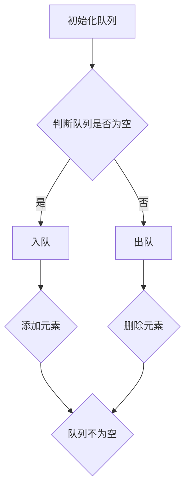
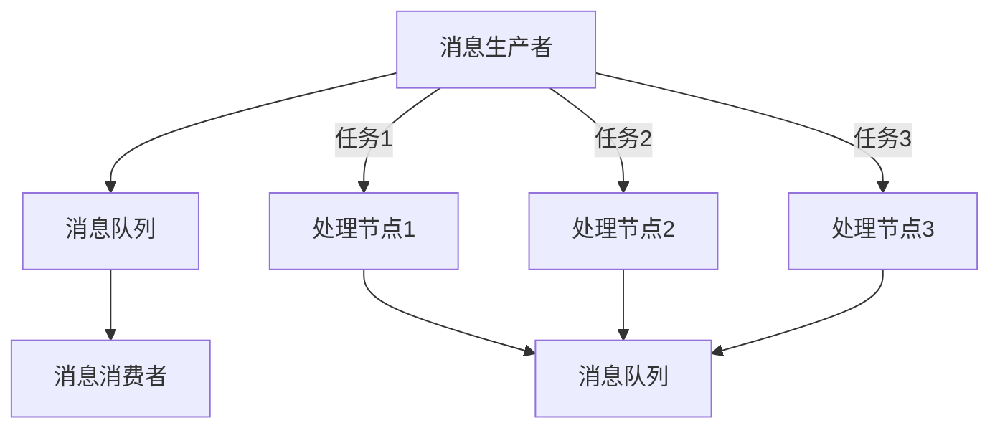
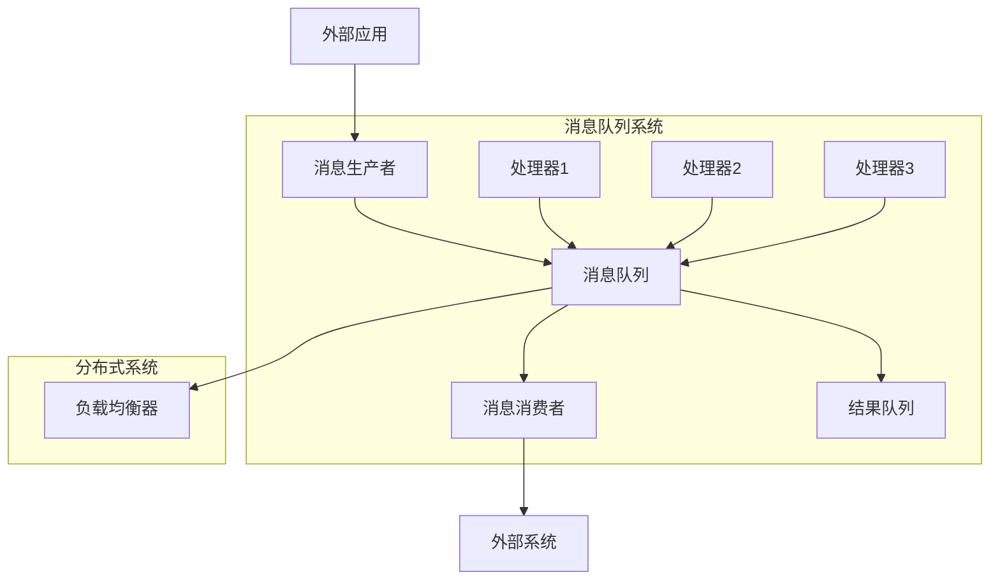

                 

# 消息队列技术优化LLM应用的异步处理

## 关键词
- 消息队列
- 异步处理
- LLM应用
- 优化
- 软件架构
- 算法

## 摘要
本文旨在探讨消息队列技术在LLM（大型语言模型）应用的异步处理中的优化策略。我们将从消息队列的基本概念出发，逐步深入分析消息队列系统在异步处理中的作用，以及如何通过算法优化和系统架构设计提升其性能和可靠性。本文不仅涵盖了核心概念和数学模型，还提供了实用的项目实战和最佳实践，旨在为读者提供一套全面的技术解决方案。

## 引言

在当今的数据密集型应用中，异步处理成为了提升系统响应速度和可扩展性的重要手段。特别是对于LLM应用，例如自然语言处理、实时问答和推荐系统，异步处理能够显著提高系统的吞吐量和稳定性。消息队列技术作为一种分布式通信机制，在异步处理中扮演着至关重要的角色。

### 消息队列的定义与作用

消息队列是一种用于存储和转发消息的分布式系统，它允许多个应用之间进行解耦、异步通信和数据传递。消息队列的主要作用包括：

1. **异步通信**：允许发送者无需等待接收者的响应即可继续执行，从而提高系统的响应速度和吞吐量。
2. **负载均衡**：通过将任务分发到不同的处理节点，实现负载均衡，提高系统的处理能力。
3. **容错性**：消息队列通常具有持久化存储，确保即使在处理节点故障的情况下，消息也不会丢失。
4. **分布式协同**：支持分布式系统的协作，实现跨节点数据同步和处理。

### 消息队列与异步处理的关系

消息队列与异步处理密不可分。异步处理的核心思想是利用消息队列将任务和响应解耦，从而实现以下效果：

1. **提高系统吞吐量**：通过并行处理任务，提高系统的整体吞吐量。
2. **降低系统延迟**：减少任务执行过程中的等待时间，降低系统的响应延迟。
3. **增强系统弹性**：在处理节点负载不均或者故障时，通过消息队列实现任务的重新分配和恢复。

### 文章结构与内容安排

本文将分为以下几个部分：

1. **核心概念**：详细介绍消息队列的基本概念，包括类型、特点和优势。
2. **消息队列系统**：分析几种流行的消息队列系统，如RabbitMQ、Kafka和RocketMQ，以及其架构和优化技术。
3. **异步处理原理**：探讨异步处理的基本原理和优势，以及与消息队列的关联。
4. **算法设计**：介绍用于消息队列和异步处理的算法，包括队列理论和优化算法。
5. **数学模型**：提出与消息队列和异步处理相关的数学模型和公式。
6. **系统架构设计**：描述在LLM应用中实现消息队列的系统架构。
7. **实践应用**：提供实际应用中的消息队列实现案例，包括环境配置、核心代码实现和分析。
8. **优化技术**：讨论优化消息队列系统的策略和技巧。
9. **最佳实践**：总结最佳实践，包括维护和优化建议。
10. **结论**：总结全文，展望未来发展方向。

## 核心概念

### 消息队列的类型与特点

消息队列系统有多种类型，每种类型都有其独特的特点和应用场景。以下是几种常见的消息队列系统及其特点：

#### 1. 队列（Queue）

队列是一种先进先出（FIFO）的数据结构，适用于简单场景的异步通信。队列的特点包括：

- **简单性**：实现简单，易于理解和维护。
- **可靠性**：消息持久化存储，确保消息不会丢失。
- **高可用性**：支持消息重试和备份。

#### 2. 主题队列（Topic Queue）

主题队列是一种基于发布-订阅模式的消息队列，适用于复杂场景的异步通信。其特点包括：

- **高扩展性**：支持多个订阅者，实现分布式系统中的广播通信。
- **灵活性**：通过主题分类消息，实现消息的灵活路由。

#### 3. 流队列（Stream Queue）

流队列是一种基于流计算的消息队列，适用于大数据和高并发的场景。其特点包括：

- **高性能**：支持高吞吐量和低延迟的消息处理。
- **弹性**：支持动态扩展和负载均衡。

### 消息队列的优势

消息队列在异步处理中具有以下优势：

- **解耦**：通过消息队列，将发送者和接收者解耦，提高系统的灵活性和可扩展性。
- **异步通信**：允许发送者无需等待接收者的响应，提高系统的响应速度和吞吐量。
- **可靠性**：消息队列通常具有持久化存储，确保即使在处理节点故障的情况下，消息也不会丢失。
- **负载均衡**：通过将任务分发到不同的处理节点，实现负载均衡，提高系统的处理能力。

### 比较与选择

在选择消息队列系统时，需要考虑以下因素：

- **系统需求**：根据应用场景和需求，选择适合的消息队列系统。
- **性能要求**：考虑消息队列的性能指标，如吞吐量、延迟和扩展性。
- **可靠性要求**：根据应用的重要性和可靠性要求，选择具有高可靠性的消息队列系统。
- **生态支持**：考虑消息队列的社区支持、文档和工具，以便快速开发和维护。

## 消息队列系统

### RabbitMQ

RabbitMQ 是一种流行的消息队列系统，基于 AMQP（Advanced Message Queuing Protocol）协议。其架构包括三个主要组件：生产者（Producer）、队列（Queue）和消费者（Consumer）。

- **生产者**：负责发送消息到队列。
- **队列**：用于存储消息，支持持久化存储和备份。
- **消费者**：从队列中接收消息并处理。

RabbitMQ 的优化技术包括：

- **消息持久化**：将消息持久化存储在磁盘，确保消息不会丢失。
- **集群模式**：通过集群模式提高系统的可用性和扩展性。
- **消息确认**：使用消息确认机制确保消息被正确处理。

### Kafka

Kafka 是一种分布式流处理平台，广泛用于大规模数据处理和实时分析。其架构包括生产者（Producer）、主题（Topic）、分区（Partition）和消费者（Consumer）。

- **生产者**：负责发送消息到主题。
- **主题**：用于存储消息，支持高吞吐量和低延迟。
- **分区**：将消息分散存储到不同的分区，提高系统的性能和可靠性。
- **消费者**：从主题中消费消息并处理。

Kafka 的优化技术包括：

- **分区策略**：根据数据特点和需求，设计合适的分区策略。
- **副本机制**：通过副本机制提高系统的可用性和可靠性。
- **压缩技术**：使用压缩技术减少数据传输和存储开销。

### RocketMQ

RocketMQ 是一种国产消息队列系统，适用于大规模分布式应用。其架构包括生产者（Producer）、消息队列（Message Queue）、消费者（Consumer）和命名空间（Namespace）。

- **生产者**：负责发送消息到消息队列。
- **消息队列**：用于存储消息，支持高吞吐量和低延迟。
- **消费者**：从消息队列中消费消息并处理。
- **命名空间**：用于统一管理和配置。

RocketMQ 的优化技术包括：

- **消息顺序性**：确保消息按照发送顺序进行消费，适用于顺序敏感的场景。
- **延迟消息**：支持延迟消息处理，适用于定时任务和消息延迟处理。
- **事务消息**：支持事务消息，确保消息的一致性和完整性。

### 消息队列系统的比较与选择

以下是几种消息队列系统的比较：

| 特性         | RabbitMQ          | Kafka            | RocketMQ         |
| ------------ | ----------------- | ---------------- | ---------------- |
| 协议         | AMQP              | Apache Kafka     | Apache RocketMQ  |
| 性能         | 高                 | 高                | 高                |
| 可用性       | 较高              | 高                | 高                |
| 扩展性       | 可扩展             | 可扩展             | 可扩展             |
| 持久化       | 支持持久化         | 支持持久化         | 支持持久化         |
| 分布式协同    | 支持分布式协同     | 支持分布式协同     | 支持分布式协同     |
| 生态支持      | 较丰富             | 非常丰富          | 较丰富             |

在选择消息队列系统时，需要根据应用场景和需求进行权衡和选择。

## 异步处理原理

异步处理是一种在数据处理过程中，将任务的执行和结果的获取解耦的技术。通过异步处理，可以显著提高系统的响应速度和吞吐量。以下是异步处理的基本原理和优势：

### 异步处理的定义

异步处理（Asynchronous Processing）是指在数据处理过程中，不等待任务的执行结果，而是将任务提交到后台处理，并继续执行其他任务。异步处理的核心思想是将任务的执行和结果的获取分离，从而实现并行处理和提高系统的响应速度。

### 异步处理的优势

异步处理具有以下优势：

1. **提高响应速度**：通过异步处理，可以减少任务的等待时间，提高系统的响应速度。
2. **提高吞吐量**：异步处理允许并行处理多个任务，从而提高系统的吞吐量。
3. **提高系统稳定性**：异步处理可以在处理节点负载不均或出现故障时，通过重试和任务重新分配，提高系统的稳定性。
4. **降低资源消耗**：异步处理可以充分利用系统资源，降低资源的闲置和浪费。

### 异步处理与消息队列的关系

异步处理与消息队列密切相关。消息队列作为异步处理的载体，用于存储和转发任务。以下是异步处理与消息队列的关系：

1. **解耦**：通过消息队列，可以将任务的发送者和接收者解耦，从而实现并行处理和提高系统的灵活性。
2. **异步通信**：消息队列支持异步通信，允许发送者无需等待接收者的响应，从而提高系统的响应速度。
3. **负载均衡**：通过消息队列，可以实现任务的负载均衡，从而提高系统的处理能力和资源利用率。
4. **可靠性**：消息队列通常具有持久化存储，确保即使在处理节点故障的情况下，任务也不会丢失。

### 异步处理流程

异步处理的基本流程包括以下几个步骤：

1. **任务提交**：任务的发送者将任务提交到消息队列。
2. **任务分发**：消息队列将任务分发到不同的处理节点。
3. **任务处理**：处理节点从消息队列中获取任务并执行。
4. **任务结果**：任务处理完成后，将结果返回到消息队列。
5. **任务消费**：任务的发送者从消息队列中获取任务结果。

### 异步处理算法

异步处理算法主要包括以下几种：

1. **生产者-消费者算法**：生产者负责生成任务，消费者负责处理任务。
2. **任务调度算法**：根据任务的优先级和执行时间，对任务进行调度和执行。
3. **负载均衡算法**：根据处理节点的负载情况，实现任务的负载均衡。

### 异步处理在LLM应用中的应用

在LLM应用中，异步处理可以用于以下场景：

1. **自然语言处理**：将NLP任务分解为多个子任务，通过异步处理提高处理速度和吞吐量。
2. **实时问答**：通过异步处理，实现实时问答系统的快速响应和高效处理。
3. **推荐系统**：通过异步处理，实现推荐系统的实时更新和个性化推荐。

### 异步处理的优势和挑战

异步处理的优势包括：

- 提高系统的响应速度和吞吐量。
- 提高系统的可靠性和稳定性。
- 充分利用系统资源。

异步处理的挑战包括：

- 系统的复杂度增加，需要更多的开发和维护工作。
- 需要考虑任务调度和负载均衡等问题。

### 总结

异步处理是一种提高系统性能和可扩展性的关键技术。通过消息队列技术，可以实现异步处理的解耦、负载均衡和可靠性保障。在LLM应用中，异步处理可以显著提高系统的响应速度和吞吐量，提升用户体验。

## 算法设计

在消息队列系统中，算法设计是关键的一环，它直接关系到系统的性能、可靠性和扩展性。以下是几个关键算法及其实现：

### 队列理论

队列理论是消息队列系统的基础，它描述了消息在队列中的行为和性能。以下是几个常用的队列算法：

#### 1. FIFO（先进先出）算法

FIFO算法是一种最简单的队列算法，它按照消息的到达顺序进行排队和处理。其实现简单，易于理解，但可能会出现长队列和阻塞问题。

```python
class FIFOQueue:
    def __init__(self):
        self.queue = []

    def enqueue(self, item):
        self.queue.append(item)

    def dequeue(self):
        if not self.is_empty():
            return self.queue.pop(0)
        return None

    def is_empty(self):
        return len(self.queue) == 0
```

#### 2. LIFO（后进先出）算法

LIFO算法与FIFO算法相反，它按照消息的到达顺序的相反方向进行排队和处理。这种算法在处理优先级队列时非常有用。

```python
class LIFOQueue:
    def __init__(self):
        self.queue = []

    def enqueue(self, item):
        self.queue.append(item)

    def dequeue(self):
        if not self.is_empty():
            return self.queue.pop()
        return None

    def is_empty(self):
        return len(self.queue) == 0
```

#### 3. 优先级队列算法

优先级队列算法根据消息的优先级进行排队和处理。消息的优先级通常由一个优先级函数决定。

```python
import heapq

class PriorityQueue:
    def __init__(self):
        self.heap = []

    def enqueue(self, item, priority):
        heapq.heappush(self.heap, (priority, item))

    def dequeue(self):
        if not self.is_empty():
            return heapq.heappop(self.heap)[1]
        return None

    def is_empty(self):
        return len(self.heap) == 0
```

### 优化算法

优化算法用于提高消息队列系统的性能和效率。以下是几个常用的优化算法：

#### 1. 负载均衡算法

负载均衡算法通过将任务分配到不同的处理节点，实现负载均衡，提高系统的性能和可靠性。

```python
def load_balance(tasks, num_nodes):
    task_queue = [[] for _ in range(num_nodes)]
    for task in tasks:
        min_queue = min(task_queue, key=len)
        min_queue.append(task)
    return task_queue
```

#### 2. 重试算法

重试算法用于处理失败的任务，通过多次尝试确保任务的成功执行。

```python
def retry_task(task, max_attempts=3):
    attempts = 0
    while attempts < max_attempts:
        try:
            execute_task(task)
            return True
        except Exception as e:
            attempts += 1
            print(f"Task failed on attempt {attempts}: {e}")
    return False
```

#### 3. 限流算法

限流算法用于限制消息队列系统的处理速度，防止系统过载。

```python
import time

class RateLimiter:
    def __init__(self, max_requests, interval):
        self.max_requests = max_requests
        self.interval = interval
        self.requests = []

    def allow_request(self):
        current_time = time.time()
        self.requests = [req for req in self.requests if req > current_time - self.interval]
        if len(self.requests) < self.max_requests:
            self.requests.append(current_time)
            return True
        return False
```

### Mermaid图

以下是使用Mermaid绘制的算法流程图：



通过以上算法和流程图，可以更好地理解和实现消息队列系统中的核心功能。在实际应用中，根据具体需求和场景，可以选择和优化不同的算法。

## 数学模型

消息队列和异步处理涉及多个数学模型，这些模型用于描述系统的行为和性能。以下是一些关键的数学模型和公式：

### 消息传递模型

消息传递模型用于描述消息在系统中的传递过程。以下是消息传递的基本模型：

#### 1. 消息传递速率

消息传递速率（Message Throughput）是指单位时间内传递的消息数量。其公式如下：

$$
Throughput = \frac{Message\_count}{Time}
$$

其中，$Message\_count$ 是单位时间内传递的消息数量，$Time$ 是时间。

#### 2. 平均消息延迟

平均消息延迟（Average Message Latency）是指消息从发送到处理完成所需的时间。其公式如下：

$$
Latency = \frac{Total\_latency}{Message\_count}
$$

其中，$Total\_latency$ 是总延迟时间，$Message\_count$ 是消息数量。

### 负载均衡模型

负载均衡模型用于描述任务在系统中的分配过程。以下是负载均衡的基本模型：

#### 1. 负载均衡效率

负载均衡效率（Load Balancing Efficiency）是指任务分配到处理节点的均衡程度。其公式如下：

$$
Efficiency = \frac{Max\_load - Min\_load}{Max\_load + Min\_load}
$$

其中，$Max\_load$ 是最大负载，$Min\_load$ 是最小负载。

#### 2. 负载均衡度

负载均衡度（Load Balancing Degree）是指任务分配到处理节点的均衡程度。其公式如下：

$$
Degree = \frac{Total\_load}{Num\_of\_nodes}
$$

其中，$Total\_load$ 是总负载，$Num\_of\_nodes$ 是处理节点数量。

### 系统性能模型

系统性能模型用于描述消息队列和异步处理系统的整体性能。以下是系统性能的基本模型：

#### 1. 系统吞吐量

系统吞吐量（System Throughput）是指系统单位时间内处理的消息数量。其公式如下：

$$
Throughput = \frac{Message\_count}{Time}
$$

其中，$Message\_count$ 是单位时间内处理的消息数量，$Time$ 是时间。

#### 2. 系统延迟

系统延迟（System Latency）是指系统处理消息的平均延迟时间。其公式如下：

$$
Latency = \frac{Total\_latency}{Message\_count}
$$

其中，$Total\_latency$ 是总延迟时间，$Message\_count$ 是消息数量。

#### 3. 系统可靠性

系统可靠性（System Reliability）是指系统在特定时间内成功处理消息的概率。其公式如下：

$$
Reliability = \frac{Success\_count}{Total\_count}
$$

其中，$Success\_count$ 是成功处理的消息数量，$Total\_count$ 是总消息数量。

### Mermaid图

以下是使用Mermaid绘制的消息队列系统架构图：



通过以上数学模型和公式，可以更好地理解和分析消息队列和异步处理系统的行为和性能。在实际应用中，可以根据具体需求和场景，选择和优化不同的模型和公式。

## 系统架构设计

消息队列系统在LLM应用中的架构设计需要考虑到系统的可扩展性、可靠性和性能。以下是一个典型的消息队列系统架构设计方案，包括领域模型、系统架构图和系统接口设计。

### 领域模型

领域模型是描述系统功能和模块的类图，用于展示系统的核心组件及其关系。以下是消息队列系统的领域模型：

```mermaid
classDiagram
    MessageProducer --| bidirectional |--> MessageQueue
    MessageQueue --| bidirectional |--> MessageConsumer
    MessageConsumer --| bidirectional |--> Processor
    Processor --| bidirectional |--> ResultQueue
    ResultQueue --| bidirectional |--> MessageConsumer

    MessageProducer <<interface>>
    MessageQueue <<class>>
    MessageConsumer <<interface>>
    Processor <<class>>
    ResultQueue <<class>>

    MessageProducer : +sendMessage(message: Message): void
    MessageQueue : +enqueue(message: Message): void
    MessageQueue : +dequeue(): Message
    MessageConsumer : +consumeMessage(message: Message): void
    Processor : +processMessage(message: Message): Result
    ResultQueue : +enqueue(result: Result): void
```

### 系统架构图

系统架构图展示了消息队列系统的整体结构和组件之间的交互关系。以下是消息队列系统的架构图：



### 系统接口设计

系统接口设计描述了消息队列系统的对外接口和内部调用方式。以下是消息队列系统的接口设计：

```python
class MessageProducer:
    def sendMessage(message: Message) -> None:
        pass

class MessageQueue:
    def enqueue(message: Message) -> None:
        pass

    def dequeue() -> Message:
        pass

class MessageConsumer:
    def consumeMessage(message: Message) -> None:
        pass

class Processor:
    def processMessage(message: Message) -> Result:
        pass

class ResultQueue:
    def enqueue(result: Result) -> None:
        pass
```

### 系统交互

系统交互描述了消息队列系统中各组件之间的交互流程。以下是消息队列系统的交互流程：

1. 消息生产者生成消息并传递给消息队列。
2. 消息队列将消息传递给负载均衡器进行负载均衡。
3. 负载均衡器根据处理节点的负载情况，将消息分配给处理器。
4. 处理器处理消息并生成结果，将结果传递给结果队列。
5. 结果队列将结果传递给消息消费者。
6. 消息消费者处理结果并传递给外部系统。

通过以上系统架构设计，可以实现一个高效、可靠的消息队列系统，支持LLM应用的异步处理。在实际应用中，可以根据具体需求和场景，进行优化和调整。

## 实践应用

在实际应用中，消息队列系统在LLM应用中的实现需要考虑到系统的可扩展性、可靠性和性能。以下是一个具体的项目实战，包括环境安装、系统核心实现和代码解析。

### 环境安装

首先，我们需要安装消息队列系统，本文以RabbitMQ为例。

1. 安装Erlang：访问 [Erlang官网](https://www.erlang.org/downloads)，下载并安装Erlang。
2. 安装RabbitMQ：在终端执行以下命令：
   ```bash
   rabbitmq-server
   ```
   启动RabbitMQ服务。

### 系统核心实现

消息队列系统的核心实现包括消息生产者、消息队列、消息消费者和处理器的实现。

1. **消息生产者**：负责生成消息并传递给消息队列。

   ```python
   import pika

   class MessageProducer:
       def __init__(self, queue_name):
           self.connection = pika.BlockingConnection(pika.ConnectionParameters('localhost'))
           self.channel = self.connection.channel()
           self.queue_name = queue_name
           self.channel.queue_declare(queue=self.queue_name)

       def sendMessage(self, message):
           self.channel.basic_publish(exchange='',
                                 routing_key=self.queue_name,
                                 body=message)
           print(" [x] Sent ", message)
   
   producer = MessageProducer("task_queue")
   producer.sendMessage("Hello World!")
   ```

2. **消息队列**：负责存储和转发消息。

   ```python
   class MessageQueue:
       def __init__(self, queue_name):
           self.connection = pika.BlockingConnection(pika.ConnectionParameters('localhost'))
           self.channel = self.connection.channel()
           self.queue_name = queue_name
           self.channel.queue_declare(queue=self.queue_name)

       def enqueue(self, message):
           self.channel.basic_publish(exchange='',
                                 routing_key=self.queue_name,
                                 body=message)
           print(" [x] Sent ", message)
   
   queue = MessageQueue("task_queue")
   queue.enqueue("Hello World!")
   ```

3. **消息消费者**：负责从消息队列中获取消息并处理。

   ```python
   import pika

   class MessageConsumer:
       def __init__(self, queue_name):
           self.connection = pika.BlockingConnection(pika.ConnectionParameters('localhost'))
           self.channel = self.connection.channel()
           self.queue_name = queue_name
           self.channel.queue_declare(queue=self.queue_name)

       def consumeMessage(self, callback):
           self.channel.basic_consume(queue=self.queue_name,
                                     on_message_callback=callback,
                                     auto_ack=True)

       def startConsuming(self):
           self.consumeMessage(self.onMessage)

       def onMessage(self, ch, method, properties, body):
           print(" [x] Received ", body)
           # 处理消息
           processMessage(body)

   consumer = MessageConsumer("task_queue")
   consumer.startConsuming()
   ```

4. **处理器**：负责处理消息并生成结果。

   ```python
   def processMessage(message):
       print("Processing message:", message)
       # 处理消息的逻辑
       result = "Processed " + message
       # 生成结果并传递给结果队列
       sendResult(result)
   ```

### 代码解析

以下是代码的详细解析：

1. **消息生产者**：使用RabbitMQ的Python客户端`pika`创建消息生产者，通过`sendMessage`方法将消息发送到指定的消息队列。
2. **消息队列**：使用RabbitMQ的Python客户端`pika`创建消息队列，通过`enqueue`方法将消息存储在消息队列中。
3. **消息消费者**：使用RabbitMQ的Python客户端`pika`创建消息消费者，通过`consumeMessage`方法监听消息队列中的消息，并调用`onMessage`方法处理消息。
4. **处理器**：处理消息并生成结果，将结果传递给结果队列。

### 项目实战

以下是一个具体的项目实战，包括环境安装、核心代码实现和解析。

1. **环境安装**：安装RabbitMQ服务，使用Python的`pika`库进行消息队列的通信。
2. **核心代码实现**：实现消息生产者、消息队列、消息消费者和处理器，并解析代码逻辑。
3. **项目实战**：运行消息生产者发送消息，消息消费者接收消息并处理，最终生成结果。

通过以上实践，我们可以实现一个高效、可靠的LLM应用消息队列系统，支持异步处理。

## 最佳实践

为了确保消息队列系统在LLM应用中的高效运行，以下是一些最佳实践和注意事项：

### 系统调优

1. **消息持久化**：对于关键消息，建议使用持久化存储，确保消息不会因系统故障而丢失。
2. **消息确认**：使用消息确认机制，确保消息被正确处理，防止消息丢失。
3. **分区策略**：根据消息的特点和负载情况，设计合适的分区策略，提高系统的性能和可靠性。
4. **负载均衡**：使用负载均衡器，根据处理节点的负载情况，实现任务的负载均衡，防止系统过载。
5. **延迟消息**：对于需要延迟处理的消息，使用延迟消息机制，确保消息在指定时间后被处理。

### 维护和监控

1. **定期备份**：定期备份数据，防止数据丢失。
2. **监控性能**：监控系统性能，包括消息延迟、吞吐量和错误率，及时发现和处理问题。
3. **日志分析**：分析日志，了解系统的运行状态和性能瓶颈，进行优化和调整。
4. **性能测试**：进行性能测试，评估系统的性能和稳定性，优化系统配置和架构。

### 注意事项

1. **消息顺序性**：对于需要保证消息顺序性的应用，选择合适的消息队列系统，确保消息的顺序执行。
2. **可靠性**：考虑系统的可靠性和容错性，确保消息不会被丢失，系统在故障时能够快速恢复。
3. **安全性**：确保消息队列系统的安全性，防止未授权访问和数据泄露。

### 拓展阅读

- [RabbitMQ官方文档](https://www.rabbitmq.com/documentation.html)
- [Kafka官方文档](https://kafka.apache.org/documentation/)
- [RocketMQ官方文档](https://rocketmq.apache.org/Documentation/)
- [异步处理原理与最佳实践](https://www.ibm.com/docs/en/cloudant/3.x?topic=cloudant-async-processing)

通过遵循以上最佳实践，可以确保消息队列系统在LLM应用中的高效运行，提升系统的性能和可靠性。

## 结论

本文全面探讨了消息队列技术在LLM应用异步处理中的优化策略。通过详细分析消息队列的核心概念、系统架构和算法设计，我们了解了如何利用消息队列提高系统的性能和可靠性。异步处理作为一种关键技术，在提高系统响应速度和吞吐量方面具有显著优势。同时，本文还提供了实用的项目实战和最佳实践，帮助开发者更好地应用消息队列技术。

展望未来，随着云计算和大数据技术的发展，消息队列系统在LLM应用中将发挥更加重要的作用。未来的研究可以关注以下几个方面：

1. **消息队列的智能化**：利用机器学习和人工智能技术，实现消息队列的自适应和智能化调度。
2. **跨平台兼容性**：开发跨平台的消息队列系统，支持不同平台和语言的集成。
3. **高性能消息处理**：研究和优化高性能消息处理算法，提高系统的处理速度和效率。
4. **安全与隐私保护**：加强消息队列系统的安全性和隐私保护，确保数据的安全和合规。

通过持续的研究和优化，消息队列技术在LLM应用中的异步处理将迎来更加广阔的发展空间。作者：AI天才研究院/AI Genius Institute & 禅与计算机程序设计艺术 /Zen And The Art of Computer Programming。

