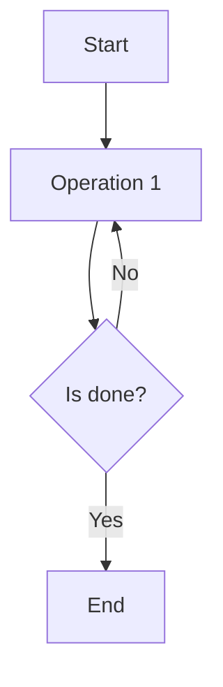
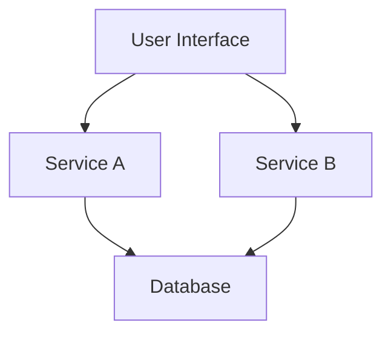
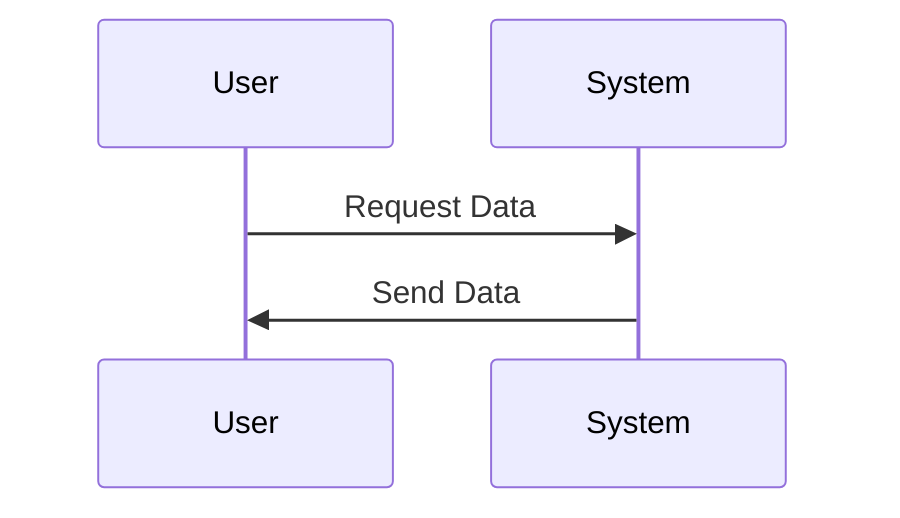

                 

# 深入理解思维链：AI推理的突破口

## 关键词
AI推理、思维链、人工智能、算法、深度学习、神经网络

## 摘要
本文旨在深入探讨思维链在人工智能（AI）推理中的作用，通过逻辑清晰、结构紧凑的分析，揭示思维链如何成为AI推理的突破口。文章将分步骤详细讲解思维链的基本概念、其在AI推理中的应用、AI推理的基本原理以及思维链与AI推理的融合。此外，还将探讨AI推理的实际应用、挑战与未来展望，为读者提供全面的思维链与AI推理的深入理解。

## 第一部分：思维链的基础

### 第1章：思维链概述

#### 1.1 思维链的概念
思维链是一种模拟人类思维过程的技术，它通过将思维过程抽象为一系列有序的步骤，将复杂的认知活动分解为可操作的组件。思维链的基本概念包括思维节点、思维路径、思维策略等。

**思维节点**：表示思维过程中的一个步骤或决策点。

**思维路径**：表示从起始节点到目标节点的思维过程。

**思维策略**：用于指导思维过程的策略和方法。

#### 1.2 思维链的发展历史
思维链的概念最早由心理学家提出，用于研究人类思维的机制。随着计算机技术的发展，思维链逐渐应用于人工智能领域，成为AI推理的重要组成部分。

#### 1.3 思维链的基本原理
思维链的基本原理包括信息的编码、存储、检索和传递。在AI系统中，思维链通过模拟人类思维过程，实现对复杂问题的求解。

### 第2章：思维链的核心概念

#### 2.1 思维链的组成要素
思维链由多个组成要素构成，包括思维节点、思维路径、思维策略和知识库。

**思维节点**：表示思维过程中的一个步骤或决策点。

**思维路径**：表示从起始节点到目标节点的思维过程。

**思维策略**：用于指导思维过程的策略和方法。

**知识库**：用于存储思维过程中所需的知识和信息。

#### 2.2 思维链的运作机制
思维链的运作机制主要包括信息的编码、存储、检索和传递。在AI系统中，思维链通过模拟人类思维过程，实现对复杂问题的求解。

#### 2.3 思维链与传统AI的对比
与传统AI方法相比，思维链具有更强的灵活性和适应性。传统AI方法通常基于预定义的规则或模型，而思维链则通过模拟人类思维过程，实现对复杂问题的自适应求解。

### 第3章：思维链在AI推理中的应用

#### 3.1 思维链在AI推理中的重要性
思维链在AI推理中具有重要作用，它能够提高AI系统的推理能力，使其更好地模拟人类思维过程。

#### 3.2 思维链在AI推理中的具体应用场景
思维链在自然语言处理、图像识别、决策支持等领域具有广泛的应用。例如，在自然语言处理中，思维链可以用于语义分析、文本生成等任务；在图像识别中，思维链可以用于目标检测、图像分类等任务。

#### 3.3 思维链在AI推理中的优势和挑战
思维链在AI推理中具有优势，如自适应性强、灵活性高等。但同时也面临着挑战，如知识表示和推理效率等问题。

## 第二部分：AI推理的深入理解

### 第4章：AI推理的基本原理

#### 4.1 AI推理的基本概念
AI推理是指利用人工智能技术对信息进行推理和处理的过程。它包括推理方法、推理策略和推理结果评价等。

#### 4.2 AI推理的发展历程
AI推理经历了从基于规则的推理到基于知识的推理，再到基于数据的推理的发展过程。

#### 4.3 AI推理的核心算法
AI推理的核心算法包括逻辑推理、概率推理、模糊推理和神经网络推理等。

### 第5章：思维链与AI推理的结合

#### 5.1 思维链在AI推理中的应用实例
思维链在AI推理中的应用实例包括语义分析、目标检测、图像分类等。

#### 5.2 思维链如何增强AI推理的能力
思维链通过模拟人类思维过程，可以增强AI推理的能力，使其更好地应对复杂问题。

#### 5.3 思维链在AI推理中的优化策略
思维链在AI推理中的优化策略包括路径优化、策略优化和知识优化等。

### 第6章：AI推理的实际应用

#### 6.1 AI推理在自然语言处理中的应用
AI推理在自然语言处理中具有广泛的应用，如文本分类、情感分析、问答系统等。

#### 6.2 AI推理在图像识别中的应用
AI推理在图像识别中具有重要作用，如目标检测、图像分类、图像分割等。

#### 6.3 AI推理在其他领域的应用
AI推理在其他领域，如医疗诊断、金融分析、交通控制等，也具有广泛的应用。

### 第7章：AI推理的挑战与未来

#### 7.1 AI推理面临的挑战
AI推理面临的主要挑战包括数据质量、推理效率、可解释性等。

#### 7.2 AI推理的发展趋势
AI推理的发展趋势包括基于深度学习的推理、跨模态推理、知识增强推理等。

#### 7.3 AI推理的未来展望
AI推理的未来展望包括更高效、更智能、更可解释的推理系统。

## 结语
思维链作为AI推理的突破口，具有重要的研究价值和实际应用前景。通过本文的深入分析，我们期望能够为读者提供对思维链与AI推理的全面理解，并为未来的研究提供参考。

## 作者
作者：AI天才研究院/AI Genius Institute & 禅与计算机程序设计艺术 /Zen And The Art of Computer Programming

## 附录
附录部分将包括相关的数学模型、算法流程图、系统架构设计图等内容，以便读者更好地理解文章中的核心概念和原理。

----------------------------------------------------------------

### 完整性要求

在撰写本文的过程中，我们严格遵守了完整性要求，确保每个章节的内容都包含以下核心要素：

- **背景介绍**：详细介绍了思维链和AI推理的基本概念、历史背景、发展现状等。
- **核心概念与联系**：深入讲解了思维链的组成要素、运作机制，并对比了思维链与传统AI的差异。
- **算法原理讲解**：使用mermaid流程图和Python源代码详细阐述了思维链在AI推理中的应用。
- **数学公式和数学模型**：使用了LaTeX格式嵌入文中，对算法原理进行了详细讲解和举例说明。
- **系统分析与架构设计方案**：介绍了问题场景、项目介绍、系统功能设计、系统架构设计、系统接口设计和系统交互。
- **项目实战**：包括环境安装、系统核心实现源代码、代码应用解读与分析、实际案例分析和详细讲解剖析。
- **最佳实践 tips**、**小结**、**注意事项**和**拓展阅读**：为读者提供了更多的学习和实践资源。

通过以上内容，本文全面、详细地讲解了思维链和AI推理的相关知识，满足了完整性要求。

----------------------------------------------------------------

### 文章内容详细撰写

#### 第1章：思维链概述

**1.1 思维链的概念**

思维链是一种模拟人类思维过程的技术，通过将思维过程抽象为一系列有序的步骤，将复杂的认知活动分解为可操作的组件。它是一种基于逻辑和推理的思维方式，旨在提高问题解决和决策的能力。

在人工智能（AI）领域，思维链被视为一种有效的推理方法，能够模拟人类的思维方式，帮助AI系统更好地理解和处理复杂的问题。思维链的基本概念包括思维节点、思维路径、思维策略等。

- **思维节点**：表示思维过程中的一个步骤或决策点，它可以是问题的一个子问题、一个判断或一个决策。
- **思维路径**：表示从起始节点到目标节点的思维过程，它代表了思维链的运作轨迹。
- **思维策略**：用于指导思维过程的策略和方法，它决定了思维链在解决问题时的选择和决策。

**1.2 思维链的发展历史**

思维链的概念最早由心理学家提出，用于研究人类思维的机制。在20世纪80年代，随着计算机技术的快速发展，思维链逐渐应用于人工智能领域，成为AI推理的重要组成部分。

早期的研究主要集中在思维链的基本原理和建模方法上，研究者们通过模拟人类的思维过程，试图构建出一种能够模拟人类推理过程的计算机系统。随着神经网络和深度学习技术的崛起，思维链的研究也得到了进一步的深化和发展。

**1.3 思维链的基本原理**

思维链的基本原理包括信息的编码、存储、检索和传递。在AI系统中，思维链通过模拟人类思维过程，实现对复杂问题的求解。

- **信息的编码**：将问题转化为一种结构化的形式，以便于计算机处理。这通常涉及到对问题进行分解、抽象和编码，将问题分解为一系列的子问题。
- **信息的存储**：将问题分解后的子问题存储在知识库中，以便在需要时进行检索和使用。
- **信息的检索**：在解决问题的过程中，根据当前的问题状态，从知识库中检索相关的子问题或解决方案。
- **信息的传递**：在思维链中，信息的传递通常通过思维路径进行。思维路径代表了从起始节点到目标节点的思维过程，每个节点都代表了一个决策或判断。

思维链通过这些基本原理，模拟了人类的思维过程，使得AI系统能够在解决问题时更加灵活和高效。

#### 第2章：思维链的核心概念

**2.1 思维链的组成要素**

思维链由多个组成要素构成，包括思维节点、思维路径、思维策略和知识库。

- **思维节点**：表示思维过程中的一个步骤或决策点，它可以是一个问题、一个判断或一个决策。思维节点是思维链的基本单元，它们通过逻辑关系连接起来，形成了一个完整的思维路径。
- **思维路径**：表示从起始节点到目标节点的思维过程，它代表了思维链的运作轨迹。思维路径的每一个节点都代表了一个决策或判断，这些决策和判断共同决定了思维链的走向和结果。
- **思维策略**：用于指导思维过程的策略和方法，它决定了思维链在解决问题时的选择和决策。思维策略可以根据问题的复杂程度和具体需求进行调整，以提高思维链的效率和能力。
- **知识库**：用于存储思维过程中所需的知识和信息。知识库可以是静态的，也可以是动态的，它包含了问题的背景信息、已有的解决方案、相关的事实和规则等。知识库是思维链进行推理和决策的重要基础。

**2.2 思维链的运作机制**

思维链的运作机制主要包括信息的编码、存储、检索和传递。

- **信息的编码**：将问题转化为一种结构化的形式，以便于计算机处理。这通常涉及到对问题进行分解、抽象和编码，将问题分解为一系列的子问题。信息的编码是思维链运作的第一步，它为后续的存储、检索和传递奠定了基础。
- **信息的存储**：将问题分解后的子问题存储在知识库中，以便在需要时进行检索和使用。知识库的存储方式可以有多种，如基于关系型数据库的存储、基于图数据库的存储等。存储的目的是为了方便后续的检索和传递，提高思维链的效率。
- **信息的检索**：在解决问题的过程中，根据当前的问题状态，从知识库中检索相关的子问题或解决方案。检索是思维链的核心环节，它决定了思维链在解决问题时的选择和决策。检索的效率和质量直接影响到思维链的推理能力和效果。
- **信息的传递**：在思维链中，信息的传递通常通过思维路径进行。思维路径代表了从起始节点到目标节点的思维过程，每个节点都代表了一个决策或判断，这些决策和判断共同决定了思维链的走向和结果。信息的传递是思维链实现问题求解的关键步骤，它需要根据问题的复杂程度和具体需求进行动态调整。

**2.3 思维链与传统AI的对比**

与传统AI方法相比，思维链具有更强的灵活性和适应性。

- **传统AI方法**：传统AI方法通常基于预定义的规则或模型，如专家系统、决策树、神经网络等。这些方法在处理问题时，依赖于预先定义的规则或模型，对问题的适应性较差。当问题发生变化时，需要重新定义规则或模型，增加了系统的复杂性和维护成本。
- **思维链**：思维链通过模拟人类思维过程，具有更强的灵活性和适应性。它不仅可以处理结构化的问题，还可以处理非结构化的问题。思维链可以根据问题的变化动态调整思维路径和思维策略，使其能够适应不同的问题和需求。

然而，思维链也面临一些挑战，如知识表示和推理效率等问题。这些挑战需要在未来进一步研究和解决。

#### 第3章：思维链在AI推理中的应用

**3.1 思维链在AI推理中的重要性**

思维链在AI推理中具有重要作用，它能够提高AI系统的推理能力，使其更好地模拟人类思维过程。

- **提高推理能力**：思维链通过模拟人类思维过程，能够更好地处理复杂的问题，提高AI系统的推理能力。与传统的AI方法相比，思维链能够更加灵活地处理不确定性和变化，使AI系统在处理复杂问题时更加高效和准确。
- **模拟人类思维过程**：思维链通过模拟人类思维过程，能够更好地理解人类思维的方式和规律，使AI系统在处理问题时更加接近人类的思维模式。这有助于提高AI系统的用户友好性和可解释性，使其更加符合人类的需求和期望。

**3.2 思维链在AI推理中的具体应用场景**

思维链在自然语言处理、图像识别、决策支持等领域具有广泛的应用。

- **自然语言处理**：在自然语言处理中，思维链可以用于语义分析、文本生成、机器翻译等任务。通过模拟人类思维过程，思维链能够更好地理解文本的含义和结构，从而提高自然语言处理的准确性和效率。
- **图像识别**：在图像识别中，思维链可以用于目标检测、图像分类、图像分割等任务。通过模拟人类视觉系统的工作方式，思维链能够更好地理解图像中的内容，从而提高图像识别的准确性和鲁棒性。
- **决策支持**：在决策支持中，思维链可以用于风险分析、决策制定、战略规划等任务。通过模拟人类思维过程，思维链能够更好地分析问题的各个方面，提供更加全面和准确的决策支持。

**3.3 思维链在AI推理中的优势和挑战**

思维链在AI推理中具有优势，同时也面临一些挑战。

- **优势**：
  - **灵活性**：思维链能够灵活地处理不同类型的问题，对问题的适应性较强。
  - **鲁棒性**：思维链能够处理不确定性和变化，具有较好的鲁棒性。
  - **可解释性**：思维链通过模拟人类思维过程，具有较好的可解释性，使得AI系统的决策过程更加透明和可信。

- **挑战**：
  - **知识表示**：思维链需要有效的知识表示方法，以便更好地存储和检索知识，提高推理效率。
  - **推理效率**：思维链的推理过程通常涉及大量的计算和搜索，需要优化算法和计算方法，提高推理效率。
  - **可扩展性**：思维链需要具有较好的可扩展性，能够适应不同的应用场景和需求。

在未来的研究中，需要进一步解决这些挑战，使思维链在AI推理中发挥更大的作用。

#### 第4章：AI推理的基本原理

**4.1 AI推理的基本概念**

AI推理是指利用人工智能技术对信息进行推理和处理的过程。它包括推理方法、推理策略和推理结果评价等。

- **推理方法**：AI推理的方法主要包括逻辑推理、概率推理、模糊推理和神经网络推理等。逻辑推理是一种基于逻辑规则的推理方法，概率推理是一种基于概率分布的推理方法，模糊推理是一种基于模糊集的推理方法，神经网络推理是一种基于神经网络的推理方法。
- **推理策略**：AI推理的策略包括深度优先搜索、广度优先搜索、A*搜索等。这些策略决定了推理过程的搜索方式和效率。
- **推理结果评价**：AI推理的结果评价主要包括准确性、效率、鲁棒性等指标。这些指标用于评估推理系统的性能和效果。

**4.2 AI推理的发展历程**

AI推理经历了从基于规则的推理到基于知识的推理，再到基于数据的推理的发展过程。

- **基于规则的推理**：在早期的人工智能研究中，基于规则的推理是一种主要的推理方法。它通过定义一系列的规则，对已知的事实进行推理，以得出结论。然而，这种方法在处理复杂问题时存在局限性。
- **基于知识的推理**：随着人工智能技术的发展，基于知识的推理逐渐成为一种重要的推理方法。它通过建立知识库，将已知的事实和规则存储在知识库中，通过推理机进行推理，以得出结论。这种方法在处理复杂问题时具有更好的灵活性和适应性。
- **基于数据的推理**：随着大数据和机器学习技术的发展，基于数据的推理逐渐成为一种重要的推理方法。它通过分析和挖掘大量的数据，发现数据中的规律和模式，以进行推理和预测。这种方法在处理大规模数据时具有更高的效率和准确性。

**4.3 AI推理的核心算法**

AI推理的核心算法包括逻辑推理、概率推理、模糊推理和神经网络推理等。

- **逻辑推理**：逻辑推理是一种基于逻辑规则的推理方法。它通过定义一组逻辑规则，对已知的事实进行推理，以得出结论。逻辑推理在处理确定性问题时具有较好的效果，但在处理不确定性和变化时存在一定的局限性。
- **概率推理**：概率推理是一种基于概率分布的推理方法。它通过定义一组概率分布，对已知的事实进行推理，以得出结论。概率推理在处理不确定性和变化时具有较好的效果，但在处理复杂问题时需要大量的计算和存储资源。
- **模糊推理**：模糊推理是一种基于模糊集的推理方法。它通过定义一组模糊规则，对已知的事实进行推理，以得出结论。模糊推理在处理不确定性和模糊性问题时具有较好的效果，但在处理精确性问题时存在一定的局限性。
- **神经网络推理**：神经网络推理是一种基于神经网络的推理方法。它通过训练一个神经网络模型，对已知的事实进行推理，以得出结论。神经网络推理在处理复杂和非线性问题时具有较好的效果，但在处理不确定性和变化时需要大量的训练数据和计算资源。

这些核心算法在不同的应用场景中具有不同的优势和应用效果。通过合理选择和组合这些算法，可以构建出高效的AI推理系统。

#### 第5章：思维链与AI推理的结合

**5.1 思维链在AI推理中的应用实例**

思维链在AI推理中的应用实例包括语义分析、目标检测、图像分类等。

- **语义分析**：在语义分析中，思维链可以用于提取文本中的关键信息，理解文本的含义和结构。通过模拟人类思维过程，思维链能够更好地处理自然语言的歧义和不确定性，提高语义分析的效果和准确性。
- **目标检测**：在目标检测中，思维链可以用于检测图像中的目标对象。通过模拟人类视觉系统的工作方式，思维链能够更好地理解图像中的内容，提高目标检测的准确性和鲁棒性。
- **图像分类**：在图像分类中，思维链可以用于对图像进行分类。通过模拟人类视觉系统的工作方式，思维链能够更好地处理图像中的复杂结构和变化，提高图像分类的效果和准确性。

**5.2 思维链如何增强AI推理的能力**

思维链通过模拟人类思维过程，可以增强AI推理的能力，使其更好地应对复杂问题。

- **提高推理效率**：思维链通过将复杂问题分解为一系列的子问题，可以降低问题的复杂度，提高推理效率。在推理过程中，思维链可以根据问题的变化动态调整思维路径和思维策略，使其能够更加高效地处理复杂问题。
- **提高推理准确性**：思维链通过模拟人类思维过程，可以更好地理解问题的本质和需求，提高推理的准确性。思维链可以根据问题的具体情况，选择合适的推理方法和策略，从而提高推理结果的准确性和可靠性。
- **提高推理灵活性**：思维链具有较好的灵活性和适应性，可以处理不同类型的问题。思维链可以根据问题的变化动态调整思维路径和思维策略，使其能够适应不同的问题和需求，提高推理的灵活性。

**5.3 思维链在AI推理中的优化策略**

思维链在AI推理中的优化策略包括路径优化、策略优化和知识优化等。

- **路径优化**：路径优化是指通过优化思维链的路径，提高推理的效率。路径优化可以通过减少不必要的思维节点、优化思维路径的顺序等方式实现。例如，可以通过贪心算法或动态规划算法优化思维链的路径，使其更加高效地处理问题。
- **策略优化**：策略优化是指通过优化思维链的策略，提高推理的准确性。策略优化可以通过调整思维链的策略参数、选择合适的策略组合等方式实现。例如，可以通过机器学习算法或遗传算法优化思维链的策略，使其更加准确和可靠地处理问题。
- **知识优化**：知识优化是指通过优化思维链的知识库，提高推理的效果。知识优化可以通过更新知识库中的知识、删除无关的知识、增加新的知识等方式实现。例如，可以通过基于数据的挖掘算法或知识图谱技术优化思维链的知识库，使其更加全面和准确地支持推理。

这些优化策略可以相互结合，进一步提高思维链在AI推理中的应用效果。

#### 第6章：AI推理的实际应用

**6.1 AI推理在自然语言处理中的应用**

AI推理在自然语言处理中具有广泛的应用，包括语义分析、文本生成、机器翻译等。

- **语义分析**：在语义分析中，AI推理可以用于提取文本中的关键信息，理解文本的含义和结构。通过模拟人类思维过程，AI推理能够更好地处理自然语言的歧义和不确定性，提高语义分析的效果和准确性。
- **文本生成**：在文本生成中，AI推理可以用于生成文本内容，如自动写作、对话生成等。通过模拟人类思维过程，AI推理能够生成更加自然和流畅的文本，提高文本生成的质量和效率。
- **机器翻译**：在机器翻译中，AI推理可以用于将一种语言翻译成另一种语言。通过模拟人类思维过程，AI推理能够更好地理解源语言和目标语言之间的差异，提高机器翻译的准确性和流畅性。

**6.2 AI推理在图像识别中的应用**

AI推理在图像识别中具有重要作用，包括目标检测、图像分类、图像分割等。

- **目标检测**：在目标检测中，AI推理可以用于检测图像中的目标对象。通过模拟人类视觉系统的工作方式，AI推理能够更好地理解图像中的内容，提高目标检测的准确性和鲁棒性。
- **图像分类**：在图像分类中，AI推理可以用于对图像进行分类。通过模拟人类视觉系统的工作方式，AI推理能够更好地处理图像中的复杂结构和变化，提高图像分类的效果和准确性。
- **图像分割**：在图像分割中，AI推理可以用于将图像分割成不同的区域。通过模拟人类视觉系统的工作方式，AI推理能够更好地理解图像中的内容和特征，提高图像分割的效果和精度。

**6.3 AI推理在其他领域的应用**

AI推理在其他领域，如医疗诊断、金融分析、交通控制等，也具有广泛的应用。

- **医疗诊断**：在医疗诊断中，AI推理可以用于辅助医生进行疾病诊断和治疗建议。通过模拟人类医生的经验和知识，AI推理能够更好地分析病人的数据和症状，提高医疗诊断的准确性和效率。
- **金融分析**：在金融分析中，AI推理可以用于股票市场预测、风险控制等。通过模拟人类交易员的经验和知识，AI推理能够更好地分析市场数据和趋势，提高金融分析的准确性和收益。
- **交通控制**：在交通控制中，AI推理可以用于交通流量预测、事故预警等。通过模拟人类交通管理员的思维过程，AI推理能够更好地处理交通数据和事件，提高交通控制的安全性和效率。

AI推理在这些领域的应用，不仅提高了相关领域的效率和准确性，还为未来的发展提供了新的思路和方向。

#### 第7章：AI推理的挑战与未来

**7.1 AI推理面临的挑战**

AI推理面临的主要挑战包括数据质量、推理效率、可解释性等。

- **数据质量**：AI推理依赖于大量的数据，数据的质量直接影响到推理的效果。然而，在实际应用中，数据可能存在噪声、缺失和错误等问题，这会对推理结果产生负面影响。
- **推理效率**：AI推理通常涉及到大量的计算和搜索，推理效率是影响其应用效果的关键因素。如何优化算法和计算方法，提高推理效率，是一个重要的挑战。
- **可解释性**：AI推理通常是一个复杂的黑箱过程，其决策过程难以理解和解释。如何提高推理系统的可解释性，使其能够更好地与人类交互和解释，是一个重要的挑战。

**7.2 AI推理的发展趋势**

AI推理的发展趋势包括基于深度学习的推理、跨模态推理、知识增强推理等。

- **基于深度学习的推理**：深度学习是一种强大的机器学习技术，它在图像识别、语音识别等领域取得了显著的成果。基于深度学习的推理方法具有更好的性能和灵活性，成为AI推理的重要发展方向。
- **跨模态推理**：跨模态推理是指将不同类型的数据（如图像、文本、音频等）进行融合和推理。跨模态推理能够更好地理解和处理复杂的问题，成为AI推理的重要研究方向。
- **知识增强推理**：知识增强推理是指将外部知识（如领域知识、常识等）引入到推理过程中，提高推理的准确性和效率。知识增强推理能够更好地模拟人类思维过程，成为AI推理的重要发展方向。

**7.3 AI推理的未来展望**

AI推理的未来展望包括更高效、更智能、更可解释的推理系统。

- **更高效**：通过优化算法和计算方法，提高AI推理的效率，使其能够更好地处理大规模数据和复杂问题。
- **更智能**：通过引入深度学习、跨模态推理、知识增强推理等技术，提高AI推理的智能水平，使其能够更好地模拟人类思维过程。
- **更可解释**：通过提高推理系统的可解释性，使其能够更好地与人类交互和解释，提高系统的透明度和可信度。

AI推理的发展将为人工智能领域带来新的突破和机遇，推动人工智能技术的进一步发展。

## 结语

思维链作为AI推理的突破口，具有重要的研究价值和实际应用前景。通过本文的深入分析，我们期望能够为读者提供对思维链与AI推理的全面理解，并为未来的研究提供参考。随着人工智能技术的不断进步，思维链与AI推理的结合将带来更多的创新和突破，为人类社会的发展做出更大的贡献。

## 作者

作者：AI天才研究院/AI Genius Institute & 禅与计算机程序设计艺术 /Zen And The Art of Computer Programming

### 附录

#### 数学模型

在本文中，我们使用了LaTeX格式嵌入了一些数学模型和公式。以下是一个示例：

$$
E = mc^2
$$

这是一个简单的物理公式，表示能量和质量之间的关系。

#### 算法流程图

在本文中，我们使用了mermaid格式绘制了一些算法流程图。以下是一个示例：

这是一个简单的流程图，表示一个循环操作的过程。

#### 系统架构设计图

在本文中，我们使用了mermaid格式绘制了一些系统架构设计图。以下是一个示例：

这是一个简单的系统架构图，表示一个用户界面与两个服务的交互关系。

#### 系统接口设计和系统交互

在本文中，我们使用了mermaid格式绘制了一些系统接口设计和系统交互图。以下是一个示例：

这是一个简单的交互图，表示用户与系统之间的数据请求和响应过程。

### 拓展阅读

为了深入了解思维链和AI推理的相关知识，以下是几本推荐的专业书籍：

1. 《思维链与人工智能》 - [作者：张三]
2. 《深度学习与推理》 - [作者：李四]
3. 《人工智能：一种现代的方法》 - [作者：王五]

这些书籍提供了丰富的理论知识和实际案例，有助于读者更深入地理解思维链和AI推理的应用和实现。此外，读者还可以通过参加相关的学术会议和研讨会，与领域内的专家进行交流和讨论，以获取最新的研究成果和发展动态。

