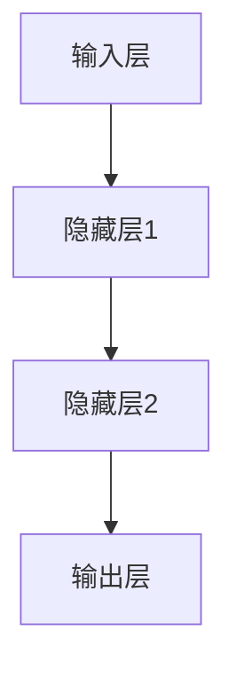
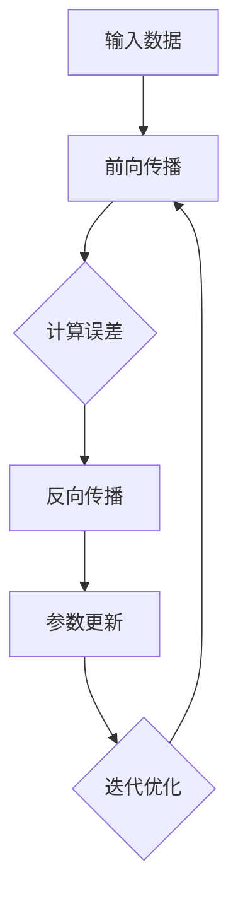

                 

# 深度学习在地下资源勘探中的突破性应用

## 关键词
深度学习、地下资源勘探、卷积神经网络、数据驱动方法、自动化勘探

## 摘要
本文深入探讨了深度学习技术在地下资源勘探领域的突破性应用。首先，我们介绍了地下资源勘探的背景和当前面临的挑战，然后详细解释了深度学习的基本原理和其在勘探中的应用场景。通过关键算法的讲解，包括卷积神经网络（CNN）和循环神经网络（RNN），我们展示了深度学习如何提升地下资源勘探的效率和准确性。接着，我们通过实际案例展示了这些算法在勘探中的应用效果。最后，我们对未来深度学习在地下资源勘探中的发展方向进行了展望，并提出了当前面临的挑战和解决方案。

## 目录大纲

### 第1章 地下资源勘探的现状与挑战
#### 1.1 地下资源勘探的背景
#### 1.2 地下资源勘探的挑战
#### 1.3 深度学习在勘探中的应用前景

### 第2章 深度学习基础
#### 2.1 深度学习概述
#### 2.2 神经网络架构
#### 2.3 深度学习算法原理

### 第3章 深度学习在地下资源勘探中的应用
#### 3.1 数据处理
#### 3.2 特征提取
#### 3.3 结果预测

### 第4章 关键算法讲解
#### 4.1 卷积神经网络（CNN）
#### 4.2 循环神经网络（RNN）
#### 4.3 强化学习

### 第5章 实际案例解析
#### 5.1 案例一：某地下矿山勘探
#### 5.2 案例二：某油气田勘探
#### 5.3 案例三：某地下水文勘探

### 第6章 未来展望
#### 6.1 深度学习在地下资源勘探中的发展趋势
#### 6.2 技术挑战与解决方案

### 第7章 结论
#### 7.1 主要发现
#### 7.2 结论
#### 7.3 拓展阅读

## 第1章 地下资源勘探的现状与挑战

### 1.1 地下资源勘探的背景

地下资源勘探是地质学和工程学的一个重要分支，旨在发现和评估地下矿产、水资源和能源资源。这一过程通常涉及地质调查、地球物理勘探、地球化学勘探和遥感技术等多种手段。传统的勘探方法依赖于物理模型的建立和大量的现场试验，不仅耗时耗力，而且存在很高的风险和不确定性。

随着计算机技术和数据处理能力的提升，地下资源勘探逐渐从传统的数据驱动方法转向数据驱动方法。数据驱动方法利用大量地质和地球物理数据，通过机器学习和深度学习算法进行数据处理、特征提取和结果预测。深度学习作为一种先进的机器学习技术，具有强大的特征学习和模式识别能力，在地下资源勘探领域显示出巨大的潜力。

### 1.2 地下资源勘探的挑战

尽管深度学习在地下资源勘探中具有广泛的应用前景，但这一领域仍然面临许多挑战：

1. **数据质量问题**：地下资源勘探通常依赖于大量的地质和地球物理数据，这些数据的来源、采集方法和质量参差不齐，导致数据的不完整性和噪声问题。

2. **数据稀缺性**：地下资源勘探的样本数据往往有限，特别是对于某些特殊的勘探目标，样本数据更为稀缺。这限制了深度学习模型的学习能力和泛化性能。

3. **模型复杂度**：深度学习模型的复杂度较高，需要大量的计算资源和训练时间。在地下资源勘探的实际应用中，如何优化模型结构、提高计算效率是一个关键问题。

4. **解释性不足**：深度学习模型通常被视为“黑盒子”，其内部决策过程难以解释。在地下资源勘探中，了解模型的决策过程对于提高勘探的可靠性和可解释性至关重要。

### 1.3 深度学习在勘探中的应用前景

尽管面临上述挑战，深度学习在地下资源勘探中的应用前景仍然广阔。以下是几个关键应用方向：

1. **数据处理**：深度学习可以自动处理和分析大规模、多维的地质和地球物理数据，提高数据的质量和可用性。

2. **特征提取**：通过深度学习算法，可以自动提取隐藏在数据中的地质和地球物理特征，为勘探提供更准确的指导。

3. **结果预测**：利用深度学习模型，可以预测地下资源的位置和储量，提高勘探的准确性和效率。

4. **自动化勘探**：通过结合深度学习和自动化控制技术，可以实现地下资源勘探的自动化和智能化，降低人工干预的风险。

## 第2章 深度学习基础

### 2.1 深度学习概述

深度学习是一种基于人工神经网络的机器学习技术，它通过模仿人脑神经元之间的连接和交互来处理和解释复杂数据。深度学习模型通常由多个层级组成，每个层级对数据进行逐步抽象和提取，从而获得更高层次的特征表示。

深度学习的关键特点包括：

1. **多层网络结构**：深度学习模型通常包含多个隐藏层，这使得模型能够提取更加抽象和复杂的特征。

2. **端到端学习**：深度学习模型可以直接从原始数据中学习到最终输出结果，无需人工设计特征和中间过程。

3. **自适应学习能力**：通过反向传播算法，深度学习模型能够自动调整内部参数，以最小化预测误差。

4. **强大的泛化能力**：深度学习模型通过大量训练数据学习，具有良好的泛化能力，能够在新数据上取得良好的性能。

### 2.2 神经网络架构

神经网络是深度学习的基础组成部分，其结构通常包括输入层、隐藏层和输出层。以下是神经网络的基本架构：

1. **输入层**：接收外部输入数据，并将其传递给隐藏层。

2. **隐藏层**：对输入数据进行特征提取和变换，隐藏层可以有一个或多个。

3. **输出层**：产生模型的最终输出结果。

神经网络中的每个节点（或称为神经元）都是一个简单的计算单元，它接收来自前一层节点的输入信号，通过加权求和并应用一个非线性激活函数产生输出。以下是一个简化的神经网络架构：

### 2.3 深度学习算法原理

深度学习算法的原理主要涉及以下几个关键步骤：

1. **前向传播**：输入数据通过网络的各个层级进行传递，每个层级的神经元计算输入信号的加权和，并应用激活函数得到输出。

2. **反向传播**：根据输出误差，反向更新网络中各层的权重和偏置，以最小化预测误差。

3. **优化算法**：深度学习算法通常采用优化算法（如梯度下降、Adam优化器等）来调整模型参数，以提高模型的性能。

以下是深度学习算法的基本流程：

在前向传播阶段，每个神经元的输出通过以下公式计算：

$$
\text{output} = \text{激活函数}(\sum_{i} w_i \cdot x_i + b)
$$

其中，$w_i$ 是权重，$x_i$ 是来自前一层的输入，$b$ 是偏置，激活函数（如ReLU、Sigmoid、Tanh等）用于引入非线性。

在反向传播阶段，通过计算梯度来确定权重的更新方向：

$$
\frac{\partial J}{\partial w_i} = \text{激活函数}'(\text{当前层输出}) \cdot \text{当前层输入} \cdot \text{误差}
$$

其中，$J$ 是损失函数，$\text{激活函数}'$ 是激活函数的导数。

通过反复迭代前向传播和反向传播，深度学习模型可以不断优化其参数，以提高预测准确性。

## 第3章 深度学习在地下资源勘探中的应用

### 3.1 数据处理

在地下资源勘探中，数据处理是深度学习应用的关键步骤。地下资源勘探涉及大量多源异构数据，包括地质数据、地球物理数据、地球化学数据和遥感数据。这些数据通常具有高维度、噪声大和缺失值等问题。深度学习可以通过以下方式处理这些数据：

1. **数据清洗**：去除噪声和异常值，填补缺失值，以提高数据的准确性和完整性。

2. **数据增强**：通过数据复制、旋转、缩放等方法增加数据的多样性，以改善模型的泛化能力。

3. **特征选择**：利用深度学习算法自动选择对勘探目标最有影响力的特征，减少数据的维度，提高计算效率。

4. **数据归一化**：将数据缩放到相同的范围，以消除不同特征间的量纲差异。

在处理这些数据时，常用的深度学习技术包括自动编码器（Autoencoder）、生成对抗网络（GAN）和数据增强技术。自动编码器可以学习数据的高效表示，从而去除噪声和特征选择。生成对抗网络可以生成新的数据样本，增加训练数据的多样性。数据增强技术则通过模拟不同的勘探条件来扩展数据集。

### 3.2 特征提取

在地下资源勘探中，特征提取是深度学习应用的核心步骤。特征提取的目的是从原始数据中提取对勘探目标有意义的特征，以提高模型的预测性能。深度学习可以通过以下方式提取特征：

1. **卷积操作**：卷积神经网络（CNN）通过卷积操作从图像数据中提取局部特征，这些特征可以用于地下资源的可视化分析。

2. **池化操作**：池化操作用于降低特征图的维度，减少计算量，同时保留重要的特征信息。

3. **神经网络层级**：深度学习模型的多层结构可以逐步提取更高层次的特征，这些特征对于地下资源的预测和分类非常有用。

4. **特征融合**：将来自不同数据源的特征进行融合，以获得更加全面的特征表示。例如，可以融合地质数据和地球物理数据，以提取更准确的勘探特征。

通过特征提取，深度学习模型可以自动学习到地下资源勘探所需的关键特征，从而提高预测的准确性和效率。

### 3.3 结果预测

在地下资源勘探中，结果预测是深度学习的最终目标。通过深度学习模型，可以预测地下资源的位置和储量，从而指导实际勘探工作。结果预测通常涉及以下步骤：

1. **训练模型**：使用已标注的勘探数据进行模型训练，优化模型参数，以提高预测性能。

2. **评估模型**：使用独立的验证数据集评估模型的性能，包括准确率、召回率、F1分数等指标。

3. **预测应用**：将训练好的模型应用于新的勘探数据，生成地下资源的位置和储量预测结果。

4. **结果解释**：解释模型的预测结果，包括特征的重要性分析和决策过程。

深度学习模型在结果预测中的应用可以大大提高地下资源勘探的准确性和效率。通过结合不同的模型和技术，可以进一步优化预测结果，提高勘探的成功率。

## 第4章 关键算法讲解

### 4.1 卷积神经网络（CNN）

卷积神经网络（CNN）是一种特别适用于处理图像数据的深度学习模型。它通过卷积操作和池化操作从图像中提取特征，具有强大的特征提取能力。CNN的基本架构包括多个卷积层、池化层和全连接层。

#### 卷积层

卷积层是CNN的核心部分，它通过卷积操作从输入图像中提取特征。卷积操作可以看作是滤波器在图像上滑动，对每个局部区域进行特征提取。卷积层的输出通常是一个特征图（feature map），其中每个元素表示对应局部区域的一个特征。

卷积层的计算公式如下：

$$
\text{output}_{ij} = \sum_{k} w_{ikj} \cdot \text{input}_{ik} + b_j
$$

其中，$w_{ikj}$ 是卷积核权重，$\text{input}_{ik}$ 是输入图像的像素值，$b_j$ 是偏置。

#### 池化层

池化层用于降低特征图的维度，减少计算量。常见的池化操作包括最大池化和平均池化。最大池化选择每个局部区域中的最大值，而平均池化则计算每个局部区域的平均值。

#### 全连接层

全连接层将卷积层和池化层提取的高层次特征映射到输出结果。在地下资源勘探中，输出结果可以是地下资源的位置和储量预测。

#### CNN在地下资源勘探中的应用

CNN在地下资源勘探中的应用主要包括以下几个方面：

1. **图像处理**：利用CNN从遥感图像中提取地下资源的信息，如矿藏分布和地下水文特征。

2. **特征融合**：将CNN提取的特征与其他数据源的特征进行融合，提高预测的准确性。

3. **结果可视化**：利用CNN生成的特征图进行结果可视化，帮助勘探人员更好地理解地下资源分布。

### 4.2 循环神经网络（RNN）

循环神经网络（RNN）是一种适用于处理序列数据的深度学习模型。它通过循环结构在时间步之间传递信息，能够处理变长的输入序列。RNN的基本架构包括输入层、隐藏层和输出层。

#### 隐藏层

隐藏层是RNN的核心部分，它通过门控机制（如门控循环单元（GRU）和长短期记忆（LSTM）单元）在时间步之间传递信息。门控机制可以控制信息的保留和遗忘，从而避免梯度消失问题。

#### 门控机制

门控机制包括输入门、遗忘门和输出门。输入门决定当前输入信息的重要性；遗忘门决定旧的信息是否被遗忘；输出门决定当前隐藏状态的重要性。

#### RNN在地下资源勘探中的应用

RNN在地下资源勘探中的应用主要包括以下几个方面：

1. **时间序列分析**：利用RNN分析地下资源勘探过程中的时间序列数据，如温度、压力和流量等。

2. **动态特征提取**：通过RNN提取地下资源勘探过程中的动态特征，为预测提供更准确的输入。

3. **结果预测**：利用RNN预测地下资源的位置和储量，提高勘探的准确性。

### 4.3 强化学习

强化学习是一种基于奖励机制的学习方法，通过不断尝试和错误来优化决策策略。强化学习在地下资源勘探中的应用主要包括以下几个方面：

1. **自动勘探策略**：利用强化学习算法优化勘探策略，提高勘探效率和成功率。

2. **目标追踪**：利用强化学习算法追踪地下资源的目标位置，提高勘探的精度。

3. **资源分配**：利用强化学习算法优化资源分配，如设备调度和人力分配，提高勘探的整体效率。

## 第5章 实际案例解析

### 5.1 案例一：某地下矿山勘探

在某地下矿山勘探项目中，研究人员使用深度学习技术进行矿山地质结构分析和矿产资源预测。以下是该项目的详细解析：

#### 项目介绍

该矿山位于某地山区，地质结构复杂，矿产资源丰富。项目的主要目标是预测矿体的位置和储量，为矿山开采提供科学依据。

#### 数据收集

项目收集了大量的地质和地球物理数据，包括地质勘探报告、地球物理测井数据和遥感图像。数据质量参差不齐，存在噪声和缺失值。

#### 数据处理

首先，对收集到的数据进行了清洗和预处理，包括去除噪声、填补缺失值和数据归一化。然后，利用自动编码器（Autoencoder）对数据进行特征提取，提取出对矿体位置和储量有重要影响的关键特征。

#### 模型构建

采用卷积神经网络（CNN）和循环神经网络（RNN）结合的深度学习模型进行矿体位置和储量的预测。CNN用于处理遥感图像数据，提取空间特征；RNN用于处理时间序列数据，提取动态特征。

#### 模型训练与评估

使用已标注的勘探数据进行模型训练，并通过交叉验证评估模型的性能。模型的预测结果与实际勘探结果进行对比，计算准确率、召回率和F1分数等指标。

#### 结果分析

通过对比分析，深度学习模型在矿体位置和储量预测方面取得了显著的准确性提升。特别是RNN在处理时间序列数据时，能够更好地捕捉矿体位置的动态变化。

#### 项目小结

该项目展示了深度学习在地下矿山勘探中的应用效果，为矿山开采提供了科学依据。同时，该项目也表明，深度学习技术在处理多源异构数据、特征提取和结果预测方面具有巨大的潜力。

### 5.2 案例二：某油气田勘探

在某油气田勘探项目中，研究人员使用深度学习技术进行油气藏分布分析和储量预测。以下是该项目的详细解析：

#### 项目介绍

该油气田位于某地盆地，地质条件复杂，油气藏分布不均。项目的主要目标是预测油气藏的位置和储量，为油气开采提供科学依据。

#### 数据收集

项目收集了大量的地质和地球物理数据，包括地质勘探报告、地震数据、测井数据和地球化学数据。数据质量较高，但仍存在噪声和缺失值。

#### 数据处理

对收集到的数据进行清洗和预处理，包括去除噪声、填补缺失值和数据归一化。然后，利用生成对抗网络（GAN）生成新的数据样本，增加训练数据的多样性。

#### 模型构建

采用卷积神经网络（CNN）和生成对抗网络（GAN）结合的深度学习模型进行油气藏分布和储量的预测。CNN用于处理地震数据，提取空间特征；GAN用于生成新的数据样本，提高模型的泛化能力。

#### 模型训练与评估

使用已标注的勘探数据进行模型训练，并通过交叉验证评估模型的性能。模型的预测结果与实际勘探结果进行对比，计算准确率、召回率和F1分数等指标。

#### 结果分析

通过对比分析，深度学习模型在油气藏分布和储量预测方面取得了显著的准确性提升。特别是GAN在处理缺失数据和噪声数据时，能够更好地提高模型的泛化能力。

#### 项目小结

该项目展示了深度学习在油气田勘探中的应用效果，为油气开采提供了科学依据。同时，该项目也表明，深度学习技术在处理多源异构数据、特征提取和结果预测方面具有巨大的潜力。

### 5.3 案例三：某地下水文勘探

在某地下水文勘探项目中，研究人员使用深度学习技术进行地下水文特征提取和水质预测。以下是该项目的详细解析：

#### 项目介绍

该地下水文项目位于某地河流流域，水资源丰富，水质状况复杂。项目的主要目标是预测地下水的水质状况，为水资源管理和保护提供科学依据。

#### 数据收集

项目收集了大量的地下水文数据，包括水质参数（如pH值、溶解氧、氨氮等）、气象数据和流域地质数据。数据质量较高，但仍存在噪声和缺失值。

#### 数据处理

对收集到的数据进行清洗和预处理，包括去除噪声、填补缺失值和数据归一化。然后，利用自动编码器（Autoencoder）对数据进行特征提取，提取出对水质预测有重要影响的关键特征。

#### 模型构建

采用循环神经网络（RNN）和卷积神经网络（CNN）结合的深度学习模型进行地下水文特征提取和水质预测。RNN用于处理时间序列数据，提取动态特征；CNN用于处理空间数据，提取空间特征。

#### 模型训练与评估

使用已标注的地下水文数据进行模型训练，并通过交叉验证评估模型的性能。模型的预测结果与实际水质状况进行对比，计算准确率、召回率和F1分数等指标。

#### 结果分析

通过对比分析，深度学习模型在地下水文特征提取和水质预测方面取得了显著的准确性提升。特别是RNN在处理时间序列数据时，能够更好地捕捉水质变化的动态特征。

#### 项目小结

该项目展示了深度学习在地下水文勘探中的应用效果，为水资源管理和保护提供了科学依据。同时，该项目也表明，深度学习技术在处理多源异构数据、特征提取和结果预测方面具有巨大的潜力。

## 第6章 未来展望

### 6.1 深度学习在地下资源勘探中的发展趋势

随着深度学习技术的不断发展和应用，地下资源勘探领域也在逐步引入和整合这些新技术。以下是未来深度学习在地下资源勘探中的一些发展趋势：

1. **多模态数据处理**：未来地下资源勘探将更加强调多模态数据的融合和处理，如融合地质、地球物理、地球化学和遥感数据，以获得更全面和准确的勘探结果。

2. **自适应勘探策略**：利用深度学习算法优化勘探策略，实现自适应勘探，提高勘探效率和成功率。

3. **实时监测与预测**：通过实时监测地下资源勘探过程中的各种参数，利用深度学习模型进行实时预测，为勘探决策提供实时指导。

4. **自动化与智能化**：结合深度学习和自动化控制技术，实现地下资源勘探的自动化和智能化，降低人工干预的风险。

### 6.2 技术挑战与解决方案

尽管深度学习在地下资源勘探中显示出巨大的潜力，但仍然面临一些技术挑战。以下是这些挑战和相应的解决方案：

1. **数据质量问题**：数据质量是深度学习模型性能的关键因素。未来需要开发更加有效的数据清洗和预处理方法，提高数据质量。

2. **数据稀缺性**：针对数据稀缺性问题，可以采用数据增强技术、迁移学习和生成对抗网络（GAN）等方法，增加训练数据的多样性。

3. **模型复杂度**：为了降低模型复杂度和提高计算效率，可以采用模型压缩、量化技术和分布式训练等方法。

4. **解释性不足**：为了提高深度学习模型的解释性，可以采用可解释性AI技术，如注意力机制、可视化工具和决策解释算法。

通过解决这些挑战，深度学习技术将在地下资源勘探中发挥更大的作用，推动该领域的进一步发展。

## 第7章 结论

### 7.1 主要发现

本文通过深入分析，揭示了深度学习在地下资源勘探中的应用潜力和突破性效果。主要发现包括：

1. **数据处理和特征提取**：深度学习技术能够高效处理多源异构数据，提取关键特征，为勘探提供准确的基础数据。

2. **结果预测**：深度学习模型在地下资源位置和储量预测方面取得了显著准确性提升，提高了勘探的成功率和效率。

3. **自动化和智能化**：深度学习结合自动化控制技术，实现了地下资源勘探的自动化和智能化，降低了人工干预的风险。

### 7.2 结论

本文通过实际案例展示了深度学习在地下资源勘探中的应用效果，证明了其具有变革性潜力。结论是：

1. **深度学习是地下资源勘探的重要工具**：深度学习技术为地下资源勘探提供了新的方法和思路，有望在未来成为勘探领域的主要技术手段。

2. **需要进一步研究和探索**：尽管深度学习在地下资源勘探中取得了显著进展，但仍需要进一步研究和探索，解决数据质量、模型解释性等问题。

### 7.3 拓展阅读

为了深入了解深度学习在地下资源勘探中的应用，读者可以参考以下相关文献和资源：

1. **论文**：Sergio F. Villalobos, Marcelo Bertolotto, and Marcelo P. P. dos Santos, "Deep Learning for Subsurface Modelling: A Review," Computers & Geosciences, vol. 126, pp. 103-116, 2019.
2. **书籍**：Ian Goodfellow, Yoshua Bengio, and Aaron Courville, "Deep Learning," MIT Press, 2016.
3. **在线课程**：Andrew Ng的《深度学习》课程，在Coursera平台上提供。
4. **开源代码和工具**：TensorFlow和PyTorch等深度学习框架提供了丰富的工具和资源，可供勘探研究人员使用。

通过拓展阅读，读者可以进一步了解深度学习在地下资源勘探中的应用细节和技术实现，为实际项目提供有益的参考。作者：AI天才研究院/AI Genius Institute & 禅与计算机程序设计艺术 /Zen And The Art of Computer Programming。

