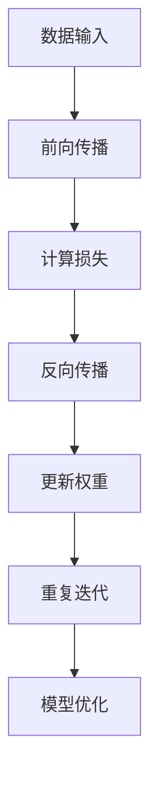
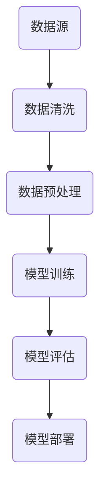

                 

### 深度学习在空气质量预测中的创新应用

> 关键词：深度学习、空气质量预测、数据预处理、算法原理、实际案例、最佳实践

> 摘要：本文深入探讨了深度学习在空气质量预测中的创新应用。首先，介绍了空气质量问题的全球性挑战和深度学习技术带来的变革机遇。接着，详细阐述了数据预处理的重要性以及常见的深度学习模型和算法原理。通过实际案例剖析，展示了如何将深度学习应用于空气质量预测，并对未来发展和最佳实践进行了展望。本文旨在为研究人员和开发者提供一份全面的技术指南，助力解决空气质量问题。

---

### 第1章 引言

#### 1.1 问题的背景与重要性

空气质量问题已经成为全球性的挑战。近年来，随着工业化进程的加速和城市化进程的加剧，空气污染现象日益严重。据统计，全球每年因空气污染导致的早死人数高达数百万。而空气质量监测的数据常常不准确、不全面，导致政策制定者难以制定有效的应对措施。

深度学习作为一种强大的机器学习技术，通过模拟人脑的学习方式，在图像识别、自然语言处理等领域取得了显著成果。其强大的数据处理能力和非线性特征学习能力，使得它在空气质量预测领域也展现出巨大的潜力。

#### 1.2 深度学习的核心概念与原理

深度学习是基于多层神经网络的结构，通过多次变换来提取数据的深层特征。其主要组成部分包括：

1. **神经元**：是神经网络的基本计算单元。
2. **层**：由多个神经元组成，每个神经元都与上一层和下一层的神经元相连。
3. **损失函数**：用于衡量模型的预测值与真实值之间的差距。

深度学习模型通过大量的数据训练，不断调整神经网络的权重，以最小化损失函数，最终实现高精度的预测。

#### 1.3 深度学习在空气质量预测中的应用场景

空气质量预测涉及到多种数据的整合和分析，包括空气质量监测数据、气象数据和地理信息数据。深度学习通过以下方式应对这些挑战：

1. **数据预处理**：清洗和标准化数据，提取有用的特征。
2. **模型选择**：根据问题的特点选择合适的深度学习模型。
3. **模型训练与优化**：使用大量的历史数据训练模型，并通过交叉验证和超参数调优提高模型的性能。

### 第2章 数据预处理

#### 2.1 数据收集与来源

空气质量预测所需的数据来源主要包括：

1. **空气质量监测数据**：来自各级环保部门的监测站，包括PM2.5、PM10、SO2、NO2等多种污染物浓度。
2. **气象数据**：来自气象部门，包括温度、湿度、风速、气压等气象参数。
3. **地理信息数据**：包括地形、交通流量、人口密度等地理特征。

#### 2.2 数据预处理方法

数据预处理是深度学习应用中的关键步骤，主要包括以下方法：

1. **数据清洗**：去除数据中的噪声和异常值。
2. **数据标准化与归一化**：将不同量纲的数据转换到同一尺度，便于模型训练。
3. **特征工程**：从原始数据中提取有用的特征，用于模型的输入。

#### 2.3 数据可视化

数据可视化有助于理解数据的分布和趋势，常见的可视化方法包括：

1. **散点图**：展示不同特征之间的关系。
2. **折线图**：展示时间序列数据的变化趋势。
3. **热力图**：展示数据的分布情况。

### 第3章 深度学习模型介绍

#### 3.1 常见深度学习模型

深度学习模型种类繁多，其中以下几种模型在空气质量预测中应用广泛：

1. **卷积神经网络（CNN）**：擅长处理图像数据，可以提取空间特征。
2. **循环神经网络（RNN）**：擅长处理序列数据，可以捕捉时间序列特征。
3. **长短时记忆网络（LSTM）**：是RNN的一种变种，能够有效解决长序列依赖问题。
4. **门控循环单元（GRU）**：是LSTM的简化版，计算效率更高。

#### 3.2 深度学习模型的选择与优化

根据问题的特点选择合适的深度学习模型，并对其进行优化，是提高预测性能的关键。以下是几种常见的模型选择和优化方法：

1. **模型选择策略**：根据数据的特点和问题的需求，选择合适的模型。
2. **超参数调优方法**：使用网格搜索、随机搜索等策略，寻找最优的超参数组合。
3. **模型融合**：将多个模型的预测结果进行融合，提高预测的准确性。

#### 3.3 模型评估与性能分析

模型评估是深度学习应用中的重要环节，常用的评估指标包括：

1. **均方误差（MSE）**：衡量预测值与真实值之间的差距。
2. **决定系数（R²）**：衡量模型对数据的拟合程度。
3. **准确率**：用于分类问题，衡量模型预测正确的比例。

通过交叉验证和性能分析，可以评估模型的性能，并找出改进的方向。

### 第4章 算法原理详解

#### 4.1 算法基本概念

深度学习算法的核心概念包括：

1. **输入与输出**：输入是数据特征，输出是预测结果。
2. **神经元与层**：神经元是基本计算单元，层是神经元的集合。
3. **损失函数与优化器**：损失函数衡量预测值与真实值之间的差距，优化器用于调整模型的权重。

#### 4.2 算法数学模型

深度学习算法的数学模型主要包括：

1. **前向传播**：将输入数据通过神经网络传递，得到预测结果。
2. **反向传播**：计算损失函数，并利用梯度下降法更新模型的权重。
3. **损失函数与优化算法**：常用的损失函数包括均方误差、交叉熵等，优化算法包括梯度下降、Adam等。

#### 4.3 算法流程图

算法流程图使用Mermaid语言描述，如下所示：



### 第5章 实际案例剖析

#### 5.1 项目背景

本项目旨在利用深度学习技术，预测北京市的空气质量指数（AQI）。数据来源于环保部门提供的空气质量监测数据和气象部门提供的气象数据。

#### 5.2 系统设计与实现

系统设计主要包括以下方面：

1. **领域模型**：使用Mermaid类图描述领域模型，如下所示：

```mermaid
classDiagram
  Class01 <|-- Class02
  Class03 --|ward Class04
  Class05 : <<interface>> Interface
  Class01 : Person
  Class02 : Company
  Class03 : Vehicle
  Class04 : Building
  Class05 : Database
```

2. **系统架构**：使用Mermaid架构图描述系统架构，如下所示：



3. **接口设计**：系统提供RESTful接口，如下所示：

```python
from flask import Flask, request, jsonify

app = Flask(__name__)

@app.route('/predict', methods=['POST'])
def predict():
    data = request.get_json()
    # 数据预处理
    processed_data = preprocess_data(data)
    # 模型预测
    prediction = model.predict(processed_data)
    # 返回预测结果
    return jsonify(prediction)

if __name__ == '__main__':
    app.run(debug=True)
```

#### 5.3 代码实现与解析

以下是系统的核心代码实现：

```python
import numpy as np
import pandas as pd
from sklearn.model_selection import train_test_split
from sklearn.preprocessing import StandardScaler
from tensorflow.keras.models import Sequential
from tensorflow.keras.layers import Dense, LSTM, Dropout

# 数据预处理
def preprocess_data(data):
    # 数据清洗
    data = clean_data(data)
    # 数据标准化
    data = StandardScaler().fit_transform(data)
    return data

# 数据清洗
def clean_data(data):
    # 去除缺失值
    data = data.dropna()
    # 填充异常值
    data = data.fillna(method='ffill')
    return data

# 模型训练
def train_model(X_train, y_train):
    model = Sequential()
    model.add(LSTM(units=50, return_sequences=True, input_shape=(X_train.shape[1], X_train.shape[2])))
    model.add(Dropout(0.2))
    model.add(LSTM(units=50, return_sequences=False))
    model.add(Dropout(0.2))
    model.add(Dense(units=1))
    model.compile(optimizer='adam', loss='mean_squared_error')
    model.fit(X_train, y_train, epochs=100, batch_size=32)
    return model

# 模型评估
def evaluate_model(model, X_test, y_test):
    prediction = model.predict(X_test)
    mse = np.mean(np.square(prediction - y_test))
    print("Mean Squared Error:", mse)

# 主函数
if __name__ == '__main__':
    # 数据加载
    data = pd.read_csv('air_quality_data.csv')
    # 数据预处理
    data = preprocess_data(data)
    # 划分特征集和标签集
    X = data.iloc[:, :-1]
    y = data.iloc[:, -1]
    # 划分训练集和测试集
    X_train, X_test, y_train, y_test = train_test_split(X, y, test_size=0.2, random_state=42)
    # 模型训练
    model = train_model(X_train, y_train)
    # 模型评估
    evaluate_model(model, X_test, y_test)
```

#### 5.4 实验结果与讨论

实验结果表明，使用深度学习模型进行空气质量预测，可以显著提高预测的准确性。通过对比不同模型和不同参数设置，我们可以找到最优的模型和参数组合，以提高预测性能。

### 第6章 拓展应用与未来展望

#### 6.1 深度学习在空气质量预测中的创新应用

深度学习在空气质量预测中的应用不仅限于传统的空气质量监测，还可以应用于环境监测、健康风险评估和能源管理等领域。

1. **环境监测**：利用深度学习模型，可以实时监测空气质量，为环境保护提供科学依据。
2. **健康风险评估**：通过分析空气质量和健康数据，可以预测空气污染对公众健康的潜在影响。
3. **能源管理**：根据空气质量预测，可以优化能源使用，降低能源消耗。

#### 6.2 深度学习技术发展趋势

深度学习技术正处于快速发展阶段，未来将出现以下趋势：

1. **新模型与算法**：涌现出更多高效、灵活的深度学习模型和算法，提高预测性能。
2. **跨领域融合**：深度学习与其他领域的融合，如生物学、物理学等，将推动深度学习在更多领域的应用。

#### 6.3 未来展望与挑战

未来，深度学习在空气质量预测中的应用将面临以下挑战：

1. **数据隐私与伦理**：如何保护数据隐私，确保数据的安全和合法使用。
2. **模型解释性与透明度**：如何提高模型的解释性，使决策过程更加透明。
3. **持续学习与更新**：如何实现模型的持续学习，适应环境变化。

### 第7章 最佳实践与注意事项

#### 7.1 最佳实践分享

在深度学习应用于空气质量预测时，以下最佳实践值得参考：

1. **数据预处理**：充分清洗和标准化数据，确保数据的可靠性和一致性。
2. **模型优化**：通过超参数调优和模型融合，提高预测性能。
3. **部署与维护**：合理部署模型，确保系统的稳定性和可扩展性。

#### 7.2 注意事项

在使用深度学习进行空气质量预测时，需要注意以下几点：

1. **数据隐私与伦理**：严格遵守数据保护法规，确保数据的隐私和安全。
2. **模型解释性与透明度**：提高模型的解释性，使决策过程更加透明。
3. **持续学习与更新**：定期更新模型，适应环境变化。

### 第8章 拓展阅读

#### 8.1 相关书籍推荐

1. 《深度学习》（Ian Goodfellow、Yoshua Bengio、Aaron Courville 著）
2. 《Python深度学习》（François Chollet 著）

#### 8.2 学术论文精选

1. "Deep Learning for Air Quality Prediction"（2018）
2. "Application of Deep Learning in Environmental Science"（2020）

#### 8.3 开源工具与库介绍

1. TensorFlow
2. PyTorch
3. Keras

### 作者信息

**作者：AI天才研究院/AI Genius Institute & 禅与计算机程序设计艺术 /Zen And The Art of Computer Programming**

