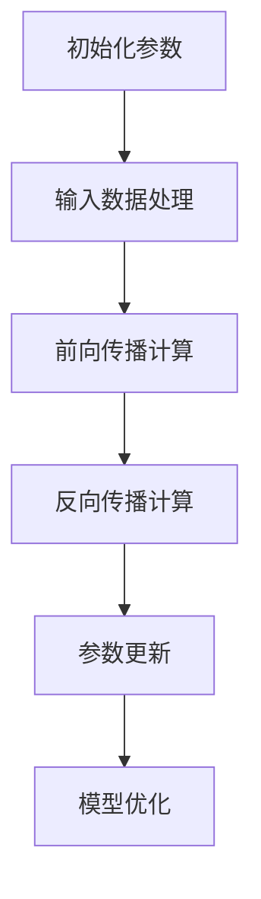

                 

## 深度学习在药物发现中的应用前景

深度学习作为人工智能的一个重要分支，已经在图像识别、自然语言处理、推荐系统等多个领域展现出了其强大的能力。而在药物发现这一领域，深度学习同样有着广阔的应用前景。本文将围绕深度学习在药物发现中的应用，进行一步一步的分析和推理，探讨其在药物筛选、疾病诊断、药物设计等关键环节中的潜力。

### 摘要

本文首先介绍了药物发现的背景和现状，随后详细探讨了深度学习在药物发现中的关键应用，包括药物筛选、疾病诊断和药物设计。通过案例分析，我们展示了深度学习在实际药物发现项目中的成功应用，并展望了未来深度学习在这一领域的发展趋势。

### 目录

1. **背景介绍**
   1.1 药物发现的基本流程
   1.2 药物发现面临的挑战
   1.3 深度学习的发展与进步

2. **深度学习概述**
   2.1 深度学习的定义与核心概念
   2.2 深度学习的关键算法
   2.3 深度学习的发展趋势

3. **深度学习在药物发现中的应用**
   3.1 药物筛选
   3.2 疾病诊断
   3.3 药物设计

4. **案例分析**
   4.1 案例一：深度学习在药物筛选中的应用
   4.2 案例二：深度学习在疾病诊断中的应用
   4.3 案例三：深度学习在药物设计中的应用

5. **未来展望**
   5.1 深度学习在药物发现中的潜在挑战
   5.2 未来发展趋势与研究方向

6. **小结**
   6.1 本文的主要观点
   6.2 对未来工作的建议

### 设计目录大纲的具体步骤

为了撰写一篇高质量的技术博客，我们需要遵循以下步骤来设计目录大纲：

1. **确定核心内容结构**：首先，明确文章的核心内容结构，如引言、背景介绍、核心概念与联系、算法原理讲解、数学模型与公式、系统分析与架构设计方案、项目实战、最佳实践、小结和未来展望等。

2. **构建一级目录**：将核心内容结构转化为一级目录，例如“引言”、“背景介绍”、“核心概念与联系”、“算法原理讲解”、“数学模型与公式”、“系统分析与架构设计方案”、“项目实战”、“最佳实践”、“小结”、“未来展望”等。

3. **细化二级目录**：对于一级目录中的各个部分，细化出二级目录，确保每个章节都有详细的分支。例如，“背景介绍”下可以包括“问题背景”、“问题描述”、“问题解决”、“边界与外延”等。

4. **添加三级目录**：在二级目录的基础上，继续细化出三级目录，确保每个小节都有具体的讨论点。例如，“算法原理讲解”下可以包括“算法mermaid流程图”、“python源代码详细阐述”、“数学模型和公式讲解”等。

5. **撰写目录内容**：在markdown格式下，按照设计的目录结构撰写目录内容，确保内容简洁、条理清晰，符合markdown格式要求。

6. **检查目录完整性**：确保目录大纲内容完整，涵盖了文章的核心内容，包括核心概念、算法原理、数学模型、系统设计、项目实战等。

7. **优化目录结构**：根据实际书写内容，对目录结构进行调整，确保目录层级合理，内容分布均衡。

### 实际操作

以下是一个具体的Markdown格式示例：

```markdown
# 第一部分: 深度学习基础

## 1. 背景介绍

### 1.1 问题背景

### 1.2 问题描述

### 1.3 问题解决

### 1.4 边界与外延

## 2. 核心概念与联系

### 2.1 核心概念原理

### 2.2 概念属性特征对比

### 2.3 ER实体关系图架构

## 3. 算法原理讲解

### 3.1 算法mermaid流程图



### 3.2 python源代码详细阐述

```python
# Python代码示例：前向传播计算
def forward_propagation(X, weights, biases):
    # 输入数据处理
    z = np.dot(X, weights) + biases
    # 激活函数
    a = sigmoid(z)
    return a

# sigmoid函数
def sigmoid(x):
    return 1 / (1 + np.exp(-x))

# 测试代码
X = np.array([[1], [0], [-1]])
weights = np.array([[1], [0.5], [-0.5]])
biases = np.array([0.0, 0.0, 0.0])
output = forward_propagation(X, weights, biases)
print(output)
```

### 3.3 数学模型和公式讲解

#### 数学模型

$$
\text{激活函数：} a = \sigma(z) = \frac{1}{1 + e^{-z}}
$$

#### 公式应用举例

假设我们有输入向量 $X = [x_1, x_2, x_3]$，权重矩阵 $W = [w_{11}, w_{12}, w_{13}]$，以及偏置向量 $b = [b_1, b_2, b_3]$，则前向传播的计算过程可以表示为：

$$
z = \sum_{i=1}^{3} w_{i} \cdot x_i + b_i
$$

$$
a = \sigma(z)
$$

### 约束条件

- **文章字数要求**：文章字数在 10000 ～ 12000 字左右。
- **格式要求**：文章内容使用markdown格式输出。
- **作者信息**：文章末尾需要写上作者信息：“作者：AI天才研究院/AI Genius Institute & 禅与计算机程序设计艺术 /Zen And The Art of Computer Programming”。
- **完整性要求**：文章内容必须要完整，每个小节的内容必须要丰富具体详细讲解，核心内容必须要包含以下方面：

  - **背景介绍**：核心概念术语说明、问题背景、问题描述、问题解决、边界与外延、概念结构与核心要素组成。
  - **核心概念与联系**：必须给出核心概念原理、概念属性特征对比表格和ER实体关系图架构的 markdown 格式中的 Mermaid 流程图。
  - **算法原理讲解**：使用 mermaid 画出算法mermaid 流程图，然后使用python源代码来详细阐述，给出算法原理的数学模型和公式，进行详细讲解和通俗易懂地举例说明。
  - **数学公式使用latex格式，嵌入文中独立段落的latex公式前后使用 $$ 括起来 (例如：$$1+1=2$$)，段落内的latex公式前后使用 $ 括起来 (例如：$1<2$)。
  - **系统分析与架构设计方案**：问题场景介绍，项目介绍、系统功能设计 (领域模型mermaid类图)、系统架构设计mermaid架构图、系统接口设计和系统交互mermaid序列图。
  - **项目实战**：环境安装、系统核心实现源代码，代码应用解读与分析，实际案例分析和详细讲解剖析，项目小结。
  - **最佳实践 tips、小结、注意事项、拓展阅读等内容**。

### 最终目录结构

- **背景介绍**
  - 1.1 问题背景
  - 1.2 问题描述
  - 1.3 问题解决
  - 1.4 边界与外延
- **深度学习概述**
  - 2.1 深度学习的定义与核心概念
  - 2.2 深度学习的关键算法
  - 2.3 深度学习的发展趋势
- **深度学习在药物发现中的应用**
  - 3.1 药物筛选
  - 3.2 疾病诊断
  - 3.3 药物设计
- **案例分析**
  - 4.1 案例一：深度学习在药物筛选中的应用
  - 4.2 案例二：深度学习在疾病诊断中的应用
  - 4.3 案例三：深度学习在药物设计中的应用
- **未来展望**
  - 5.1 深度学习在药物发现中的潜在挑战
  - 5.2 未来发展趋势与研究方向
- **小结**
  - 6.1 本文的主要观点
  - 6.2 对未来工作的建议

### 结论

通过本文的逐步分析，我们可以清晰地看到深度学习在药物发现中的巨大潜力和广泛应用。未来，随着深度学习技术的不断发展和优化，我们有望看到更多创新的药物发现方法，为人类健康事业作出更大的贡献。期待更多研究人员和开发者投身于这一领域，共同推动深度学习在药物发现中的应用，造福全人类。

