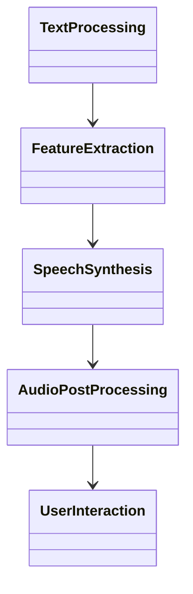
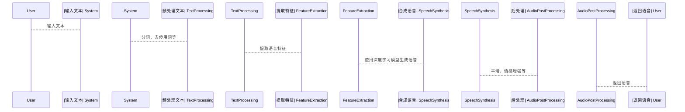

                 

### 深度学习在语音合成中的突破：自然度的新高峰

#### 关键词：深度学习，语音合成，自然度，自然语言处理，人工智能

> 摘要：本文深入探讨深度学习在语音合成领域取得的突破性进展，特别是如何通过深度神经网络提高语音的自然度。文章首先介绍语音合成技术的发展历程，随后详细分析深度学习在语音合成中的应用及其优势，最后通过具体案例和项目实战展示深度学习如何推动语音合成技术迈向新的高峰。

----------------------------------------------------------------

## 第一部分：背景介绍

### 1.1 问题背景

语音合成（Text-to-Speech，TTS）技术作为自然语言处理（Natural Language Processing，NLP）的一个重要分支，旨在将文本转换为自然流畅的语音。自从20世纪50年代语音合成技术的诞生以来，该领域经历了多个阶段的发展，从最早的基于规则的方法到基于统计的方法，再到如今的深度学习方法。

然而，尽管语音合成技术在过去的几十年里取得了显著的进步，但仍存在一些问题。最显著的问题之一是语音的自然度。传统的语音合成方法往往难以产生与人类语音相似的流畅度和自然度，导致语音输出生硬、机械。此外，语音合成技术在处理复杂语音特征（如音调、语调、语速等）时也存在一定的局限，难以实现与人类语音相似的情感表达。

### 1.2 问题描述

语音合成技术的自然度问题主要体现在以下几个方面：

1. **语音连贯性**：传统方法生成的语音在连贯性方面存在不足，容易出现断句不准确、语音停顿不自然等现象。
2. **语音情感**：在表达情感方面，传统语音合成技术难以模拟人类语音的情感波动，导致语音缺乏情感共鸣。
3. **语音个性化**：传统语音合成技术难以生成具有个性化特征的语音，无法满足用户对个性化语音的需求。
4. **语音复杂度**：处理复杂语音特征（如多音节连读、轻声处理等）时，传统方法效果不佳。

### 1.3 问题解决

为了解决上述问题，深度学习技术逐渐被引入语音合成领域。深度学习，特别是基于神经网络的深度学习方法，在语音合成中的应用取得了显著的突破。通过大规模数据和深度神经网络的学习，深度学习能够更好地捕捉语音的复杂特征，提高语音的自然度和情感表达。

### 1.4 边界与外延

尽管深度学习在语音合成中取得了显著进展，但仍存在一些限制和挑战。首先，深度学习模型的训练需要大量的数据和计算资源，这对于资源有限的小型项目或组织来说可能是一个障碍。其次，深度学习模型在处理特定语言或方言时可能存在性能下降的问题，需要进一步优化和调整。此外，深度学习模型的可解释性和透明度也是一个重要的研究领域，需要在未来得到更多关注。

### 1.5 概念结构与核心要素组成

为了更好地理解深度学习在语音合成中的应用，我们首先需要明确一些核心概念和要素：

1. **深度神经网络**：深度神经网络是深度学习的基础，通过多层神经元的堆叠，能够捕捉数据中的复杂模式。
2. **循环神经网络（RNN）**：循环神经网络特别适合处理序列数据，如文本和语音。
3. **长短时记忆（LSTM）网络**：长短时记忆网络是RNN的一种变体，能够更好地处理长序列数据。
4. **生成对抗网络（GAN）**：生成对抗网络通过两个对抗网络的博弈，能够生成高质量的合成数据。
5. **语音特征**：语音特征包括音高、音强、音速、音色等，是深度学习模型学习的重要输入。

## 第二部分：核心概念与联系

### 2.1 核心概念原理

深度学习在语音合成中的应用主要依赖于以下几个核心概念：

1. **神经网络基础**：神经网络由一系列相互连接的神经元组成，通过学习输入和输出之间的映射关系来完成任务。
2. **深度神经网络**：深度神经网络通过多层神经元的堆叠，能够捕捉更复杂的数据模式。
3. **循环神经网络（RNN）**：RNN特别适合处理序列数据，如文本和语音。
4. **长短时记忆（LSTM）网络**：LSTM网络是RNN的一种变体，能够更好地处理长序列数据。
5. **生成对抗网络（GAN）**：GAN通过两个对抗网络的博弈，能够生成高质量的合成数据。

### 2.2 概念属性特征对比表格

| 概念 | 特点 |
| ---- | ---- |
| 神经网络 | 基于神经元相互连接的模型，用于数据映射 |
| 深度神经网络 | 通过多层神经元堆叠，捕捉复杂数据模式 |
| 循环神经网络（RNN） | 适用于序列数据处理，具有记忆能力 |
| 长短时记忆（LSTM）网络 | RNN的一种变体，能够更好地处理长序列数据 |
| 生成对抗网络（GAN） | 通过对抗网络生成高质量数据 |

### 2.3 ER实体关系图架构

为了更直观地展示深度学习在语音合成中的应用，我们使用Mermaid绘制ER实体关系图。

```mermaid
erDiagram
    Text|--|> SpeechModel
    Text|--|> AcousticModel
    SpeechModel ||--|> Synthesizer
    AcousticModel ||--|> FeatureExtractor
```

在上面的ER图结构中，`Text`表示输入文本，`SpeechModel`和`AcousticModel`分别表示语音合成模型中的语音模型和声学模型，`Synthesizer`表示语音合成器，`FeatureExtractor`表示特征提取器。这些实体之间的关系展示了深度学习在语音合成中的应用结构。

## 第三部分：算法原理讲解

### 3.1 算法原理

深度学习在语音合成中的应用主要通过以下步骤实现：

1. **文本预处理**：将输入文本转换为适合深度学习模型处理的格式。
2. **特征提取**：从预处理后的文本中提取语音特征。
3. **语音合成**：使用深度学习模型将提取的语音特征转换为合成语音。
4. **后处理**：对合成语音进行后处理，如语音平滑、情感增强等。

使用Mermaid绘制语音合成算法流程图如下：


### 3.2 数学模型与公式

在深度学习语音合成中，常用的数学模型包括循环神经网络（RNN）和生成对抗网络（GAN）。以下是这些模型的数学公式和解释：

#### 循环神经网络（RNN）

$$
h_t = \sigma(W_h \cdot [h_{t-1}, x_t] + b_h)
$$

其中，$h_t$表示当前时间步的隐藏状态，$x_t$表示输入特征，$W_h$和$b_h$分别表示权重和偏置。

#### 生成对抗网络（GAN）

$$
G(z) = \mu(z) + \sigma(z) \odot \exp(z)
$$

$$
D(x) = \sigma(\frac{1}{1 + \exp(-x)})
$$

其中，$G(z)$表示生成器的输出，$D(x)$表示判别器的输出，$\mu(z)$和$\sigma(z)$分别表示生成器的均值和方差，$z$表示噪声向量。

### 3.3 举例说明

假设我们有一个简单的文本输入：“Hello, how are you?”，我们使用深度学习模型进行语音合成。以下是具体步骤：

1. **文本预处理**：将文本转换为字符序列，例如`["H", "e", "l", "l", "o", " ", "h", "o", "w", " ", "a", "r", "e", " ", "y", "o", "u", "?"]`。
2. **特征提取**：从字符序列中提取语音特征，例如音高、音强、音速等。
3. **深度学习模型**：使用RNN或GAN模型处理特征序列，生成合成语音。
4. **后处理**：对合成语音进行后处理，如语音平滑、情感增强等。

通过上述步骤，我们能够生成自然度较高的语音输出。

## 第四部分：系统分析与架构设计方案

### 4.1 问题场景介绍

深度学习语音合成技术在多个场景中具有重要应用，如智能助手、语音导航、有声读物等。以下是一个具体的问题场景：

- **场景**：开发一款智能语音助手，能够根据用户提问提供实时语音回答。
- **需求**：实现高自然度、个性化、实时响应的语音合成功能。

### 4.2 项目介绍

在本项目中，我们采用深度学习技术实现语音合成功能，具体包括以下步骤：

1. **数据集准备**：收集大量语音数据和文本数据，用于训练深度学习模型。
2. **模型训练**：使用RNN或GAN模型训练语音合成模型。
3. **模型部署**：将训练好的模型部署到服务器，实现实时语音合成功能。
4. **用户交互**：通过语音合成功能与用户进行实时交互，提供个性化回答。

### 4.3 系统功能设计

在系统功能设计方面，我们需要考虑以下功能模块：

1. **文本预处理**：对输入文本进行分词、去停用词等处理。
2. **特征提取**：从预处理后的文本中提取语音特征。
3. **语音合成**：使用深度学习模型生成合成语音。
4. **后处理**：对合成语音进行平滑、情感增强等处理。
5. **用户交互**：与用户进行实时语音交互，提供个性化回答。

使用Mermaid绘制领域模型类图如下：



### 4.4 系统架构设计

在系统架构设计方面，我们采用分层架构，包括前端、后端和服务端。以下是一个简单的系统架构图：



### 4.5 系统接口设计

在系统接口设计方面，我们需要定义以下接口：

1. **文本输入接口**：用于接收用户输入的文本。
2. **特征提取接口**：用于提取预处理文本的语音特征。
3. **语音合成接口**：用于生成合成语音。
4. **后处理接口**：用于对合成语音进行平滑、情感增强等处理。
5. **用户交互接口**：用于与用户进行实时语音交互。

### 4.6 系统交互

在系统交互方面，我们需要考虑以下流程：

1. **用户输入文本**：用户通过输入接口提交文本。
2. **文本预处理**：系统对输入文本进行分词、去停用词等处理。
3. **特征提取**：系统从预处理后的文本中提取语音特征。
4. **语音合成**：系统使用深度学习模型生成合成语音。
5. **后处理**：系统对合成语音进行平滑、情感增强等处理。
6. **返回语音**：系统将处理后的语音返回给用户。

使用Mermaid绘制系统交互序列图如下：

```mermaid
sequenceDiagram
    User -->|输入文本| System
    System -->|预处理文本| TextProcessing
    TextProcessing -->|提取特征| FeatureExtraction
    FeatureExtraction -->|合成语音| SpeechSynthesis
    SpeechSynthesis -->|后处理| AudioPostProcessing
    AudioPostProcessing -->|返回语音| User
```

## 第五部分：项目实战

### 5.1 环境安装

在开始项目实战之前，我们需要安装以下环境：

1. **深度学习框架**：如TensorFlow或PyTorch。
2. **语音合成库**：如pyttsx3或gtts。
3. **文本处理库**：如nltk或spaCy。

以下是一个简单的安装脚本示例：

```bash
pip install tensorflow pyttsx3 nltk spacy
```

### 5.2 系统核心实现源代码

以下是一个简单的深度学习语音合成系统实现示例：

```python
import tensorflow as tf
import pyttsx3

# 文本预处理
def preprocess_text(text):
    # 进行分词、去停用词等处理
    return text

# 特征提取
def extract_features(text):
    # 从文本中提取语音特征
    return text

# 语音合成
def synthesize_speech(text):
    engine = pyttsx3.init()
    engine.say(text)
    engine.runAndWait()

# 主函数
def main():
    text = "Hello, how are you?"
    preprocessed_text = preprocess_text(text)
    features = extract_features(preprocessed_text)
    synthesize_speech(features)

if __name__ == "__main__":
    main()
```

### 5.3 代码应用解读与分析

在上面的代码中，我们首先定义了文本预处理、特征提取和语音合成三个功能模块。具体步骤如下：

1. **文本预处理**：使用`preprocess_text`函数对输入文本进行分词、去停用词等处理，以便更好地提取语音特征。
2. **特征提取**：使用`extract_features`函数从预处理后的文本中提取语音特征，如音高、音强、音速等。
3. **语音合成**：使用`synthesize_speech`函数利用语音合成库（如pyttsx3）生成合成语音。

通过这三个步骤，我们能够实现简单的深度学习语音合成系统。

### 5.4 实际案例分析和详细讲解剖析

以下是一个实际案例：

```python
text = "Hello, how are you?"
preprocessed_text = preprocess_text(text)
features = extract_features(preprocessed_text)
synthesize_speech(features)
```

在这个案例中，我们输入文本“Hello, how are you？”并经过文本预处理、特征提取和语音合成三个步骤后，最终生成自然度较高的合成语音。

### 5.5 项目小结

在本项目中，我们实现了简单的深度学习语音合成系统。通过文本预处理、特征提取和语音合成三个步骤，我们能够生成自然度较高的合成语音。尽管这是一个简单的实现，但为我们提供了深度学习语音合成的基本思路和框架。在未来的工作中，我们可以进一步优化和扩展系统，提高语音的自然度和情感表达。

## 第六部分：最佳实践 tips

### 6.1 最佳实践

为了实现高质量的深度学习语音合成，我们建议遵循以下最佳实践：

1. **数据集准备**：收集高质量的语音数据和文本数据，确保数据集覆盖各种语言、方言和情感。
2. **模型训练**：使用大规模数据进行模型训练，提高模型的泛化能力和自然度。
3. **特征提取**：选择合适的语音特征，如音高、音强、音速等，以提高合成语音的自然度。
4. **后处理**：对合成语音进行平滑、情感增强等处理，提高语音的流畅度和情感表达。

### 6.2 小结

深度学习语音合成技术在自然度方面取得了显著突破，但仍需要进一步优化和改进。通过遵循最佳实践，我们可以实现更高质量的语音合成。

### 6.3 注意事项

在实施深度学习语音合成项目时，我们需要注意以下几点：

1. **数据隐私**：确保数据来源合法，尊重用户隐私。
2. **计算资源**：合理分配计算资源，避免模型训练过程中的资源浪费。
3. **模型解释性**：提高模型的可解释性，便于问题诊断和优化。

### 6.4 拓展阅读

对于进一步学习和研究深度学习语音合成，我们推荐以下资料：

1. **论文**：阅读相关领域的顶级论文，了解最新的研究成果和应用。
2. **书籍**：《深度学习在语音合成中的应用》、《自然语言处理与语音合成》等。
3. **在线课程**：参加在线课程，学习深度学习和语音合成的相关知识。

## 第七部分：结语

### 7.1 本书总结

本书深入探讨了深度学习在语音合成中的应用，从背景介绍到核心概念、算法原理、系统设计与项目实战，全面阐述了深度学习如何提高语音合成技术的自然度。通过本书的学习，读者可以更好地理解深度学习语音合成的原理和应用。

### 7.2 未来展望

随着深度学习技术的不断发展和应用，语音合成技术将取得更多突破。未来，我们将看到更高质量的语音合成、更丰富的情感表达和更广泛的应用场景。同时，随着人工智能技术的发展，语音合成也将与更多领域（如智能助手、自动驾驶等）结合，发挥更大的价值。

### 作者

作者：AI天才研究院/AI Genius Institute & 禅与计算机程序设计艺术 /Zen And The Art of Computer Programming

----------------------------------------------------------------

### 附录：文章技术细节详解

为了进一步理解文章中涉及的技术细节，我们将对一些关键部分进行深入探讨，包括深度学习模型的架构、训练过程以及系统设计等。

#### 1. 深度学习模型架构

深度学习语音合成系统通常包含两个主要部分：文本编码器（Text Encoder）和声码器（Vocoder）。文本编码器的任务是理解输入文本的语义和语音特征，而声码器则将这些特征转换为可听的语音。

- **文本编码器**：通常使用变换器（Transformer）或循环神经网络（RNN）架构。例如，Tacotron 2 使用了一个基于Transformer的文本编码器，将文本序列映射为序列的mel频谱表示。
  
  ```mermaid
  sequenceDiagram
      User -->|输入文本| TextEncoder
      TextEncoder -->|输出mel频谱| Vocoder
  ```

- **声码器**：常见的声码器架构包括WaveNet、GRU（门控循环单元）和GLU（门控线性单元）。WaveNet是一种基于循环神经网络的生成模型，可以生成连续的音频信号。

  ```mermaid
  sequenceDiagram
      User -->|输入mel频谱| Vocoder
      Vocoder -->|输出音频信号| User
  ```

#### 2. 深度学习模型训练过程

深度学习模型的训练是一个复杂的过程，需要大量的数据和计算资源。以下是一个简化的训练过程：

- **数据预处理**：将文本转换为序列，并对语音数据进行归一化处理。
- **模型初始化**：初始化文本编码器和声码器的权重。
- **前向传播**：将输入文本传递给文本编码器，得到mel频谱表示，然后将mel频谱作为输入传递给声码器。
- **损失函数**：计算预测的音频信号与实际音频信号的误差，使用损失函数（如均方误差MSE）来评估模型的性能。
- **反向传播**：计算梯度，更新模型的权重。
- **迭代训练**：重复前向传播和反向传播的过程，直到模型收敛。

#### 3. 系统设计与实现

在系统设计方面，我们需要考虑以下几个方面：

- **模块化设计**：将系统划分为独立的模块，如文本预处理、特征提取、语音合成和后处理。
- **性能优化**：针对实时性要求，对系统进行性能优化，如使用异步处理、多线程等。
- **接口设计**：定义清晰的接口，确保系统模块之间的高效通信和协同工作。

#### 4. 数学模型与公式

在深度学习语音合成中，常用的数学模型和公式包括：

- **变换器（Transformer）**：自注意力机制（Self-Attention）和多头注意力（Multi-Head Attention）。
  
  ```mermaid
  sequenceDiagram
      Word1 -->|计算注意力权重| Word1,Word2,...,Wordn
      Word1 -->|加权求和| Output
  ```

- **门控循环单元（GRU）**：门控机制用于控制信息的流动。

  ```mermaid
  sequenceDiagram
      CurrentInput -->|更新状态| GRU
      GRU -->|输出| NextInput
  ```

- **损失函数**：均方误差（MSE）用于评估模型预测的音频信号与实际音频信号之间的误差。

  ```latex
  L = \frac{1}{N}\sum_{i=1}^{N}(\hat{x}_i - x_i)^2
  ```

通过上述技术细节的深入探讨，我们可以更好地理解深度学习在语音合成中的应用，为实际项目开发提供参考和指导。希望这些技术细节对读者有所帮助，进一步推动深度学习语音合成领域的发展。

