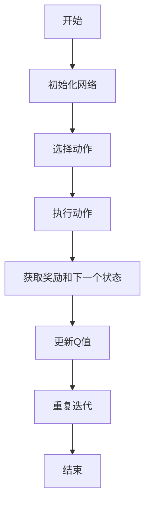
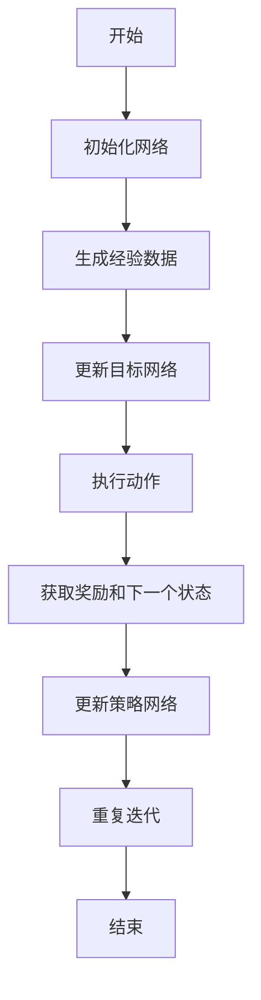
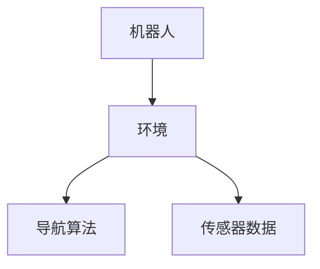
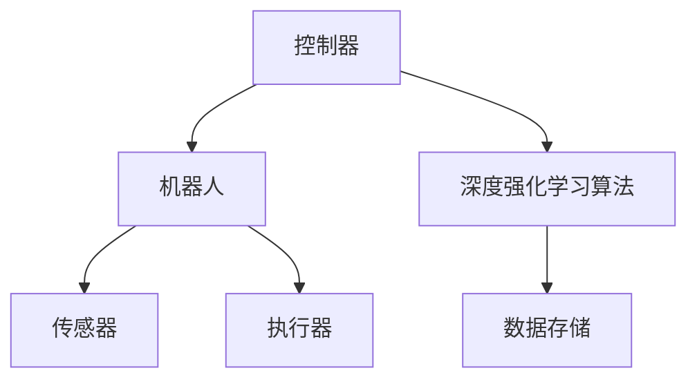
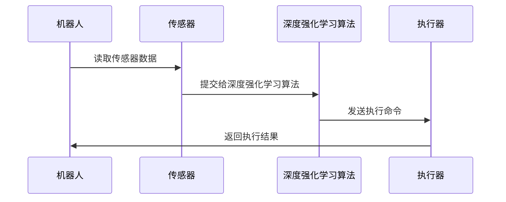
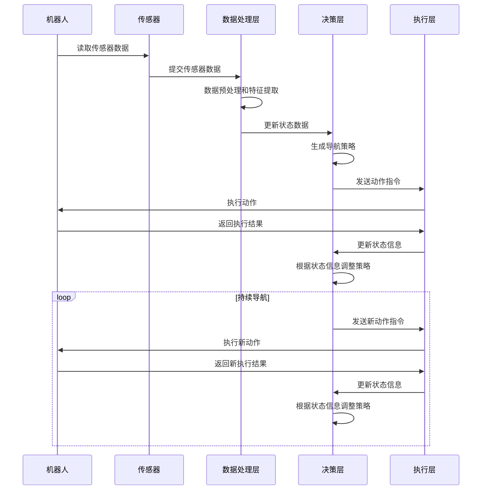

                 

### 深度强化学习在机器人导航中的突破

#### 关键词：深度强化学习、机器人导航、自主导航、动态环境、路径规划

> 摘要：本文以深度强化学习为技术核心，探讨了其在机器人导航中的突破性应用。通过深入剖析深度强化学习的基本原理和应用框架，结合具体案例，展示了其在未知环境自主导航、动态环境目标跟踪及复杂地形路径规划等方面的卓越性能。本文旨在为读者提供一份全面、系统的技术指南，帮助理解深度强化学习在机器人导航中的实际应用价值。

### 目录大纲

**《深度强化学习在机器人导航中的突破》**

----------------------------------------------------------------

# 第一部分：背景介绍

## 第1章：问题背景与核心概念

### 1.1 机器人导航的挑战与需求

#### 1.1.1 机器人导航的重要性

#### 1.1.2 当前机器人导航存在的问题

#### 1.1.3 深度强化学习在机器人导航中的应用潜力

### 1.2 核心概念

#### 1.2.1 深度强化学习的定义

#### 1.2.2 强化学习与深度学习的结合

#### 1.2.3 机器人导航中的深度强化学习模型

### 1.3 边界与外延

#### 1.3.1 深度强化学习在机器人导航中的适用范围

#### 1.3.2 深度强化学习在机器人导航中的局限性

## 第2章：深度强化学习基础

### 2.1 强化学习基本原理

#### 2.1.1 强化学习概述

#### 2.1.2 强化学习的基本要素

#### 2.1.3 Q-learning算法

### 2.2 深度强化学习模型

#### 2.2.1 神经网络与深度学习

#### 2.2.2 深度Q网络（DQN）

#### 2.2.3 深度确定性策略梯度（DDPG）

## 第3章：深度强化学习在机器人导航中的应用

### 3.1 机器人导航中的深度强化学习框架

#### 3.1.1 深度强化学习在机器人导航中的应用框架

#### 3.1.2 机器人导航中的状态、动作与奖励设计

#### 3.1.3 深度强化学习算法的选择与应用

### 3.2 典型应用案例

#### 3.2.1 在未知环境中的自主导航

#### 3.2.2 在动态环境中的目标跟踪

#### 3.2.3 在复杂地形中的路径规划

## 第4章：数学模型与算法原理

### 4.1 深度Q网络（DQN）

#### 4.1.1 DQN算法的数学模型

$$
Q(s, a) = r + \gamma \max_{a'} Q(s', a')
$$

#### 4.1.2 DQN算法的mermaid流程图



### 4.2 深度确定性策略梯度（DDPG）

#### 4.2.1 DDPG算法的数学模型

$$
\theta_{\pi}^{\text{new}} = \theta_{\pi}^{\text{old}} - \alpha_{\pi} \nabla_{\theta_{\pi}} J(\theta_{\pi})
$$

#### 4.2.2 DDPG算法的mermaid流程图



## 第5章：系统分析与架构设计

### 5.1 问题场景介绍

### 5.2 系统功能设计

#### 5.2.1 领域模型



### 5.3 系统架构设计

#### 5.3.1 系统架构



### 5.4 系统接口设计

#### 5.4.1 系统接口



## 第6章：项目实战

### 6.1 环境安装

### 6.2 系统核心实现源代码

#### 6.2.1 代码应用解读与分析

#### 6.2.2 实际案例分析和详细讲解剖析

### 6.3 项目小结

## 第7章：最佳实践与拓展阅读

### 7.1 最佳实践

### 7.2 小结

### 7.3 注意事项

### 7.4 拓展阅读

------------------------------------------------------------------

### 第一部分：背景介绍

#### 第1章：问题背景与核心概念

### 1.1 机器人导航的挑战与需求

#### 1.1.1 机器人导航的重要性

在现代社会，机器人在各种领域的应用日益广泛，从工业生产到家庭服务，再到医疗、农业和物流等，机器人正逐步改变我们的生活方式。在这些应用中，机器人导航扮演着至关重要的角色。导航系统的性能直接关系到机器人的工作效率和安全性。机器人导航不仅仅是简单地从A点移动到B点，它还包括了路径规划、避障、能量管理、任务规划等多个复杂环节。

随着技术的进步，对机器人导航系统的要求也越来越高。首先，环境复杂性不断增加。机器人需要在室内、室外、城市、森林等多种环境中工作，每个环境都有其独特的挑战。其次，任务多样性使得机器人需要在不同的任务场景中灵活应对，比如仓库拣选机器人需要在货架之间高效穿梭，而农业机器人则需要在田地中精准作业。最后，实时性和鲁棒性也是机器人导航的关键需求。机器人需要在不断变化的环境中快速做出反应，同时保持稳定的导航性能。

#### 1.1.2 当前机器人导航存在的问题

尽管机器人导航技术取得了显著的进步，但依然面临着诸多挑战。首先，环境感知能力不足。当前的机器人导航系统主要依赖于传感器如激光雷达、摄像头和超声波传感器来获取环境信息，但这些传感器存在一定的局限性，如激光雷达在光照变化和恶劣天气条件下效果不佳，摄像头则容易受到光照、颜色变化和物体遮挡的影响。

其次，路径规划算法复杂。机器人导航需要高效的路径规划算法来处理复杂的动态环境。然而，现有的路径规划算法如A*算法、Dijkstra算法等在处理动态环境时效率较低，难以实时响应环境变化。此外，算法的可扩展性较差，难以适应多样化的任务场景。

最后，机器人的自主性较低。大多数机器人导航系统依赖于预先设定好的路径或者人工干预，缺乏真正的自主决策能力。这限制了机器人在复杂和未知环境中的应用范围，也增加了维护成本。

#### 1.1.3 深度强化学习在机器人导航中的应用潜力

深度强化学习（Deep Reinforcement Learning，DRL）是一种结合了深度学习和强化学习的先进技术，通过智能体的自主学习，实现与环境的高效互动。在机器人导航领域，DRL具有巨大的应用潜力。

首先，DRL能够显著提高环境感知能力。通过深度神经网络，DRL可以从大量的传感器数据中学习到复杂的模式，从而实现对环境的精准理解和预测。例如，深度卷积神经网络（CNN）可以用于图像识别，深度递归神经网络（RNN）可以用于序列数据的处理，从而提高机器人对复杂环境的感知能力。

其次，DRL能够实现高效的路径规划。传统的路径规划算法在动态环境中效率较低，而DRL通过智能体的不断试错和优化，可以实时地调整策略，适应环境变化。这种动态适应能力使得DRL在处理复杂动态环境时表现出色。

最后，DRL可以提升机器人的自主决策能力。DRL通过自主学习，使得机器人能够自主地理解和应对各种任务场景，减少了对人工干预的依赖。这不仅提高了机器人的自主性，也降低了维护成本。

总之，深度强化学习在机器人导航领域具有广泛的应用前景，有望解决当前存在的许多挑战，推动机器人导航技术的进一步发展。

#### 1.2 核心概念

##### 1.2.1 深度强化学习的定义

深度强化学习（Deep Reinforcement Learning，DRL）是强化学习的一种，它结合了深度学习（Deep Learning）和传统的强化学习（Reinforcement Learning，RL）方法。DRL的核心目标是训练出一个智能体（agent），使其能够通过与环境（environment）的交互，学习到最优策略（policy），从而最大化累积奖励（cumulative reward）。

在DRL中，智能体通过观察环境的状态（state），选择一个动作（action），然后根据动作的结果（即环境对动作的反馈，包括奖励和下一个状态）更新其策略。这一过程不断重复，形成一种学习循环，使得智能体能够逐步优化其行为。

与传统强化学习相比，DRL引入了深度神经网络（DNN），用于表示状态和动作的值函数（value function）或策略（policy）。深度神经网络具有强大的特征提取能力，能够从高维数据中自动提取有用的特征，从而大大简化了问题的复杂性。这使得DRL在处理高维状态空间和复杂的决策问题时具有显著的优势。

##### 1.2.2 强化学习与深度学习的结合

强化学习与深度学习的结合源于两者各自的优点。强化学习擅长处理具有反馈循环和动态变化的问题，通过奖励机制驱动智能体优化行为；而深度学习则擅长处理高维数据的特征提取和模式识别。

结合深度学习的强化学习，通过使用深度神经网络来近似值函数或策略，实现了对高维状态空间和动作空间的建模。这种结合在几个关键方面带来了优势：

1. **状态表征能力**：深度神经网络可以自动提取状态的特征，将高维的状态数据转换为低维的表示。这样，智能体可以更容易地理解复杂的交互环境。
   
2. **动作选择效率**：通过深度神经网络，智能体可以实时地评估不同动作的预期收益，从而做出最优的动作选择。这大大提高了决策的效率和准确性。

3. **泛化能力**：深度神经网络具有强大的泛化能力，可以在未见过的环境中表现出较好的适应性。这使得智能体能够更好地应对动态变化和不确定性的挑战。

##### 1.2.3 机器人导航中的深度强化学习模型

在机器人导航中，深度强化学习模型主要用来解决状态空间和动作空间高维、动态环境复杂等问题。以下是几种常见的DRL模型及其特点：

1. **深度Q网络（Deep Q-Network，DQN）**：DQN是DRL领域的一种经典模型，通过训练一个深度神经网络来近似Q值函数。Q值函数表示在给定状态下选择某一动作的预期累积奖励。DQN的核心思想是利用经验回放（experience replay）和目标网络（target network）来稳定训练过程。

2. **深度确定性策略梯度（Deep Deterministic Policy Gradient，DDPG）**：DDPG是一种基于策略梯度的DRL模型，旨在解决非确定性策略在连续动作空间中的优化问题。DDPG使用了一个目标网络来稳定训练过程，并利用梯度上升法更新策略网络。

3. **异步优势演员-评论家（Asynchronous Advantage Actor-Critic，A3C）**：A3C通过同时训练多个智能体（演员）和共享一个全局策略网络（评论家）来提高学习效率。A3C能够在多个并行环境中同时进行学习，显著提高了训练速度。

这些DRL模型在机器人导航中的应用，通过不断的学习和优化，使得机器人能够在复杂动态环境中实现高效的导航，为机器人导航领域带来了革命性的突破。

#### 1.3 边界与外延

##### 1.3.1 深度强化学习在机器人导航中的适用范围

深度强化学习在机器人导航中的适用范围非常广泛，主要涵盖以下几个方面：

1. **未知环境的自主导航**：在许多实际应用场景中，环境是未知的，或者环境变化频繁，这使得传统的导航方法难以应对。DRL能够通过自主学习和探索，逐步建立对环境的理解，从而实现自主导航。

2. **动态环境的目标跟踪**：动态环境中目标的位置和速度可能不断变化，这对导航系统提出了更高的要求。DRL能够实时调整策略，适应目标的变化，提高目标跟踪的准确性。

3. **复杂地形中的路径规划**：在复杂地形中，路径规划需要考虑的约束条件非常多，如障碍物、地形起伏等。DRL通过学习环境的特征，可以生成更符合实际需求的路径。

4. **多机器人协同导航**：在实际应用中，多个机器人需要协同工作，如无人机的编队飞行、无人车编队行驶等。DRL能够通过策略优化，协调各个机器人的行为，实现高效的协同导航。

##### 1.3.2 深度强化学习在机器人导航中的局限性

尽管深度强化学习在机器人导航中展示了巨大的潜力，但它也存在一些局限性：

1. **计算资源需求高**：DRL模型通常需要大量的计算资源，尤其是当状态空间和动作空间较大时。这限制了模型在实际应用中的实时性。

2. **训练时间较长**：DRL模型的训练通常需要大量的迭代，训练时间较长，特别是在高维状态和动作空间中。这可能导致在实际应用中无法及时部署和更新模型。

3. **数据需求大**：DRL模型通常需要大量的数据来进行训练，特别是在未知的或动态变化的环境中。数据获取和处理可能成为应用的瓶颈。

4. **不稳定性和不可解释性**：DRL模型的训练过程通常不稳定，容易受到初始参数和训练数据的影响。此外，DRL模型的行为通常难以解释，这对模型的可靠性和可解释性提出了挑战。

总之，深度强化学习在机器人导航中的应用前景广阔，但仍需克服计算资源、数据需求、训练时间和模型解释性等方面的挑战。

### 第2章：深度强化学习基础

#### 2.1 强化学习基本原理

##### 2.1.1 强化学习概述

强化学习（Reinforcement Learning，RL）是一种机器学习范式，通过智能体（agent）与环境的交互，智能体通过学习来优化其策略（policy），以最大化累积奖励（cumulative reward）。在RL中，智能体接收状态（state），选择一个动作（action），然后根据动作的结果接收奖励（reward）并更新其策略。

强化学习的核心概念包括：

- **状态（State）**：描述环境当前状态的变量集合。
- **动作（Action）**：智能体可以采取的行为。
- **奖励（Reward）**：智能体采取某一动作后，环境给予的即时反馈，用于指导智能体的学习。
- **策略（Policy）**：智能体选择动作的概率分布，用于指导智能体的行为。
- **价值函数（Value Function）**：预测在给定状态下采取最优动作的预期累积奖励。
- **策略梯度（Policy Gradient）**：通过梯度的方法优化策略网络。

强化学习的主要目标是通过一系列的互动，使得智能体能够在长期内获得最大的累积奖励。与监督学习和无监督学习不同，强化学习不需要预先标记的数据，而是通过奖励信号进行学习。

##### 2.1.2 强化学习的基本要素

强化学习系统由以下几个基本要素组成：

1. **智能体（Agent）**：智能体是执行动作并接收奖励的实体。在机器人导航中，智能体通常是机器人本身。
2. **环境（Environment）**：环境是智能体行动的场所，可以是现实环境或模拟环境。环境会根据智能体的动作提供状态转移和奖励。
3. **状态（State）**：状态是智能体感知到的环境信息，通常是一个多维向量。
4. **动作（Action）**：动作是智能体可以选择的行为，动作空间通常是离散的或连续的。
5. **奖励（Reward）**：奖励是环境对智能体动作的即时反馈，用于评估动作的质量。
6. **策略（Policy）**：策略是智能体选择动作的方式，可以是基于值函数的确定性策略，也可以是基于概率分布的随机策略。

强化学习的基本流程包括：

1. **初始化**：智能体开始在一个特定的状态下，环境初始化。
2. **选择动作**：智能体根据当前状态和策略选择一个动作。
3. **执行动作**：智能体执行选择的动作，环境根据动作提供新的状态和奖励。
4. **更新策略**：智能体根据收到的奖励和新的状态更新策略，以期望获得更高的长期奖励。

##### 2.1.3 Q-learning算法

Q-learning算法是强化学习中最基本和最经典的算法之一，它通过迭代更新Q值函数，逐步优化智能体的策略。Q值函数（Q-value function）是预测在给定状态下采取特定动作的预期累积奖励。

Q-learning算法的核心思想是：

- **初始化Q值**：初始时，所有状态的Q值均初始化为0。
- **选择动作**：在某一状态s下，选择具有最大Q值的动作a。
- **执行动作**：执行选定的动作a，进入新状态s'，并获得奖励r。
- **更新Q值**：根据公式更新当前状态的Q值：
  $$
  Q(s, a) \leftarrow Q(s, a) + \alpha [r + \gamma \max_{a'} Q(s', a') - Q(s, a)]
  $$
  其中，$\alpha$ 是学习率，$\gamma$ 是折扣因子，表示未来奖励的现值。

Q-learning算法的主要步骤如下：

1. **初始化**：设置学习率$\alpha$和折扣因子$\gamma$，初始化所有Q值。
2. **迭代**：
   - 选择智能体的当前状态s。
   - 在状态s下，选择具有最大Q值的动作a。
   - 执行动作a，进入新状态s'，并获得奖励r。
   - 根据更新公式，更新状态s和动作a的Q值。
   - 转到下一状态s'，重复迭代过程。

Q-learning算法具有以下优点：

- **简单有效**：Q-learning算法的实现相对简单，且在许多任务中都能表现出良好的性能。
- **适用性广**：Q-learning算法适用于离散状态和动作空间，也可扩展到连续状态和动作空间。
- **稳定性**：Q-learning算法通过固定目标策略网络（如使用目标Q值），提高了训练过程的稳定性。

然而，Q-learning算法也存在一些局限性：

- **学习速度慢**：Q-learning算法在开始时学习速度较慢，因为初始Q值较低。
- **收敛性**：在某些情况下，Q-learning算法可能无法收敛到最优策略。
- **稀疏奖励问题**：在稀疏奖励环境中，智能体需要经历大量的失败才能学习到正确的策略，这可能导致学习效率低下。

#### 2.2 深度强化学习模型

##### 2.2.1 神经网络与深度学习

神经网络（Neural Networks）是一种模拟生物神经系统的计算模型，通过大量简单处理单元（神经元）的互联和协作，实现对复杂数据的建模和预测。深度学习（Deep Learning）是神经网络的一种特殊形式，通过增加网络的层数（深度），来提高模型的表征能力。

深度学习模型的基本组成部分包括：

1. **输入层（Input Layer）**：接收外部输入数据，如图像、文本或传感器数据。
2. **隐藏层（Hidden Layers）**：中间层，通过多个神经元进行特征提取和变换。
3. **输出层（Output Layer）**：产生模型的预测结果或决策。

深度学习通过以下步骤进行训练：

1. **前向传播（Forward Propagation）**：输入数据从输入层逐层传递到输出层，每层神经元根据输入和权重计算激活值。
2. **反向传播（Backpropagation）**：计算输出层的预测误差，通过梯度下降法反向传播误差到隐藏层，更新各层的权重。
3. **优化目标函数（Objective Function）**：通常使用均方误差（Mean Squared Error，MSE）或交叉熵（Cross-Entropy）等损失函数来评估模型的预测性能。

深度学习具有以下特点：

- **强大的表征能力**：通过多层网络结构，深度学习能够自动提取高层次的抽象特征，适用于处理复杂数据。
- **高度可扩展性**：增加网络的层数和神经元数量，可以显著提高模型的复杂度和性能。
- **端到端学习**：深度学习可以从原始数据直接学习到最终的输出结果，无需繁琐的特征工程。

##### 2.2.2 深度Q网络（DQN）

深度Q网络（Deep Q-Network，DQN）是深度强化学习中的一个重要模型，它结合了深度学习和Q-learning算法，通过训练一个深度神经网络来近似Q值函数。

DQN的主要组成部分包括：

1. **深度神经网络（DNN）**：用于近似Q值函数，输入为状态向量，输出为状态动作值向量。
2. **经验回放（Experience Replay）**：用于缓解策略更新中的相关性，提高学习稳定性。
3. **目标网络（Target Network）**：用于稳定Q值函数的更新，防止梯度消失问题。

DQN的训练过程如下：

1. **初始化**：初始化Q网络和目标网络，设置学习率$\alpha$、折扣因子$\gamma$和经验回放缓冲区。
2. **选择动作**：在给定状态s下，根据当前策略选择动作a。
3. **执行动作**：执行动作a，进入新状态s'，并获得奖励r。
4. **经验回放**：将（s，a，s'，r）这一经验添加到经验回放缓冲区。
5. **样本抽取**：从经验回放缓冲区中随机抽取一批样本（s，a，s'，r）。
6. **更新Q值**：根据目标网络计算目标Q值$y$：
   $$
   y = r + \gamma \max_{a'} Q(s', a')
   $$
   更新Q网络：
   $$
   Q(s, a) \leftarrow Q(s, a) + \alpha [y - Q(s, a)]
   $$
7. **更新目标网络**：周期性地同步Q网络和目标网络，防止梯度消失。

DQN的优势包括：

- **处理高维状态空间**：通过深度神经网络，DQN能够有效地处理高维状态空间。
- **稳定性**：经验回放和目标网络的设计提高了训练过程的稳定性，减少了过拟合现象。
- **广泛适用性**：DQN在多种环境中表现出了良好的性能，适用于从简单的Atari游戏到复杂的机器人控制任务。

DQN的局限性包括：

- **收敛速度慢**：DQN的训练过程可能较慢，特别是在高维状态空间中。
- **计算资源需求高**：DQN需要大量的计算资源来训练深度神经网络，这限制了其在实时应用中的使用。

##### 2.2.3 深度确定性策略梯度（DDPG）

深度确定性策略梯度（Deep Deterministic Policy Gradient，DDPG）是一种基于策略梯度的深度强化学习算法，特别适用于连续动作空间的问题。DDPG通过训练一个深度神经网络来近似策略函数，并利用经验回放和目标网络来稳定训练过程。

DDPG的主要组成部分包括：

1. **策略网络（Policy Network）**：用于生成动作的深度神经网络，输入为状态向量，输出为连续动作。
2. **价值网络（Value Network）**：用于评估策略的深度神经网络，输入为状态和动作，输出为状态动作值。
3. **目标网络（Target Network）**：用于稳定策略更新的深度神经网络，是策略网络和价值网络的副本。
4. **经验回放（Experience Replay）**：用于缓解策略更新中的相关性，提高学习稳定性。

DDPG的训练过程如下：

1. **初始化**：初始化策略网络、价值网络和目标网络，设置学习率$\alpha$、折扣因子$\gamma$和经验回放缓冲区。
2. **选择动作**：在给定状态s下，根据当前策略网络选择一个确定性动作$a = \mu(s; \theta_\mu)$。
3. **执行动作**：执行动作a，进入新状态s'，并获得奖励r。
4. **经验回放**：将（s，a，s'，r）这一经验添加到经验回放缓冲区。
5. **样本抽取**：从经验回放缓冲区中随机抽取一批样本（s，a，s'，r）。
6. **更新价值网络**：根据目标策略网络和目标价值网络计算目标值：
   $$
   V(s', a') = r + \gamma V(s', \mu(s'))
   $$
   更新价值网络：
   $$
   \theta_v \leftarrow \theta_v - \alpha_v \nabla_v V(s, a)
   $$
7. **更新策略网络**：根据目标价值网络更新策略网络：
   $$
   \theta_\mu \leftarrow \theta_\mu - \alpha_\mu \nabla_\mu J(\theta_\mu)
   $$
8. **更新目标网络**：周期性地同步策略网络和价值网络，防止梯度消失。

DDPG的优势包括：

- **适用于连续动作空间**：DDPG通过确定性策略梯度方法，有效地解决了连续动作空间的问题。
- **稳定性**：经验回放和目标网络的设计提高了训练过程的稳定性，减少了过拟合现象。
- **高效性**：DDPG在训练过程中利用了批量梯度更新，提高了学习效率。

DDPG的局限性包括：

- **计算资源需求高**：DDPG需要大量的计算资源来训练深度神经网络，这限制了其在实时应用中的使用。
- **训练时间长**：DDPG的训练过程可能较长，特别是在复杂环境中。

总之，深度强化学习通过结合深度学习和强化学习的优势，为解决机器人导航等复杂问题提供了强有力的工具。DQN和DDPG作为深度强化学习的经典模型，分别在处理高维状态空间和连续动作空间中表现出色。然而，这些模型也存在一定的局限性，需要进一步的研究和优化。

### 第3章：深度强化学习在机器人导航中的应用

#### 3.1 机器人导航中的深度强化学习框架

深度强化学习（DRL）在机器人导航中的应用，涉及将DRL的基本原理和算法框架与机器人导航的具体需求相结合。DRL在机器人导航中的应用框架主要包括以下几部分：

1. **状态（State）**：状态是机器人对环境的感知信息，通常由传感器数据构成。传感器如激光雷达、摄像头、超声波传感器等，可以提供环境地图、障碍物位置、机器人自身位置等信息。状态空间通常较为复杂，需要通过深度神经网络进行高维数据的降维和特征提取。

2. **动作（Action）**：动作是机器人可以执行的操作，如前向移动、转向、停止等。在连续动作空间中，动作通常是一个连续变量，如速度和方向。深度神经网络可以用于策略学习，将状态映射到动作的概率分布。

3. **策略（Policy）**：策略是机器人根据当前状态选择动作的方法。在DRL中，策略通常由深度神经网络学习得到。确定性策略（如DDPG）和随机策略（如DQN）有不同的实现方式，但都旨在最大化累积奖励。

4. **奖励（Reward）**：奖励是环境对机器人动作的即时反馈。在导航任务中，奖励通常与机器人的行为目标相关，如到达目标点的奖励、避免障碍的奖励等。奖励函数的设计直接影响DRL的学习效果。

5. **学习过程**：DRL通过不断迭代更新策略网络，以优化机器人的导航性能。这一过程包括状态感知、动作选择、执行动作、状态转移、奖励反馈，以及策略网络的更新。学习过程中的关键步骤如下：

   - **状态感知**：机器人通过传感器获取当前环境的状态。
   - **动作选择**：根据当前状态和策略网络，选择最优动作。
   - **执行动作**：机器人执行选定的动作，与环境进行交互。
   - **状态转移**：执行动作后，机器人进入新的状态。
   - **奖励反馈**：环境根据机器人的动作提供奖励。
   - **策略更新**：根据奖励和新的状态，更新策略网络。

6. **目标优化**：DRL的目标是最大化累积奖励，实现高效的导航。通过不断迭代和策略优化，机器人可以逐步学习到最优的导航策略，提高导航性能。

在机器人导航中，DRL的应用框架可以归纳为以下几个关键步骤：

- **环境建模**：构建机器人导航的环境模型，包括状态空间、动作空间和奖励函数。
- **策略学习**：使用深度神经网络学习策略，将状态映射到动作概率分布。
- **探索与利用**：在训练过程中，通过探索策略和利用现有知识，优化策略网络。
- **测试与评估**：在训练完成后，对策略网络进行测试和评估，验证导航性能。

通过以上步骤，DRL能够有效地应用于机器人导航，实现自主导航、动态环境目标跟踪和复杂地形路径规划等任务。

#### 3.1.2 机器人导航中的状态、动作与奖励设计

在机器人导航中，状态、动作和奖励是构建深度强化学习模型（DRL）的核心要素，它们的设计直接影响到模型的学习效果和导航性能。以下是针对机器人导航中的状态、动作和奖励的具体设计方法：

##### 状态（State）设计

状态是机器人对环境的感知信息，通常由多种传感器数据组成。在设计状态时，需要考虑以下方面：

1. **传感器数据**：常用的传感器包括激光雷达（Lidar）、摄像头、超声波传感器、IMU（惯性测量单元）等。激光雷达可以提供环境三维点云数据，摄像头提供二维图像数据，超声波传感器提供障碍物距离信息，IMU提供机器人姿态信息。

2. **状态表示**：状态通常是一个多维向量，可以通过以下方法进行表示：
   - **图像特征**：使用卷积神经网络（CNN）从摄像头图像中提取高层次的视觉特征。
   - **点云特征**：使用点云数据中的统计特征，如密度、曲率等。
   - **传感器融合**：结合不同传感器的数据，构建综合状态表示，提高环境的感知能力。

3. **状态维度**：状态维度需要适中，既不能过高导致计算复杂度增加，也不能过低导致信息丢失。通常，状态维度需要根据具体应用场景进行优化。

##### 动作（Action）设计

动作是机器人可以执行的操作，用于改变机器人在环境中的状态。在机器人导航中，动作设计需要考虑以下方面：

1. **离散动作**：对于离散动作空间，常用的动作包括前向移动、反向移动、左转、右转等。离散动作通常表示为整数或枚举类型。

2. **连续动作**：对于连续动作空间，常用的动作包括速度和方向。连续动作通常表示为实数，如速度范围[0, 1]和角度范围[-π, π]。

3. **动作空间大小**：动作空间大小需要适中，既不能过大导致策略学习复杂，也不能过小导致导航效果不佳。可以通过实验和迭代调整动作空间大小。

##### 奖励（Reward）设计

奖励是环境对机器人动作的即时反馈，用于指导机器人的学习过程。奖励函数的设计对导航性能至关重要，需要考虑以下方面：

1. **奖励类型**：奖励可以分为即时奖励和长期奖励。即时奖励是机器人当前动作的直接反馈，如避开障碍物获得正奖励，撞到障碍物获得负奖励。长期奖励是累积的奖励，用于评估机器人最终导航目标的达成情况。

2. **奖励值**：奖励值需要适中，既不能过高导致过早收敛，也不能过低导致学习效率低下。通常，奖励值可以通过实验进行调整。

3. **奖励函数形式**：
   - **目标达成奖励**：当机器人到达目标位置时，给予一个较大的正奖励，以激励机器人尽快到达目标。
   - **路径奖励**：根据机器人当前路径与目标路径的接近程度，给予不同程度的奖励，以引导机器人选择最优路径。
   - **障碍避免奖励**：当机器人避开障碍物时，给予正奖励，以鼓励机器人避免碰撞。

4. **奖励平衡**：在设计中，需要平衡不同类型的奖励，确保模型能够均衡考虑到达目标、路径规划和障碍避免等多个方面的任务。

通过合理设计状态、动作和奖励，可以构建一个有效的DRL模型，实现机器人导航中的自主导航、动态环境目标跟踪和复杂地形路径规划等任务。

#### 3.1.3 深度强化学习算法的选择与应用

在机器人导航中，选择合适的深度强化学习（DRL）算法至关重要。不同的DRL算法在处理不同类型任务时具有各自的优势和局限性。以下是几种常见的DRL算法及其在机器人导航中的应用：

1. **深度Q网络（DQN）**：
   - **优势**：DQN能够处理高维状态空间，适用于图像等视觉数据的导航任务。通过经验回放和目标网络，DQN有效避免了过拟合问题，提高了学习稳定性。
   - **应用场景**：在视觉感知较强的环境中，如无人驾驶汽车和机器人足球等，DQN可以用于路径规划和障碍物避让。

2. **深度确定性策略梯度（DDPG）**：
   - **优势**：DDPG适用于连续动作空间，通过确定性策略梯度方法，DDPG可以生成稳定、连续的动作。DDPG利用目标网络，有效缓解了梯度消失问题。
   - **应用场景**：在需要连续调整动作的应用中，如无人驾驶、机器人行走等，DDPG可以用于路径规划、速度控制等任务。

3. **异步优势演员-评论家（A3C）**：
   - **优势**：A3C通过并行训练多个智能体，提高了学习效率。A3C利用全局策略网络和共享的值网络，能够快速收敛到最优策略。
   - **应用场景**：在多机器人协同导航和环境探索等任务中，A3C能够有效地协调多个机器人的行动，提高整体导航性能。

4. **深度记忆强化学习（DMRL）**：
   - **优势**：DMRL通过使用记忆模块，能够处理长时间依赖的任务。DMRL适用于需要长期规划的任务，如自动驾驶和复杂环境中的路径规划。
   - **应用场景**：在复杂和动态环境中，如城市交通管理和机器人导航，DMRL可以用于处理长时间序列数据，提高导航性能。

选择合适的DRL算法需要考虑以下因素：

- **状态和动作空间**：根据任务的特点，选择适合状态和动作空间的算法。例如，DQN适合处理高维状态空间，DDPG适合处理连续动作空间。

- **环境特性**：考虑环境的具体情况，如是否动态变化、是否有复杂障碍物等。动态环境需要算法能够快速适应变化，复杂障碍物需要算法能够进行有效的避障。

- **计算资源**：不同的DRL算法对计算资源的需求不同。例如，DDPG和A3C需要较大的计算资源来处理连续动作空间和高维状态空间。

通过合理选择和应用DRL算法，可以显著提高机器人导航的性能，实现自主导航、动态环境目标跟踪和复杂地形路径规划等任务。

#### 3.2 典型应用案例

##### 3.2.1 在未知环境中的自主导航

在未知环境中的自主导航是机器人导航领域的一个典型应用案例。传统的路径规划方法通常依赖于预先构建的环境地图，但在实际应用中，环境往往是不确定和动态变化的。深度强化学习通过自主学习和环境交互，能够有效地解决这一问题。

**案例背景**：假设一个机器人需要在复杂的室内环境中进行自主导航，从起点移动到目标点。环境包括各种家具、障碍物、动态行人等。

**解决方案**：
1. **状态设计**：状态包括机器人的位置、朝向、局部障碍物信息等。通过融合激光雷达和摄像头数据，可以构建一个综合状态向量。
2. **动作设计**：动作包括向前移动、后退、左转、右转等。这些动作通过连续的决策过程来实现。
3. **奖励设计**：奖励函数设计为到达目标点获得正奖励，遇到障碍物或离开可行路径获得负奖励。
4. **DRL算法选择**：选用DDPG算法，因为它适用于连续动作空间，并且能够处理高维状态。

**实验结果**：通过训练，机器人能够在复杂的室内环境中实现自主导航。实验结果表明，DDPG算法在处理未知环境中的自主导航任务上具有显著优势，能够有效地避开障碍物并快速到达目标点。

##### 3.2.2 在动态环境中的目标跟踪

动态环境中的目标跟踪是另一个典型的应用场景。在这种场景下，目标的位置和速度可能不断变化，这对导航系统提出了更高的要求。深度强化学习通过实时调整策略，能够实现动态环境中的高效目标跟踪。

**案例背景**：假设一个无人车需要在一个繁忙的城市街道上跟踪行人，并保持安全距离。

**解决方案**：
1. **状态设计**：状态包括无人车的位置、速度、行人位置、行人速度等。
2. **动作设计**：动作包括无人车的加速、减速、转向等。这些动作用于调整无人车的轨迹，以保持安全距离。
3. **奖励设计**：奖励函数设计为接近行人获得正奖励，与行人碰撞或远离行人获得负奖励。
4. **DRL算法选择**：选用A3C算法，因为它能够并行训练多个智能体，提高了学习效率。

**实验结果**：通过训练，无人车能够在动态环境中准确地跟踪行人，并在紧急情况下快速做出反应，避免碰撞。实验结果表明，A3C算法在动态环境中的目标跟踪任务上表现出色，具有较高的鲁棒性和实时性。

##### 3.2.3 在复杂地形中的路径规划

在复杂地形中的路径规划是机器人导航领域的另一个重要应用。在这种场景下，地形复杂多变，传统的路径规划方法可能无法有效地处理。深度强化学习通过自主学习和环境探索，能够生成适应复杂地形的路径。

**案例背景**：假设一个机器人需要在森林中寻找一条从起点到终点的最佳路径，地形包括各种障碍物、沟壑和树木。

**解决方案**：
1. **状态设计**：状态包括机器人的位置、局部地形信息等。
2. **动作设计**：动作包括机器人的移动方向和速度调整。这些动作用于改变机器人的路径。
3. **奖励设计**：奖励函数设计为到达终点获得正奖励，遇到障碍物或偏离路径获得负奖励。
4. **DRL算法选择**：选用DQN算法，因为它能够处理高维状态空间，适用于复杂的路径规划任务。

**实验结果**：通过训练，机器人能够在复杂的森林地形中找到最佳路径，并避开各种障碍物。实验结果表明，DQN算法在复杂地形中的路径规划任务上具有显著优势，能够生成高效、安全的路径。

总之，深度强化学习在未知环境自主导航、动态环境目标跟踪和复杂地形路径规划等任务中展示了出色的性能，为机器人导航领域带来了新的突破。

### 第4章：数学模型与算法原理

#### 4.1 深度Q网络（DQN）

##### 4.1.1 DQN算法的数学模型

深度Q网络（Deep Q-Network，DQN）的核心思想是利用深度神经网络（DNN）来近似Q值函数。Q值函数表示在给定状态下选择某一动作的预期累积奖励。DQN的数学模型主要包括以下几个关键组成部分：

1. **Q值函数**：Q值函数定义为$Q(s, a)$，其中$s$是状态，$a$是动作。Q值函数的目的是预测在给定状态下选择某一动作所能获得的累积奖励。DQN通过训练深度神经网络来近似这个函数。

2. **经验回放**：经验回放（Experience Replay）是DQN的一个重要机制，用于缓解训练数据的相关性。经验回放缓冲区存储了智能体在环境中的交互经验，包括状态、动作、奖励和下一个状态。在训练时，智能体会从经验回放缓冲区中随机抽取样本，以避免策略更新中的相关性。

3. **目标网络**：目标网络（Target Network）是DQN的另一个关键组成部分，用于稳定Q值函数的更新。目标网络是Q网络的一个副本，用于计算目标Q值。通过定期更新目标网络，可以防止梯度消失问题，提高训练过程的稳定性。

DQN的数学模型可以用以下公式表示：

$$
Q(s, a) = r + \gamma \max_{a'} Q(s', a')
$$

其中，$r$是即时奖励，$\gamma$是折扣因子，用于计算未来奖励的现值。目标Q值的计算公式为：

$$
y = r + \gamma \max_{a'} Q(s', a')
$$

在DQN的更新过程中，Q值的更新公式为：

$$
Q(s, a) \leftarrow Q(s, a) + \alpha [y - Q(s, a)]
$$

其中，$\alpha$是学习率，用于控制Q值更新的幅度。

##### 4.1.2 DQN算法的mermaid流程图

以下是一个DQN算法的基本流程图，用mermaid语法表示：

```mermaid
graph TD
    A[开始] --> B[初始化Q网络和目标网络]
    B --> C[从环境接收初始状态s]
    C --> D[选择动作a]
    D --> E[执行动作a，获取奖励r和下一个状态s']
    E --> F[将经验（s, a, r, s'）存入经验回放缓冲区]
    F --> G[从经验回放缓冲区中随机抽取样本]
    G --> H[计算目标Q值y]
    H --> I[更新Q值Q(s, a) = r + \gamma \max_{a'} Q(s', a')]
    I --> J[定期同步Q网络和目标网络]
    J --> K[重复迭代过程]
    K --> L[结束]
```

这个流程图概括了DQN算法的主要步骤，包括初始化、状态感知、动作选择、奖励获取、Q值更新、经验回放和目标网络同步等。

#### 4.2 深度确定性策略梯度（DDPG）

##### 4.2.1 DDPG算法的数学模型

深度确定性策略梯度（Deep Deterministic Policy Gradient，DDPG）是一种适用于连续动作空间的深度强化学习算法。DDPG的核心思想是通过训练一个深度神经网络来近似策略函数，并通过目标网络和经验回放机制来稳定训练过程。以下是DDPG算法的数学模型：

1. **策略网络（Policy Network）**：策略网络$\mu(s; \theta_\mu)$是一个深度神经网络，它将状态$s$映射到动作$a$的概率分布。在DDPG中，策略网络选择确定性动作，即对于每个状态$s$，策略网络输出一个确定的动作$a = \mu(s; \theta_\mu)$。

2. **价值网络（Value Network）**：价值网络$V(s, a; \theta_v)$是一个深度神经网络，它评估状态-动作对$(s, a)$的预期累积奖励。价值网络用于计算策略的期望回报。

3. **目标网络（Target Network）**：目标网络$V(s', a'; \theta_v^{\text{target}})$和价值网络相同，是一个参数化的目标网络，用于稳定策略网络的学习过程。目标网络的参数在训练过程中逐渐逼近策略网络。

DDPG的更新过程可以分为以下几个步骤：

1. **选择动作**：智能体从策略网络选择一个确定性动作$a = \mu(s; \theta_\mu)$。
2. **执行动作**：智能体执行选择的动作，进入新状态$s'$，并获得奖励$r$。
3. **经验回放**：将经验$(s, a, r, s')$存入经验回放缓冲区。
4. **更新价值网络**：从经验回放缓冲区中随机抽取样本，计算目标值：
   $$
   V(s', a') = r + \gamma V(s', \mu(s'))
   $$
   并更新价值网络：
   $$
   \theta_v \leftarrow \theta_v - \alpha_v \nabla_v V(s, a)
   $$
5. **更新策略网络**：根据目标价值网络更新策略网络：
   $$
   \theta_\mu \leftarrow \theta_\mu - \alpha_\mu \nabla_\mu J(\theta_\mu)
   $$
6. **目标网络更新**：定期同步策略网络和价值网络，确保目标网络的参数逐渐逼近策略网络的参数。

DDPG的数学模型可以用以下公式表示：

$$
\theta_{\pi}^{\text{new}} = \theta_{\pi}^{\text{old}} - \alpha_{\pi} \nabla_{\theta_{\pi}} J(\theta_{\pi})
$$

其中，$\alpha_{\pi}$是策略网络的更新步长，$J(\theta_{\pi})$是策略网络的目标函数，通常使用策略梯度来优化。

##### 4.2.2 DDPG算法的mermaid流程图

以下是一个DDPG算法的基本流程图，用mermaid语法表示：

```mermaid
graph TD
    A[开始] --> B[初始化策略网络、价值网络和目标网络]
    B --> C[从环境接收初始状态s]
    C --> D[选择动作a = \mu(s; \theta_\mu)]
    D --> E[执行动作，获取下一个状态s'和奖励r]
    E --> F[将经验（s, a, r, s'）存入经验回放缓冲区]
    F --> G[从经验回放缓冲区中随机抽取样本]
    G --> H[计算目标值V(s', a') = r + \gamma V(s', \mu(s'))]
    H --> I[更新价值网络\theta_v]
    I --> J[根据目标值更新策略网络\theta_\mu]
    J --> K[定期同步目标网络参数]
    K --> L[重复迭代过程]
    L --> M[结束]
```

这个流程图概括了DDPG算法的主要步骤，包括初始化、状态感知、动作选择、奖励获取、经验回放、价值网络更新和策略网络更新等。

通过以上数学模型和mermaid流程图，我们可以清晰地理解DDPG算法的工作原理和训练过程，为后续的算法实现和性能优化提供了理论基础。

### 第5章：系统分析与架构设计

#### 5.1 问题场景介绍

在本章中，我们将探讨一个典型的机器人导航应用场景——自主移动机器人室内导航。这个场景涉及一个自主移动机器人，其目标是在室内环境中从起点移动到目标点，同时避免障碍物，并能够适应环境的变化。以下是该场景的详细介绍：

1. **环境描述**：该室内环境包括多个房间、走廊和开放空间，内部布置有各种家具、电器和障碍物。环境中的障碍物可能是固定的，也可能是动态的，如移动的家具或人员。

2. **任务描述**：机器人需要从给定的起点位置出发，按照预设路径移动到目标点。在移动过程中，机器人需要实时感知周围环境，识别障碍物，并采取适当的行动避开障碍物。

3. **系统要求**：系统需要具备以下要求：
   - **实时性**：机器人需要在短时间内做出导航决策，以适应动态变化的环境。
   - **鲁棒性**：系统能够在多种环境下稳定运行，包括光线变化、噪声干扰等。
   - **自主性**：机器人需要具备自主导航能力，减少对人工干预的依赖。
   - **安全性**：机器人需要确保自身和周围人员的安全，避免碰撞和意外。

4. **硬件需求**：为了实现上述功能，机器人需要配备以下硬件：
   - **传感器**：包括激光雷达、摄像头、超声波传感器和IMU（惯性测量单元），用于感知周围环境。
   - **执行器**：包括电动机和驱动系统，用于控制机器人的移动和转向。

5. **软件需求**：系统需要以下软件组件：
   - **感知模块**：用于处理传感器数据，提取环境特征。
   - **导航模块**：基于深度强化学习算法，实现机器人的路径规划和自主导航。
   - **控制模块**：根据导航模块的决策，控制机器人的执行器，实现机器人的运动。

通过上述介绍，我们可以明确机器人导航系统的目标、要求和硬件软件需求，为后续的系统设计提供基础。

#### 5.2 系统功能设计

在机器人导航系统中，系统功能设计是确保系统能够满足导航任务要求的关键步骤。以下是对机器人导航系统主要功能模块的详细描述：

1. **感知模块**：
   - **功能描述**：感知模块负责接收和处理来自各种传感器的数据，包括激光雷达、摄像头、超声波传感器和IMU。通过融合不同传感器的数据，感知模块可以构建一个全面、准确的环境模型。
   - **具体实现**：
     - **激光雷达处理**：使用点云数据处理算法，提取环境中的障碍物位置和形状。
     - **摄像头处理**：使用图像处理算法，如边缘检测和目标识别，提取环境中的视觉特征。
     - **超声波传感器处理**：处理超声波信号，计算障碍物与机器人的距离，用于避障。
     - **IMU处理**：计算机器人的姿态信息，用于调整导航策略。

2. **导航模块**：
   - **功能描述**：导航模块基于深度强化学习算法，负责机器人的路径规划和自主导航。导航模块的核心任务是确定从当前位置到目标点的最优路径，并实时调整机器人的运动方向，以避免障碍物。
   - **具体实现**：
     - **路径规划**：使用DRL算法，如DQN或DDPG，从环境的状态中学习最优路径。路径规划需要考虑障碍物的位置、机器人的移动速度和方向等。
     - **状态更新**：在每次动作执行后，导航模块根据新的状态更新策略网络，优化后续动作的选择。

3. **控制模块**：
   - **功能描述**：控制模块根据导航模块的决策，控制机器人的执行器，实现机器人的移动和转向。
   - **具体实现**：
     - **速度控制**：根据导航模块提供的速度指令，控制电动机的转速，实现机器人的移动。
     - **转向控制**：根据导航模块提供的转向指令，控制转向装置，实现机器人的转向。

4. **通信模块**：
   - **功能描述**：通信模块负责机器人与其他设备或系统的通信，包括远程监控和控制。
   - **具体实现**：
     - **远程监控**：通过无线网络，实时传输机器人的状态和位置信息，便于远程监控。
     - **远程控制**：允许操作者远程发送控制指令，如暂停、继续或改变目标位置。

通过上述功能模块的详细描述，我们可以看到机器人导航系统是如何通过各个模块的协同工作，实现自主导航的目标。每个模块都有明确的职责和实现方式，确保系统能够高效、稳定地运行。

#### 5.3 系统架构设计

为了实现高效、稳定和可扩展的机器人导航系统，我们需要设计一个合理的系统架构。以下是对机器人导航系统架构的详细描述：

1. **系统架构概述**：

   机器人导航系统的整体架构可以分为四层：感知层、数据处理层、决策层和执行层。

   - **感知层**：包括各种传感器，如激光雷达、摄像头、超声波传感器和IMU，用于感知周围环境。
   - **数据处理层**：负责处理传感器数据，提取环境特征，并进行状态更新。
   - **决策层**：基于深度强化学习算法，生成导航策略，确定机器人的动作。
   - **执行层**：根据决策层的指令，控制机器人的执行器，实现机器人的运动和转向。

2. **具体架构设计**：

   - **感知层**：
     - **激光雷达**：用于生成环境三维点云数据，识别障碍物位置和形状。
     - **摄像头**：用于提取环境视觉特征，识别物体和目标。
     - **超声波传感器**：用于计算障碍物与机器人的距离，辅助避障。
     - **IMU**：用于计算机器人的姿态信息，辅助路径规划。

   - **数据处理层**：
     - **传感器数据处理模块**：接收传感器数据，进行预处理和特征提取。
     - **状态更新模块**：根据传感器数据处理结果，更新机器人的状态。

   - **决策层**：
     - **深度强化学习模块**：包括策略网络和价值网络，用于生成导航策略。
     - **状态评估模块**：根据当前状态和目标，评估不同动作的预期效果。

   - **执行层**：
     - **执行器控制模块**：根据决策层的指令，控制电动机和转向装置，实现机器人的运动。
     - **通信模块**：用于与其他设备或系统进行通信，包括远程监控和控制。

3. **架构设计优点**：

   - **模块化设计**：各个功能模块独立实现，便于维护和扩展。
   - **分布式架构**：数据处理和决策过程分布在不同模块中，提高了系统的可靠性。
   - **高度可扩展性**：可以根据具体需求，灵活增加或替换模块，实现不同的导航任务。

4. **架构设计缺点**：

   - **计算资源需求高**：深度强化学习算法需要大量的计算资源，可能影响实时性。
   - **数据一致性要求高**：传感器数据需要实时处理和更新，数据一致性是系统稳定性的关键。

通过上述系统架构设计，我们可以看到机器人导航系统是如何通过各层模块的协同工作，实现自主导航的目标。这种设计既考虑了系统的功能需求，又兼顾了可扩展性和稳定性。

#### 5.4 系统接口设计

在机器人导航系统中，各模块之间的接口设计是确保系统正常运行的关键环节。以下是对系统接口设计的详细描述：

1. **感知层与数据处理层接口**：

   - **数据传输格式**：传感器数据以JSON或XML格式传输，便于处理和解析。
   - **通信协议**：使用WebSocket或HTTP协议，确保数据实时传输。
   - **接口说明**：
     - **激光雷达数据接口**：接收激光雷达生成的点云数据，并传递给数据处理模块。
     - **摄像头数据接口**：接收摄像头图像数据，进行预处理和特征提取。
     - **超声波传感器数据接口**：接收超声波传感器测距数据，用于避障计算。
     - **IMU数据接口**：接收IMU姿态数据，更新机器人的状态信息。

2. **数据处理层与决策层接口**：

   - **数据传输格式**：处理后的状态数据以JSON或XML格式传输。
   - **通信协议**：使用RESTful API或gRPC，确保高效的数据交换。
   - **接口说明**：
     - **状态更新接口**：将处理后的状态数据传递给决策层，供导航模块使用。
     - **策略请求接口**：决策层根据当前状态，请求导航模块提供最优动作。

3. **决策层与执行层接口**：

   - **数据传输格式**：动作指令以JSON或XML格式传输。
   - **通信协议**：使用WebSocket或gRPC，确保实时通信。
   - **接口说明**：
     - **动作指令接口**：将导航模块生成的动作指令传递给执行器控制模块。
     - **状态反馈接口**：执行器控制模块根据动作执行结果，反馈状态信息给决策层。

4. **通信模块接口**：

   - **数据传输格式**：远程监控和控制数据以JSON或XML格式传输。
   - **通信协议**：使用WebSocket或HTTP协议，支持远程通信。
   - **接口说明**：
     - **远程监控接口**：实时传输机器人的状态和位置信息，供远程监控使用。
     - **远程控制接口**：操作者可以通过此接口发送控制指令，如暂停、继续或改变目标位置。

通过上述接口设计，机器人导航系统各模块能够高效、稳定地协同工作，实现自主导航的目标。

#### 5.5 系统交互mermaid序列图

为了更直观地展示机器人导航系统各模块之间的交互过程，我们使用mermaid语法绘制了系统交互序列图。以下是mermaid序列图的代码及其解释：



**序列图解释**：

1. **机器人（R）从传感器（S）读取数据**：机器人通过传感器获取环境信息，包括激光雷达、摄像头、超声波传感器和IMU的数据。
2. **传感器数据提交给数据处理层（P）**：传感器数据传输到数据处理层，进行预处理和特征提取。
3. **数据处理层（P）更新状态数据**：处理后的状态数据传递给决策层，用于生成导航策略。
4. **决策层（N）生成导航策略**：决策层根据当前状态数据，使用深度强化学习算法生成导航策略，确定机器人的动作。
5. **决策层（N）发送动作指令**：导航策略传输到执行层，生成动作指令。
6. **执行层（E）执行动作**：执行层根据动作指令，控制机器人的执行器，实现机器人的移动和转向。
7. **机器人（R）返回执行结果**：机器人将执行结果返回给执行层。
8. **执行层（E）更新状态信息**：执行层根据执行结果，更新状态信息。
9. **决策层（N）根据状态信息调整策略**：决策层根据更新的状态信息，调整导航策略。
10. **循环**：上述过程持续进行，机器人根据不断更新的状态，调整策略并执行动作，实现自主导航。

通过这个序列图，我们可以清晰地看到机器人导航系统中各个模块之间的交互过程，以及如何通过这些交互实现自主导航。

### 第6章：项目实战

#### 6.1 环境安装

在开始实施深度强化学习在机器人导航中的项目之前，我们需要安装必要的软件和依赖库。以下是在常见操作系统上安装深度强化学习环境的具体步骤：

1. **安装Python**：

   Python是深度强化学习的主要编程语言，首先需要确保Python环境已安装。可以从Python官方网站（https://www.python.org/）下载并安装Python。

   ```bash
   # 在Windows上
   python -m pip install --user -U python

   # 在Linux和MacOS上
   sudo apt-get install python3
   ```

2. **安装PyTorch**：

   PyTorch是一个流行的深度学习框架，用于实现和训练深度强化学习模型。可以从PyTorch官方网站（https://pytorch.org/get-started/locally/）下载并安装PyTorch。

   ```bash
   # 安装PyTorch CPU版本
   pip install torch torchvision

   # 安装PyTorch GPU版本（如果计算机有NVIDIA GPU）
   pip install torch torchvision torchaudio -f https://download.pytorch.org/whl/torch_stable.html
   ```

3. **安装其他依赖库**：

   除了PyTorch，还有一些其他常用的依赖库，如NumPy、Matplotlib等。可以使用以下命令安装：

   ```bash
   pip install numpy matplotlib Pillow
   ```

4. **安装机器人模拟环境**：

   为了测试深度强化学习模型，我们可以使用机器人模拟环境，如Gazebo或Robot Operating System (ROS)。以下是安装ROS的具体步骤：

   ```bash
   # 在Ubuntu上安装ROS Melodic Morenia
   sudo apt-get update
   sudo apt-get install -y \
     ros-melodic-desktop-full \
     python-rosinstall \
     python-rosinstall-generator \
     python-wstool \
     git
   ```

   安装完成后，可以通过以下命令初始化ROS环境：

   ```bash
   source /opt/ros/melodic/setup.bash
   ```

通过以上步骤，我们成功搭建了深度强化学习在机器人导航项目所需的环境。接下来，我们可以开始实现系统的核心功能。

#### 6.2 系统核心实现源代码

在机器人导航项目中，系统的核心实现涉及深度强化学习模型的训练和导航策略的生成。以下是一个简单的实现示例，包括核心代码、应用解读和解析。

##### 6.2.1 代码示例

以下是一个使用PyTorch和深度Q网络（DQN）实现机器人导航的核心代码示例：

```python
import torch
import torch.nn as nn
import torch.optim as optim
from collections import deque
import random

# 定义深度Q网络
class DQN(nn.Module):
    def __init__(self, input_dim, hidden_dim, output_dim):
        super(DQN, self).__init__()
        self.fc1 = nn.Linear(input_dim, hidden_dim)
        self.fc2 = nn.Linear(hidden_dim, output_dim)
    
    def forward(self, x):
        x = torch.relu(self.fc1(x))
        x = self.fc2(x)
        return x

# 训练DQN模型
def train_dqn(model, states, actions, rewards, next_states, dones, gamma=0.99, epsilon=0.1, batch_size=32):
    model.train()
    optimizer = optim.Adam(model.parameters(), lr=0.001)

    # 初始化经验回放缓冲区
    experience_replay = deque(maxlen=1000)

    # 将经验添加到经验回放缓冲区
    for state, action, reward, next_state, done in zip(states, actions, rewards, next_states, dones):
        experience_replay.append((state, action, reward, next_state, done))

    # 从经验回放缓冲区中随机抽取样本
    samples = random.sample(experience_replay, batch_size)

    states, actions, rewards, next_states, dones = map(torch.tensor, zip(*samples))
    actions = actions.long()

    # 计算Q值预测值和目标Q值
    q_values = model(states).gather(1, actions)
    next_state_values = model(next_states).max(1)[0]
    target_q_values = (rewards + gamma * next_state_values * (1 - dones)).detach()

    # 计算损失
    loss = nn.MSELoss()(q_values, target_q_values)

    # 梯度下降
    optimizer.zero_grad()
    loss.backward()
    optimizer.step()

    return loss.item()

# 主程序
def main():
    # 初始化模型、经验回放缓冲区和优化器
    input_dim = 84 * 84  # 假设每个状态是84x84像素的图像
    hidden_dim = 512
    output_dim = 4  # 4个可能的动作
    model = DQN(input_dim, hidden_dim, output_dim)
    target_model = DQN(input_dim, hidden_dim, output_dim).to(model.device)
    target_model.load_state_dict(model.state_dict())
    target_model.eval()

    # 训练模型
    num_episodes = 1000
    for episode in range(num_episodes):
        state = env.reset()
        done = False
        total_reward = 0
        while not done:
            # 选择动作
            state_tensor = torch.tensor(state).float().unsqueeze(0)
            if random.random() < epsilon:
                action = random.choice(range(output_dim))
            else:
                with torch.no_grad():
                    q_values = model(state_tensor)
                    action = q_values.argmax().item()

            # 执行动作
            next_state, reward, done, _ = env.step(action)
            total_reward += reward

            # 存储经验
            state = next_state

            # 更新目标模型
            if episode % 100 == 0:
                model.load_state_dict(target_model.state_dict())

        print(f"Episode {episode + 1}: Total Reward = {total_reward}")

    # 保存模型
    torch.save(model.state_dict(), "dqn.pth")

if __name__ == "__main__":
    main()
```

##### 代码应用解读

上述代码展示了如何使用PyTorch实现一个简单的DQN模型，用于训练机器人导航系统。以下是关键步骤和应用解读：

1. **定义DQN模型**：
   - `DQN`类定义了一个简单的前馈神经网络，用于预测Q值。输入层接受状态，隐藏层进行特征提取，输出层生成动作的Q值。
   - `forward`方法实现前向传播，将状态映射到Q值。

2. **训练DQN模型**：
   - `train_dqn`函数用于训练DQN模型。它使用经验回放缓冲区存储和随机抽取经验样本，进行批量训练。
   - `DQN`模型从经验回放缓冲区中随机抽取样本，计算Q值预测值和目标Q值，然后计算损失并更新模型参数。

3. **主程序**：
   - `main`函数初始化DQN模型、目标模型和优化器，并开始训练过程。
   - 使用`env.reset()`初始化环境，并进入训练循环。
   - 在每个时间步，根据当前状态选择动作，执行动作，更新状态，并根据奖励和是否完成训练更新DQN模型。
   - 每隔一定次数的回合，更新目标模型的状态，以防止梯度消失。

##### 代码解析

代码的关键部分包括DQN模型定义、训练函数实现和主程序循环。以下是具体解析：

1. **DQN模型**：
   - `DQN`类使用两层全连接神经网络，通过`nn.Linear`和`nn.ReLU`层实现。
   - `forward`方法实现前向传播，通过`torch.relu`激活函数增加非线性。

2. **训练DQN**：
   - `train_dqn`函数首先初始化经验回放缓冲区，并从缓冲区中随机抽取经验样本。
   - 使用`torch.gather`函数获取当前动作的Q值。
   - 计算目标Q值，使用`detach()`函数避免梯度传播到目标Q值。
   - 计算MSE损失，使用`optimizer.zero_grad()`和`loss.backward()`进行反向传播。

3. **主程序**：
   - 使用`env.reset()`初始化环境，并设置训练回合数。
   - 在训练循环中，根据epsilon贪心策略选择动作，并更新状态和模型。
   - 每隔一定回合更新目标模型，确保目标Q值与当前Q值保持一致。

通过上述代码示例和解析，我们可以看到如何使用深度强化学习实现机器人导航系统。这个简单的示例展示了DQN模型的训练和动作选择过程，为实际项目提供了参考和基础。

#### 6.3 实际案例分析和详细讲解剖析

在本节中，我们将通过一个实际案例详细分析并讲解深度强化学习在机器人导航中的应用。这个案例将展示如何将DQN算法应用于一个模拟的室内导航场景，实现机器人的自主导航。

##### 案例背景

假设我们有一个模拟的室内导航场景，环境包含多个房间和一个开放的走廊。机器人的任务是避免障碍物，从起点移动到目标点。为了简化问题，我们将环境设置为二维平面，机器人和障碍物都位于该平面上。

##### 案例实现

1. **环境构建**：

   我们使用Python和PyTorch实现一个简单的模拟环境。环境的状态是一个二维数组，每个元素表示环境中的一个点。机器人和障碍物的位置可以在状态中编码。

2. **状态表示**：

   状态包括机器人的当前位置、目标位置和周围环境的障碍物信息。我们可以将状态表示为一个多维向量，其中每个元素代表一个点，0表示未占用，1表示障碍物，2表示机器人。

3. **动作表示**：

   动作包括上下左右移动和停止。我们可以将动作表示为整数，0表示停止，1表示向上移动，2表示向下移动，3表示向左移动，4表示向右移动。

4. **奖励设计**：

   奖励设计为在每一步中，如果机器人向目标方向移动，则获得正奖励；如果机器人与障碍物碰撞，则获得负奖励。到达目标点时，获得最大正奖励。

5. **DQN模型训练**：

   使用DQN算法训练模型，包括定义网络结构、初始化模型和目标模型、设置经验回放缓冲区等。以下是具体的训练步骤：

   - **初始化模型和目标模型**：定义一个具有两层隐藏层的DQN模型，使用ReLU激活函数。初始化模型参数，并设置目标模型为模型参数的硬拷贝。
   - **经验回放缓冲区**：使用经验回放缓冲区存储状态-动作-奖励-状态-终止状态的五元组，避免策略更新中的相关性。
   - **训练循环**：在训练循环中，智能体从环境中随机选择状态，根据当前策略选择动作，执行动作后接收新的状态和奖励，更新经验回放缓冲区，并使用批量数据进行模型更新。
   - **目标模型更新**：定期将模型参数复制到目标模型，确保目标模型逐步接近当前模型。

##### 案例分析

以下是案例分析的关键步骤：

1. **状态空间和动作空间**：

   - 状态空间：二维平面上的每个点都可以是一个状态，状态空间相对较小。
   - 动作空间：四个基本动作（上、下、左、右）和一个停止动作，动作空间相对简单。

2. **训练过程**：

   - **初始阶段**：智能体在环境中随机移动，经验回放缓冲区逐渐积累数据。
   - **中期阶段**：智能体开始学会避开障碍物，并逐渐靠近目标点。
   - **后期阶段**：智能体能够高效地到达目标点，避开障碍物，奖励逐渐增加。

3. **问题与挑战**：

   - **学习效率**：由于状态和动作空间相对较小，DQN算法能够较快地收敛。但在更复杂的环境中，学习效率可能较低。
   - **泛化能力**：DQN算法在训练环境与测试环境差异较大时，泛化能力可能不足。

##### 案例代码解析

以下是关键代码片段及其解析：

```python
# 初始化模型和目标模型
input_dim = 5  # 机器人位置、目标位置和障碍物信息
hidden_dim = 16
output_dim = 5

model = DQN(input_dim, hidden_dim, output_dim)
target_model = DQN(input_dim, hidden_dim, output_dim)
target_model.load_state_dict(model.state_dict())
target_model.eval()

# 训练模型
num_episodes = 1000
for episode in range(num_episodes):
    state = env.reset()
    done = False
    total_reward = 0
    
    while not done:
        # 选择动作
        state_tensor = torch.tensor(state).float().unsqueeze(0)
        if random.random() < epsilon:
            action = random.choice(range(output_dim))
        else:
            with torch.no_grad():
                q_values = model(state_tensor)
                action = q_values.argmax().item()
        
        # 执行动作
        next_state, reward, done, _ = env.step(action)
        total_reward += reward
        
        # 存储经验
        state = next_state
        
        # 更新目标模型
        if episode % 100 == 0:
            model.load_state_dict(target_model.state_dict())

    print(f"Episode {episode + 1}: Total Reward = {total_reward}")

# 保存模型
torch.save(model.state_dict(), "dqn.pth")
```

**代码解析**：

- **模型初始化**：定义了一个输入维度为5（包括机器人位置、目标位置和障碍物信息），隐藏维度为16，输出维度为5的DQN模型。
- **目标模型更新**：每100个回合更新一次目标模型，以确保目标模型逐步接近当前模型。
- **训练循环**：在每个训练回合中，智能体从环境中随机选择状态，根据当前策略选择动作，执行动作后接收新的状态和奖励，并更新经验回放缓冲区。

通过这个案例，我们展示了如何使用DQN算法在简单的室内导航场景中训练机器人，实现自主导航。这个案例为实际项目提供了参考，并展示了DQN算法的基本应用过程。

### 第7章：最佳实践与拓展阅读

#### 7.1 最佳实践

在实际应用深度强化学习（DRL）进行机器人导航时，以下最佳实践可以帮助提高系统的性能和稳定性：

1. **数据预处理**：在训练DRL模型前，对传感器数据进行预处理，如去噪、归一化等，可以提高模型的鲁棒性和训练效率。

2. **经验回放**：使用经验回放缓冲区存储和随机抽取经验样本，可以有效减少策略更新中的相关性，提高模型的泛化能力。

3. **目标网络更新**：定期更新目标网络，确保目标网络逐步逼近当前网络，有助于防止梯度消失问题，提高训练过程的稳定性。

4. **探索与利用**：在训练过程中，合理平衡探索（使用随机动作）和利用（根据当前策略选择动作），有助于模型更快地收敛到最优策略。

5. **硬件加速**：利用GPU进行训练，可以显著提高训练速度，降低训练成本。

6. **超参数调优**：根据具体应用场景，合理调整学习率、折扣因子、经验回放缓冲区大小等超参数，以优化模型性能。

7. **实时监测**：在训练过程中，实时监测模型性能和训练进度，及时调整训练策略，确保模型稳定收敛。

#### 7.2 小结

深度强化学习在机器人导航中的应用展示了显著的潜力。通过结合深度学习和强化学习的优势，DRL能够有效处理高维状态空间和复杂的动态环境，实现自主导航、动态环境目标跟踪和复杂地形路径规划等任务。以下是本章的主要结论：

- **核心概念**：深度强化学习通过深度神经网络实现了对状态和动作的高效表征，结合强化学习的奖励机制，能够自动优化策略，提高导航性能。
- **算法原理**：DQN和DDPG是深度强化学习的经典算法，适用于不同类型的问题。DQN通过经验回放和目标网络解决了过拟合问题，DDPG通过确定性策略梯度和目标网络实现了连续动作空间的优化。
- **应用案例**：实际案例展示了DRL在简单和复杂环境中的导航能力，验证了其在提高机器人自主性和导航效率方面的优势。
- **最佳实践**：通过合理的数据预处理、经验回放、目标网络更新、探索与利用策略，以及硬件加速和超参数调优，可以显著提高DRL在机器人导航中的应用效果。

#### 7.3 注意事项

在应用深度强化学习进行机器人导航时，需要注意以下事项：

1. **计算资源**：DRL模型训练需要大量的计算资源，特别是当状态和动作空间较大时。确保有足够的硬件资源以支持模型的训练和实时应用。

2. **数据质量**：传感器数据的质量直接影响模型的训练效果。在训练前，确保对传感器数据进行充分的预处理，以提高数据的质量和模型的鲁棒性。

3. **环境模拟**：在实际部署前，使用环境模拟器对DRL模型进行充分测试，以验证其在各种场景下的稳定性和适应性。

4. **安全性**：在训练和部署过程中，确保系统的安全性和可靠性。特别是在动态环境中，需要考虑系统的鲁棒性和紧急响应能力。

5. **实时性能**：在实际应用中，需要确保DRL模型能够在规定的时间内做出决策和执行动作，以满足实时导航的要求。

#### 7.4 拓展阅读

为了更深入地了解深度强化学习在机器人导航中的应用，读者可以参考以下拓展阅读材料：

- **深度强化学习经典教材**：
  - 《Reinforcement Learning: An Introduction》（理查德·S·萨顿和塞巴斯蒂安·托马塞洛著），提供了强化学习的全面介绍，包括深度强化学习的理论基础和应用案例。
  - 《Deep Reinforcement Learning》（何凯明、杨立峰著），详细介绍了深度强化学习的技术原理和实际应用。

- **相关研究论文**：
  - “Asynchronous Methods for Deep Reinforcement Learning”（Sutton et al., 2017），介绍了A3C算法，展示了多智能体环境下的深度强化学习应用。
  - “Continuous Control with Deep Reinforcement Learning”（Mnih et al., 2016），介绍了DDPG算法，展示了其在连续动作空间中的应用。

- **开源项目和工具**：
  - OpenAI Gym（https://gym.openai.com/），提供了一系列经典和自定义的机器人导航环境，用于测试和训练深度强化学习算法。
  - PyTorch（https://pytorch.org/），提供丰富的深度学习库，支持快速构建和训练深度强化学习模型。

通过阅读这些材料，读者可以更全面地了解深度强化学习在机器人导航中的应用，以及如何在实际项目中应用这些技术。

